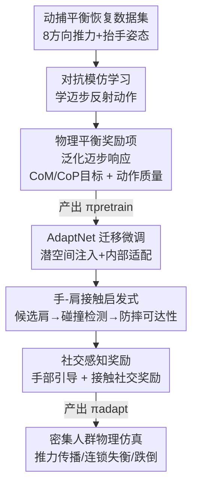

# Push-and-Step: From RL-Based Balance Recovery to Physical Simulation of Dense Crowds

**会议**: CVPR 2026  
**论文**: [CVF Open Access](https://openaccess.thecvf.com/content/CVPR2026/html/Jensen_Push-and-Step_From_RL-Based_Balance_Recovery_to_Physical_Simulation_of_Dense_CVPR_2026_paper.html)  
**代码**: https://github.com/alexis-jensen/Push-and-Step  
**领域**: 强化学习 / 物理仿真 / 人群模拟  
**关键词**: 平衡恢复, 密集人群, 物理仿真, 两阶段RL, 手部接触启发式

## 一句话总结
用两阶段深度强化学习训练全身仿真人形 agent：第一阶段靠模仿学习+平衡奖励学会被推后用「迈步」恢复平衡，第二阶段用 AdaptNet 微调 + 手-肩接触启发式扩展到多 agent 场景，最终能物理仿真密集人群中推力传播、连锁失衡乃至跌倒的真实现象。

## 研究背景与动机
**领域现状**：传统人群仿真把人简化成 2D 圆盘/椭圆/粒子，关注的是中等密度下的导航与社交避让（collision avoidance），核心是「局部交互规则」。这套范式在地铁早高峰、演唱会前排这种**极高密度**场景里失效——这里人和人之间是真·物理接触，推力会沿身体一路传导。

**现有痛点**：哪怕是目前最细致的密集人群模型，也用的是基于粒子的 2D 表示。它们能近似刻画「推力传播波」的宏观现象，却完全无法解释力**在肢体层面**是怎么被传递、放大的——谁的手撑在谁的肩上、重心怎么偏、什么时候不得不迈一步。而正是这些机制决定了现实中的踩踏、挤压伤害。换句话说，2D 几何抓不住「力、运动、能量」三件事，而这三件事才是安全分析真正需要的。

**核心矛盾**：要刻画肢体级的力传导，就必须上**全身物理仿真**；但全身仿真的人形在密集人群中要同时做到「自己站稳」和「不把邻居推倒/还得借邻居撑一把」，这是个高维、多体、强耦合的控制难题，传统手工状态机和轨迹优化都吃不消。

**本文目标**：(1) 让单个仿真人形在任意方向/强度/时长的推力下用迈步恢复平衡；(2) 把这个单体策略扩展到多 agent，让 agent 学会在密集人群里用「手撑邻居肩膀」这种社交上得体、力学上高效的方式分散能量；(3) 仿真能扩展到大规模人群，复现真实实验里观察到的推力传播趋势。

**切入角度**：作者观察到人类维持平衡有三套机制——肌肉刚度吸收小扰动、踝/髋关节旋转应对中等扰动、**迈步**扩大支撑面（BoS）耗散大扰动；而在密集人群里还多了一招：用手撑邻居。于是把「迈步 + 手部接触」当作核心动作词汇，用 RL 去学这套 push-and-recover 的通用行为，而不是死记一组固定参考动作。

**核心 idea**：两阶段 RL——先在单体上用模仿学习+物理平衡奖励学会泛化的迈步恢复，再用 AdaptNet 微调+在线手-肩接触启发式把它「升级」成会社交互动的多 agent 策略。

## 方法详解

### 整体框架
所有 agent 都是物理仿真的人形，由 PD 伺服（proportional-derivative servo）直接驱动，控制策略输出的是「目标姿态」喂给 PD 伺服算关节力矩。整套训练分两阶段：

第一阶段（Section 4，产出 $\pi_\text{pretrain}$）：单 agent，用对抗模仿学习（GAN-like）模仿一份动捕的平衡恢复数据集，并叠加多个**物理平衡奖励**项，让策略能泛化到数据集没覆盖的推力条件。此时 agent 会迈步、会抬手，但还不会真正利用手去撑别人。

第二阶段（Section 5，产出 $\pi_\text{adapt}$）：不重新训练，而是用 AdaptNet 架构**微调** $\pi_\text{pretrain}$，把场景扩展到多 agent，引入一个**在线手部接触启发式**来决定双手该撑向哪个邻居的肩膀，再配两个新的社交奖励项把这套接触行为学进去。

### 关键设计

**1. 对抗模仿 + 物理平衡奖励：让单体策略学会「真站稳」而不只是「像数据」**

第一阶段的痛点是：纯模仿学习只会复刻动捕里那几条固定轨迹，一旦推力的方向/强度超出数据集就抓瞎。作者的做法是在 GAN-like 框架（$\pi_\text{pretrain}$ 当生成器，PPO 做后端优化，目标 $\mathcal{L}_\pi = \mathrm{E}_t[A_t \log \pi(\mathbf{a}_t|\mathbf{s}_t)]$，状态 $\mathbf{s}_t$ 是过去 4 帧的位姿、动作 $\mathbf{a}_t$ 是喂 PD 伺服的目标姿态）之上，把奖励拆成三块 $r_\text{pretrain} = w_i \tfrac{1}{2}(r_\text{imit}+1) + w_g r_\text{balance} + w_q r_\text{quality}$（权重 $w_i=0.6, w_g=0.2, w_q=0.2$）。

其中真正让策略「懂物理」的是 $r_\text{balance}$：它拿当前的质心 CoM 和压力中心 CoP 去和**启发式推出的目标值**比，$r_\text{balance} = e^{-\|\text{CoM}-\text{CoM}_\text{target}\|} + e^{-\|\text{CoP}-\text{CoP}_\text{target}\|}$。目标 CoM 取支撑面中心抬到静息高度（鼓励直立）；目标 CoP 则按动量调节模型算——双脚着地时调 CoP 让身体弯曲来稳，一旦必须迈步，悬空脚的落点就成了有效 CoP，要放在能抵消身体动量的位置：

$$\text{CoP}_{\text{target},x} = \text{CoM}_x + \frac{d_l p_x}{f_z}\text{CoM}_z + \frac{d_h L_y}{f_z}, \quad \text{CoP}_{\text{target},y} = \text{CoM}_y + \frac{d_l p_y}{f_z}\text{CoM}_z - \frac{d_h L_x}{f_z}$$

这里 $p$ 是线动量、$L$ 是角动量、$f_z$ 是竖直地反力，$d_l=4, d_h=6$ 是无量纲阻尼因子用来预判速度变化。把目标落点写成动量的函数，等于把「该往哪迈一步」这件事用物理量定死了，策略只要去逼近它就能在任意推力下泛化——消融里去掉 $r_\text{balance}$ 后 agent 平均只能扛 21 N 的推力，而完整策略能扛约 230 N，差了一个数量级。

**2. 动作质量奖励：堵住「站是站住了但动作很假」的退路**

光有平衡奖励，策略可能学出一些「平衡但低保真」的怪动作——脚在地上滑、身子乱转、肢体瞎抖。作者加了 $r_\text{quality} = \tfrac{1}{3}(r_\text{foot} + r_\text{heading} + r_\text{effort})$ 三个分项各管一件事：$r_\text{foot}=e^{-\|v_\text{foot,left}+v_\text{foot,right}\|}$ 罚着地脚的滑动；$r_\text{heading}=e^{-\|\theta_\text{root}-\theta_\text{original}\|}$ 罚朝向偏离；$r_\text{effort}=e^{-E_k}$ 罚多余动作，其中 $E_k = -\tfrac{1}{M}\sum_{l\in\text{limb}}\tfrac{1}{2}m_l v_l^2$ 是按各肢体速度近似的总动能（归一化到总质量）。

配套的训练技巧是把一段「原地静止」的参考动作也塞进数据集，让所有迈步动作的状态空间都锚定在中性站姿附近——一离开这个区域就进入差异明显的状态，帮策略清楚分辨「现在该执行哪种行为」。推力在训练时全方向随机采样（70–200 N、持续 0.7–1.3 s，对应真实人际推搡的实验观测），初始关节再加 ±10° 噪声增强鲁棒性。消融显示去掉 $r_\text{imit}$ 朝向偏差从 5.93° 飙到 44.81°，去掉 $r_\text{quality}$ 脚滑从 22 cm 涨到 49 cm、动能从 933 J 涨到 1444 J——两个奖励各司其职，缺一不可。

**3. AdaptNet 迁移 + 社交奖励：不重训，把单体策略「升级」成会社交的多体策略**

第二阶段的难点是多 agent 交互的状态空间比单体复杂太多，从头训会很贵也容易丢掉已学会的迈步能力。作者借 AdaptNet 做迁移：冻结 $\pi_\text{pretrain}$，通过**潜空间注入**（给生成器加新嵌入层，接纳变长的输入向量——因为 $\mathbf{s}_t$ 现在要多带双手的目标接触位置）和**内部适配**（在生成器已有 MLP 旁并联新 MLP 产生新动作）微调出 $\pi_\text{adapt}$，既学到手部接触新行为又保住原有迈步反射。

训练时每个 episode 用三类场景混合：三 agent 排成列/横排（只训中间那个，其余由 $\pi_\text{adapt}$ 控制当陪练）、单 agent 全向推（无邻居，纯迈步）、无扰动基线。奖励在 $r_\text{pretrain}$ 上扩两项 $r_\text{adapt} = w_p r_\text{pretrain} + w_h r_\text{hands} + w_s r_\text{social}$（$w_p=0.5, w_h=0.2, w_s=0.3$）。$r_\text{hands}=\sum_{\text{hand}\in\{L,R\}}(e^{-\|\mathbf{p}_\text{hand}-\hat{\mathbf{p}}_\text{hand}\|}+e^{-\|\theta_\text{hand}-\hat{\theta}_\text{hand}\|})$ 把手引向启发式给的目标位置/朝向；$r_\text{social}$ 则在接触发生的有限帧里累积惩罚接触反力 $F_\text{contact}$ 和最大放置误差 $\Delta^\tau_\text{hand}=\max(\delta^\tau_\text{hand}, \Delta^{\tau-1}_\text{hand})$，强调「持续、轻、到位」的社交得体接触。消融里去掉 $r_\text{hands}$，手会一直举着不放下（静息高度 0.81 m，去掉后停在 1.16 m）；去掉 $r_\text{social}$，手干脆不抬、放任头/躯干被撞，传递冲量从 40 Ns 涨到 74 Ns。

**4. 在线手-肩接触启发式：用力学规则替代「没有的多人交互数据」，决定撑谁的肩**

这是把单体策略搬进真实人群最关键的「外挂」。多人物理接触数据极难采集（实验/安全/标注都难），作者没有去学一个接触模块，而是工程化一个在线启发式：每帧拿控制 agent 和周围 agent 的状态，输出双手的目标接触位置/朝向，并把候选接触点限定在**邻居的肩膀**（实证研究指出肩膀是密集人群里最高频、力学上最高效的接触点）。

启发式按三层逻辑选靶：① **候选集** $\mathcal{S}_\mathcal{N}$ 取前方 5 m 内邻居的左右肩；② **碰撞检测**——按当前线动量 $\vec{L}$ 预测自己肩膀未来 1 s 的轨迹 $p_\text{shoulder}(t)$，若它到某候选肩的最小距离 $\min_{t\in[0,1]}\min_{S_i}\|p_\text{shoulder}(t)-S_i\|<\delta$（$\delta=0.25$ m，半个躯干宽）就判为碰撞风险，选最近的肩当手靶，意在用手改向、避免头/躯干被撞；③ **防摔可达性**——对碰撞检测后还空着的手，从 $\mathcal{S}_\mathcal{N}$ 里按可达性挑：候选肩到外推肩位 $p_\text{shoulder}(1)$ 的距离要 $<0.6$ m（人均臂长）且 $>0.1$ m（避免已接触还抬手），在所有可达肩里用 $(p_\text{shoulder}(1)-S_i)$ 与线动量 $\vec{L}$ 的**共线性**选耗散能量最高效的那个。这套规则把「该撑谁、怎么撑」用力学量算清楚，既绕开了数据稀缺，又天然符合「优先撑肩、动作简短、考虑他人」的社交规范。

### 损失函数 / 训练策略
后端 RL 用 PPO，第一阶段奖励 $r_\text{pretrain}$（模仿 0.6 + 平衡 0.2 + 质量 0.2），判别器用 hinge loss 在 $[-1,1]$ 训练、其输出再平移到 $[0,1]$ 对齐其他奖励。第二阶段奖励 $r_\text{adapt}$（pretrain 0.5 + hands 0.2 + social 0.3），通过 AdaptNet 冻结主干微调。训练场景每幕最多 3 个 agent（假设被推者至多和两个邻居发生物理交互），推理时可泛化到任意数量、任意位姿的人群。

## 实验关键数据

### 主实验（消融为主，定量验证奖励设计）
第一阶段在 80 次推力试验（16 方向 × 5 个 50–300 N 力级）上评估，逐项去掉奖励看退化：

| 配置 | 朝向偏差↓ | 脚滑↓ | 动能↓ | 说明 |
|------|----------|-------|-------|------|
| $\pi_\text{pretrain}$（完整） | 5.93° | 22 cm | 933 J | 抗推约 230 N |
| No $r_\text{imit}$ | 44.81° | 24 cm | 2381 J | 朝向乱、动作不自然 |
| No $r_\text{quality}$ | 13.19° | 49 cm | 1444 J | 严重脚滑、动能翻倍 |
| No $r_\text{balance}$ | — | — | — | 仅抗推约 21 N（数量级崩塌） |

### 消融实验（第二阶段社交接触，90 次试验：9 方向 × 2 队形 × 5 力级）

| 配置 | 终态手高↓ | 最大手高 | 传递冲量↓ | 说明 |
|------|----------|---------|----------|------|
| $\pi_\text{adapt}$（完整） | 0.81 m | 0.85 m | 40 Ns | 需要时才撑、用完即放下（中性手高 0.81 m） |
| No $r_\text{hand}$ | 1.16 m | 1.16 m | 75 Ns | 手一直举着不回中性 |
| No $r_\text{social}$ | 0.81 m | 0.81 m | 74 Ns | 手不抬、放任头/躯干被撞 |

### 关键发现
- **$r_\text{balance}$ 是命门**：去掉后抗推能力从 ~230 N 跌到 21 N，说明把目标 CoM/CoP 写成动量函数这一物理先验，几乎承担了「泛化到任意推力」的全部能力。
- **两个社交奖励一个管「收」一个管「放」**：$r_\text{hand}$ 负责用完把手放回中性（否则一直举着，手高 1.16 m），$r_\text{social}$ 负责该抬时抬（否则手不动、冲量从 40 涨到 74 Ns），缺任一手部行为都不得体。
- **复现真实人群现象**：5 人排队场景里，按人际距离不同复现了三种真实趋势——臂长距离（0.8 m）远端不受影响、肘距（0.6 m）前排耗散部分能量、近距（0.4 m）空间不足导致动量累积、末端被强推；冲量-速度关系也匹配真实实验的线性回归。
- **$\pi_\text{pretrain}$ 单独不够**：补充材料的消融证明，没有第二阶段适配，预训练策略无法处理多 agent 复杂度。

## 亮点与洞察
- **把「该往哪迈步」用动量物理量定死**：目标 CoP 写成线/角动量的显式函数，等于给 RL 注入了强物理先验，这是它能从单受试者小数据集泛化到全向任意推力的根本原因——可迁移到任何需要平衡控制的足式机器人/角色动画任务。
- **用启发式补数据稀缺，而不是硬学**：多人物理接触数据几乎采不到，作者干脆把「撑谁的肩」工程化成碰撞检测+可达性+共线性三条力学规则，既绕开数据瓶颈又自带可解释性；作者也坦言这个启发式将来有多人交互数据后可以换成学习模块。
- **AdaptNet 冻结主干 + 旁路微调**：不重训、只在生成器旁并联 MLP 并注入潜空间，既保住已学的迈步反射又长出手部接触新技能——这种「能力叠加」的迁移范式对多技能角色控制很有借鉴价值。
- **最 aha 的点**：它不是在「演」人群，而是真把力学跑出来——推力沿排队人群像多米诺一样传播、近距时动量累积放大、极密人群小扰动触发混乱四散与跌倒，这些都是仿真自发涌现、且与真实实验对得上的，让人群安全分析第一次有了肢体级的物理依据。

## 局限与展望
- **数据集太小**：只用了单受试者、XSens 动捕的平衡恢复数据，动作多样性有限、存在风格偏差，这也是作者退而用手工启发式而非学习接触模块的直接原因。
- **只做静态场景**：当前只处理「站着被推」的静态构型，没有行走。作者指出扩展到 locomotion 才能让平衡恢复与导航协同；不过高密度人群本就常退化为静态（如交通拥堵），所以静态版可作为更复杂接触场景的扎实基线。
- **渲染与仿真体型不一致**：底层用球/盒/椭球等简单几何体仿真，再套 SMPL 渲染，二者差异会带来视觉穿模等 artifact。
- **启发式的硬阈值**：碰撞阈值 0.25 m、可达 0.1–0.6 m、候选 5 m 等都是固定常数，换体型/场景可能需要重调；未来若有多人交互数据可替换为学习模块。

## 相关工作与启发
- **vs 基于粒子的 2D 密集人群模型（[14,50,57]）**：它们能复现宏观推力传播波，但抓不住肢体级的力传导机制；本文用全身物理仿真，第一次能解释力如何在身体上被传递、放大——代价是计算更重、需要全身控制策略。
- **vs 纯动作模仿的物理角色控制（[39,64] 等）**：纯模仿只会复刻参考动作，本文在模仿之上叠加 CoM/CoP/动量物理奖励，把「平衡」从「像数据」升级成「真站稳」，从而泛化到数据外的推力。
- **vs 研究瞬时扰动/跌倒后恢复的工作（[40,66,21]）**：本文聚焦的是力随时间动态变化、施加在肩部、冲量更强且从中性站姿起步的「有机推搡」，惯性变化更大、更难，更贴近真实人群场景。
- **vs AdaptNet 原文（[66]）**：本文复用其潜空间注入+内部适配的迁移机制，但用途是把单体平衡策略扩到社交感知的多 agent 接触，并配套自研的手-肩接触启发式与社交奖励。

## 评分
- 新颖性: ⭐⭐⭐⭐⭐ 首个完全用全身物理仿真做密集人群接触动力学的工作，物理平衡先验+社交接触启发式的组合很扎实。
- 实验充分度: ⭐⭐⭐⭐ 奖励消融充分、能复现真实排队实验的多条趋势；但缺与其他方法的横向定量对比，且依赖单受试者数据。
- 写作质量: ⭐⭐⭐⭐ 物理量定义清晰、公式完整、动机推导顺畅；部分奖励项细节需对照补充材料。
- 价值: ⭐⭐⭐⭐⭐ 为人群安全（踩踏/挤压）提供了肢体级物理仿真基础，对建筑/大型活动规划与角色动画都有实用价值。

<!-- RELATED:START -->

## 相关论文

- [\[ICML 2026\] MFPO: 用 Few-step MeanFlow Policy 把 MaxEnt RL 跑到接近 Gaussian policy 的速度](../../ICML2026/reinforcement_learning/mean_flow_policy_optimization.md)
- [\[NeurIPS 2025\] CORE: Constraint-Aware One-Step Reinforcement Learning for Simulation-Guided Neural Network Accelerator Design](../../NeurIPS2025/reinforcement_learning/core_constraint-aware_one-step_reinforcement_learning_for_simulation-guided_neur.md)
- [\[AAAI 2026\] One-Step Generative Policies with Q-Learning: A Reformulation of MeanFlow](../../AAAI2026/reinforcement_learning/one-step_generative_policies_with_q-learning_a_reformulation_of_meanflow.md)
- [\[ICML 2026\] Beyond Scalar Rewards: Dense Feedback for LLM Policy Synthesis in Sequential Social Dilemmas](../../ICML2026/reinforcement_learning/beyond_scalar_rewards_dense_feedback_for_llm_policy_synthesis_in_sequential_soci.md)
- [\[CVPR 2025\] GROVE: A Generalized Reward for Learning Open-Vocabulary Physical Skill](../../CVPR2025/reinforcement_learning/grove_a_generalized_reward_for_learning_open-vocabulary_physical_skill.md)

<!-- RELATED:END -->
