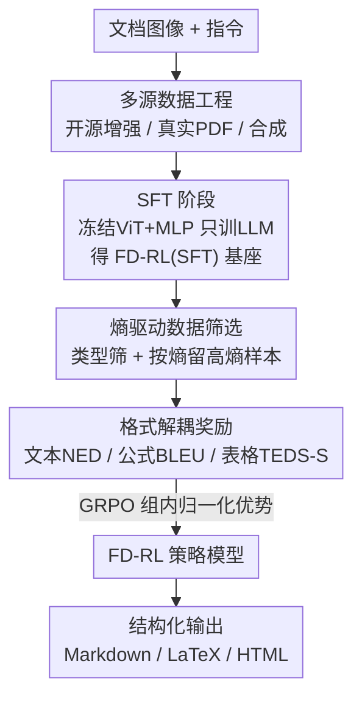

# Reading or Reasoning? Format Decoupled Reinforcement Learning for Document OCR

**会议**: CVPR 2026  
**论文**: [CVF Open Access](https://openaccess.thecvf.com/content/CVPR2026/html/Zhong_Reading_or_Reasoning_Format_Decoupled_Reinforcement_Learning_for_Document_OCR_CVPR_2026_paper.html)  
**代码**: https://github.com/DocTron-hub/FD-RL  
**领域**: 强化学习 / 文档OCR  
**关键词**: 文档OCR、格式解耦、强化学习、GRPO、熵筛选

## 一句话总结
作者发现 OCR 模型在公式、表格等格式化文本上的输出熵比纯文本高一个数量级（说明这里才是真正的"硬骨头"），于是提出 FD-RL：先 SFT 打好阅读底子，再用"按熵筛数据 + 按格式分类型给奖励"的强化学习专门攻坚格式化内容，在 OmniDocBench 上拿到 90.41 的总分，成为端到端模型里极具竞争力的方案。

## 研究背景与动机

**领域现状**：文档 OCR 正从"先检测版面、再分区域解析"的传统流水线，转向用一个视觉语言模型（VLM）直接把图像解码成结构化文本（Markdown/LaTeX/HTML）的端到端范式（如 DeepSeek-OCR、dots.ocr、PaddleOCR-VL）。这条路线灵活、跨域泛化好，主流做法是堆数据工程 + 监督微调（SFT）。

**现有痛点**：大家默认"读字是个直觉性的感知任务"，于是把精力全砸在数据规模和清洗上。但作者做了一项关键统计：在大语料上用 Qwen3-VL 推理，按"格式化文本占比"把文档分成 20%/40%/60%/80%/100% 五档，发现**格式化文本占比越高，token 输出熵越高，往往高出纯文本一个数量级**。高熵意味着模型对这些 token 极不确定、容易出错——公式和表格才是端到端 OCR 真正的失败重灾区，而纯靠 SFT 的 token 级监督会把这些"格式错误"淹没在海量"内容正确"的 token 里。

**核心矛盾**：公式、表格这类内容携带复杂的视觉-结构逻辑，需要"推理"而非简单"感知"——同一个公式可以有多条语义等价的读法（`1/2` 与 `\frac{1}{2}`）。SFT 的逐 token 模仿目标天然偏向"背诵某一条参考序列"，无法奖励这种多样化的合法读法；而高熵 token 恰恰是引导语言模型走向多样推理路径的"岔路口"，是强化学习的天然信号源，却被以往工作忽视。

**本文目标**：(1) 把强化学习的优化算力精准投到高熵的格式化内容上；(2) 让奖励对"格式是否合法/结构是否一致"敏感，而不是对"逐字是否背对"敏感。

**核心 idea**：用"读完再推理"（reasoning-after-reading）的 SFT-then-RL 两阶段范式，配合**按熵筛数据**和**按格式类型解耦的奖励**，把强化学习火力对准公式和表格——做的是格式级的校验，而不是 token 级的记忆。

## 方法详解

### 整体框架
FD-RL 以 Qwen3-VL-4B 为底座，分两个阶段训练。**阶段一 SFT**：在一个自建的大规模、富格式语料上做监督微调，冻结视觉编码器（ViT）和投影 MLP、只更新语言模型，把算力集中在序列解码和格式生成上，得到一个强 OCR 基座 FD-RL(SFT)。**阶段二 RL**：先用 SFT 模型给候选样本算平均熵、按熵筛出"最难"的格式密集样本，再用 GRPO 在这些样本上训练；GRPO 采样多条回答后，用一个"按格式类型解耦"的奖励函数给每条回答打分、组内归一化成优势值来更新策略。整条管线的灵魂是：**把数据工程、数据筛选、奖励设计三处都对齐到"格式化内容"这个痛点上**。

### 关键设计

**1. 多源数据工程：先把"读"的底子打厚打全**

强化学习能调优的前提是 SFT 基座足够强，而格式密集的高质量 OCR 数据天生稀缺。作者用三条线构建语料：(a) **开源数据集质量增强**——收集 PDFA、DocStruct4M、DocGenome 等，发现普遍存在"漏内容、阅读顺序错、句子重复"问题，于是用轻量 OCR 模型 GOT 重标注，再用"原标注 vs VLM 标注"的相似度过滤、**只保留高相似样本**（且保留原始标注当 ground truth，避免过拟合到 VLM 的风格）；(b) **真实 PDF 构建**——分版面感知（页级用 MinerU 出 Markdown、Mathjax 校验 LaTeX、Text-Dedup 去重；区域级用 Mathpix 出带坐标结果并做彩色框标注 + 空框负样本；多页级拼 2–6 页序列）和内容感知（用 dots.ocr 把公式转 LaTeX、表格转 HTML）两类；(c) **合成 OCR 数据**——从 K12 到研究生的习题、StackExchange 的 STEM 问答出发，用 HTML 模板 + MathJax + CSS 设计版式，再用 Playwright 渲染成高分图像配 Markdown。三条线最终覆盖书籍、笔记、幻灯片、试卷、财报、报纸等九类文档。这一步不是花哨创新，但消融显示它是 90 分的地基（见下文 Table 3）。

**2. 两阶段 SFT-then-RL：先会读，再去推理格式**

为什么不直接对通用 VLM 上 RL？因为基座没有 OCR 专门能力，RL 无从优化。作者把训练拆成"SFT 建立强阅读能力 → RL 专攻格式正确性与结构合法性"。与 SFT 的 token 级目标不同，RL 通过精心设计的奖励给模型**针对格式特定错误的定向反馈**——畸形 LaTeX 语法、断裂的表格层级会在优化中被优先纠正，从而避免"格式错误被海量内容 token 淹没"。消融（Table 4）很说明问题：直接 RL（无 SFT）只到 49.37，SFT 单独已达 87.13，而 SFT+RL 的增益恰恰集中在格式密集任务上——公式 +3.07、表格 TEDS +6.08 / TEDS-S +7.19，印证了 RL 确实在啃 SFT 啃不动的硬骨头。

**3. 熵驱动的数据筛选：把 RL 算力只投到"最不确定"的样本上**

收集 RL 数据时，先做类型筛选（去掉纯文本样本、增富结构化数据、平衡中英文比例），再用 SFT 模型对每个样本推理、取每个 token 的 log 概率，算样本的平均输出熵并按阈值 $\tau$ 保留高熵样本：

$$D_{\text{filtered}} = \left\{ d \in D_{\text{raw}} \;\middle|\; -\frac{1}{N_d}\sum_{i=1}^{N_d} \log p_i^{(d)} \ge \tau \right\}$$

其中 $N_d$ 是样本 $d$ 的 token 数、$p_i^{(d)}$ 是第 $i$ 个 token 的概率。高熵 = 结构更复杂、模型更没把握，把 RL 集中在这些样本上能强化"多样推理"能力。这里的筛选率有甜区：Table 5 显示 0%（不筛）只有 88.47，50% 筛选率达到最高 90.41，但筛到 75% 反而跌到 88.58——筛太少没聚焦到高熵难例，筛太多则丢掉了太多有价值的样本。

**4. 格式解耦奖励：不同内容类型用不同的"评分标准"**

这是全文最核心的设计。统一奖励（如对整段输出算一个编辑距离）会让模型为了多数的纯文本而忽视少数但关键的公式/表格。作者用正则把模型输出和 ground truth 都拆成纯文本、公式、表格三类，**各用最契合的奖励**：纯文本用归一化编辑距离 NED（字符级细粒度监督）；公式用 BLEU（n-gram 匹配对局部结构错误更敏感，比编辑距离反馈更锐利、训练更稳）；表格用 TEDS-S（基于 HTML 表示的树编辑距离，专门衡量结构一致性）。公式和表格在打分前都做语法归一化以容忍等价写法。整体奖励对"该类型 ground truth 非空"的类别求平均：

$$R = \frac{\sum_{c=1}^{C} \mathbb{I}[|GT_c| > 0]\cdot f_c(\text{Pred}_c, GT_c)}{\sum_{c=1}^{C} \mathbb{I}[|GT_c| > 0]}$$

其中 $C$ 是内容类型数，$f_c$ 是第 $c$ 类的奖励函数，$\mathbb{I}[\cdot]$ 是指示函数。还设了一个**回退机制**：当正则解析失败时，所有奖励退化为字符级的字符串匹配奖励，保证模型仍拿到非零监督、不会因稀疏的零奖励而训练崩溃。消融（Table 6）逐项加上去：统一 NED 88.64 → 加格式解耦 89.61（+0.97）→ 公式换 BLEU 89.80 → 表格换 TEDS-S 90.41，每一步都在涨，证明"按类型给专属奖励"确实有效。

### 损失函数 / 训练策略
RL 阶段用 GRPO：对每个输入 $x$ 从旧策略 $\pi_{\theta_{old}}$ 采样 $G$ 条回答 $\{o_1,\dots,o_G\}$，算各自奖励 $R_i$，组内归一化得优势 $A_i = \dfrac{R_i - \text{mean}(\{R_j\})}{\text{std}(\{R_j\})}$，再以带 clip 的 PPO 式目标优化策略，无需单独的 critic。SFT 阶段冻结 ViT 与投影 MLP、仅更新 LLM，并从三类数据源渐进式采样。

## 实验关键数据

### 主实验（OmniDocBench，1355 页 / 九类文档 / 中英双语）
总分定义为 $\text{Overall} = \frac{(1-\text{TextEdit})\times100 + \text{Formula}_{CDM} + \text{Table}_{TEDS}}{3}$。下表对比端到端专用 VLM（节选）：

| 方法 | 端到端 | Overall↑ | TextEdit↓ | Formula CDM↑ | Table TEDS↑ | Table TEDS-S↑ | RO Edit↓ |
|------|:---:|------|------|------|------|------|------|
| GPT-4o | ✓ | 75.02 | 0.217 | 79.70 | 67.07 | 76.09 | 0.148 |
| DeepSeek-OCR | ✓ | 87.01 | 0.073 | 83.37 | 84.97 | 88.80 | 0.086 |
| dots.ocr | ✓ | 88.41 | 0.048 | 83.22 | 86.78 | 90.62 | 0.053 |
| **FD-RL（本文）** | ✓ | **90.41** | 0.049 | **88.67** | **87.35** | **92.10** | 0.055 |
| PaddleOCR-VL（流水线） | ✗ | 92.56 | 0.035 | 91.43 | 89.76 | 93.52 | 0.043 |

FD-RL 在端到端模型中总分第一，比 dots.ocr 高 2.0、比 DeepSeek-OCR 高 3.4；公式 CDM 88.67、表格 TEDS 87.35 / TEDS-S 92.10 均为端到端最佳；文本编辑距离 0.049 仅次于 dots.ocr（0.048）。在分文档类型上（Table 2），九类里拿下 4 类第一、其余 5 类第二，幻灯片（0.0235）和试卷（0.0464）编辑距离全场最低。

### 消融实验

| 配置 | Overall↑ | 说明 |
|------|------|------|
| 无任何训练数据 | 46.06 | 起点 |
| + 开源数据 | 78.25 | +32.19，建立基础 OCR 能力 |
| + 真实 PDF | 84.16 | +5.91，提升版面鲁棒性 |
| + 合成数据 | 87.13 | +2.97，强化公式/表格 |
| + RL 数据（完整 FD-RL） | **90.41** | +3.28，SFT 与 RL 协同 |

熵筛选率消融（Table 5）：0% → 88.47，25% → 89.53，**50% → 90.41（最佳）**，75% → 88.58。
奖励解耦消融（Table 6）：统一 NED 88.64 → +格式解耦 89.61 → +公式 BLEU 89.80 → +表格 TEDS-S 90.41。

### 关键发现
- **RL 的增益高度集中在格式化内容**：相比纯 SFT（87.13），完整 SFT+RL 在公式 +3.07、表格 TEDS +6.08 / TEDS-S +7.19，而文本编辑距离只从 0.055 微降到 0.049——印证了"熵高的地方才是 RL 该发力的地方"这一核心假设。
- **两阶段缺一不可**：无 SFT 直接 RL 只有 49.37，说明没有阅读底子时 RL 无的放矢；SFT 提供地基、RL 负责攻坚。
- **筛选率存在甜区**：50% 最优，过松（0%/25%）聚焦不够、过严（75%）丢样本太多，呈倒 U 形。
- **奖励每一项都正贡献**：从统一 NED 到三类专属奖励逐步累加，每步都涨分，其中"格式解耦"这一步贡献最大（+0.97）。

## 亮点与洞察
- **以"熵"为透镜重新定义 OCR 的难点**：把"读字 = 感知任务"的默认认知翻过来——用一张"格式占比 vs token 熵"的统计图，论证公式/表格是需要"推理"的高不确定区，这个观察直接串起了筛数据、给奖励两处设计，是全文最漂亮的一笔。
- **奖励解耦 + 回退机制很务实**：不同结构用不同度量（NED/BLEU/TEDS-S）本就合理，而正则解析失败时退化为字符级奖励、避免稀疏零奖励导致训练崩溃，是真正打磨过工程细节的设计。
- **"按熵筛样本"可迁移**：用 SFT 模型自己的平均熵当难度信号来挑 RL 训练样本，这套"让模型自报不确定度、再把算力投到难例"的思路，可直接迁移到代码生成、数学推理等任何 RLVR 任务。

## 局限与展望
- **仍逊于最强流水线方案**：FD-RL 90.41 仍低于流水线式的 PaddleOCR-VL（92.56）和 MinerU2.5（90.67），端到端范式在精度上线尚未追平专门化流水线。
- **依赖外部模型造数据**：开源数据重标注靠 GOT、真实 PDF 标注靠 MinerU/Mathpix/dots.ocr——标注质量受这些"教师"上限约束，可能把它们的系统性错误一并继承。
- **熵阈值与筛选率需调**：50% 是经验最优且呈倒 U 形，换数据分布或底座规模后甜区是否漂移、$\tau$ 如何自适应设定，论文未深入。
- **只在 OmniDocBench 验证**：单一基准上的优势能否泛化到更长文档、手写体、低质量扫描件等极端场景，缺少跨基准证据。

## 相关工作与启发
- **vs 传统流水线 OCR（MinerU、PP-StructureV3）**：他们先版面检测再分区解析，稳定但灵活性差、领域定制成本高；FD-RL 是端到端单次前向，泛化更好，但当前精度仍略低于最强流水线。
- **vs 纯 SFT 的端到端 VLM（dots.ocr、DeepSeek-OCR、POINTS-Reader）**：他们靠数据工程 + SFT 堆能力；本文指出 SFT 的 token 级目标搞不定高熵格式化内容，补一层针对格式的 RL，把公式/表格指标拉到端到端最佳。
- **vs 早期 RL-based OCR（设计复合奖励优化版面/阅读顺序）**：他们凭经验拼 RL 数据集和奖励，没考虑高熵格式化文本；FD-RL 用熵把"该练什么"和"该奖什么"系统地对齐到格式痛点上，方法论更自洽。

## 评分
- 新颖性: ⭐⭐⭐⭐ 用熵这个统一视角串起数据筛选与奖励解耦，把 OCR 重新框成"格式推理"问题，切入角度新颖。
- 实验充分度: ⭐⭐⭐⭐ 数据/训练/筛选/奖励四组消融完整且自洽，但只在 OmniDocBench 单基准验证。
- 写作质量: ⭐⭐⭐⭐ 动机—方法—实验逻辑闭环，熵观测的引入很有说服力。
- 价值: ⭐⭐⭐⭐ 端到端 OCR 的强基线 + 开源代码，"按熵选样本/按格式给奖励"的范式对其他 RLVR 任务有迁移价值。

<!-- RELATED:START -->

## 相关论文

- [\[CVPR 2026\] AnyDoc: Enhancing Document Generation via Large-Scale HTML/CSS Data Synthesis and Height-Aware Reinforcement Optimization](anydoc_enhancing_document_generation_via_large-scale_htmlcss_data_synthesis_and_.md)
- [\[ICLR 2026\] AutoTool: Automatic Scaling of Tool-Use Capabilities in RL via Decoupled Entropy Constraints](../../ICLR2026/reinforcement_learning/autotool_automatic_scaling_of_tool-use_capabilities_in_rl_via_decoupled_entropy_.md)
- [\[AAAI 2026\] Vision-Language Reasoning for Geolocalization: A Reinforcement Learning Approach](../../AAAI2026/reinforcement_learning/vision-language_reasoning_for_geolocalization_a_reinforcement_learning_approach.md)
- [\[ICLR 2026\] LoongRL: Reinforcement Learning for Advanced Reasoning over Long Contexts](../../ICLR2026/reinforcement_learning/loongrl_rl_for_reasoning_long_contexts.md)
- [\[ICML 2026\] InftyThink+: Effective and Efficient Infinite-Horizon Reasoning via Reinforcement Learning](../../ICML2026/reinforcement_learning/inftythink_effective_and_efficient_infinite-horizon_reasoning_via_reinforcement_.md)

<!-- RELATED:END -->
