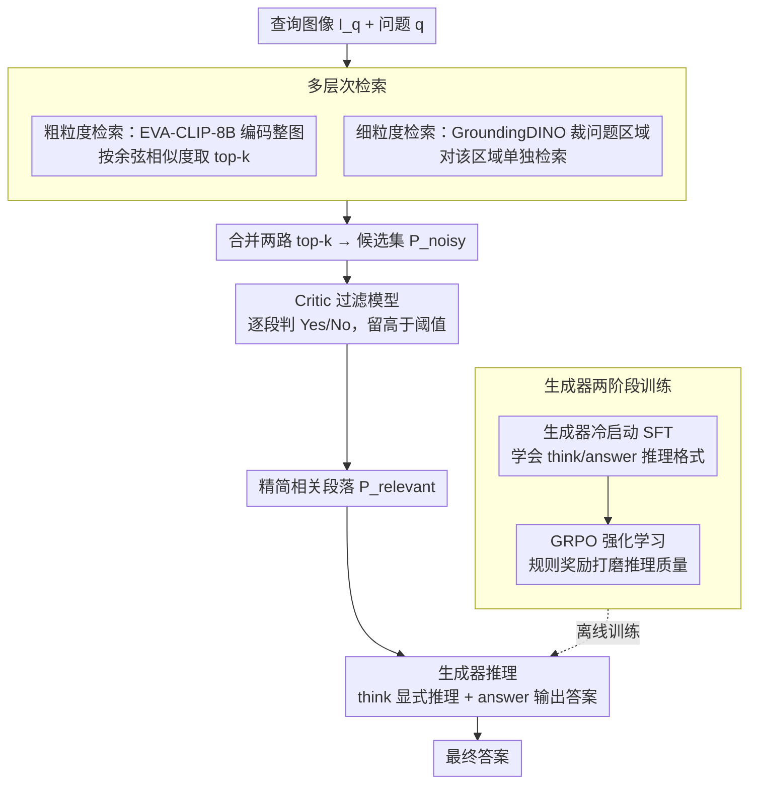

# ReAG: Reasoning-Augmented Generation for Knowledge-based Visual Question Answering

**会议**: CVPR 2026  
**arXiv**: [2511.22715](https://arxiv.org/abs/2511.22715)  
**代码**: [aimagelab.github.io/ReAG](https://aimagelab.github.io/ReAG)  
**领域**: 强化学习  
**关键词**: KB-VQA, RAG, 强化学习, 推理增强, 多模态检索

## 一句话总结

提出 ReAG，一个推理增强的多模态 RAG 方法，结合粗细粒度检索与 Critic 过滤模型减少噪声，并通过 GRPO 强化学习训练生成器进行显式推理，在知识密集型 VQA 上达到新 SOTA。

## 研究背景与动机

知识密集型视觉问答（KB-VQA）要求模型回答超出视觉内容本身的领域特定问题，需要从外部知识库（如 Wikipedia）中检索相关信息来辅助回答。即便是最先进的多模态大语言模型（MLLMs），在面对预训练数据中表示不足的领域知识时也表现不佳。

现有的检索增强方法存在两个核心问题：

**检索噪声大**：用户查询高度异质，外部知识库可达百万级文档，导致检索召回率低、噪声多，向 MLLM 输入了大量无关段落

**推理能力弱**：即使检索到了相关文档，从中提取正确信息并推理出答案并非易事，现有方法缺乏对检索内容的显式推理能力

ReAG 的核心思路是**先过滤、再推理**：通过多层次检索 + Critic 过滤减少噪声输入，再通过强化学习训练生成器具备对检索内容的显式推理能力。

## 方法详解

### 整体框架

ReAG 想解决的是知识密集型 VQA 的两个老大难：检索回来的文档太吵、生成器又不会从证据里推理。它把这两件事拆开治——先用一条"粗+细两级检索 → Critic 过滤"的流水线在进入生成器之前就把噪声压下去，再用"SFT 冷启动 → GRPO 强化学习"两阶段训练，逼生成器学会对留下来的高质量证据做显式推理。一次完整问答的数据流是：查询图像和问题先经过多层次检索拿到一批候选段落 $\mathcal{P}^{noisy}$，Critic 模型逐段判相关性、滤成精简的 $\mathcal{P}^{relevant}$，最后生成器在 `<think>` 里推理、在 `<answer>` 里给出答案；而生成器本身则由 SFT 冷启动和 GRPO 强化学习两阶段离线训练得到。

### 关键设计

**1. 多层次检索：用细粒度区域检索补全图检索漏掉的细节**

单走一遍全图检索，召回率往往不够——问题问的可能是图里某个不起眼的局部，整图编码的相似度会把它淹没。ReAG 因此叠加两级检索：粗粒度用 EVA-CLIP-8B 把整张查询图编码，按余弦相似度从知识库取 top-k，得到候选集 $\mathcal{P}^{cg}$；细粒度则先用 GroundingDINO 检测问题里提到的视觉主体、裁出关注区域，再对这块区域单独检索，得到 $\mathcal{P}^{fg}$。两路结果按相关性合并、保留 top-k 段落，拼成待过滤的 $\mathcal{P}^{noisy}$。细粒度这一路的价值就在于把检索焦点从"整张图"收到"问题真正关心的那块区域"，召回那些被全图相似度埋掉的相关文档。

**2. Critic 过滤模型：在进生成器之前先把无关段落剔掉**

检索的两难在于：调大 k 能提召回，却把精度一起拉低，给 MLLM 灌进一堆无关段落。ReAG 的解法是在检索和生成之间插一个专职的相关性裁判。它基于 Qwen2.5-VL-3B 微调成一个自回归 MLLM，输入 $(I_q, q, p)$——查询图、问题、单个候选段落——只判这一段是否与问题相关，保留预测"Yes"概率高于阈值的段落，得到精简的 $\mathcal{P}^{relevant}$。这样召回就能放心往高调，噪声留给 Critic 在后面筛掉；而且 Critic 只看 $(I_q, q, p)$、与具体检索骨干完全解耦，可以直接架在任意检索引擎之上。

**3. 生成器冷启动（Cold Start SFT）：先让模型学会按 `<think>/<answer>` 的格式推理**

直接上强化学习，模型连基本的推理格式都没有、奖励信号又稀疏，很难起步。ReAG 借鉴 DeepSeek-R1 的多阶段思路，先做一轮 SFT 当冷启动：从 MLLM 收集高质量推理轨迹 $tr$，用 `<think>` 和 `<answer>` 两个特殊标记把推理过程和最终答案分开。训练目标对这两部分分别加权：

$$\mathcal{L}_{SFT} = \alpha \mathcal{L}_A + (1-\alpha)\mathcal{L}_T$$

其中 $\mathcal{L}_A$、$\mathcal{L}_T$ 分别是答案和推理 token 上的损失，$\alpha=0.8$ 把更大权重压在答案上——既让推理格式被学会，又不让答案的正确性被大量推理 token 稀释。

**4. GRPO 强化学习训练：在冷启动之上真正打磨推理质量**

SFT 只是把推理行为"装上"，证据用得好不好、对噪声鲁不鲁棒还得靠奖励来逼。ReAG 在 GRPO 框架上做强化学习，并吸收了 DAPO 的两点改动：去掉 KL 散度惩罚、改用 token 级损失计算。每次迭代对一个 $(I_q, q, p)$ 采样 $N=8$ 个补全，用规则奖励算出组内相对优势来更新策略。奖励是任务与格式的加权和：

$$R_i = \gamma R_{task}(o_i) + \delta R_{fmt}(o_i),\quad \gamma=1.0,\ \delta=0.2$$

任务奖励 $R_{task}$ 按问题类型（数值/文本、单答案/多答案）解析输出再验证正确性，格式奖励 $R_{fmt}$ 检查是否守住 `<think>...<answer>...` 模板。相比纯 SFT，这一步直接拿答案对错当信号去优化推理过程，消融里它在两个基准上都带来了最后一截提升。

### 损失函数 / 训练策略

训练全程冻结视觉编码器，只更新 MLP 适配器和 LLM 权重。RL 阶段用 Adam 优化器、学习率 $1 \times 10^{-6}$，每批 128 个提示、每提示 8 个补全。SFT 与 RL 的目标函数及奖励权重见上面对应的两个设计点。

## 实验关键数据

### 主实验

使用 EVA-CLIP-8B 作为检索器的结果：

| 数据集 | 指标 | ReAG (3B) | ReflectiVA (3B) | 提升 |
|--------|------|-----------|-----------------|------|
| E-VQA (All) | Accuracy | 42.9 | 35.2 | +7.7 |
| InfoSeek (All) | Accuracy | 43.3 | 38.9 | +4.3 |

| 数据集 | 指标 | ReAG (7B) | VLM-PRF (InternVL3-8B) | 提升 |
|--------|------|-----------|------------------------|------|
| E-VQA (Single-Hop) | Accuracy | 44.9 | 40.1 | +4.8 |
| E-VQA (All) | Accuracy | 47.0 | 39.2 | +7.8 |
| InfoSeek (All) | Accuracy | 47.2 | 42.5 | +4.7 |

使用 OMGM 检索器时性能进一步提升：ReAG (7B) 在 E-VQA 上达到 52.5%，InfoSeek 上达到 49.2%。

使用 Oracle Wikipedia 页面（上界实验）：ReAG (7B) 在 E-VQA 上达到 81.5%，InfoSeek 上达到 59.7%。

### 消融实验

| 配置 | E-VQA (Single-Hop) | InfoSeek (All) | 说明 |
|------|-------|---------|------|
| 无检索（零样本） | 21.9 | 18.3 | 仅靠内部知识 |
| 粗粒度检索 | 19.2 | 10.1 | 噪声段落反而降低性能 |
| 粗+细粒度+Critic | 40.2 | 27.1 | 过滤显著提升 |
| +SFT | 39.3 | 37.5 | 推理能力大幅提升InfoSeek |
| +SFT+推理轨迹 | 38.1 | 41.3 | 显式推理进一步提升 |
| +SFT+RL (ReAG完整) | 41.3 | 43.3 | RL 带来最终提升 |

### 关键发现

1. **Critic 过滤至关重要**：无 Critic 时，粗粒度检索的噪声段落甚至会让性能低于零样本，说明噪声管理是 RAG 系统的关键
2. **RL 优于纯 SFT**：强化学习阶段在两个基准上均带来显著提升，验证了基于奖励的推理优化的有效性
3. **推理轨迹具有可解释性**：模型生成的推理过程可以揭示检索段落的有用性和推导步骤，提供完全的可解释性
4. **ReAG 对检索骨干是无关的（agnostic）**：Critic 模型可无缝置于任何检索引擎之上

## 亮点与洞察

- **过滤优先的设计理念**：不同于大多数 RAG 方法试图让生成器学会处理噪声，ReAG 先通过 Critic 从源头减少噪声，再让生成器专注于高质量推理
- **SFT → RL 的多阶段训练策略**：借鉴 DeepSeek-R1 的思路，SFT 仅作为冷启动建立初始推理行为，RL 负责真正提升推理质量
- **细粒度检索的互补性**：通过检测问题中的视觉主体并裁剪图像，获取与问题更相关的检索结果，与粗粒度检索形成有效互补
- **定量验证了 RAG 中噪声问题的严重性**：消融实验清晰展示未过滤的检索结果甚至会降低性能

## 局限与展望

1. Critic 模型本身可能存在误判，更精细的相关性评估（如分段质量评分而非二分类）可能更好
2. 检索阶段使用固定 top-k，自适应检索数量可能进一步提升效率
3. 当前仅在 Wikipedia 知识库上验证，对其他领域（如医学、法律）的泛化能力未知
4. 推理轨迹的生成增加了推理时间，实际部署时需要平衡推理深度与延迟

## 相关工作与启发

- **ReflectiVA**：使用控制 token 指导检索和知识评估，但缺乏显式推理
- **VLM-PRF**：利用外部工具进行知识过滤，与 ReAG 的 Critic 思想类似但实现不同
- **DeepSeek-R1 / GRPO**：提供了 RL 增强推理的方法论基础
- **Search-R1**：将检索与推理集成用于复杂查询，为 ReAG 的多模态扩展提供启发

## 评分

- 新颖性: ⭐⭐⭐⭐ （Critic过滤+RL推理的组合有效但各组件并非全新）
- 实验充分度: ⭐⭐⭐⭐⭐ （两个标准基准、多种检索器、详细消融、oracle上界）
- 写作质量: ⭐⭐⭐⭐⭐ （结构清晰，消融全面，图表直观）
- 价值: ⭐⭐⭐⭐⭐ （为知识增强VQA提供了完整且高效的解决方案）

<!-- RELATED:START -->

## 相关论文

- [\[NeurIPS 2025\] Knowledge-based Visual Question Answer with Multimodal Processing, Retrieval and Filtering](../../NeurIPS2025/reinforcement_learning/knowledge-based_visual_question_answer_with_multimodal_processing_retrieval_and_.md)
- [\[AAAI 2026\] TAdaRAG: Task Adaptive Retrieval-Augmented Generation via On-the-Fly Knowledge Graph Construction](../../AAAI2026/reinforcement_learning/tadarag_task_adaptive_retrieval-augmented_generation_via_on-the-fly_knowledge_gr.md)
- [\[NeurIPS 2025\] Improving Retrieval-Augmented Generation through Multi-Agent Reinforcement Learning](../../NeurIPS2025/reinforcement_learning/improving_retrieval-augmented_generation_through_multi-agent_reinforcement_learn.md)
- [\[CVPR 2026\] Seeing is Improving: Visual Feedback for Iterative Text Layout Refinement](seeing_is_improving_visual_feedback_for_iterative_text_layout_refinement.md)
- [\[CVPR 2026\] AnyDoc: Enhancing Document Generation via Large-Scale HTML/CSS Data Synthesis and Height-Aware Reinforcement Optimization](anydoc_enhancing_document_generation_via_large-scale_htmlcss_data_synthesis_and_.md)

<!-- RELATED:END -->
