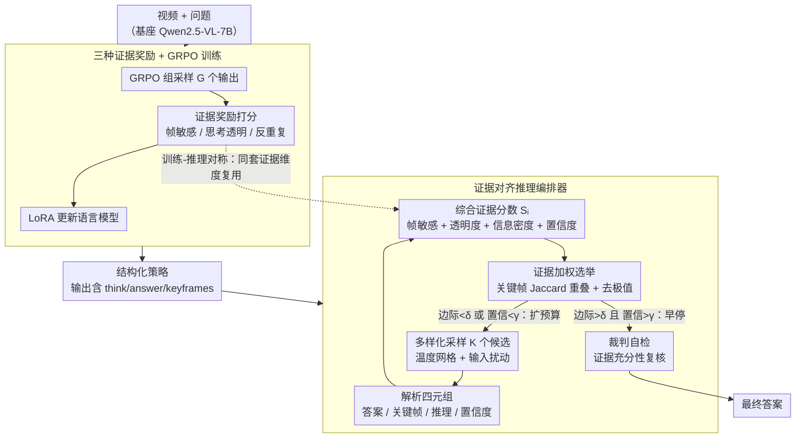

# Reinforce to Learn, Elect to Reason: A Dual Paradigm for Video Reasoning

**会议**: CVPR 2026  
**arXiv**: [2604.04379](https://arxiv.org/abs/2604.04379)  
**代码**: 无  
**领域**: 视频理解 / 多模态推理 / 强化学习  
**关键词**: 视频推理, 强化学习, 证据驱动, 多候选选举, 测试时推理

## 一句话总结

提出 RLER 双范式框架，训练阶段用 GRPO 配合三种新颖奖励（Frame-sensitive、Think-transparency、Anti-repetition）教模型生成结构化证据，推理阶段用无训练编排器在多候选之间基于证据一致性进行加权选举和自检，在 8 个视频基准上全面超越开源和 RL-based LMM，平均提升 6.3%，仅需约 3.1 个候选。

## 研究背景与动机

1. **领域现状**：大型多模态模型（LMM）在视频理解上取得了显著进展，但推理仍然是"单次通过"——生成答案后不验证推理是否基于有效证据。即使 SOTA 模型也容易被轻微扰动（视频变化或措辞变化）打破。
2. **现有痛点**：
    - 现有基于 RL 的训练方法（如 Video-R1、VideoChat-R1）改善了推理能力，但多个推理轨迹之间很少检查证据一致性
    - 测试时扩展方法（best-of-N、beam search）提供了多样候选，但缺乏基于证据的系统性仲裁
    - 链式思考（CoT）很少被系统性地与关键帧和关系进行对照验证
3. **核心矛盾**：现有方法能展示模型"能推理"，但无法证明它"用正确的证据进行了推理"
4. **本文目标**：将视频推理从"答案驱动"转向"证据驱动"——训练时让模型发出结构化的机器可检查证据信号，推理时通过证据一致性选举出可靠答案
5. **切入角度**：分离"能够思考"和"正确思考"——训练负责塑造和增强推理能力（potentiation），推理负责通过证据选举来保证可靠性
6. **核心 idea**：训练阶段用奖励塑造让模型生成包含关键帧引用和结构化推理的输出，推理阶段用证据加权选举从多个候选中选出最可靠的答案

## 方法详解

### 整体框架

RLER 要解决的核心问题是：视频推理长期停留在"单次通过"——模型给出答案却不验证它是否真的基于有效证据。RLER 把这件事拆成对称的两段。训练端（RLER-Training）用 GRPO 优化策略，让模型输出带 `<think>`、`<answer>`、`<keyframes>` 标签的结构化结果，并通过奖励塑造把"引用哪些关键帧、推理多长、是否啰嗦"这些证据信号逼出来；推理端（RLER-Inference）则不再相信任何单条输出，而是用多样化输入采出少量候选，逐个解析成可机器检查的证据，按证据一致性加权选举出最可靠的答案，并在分歧不大时早停、必要时让裁判自检。基础模型为 Qwen2.5-VL-7B-Instruct，训练时冻结视觉编码器与投影层，仅以 LoRA（r=8）更新语言模型参数。两端共用同一套证据维度（帧敏感、思考透明、反重复），构成"训练塑造能力、推理保证可靠"的闭环。

### 关键设计

**1. 三种证据奖励：把"看哪里、说多少、怎么说"变成可优化信号**

视频推理的痛点是 CoT 很少和关键帧、关系做对照，模型说得头头是道却说不清证据在哪。RLER 在常规的答案正确性与格式奖励之外，新增三个直接针对证据质量的奖励。**帧敏感奖励（Frame-sensitive Reward）** 逼模型引用具体关键帧，有效帧分数定义为 $s_{fs}(o) = \text{clip}\!\left(\frac{|K(o)| - E(o)}{1 + |K(o)|}, 0, 1\right)$，其中 $K(o)$ 是引用到的有效帧索引集合、$E(o)$ 是无效索引的数量；这个奖励被答案正确性和格式有效性门控，避免模型靠堆砌帧号刷分。**思考透明度奖励（Think-transparency Reward）** 用单峰曲线 $\sin^2(\pi \tilde{L}(o))$ 奖励适中长度的推理链——$\tilde{L}$ 是归一化推理长度，太短（证据不足）和太长（注水）都拿不到高分，只有中等长度才接近满分。**反重复奖励（Anti-repetition Reward）** 用 n-gram 去重压制低信息密度的复述，$R_{ar}(o) = -\rho(o)$，$\rho$ 是重复率。三者分别对应"看哪里 / 说多少 / 怎么说"，而且不是随手设计的——它们刚好就是推理阶段评分要用的三个维度，训练时塑造的东西推理时正好拿来打分。

**2. 证据对齐推理编排器：用证据一致性选举代替单次通过**

即便训练得再好，单条输出仍可能踩到证据空洞。编排器（RLER-Inference）的做法是先用温度网格 $\{0.2, 0.7, 0.9\}$ 加上五角裁剪、亮度扰动等输入扰动采出少量候选，把每个候选解析成四元组 $(a_i, K_i, z_i, c_i)$——答案、关键帧集合、推理文本、自报置信度。接着给每个候选算综合证据分数

$$S_i = \tfrac{1}{4}\big(s_{fs}(o_i) + \tau(o_i) + (1-\rho(o_i)) + c_i\big),$$

把帧引用质量、思考透明度、信息密度、置信度揉成一个标量。然后做的不是简单多数投票，而是**证据加权选举**：对支持同一答案的候选，计算它们关键帧集合的 Jaccard 重叠衡量证据是否真的对得上，去掉极端值后再按 $S_i$ 加权投票——证据互相印证的答案权重更高。当领先边际超过 $\delta=0.08$ 且平均置信度超过 $\gamma=0.4$ 时就早停，不再继续采样，这也是平均每题只需约 3.1 个候选的原因；最后由裁判做一次证据充分性自检，必要时触发重加权。整套机制不改大模型规模，只靠结构化证据就把可靠性和可解释性提了上来。

**3. 训练-推理对称：同一套证据维度两头复用**

RLER 刻意让训练奖励和推理评分对齐：帧敏感、思考透明度、反重复三个训练奖励，正好对应推理时综合证据分数里的 $s_{fs}$、$\tau$、$1-\rho$ 三项。这避免了常见的训练-推理脱节——模型在训练里学会的"引用关键帧、适度思考、避免重复"，到推理时不是被丢弃，而是直接成为选举的打分依据。正因为两端共享维度，奖励塑造出的能力才能被编排器无缝利用，闭环也才真正成立。

### 一个完整示例：一道空间推理题怎么被选举出来

以 VSIBench 上一道"物体相对方位"题为例走一遍推理端。编排器先在温度 $\{0.2, 0.7, 0.9\}$ 下分别采样，得到 3 个候选：候选 A（温度 0.2）引用关键帧 $\{4, 9, 15\}$、答案"左侧"、置信度 0.6；候选 B（温度 0.7）引用 $\{4, 9\}$、同样答"左侧"、置信度 0.5；候选 C（温度 0.9）引用 $\{2, 20\}$、答"右侧"、置信度 0.4。算综合证据分数后，A、B 因为帧引用集中且重复率低拿到较高的 $S_i$，C 因关键帧零散、置信度低而偏低。选举时 A 与 B 都支持"左侧"，它们的关键帧 Jaccard 重叠高（$\{4,9\}$ 共享），证据互相印证，加权后"左侧"的票重明显压过孤立的 C。此时领先边际已超过 $\delta=0.08$、平均置信度超过 $\gamma=0.4$，触发早停——只采了 3 个候选就收敛，无需用满 $K=8$ 的预算。裁判自检确认"左侧"的证据帧确实覆盖了相关物体后，输出最终答案。整个过程没有放大模型，仅靠证据一致性就把一次可能出错的单次推理纠正了过来。

### 损失函数 / 训练策略

- 基于 GRPO，组大小 G=4，clip $\epsilon=0.2$，KL 系数 $\beta=0.04$
- 奖励权重：$w_{acc}=0.1, w_{fmt}=0.1, w_{fs}=0.2, w_{tt}=0.3, w_{ar}=0.3$
- 使用 LoRA (r=8, α=16)，AdamW (lr=1e-5)，在 Video-R1-260k 上训练 2 个 epoch
- 冻结视觉编码器和投影层，仅更新语言模型参数
- 16 帧均匀采样训练，32 帧标准推理，长视频 1fps 子采样

## 实验关键数据

### 主实验

| 基准 | 类型 | Qwen2.5-VL-7B | Video-R1 | VideoChat-R1.5 | **RLER** |
|------|------|---------------|----------|----------------|----------|
| VSIBench | 视频推理 | 37.4 | 35.8 | - | **43.3** |
| VideoMMMU | 视频推理 | 47.4 | 52.3 | 51.4 | **54.2** |
| VideoMME | 通用 | 65.1 | 59.3 | 67.1 | **68.5** |
| TempCompass | 通用 | 69.2 | 73.2 | - | **76.2** |
| MVBench | 通用 | 67.5 | 63.9 | 70.6 | **72.9** |
| LVBench | 长视频 | 42.0 | - | 48.4 | **50.7** |
| LongVideoBench | 长视频 | 56.0 | - | - | **63.0** |

### 消融实验

**训练奖励消融**

| 配置 | VSIBench | VideoMMMU |
|------|----------|-----------|
| 完整 RLER | **43.3** | **54.2** |
| w/o frame-sensitive | 41.0 (-2.3) | 52.1 (-2.1) |
| w/o think-transparency | 41.9 (-1.4) | 52.7 (-1.5) |
| w/o anti-repetition | 42.1 (-1.2) | 53.0 (-1.2) |
| w/o RLER-Inference | 41.7 (-1.6) | 52.5 (-1.7) |
| w/o GRPO (用 SFT) | 39.2 (-4.1) | 49.8 (-4.4) |

**推理组件消融（MVBench/LVBench）**

| 配置 | MVBench | LVBench | Avg K |
|------|---------|---------|-------|
| 完整 RLER | **72.9** | **50.7** | 3.1 |
| w/o diversity input | 69.1 | 46.5 | 1.0 |

### 关键发现

- **Frame-sensitive Reward 对推理类任务贡献最大**：VSIBench 下降 2.3%，因为该基准需要精确的空间推理和跨帧关联
- **GRPO vs SFT 差距巨大**：SFT 只学格式但缺乏奖励信号激发的深度推理能力，差距 4.1-4.4%
- **仅训练（w/o RLER-Inference）已经很强**：41.7/52.5 已超越大多数 RL-based LMM，证明奖励塑造本身就增强了推理能力
- **平均仅需 3.1 个候选/问题**就能获得全部收益（上限 K=8），得益于高效的早停机制
- 训练过程中出现了"Aha moment"——模型自发识别推理中的缺陷并启动自我纠正（"Wait. Let me re-evaluate."）

## 亮点与洞察

- **证据驱动的训练-推理闭环**是核心创新：同一套维度（帧引用、透明度、信息密度）在训练中作为奖励信号，在推理中作为评分标准，设计非常优雅。
- **在 VideoMME 上超越 GPT-4o（68.5 vs 67.9）**，是一个 7B 开源模型超过闭源大模型的亮点。
- **证据加权选举 vs 简单多数投票**：消融显示去掉证据权重后性能显著下降，证明基于证据的选举比简单投票更有效。
- **"Aha moment"的涌现**表明 RL 训练不仅改善了输出质量，还改变了模型的推理行为模式，这是一个值得深入研究的现象。

## 局限与展望

- 推理时多候选生成增加计算成本（虽然平均 3.1 个已很高效，但对延迟敏感场景仍是问题）
- 仅在 Qwen2.5-VL-7B 上验证，未测试更大模型或其他 LMM 架构
- 裁判自检（referee self-check）仅做一次，可以探索迭代验证
- 关键帧引用目前是弱监督的（奖励级别），未使用帧级标注
- 早停阈值 $\delta=0.08$ 和 $\gamma=0.4$ 在所有基准上共享，针对不同难度的数据集自适应调整可能更优

## 相关工作与启发

- **vs Video-R1**: Video-R1 引入了视频 RL 训练，但仅做单次推理。RLER 在训练端加入更细粒度的证据奖励并在推理端增加选举机制，全面超越（VSIBench: 43.3 vs 35.8）
- **vs VideoChat-R1.5**: 两者都用 RL 训练 + 测试时扩展，但 RLER 的证据对齐选举比简单的 beam search 或 best-of-N 更有效
- **vs test-time scaling**: 传统方法（best-of-N、MCTS）缺乏视频特有的证据评分机制，RLER 的帧引用和证据一致性评分填补了这一空白

## 评分

- 新颖性: ⭐⭐⭐⭐⭐ 训练-推理对称闭环的证据驱动范式是全新的框架设计，三种奖励的设计精准且互补
- 实验充分度: ⭐⭐⭐⭐⭐ 8个基准全面评估，训练和推理分别消融，辅助指标（EGS、TI、RR）量化证据质量
- 写作质量: ⭐⭐⭐⭐ 框架介绍清晰，公式推导完整，但论文较长需要耐心阅读
- 价值: ⭐⭐⭐⭐⭐ 对视频推理可靠性问题提出了系统性解决方案，7B 模型超越 GPT-4o 的实际价值很高

<!-- RELATED:START -->

## 相关论文

- [\[ICLR 2026\] How LLMs Learn to Reason: A Complex Network Perspective](../../ICLR2026/reinforcement_learning/how_llms_learn_to_reason_a_complex_network_perspective.md)
- [\[CVPR 2026\] CCCaption: Dual-Reward Reinforcement Learning for Complete and Correct Image Captioning](cccaption_dual-reward_reinforcement_learning_for_complete_and_correct_image_capt.md)
- [\[ICLR 2026\] ExGRPO: Learning to Reason from Experience](../../ICLR2026/reinforcement_learning/exgrpo_learning_to_reason_from_experience.md)
- [\[NeurIPS 2025\] Modulation of Temporal Decision-Making in a Deep Reinforcement Learning Agent under the Dual-Task Paradigm](../../NeurIPS2025/reinforcement_learning/modulation_of_temporal_decision-making_in_a_deep_reinforcement_learning_agent_un.md)
- [\[ICLR 2026\] Dual Goal Representations](../../ICLR2026/reinforcement_learning/dual_goal_representations.md)

<!-- RELATED:END -->
