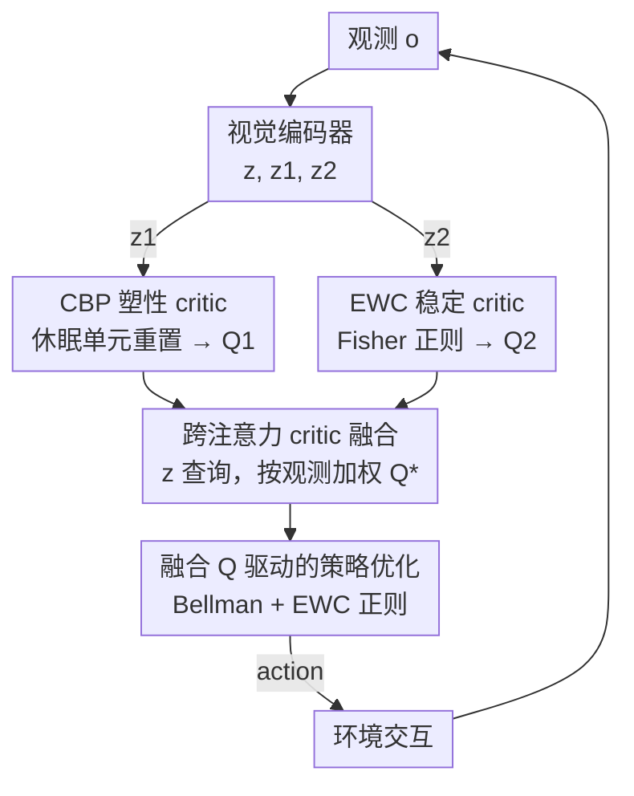

# Resolving the Stability-Plasticity Dilemma in Reinforcement Learning via Complementary Continual Critics

**会议**: CVPR 2026  
**论文**: [CVF Open Access](https://openaccess.thecvf.com/content/CVPR2026/html/Sun_Resolving_the_Stability-Plasticity_Dilemma_in_Reinforcement_Learning_via_Complementary_Continual_CVPR_2026_paper.html)  
**代码**: https://github.com/sunbo5202/CD-CCA  
**领域**: 强化学习  
**关键词**: 视觉强化学习、稳定可塑性困境、持续学习、双critic、跨注意力融合

## 一句话总结
针对视觉 RL 中"既要快速适应又要不遗忘"的稳定—可塑性困境，本文提出 CD-CCA：用持续反向传播（CBP）武装一个"塑性 critic"、用弹性权重巩固（EWC）武装一个"稳定 critic"，再用跨注意力机制按观测自适应融合两者的 Q 值，在 DMControl 与 CARLA 上同时提升样本效率和收敛稳定性。

## 研究背景与动机
**领域现状**：视觉强化学习让智能体直接从像素学控制策略，主流是把 SAC / TD3 这类算法接上 CNN 编码器，再靠数据增强、自监督辅助任务、环境动力学建模来改善表征质量。

**现有痛点**：这些方法都默认网络是"单一、整体"的学习过程，试图给整张网络找一个万能平衡点。可视觉 RL 的数据流是非平稳的——智能体边交互边改策略，采样分布一直在漂。作者用诊断指标实测发现两类病灶同时存在：普通 critic 的**休眠神经元（dormant neuron）比例随训练持续升高**，说明塑性在退化、网络越学越"僵"；同时 CKA 表征相似度和价值一致性指标显示**表征剧烈漂移、价值估计不稳**，这是灾难性遗忘的表现。

**核心矛盾**：可塑性（plasticity，持续从新数据学习的能力）与稳定性（stability，巩固旧知识不遗忘的能力）天然冲突——加强一个就会损害另一个。单 critic 的"一刀切"范式被迫在二者间妥协，无法同时拿到两头的好处。

**本文目标**：在**单个任务内部**（in-task）就化解稳定—可塑性冲突，而不是像传统持续学习那样只处理"任务序列"切换。具体拆成三个子问题：怎样维持一路的可塑性、怎样保住另一路的稳定性、怎样让两路按情况动态配合。

**切入角度**：与其逼一个 critic 同时做两件矛盾的事，不如做**功能异构的双 critic**——一个专司适应、一个专司记忆。诊断实验进一步发现：CBP 能压住休眠神经元（恢复塑性），EWC 能抑制表征漂移（保住稳定），而且 critic 的可靠性是随观测变化的，这正好对应跨注意力 Query–Key–Value 的"按观测加权融合"。

**核心 idea**：用 CBP 和 EWC 这两种持续学习机制分别打造"塑性 critic"和"稳定 critic"，再用跨注意力按当前观测自适应地融合二者的价值估计——用结构上的功能解耦代替单网络的被动权衡。

## 方法详解

### 整体框架
CD-CCA 在 SAC 的 actor–critic 骨架上改造，是一个可即插即用接入任意双 critic 架构的模块。视觉编码器先把观测 $o$ 编成潜在特征，经三层全连接产生共享嵌入 $z$ 和两路 critic 专属特征 $z_1, z_2$；两个并行 critic 分别在 CBP 与 EWC 机制下学习，输出 $Q_1, Q_2$；跨注意力模块以 $z$ 为 query、$z_1/z_2$ 为 key、$Q_1/Q_2$ 为 value，算出融合后的 $Q^*$；$Q^*$ 既参与 critic 的 Bellman 误差也指导策略更新，最后由策略解码器输出动作与环境交互。整条链路里"可塑—稳定"的平衡不再靠某个固定 critic，而是逐观测动态决定。

### 关键设计

**1. 互补双 critic：CBP 管塑性、EWC 管稳定**

要同时治"网络越学越僵"和"表征漂移遗忘"两个病，单 critic 顾此失彼，作者干脆把这两个矛盾目标拆到两个并行 critic 上，各用一种持续学习机制专门强化一头。对**塑性 critic**用持续反向传播（CBP）：核心观察是并非所有隐藏单元都对计算有贡献，有些会随训练变冗余导致表征停滞。CBP 给每个单元算一个贡献效用——用激活值乘以它出边权重的幅度之和，运行效用按指数滑动更新：

$$u_l[i] = \eta \cdot u_l[i] + (1-\eta)\cdot |h_{l,i,t}| \cdot \sum_{k=1}^{n_{l+1}} |W_{l,i,k,t}|$$

其中 $\eta=0.99$ 是衰减率，$n_{l+1}$ 是下一层单元数。持续低效用的单元被判为冗余、重新初始化，并在到达成熟阈值 $m$ 前暂时受保护不被再替换。论文实测这种替换是"功能引导"的：替换频率高的神经元恰恰是当前贡献低的，重置后能腾出容量学新知识，从而压住休眠神经元比例、维持塑性。对**稳定 critic**用弹性权重巩固（EWC）：它用 Fisher 信息矩阵（FIM）给每个参数打重要性分，对重要参数偏离旧值的行为施加二次惩罚，逼新知识尽量落在不重要参数上：

$$L_{EWC}(\phi) = L_{new} + \sum_i \frac{\gamma}{2} F_i\,(\theta_i - \theta^*_{old,i})^2$$

$L_{new}$ 是新任务原始损失，$\gamma$ 控制约束强度（越大越保护关键参数），$F_i$ 是 FIM（从 replay buffer 采 mini-batch 估计），$\theta^*_{old,i}$ 是上一阶段训练收敛后的参数最优值。两路合在一起，塑性 critic 负责快速吃进新视觉模式、稳定 critic 负责锁住已学知识，从结构上把"可塑—稳定"这对冤家分了家。本文也是首个用"不同学习规则"（而非以往工作中的不同折扣因子等时间尺度异构）来构造异构 critic 的工作。

**2. 跨注意力 critic 融合：按观测自适应配权**

有了两个各有所长的 critic，怎么用？取最小值或简单平均（同质 critic 集成的老办法）是静态的，无法随视觉输入变化调整两路的话语权——诊断实验已表明 critic 的可靠性是依赖观测的。作者据此设计跨注意力融合：以共享视觉表征 $z\in\mathbb{R}^d$ 作 query，以两路 critic 的动态适应特征 $z_1$、稳定保持特征 $z_2$ 作 key，以两个标量价值估计 $Q_1, Q_2$ 作 value。注意力分数与融合 Q 为：

$$\delta_i = \mathrm{softmax}\!\left(\frac{z\cdot z_i^{T}}{\sqrt{d_k}}\right), \qquad Q^* = \delta_1 Q_1 + \delta_2 Q_2$$

这样当前观测更"考验适应力"时就给塑性 critic 更高权重、更"考验记忆"时偏向稳定 critic，融合权重逐样本变化。消融显示去掉它换成取最小值会明显掉分，说明动态融合是把两路互补价值真正整合起来、并顺带缓解过估计的关键。

**3. 融合 Q 驱动的策略优化目标**

最后把融合价值接回 SAC 的训练回路。智能体学策略 $\pi_\theta$、两个 critic $Q_{\phi_1}, Q_{\phi_2}$ 以及跨注意力模块 $Q_\xi$，critic 与注意力参数 $\phi, \xi$ 通过最小化 Bellman 误差学习，并叠加 EWC 正则：

$$L_{total} = L(\phi_i, \xi, B) + L_{EWC}(\phi)$$

$$L(\phi_i, \xi, B) = \mathbb{E}_{\tau\sim B}\big[(Q_\xi(o,a) - y)^2 + \beta\,(Q_{\phi_i}(o,a) - y)^2\big],\quad y = r_t + \gamma V(o')$$

这里既监督融合后的 $Q_\xi$，也用系数 $\beta$ 单独监督每个 critic 自身的估计以稳住训练；$V(o')$ 沿用 SAC 的带熵软价值目标。这套目标让"双 critic 差异化学习 + 跨注意力自补偿"在同一个梯度回路里端到端配合，而非各练各的。

### 损失函数 / 训练策略
训练流程见原文 Algorithm 1：每步先用策略采动作、存进 replay buffer $B$；更新时从 $B$ 采一批转移，算软价值目标 $V^{tot}$ 与 TD 目标，得到两路 $Q_1$（EWC）、$Q_2$（CBP），编码出 $z, z_1, z_2$ 后做跨注意力融合 $Q^*$，按式 (9) 更新 $\phi_{1,2}, \xi$、按 SAC 策略梯度更新 $\theta$，目标 critic 以指数滑动平均同步。关键超参：CBP 效用衰减 $\eta=0.99$、成熟阈值 $m$、EWC 强度 $\gamma$、critic 自监督系数 $\beta$。整体仍是 off-policy、可无缝接入现有双 critic RL（如 SAC、DrQ-v2、DeepMDP）。

## 实验关键数据

### 主实验
DMControl 四个 hard 任务（Flare 提出），输入 84×84 图像、三帧堆叠，5 个随机种子。CD-CCA 作为即插即用模块接到 DrQ-v2 上（表中 OURS / DrQv2+OURS），1M 步结果：

| 任务 (1M) | Flare | TACO | MaDi | ResAct | DrQv2 | OURS |
|-----------|-------|------|------|--------|-------|------|
| Quadruped, Walk | 488±221 | 665±144 | 621±172 | 690±128 | 871±47 | **907±25** |
| Pendulum, Swingup | 809±31 | 784±42 | 751±41 | 817±6 | 812±23 | **817±17** |
| Finger, Turn hard | 661±315 | 672±167 | 695±133 | 857±80 | 837±40 | **957±37** |
| Walker, Run | 556±93 | 582±63 | 562±68 | 554±21 | 734±32 | **747±24** |
| 平均 | 546.2 | 584.8 | 566.0 | 630.2 | 813.5 | **857.0** |

500K 步时平均 683.0 也优于 DrQv2 的 636.8。CARLA 两个驾驶场景（Highway 周围 20 车、Jaywalk 行人随机横穿），训练 100K 步后接到 DeepMDP 上：

| 方法 | Highway 奖励 | Highway 距离(m) | Jaywalk 奖励 | Jaywalk 距离(m) |
|------|------|------|------|------|
| SAC | 121±26 | 74±17 | 121±49 | 84±78 |
| DrQ | 154±21.5 | 95±27 | 157±81 | 109±33 |
| MLR | 256±51 | 238±75 | 194±73 | 177±42 |
| ResAct | 283±25 | 299±24 | 188±22 | 133±34 |
| DeepMDP | 170±36 | 132±20 | 169±52 | 134±40 |
| DeepMDP+OURS | **343±63** | **287±45** | **204±43** | **183±58** |

CD-CCA 在大多数任务拿到 SOTA，且**跨种子标准差明显更小**，说明收敛更稳、对初始化更不敏感。

### 消融实验
| 配置 | 结论 | 说明 |
|------|------|------|
| Full (CBP+EWC+CrossAttn) | 最优 | 可塑—稳定平衡、收敛更稳 |
| w/o EWC（仅 CBP） | 优于 baseline 但有波动 | 适应快但收敛不稳 |
| w/o CBP（仅 EWC） | 优于 baseline 但欠响应 | 稳但对环境变化反应慢 |
| w/o Cross-Attention（取 min） | 回报下降 | 静态平均无法动态调配两路 |
| w/o CBP&EWC（仅融合） | 优于 baseline | 跨注意力本身能缓解过估计 |
| CBP+CBP（同质） | 弱于 full | 早期强但过度适应、收敛不稳 |
| EWC+EWC（同质） | 弱于 full | 过度刚性、改进慢 |

此外把机制扩展到标准 actor–critic：在 SAC / TD3 上做四 critic（两 CBP 两 EWC，先各组取 min 再取更低者），收敛更快、非平稳下更一致。

### 关键发现
- **异构 > 同质**：CBP+EWC 的互补组合稳稳超过 CBP+CBP（过度适应不稳）和 EWC+EWC（过度刚性慢），印证"功能解耦"才是化解困境的关键，而非单纯堆 critic。
- **跨注意力不可省**：换成取最小值就掉分；它既做动态配权又顺带压过估计（w/o CBP&EWC 仍优于 baseline 即证据）。
- **CBP 替换是功能引导的**：替换频率高的神经元当前贡献恰好低，重置后能恢复学习，说明休眠单元被精准回收而非随机扰动。
- **CARLA 上优势更明显**：更接近真实、更非平稳的环境里，动态融合的收益被进一步放大。

## 亮点与洞察
- **用"不同学习规则"造异构 critic**：以往多 critic 的异构性来自不同折扣因子等时间尺度，本文首次用 CBP / EWC 这两种持续学习规则制造功能异构，把抽象的"稳定—可塑性"冲突落到具体的网络结构上——这个映射很干净，也好迁移。
- **把"诊断"前置成设计依据**：dormant neuron、CKA、value-consistency 三个指标先把病灶量化清楚（塑性退化 + 表征漂移），再对症下药选 CBP / EWC / 跨注意力，方法不是拍脑袋而是被诊断牵引出来的，说服力强。
- **跨注意力的 QKV 语义对得很自然**：critic 可靠性本就依赖观测，正好对上"按 query 加权 value"，比固定 min/avg 更贴合问题本质，这个类比可以迁到任何"多专家按输入动态配权"的场景。
- **即插即用**：能接 DrQ-v2 / DeepMDP / SAC / TD3 等任意双 critic 框架，工程上是个低成本增益模块。

## 局限与展望
- **作者承认**：塑性 critic 不限于 CBP，可换其他塑性机制；未来探索更通用的塑性优化——暗示当前机制选择仍偏经验。
- **额外开销**：双 critic + 跨注意力 + EWC 的 FIM 估计都增加显存与算力，论文未给训练成本/吞吐对比，"plug-and-play 但代价多少"不清楚。
- **超参敏感性未充分披露**：$\gamma$（EWC 强度）、$\beta$（critic 自监督系数）、CBP 成熟阈值 $m$ 这些关键超参的敏感性没有系统扫描，跨任务是否需要重调存疑。
- **多 critic 扩展用的是 min 融合而非跨注意力**：四 critic 扩展实验里反而退回取最小值，跨注意力没扩展到 >2 路，融合机制的可扩展性留白。
- **评测域偏窄**：只在 DMControl + CARLA 连续控制上验证，离散动作 / 真实机器人 / 更长 horizon 任务尚未覆盖。

## 相关工作与启发
- **vs 单网络表征学习（DrQ、CURL、MLR、TACO）**：它们靠数据增强 / 自监督给整张网络找万能平衡，仍受限于自探索采到的数据；本文不改数据而是结构上解耦可塑—稳定双目标，从 critic 价值估计这一源头改善探索效率。
- **vs 同质多 critic（Double Q、TD3、SAC、Bayesian critic）**：这些用 min/average/不确定性建模降低过估计偏差，但 critic 之间是同质的；本文造功能异构 critic，并用动态注意力而非静态算子融合。
- **vs 持续学习在 RL 的常规用法**：正则（EWC 等）/ 回放 / 参数隔离三大家族多用于"任务序列"切换；本文把它们搬进"单任务内部"来治非平稳数据流下的稳定—可塑性困境，是个不太常见但贴合 RL 本质的用法。
- **可迁移启发**："诊断指标牵引设计 + 异构专家 + 按输入动态配权"这套组合拳，可移植到任何存在多目标冲突、且最优配比随输入变化的学习系统（如多任务、混合专家、多教师蒸馏）。

## 评分
- 新颖性: ⭐⭐⭐⭐ 首次用 CBP/EWC 两种持续学习规则造功能异构 critic，并用跨注意力按观测动态融合，组合角度新颖。
- 实验充分度: ⭐⭐⭐⭐ DMControl + CARLA 双基准、5 种子、多角度消融较扎实，但缺成本对比与超参敏感性扫描。
- 写作质量: ⭐⭐⭐⭐ 诊断→动机→方法逻辑清晰、图表支撑到位，公式记号偶有小瑕。
- 价值: ⭐⭐⭐⭐ 即插即用、稳定性提升明显，为单任务内化解稳定—可塑性困境提供了可复用的架构范式。

<!-- RELATED:START -->

## 相关论文

- [\[ICML 2025\] Mitigating Plasticity Loss in Continual Reinforcement Learning by Reducing Churn](../../ICML2025/reinforcement_learning/mitigating_plasticity_loss_in_continual_reinforcement_learning_by_reducing_churn.md)
- [\[ICML 2026\] Position: Deployed Reinforcement Learning should be Continual](../../ICML2026/reinforcement_learning/position_deployed_reinforcement_learning_should_be_continual.md)
- [\[CVPR 2026\] TSTM: Temporal Segmentation for Task-relevant Mask in Visual Reinforcement Learning Generalization](tstm_temporal_segmentation_for_task-relevant_mask_in_visual_reinforcement_learni.md)
- [\[ICML 2026\] SPHERE: Mitigating the Loss of Spectral Plasticity in Mixture-of-Experts for Deep Reinforcement Learning](../../ICML2026/reinforcement_learning/sphere_mitigating_the_loss_of_spectral_plasticity_in_mixture-of-experts_for_deep.md)
- [\[ICML 2026\] Shapley Neuron Values for Continual Learning: Which Neurons Matter Most?](../../ICML2026/reinforcement_learning/shapley_neuron_values_for_continual_learning_which_neurons_matter_most.md)

<!-- RELATED:END -->
