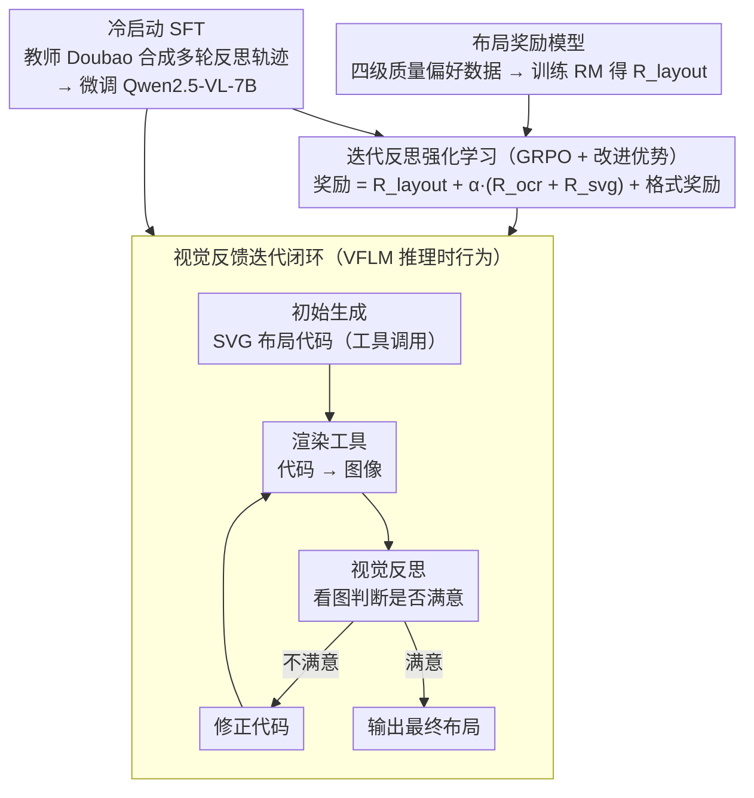

# Seeing is Improving: Visual Feedback for Iterative Text Layout Refinement

**会议**: CVPR 2026  
**arXiv**: [2603.22187](https://arxiv.org/abs/2603.22187)  
**代码**: [https://github.com/FolSpark/VFLM](https://github.com/FolSpark/VFLM)  
**领域**: 强化学习 / 多模态生成  
**关键词**: 视觉反馈, 文本排版, 布局生成, 强化学习, 迭代优化

## 一句话总结

VFLM 提出一个利用视觉反馈进行迭代优化的布局生成框架，通过结合 OCR 准确率的视觉奖励模型和强化学习训练，使多模态大语言模型能够"看到"渲染结果并反复修正，在文本排版质量上显著超越仅生成代码的方法。

## 研究背景与动机

**领域现状**：多模态大语言模型（MLLMs）已经能够从自然语言描述中自动生成结构化布局，典型方法是让模型生成代码（如 HTML/CSS/SVG）来表示布局，然后由图形引擎渲染为最终图像。

**现有痛点**：现有方法遵循"只生成代码"（code-only）的范式，模型对渲染后的视觉效果完全"失明"。这导致几个严重问题：(1) 文本可能溢出边界框或相互重叠，影响可读性；(2) 字体大小、颜色搭配等美学因素无法保证；(3) 一旦代码生成完毕就没有修正机会，错误会直接传递到最终输出。

**核心矛盾**：布局生成的最终目标是视觉上的可读性和美观性，但现有方法的优化目标（代码正确性）与最终评估标准（视觉质量）之间存在脱节。代码在语法上正确不等于渲染效果好。

**本文目标**：引入视觉反馈机制，让模型能够"看到"渲染结果，发现问题并迭代修正，实现自我改进式的布局生成。

**切入角度**：将布局生成从"一次性代码生成"转变为"视觉-反思-修正"的迭代过程，并通过强化学习让模型学会利用视觉反馈进行自我改进。

**核心 idea**：用视觉反馈闭合"代码→渲染→评估→修正"的循环，通过 RL 训练使模型获得自适应的反思式生成能力。

## 方法详解

### 整体框架

VFLM 把布局生成从 code-only 的"一次性出代码"改造成一个有状态的视觉反馈闭环：给定背景图与目标文本，模型先经推理生成初始 SVG 布局代码（以结构化工具调用的形式发出），渲染工具把代码转成图像并喂回同一个模型；模型"看着"这张渲染图做视觉反思，判断排版是否满意——不满意就推理出该怎么改、重写代码再渲染，满意则输出，循环至多 $N_{\max}$ 轮。与 code-only 的根本区别在于：模型每一轮都能看见自己上一步的真实渲染结果，而不是对最终视觉效果完全失明地一次写完。

为让模型真正学会这种"看图反思再改"的能力，VFLM 采用两阶段训练。**冷启动 SFT**：现实中没有天然的多轮反思数据，于是用教师模型 Doubao-Seed-1.6 蒸馏合成"初始推理 + 多轮反思修正"的完整轨迹，微调 Qwen2.5-VL-7B，让它先掌握迭代反思与工具调用的基本范式。**迭代反思强化学习**：在此基础上用 GRPO 在完整的多轮"生成—渲染—反思—修正"轨迹上做策略优化，奖励由一个专门训练的布局奖励模型 $R_{\text{layout}}$、OCR 文本准确率 $R_{\text{ocr}}$、SVG 代码层文本准确率 $R_{\text{svg}}$ 三部分加权而成（外加格式奖励），且分数奖励只打给迭代链的最终输出，从而激发模型自主判断"何时已经够好可以停"。

### 关键设计

**1. 视觉反馈迭代闭环：让模型看着渲染结果改，而不是盲写一遍**

code-only 范式的根本问题是文本溢出、重叠这类毛病只有渲染后才暴露，而模型此时已经无从修正。VFLM 在模型与渲染环境之间建立多轮交互（论文 Algorithm 1）：模型先经推理生成初始 SVG 代码，渲染工具转成图像后回传，模型再"看着"渲染图做视觉反思、判断是否满意——不满意就推理出修改方案、重写代码再渲染，满意则终止，整个过程最多跑 $N_{\max}$ 轮。输出用结构化标签组织：中间轮用 `<think>` + `<tool_call>`（发代码去渲染），最后一轮用 `<think>` + `<answer>`（给出终稿）。这条"生成→渲染→反思→修正"的回路本质上把人类设计师"反复预览再改"的工作方式搬进了模型，使那些只在像素层面才显形的错误终于有机会被闭环掉。

**2. 冷启动 SFT：用教师蒸馏合成多轮反思轨迹，先教会模型"怎么迭代"**

要让模型具备上面的迭代反思能力，得有多轮"先做砸、再看图改对"的训练数据，但这类数据现实中并不存在。VFLM 用 Doubao-Seed-1.6 当教师分四步合成（论文 Fig. 2A）：① 初始推理合成——给教师背景图和 ground-truth 布局，让它生成 SVG 代码背后的推理过程；② 次优布局生成——用这批蒸馏推理数据微调 Qwen2.5-VL-7B，再收集它的输出作为"次优的初始尝试"；③ 多轮反思合成——把次优尝试与对应 ground-truth 配对喂回教师，让教师做迭代反思与修改直到逼近 GT，由此产出完整的多轮反思轨迹；④ 数据组合——用结构化标签把各轮拼起来。微调时**掩码掉改进序列里初始（次优）回答的 loss**，确保模型学的是"如何修正"而不是去模仿那些初始错误。

**3. 布局奖励模型：用四级质量偏好数据训练一个会评排版好坏的 RM**

排版质量不是非对即错的二值判断，而是对美学、可读性、连贯性的整体细粒度评价，没有现成数据集可用，奖励信号若设计粗糙还容易引发 reward hacking。VFLM 为此训练专门的布局奖励模型 $r_\theta$，输入三元组 $(B, T, I)$（背景图、目标文本、渲染图）、输出标量分。关键在偏好数据的分层构造——为每条 prompt 造出四个质量档：Level-I（高质量 GT）、Level-II（微调后 Qwen2.5-VL-7B 的合理输出）、Level-III（在 II 上施加适度空间扰动）、Level-IV（在 II 上施加激进扰动：大幅位移、随机字号、删文删图、任意缩放）。四档两两配对得到每题 6 对偏好，逼迫 RM 学会"优秀 vs 仅仅及格"的细微差别。RM 以 Qwen2.5-VL-3B 初始化、末层换成标量线性头，用成对的负对数似然损失训练，输出再按测试集分布标准化得到 $R_{\text{layout}}$。

**4. 迭代反思强化学习（GRPO + 改进优势）：用试错学会"看到某类问题该怎么改"**

修正策略高度依赖具体错误类型（溢出该缩字号、重叠该挪位置），监督学习难以穷举教会，因此 VFLM 用 GRPO 在完整多轮轨迹上做策略优化。奖励是三部分加权：$R_{\text{score}} = R_{\text{layout}} + \alpha \cdot (R_{\text{ocr}} + R_{\text{svg}})$——其中 $R_{\text{ocr}}$ 对渲染图做 OCR 再与目标文本比对（像素层可读性）、$R_{\text{svg}}$ 直接比对提取出的 SVG 字符串与目标文本（代码层正确性）、$R_{\text{layout}}$ 来自上面的奖励模型（整体美学）。此外加一个格式奖励 $R_{\text{format}} \in \{+1, -1\}$ 约束输出格式。由于格式奖励是**逐轮**给的、会让同一序列各轮奖励不一致，VFLM 借鉴 REINFORCE++ 重塑优势：先以组内 $R_{\text{score}}$ 均值为基线、再按系数 $\gamma$ 并入格式奖励 $A_{\text{raw}} = R_{\text{score}} - \text{mean}_{\text{group}}(R_{\text{score}}) + \gamma \cdot R_{\text{format}}$，最后在全局 batch 上标准化。分数奖励只认迭代链的最终输出，等于让模型自主判断"何时已经够好可以停"——这正是纯 SFT 给不了的探索性修正能力。

### 一个完整示例：一张溢出的海报怎么被修回来

以"生成一张活动海报，标题居中、副标题在下、底部一行联系方式"为例：首轮模型直接出 SVG 代码，渲染后发现联系方式那行字号过大、右半截溢出了画布，标题也和副标题贴得太近。渲染图回传后，模型在视觉上定位到这两个问题，重写代码——把底部文字字号调小、给标题和副标题之间加入间距。第二轮渲染显示文字已不再溢出、层次清晰，模型反思后判定排版已满意，输出终稿、迭代终止（奖励仅在训练时回传，推理时由模型自身的视觉反思决定何时停）。整个过程模型只对自己**实际渲染出来的样子**做反应，而不是凭空猜测代码会渲染成什么。

### 损失函数 / 训练策略

- **两阶段训练**：先冷启动 SFT，再迭代反思 RL。SFT 用因果语言建模在合成的多轮反思轨迹上微调 Qwen2.5-VL-7B，并掩码掉改进序列中初始（次优）回答的 loss
- **RL 算法**：GRPO，并改进优势函数——$A_{\text{raw}} = R_{\text{score}} - \text{mean}_{\text{group}}(R_{\text{score}}) + \gamma \cdot R_{\text{format}}$，再在全局 batch 上标准化
- **三分量奖励**：$R_{\text{score}} = R_{\text{layout}} + \alpha \cdot (R_{\text{ocr}} + R_{\text{svg}})$，其中 $R_{\text{layout}}$ 来自训练好的布局奖励模型、$R_{\text{ocr}}$ 是 OCR 文本准确率、$R_{\text{svg}}$ 是 SVG 代码层文本准确率；另加格式奖励 $R_{\text{format}} \in \{+1,-1\}$
- **延迟奖励策略**：分数奖励只认迭代链的最终输出，避免中间步骤的奖励诱导模型提前终止迭代
- **奖励模型损失**：成对偏好的负对数似然 $L_{\text{RM}} = -\mathbb{E}[\log \sigma(r_\theta(B,T,I^+) - r_\theta(B,T,I^-))]$
- **训练数据**：冷启动约 8K 条多轮轨迹；RL 备约 32K 样本、按奖励指标早停；奖励模型偏好数据由 200K 布局样本造出四级质量、约 1.2M 偏好对

## 实验关键数据

### 主实验

| 方法 | OCR Accuracy | 布局质量 | 迭代能力 | 类别 |
|------|-------------|---------|---------|------|
| GPT-4V (code-only) | 中等 | 中等 | 无 | 通用MLLM |
| Canva-GPT | 较好 | 较好 | 无 | 专用布局模型 |
| Code-only baseline | 较低 | 较低 | 无 | 代码范式 |
| VFLM (1轮) | 好 | 好 | 首轮已较好 | 本文 |
| VFLM (多轮迭代) | 最佳 | 最佳 | 有效改善 | 本文 |

### 消融实验

| 配置 | OCR Accuracy | 说明 |
|------|-------------|------|
| Full VFLM | 最佳 | 视觉反馈 + RL + 迭代 |
| w/o Visual Feedback | 显著下降 | 退化为 code-only 范式 |
| w/o RL (仅SFT) | 明显下降 | 缺少迭代修正能力 |
| w/o OCR Reward | 可读性下降 | 文本溢出/重叠增多 |
| 固定1轮（无迭代） | 低于多轮 | 无法修正初始错误 |

### 关键发现

- 视觉反馈是性能提升的最关键因素，移除后退化为 code-only 方法，性能大幅下降
- RL 训练显著优于纯监督微调（SFT），因为 RL 使模型学会了探索性修正策略
- 迭代次数的效果呈递减趋势，通常 2-3 轮迭代后质量趋于稳定
- OCR 准确率作为奖励信号对文本可读性的提升贡献最大

## 亮点与洞察

- **视觉反馈闭环的设计非常自然且有效**：将"看到结果→反思问题→修正"的人类设计流程嵌入到模型中。这个思路可以迁移到任何"生成代码→渲染"的任务，如网页设计、PPT生成、数据可视化等
- **只奖励最终输出的 RL 策略**：巧妙避免了中间步骤奖励设计的难题，让模型自主学会何时该停止迭代。这种"过程不评分、结果说了算"的策略在其他多步生成任务中也值得借鉴
- **OCR 作为可读性度量**：用 OCR 识别率量化文本排版质量是一个实用且客观的指标设计

## 局限与展望

- 迭代修正增加了推理时间，每一轮需要完整的渲染+模型推理，实际应用中需要权衡质量和效率
- 目前主要针对文本排版任务，对更复杂的图形设计（含图片、图表等混合元素）的泛化能力有待验证
- 奖励模型的设计（OCR + 美学）仍相对简单，对更复杂的设计规范（品牌指南、无障碍规范等）的支持有限
- RL 训练的稳定性和计算成本是实际挑战
- 未来可以考虑让用户在迭代循环中提供反馈，实现人机协作式设计

## 相关工作与启发

- **vs LayoutGPT/LayoutDiffusion**: 这些方法采用"一次性生成"范式，缺少视觉反馈和迭代修正能力
- **vs Self-Refine/Reflexion**: 这些自我改进方法主要基于文本反馈，VFLM 引入了视觉模态的反馈，更适合设计类任务
- **vs HTML/CSS 生成模型**: 纯代码生成模型无法"看到"渲染效果，VFLM 通过视觉反馈弥补了这一gap

## 评分

- 新颖性: ⭐⭐⭐⭐ 视觉反馈+RL的布局迭代优化思路新颖且直觉
- 实验充分度: ⭐⭐⭐⭐ 多benchmark对比，消融完整
- 写作质量: ⭐⭐⭐⭐ 问题定义清晰，动机阐述充分
- 价值: ⭐⭐⭐⭐ 代码开源，对设计自动化领域有推动作用

<!-- RELATED:START -->

## 相关论文

- [\[ACL 2026\] SpiralThinker: Latent Reasoning through an Iterative Process with Text-Latent Interleaving](../../ACL2026/reinforcement_learning/spiralthinker_latent_reasoning_through_an_iterative_process_with_text-latent_int.md)
- [\[CVPR 2026\] Talk2Move: Reinforcement Learning for Text-Instructed Object-Level Geometric Transformation in Scenes](talk2move_reinforcement_learning_for_text-instructed_object-level_geometric_tran.md)
- [\[CVPR 2026\] ReAG: Reasoning-Augmented Generation for Knowledge-based Visual Question Answering](reag_reasoning-augmented_generation_for_knowledge-based_visual_question_answerin.md)
- [\[CVPR 2026\] See It, Say It, Sorted: An Iterative Training-Free Framework for Visually-Grounded Multimodal Reasoning in LVLMs](see_it_say_it_sorted_an_iterative_training-free_framework_for_visually-grounded_.md)
- [\[CVPR 2026\] TSTM: Temporal Segmentation for Task-relevant Mask in Visual Reinforcement Learning Generalization](tstm_temporal_segmentation_for_task-relevant_mask_in_visual_reinforcement_learni.md)

<!-- RELATED:END -->
