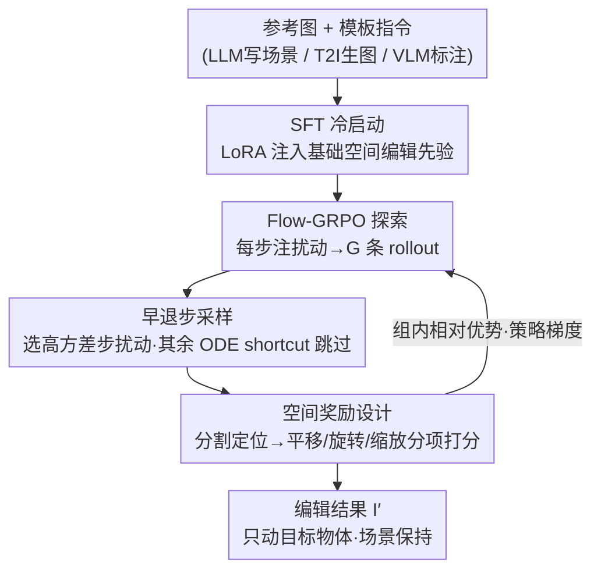

# Talk2Move: Reinforcement Learning for Text-Instructed Object-Level Geometric Transformation in Scenes

**会议**: CVPR 2026  
**论文**: [CVF Open Access](https://openaccess.thecvf.com/content/CVPR2026/html/Tan_Talk2Move_Reinforcement_Learning_for_Text-Instructed_Object-Level_Geometric_Transformation_in_Scenes_CVPR_2026_paper.html)  
**代码**: 无  
**领域**: 强化学习 / 扩散模型 / 图像编辑  
**关键词**: 文本引导编辑、几何变换、Flow-GRPO、空间奖励、早退采样

## 一句话总结
Talk2Move 把"按文字指令平移/旋转/缩放场景中某个物体"建模成一个 RL 问题，用 Flow-GRPO 在扩散轨迹上做带空间奖励的探索，免去成对监督数据，并通过早退步采样把训练加速 2×，在空间精度和场景一致性上显著超过 GPT-Image-1、Flux-Kontext、QwenImageEdit 等编辑模型。

## 研究背景与动机

**领域现状**：文本驱动的图像编辑这几年很热，扩散模型（Flux、Flux.1 Kontext）和 VLM+扩散解码器（QwenImageEdit、Bagel、Emu2 等）能改外观、换风格、改语义内容。

**现有痛点**：但它们做不好"物体级几何变换"——把杯子往左挪到笔记本上、把人沿 z 轴逆时针转 90°、把人缩小到 0.5×。原因有两层：一是**成对监督极度稀缺**，"变换前/变换后"配对样本很难采集，视频或 3D 仿真能给的例子又少又贵；二是 SFT 用的是**像素级 MSE loss**，它没法把"物体"从"场景"里解耦出来，结果是物体动不到位、或者把背景一起改了。

**核心矛盾**：几何编辑需要的是"物体相对场景发生了多少位移/旋转/缩放"这种**空间层面**的监督信号，而像素级重建 loss 只关心整张图逐点像素像不像，二者并不对齐——你即使把杯子挪对了位置，只要新位置的像素和某个"标准答案"不一致，MSE 仍会惩罚它。

**本文目标**：在不依赖成对数据的前提下，让编辑模型听懂"往左/转 90°/放大 2×"这类指令，精确地只动目标物体、保持其余场景不变。

**切入角度**：作者注意到扩散去噪过程可以建模成一个 MDP，每一步去噪就是一个 action，整条轨迹就是一次 rollout。那么只要有一个能直接打分"物体动得对不对"的奖励，就能用 RL（GRPO）去探索几何动作，而 GRPO 只需要"输入图 + 指令"这种单边样本，天然绕开成对监督。

**核心 idea**：用"Flow-GRPO + 物体级空间奖励"代替"成对数据 + 像素 MSE"来学几何编辑，再用"早退步采样"压掉一半训练开销。

## 方法详解

### 整体框架

Talk2Move 整条管线分两大块：**数据构造**和**GRPO 训练**。数据侧因为 GRPO 只要单边输入（一张参考图 + 一条指令），所以可以用 LLM 写场景描述、T2I 模型生成参考图、VLM 按模板标注指令，廉价地批量扩样本；只有用于 SFT 冷启动的少量成对数据才需要昂贵合成（视频生成模型模拟物体运动 + 过滤）。训练侧先用 LoRA 做 SFT 冷启动注入基础空间编辑能力，再进入 RL：从纯噪声出发，在每个扩散步注入随机扰动得到一组 G 条不同 rollout，由若干"专家奖励模型"分别评测平移/旋转/缩放是否符合指令，算出组内相对优势做策略梯度更新；其中**早退步采样**只在最有信息量的若干步上做扰动与优化、其余步用 ODE shortcut 直接跳过，从而省一半时间。

### 关键设计

**1. Flow-GRPO 把几何编辑变成可探索的 RL，彻底甩开成对数据**

针对"成对监督稀缺 + 像素 loss 不解耦"这个根本痛点，作者把扩散去噪建模成 MDP：状态 $s_t=(c, x_t)$，$x_t$ 是当前 latent、$c$ 是图像/文本条件；每一步去噪预测的速度向量就是 action，把 $x_t$ 推进到 $x_{t-1}$；整条从 $x_T\sim\mathcal N(0,I)$ 到干净图 $x_0$ 的轨迹是一次 rollout。标准 flow-matching 走的是确定性 ODE $dx=v_\theta(x,t,c)\,dt$，对同一输入只会得到一条轨迹，没法做 GRPO 需要的"组内对比"；于是沿用 FlowGRPO/DanceGRPO 的做法，往速度场注入随机项，把 ODE 变成 SDE $dx=v_\theta(x,t,c)\,dt+\sigma(t)\,dw$（$dw$ 是维纳过程），这样对同一条件 $c$ 能采出一组 $G$ 条不同 rollout，再用组内相对优势更新策略。这么做的关键好处是：训练只需要"参考图 + 指令"，不需要任何"变换后"的标准答案，所以可以通过改写 prompt 廉价地把数据放大——这正是它比 SFT 数据高效的来源。

**2. 物体级空间奖励：直接量"位移/旋转/缩放对不对"，而不是看整图像不像**

这是让 RL 学到几何动作的核心。以往 GRPO 用的是整图级奖励（美学分、CLIP 对齐、通用编辑 VLM），只能粗略衡量画质或人类偏好，根本分辨不出"杯子有没有挪到位"。Talk2Move 改成**空间 grounded 奖励**：先用文本驱动分割在参考图和编辑图里把被指物体定位出来，拿到 mask 和 bbox，再按任务分别打分——平移按 GenEval 协议算两图物体中心的相对位移；旋转用 Orient-Anything 估计物体朝向、按指定轴/方向/角度评对齐；缩放比较两图物体 bbox 的归一化尺寸比差。三个奖励公式不同但目标统一：在归一化坐标空间里度量"指令要求的变换"与"实际达成的变换"之间的对齐度。因为奖励是从分割出的物体上算的，它天然把物体从场景里解耦开，优化目标因此是可解释、对几何敏感的，而不是被背景像素噪声带偏。

**3. 早退步采样：只在"信息量最大的那几步"做 RL，省掉一半训练开销**

Flow-GRPO 在每个去噪步都做 ODE 更新与优化，$T$ 步的复杂度是 $T(t_{sample}+t_{optim})$，非常贵；而且并非每步都同等重要，有些步甚至有害。作者先做**off-policy 步评估**：扩散的噪声方差由调度器固定，于是用"在某一步退出时 rollout 奖励的方差"来度量该步的探索价值——奖励方差大说明探索潜力大、学习价值高（类比语言 RL 里的高熵 token）；同时早期步主要决定全局布局、后期步只精修细节。只需在 2–4 张图上、单卡上从第 0 步逐步扰动小批步并算奖励，就能得到任务相关的步重要性分布，把奖励方差最大的那一步选为**最优退出步 $K$**。然后做**active step sampling**：在第 $K$ 步用 ODE shortcut 直接 denoise 到终点 $T$、跳过中间冗余步，把复杂度从 $T(\cdot)$ 压到约 $K(\cdot)$（$K\le T$）。只要 $K<T$，训练效率就稳定更高、而任务性能基本不掉——实测把训练加速约 2×。

### 损失函数 / 训练策略
- **冷启动**：用 rank-64 LoRA 微调 Qwen-Image-Edit 3000 步，lr=1e-4；LoRA 只加在 attention 投影、normalization、linear 层，text encoder / VAE / ViT 全部冻结；三个任务的成对数据合并训一个统一 SFT checkpoint。
- **RL**：基于 FlowGRPO baseline，sample 噪声水平 1.0、clip range 2e-4，16 张 H200，单子任务约 160 GPU·小时。
- **数据规模**：平移任务用 800 张唯一图扩成 3200 个样本；冷启动成对数据靠视频生成模型合成后过滤，得到平移 800 对、旋转 43 对、缩放 110 对（缩放因视频模型表现差，改用图像编辑模型合成粗放缩）。

## 实验关键数据

### 主实验（合成 benchmark，每任务 100 样本）

| 任务 | 指标 | Ours | QwenImageEdit | GPT-Image-1 | Flux-Kontext |
|------|------|------|---------------|-------------|--------------|
| 平移 | Trans. Dist.↑ | **0.6667** | 0.2551 | 0.5416 | 0.0499 |
| 平移 | Acc.↑ | **76.67%** | 32.86% | 64.29% | 4.41% |
| 平移 | Human Win↑ | **57.50%** | 12.50% | 26.25% | 1.25% |
| 旋转 | Rot. Err.↓ | **0.2861** | 0.4129 | 0.4293 | 0.4259 |
| 旋转 | Acc.↑ | **29.55%** | 9.30% | 2.33% | 6.82% |
| 缩放 | Acc.↑ | **9.17%** | 7.50% | 5.08% | 1.67% |
| 缩放 | Human Win↑ | **63.89%** | 11.11% | 1.39% | 15.28% |

真实图（OpenImages-V6，85 张）上结论一致：平移 Acc. 53.85%（次优 QwenImageEdit 42.31%）、旋转 Acc. 31.25%（并列最高）。⚠️ 缩放任务上各方法 Acc. 都偏低（本文 9.17%），Scale Err. 本文 0.3894 并非最低（GPT-Image-1 0.3501 更低），说明缩放仍是难点。

### 消融实验

| 配置（平移任务） | Trans. Dist.↑ | Acc.↑ | L1↓ |
|------|------|------|------|
| QwenImageEdit（裸 backbone） | 0.2551 | 32.86% | 0.5834 |
| QwenImageEdit + SFT | 0.5953 | 67.14% | 0.2562 |
| Ours（SFT+RL） | **0.6667** | **73.13%** | **0.2012** |
| Ours（仅 1/10 训练样本） | 0.6507 | 73.33% | 0.2629 |

| 采样策略 | NFE(old/new) | Total(s) | Trans. Dist. | Acc. |
|------|------|------|------|------|
| Full（全轨迹） | 10/10 | 172.32 | 0.6602 | 69.12% |
| Sliding window | 10/4 | 101.61 | 0.5983 | 67.14% |
| Ours（early-exit） | 4/4 | **87.27** | **0.6667** | **76.67%** |

### 关键发现
- **SFT 冷启动是地基、RL 是精修**：裸 backbone→+SFT 把平移 Acc. 从 32.86% 抬到 67.14%，再加 RL 到 73.13%，且 L1 从 0.26 降到 0.20——RL 不只是提精度，还顺带让场景更一致。
- **数据高效得惊人**：只用 1/10 训练样本，Ours 的平移 Acc. 仍有 73.33%、几乎不掉，印证了"GRPO 单边样本 + prompt 扩增"路线对成对数据依赖极低。
- **早退步采样是"又快又好"**：相比 Full 把总时间从 172s 砍到 87s（≈2×），Acc. 反而从 69.12% 升到 76.67%；而 sliding window 虽然也快但精度掉到 67.14%，说明"按奖励方差选步"比"机械滑窗"更会挑有用的步。

## 亮点与洞察
- **把"几何编辑"从回归问题改写成 RL 问题**，绕过成对数据这个死结——这是最关键的范式转换，可迁移到任何"难采监督但易写验证奖励"的编辑任务（如重打光、改材质）。
- **空间 grounded 奖励 = 用现成专家模型当"裁判"**：分割定位 + Orient-Anything 朝向估计 + bbox 比例，把抽象的"动得对不对"拆成可计算的分项分数，这种"用专用模型造可验证奖励"的思路在视觉 RL 里很通用。
- **早退步采样把"语言 RL 里的高熵 token"类比迁到扩散步**：用 rollout 奖励方差衡量每步的探索价值，是个干净又便宜（单卡 2–4 图即可标定）的步选择准则。

## 局限与展望
- 作者自承数据规模偏小（平移仅 800 唯一图），大规模数据扩增留作未来工作；旋转成对数据只有 43 对，冷启动可能不充分。
- 缩放任务整体仍弱（各方法 Acc. 都低、本文 Scale Err. 非最优），视频生成模型做不出可靠缩放是瓶颈，目前只能退而用图像编辑模型合成粗放缩。
- ⚠️ 变换空间被"标准化模板"约束（方向 4 选、角度 4 档、缩放比固定几档），对"挪 37 像素""转 23°"这类连续/任意指令的泛化未充分验证。
- 三个任务各训一套 GRPO（各 160 GPU·小时），是否能统一成单一通用策略、以及多物体同时变换，都还没做。

## 相关工作与启发
- **vs 几何条件编辑（point-based / 3D-aware / layout-based，如 ORIGEN）**: 它们靠显式 2D/3D primitive 或手工点/布局做控制信号，需要人工介入和领域专长，多阶段 lifting 还会累积误差；Talk2Move 只用自然语言指令、无需任何显式几何先验，更亲民也更可扩展。
- **vs 纯文本编辑（Flux-Kontext / Bagel / QwenImageEdit）**: 它们靠文本 tokenizer 跟随指令，做外观/风格改得好但跟不了细粒度空间指令；本文以 QwenImageEdit 为 backbone，额外用空间奖励 + RL 专门补"几何精度"这一短板。
- **vs 扩散 RL（DDPO / FlowGRPO / DanceGRPO / MixGRPO）**: 前者多用整图级奖励、且全轨迹采样昂贵；Talk2Move 一是把奖励换成物体级空间奖励，二是用早退步采样（对比 MixGRPO 的滑窗）进一步压采样成本，定位"任务相关的关键变换步"而非均匀重加权（区别于 TempFlow-GRPO）。

## 评分
- 新颖性: ⭐⭐⭐⭐⭐ 首个把文本引导物体级几何变换纳入 RL 框架，范式转换干净
- 实验充分度: ⭐⭐⭐⭐ 合成+真实+人评+消融齐全，但缩放任务偏弱、数据规模偏小
- 写作质量: ⭐⭐⭐⭐ 动机和方法叙述清晰，少量符号（如 GRPO 引用占位）有瑕疵
- 价值: ⭐⭐⭐⭐⭐ 免成对数据 + 可验证空间奖励 + 早退加速，三点都易复用到其他编辑任务

<!-- RELATED:START -->

## 相关论文

- [\[CVPR 2026\] GeoWorld: Geometric World Models](geoworld_geometric_world_models.md)
- [\[ECCV 2024\] Visual Grounding for Object-Level Generalization in Reinforcement Learning](../../ECCV2024/reinforcement_learning/visual_grounding_for_object-level_generalization_in_reinforcement_learning.md)
- [\[CVPR 2026\] Seeing is Improving: Visual Feedback for Iterative Text Layout Refinement](seeing_is_improving_visual_feedback_for_iterative_text_layout_refinement.md)
- [\[AAAI 2026\] Object-Centric World Models for Causality-Aware Reinforcement Learning](../../AAAI2026/reinforcement_learning/object-centric_world_models_for_causality-aware_reinforcement_learning.md)
- [\[ICML 2026\] Trajectory-Level Data Augmentation for Offline Reinforcement Learning](../../ICML2026/reinforcement_learning/trajectory-level_data_augmentation_for_offline_reinforcement_learning.md)

<!-- RELATED:END -->
