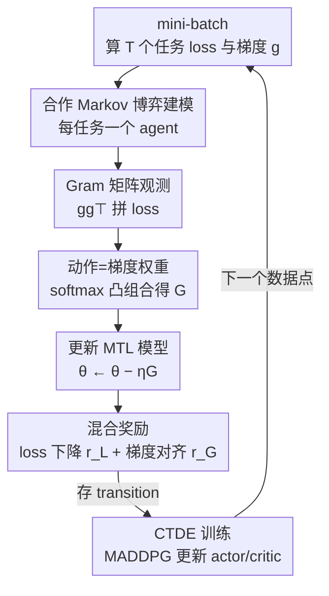

# TaskForce: Cooperative Multi-agent Reinforcement Learning for Multi-task Optimization

**会议**: CVPR 2026  
**论文**: [CVF Open Access](https://openaccess.thecvf.com/content/CVPR2026/html/Choi_TaskForce_Cooperative_Multi-agent_Reinforcement_Learning_for_Multi-task_Optimization_CVPR_2026_paper.html)  
**代码**: 无  
**领域**: 强化学习 / 多任务优化  
**关键词**: 多任务学习, 梯度冲突, 多智能体强化学习, 梯度聚合, 混合奖励

## 一句话总结
把多任务优化里"怎么把各任务梯度加权合成一个更新方向"这件事，建模成一个合作式多智能体强化学习问题：每个任务配一个 agent，观察一份用 Gram 矩阵压缩过的梯度摘要，输出自己梯度的权重，并由一个同时编码"梯度对齐"和"loss 下降"的混合奖励来驱动学习；在 NYU-v2、Cityscapes、QM9 上一致超过现有 SOTA 多任务优化方法。

## 研究背景与动机
**领域现状**：多任务学习（MTL）让一个模型同时优化多个任务的 loss，共享表示能带来知识迁移和算力节省。但同时回传多个 loss 的梯度时，常出现两类问题：**梯度冲突**（不同任务的梯度方向相反或发散）和**尺度失衡**（某些任务梯度幅度过大，主导更新），二者都会导致负迁移——一个任务的学习反而损害其它任务。多任务优化（MTO）方法正是为解决这两个问题而生。

**现有痛点**：现有 MTO 大致分两派，各有死穴。**梯度派**（PCGrad、CAGrad、NashMTL、Aligned-MTL 等）直接对各任务梯度做聚合，用投影到无冲突子空间、重加权、求 Pareto 平稳解等启发式规则合成一个方向——这类方法通常有收敛性保证，但聚合规则是**确定性、缺乏随机探索**的，收敛集更大，容易卡在差的局部极小。**loss 派**（DWA、UW、RLW、IGBv2 等）只在 loss 层面做文章（重加权 loss、利用收敛率/任务难度），虽然直观，但**完全不碰梯度信息**，无法显式化解梯度冲突这个负迁移的根源，因此整体打不过梯度派。

**核心矛盾**：理想的优化策略既要利用**梯度级**信息直接化解冲突（梯度派的长处），又要有**随机探索**能力跳出局部极小、并兼顾 loss 的实际下降（loss 派的直观）——但现有方法要么是无探索的确定性梯度启发式，要么是看不到梯度的 loss 重加权，没人把两者真正统一起来。已有的 IGBv2 虽然第一个用单智能体 RL 来平衡 loss 权重，却仍只在 loss 层面动作。

**本文目标**：设计一个**自适应**的梯度聚合策略，它能根据当前优化状态同时考虑梯度和 loss 信号，并自带随机探索以避开差的收敛点。

**切入角度**：把"每一步如何聚合各任务梯度"看成一个**序列决策问题**——给每个任务配一个 agent，让它们在共享网络这个"环境"里通过试错学到合作的聚合策略。RL 的奖励函数可以是不可微、可灵活设计的，正好能把梯度派的收敛性目标和 loss 派的下降信号揉进同一个奖励里；MARL 的探索随机性又能缓解局部极小问题。

**核心 idea**：用合作式多智能体强化学习（MARL）代替确定性启发式来做梯度聚合——每个任务 agent 观察压缩后的梯度摘要、输出自己梯度的权重，并由"梯度对齐 + loss 下降"的混合奖励共同驱动。

## 方法详解

### 整体框架
TaskForce 把多任务优化建模成一个**合作 Markov 博弈**：被训练的 MTL 模型本身是不断演化的"环境"，每个任务配一个独立 agent，所有 agent 协同决定每一步的联合更新方向。一次训练迭代的流转是：从一个 mini-batch 算出 $T$ 个任务的 loss 和梯度 → 把梯度的 Gram 矩阵 $gg^\top$ 与 loss 拼成一份紧凑**观测** → 每个 agent 根据自己那行观测输出一个**动作**（标量，经 softmax 归一化成权重）→ 把各任务梯度按权重凸组合成聚合梯度 $G$、用它更新 MTL 模型 → 用**混合奖励**评价这次聚合的好坏 → 把 transition 存入 replay buffer，并按"集中训练、分散执行"（CTDE）范式更新 actor/critic。下一步的观测直接用下一个数据点产生，避免为构造 next observation 重复一遍前向反向。

### 关键设计

**1. 把多任务优化建模为合作 Markov 博弈：让 agent 学聚合权重而非手写启发式**

这一设计直击痛点"确定性启发式聚合无探索、易卡局部极小"。作者给 $T$ 个任务各配一个 agent，定义博弈的三大要素：观测 $\mathcal{O}$、动作 $\mathcal{A}$、奖励 $\mathcal{R}$。**动作**是每个 agent 输出的一个标量 $a_t = \mu_t(o_t;\phi_t)$，经 softmax 归一成权重 $w_t = \frac{\exp(a_t)}{\sum_k \exp(a_k)}$，再把各任务梯度凸组合成最终更新方向 $G = \sum_{t=1}^{T} w_t g_t$。这个凸组合约束（$\sum_t w_t=1,\ w_t\ge 0$）保证更新方向落在各任务梯度的凸包内，既允许灵活混合，又只要求每个 agent 输出一个常数，动作空间极小。和确定性梯度派的根本区别在于：聚合权重不再来自固定规则，而是 agent 在试错中学到的**随机策略**，探索随机性帮助跳出差的收敛点；和 IGBv2 这类单智能体 loss-RL 的区别在于：这里 agent 直接在**梯度层面**做聚合决策，而非只调 loss 权重。

**2. Gram 矩阵观测：把高维梯度压成 $T\times T$ 的紧凑摘要喂给 agent**

若把原始梯度 $g\in\mathbb{R}^{T\times|\theta|}$ 直接喂给 agent，维度随网络参数量 $|\theta|$ 暴涨（如 MTAN 共享参数约 44.1M），RL 训练在算力上不可行。作者用任务梯度的 **Gram 矩阵** $gg^\top\in\mathbb{R}^{T\times T}$ 来表示梯度，并把它和 loss 向量拼成观测：$\mathcal{O}=\{gg^\top\,|\,\mathcal{L}(\theta)\}$，每个 agent 拿到的是其中一行 $o_t\in\mathbb{R}^{T+1}$。这一表示的妙处在于它**无损保留了化解冲突所需的关键信息**：对角元 $g_t\cdot g_t$ 编码各任务梯度的幅度（对应尺度失衡），非对角元 $g_i\cdot g_j$ 编码任务间的两两对齐/冲突（对应梯度冲突）。因为任务数 $T \ll |\theta|$，观测维度从 $O(|\theta|)$ 降到 $O(T)$，使 MARL 训练在算力上可承受——消融里去掉 $gg^\top$ 这一项会因显存爆掉（OOM）而无法正常训练，正说明这步是让整个框架跑得起来的前提。

**3. 混合奖励：同时编码"梯度对齐"和"loss 下降"，把两派长处揉进一个标量**

只用 loss 信号会近视、看不到梯度交互；只用梯度信号又忽略 loss 的实际下降。作者设计了一个混合奖励 $\mathcal{R}=\lambda_\mathcal{L} r_\mathcal{L}+\lambda_\mathcal{G} r_\mathcal{G}$。其中 **loss 项** $r_\mathcal{L}=\sum_t \log(1+\mathcal{L}_t^{\text{prev}})-\sum_t \log(1+\mathcal{L}_t')$ 度量各任务 loss 的相对改善，对数变换使其对不同尺度的 loss 具有尺度不变性、提供即时反馈；**梯度项** $r_\mathcal{G}=-\|\sum_t w_t g_t\|_2^2$ 把多目标优化里"找一个共同下降方向、收敛到 Pareto 最优"的凸最小化问题 $\min_w \|\sum_t w_t g_t\|_2^2$ 反写成奖励最大化，鼓励 agent 选出与**可证收敛方向**对齐的策略。两项相加，agent 既追求每步 loss 实打实地降，又长期对齐到稳定的 Pareto 收敛方向。因为是完全合作场景，奖励 $\mathcal{R}$ 由所有 agent 共享。实验中 $\lambda_\mathcal{L}=1.0$、$\lambda_\mathcal{G}=1\times10^{-3}$。

**4. CTDE 训练：集中 critic 解决信用分配，分散 actor 保证执行高效**

多个 agent 同时学习会破坏 Markov 假设、带来非平稳性，难收敛。作者采用 MADDPG 的"集中训练、分散执行"（CTDE）：每个 agent 有一个**分散的** actor $\mu_t(\cdot;\phi_t)$（执行时只看自己那行局部观测 $o_t$，高效）和一个**集中的** critic $Q_t^\mu(\mathcal{O},\mathcal{A};\psi_t)$（训练时能看到所有 agent 的观测与动作，缓解非平稳、改善信用分配）。训练走 off-policy：把 transition $(\mathcal{O},\mathcal{A},\mathcal{R},\mathcal{O}')$ 存入 replay buffer，critic 最小化 TD 误差，actor 按确定性策略梯度更新，target 网络用系数 $\tau$ 做软更新。消融显示集中 critic（CT）能靠全局信息提升优化效果，而分散执行（DE）在几乎不掉点的前提下把训练成本从 $\times3.21$ 降到 $\times1.00$，是让整体训练开销与传统方法相当的关键。

### 损失函数 / 训练策略
MTL 主网络用聚合梯度 $G$ 做标准梯度下降 $\theta\leftarrow\theta-\eta G$。RL 侧 critic 最小化 TD 误差（式 11），actor 按确定性策略梯度更新（式 12），target 网络做软更新（式 13）。每个训练迭代先算 loss/梯度并存 transition，再更新主网络，最后从 buffer 采样更新 agent；next observation 复用下一个数据点以省去额外前向反向。

## 实验关键数据

### 主实验
在三个差异很大的基准上对比 12 个 MTO 基线（指标越低越好的 $\Delta_m$ / $\Delta_t$ 表示相对单任务学习 STL 的性能退化）：

| 数据集 (网络) | 任务数 | 指标 | 本文 | 最强基线 | 备注 |
|--------|------|------|------|----------|------|
| NYU-v2 (MTAN) | 3 | $\Delta_m\downarrow$ | **−6.47%** | −4.93% (Aligned-MTL) | 室内场景，分割/深度/法向 |
| NYU-v2 (MTAN) | 3 | $\Delta_t\downarrow$ | **−9.96%** | −8.40% (Aligned-MTL) | 任务级退化 |
| Cityscapes (PSPNet) | 3 | $\Delta_m\downarrow$ | **−0.65%** | −0.02% (Aligned-MTL) | 户外场景，分割/实例/视差 |
| QM9 (MPNN) | 11 | $\Delta_m\downarrow$ | **+59.0%** | +62.0% (NashMTL) | 11 个分子属性回归，最难 |

$\Delta_m$ 为负代表多任务比单任务还好。QM9 因任务多、loss 尺度差异大而极具挑战，强基线 Aligned-MTL 在这里退化到 +81.9%，而 TaskForce 仍是所有方法里退化最小的（+59.0%），说明它在复杂梯度交互下更稳健。

### 消融实验
在 NYU-v2 上按"逐步加入 5 个组件"做消融（training cost 相对最终配置，$rG$ 之外的配置均设 $\mathcal{R}=r_\mathcal{L}$）：

| gg⊤ | MA | CT | DE | rG | 训练成本 | $\Delta_m\downarrow$ | $\Delta_t\downarrow$ |
|---|---|---|---|---|---|------|------|
| ✗ | — | — | ✓ | | ×2.59M* | −2.89% | −4.05% |
| ✓ | ✓ |  |  | | ×0.95 | −4.26% | −7.19% |
| ✓ | ✓ | ✓ |  | | ×3.21 | −5.23% | −8.31% |
| ✓ | ✓ | ✓ | ✓ | | ×1.00 | −5.18% | −8.26% |
| ✓ | ✓ | ✓ | ✓ | ✓ | ×1.00 | **−6.47%** | **−9.96%** |

（MA=多智能体，CT=集中训练，DE=分散执行；*因 OOM 为粗略估计）

### 关键发现
- **Gram 矩阵观测是前提**：不用 $gg^\top$ 直接喂原始梯度时，44.1M 参数让训练成本爆到 ×2.59M 量级并触发 OOM，根本不可行——压缩观测是让 MARL 跑得起来的必要条件。
- **梯度奖励 $r_\mathcal{G}$ 贡献明显**：在已有 CTDE 的基础上加入 $r_\mathcal{G}$，$\Delta_m$ 从 −5.18% 进一步提升到 −6.47%，$\Delta_t$ 从 −8.26% 到 −9.96%，证明"对齐可证收敛方向"这个梯度级信号确实有用。
- **DE 几乎免费换效率**：从"集中训练+集中执行"（×3.21）切到加入分散执行（×1.00），$\Delta_m$ 仅由 −5.23% 微动到 −5.18%，却把训练成本砍到约 1/3，使整体开销与传统 MTO 相当。
- **算力开销可接受**：每 epoch 墙钟时间上，3 任务场景与梯度/混合派基线无显著差异；11 任务的 QM9 上也在可接受范围（多智能体的学习与推理时间占比远小于 MTL 网络本身的梯度计算）。

## 亮点与洞察
- **用 Gram 矩阵当"梯度的指纹"**：$gg^\top$ 的对角=幅度、非对角=两两对齐，恰好把"尺度失衡"和"梯度冲突"两个负迁移根源压成一个 $T\times T$ 小矩阵，既省算力又不丢关键信息——这个观测设计是把 RL 引入 MTO 的关键工程突破。
- **奖励函数是"两派融合"的载体**：RL 奖励可不可微、可自由设计的特性，被用来把梯度派的凸最小化目标 $-\|\sum_t w_t g_t\|^2$ 和 loss 派的对数 loss 改善同时塞进一个标量，比起在算法层硬拼两派启发式更优雅。
- **可迁移思路**："把一个确定性的、需要手写规则的聚合/调度问题，重写成带紧凑状态摘要的合作 MARL"这一范式，可迁移到联邦学习的客户端加权、混合专家的路由、课程学习的任务调度等同样面临"多源信号加权"的场景。

## 局限与展望
- **agent 数随任务数线性增长**：每个任务一个 agent，11 任务的 QM9 已是论文里最大规模；任务数继续上升时 MARL 的非平稳性与训练成本如何 scale，作者放在附录讨论，正文未充分展开。⚠️ 大规模任务下的可扩展性以原文附录为准。
- **奖励权重需调**：$\lambda_\mathcal{L}$ 与 $\lambda_\mathcal{G}$ 相差三个数量级（1.0 vs 1e-3），不同数据集上的最优配比是否稳健、对超参的敏感性，正文给的是固定值，缺少系统的敏感性分析。
- **额外的 RL 机制开销**：虽然整体墙钟与传统方法相当，但引入了 replay buffer、集中 critic、target 网络等额外组件与实现复杂度（探索噪声缩放、奖励归一化等细节被略去），落地成本比一行式的梯度聚合规则高。
- **仍依赖 MADDPG**：直接采用了 Lowe et al. 的 MADDPG，未探索更现代的 MARL 算法是否能进一步提升或简化。

## 相关工作与启发
- **vs 梯度派（PCGrad / CAGrad / NashMTL / Aligned-MTL）**：它们用确定性启发式（投影、重加权、Pareto 求解）聚合梯度，有收敛保证但无探索、易卡局部极小；TaskForce 用学到的随机策略做聚合，靠探索跳出差极小，并在 NYU-v2/QM9 上一致超过最强的 Aligned-MTL。
- **vs loss 派（DWA / UW / RLW）**：它们只调 loss 权重、看不到梯度，无法显式化解冲突；TaskForce 在梯度层面动作，并用 Gram 矩阵把梯度交互信息喂给 agent。
- **vs IGBv2（单智能体 loss-RL）**：IGBv2 第一个用 RL 平衡 loss 权重，但仍只在 loss 层面操作；TaskForce 把它推进到**多智能体 + 梯度层面**，并用混合奖励同时利用梯度与 loss 信号。
- **vs 混合派（IMTL 等）**：混合派也同时用 loss 和梯度信号，但仍是确定性启发式加权、同样可能卡局部极小；TaskForce 用 MARL 的探索随机性来缓解这一点。

## 评分
- 新颖性: ⭐⭐⭐⭐⭐ 首次把多任务优化系统性地建模为合作 MARL，Gram 矩阵观测 + 混合奖励的组合很巧。
- 实验充分度: ⭐⭐⭐⭐ 覆盖室内/户外/分子三类基准与 12 个基线，5 组件递增消融扎实；但缺奖励权重敏感性与更大任务规模的分析。
- 写作质量: ⭐⭐⭐⭐ 动机—方法—奖励设计的逻辑链清晰，三要素定义到位。
- 价值: ⭐⭐⭐⭐ 给 MTO 提供了"用 RL 学聚合策略"的新范式，思路可迁移到其它多源加权问题。

<!-- RELATED:START -->

## 相关论文

- [\[ICML 2026\] LLM-Guided Communication for Cooperative Multi-Agent Reinforcement Learning](../../ICML2026/reinforcement_learning/llm-guided_communication_for_cooperative_multi-agent_reinforcement_learning.md)
- [\[CVPR 2026\] MangoBench: A Benchmark for Multi-Agent Goal-Conditioned Offline Reinforcement Learning](mangobench_a_benchmark_for_multi-agent_goal-conditioned_offline_reinforcement_le.md)
- [\[ICML 2025\] Enhancing Cooperative Multi-Agent Reinforcement Learning with State Modelling and Adversarial Exploration](../../ICML2025/reinforcement_learning/enhancing_cooperative_multi-agent_reinforcement_learning_with_state_modelling_an.md)
- [\[AAAI 2026\] Explaining Decentralized Multi-Agent Reinforcement Learning Policies](../../AAAI2026/reinforcement_learning/explaining_decentralized_multi-agent_reinforcement_learning_policies.md)
- [\[NeurIPS 2025\] Mean-Field Sampling for Cooperative Multi-Agent Reinforcement Learning](../../NeurIPS2025/reinforcement_learning/mean-field_sampling_for_cooperative_multi-agent_reinforcement_learning.md)

<!-- RELATED:END -->
