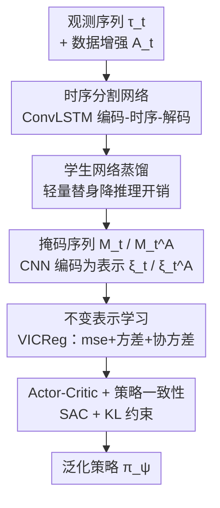

# TSTM: Temporal Segmentation for Task-relevant Mask in Visual Reinforcement Learning Generalization

**会议**: CVPR 2026  
**论文**: [CVF Open Access](https://openaccess.thecvf.com/content/CVPR2026/html/Du_TSTM_Temporal_Segmentation_for_Task-relevant_Mask_in_Visual_Reinforcement_Learning_CVPR_2026_paper.html)  
**代码**: https://github.com/sduwcdd/tstm  
**领域**: 强化学习 / 视觉泛化  
**关键词**: 视觉强化学习, 泛化, 任务相关掩码, 时序分割, 不变表示学习

## 一句话总结
TSTM 用一个带 ConvLSTM 的「编码器-时序-解码器」分割网络从连续多帧观测里抠出任务相关区域（掩码），再配合 VICReg 式不变表示学习和策略一致性约束训练 SAC，在 DMC-GB 的 video easy/hard 上把视觉强化学习的泛化能力刷到 SOTA。

## 研究背景与动机
**领域现状**：视觉强化学习（visual RL）直接从像素学控制策略，但训练环境和测试环境一旦在背景、光照、物体纹理上不一致，策略性能就会大幅崩溃。主流的三类泛化方法——数据增强、表示学习、正则化——都试图让策略对视觉扰动更鲁棒。

**现有痛点**：这三类方法都没有显式区分「任务相关区域」和「任务无关区域」，策略很容易被背景里的干扰信息带偏。后来的 SGQN、MaDi 意识到了这点，开始用一致性正则或像素级掩码（masker）去强调任务相关像素、压制干扰，思路上往「分割任务相关区域」靠拢。

**核心矛盾**：但 SGQN/MaDi 这类方法只看**当前单帧观测**做分割，缺少时序信息。当智能体和背景颜色相近（论文图 1 的经典例子：黄色的 agent 落在黄色背景里）时，单帧根本分不清谁是 agent 谁是背景——掩码一旦出错，下游策略就跟着学歪。

**本文目标**：让分割不再依赖孤立的一帧，而是利用连续观测序列里的时序线索（运动、形变），产出更可靠的任务相关掩码，从而提升策略泛化。

**切入角度**：作者的观察是——agent 会动、背景（即使颜色相似）相对静止或运动模式不同，时序上的差异恰好是区分二者的强信号。单帧丢掉的正是这个信号。

**核心 idea**：把「单帧分割」换成「时序分割」——用 ConvLSTM 捕捉相邻帧之间的时序依赖来生成掩码序列，再用蒸馏出的轻量学生网络做推理，最后在掩码表示上叠加不变表示学习训练 actor-critic。

## 方法详解

### 整体框架
TSTM 的输入是一段长度为 $k$ 的观测序列 $\tau_t=\{o_i\}_{i=t-k+1}^{t}$，输出是一个对视觉扰动鲁棒、能迁移到未见背景的 SAC 策略。整条管线分三段：先**离线训练时序分割网络**（教师 → 蒸馏出学生），再在 RL 阶段用学生网络把原始序列和它的增强版各自分割成掩码序列，把两路掩码编码成表示并用**不变表示损失**拉齐，最后用这些表示直接当状态去训练 actor 和 critic，并额外加一条**策略一致性约束**。测试时只跑「学生分割 → 编码 → 取动作」这条轻量链路。

### 关键设计

**1. 时序分割网络（教师）：用 ConvLSTM 把多帧时序信息揉进掩码生成**

针对的痛点是单帧分割在「agent 与背景同色」时失效。教师网络 $S_T$ 采用 encoder-temporal-decoder 结构：编码器逐帧抽特征（Conv + MaxPool），中间一个 **ConvLSTM** 模块沿时间轴传递隐状态 $h$ 和细胞状态 $c$，让第 $i$ 帧的分割能参考前面 $i-1$ 帧的运动线索，解码器再上采样回像素级掩码。形式上 $U_t=S_T(\tau_t)$，逐帧输出分割 $u_i$。监督用两项损失合成：像素级的二值交叉熵 $\mathcal{L}_{\text{BCE}}=-\frac{1}{H\times W}\big(y_i\odot\log u_i+(1-y_i)\odot\log(1-u_i)\big)$ 保证逐像素对齐，再加一项基于 Sørensen–Dice 系数的 $\mathcal{L}_{\text{Dice}}=1-\frac{2\langle y_i,u_i\rangle+\epsilon}{\|y_i\|_1+\|u_i\|_1+\epsilon}$ 直接优化预测区域与真值区域的重叠度（对小目标/前景占比小的情形更稳）。总目标 $\mathcal{L}_{S_T}=\nu\cdot\mathcal{L}_{\text{BCE}}+(1-\nu)\cdot\mathcal{L}_{\text{Dice}}$。之所以有效：当某一帧 agent 和背景颜色几乎一样时，单帧 BCE/Dice 都无从下手，但 ConvLSTM 携带的「上一帧 agent 在哪、往哪动」的时序先验能把当前帧的歧义区域判对。

**2. 学生网络蒸馏：用一个轻量替身把时序分割的推理成本压下来**

教师网络带 ConvLSTM、又要处理整段序列，推理开销不小，而 RL 每一步都要调分割网络。作者因此训练一个更紧凑的学生网络 $S_S$ 做部署时的替身。蒸馏对齐的是**倒数第二层特征**而非最终掩码：取教师/学生倒数第二层映射 $s^T=S_T^{(L-1)}(\tau_t)$、$s^S=S_S^{(L-1)}(\tau_t)$，用一个带温度 $\zeta$ 的 sigmoid 软化后做 L2 蒸馏 $\mathcal{L}_{\text{KD}}=\frac{1}{k\times H\times W}\big\|\sigma(\frac{s^S}{\zeta})-\sigma(\frac{s^T}{\zeta})\big\|_2^2$。学生总损失把蒸馏项和它自己的分割监督项加权合并 $\mathcal{L}_S=\beta\cdot\mathcal{L}_{\text{KD}}+(1-\beta)\cdot\mathcal{L}_{S_S}$（$\mathcal{L}_{S_S}$ 与教师同款 BCE+Dice 形式）。对齐中间特征（而非只对齐输出 logits）能让学生继承教师的时序表示，从而在小模型上也保住分割质量——这是「保精度、降开销」的关键。RL 阶段和测试阶段都只用冻结的学生网络 $S_S$。

**3. 不变表示学习：在掩码序列的表示上施加 VICReg 式三项约束，防扰动也防坍缩**

光有干净掩码还不够——编码器仍可能对残留的视觉变化敏感，且容易表示坍缩。作者对原始序列 $\tau_t$ 和它的增强版 $A_t=\{\text{aug}(o_i)\}$ 分别用学生网络得到掩码序列 $M_t=S_S(\tau_t)$、$M_t^A=S_S(A_t)$，CNN 编码器抽表示 $\xi_t=\text{Enc}(M_t;\theta)$、$\xi_t^A=\text{Enc}(M_t^A;\theta)$，再过一个两层 MLP 投影器得到 $z_t,z_t^A$，在投影空间施加 VICReg 三项：

$$\mathcal{L}_{\text{mse}}=\|z_t-z_t^A\|_2^2,\quad \mathcal{L}_{\text{var}}=\frac{1}{d}\sum_{i=1}^{d}\big[\max(0,\Gamma-\sqrt{\text{Var}(z_{t,i})+\eta})+\max(0,\Gamma-\sqrt{\text{Var}(z_{t,i}^A)+\eta})\big]$$

不变项 $\mathcal{L}_{\text{mse}}$ 强制增强前后表示一致（学到对背景扰动不变的特征）；方差项 $\mathcal{L}_{\text{var}}$ 用 hinge 把每个维度的标准差顶到阈值 $\Gamma$ 之上，**防止表示坍缩**；协方差项 $\mathcal{L}_{\text{cov}}=\frac{1}{d}\sum_{i\neq j}[C(z_t)_{ij}^2+C(z_t^A)_{ij}^2]$ 压低不同维度间的相关、让各维捕捉互补信息。三项加权 $\mathcal{L}_{\text{INV}}=\lambda\mathcal{L}_{\text{mse}}+\mu\mathcal{L}_{\text{var}}+\rho\mathcal{L}_{\text{cov}}$ 共同优化编码器和投影器。直接复用 VICReg 而非对比损失，省掉了负样本/大 batch 的依赖，对 RL 这种 on-policy 数据量有限的场景更友好。

**4. Actor-Critic 学习 + 策略一致性约束：把鲁棒性从表示一路传到策略输出**

最终用掩码表示 $\xi_t$ 直接作为 SAC 的状态 $s_t$ 训练 actor $\pi_\psi$ 和 critic $Q_\theta$。critic 走标准 SAC 的 TD 目标 $\mathcal{L}_C=\mathbb{E}[(Q_\theta(s_t,a_t)-(r_t+\gamma V_{\bar\theta}(s_{t+1})))^2]$，value 估计带熵项 $V_{\bar\theta}(s_{t+1})=\mathbb{E}_{a_{t+1}\sim\pi_\psi}[Q_{\bar\theta}(s_{t+1},a_{t+1})-\alpha\log\pi_\psi(a_{t+1}\mid s_{t+1})]$。actor 除了标准 SAC 目标 $\mathcal{L}_\pi$，还额外加一条**策略一致性约束**：在原始嵌入 $\xi_t$ 和增强嵌入 $\xi_t^A$ 上分别评估策略，用带 stop-gradient 的 KL 散度把二者拉齐 $\mathcal{L}_{\text{PC}}=\mathbb{E}[D_{\text{KL}}(\text{sg}(\pi_\psi(\cdot\mid\xi_t))\,\|\,\pi_\psi(\cdot\mid\xi_t^A))]$，合并为 $\mathcal{L}_A=\mathcal{L}_\pi+\varsigma\mathcal{L}_{\text{PC}}$。不变表示约束的是「特征」，而策略一致性约束的是「动作分布」——即使表示层有残差，也要保证增强前后输出的动作分布一致，把鲁棒性从表示层进一步贯穿到决策层。

### 损失函数 / 训练策略
整体分三阶段串行：① 用真值掩码序列训练教师分割网络（BCE+Dice），训完冻结；② 用教师指导蒸馏学生网络（KD+分割监督），训完冻结；③ RL 阶段联合优化——每步从 buffer 取序列并增强，学生网络出掩码、编码器出表示，先更新编码器+投影器（$\mathcal{L}_{\text{INV}}$），再更新 critic（$\mathcal{L}_C$），最后更新 actor+编码器（$\mathcal{L}_A$）。测试时只跑学生分割 → 编码 → 采样动作，无需任何额外环境交互或参数更新。

## 实验关键数据

### 主实验
基准为 **DMC-GB**（5 个任务：Walker Walk/Stand、Ball in cup Catch、Finger Spin、Cartpole Swingup；训练用干净背景，测试用未见背景），分 video easy / video hard 两档难度。对比 SAC、SODA、SVEA、SGQN、MaDi、SimGRL。指标为最终回合回报（3 个随机种子）。

| 设置 | 任务 | SGQN | MaDi | SimGRL | TSTM (本文) |
|------|------|------|------|--------|-------------|
| video easy | Walker Walk | 910±24 | 895±24 | 910±21 | **912±42** |
| video easy | Ball in cup Catch | 950±24 | 807±144 | 964±7 | **969±2** |
| video easy | Finger Spin | 610±61 | 679±17 | 957±16 | **971±12** |
| video easy | Cartpole Swingup | 717±35 | 848±6 | 775±60 | **851±19** |
| video easy | **平均** | 828 | 839 | 916 | **934** |
| video hard | Walker Walk | 739±21 | 504±33 | 773±31 | **821±36** |
| video hard | Ball in cup Catch | 782±57 | 758±135 | 902±19 | **903±27** |
| video hard | Finger Spin | 541±53 | — | — | **906±10** |
| video hard | Cartpole Swingup | — | — | — | **741±22** |
| video hard | **平均** | — | — | — | **859** |

TSTM 在两档设置下大多数任务取得最高最终回报，平均回报均居首（easy 934 / hard 859）。唯一例外是 Walker Stand 屈居第二——作者解释是该任务 agent 几乎不动，时序变化太小，TSTM 的时序优势发挥不出来（这个 caveat 很诚实，与方法假设自洽）。

### 消融实验
在 Walker Walk 和 Cartpole Swingup 上逐一去掉三大组件（Table 2）：

| 配置 | Walker Walk (easy) | Cartpole (easy) | Walker Walk (hard) | Cartpole (hard) |
|------|--------------------|-----------------|--------------------|-----------------|
| TSTM (完整) | 912±42 | 851±19 | 821±36 | 741±22 |
| No Seg（去时序分割网络） | 788±47 | 733±42 | 391±25 | 333±33 |
| No INV（去不变表示学习） | 859±78 | 834±29 | 770±73 | 720±44 |
| No PC（去策略一致性约束） | 908±34 | 752±120 | 777±22 | 469±44 |

### 关键发现
- **时序分割网络贡献最大，且越难越关键**：去掉它（No Seg）在 video easy 上掉 12~14%，但在 video hard 上几乎腰斩——Walker Walk 821→391、Cartpole 741→333。这印证了核心论点：背景越复杂、越难和前景区分时，时序线索越不可替代。
- **策略一致性约束在难设置和 Cartpole 上尤为重要**：No PC 在 Cartpole video hard 上从 741 暴跌到 469，说明仅靠表示层不变性不够，必须把一致性约束传到动作分布。
- **不变表示学习是稳定的「锦上添花」项**：去掉后各设置普遍掉几十分但不崩，作用是提升表示鲁棒性而非决定成败。
- **定性可视化**：相比 SGQN（会切断 agent、产生碎片化轮廓）和 MaDi（混入背景如人体反光、背景泄漏），TSTM 的掩码能更完整地保住 agent 的姿态与结构。

## 亮点与洞察
- **把「时序」引入任务相关分割**是最核心的「啊哈」点：前作 SGQN/MaDi 都困在单帧，TSTM 指出同色干扰下单帧本质不可分，而运动时序天然提供区分信号——这是一个有清晰物理直觉、又有消融强支撑（hard 设置近乎腰斩）的观察。
- **教师-学生蒸馏对齐倒数第二层特征**而非输出 logits，是个可复用的 trick：在「每步都要调用分割网络」的 RL 场景里，用特征蒸馏既降开销又保住时序表示质量。
- **VICReg 式三项约束 + 策略一致性 KL** 的组合很值得借鉴：前者管特征层不变性与防坍缩，后者管动作分布层一致性，两层鲁棒性叠加，比单纯做表示对齐更彻底。这套「表示不变 + 策略不变」的双保险可以迁移到其他需要泛化的像素级控制任务。

## 局限与展望
- **依赖分割真值标签**：教师网络要靠 ground-truth 掩码 $Y_t$ 监督训练，这在很多真实机器人/导航场景里不易获得，限制了即插即用性（论文未讨论无标签或弱标签替代方案）。
- **静态任务上失效**：Walker Stand 因 agent 几乎不动、时序变化小，TSTM 优势消失甚至略逊——方法对「有运动」这一前提有依赖，纯静态或慢变场景收益有限。
- **三阶段串行、组件偏多**：教师→学生→RL 三段训练加上 BCE/Dice/KD/VICReg 三项/SAC/PC 等一长串损失，超参（$\nu,\beta,\zeta,\Gamma,\lambda,\mu,\rho,\varsigma$）众多，复现和调参成本不低，论文未给敏感性分析。
- **基准较窄**：主实验只在 DMC-GB 5 个任务上，机器人操作的结果放到了补充材料，泛化广度的证据还可更充分。

## 相关工作与启发
- **vs SGQN**: SGQN 用一致性正则强调任务相关像素、配自监督目标识别决策关键线索，但只看当前单帧。TSTM 的区别在于显式引入时序分割网络，用多帧运动线索解决同色歧义，hard 设置上明显胜出。
- **vs MaDi**: MaDi 在 actor-critic 里加一个 masker 产生像素级掩码衰减无关信号，同样是单帧。TSTM 的掩码来自时序网络，定性上不会像 MaDi 那样发生「背景泄漏」（如混入人体反光）。
- **vs SVEA / SODA（数据增强 / 表示学习类）**: 这些方法不显式区分任务相关/无关区域，靠增强或表示一致性间接抗扰动；TSTM 先用分割把无关背景直接抠掉，再叠加不变表示学习，等于「先净化输入再学鲁棒表示」，两条路互补。

## 评分
- 新颖性: ⭐⭐⭐⭐ 把时序信息引入任务相关掩码分割是有清晰动机、有消融支撑的实质创新，但分割+蒸馏+VICReg+SAC 多为已有组件的组合。
- 实验充分度: ⭐⭐⭐⭐ DMC-GB 两档难度 + 三大组件消融 + 定性可视化较扎实，但基准偏窄、机器人结果放补充、缺超参敏感性。
- 写作质量: ⭐⭐⭐⭐ 结构清晰、公式与伪代码完整，对 Walker Stand 失利的诚实解释加分。
- 价值: ⭐⭐⭐⭐ 为视觉 RL 泛化提供了「时序分割」这一可复用方向，代码开源；但依赖分割真值、对静态任务失效限制了落地范围。

<!-- RELATED:START -->

## 相关论文

- [\[ECCV 2024\] Visual Grounding for Object-Level Generalization in Reinforcement Learning](../../ECCV2024/reinforcement_learning/visual_grounding_for_object-level_generalization_in_reinforcement_learning.md)
- [\[CVPR 2026\] TaskForce: Cooperative Multi-agent Reinforcement Learning for Multi-task Optimization](taskforce_cooperative_multi-agent_reinforcement_learning_for_multi-task_optimiza.md)
- [\[CVPR 2026\] Incentivizing Generative Zero-Shot Learning via Outcome-Reward Reinforcement Learning with Visual Cues](incentivizing_generative_zero-shot_learning_via_outcome-reward_reinforcement_lea.md)
- [\[NeurIPS 2025\] Modulation of Temporal Decision-Making in a Deep Reinforcement Learning Agent under the Dual-Task Paradigm](../../NeurIPS2025/reinforcement_learning/modulation_of_temporal_decision-making_in_a_deep_reinforcement_learning_agent_un.md)
- [\[CVPR 2026\] Seeing is Improving: Visual Feedback for Iterative Text Layout Refinement](seeing_is_improving_visual_feedback_for_iterative_text_layout_refinement.md)

<!-- RELATED:END -->
