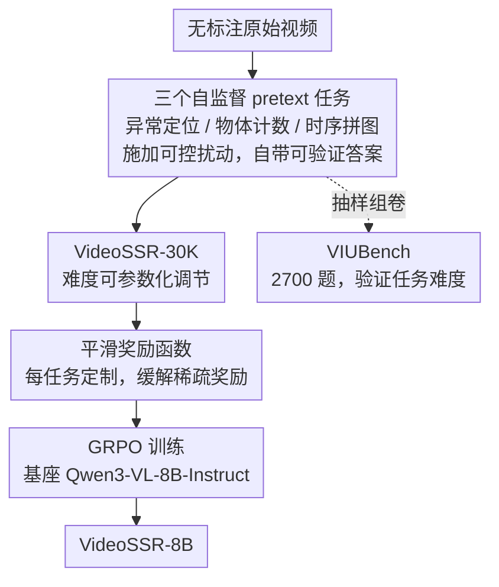

# VideoSSR: Video Self-Supervised Reinforcement Learning

**会议**: CVPR 2026  
**论文**: [CVF Open Access](https://openaccess.thecvf.com/content/CVPR2026/html/He_VideoSSR_Video_Self-Supervised_Reinforcement_Learning_CVPR_2026_paper.html)  
**代码**: https://github.com/lcqysl/VideoSSR  
**关键词**: 视频理解, RLVR, GRPO, 自监督, 平滑奖励

## 一句话总结
针对「强模型已被现有视频 RLVR 数据集喂饱、人工标注又太贵」的困境，VideoSSR 用三个可参数化调难度的视频自监督 pretext 任务（异常定位 / 物体计数 / 时序拼图）从原始视频自动造出带可验证答案的训练数据，再配上为每个任务定制的平滑奖励函数做 GRPO 训练，在 17 个 benchmark 上让 Qwen3-VL-8B 平均涨 5% 以上。

## 研究背景与动机

**领域现状**：RLVR（Reinforcement Learning with Verifiable Reward，即奖励只看答案对不对的强化学习）已经成为提升多模态大模型（MLLM）视频理解能力的主力路线，GRPO 是其中最常用的算法。它的前提是要有「问题 + 可自动核验的标准答案」的视频数据集，目前主流做法（LongVideoReason、ReWatch 等）靠多智能体协作去标注、生成这类高质量数据。

**现有痛点**：作者指出两个致命问题。第一，对 Qwen3-VL 这种很强的模型，现有数据集里大量问题太简单——他们对每个问题让模型独立采样 8 次回答，结果绝大多数问题要么 8 次全对、要么 8 次全错，呈现明显的双峰分布。第二，多智能体标注流程本身会引入系统性偏差和噪声，当标注模型比被训练的目标模型还弱时，会造出有缺陷或干脆错误的「标准答案」，正是这些错误标注导致「8 次全错」那一峰。

**核心矛盾**：GRPO 是靠同一问题下多个采样回答之间的**优势差异**（advantage）来更新策略的。当一个问题 8 次全对或 8 次全错时，组内回答的奖励方差为零，优势恒为零，这个样本对训练**毫无梯度贡献**。于是「太简单 + 标注错」双重原因把数据集变成一堆零方差样本，强模型在上面训练只能得到边际收益甚至倒退。再叠加视频人工标注本身的高昂成本，路就更窄了。

**切入角度**：作者借鉴传统视频自监督学习的思路——视频本身就含有丰富的内在信号（时序、空间、细粒度外观），完全可以**人为构造**一个扰动、再要求模型把扰动识别/还原回来，扰动的真值由构造过程天然给出，无需任何人或模型来标注，而且扰动的强度可以用参数直接调，从而把难度做成「可无限拔高」。

**核心 idea**：用「自监督 pretext 任务自动生成可验证训练数据」替代「多智能体/人工标注」，并为这些天然偏难的任务设计平滑奖励来喂饱 GRPO，从而绕开标注偏差、保证难度始终匹配模型能力。

## 方法详解

### 整体框架
VideoSSR 的整条管线只做一件事：把无标注的原始视频，自动变成能直接喂给 GRPO 的 RLVR 训练数据，再训出 VideoSSR-8B。具体分三步：先用三个 pretext 任务对原始视频施加可控扰动、自动产出「问题 + 可验证答案」对，汇成 30K 规模的 VideoSSR-30K 数据集；训练时用 GRPO，但把朴素的「答对得 1、答错得 0」严格奖励换成每个任务定制的**平滑奖励**，让奖励随答案接近真值连续变化；最终在 Qwen3-VL-8B-Instruct 上跑一个 epoch 得到 VideoSSR-8B。作者还把这三个任务单独抽出来组了一个评测基准 VIUBench，用来证明这些任务对当前最强模型也足够难。

### 关键设计

**1. 三个可参数化调难度的自监督 pretext 任务：从原始视频凭空造出可验证 QA**

这是全文的根基，针对「标注贵 + 标注有偏 + 难度不可控」的痛点。三个任务共享同一设计哲学——扰动由代码施加，真值由扰动过程本身给出，所以完全不依赖任何人或模型来标注，且难度能用参数直接拨。

- **异常定位（Anomaly Grounding）**：把视频 $V=\{f_1,\dots,f_T\}$ 随机选一段时间区间 $[t_s,t_e]$，对这段帧施加扰动函数 $P$（如红蓝通道互换、旋转 180°、缩小、水平镜像、段内帧序打乱），得到 $S'=P(S)$ 再替换回原视频。模型要在被改过的视频 $V'$ 里把异常区间的起止时间戳 $(t_s,t_e)$ 预测出来。这同时考验细粒度、空间、时序三种感知。
- **物体计数（Object Counting）**：在随机选中的若干帧上程序化叠加圆形/矩形/三角形等几何体（大小、颜色、旋转、位置都随机），要求模型数出每类形状的总数。真值为 $N_k=\sum_{f_i\in F_{sub}}|\{o\in O_i\mid \text{type}(o)=c_k\}|$。难度靠「最多叠几帧、每帧每类最多几个」来调（Easy：≤3 帧、≤3 个；Hard：≤4 帧、≤4 个）。
- **时序拼图（Temporal Jigsaw）**：把视频均匀切成 $n$ 段 $[S_1,\dots,S_n]$，按随机排列 $\pi$ 打乱成 $V'=[S_{\pi(1)},\dots,S_{\pi(n)}]$，要求模型恢复原始顺序，答案是逆排列 $\pi^{-1}$。难度靠切几段来调（Easy 6 段、Hard 8 段）。

可调难度这一点被 VIUBench 验证得很直接：物体计数从 Easy 切到 Hard，GPT-5 直接从 88.4 掉到 70.3；时序拼图从 6 段加到 8 段，分数从 39.0 跌到 27.0。这说明同一套生成器既能造简单题也能造难题，从而保证训练数据的难度永远跟得上模型的进步，不会像固定数据集那样很快被强模型「刷穿」。

**2. 逐任务定制的平滑奖励函数：把零方差的稀疏奖励变成稠密学习信号**

pretext 任务天生很难，如果用「完全答对才给 1 分」的严格奖励，GRPO 采样的一组回答很容易全军覆没（全 0），组内优势又退化成零，训练既低效又不稳。作者的对策是为每个任务设计随「答案接近真值的程度」连续变化的奖励，核心思想是**相对误差率**：

- 异常定位天然用 IoU 当奖励：$R_{ground}=\mathrm{IoU}(T_{pred},T_{gt})=\frac{|T_{pred}\cap T_{gt}|}{|T_{pred}\cup T_{gt}|}$，预测区间和真值重叠越多分越高，连续介于 0~1。
- 物体计数按每类的相对误差给分：$R_{count,k}=\max\!\big(0,\,1-\frac{|\hat y_k-y_k|}{y_k+\varepsilon}\big)$，再对 $K$ 类取平均 $R_{count}=\frac{1}{K}\sum_k R_{count,k}$，$\varepsilon$（如 $10^{-9}$）保数值稳定。数错一两个不会直接归零，而是按比例扣分。
- 时序拼图按元素错位的累计位移给分：$E_{jigsaw}=\sum_{k=1}^{n}|\mathrm{pos}(k,\hat P)-\mathrm{pos}(k,P_{gt})|$，再除以最大可能误差 $E_{max}$（完全倒序时取到）归一化，$R_{jigsaw}=1-\frac{E_{jigsaw}}{E_{max}}$。排序「差不多对」也能拿到部分奖励。

消融（Table 4）证明这一步很关键：换回严格奖励后模型几乎退回 baseline，作者解释正是严格奖励频繁触发 GRPO 的零优势、导致更新幅度过小，甚至在异常定位任务上用严格奖励训练会让 CharadesSTA 倒退。

**3. 任务多样性混合 + 纯净 GRPO：用「三任务混训」而非「单任务堆量」来提泛化**

作者刻意不去改 GRPO 算法本身（不用各种 GRPO 变体），奖励也只看答案正确性，把变量集中在**数据**上，从而干净地验证「数据范式」的价值。在固定 30K 数据规模下对比「单任务堆到 30K」与「三任务混合的 VideoSSR-30K」，发现单任务一味堆量会收益递减甚至掉点，而三任务混训显著更好。这说明覆盖细粒度、空间、时序多个维度的任务多样性，比把某一个 pretext 任务的数据规模拉满更能撑起综合视频理解能力——这也回应了相关工作里「以往只用单一拼图任务、自监督潜力没挖尽」的局限。

### 损失函数 / 训练策略
基座 Qwen3-VL-8B-Instruct，在 VideoSSR-30K 上跑 1 个 epoch 的 GRPO；学习率 $1\times10^{-6}$，全局 batch 64，每题 rollout 数 $N=8$，KL 惩罚系数 $1\times10^{-3}$，训练时 MAX_FRAMES=48、MAX_PIXELS=256×256，8 张 H200 约 16 小时。评测时 FPS=2，MAX_FRAMES ∈ {32,48,64}，MAX_PIXELS=512×512，贪婪解码保证可复现；跟随近期工作不使用思维链（CoT），以减少幻觉、保证输出格式正确。

## 实验关键数据

### VIUBench：证明 pretext 任务对最强模型也够难
| 模型 | VIUBench 平均分 |
|------|------|
| GPT-5（闭源最强） | 58.7 |
| Gemini-2.5-Pro | 56.7 |
| Qwen3-VL-235B-A22B | 30.5 |
| Qwen3-VL-8B-Instruct（基座） | 19.5 |
| **VideoSSR-8B（本文）** | **51.9** |

关键发现：连 GPT-5 也只拿到 58.7，开源 Qwen3-VL-8B 仅 19.5，说明「理解视频内在属性」是当前 MLLM 的真实瓶颈；而 VideoSSR-8B 把同基座从 19.5 直接拉到 51.9，逼近闭源大模型。

### 主结果：17 个 benchmark 覆盖四大任务
| 任务类别 | 代表 benchmark | Qwen3-VL-8B(64f) | VideoSSR-8B(64f) | 提升 |
|--------|------|------|------|------|
| 通用视频 QA | VinoGround | 45.0 | 55.6 | +10.6 |
| 长视频 QA | LVBench | 43.0 | 44.0 | +1.0 |
| 时序定位 | QVHighlights | 48.6 | 62.6 | +14.0 |
| 时序定位 | ActivityNet | 39.8 | 43.7 | +3.9 |
| 复杂推理 | VCRBench | 8.8 | 17.8 | +9.0 |

48 帧设置下，VideoSSR 在含 VIUBench 的全部 17 个 benchmark 上平均提升 5.1%。涨幅最猛的恰好落在与某个 pretext 任务高度相关的地方：异常定位任务带飞了时序定位（QVHighlights +15.9 @32f），时序拼图任务带飞了复杂推理（VCRBench +9.0 @64f），印证了「pretext 任务能力会迁移到对应下游任务」。

### 奖励函数消融（Table 4）
| 训练配置 | Video-MME(All) | CharadesSTA mIoU | VCRBench Acc |
|--------|------|------|------|
| Baseline（基座） | 64.1 | 50.3 | 7.4 |
| 三任务 + 严格奖励 | 64.8 | 51.3 | 10.7 |
| 三任务 + **平滑奖励** | **65.2** | **52.1** | 10.7 |

### 与人工标注数据集对比（Table 5）
| 训练数据 | 规模 | Video-MME | CharadesSTA mIoU | VCRBench Acc |
|--------|------|------|------|------|
| None（基座） | – | 64.1 | 50.3 | 7.4 |
| LongVideoReason | 32k | 63.6 | 51.7 | 7.1 |
| ReWatch | 27k | 64.7 | 51.6 | 2.7 |
| **VideoSSR-30K** | 30k | **65.2** | **52.1** | **10.7** |

### 关键发现
- **标注数据可能帮倒忙**：用比 Qwen3-VL 更弱的模型标注出来的 LongVideoReason 去微调强模型，Video-MME 反而从 64.1 掉到 63.6，VCRBench 从 7.4 掉到 7.1——直接印证了动机里「弱标注者造出有偏奖励信号」的判断，也是自监督范式的最有力佐证。
- **多样性 > 堆量**：固定 30K 规模下，单任务堆量收益递减甚至掉点，三任务混合明显更优。
- **扰动子类型要挑**：异常定位的 14 种扰动里，作者挑了 4 种增益明显的做最终训练集；而「模拟快进/抽密帧」这类针对时序的扰动反而有负作用，作者推测是因为 Qwen3-VL 靠文本时间戳来感知时序，刻意制造视觉时序异常会把模型搞糊涂。

## 亮点与洞察
- **把「自监督的核心优势」迁移到了 RLVR**：自监督最大的价值是真值天然、无需标注、难度可控；本文敏锐地发现这恰好能根治 RLVR 「标注贵 + 标注有偏 + 强模型刷穿数据」的三连痛点，思路转换非常漂亮。
- **零方差视角解释得很到位**：用「8 次采样要么全对要么全错 → GRPO 组内优势为零 → 没梯度」把数据失效的机理讲透，这是一个可复用的判断「RLVR 数据还有没有价值」的诊断工具。
- **平滑奖励是稀疏奖励任务的通用解法**：相对误差率 / IoU / 归一化位移这三种平滑奖励的构造思路，可直接迁移到其他「答案是结构化对象（区间、计数、排列）」的 RLVR 任务上。
- **pretext 任务与下游能力的对应关系清晰可迁移**：哪类扰动练哪种感知、又涨哪个下游 benchmark，几乎是一一对应的，这给「按需定制 pretext 任务来补某项能力」提供了可操作的配方。

## 局限与展望
- **长视频仍有差距**：训练和评测都用较少帧（≤64），在长视频 QA 上与闭源模型还有明显 gap，作者自己点名为未来方向。
- **扰动是合成的、与真实分布有偏**：叠几何体、转通道、打乱帧序都是人工合成扰动，和真实视频里的「自然异常 / 真实物体」存在分布差异，能否泛化到真实异常检测、真实计数等场景未充分验证。
- **依赖基座的既有偏置**：快进类时序扰动反而掉点，是因为 Qwen3-VL 用文本时间戳感知时序——这意味着 pretext 任务的有效性与基座的感知机制强耦合，换基座可能要重挑扰动子类型。
- **奖励设计仍是手工**：三个平滑奖励都是手调公式，扩展到新 pretext 任务时需要为每个任务重新设计奖励，缺一个统一的自动化奖励生成机制。

## 相关工作与启发
- **vs LongVideoReason / ReWatch（多智能体标注的 RLVR 数据集）**：它们靠多智能体协作标注，本文用自监督扰动自动生成；本文优势是零标注成本、难度可控、无标注偏差，实验里甚至证明前者会让强模型倒退。
- **vs Video-R1 / Time-R1 / SpaceR（任务特化的视频 RLVR）**：这些方法各自只增强单一能力（QA / 时序定位 / 空间推理），本文用三任务混合追求广谱泛化，在四大类任务上同时涨点。
- **vs VideoJigsaw 等单一拼图自监督**：以往只用一个拼图 pretext 任务，本文把自监督扩展成「异常定位 + 计数 + 拼图」的多样任务集合，并证明多样性比单任务堆量更能提升综合理解能力。

## 评分
- 新颖性: ⭐⭐⭐⭐⭐ 把自监督 pretext 任务搬进 RLVR 数据生成，一招同时解掉标注成本、标注偏差、难度可控三个痛点，切入点很巧。
- 实验充分度: ⭐⭐⭐⭐⭐ 17 个 benchmark、三种帧设置，奖励/任务/数据集/扰动子类型四组消融齐全，还自建 VIUBench 佐证动机。
- 写作质量: ⭐⭐⭐⭐ 动机用零方差讲得透彻、公式完整；不足是长视频差距与合成-真实分布偏差讨论略浅。
- 价值: ⭐⭐⭐⭐⭐ 提供了可无限扩展、零标注、难度自适应的视频 RLVR 数据范式，对「强模型时代如何继续造高质量训练数据」很有借鉴意义，且已开源。

<!-- RELATED:START -->

## 相关论文

- [\[CVPR 2026\] EVA: Efficient Reinforcement Learning for End-to-End Video Agent](eva_efficient_reinforcement_learning_for_end-to-end_video_agent.md)
- [\[NeurIPS 2025\] RoiRL: Efficient, Self-Supervised Reasoning with Offline Iterative Reinforcement Learning](../../NeurIPS2025/reinforcement_learning/roirl_efficient_self-supervised_reasoning_with_offline_iterative_reinforcement_l.md)
- [\[ICCV 2025\] Progressor: A Perceptually Guided Reward Estimator with Self-Supervised Online Refinement](../../ICCV2025/reinforcement_learning/progressor_a_perceptually_guided_reward_estimator_with_self-supervised_online_re.md)
- [\[CVPR 2026\] Reinforce to Learn, Elect to Reason: A Dual Paradigm for Video Reasoning](reinforce_to_learn_elect_to_reason_a_dual_paradigm_for_video_reasoning.md)
- [\[ICLR 2026\] Self-Harmony: Learning to Harmonize Self-Supervision and Self-Play in Test-Time Reinforcement Learning](../../ICLR2026/reinforcement_learning/self-harmony_learning_to_harmonize_self-supervision_and_self-play_in_test-time_r.md)

<!-- RELATED:END -->
