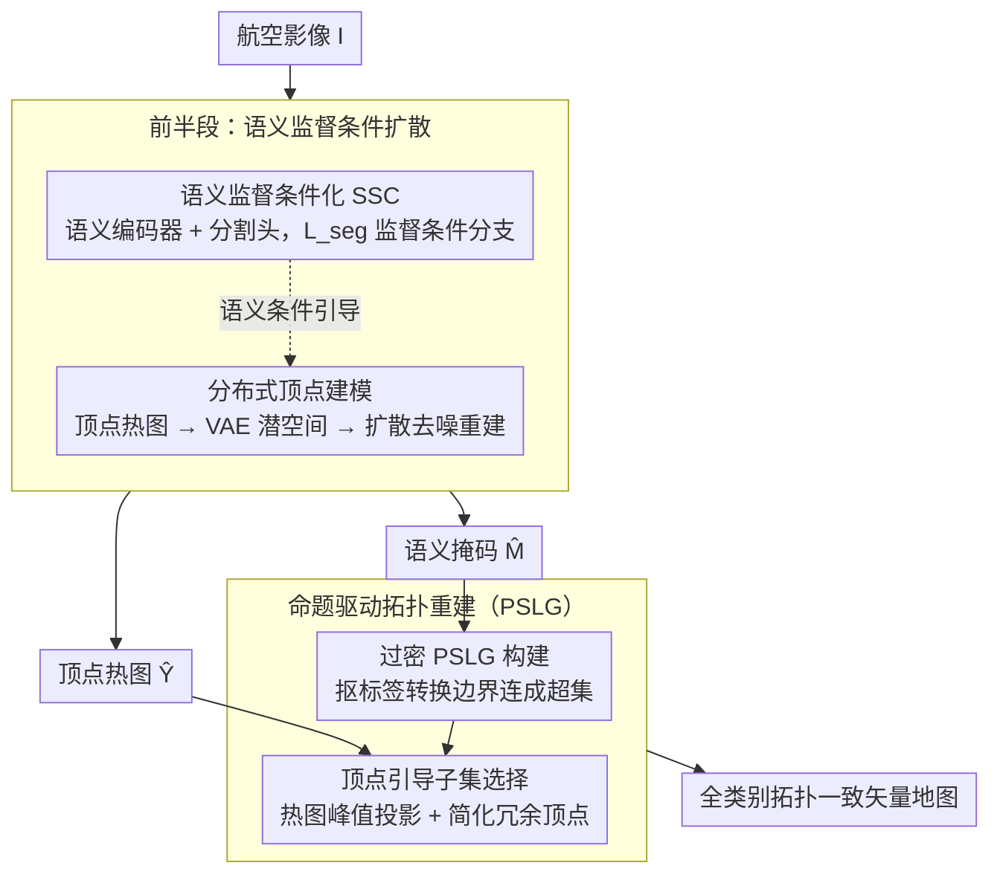

# ACPV-Net: All-Class Polygonal Vectorization for Seamless Vector Map Generation from Aerial Imagery

**会议**: CVPR 2026  
**arXiv**: [2603.16616](https://arxiv.org/abs/2603.16616)  
**代码**: [HeinzJiao/ACPV-Net](https://github.com/HeinzJiao/ACPV-Net)  
**领域**: 遥感  
**关键词**: polygonal vectorization, vector map generation, planar partition, conditional diffusion, topological consistency, aerial imagery

## 一句话总结

提出 ACPV-Net，首个从航空影像一次性生成拓扑一致的全类别多边形矢量地图的框架，通过语义监督条件化扩散模型生成顶点热图，并借助命题驱动的 PSLG 重建确保零间隙/零重叠。

## 研究背景与动机

**矢量底图的重要性**：矢量底图（topographic map）是国家地理空间数据基础设施的核心，广泛用于地籍管理和土地规划，要求相邻多边形共享精确边界，且无间隙/无重叠。

**现有方法的根本缺陷**：当前多边形化方法（DeepSnake、FFL、TopDiG、HiSup、GCP）均为单类别设计，需逐类推理后拼接，拼接过程不可避免地引入重复边界、间隙和重叠等拓扑不一致问题。

**五大技术挑战**：(i) 语义-几何异质性（栅格离散语义 vs. 矢量连续几何）；(ii) 语义区域与几何边界需严格对齐；(iii) 弱/模糊视觉线索（阴影、遮挡、语义模糊边界）；(iv) 制图惯例（顶点采样密度、简化策略）难以显式编码；(v) 全局拓扑重建超越单类几何范畴。

**缺乏评测基准**：现有数据集要么只有单类矢量标注（WHU-Building），要么只有多类栅格掩码（LoveDA、ISPRS），没有支持全类别多边形矢量化及全局拓扑一致性评测的公开基准。

**判别式方法的局限**：现有判别式顶点检测方法在弱视觉线索下产生宽泛或带状响应，缺乏对制图惯例的学习能力。

**条件扩散管道的不足**：现有条件扩散管道（如 ControlNet）注入外部条件但未对条件分支施加显式语义监督，无法保证语义-几何对齐。

## 方法详解

### 整体框架

ACPV-Net 要解决的是"一次性从航空影像生成一张全类别、拓扑严丝合缝的矢量地图"，整条流水线由两个紧耦合的部件接力完成。前半段是**语义监督条件化（SSC）扩散阶段**：扩散模型在潜空间里重建顶点的高斯混合热图（**分布式顶点建模**），而它的条件分支被一道语义分割损失显式监督（**语义监督条件化（SSC）**），二者协同输出顶点热图 $\hat{Y}$ 和语义掩码 $\hat{M}$，确保顶点生成始终被语义牵着走。后半段是**命题驱动的拓扑重建**：拿到 $\hat{M}$ 和 $\hat{Y}$ 之后，用一个 PSLG 算法确定性地重建出满足全部 ACPV 约束的矢量地图。前者负责"在哪落点"，后者负责"如何无缝拼成图"。

### 关键设计

**1. 分布式顶点建模：把"找点"变成"生成一张分布图"，让模型在弱线索下也敢落笔**

痛点在于判别式顶点检测本质是逐像素分类，遇到阴影、遮挡、语义模糊的边界证据不足，就只能给出宽泛的带状响应、两头不靠。ACPV-Net 换了个思路：把每个多边形顶点编码成一张高斯混合热图 $y \in [0,1]^{H \times W}$，先用冻结的预训练 VAE 把它压到潜空间 $z_0 = \mathcal{E}(y)$，再让扩散模型在潜空间里去噪重建这张图。这样离散的点集检测就被改写成连续分布的生成问题，扩散模型的概率建模能力让它在证据稀薄处仍能推断出尖锐、紧凑的顶点峰值，并顺带学到制图惯例（比如沿光滑边界该用多大的顶点采样密度）。对照实验印证了这一点：纯判别式解码器（ViTPose 基线）在弱线索区给出宽带响应，而扩散式重建的半高全宽（FWHM）更小、Area@0.5 更低、Sharpness 更高。

**2. 语义监督条件化（SSC）：不只是把语义"塞进去"，而是逼条件分支自己学会认边界**

ControlNet 这类通用条件扩散管道会把外部条件注入主干，却从不对条件分支本身施加监督——结果条件信号是"被动"的，无法保证顶点落在类别一致的边界上。SSC 给条件分支补了一道任务监督：语义编码器 $S_\psi(I)$ 产出与潜空间同尺度的条件特征，再挂一个轻量分割头，用语义分割损失 $\mathcal{L}_{\text{seg}}$ 直接约束它。条件分支因此从"被动注入"升级为"主动引导"，强行把顶点生成拉到判别性语义给出的边界上。消融最能说明问题：去掉 $\mathcal{L}_{\text{seg}}$（No-SSC）后，顶点-边界对齐率 V2B@2 从 0.78 暴跌到 0.38，大量假阳性顶点冒在均匀区域内部而不是边界上。

**3. 命题驱动拓扑重建：先证一个充分条件，再让算法去满足它，从源头堵死间隙和重叠**

前面已经拿到语义掩码 $\hat{M}$ 和顶点热图 $\hat{Y}$，但要拼成一张零间隙、零重叠的矢量地图，靠启发式后处理永远会留下缝。作者先证明命题 1 的充分条件：只要平面直线图（PSLG）的每条边都落在标签转换边界上、且顶点集都是几何关键点，那么据此重建的多边形分区就必然满足全部 ACPV 约束。证明在手，重建便拆成确定性的两步：先做**过密 PSLG 构建**——从多类掩码里抠出所有标签转换像素并连成边，得到一个覆盖所有合法边界位置的超集；再做**顶点引导的子集选择**——从热图取出离散顶点峰值投影到 PSLG 上，保留锚点和关键点、简化掉冗余顶点。因为拓扑一致性由这条构造性证明兜底、而不是靠事后修补，间隙和重叠从根上就不可能出现。

### 损失函数与训练策略

统一损失函数：

$$\mathcal{L}_{\text{SSC}} = \lambda_\epsilon \mathbb{E}\|\epsilon - \epsilon_\theta(\cdot)\|_1 + \lambda_0 \mathbb{E}\|z_0 - \hat{z}_0\|_1 + \lambda_{\text{seg}} \mathcal{L}_{\text{seg}}(\hat{M}, M)$$

其中前两项分别为噪声预测 L1 损失和潜空间重建 L1 损失（标准扩散目标），第三项为语义分割损失，三者联合端到端训练。VAE 编码器/解码器保持冻结，不参与训练。

## 实验关键数据

**表1：Deventer-512 全局拓扑一致性**

| 方法 | Gap ↓ | Inter-Overlap ↓ | Intra-Overlap ↓ | Shared-Edge ↑ |
|:---|:---:|:---:|:---:|:---:|
| DeepSnake (CVPR'20) | 12.41 | 68.86 | 51.16 | 38.73 |
| FFL (CVPR'21) | 5.48 | 29.17 | 0.08 | 9.20 |
| TopDiG (CVPR'23) | 8.47 | 13.57 | 0.00 | 10.81 |
| HiSup (ISPRS'23) | 5.43 | 4.50 | 0.00 | 25.73 |
| GCP (TGRS'25) | 8.75 | 10.39 | 41.91 | 20.25 |
| **ACPV-Net (Ours)** | **0.00** | **0.00** | **0.00** | **100.00** |

ACPV-Net 是唯一实现零间隙、零重叠、100% 共享边一致性的方法。

**表2：Deventer-512 核心类别对比（Building / Road）**

| 类别 | 方法 | IoU ↑ | C-IoU ↑ | PoLiS ↓ | MTA ↓ | N-ratio →1 |
|:---|:---|:---:|:---:|:---:|:---:|:---:|
| Building | HiSup | 81.22 | 70.60 | 2.23 | 42.59 | 1.55 |
| Building | **Ours** | **82.08** | **77.24** | **1.76** | **39.39** | **1.00** |
| Road | HiSup | 73.92 | 57.36 | 4.97 | 44.84 | 2.00 |
| Road | **Ours** | **76.01** | **68.22** | **4.44** | **43.85** | **1.07** |

ACPV-Net 在所有五个类别上全面超越单类最优基线（IoU、C-IoU、PoLiS、拓扑保真度），且 N-ratio 接近 1.0，表明顶点效率极高。

**表3：WHU-Building 单类别多边形化**

| 方法 | IoU ↑ | C-IoU ↑ | PoLiS ↓ | MTA ↓ | N-ratio →1 |
|:---|:---:|:---:|:---:|:---:|:---:|
| HiSup | 87.63 | 67.15 | 1.40 | 35.27 | 1.93 |
| **ACPV-Net** | **88.50** | **81.45** | **1.38** | **34.85** | **1.07** |

无需任何架构修改即可应用于单类场景，在 WHU-Building 上取得最优结果，C-IoU 从 67.15 大幅提升至 81.45。

## 亮点与洞察

1. **任务定义的开创性**：首次形式化定义了 ACPV 任务，包含 (a)–(f) 六条严格约束，从理论上刻画了矢量底图生成的完整需求。
2. **构造性拓扑保证**：通过命题1的充分条件及确定性 PSLG 算法，从设计上保证拓扑一致性，而非依赖启发式后处理——这是一个优雅的理论贡献。
3. **SSC 机制的巧妙设计**：将条件分支从被动注入升级为主动语义引导，V2B 对齐率从 0.46 提升到 0.85，有效消除同质区域内的假阳性顶点。
4. **通用性**：同一架构无需修改即可处理多类（Deventer-512）和单类（WHU-Building）场景，且跨区域泛化性良好。
5. **基准贡献**：发布了首个 ACPV 评测基准 Deventer-512，包含 ~2k patches、84k+ 实例、统一评测协议，填补了该领域的数据空白。

## 局限与展望

1. **数据集规模有限**：Deventer-512 仅约 2k patches，来源单一（荷兰 Deventer 地区），地物类别仅 5 类，可能限制在更复杂场景（如高密度城区、工业园区）的泛化能力。
2. **扩散模型推理效率**：潜空间扩散去噪需迭代采样，实际部署时推理速度可能成为瓶颈，文中未报告推理时间。
3. **固定半径 τ 的局限**：顶点投影到 PSLG 使用固定半径 τ，在复杂密集区域可能导致顶点误匹配或遗漏。
4. **曲线边界的表达**：所有边界用分段线性逼近，对弯曲水体、自然边界等可能需要大量顶点才能保真，N-ratio 在 water 类上表现略弱。
5. **未探索增量更新**：实际生产中需要对已有矢量地图进行增量更新而非全图重建，当前框架不支持。

## 相关工作与启发

- **与 TopDiG/HiSup 的关系**：TopDiG 和 HiSup 分别代表顶点检测+邻接学习和层级吸引场两大范式，均为单类方法。ACPV-Net 的关键突破在于将语义和几何统一到同一框架中。
- **与 ControlNet 等条件扩散的区别**：ControlNet 等注入外部条件但不显式监督条件分支，SSC 的核心创新在于对条件分支施加任务相关的语义损失。
- **对遥感矢量化的启示**：构造性拓扑保证的思路（先证充分条件再设计算法满足之）值得在其他需要拓扑约束的任务中借鉴（如道路网络重建、建筑群矢量化）。
- **对扩散模型做结构化预测的启示**：SSC 思想可推广到其他需要语义-几何对齐的结构化预测任务（如楼层平面图生成、CAD 草图生成）。

## 评分

- **新颖性**: ⭐⭐⭐⭐⭐ — 首次形式化 ACPV 任务，SSC + 命题驱动重建的框架设计高度原创
- **实验充分度**: ⭐⭐⭐⭐ — 多类/单类评测全面，消融彻底，但数据集规模偏小且缺少推理效率分析
- **写作质量**: ⭐⭐⭐⭐⭐ — 问题定义严谨、数学表述规范、构造性证明完整，行文极为清晰
- **价值**: ⭐⭐⭐⭐⭐ — 填补了遥感矢量化领域在全类别拓扑一致性方向的空白，理论与工程价值兼具

<!-- RELATED:START -->

## 相关论文

- [\[CVPR 2026\] SDF-Net: Structure-Aware Disentangled Feature Learning for Optical-SAR Ship Re-identification](sdfnet_structureaware_disentangled_feature_learnin.md)
- [\[CVPR 2026\] Olbedo: An Albedo and Shading Aerial Dataset for Large-Scale Outdoor Environments](olbedo_an_albedo_and_shading_aerial_dataset_for_large-scale_outdoor_environments.md)
- [\[CVPR 2026\] AVION: Aerial Vision-Language Instruction from Offline Teacher to Prompt-Tuned Network](avion_aerial_visionlanguage_instruction_from_offli.md)
- [\[ICML 2025\] MapEval: A Map-Based Evaluation of Geo-Spatial Reasoning in Foundation Models](../../ICML2025/remote_sensing/mapeval_a_map-based_evaluation_of_geo-spatial_reasoning_in_foundation_models.md)
- [\[CVPR 2026\] Cross-modal Fuzzy Alignment Network for Text-Aerial Person Retrieval and A Large-scale Benchmark](cross-modal_fuzzy_alignment_network_for_text-aerial_person_retrieval_and_a_large.md)

<!-- RELATED:END -->
