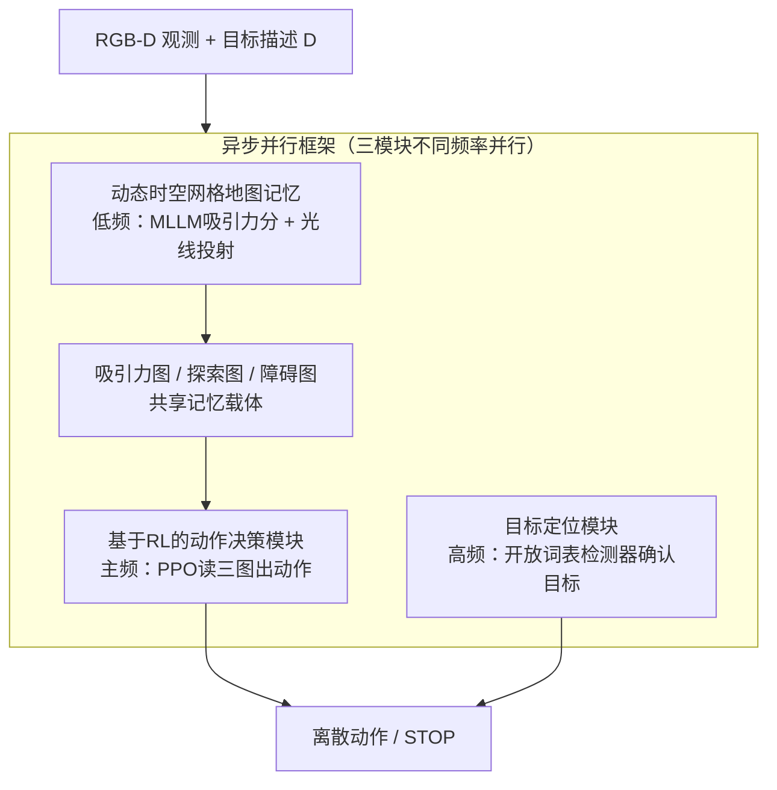

# APEX: A Decoupled Memory-based Explorer for Asynchronous Aerial Object Goal Navigation

**会议**: CVPR 2026  
**论文**: [CVF Open Access](https://openaccess.thecvf.com/content/CVPR2026/html/Zhang_APEX_A_Decoupled_Memory-based_Explorer_for_Asynchronous_Aerial_Object_Goal_CVPR_2026_paper.html)  
**代码**: 有（论文称源码已开源于 GitHub，未给出具体地址）  
**领域**: 空中具身导航 / 遥感无人机  
**关键词**: 空中目标导航, UAV, 3D时空语义地图, 强化学习, 异步并行框架

## 一句话总结
APEX 把"无人机找目标物"这个空中目标导航任务拆成三个解耦模块——用 MLLM 动态构建 3D 时空语义地图当记忆、用 PPO 强化学习把地图翻译成动作、用开放词表检测器做最后的目标确认——再用异步并行框架让三者以不同频率同时跑，从而绕开大模型推理延迟，在 UAV-ON benchmark 上比之前 SOTA 提升 +4.2% SR 和 +2.8% SPL。

## 研究背景与动机
**领域现状**：随着无人机（UAV）和视觉语言模型（VLM）的发展，视觉语言导航（VLN）正从室内地面场景扩展到空中（Aerial VLN, AVLN）。本文聚焦其中更实际的一类任务——空中目标导航（Aerial ObjectNav）：无人机只拿一句高层文本描述（如"一顶红色帐篷"）和机载视觉传感器，就要自主探索、推理空间关系、主动搜索并最终定位目标。

**现有痛点**：作者点出三个被以往工作忽视的硬伤。其一是**空间-时序信息整合无力**——从地面到空中，感知信息体量呈指数增长，长程任务需要可靠的长期记忆，但很多方法要么不整合历史观测导致重复犯错，要么用拓扑图这类抽象记忆，丢掉了精细推理与避障所需的几何/度量保真度。其二是**语义理解与可执行控制之间的鸿沟**——直接把 VLM 当端到端决策器（图像+语言→动作）既要海量高质量示范数据，得到的策略又不稳定、不可解释，对空中这种安全攸关场景尤其危险。其三是**计算延迟与实时约束**——跑大 VLM 很慢，多数框架默认"停下来想（stop-and-think）"的执行模型，这种延迟破坏了无人机连续平滑飞行所必需的实时性。

**核心矛盾**：要么用富表达的语义记忆和大模型推理换来高质量决策但拖慢实时性，要么为了速度牺牲记忆精度和决策可靠性——以往方法在"记忆保真 / 决策可靠 / 实时高效"三者间被迫取舍。

**本文目标**：同时解决记忆、决策、效率三个子问题，构建一个既可靠可解释、又实时高效的空中目标导航 agent。

**切入角度**：与其让一个 VLM 端到端包办一切，不如**解耦**——让慢但聪明的语义建图、快但可靠的动作决策、高频的目标确认各司其职，再用异步并行框架把"慢推理"从主控制回路里剥离出去。

**核心 idea**：把任务拆成"动态 3D 语义地图记忆 + RL 动作决策 + 目标定位"三个专用模块，用异步并行框架让它们以不同频率同时运行，用快速更新的障碍图保证安全、容忍语义图的轻微滞后，从而绕开 VLM 推理延迟、提升探索主动性。

## 方法详解

### 整体框架
APEX（Aerial Parallel Explorer）是一个分层 agent，核心是把空中目标导航解耦成三个专用模块，并用异步并行框架串起来。任务被建模为序列决策：每个时刻 $t$，agent 拿到视觉观测 $O_t$、自身状态 $S_t$ 和文本描述 $D$，输出离散动作 $A_t$。为支持长程探索，引入记忆模块按 $\text{MEM}_t = f_{\text{update}}(\text{MEM}_{t-1}, O_t, S_t)$ 累积时空语义信息，策略则在记忆上决策 $A_t = \pi(O_t, S_t, \text{MEM}_t, D)$。

三个模块分工是：**① 动态时空语义建图模块**用 MLLM 和分割模型把视觉/文本输入转成三张 3D 地图（吸引力图引导朝目标、障碍图保障安全、探索图鼓励主动探索），充当 agent 的可解释记忆；**② 基于 RL 的动作决策模块**把这三张图喂给一个 PPO 训练的策略网络，把高层空间理解翻译成低层动作；**③ 目标定位模块**用开放词表检测器解决"最后一公里"的目标确认。关键在于这三者被装进一个异步并行框架：建图模块跑得慢、放低频，动作决策跑主控制频率，目标检测跑高频，三者通过共享的吸引力图/探索图交换信息，从而绕开 VLM 推理瓶颈。

### 关键设计

**1. 动态时空网格地图记忆：用三张 3D 网格图替代抽象拓扑记忆，既保几何保真又带语义**

这针对"空间-时序信息整合无力"的痛点。APEX 用一个 3D 网格地图 $M$ 当持久记忆载体，每个时刻动态更新，核心是两步：3D 反投影 + 地图生成。**3D 反投影**（记作 $RP(\cdot)$）拿深度图、相机内参 $K$ 和 agent 状态 $S_t$，把 2D 像素栅格反投影成世界坐标系下的 3D 点云，再离散化到网格索引。在此之上生成三张语义/几何通道：

- **吸引力图 $M_{attr}$** 量化观测物体与目标的语义相关度。先用 MLLM 的视觉 grounding 与常识推理，对当前观测 $O_t$ 和目标 $D$ 输出 $N$ 个物体的文本描述和吸引力分数 $\{(c_i, s_i)\}_{i=1}^N = \text{CAP}(O_t, D)$（分数越高语义越接近目标）；再用开放词表分割模型得到每个 caption 的掩码 $\text{Mask}_i = \text{SEG}(O_t, c_i)$；最后投影进 3D 网格。每个体素 $v$ 的更新遵循两条规则——**多数归属**（体素归投影像素最多的物体 $i^*$）和**就近观测优先**（仅当新观测几何上更近才更新）：
$$\begin{cases} M_{attr}(v) \leftarrow s_{new} \\ M_{depth}(v) \leftarrow d_{new} \end{cases} \quad \text{if } d_{new} < M_{depth}(v).$$
- **探索图 $M_{expl}$** 量化每个区域的观测密度（"探索分"）。用光线投射：从相机位置 $t_t$ 朝每个深度点发射光线，用 3D 体素遍历算法找出可见体素集合 $V_{visible}=\bigcup_{r} V(r)$，对每个可见体素按距离指数衰减计算增益 $\Delta M_{expl}(v) = \exp(-\lambda \cdot \|p_v - t_t\|_2)$，再累加 $M_{expl,t}(v) \leftarrow M_{expl,t-1}(v) + \Delta M_{expl}(v)$。累积值越高代表看得越多，从而引导 agent 去观测少的区域。
- **障碍图 $M_{obst}$** 是占据空间的持久表示，直接由反投影填充：任何含反投影点的体素标记为 $M_{obst}(v) \leftarrow 1$。

相比拓扑图，这套度量级 3D 网格保留了精细几何，让避障和精细机动有据可依；相比无空间记忆的方法，它把历史观测稳健地整合进可解释的地图里。

**2. 基于 RL 的动作决策模块：用 PPO 把三张地图翻译成低层动作，避开端到端 VLM 的不可靠**

这针对"语义理解与可执行控制的鸿沟"。模块不让 VLM 直接出动作，而是把三张 3D 地图分别送进三个独立 CNN 特征提取器，拼接成统一表示，供 actor 和 critic 共享的策略网络，再用 PPO 训练映射到离散动作。基于地图（而非原始像素）的输入显著提升了策略的可靠性和可解释性。

训练靠一个复合奖励 $R_t = R_{attr} + \alpha R_{expl} + R_{spar}$。其中**稀疏奖励** $R_{spar}$ 只在 episode 结束给：到达目标阈值距离给大正奖 $R_{success}$，碰撞或飞出界给大负奖 $R_{penalty}$。**吸引力稠密奖励**鼓励利用语义引导，对距离阈值 $d_{thresh}$ 内的可见体素按吸引力分加权、线性距离衰减求和：
$$R_{attr} = \sum_{v \in V_{visible}} M_{attr}(v) \cdot \left(1 - \frac{\|p_v - t_t\|_2}{d_{thresh}}\right).$$
**探索稠密奖励**鼓励探索未知区，与当前探索分成反比（$\epsilon$ 是探索饱和点）：
$$R_{expl} = \sum_{v \in V_{visible}} (\epsilon - M_{expl}(v)) \cdot \left(1 - \frac{\|p_v - t_t\|_2}{d_{thresh}}\right).$$
$\alpha$ 平衡吸引力与探索的权重（消融显示 $\alpha=0.2$ 最优）。训练用**两阶段课程**：先只用 $R_{expl} + R_{penalty}$ 预训练一个目标无关的探索策略，建立安全导航与避障的底子；再引入 $R_{attr} + R_{success}$ 微调，让策略学会利用吸引力图做目标导向导航。这把"通用导航技能"和"任务相关行为"的学习解耦开来。

**3. 目标定位模块：开放词表检测器做"最后一公里"的确定性目标确认**

这针对吸引力图只能把 agent 带到目标"大致区域"、却无法保证"确实找到正确物体"的问题。模块与其他组件并行，持续在每帧 RGB 观测 $O_t$ 上跑开放词表检测器 $\{(\text{bbox}_j, \text{conf}_j)\}_{j=1}^K = GD(O_t, D)$ 寻找匹配目标描述的实例。一旦最高置信度超过预设阈值即判定 grounding 成功，再用反投影 $RP(\cdot)$ 算出目标精确 3D 世界坐标 $P_{target}$。消融表明，若把它替换成"直接朝吸引力图最高激活点走"的简单规则，性能大幅下滑——证明专用的精确定位机制不可或缺。

**4. 异步并行框架：让三模块按不同频率并跑，把慢 VLM 推理移出主控制回路**

这针对"计算延迟破坏实时性"的痛点。框架让吸引力图和探索图作为**共享数据结构**在模块间传递信息，三模块按频率从低到高运行：**动态建图模块**最慢（跑 VLM 推理算吸引力分、跑光线投射算探索增益），其更新异步写入共享的吸引力/探索图；**动作决策模块**跑主控制频率，每个动作步只用最新传感数据快速更新障碍图（不做耗时操作），再读取共享内存里最新版的吸引力图/探索图，三图合在一起决策——即使语义引导稍微"过时"，agent 也始终能凭最新障碍信息安全飞行；**目标定位模块**也跑高频，持续检测，最大化目标一出现就被发现的概率，不受慢语义周期约束。正是这种"障碍图永远新、语义图允许略滞后"的设计，绕开了 VLM 延迟瓶颈，让无人机能连续平滑探索。

## 实验关键数据

### 主实验
在 UAV-ON benchmark（14 个真实感大规模户外环境、共 10000 个导航 episode）上评测，指标为成功率 SR、导航误差 NE、Oracle 成功率 OSR、路径加权成功率 SPL。下表为 Overall 列对比（节选关键基线）：

| 方法 | SR↑ | NE↓ | OSR↑ | SPL↑ |
|------|-----|-----|------|------|
| FBE（前沿探索） | 5.00 | 65.38 | 11.67 | 3.50 |
| CLIP-H | 5.83 | 47.19 | 13.33 | 4.34 |
| TravelUAV | 7.48 | 55.75 | 14.17 | 5.54 |
| AOA-F（UAV-ON 基线） | 7.50 | 47.90 | 17.50 | 4.15 |
| L3MVN-Z（地面 ObjectNav） | 9.17 | 62.01 | 15.83 | 7.37 |
| **APEX** | **13.33** | 54.59 | **20.00** | **10.14** |

APEX 在 SR、OSR、SPL 上全面 SOTA：SR 比最强基线 L3MVN-Z 高 +4.16%，SPL 高 +2.77%。NE 偏高（54.59），作者解释为主动探索策略会让失败 episode 的最终落点离目标更远，是探索主动性的副作用而非缺陷。

效率与安全性对比（Tab. 2）进一步验证异步框架的价值：

| 方法 | 单步延迟 (s)↓ | 安全距离 (m)↑ |
|------|--------------|---------------|
| L3MVN-Z | 1.26 | 330.64 |
| TravelUAV | 1.71 | 223.17 |
| AOA-F | 5.29 | 212.36 |
| **APEX** | **0.97** | **345.51** |

APEX 单步延迟最低（0.97s，是 AOA-F 的不到 1/5），安全距离最高，说明异步并行框架确实提升了探索效率、RL 决策模块确实提升了无碰撞导航能力。

### 消融实验

核心模块消融（Tab. 4）：

| 配置 | SR↑ | NE↓ | OSR↑ | SPL↑ | 说明 |
|------|-----|-----|------|------|------|
| w/o 3D-Map | 1.67 | 45.62 | 4.17 | 0.73 | 去掉 3D 地图、直接喂 RGB-D，几乎无法收敛 |
| w/o RL-AD | 12.50 | 42.08 | 19.17 | 10.11 | RL 决策换成奖励预测启发式，易陷局部最优 |
| w/o TG | 5.00 | 48.33 | 9.17 | 4.17 | 目标定位换成"朝吸引力最高点走" |
| **APEX（完整）** | **13.33** | 54.59 | **20.00** | **10.14** | — |

吸引力-探索权衡参数 $\alpha$ 消融（Tab. 3）：

| $\alpha$ | SR↑ | OSR↑ | SPL↑ |
|----------|-----|------|------|
| 0.05 | 5.83 | 9.17 | 5.28 |
| 0.1 | 9.17 | 15.83 | 8.23 |
| **0.2** | **13.33** | **20.00** | 10.14 |
| 0.5 | 11.67 | 15.83 | 9.65 |
| 0.8 | 12.50 | 16.67 | **11.45** |
| 1.0 | 7.50 | 13.33 | 4.85 |

### 关键发现
- **3D 地图是命门**：去掉它 SR 从 13.33 暴跌到 1.67、SPL 跌到 0.73，模型几乎无法收敛——证明把记忆做成度量级 3D 网格而非原始像素是整个方法可行的前提。
- **目标定位模块贡献第二大**：去掉它 SR 减半（5.00），说明吸引力图只能引导到"大致方位"，最后的精确确认必须靠专用检测器。
- **RL 决策模块影响相对温和但仍正向**：换成启发式后 SR 仅小降到 12.50，但启发式易陷局部最优；有趣的是 w/o RL-AD 的 NE 反而更低（42.08），再次印证 NE 与探索主动性的耦合。
- **$\alpha$ 呈倒 U 形**：太小（0.05，几乎只探索/吸引失衡）或太大（1.0，探索奖励压过吸引）都差，0.2 在 SR/OSR 上最优；SPL 在 0.8 时略高但 SR 已下滑，整体取 0.2。

## 亮点与洞察
- **"障碍图永远新、语义图允许滞后"的异步解耦**很巧妙：它精准识别出"安全决策需要实时、语义引导可以容忍延迟"这一非对称性，从而把最慢的 VLM 推理移出主控制回路，单步延迟做到 0.97s 还顺带提升了探索主动性——这个思路可迁移到任何"快控制 + 慢感知"的具身系统。
- **三张语义/几何地图分工** 把"去哪找（吸引力）、去哪探（探索）、别撞哪（障碍）"显式拆开，每张图对应奖励的一个分量，让 RL 的奖励设计有了清晰的物理意义，也让决策可解释。
- **两阶段课程**（先目标无关探索打底、再引入吸引力奖励微调）把"会飞会避障"和"会找目标"解耦训练，是缓解稀疏奖励下 RL 难收敛的实用 trick。

## 局限性 / 可改进方向
- **绝对成功率仍偏低**：APEX 的 Overall SR 才 13.33%，说明空中目标导航整体还远未解决，benchmark 本身极具挑战，方法距离实用还有距离。
- **NE 偏高的代价**：主动探索带来更高导航误差，意味着失败时无人机可能离目标很远，在续航有限的真实任务中是隐患，论文未深入讨论这一 trade-off 的成本。
- **依赖多个现成大模型**（MLLM 出吸引力分、开放词表分割、开放词表检测器），整套系统的延迟与可靠性受这些黑盒组件制约；作者也把"为空中目标导航微调专用 VLM/MLLM"列为未来工作。
- **未在真机验证**：全部实验在仿真 UAV-ON 上，仿真到真实的 sim-to-real 差距（深度噪声、控制延迟）未评估。

## 相关工作与启发
- **vs AOA-F / UAV-ON 基线**：AOA-F 把目标描述、RGB、深度直接喂 LLM 出动作（端到端），APEX 改为解耦的"地图记忆 + RL 决策 + 检测确认"，SR 从 7.50 提到 13.33、单步延迟从 5.29s 降到 0.97s，证明解耦设计在可靠性与效率上都胜过端到端。
- **vs 拓扑图记忆方法（SkyVLN / NavAgent）**：它们用拓扑图做长程规划记忆，抽象但丢几何细节；APEX 用度量级 3D 网格保留精细几何，支撑避障与精细机动。
- **vs TravelUAV 等 AVLN 方法**：TravelUAV 面向细粒度逐步语言指令，APEX 面向只有高层目标描述的更开放场景，更贴近真实操作需求。
- **vs L3MVN（地面 ObjectNav）**：L3MVN 把语义与前沿地图融合、在地面 ObjectNav 上很强，但未针对 3D 空中环境优化；APEX 把这套思路扩展到 3D 空中并加上异步并行，反超 +4.16% SR。

## 评分
- 新颖性: ⭐⭐⭐⭐ 异步并行 + 三模块解耦 + 度量级 3D 语义地图的组合在空中目标导航上是新颖且自洽的系统设计，虽各组件多为已有技术的巧妙编排。
- 实验充分度: ⭐⭐⭐⭐ 在 UAV-ON 上对比 7 类基线、含效率/安全/模块/超参多维消融，但仅限单一 benchmark 与仿真，缺真机验证。
- 写作质量: ⭐⭐⭐⭐ 三大挑战→三模块的叙事清晰，公式与图示完整，框架与设计对得上。
- 价值: ⭐⭐⭐⭐ 把"慢感知/快控制"的异步思想落到空中导航并显著提效，对实时具身 agent 有借鉴意义；但绝对成功率低，离实用尚远。

<!-- RELATED:START -->

## 相关论文

- [\[CVPR 2026\] LookasideVLN: Direction-Aware Aerial Vision-and-Language Navigation](lookasidevln_direction-aware_aerial_vision-and-language_navigation.md)
- [\[CVPR 2026\] Beyond Matching to Tiles: Bridging Unaligned Aerial and Satellite Views for Vision-Only UAV Navigation](beyond_matching_to_tiles_bridging_unaligned_aerial_and_satellite_views_for_visio.md)
- [\[ICCV 2025\] CityNav: A Large-Scale Dataset for Real-World Aerial Navigation](../../ICCV2025/remote_sensing/citynav_a_large-scale_dataset_for_real-world_aerial_navigation.md)
- [\[CVPR 2026\] MOGeo: Beyond One-to-One Cross-View Object Geo-localization](mogeo_beyond_one-to-one_cross-view_object_geo-localization.md)
- [\[CVPR 2026\] Rotation Invariant and Symmetry Aware Pixel Difference Network for Remote Sensing Object Detection](rotation_invariant_and_symmetry_aware_pixel_difference_network_for_remote_sensin.md)

<!-- RELATED:END -->
