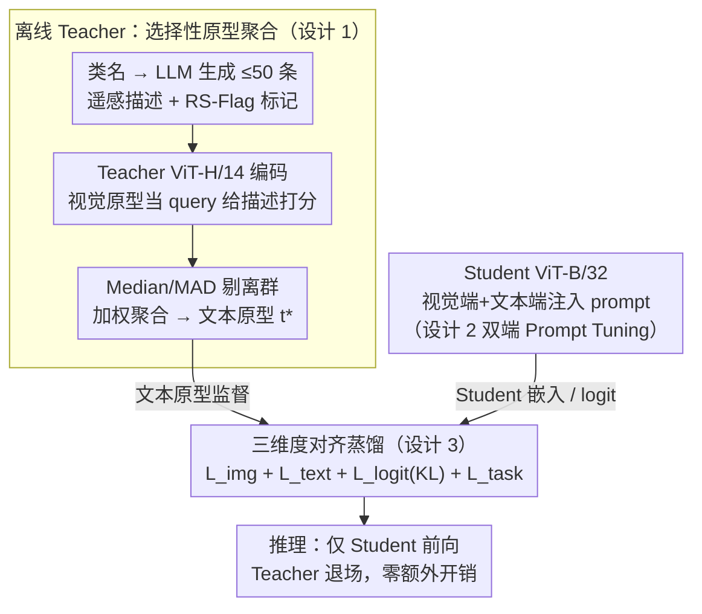

# AVION: Aerial Vision-Language Instruction from Offline Teacher to Prompt-Tuned Network

**会议**: CVPR 2026  
**arXiv**: [2603.12659](https://arxiv.org/abs/2603.12659)  
**代码**: [https://github.com/yuhu990424/AVION](https://github.com/yuhu990424/AVION)  
**领域**: 遥感 / 视觉语言模型  
**关键词**: Remote Sensing, 知识蒸馏, prompt tuning, 视觉语言模型, 跨模态检索

## 一句话总结

AVION 提出一种知识蒸馏框架，通过 LLM 生成语义丰富的遥感文本原型作为 Teacher 监督、同时在 Student 的视觉和文本编码器中注入可学习 prompt，实现三维度对齐蒸馏，在少样本分类和跨模态检索上显著优于现有 PEFT 方法。

## 研究背景与动机

**领域现状**：RemoteCLIP、GeoRSCLIP 等遥感专用 VLM 在下游任务上表现优异，但全量微调代价高昂。PEFT 方法（CoOp、MaPLe 等）通过学习少量参数适配新任务。

**现有痛点**：(1) **语义贫瘠**——遥感数据集通常只有类名标签（如"airport"），无法描述同一类的巨大视觉差异（不同区域、季节、传感器）；(2) **视觉刚性**——多数 PEFT 方法只更新文本端 prompt 而冻结视觉编码器，无法捕获遥感特有的俯视角、尺度变化等特征。

**核心矛盾**：简单类名与遥感图像丰富视觉模式之间的鸿沟，以及冻结视觉编码器无法适配遥感域的问题。

**本文目标** 同时解决语义贫瘠和视觉刚性，让 PEFT 方法在遥感场景下有效工作。

**切入角度**：利用 LLM 生成丰富的类描述作为文本监督，通过视觉-文本-logit 三维蒸馏约束实现稳健适配。

**核心 idea**：用 LLM 丰富文本原型解决语义贫瘠，用双端 prompt + 三维蒸馏解决视觉刚性，通过 Teacher-Student 框架在推理时无额外开销。

## 方法详解

### 整体框架

AVION 要解决的是「遥感数据只有类名标签、PEFT 又只敢动文本端」这对矛盾，办法是把一个大模型当离线 Teacher、把它的丰富知识蒸馏进一个小模型 Student。整个流程分三段：离线阶段，用 GeoRSCLIP ViT-H/14 这个大模型编码 LLM 为每类生成的语义描述，经过视觉原型验证后聚合成高质量的文本原型 $\mathbf{t}_k^{T*}$，这一步只跑一次、结果离线缓存；训练阶段，小模型 GeoRSCLIP ViT-B/32 在视觉和文本两个编码器里都注入可学习 prompt，由 Teacher 的文本原型和视觉嵌入在视觉、文本、logit 三个维度上同时监督对齐；推理阶段则只用 Student 前向，Teacher 完全退场，所以部署时没有任何额外开销。三段的数据流如下图，其中离线 Teacher（设计 1）产出的文本原型与 Student（设计 2）的嵌入汇入蒸馏对齐（设计 3）。

### 关键设计

**1. 选择性原型聚合（Selective Prototype Aggregation）：让 LLM 描述真正反映遥感视觉，而不是幻觉**

遥感数据集只有「airport」这种干巴巴的类名，撑不起同一类在不同区域、季节、传感器下的巨大视觉差异，所以第一步是用 Gemini 2.5 Flash 为每类生成至多 50 条遥感视角的描述，并给每条打一个 RS-Flag 标记它是否真和遥感相关。但 LLM 也会编出非视觉或跑题的句子，不能直接拿来用。AVION 的做法是让 Teacher 的视觉原型来当裁判：先在该类的图像上求出视觉原型 $\hat{\mathbf{v}}_k^T = \frac{1}{|\mathcal{B}_k|}\sum_i \mathbf{v}_{k,i}^T$，再算每条描述和它的相似度 $s_{k,j} = (\hat{\mathbf{v}}_k^T)^\top \mathbf{t}_{k,j}^T$，用 Median/MAD 的 z-score 把离群描述剔掉，剩下的按

$$w_{k,j} \propto \exp(\beta s_{k,j} + \gamma \cdot \text{RS-Flag}_{k,j})$$

加权聚合成最终文本原型。直观上这像一个无参数的 cross-attention——视觉原型做 query、文本描述做 key/value，越贴合该类真实视觉、越像遥感的描述权重越大。举个例子：「airport」生成的 50 条里，「a top-down satellite view of runways and terminals」会因为既贴视觉又被 RS-Flag 命中而拿到高权重，「a busy airport lounge with travelers」这种地面视角则被相似度压低甚至当离群点丢掉，最后留下的原型才真正描述俯视下的机场。

**2. 双端 Prompt Tuning：不只动嘴，也让眼睛能适配遥感**

多数 PEFT 方法只在文本端学 prompt、把视觉编码器冻死，根本没法捕获遥感特有的俯视角和尺度变化，这就是「视觉刚性」。AVION 在 Student 两端都注入 prompt：文本端沿用 CoOp 的思路学一组可训练的上下文 token，去吸收第一步聚合出的丰富语义；视觉端则像 VPT 那样在 ViT 每一层都插入 prompt token，让视觉编码器在 backbone 冻结的前提下仍有空间去适配遥感的倾斜视角和尺度。两端都只更新 prompt 参数、不碰 backbone，既保住了 PEFT 的低成本，又把「视觉端无法适配」这个口子补上了。

**3. 三维度对齐蒸馏（Tri-Aspect Alignment）：嵌入对齐之外，还要对齐类间关系**

有了好原型和双端 prompt，剩下的问题是 Student 该向 Teacher 学什么。AVION 同时在三个层面对齐：视觉嵌入用 $\mathcal{L}_{\text{img}} = 1 - (\mathbf{v}_i^S)^\top \mathbf{v}_i^T$ 拉近，文本原型用 $\mathcal{L}_{\text{text}} = 1 - (\mathbf{t}_k^S)^\top \mathbf{t}_k^{T*}$ 拉近，跨模态相似度分布则用 KL 蒸馏

$$\mathcal{L}_{\text{logit}} = \tau^2 \, \text{KL}\!\left(\sigma(\mathbf{s}^T/\tau) \,\|\, \sigma(\mathbf{s}^S/\tau)\right)$$

对齐（温度 $\tau=2$）。前两项只让 Student 学到单个类的好表征，关键是第三项：logit 蒸馏传递的是 Teacher 眼里「这张图像和各个类有多像」的整套相对关系，Student 因此学到的是类间结构而非孤立锚点，这正是它在 novel 类上不退化的原因。总损失把三者和任务分类交叉熵合在一起 $\mathcal{L} = \mathcal{L}_{\text{task}} + 0.5\mathcal{L}_{\text{img}} + 0.5\mathcal{L}_{\text{text}} + \mathcal{L}_{\text{logit}}$，其中 logit 项前 30% 训练步做线性 warmup，避免早期 Student 表征还没成形时被关系蒸馏带偏。

### 损失函数 / 训练策略

训练用 AdamW，学习率 5e-4；少样本设置跑 100 epochs，base-to-novel 设置跑 50 epochs。蒸馏温度固定 $\tau=2$，logit 对齐权重为 1 且带前 30% 的线性 warmup，视觉/文本对齐各 0.5，与任务交叉熵共同优化。

## 实验关键数据

### 主实验（6 数据集平均 Few-shot 分类精度）

| 方法 | 1-shot | 2-shot | 4-shot | 8-shot | 16-shot |
|------|--------|--------|--------|--------|---------|
| GeoRSCLIP (zero-shot) | 72.95 | — | — | — | — |
| CoOp | 69.98 | 78.95 | 84.52 | 87.57 | 90.24 |
| CoCoOp | 70.27 | 80.56 | 85.74 | 88.93 | 91.41 |
| MMRL | 70.57 | 79.47 | — | — | — |
| **AVION** | **73.12** | **82.34** | **87.21** | **90.48** | **92.85** |

### 消融实验（AID 数据集 16-shot）

| 配置 | Base Acc | Novel Acc | HM | 说明 |
|------|----------|-----------|------|------|
| AVION 完整 | 95.2 | 88.7 | 91.8 | 唯一在 base 和 novel 上都超过基线的方法 |
| w/o 文本对齐 | 94.1 | 85.3 | 89.5 | 文本原型监督对新类泛化关键 |
| w/o 视觉 prompt | 94.8 | 86.1 | 90.3 | 视觉端 prompt 提升域适配 |
| w/o logit 对齐 | 94.5 | 87.2 | 90.7 | logit 蒸馏提供类间关系 |
| w/o RS-Flag | 94.9 | 87.5 | 91.1 | RS 标记过滤改善原型质量 |

### 关键发现
- AVION 是唯一在 base-to-novel 设置中 base 和 novel 精度都超过 GeoRSCLIP 基线的方法，说明蒸馏不损害泛化
- 文本原型聚合中 RS-Flag 和视觉验证缺一不可，去掉导致 Novel Acc 下降
- 跨模态检索上 mR 也有提升，说明三维蒸馏改善了整体的模态对齐质量

## 亮点与洞察
- **语义贫瘠问题的诊断精准**：遥感数据集仅有类名标签是 PEFT 失效的根本原因，通过 LLM 生成丰富描述是优雅的解决方案
- **选择性原型聚合机制巧妙**：像一个无参数的 cross-attention，视觉原型做 query，文本描述做 key/value，自动过滤不良描述并平衡聚合权重
- **三维蒸馏保持泛化**：logit 对齐保留了类间关系结构，是 AVION 在 novel 类上不退化的关键

## 局限与展望
- 依赖 LLM 的描述质量，对非英语或非常规遥感类别可能产生低质量描述
- Teacher 模型固定为 GeoRSCLIP ViT-H/14，换用其他 backbone 需重新构建原型
- 未在检测/分割等更复杂的遥感下游任务上验证

## 相关工作与启发
- **vs CoOp/CoCoOp**: 这些方法只学文本 prompt 且缺乏丰富语义监督，在遥感上严重受限于"语义贫瘠"
- **vs PromptKD**: 也用蒸馏训练 prompt，但依赖无标签图像 logit，不解决文本端语义贫乏
- **vs MaPLe**: 双端 prompt 有类似，但 MaPLe 缺少 LLM 文本增强和选择性聚合

## 评分
- 新颖性: ⭐⭐⭐⭐ 问题诊断准确，解决方案系统且完整
- 实验充分度: ⭐⭐⭐⭐ 六个数据集 + 三种任务设置 + 充分消融
- 写作质量: ⭐⭐⭐⭐ 动机推导清晰，图表设计好
- 价值: ⭐⭐⭐⭐ 遥感 VLM 适配的实用方案

<!-- RELATED:START -->

## 相关论文

- [\[CVPR 2026\] LookasideVLN: Direction-Aware Aerial Vision-and-Language Navigation](lookasidevln_direction-aware_aerial_vision-and-language_navigation.md)
- [\[CVPR 2026\] VLM4RSDet: Collaborative Optimization with Vision-Language Model for Enhancing Remote Sensing Object Detection](vlm4rsdet_collaborative_optimization_with_vision-language_model_for_enhancing_re.md)
- [\[CVPR 2026\] CF-IPT: Cross-Modal Fusion Interactive Prompt Tuning of Vision-Language Pre-Trained Model for Multisource Remote Sensing Data Classification](cf-ipt_cross-modal_fusion_interactive_prompt_tuning_of_vision-language_pre-train.md)
- [\[CVPR 2026\] GeoDiT: A Diffusion-based Vision-Language Model for Geospatial Understanding](geodit_a_diffusion-based_vision-language_model_for_geospatial_understanding.md)
- [\[CVPR 2026\] ZoomEarth: Active Perception for Ultra-High-Resolution Geospatial Vision-Language Tasks](zoomearth_active_perception_for_ultra-high-resolution_geospatial_vision-language.md)

<!-- RELATED:END -->
