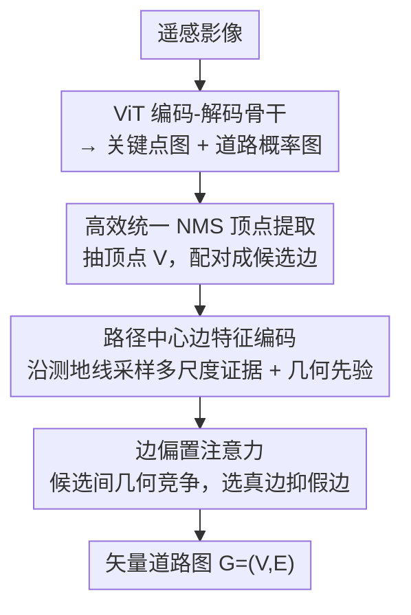

# Beyond Endpoints: Path-Centric Reasoning for Vectorized Off-Road Network Extraction

**会议**: CVPR 2026  
**论文**: [CVF Open Access](https://openaccess.thecvf.com/content/CVPR2026/html/Guan_Beyond_Endpoints_Path-Centric_Reasoning_for_Vectorized_Off-Road_Network_Extraction_CVPR_2026_paper.html)  
**代码**: 有（论文声明随数据集一起开源，仓库地址见论文）  
**领域**: 遥感 / 矢量道路网络提取  
**关键词**: 越野道路提取, 路径中心推理, 矢量化道路网络, 测地线特征, 遥感影像  

## 一句话总结
针对城市道路模型在荒野/越野场景里频繁断裂、连错的问题，本文提出"路径中心"（path-centric）的连通性推理：不再只看两个端点的局部特征，而是沿候选边的整条测地线采样多尺度道路证据来判断该不该连边，并配套发布了首个跨洲际的矢量越野道路数据集 WildRoad，在越野基准上达到 SOTA，同时泛化到城市数据集。

## 研究背景与动机
**领域现状**：矢量道路网络提取（从卫星/航拍影像直接输出节点+边的图结构，而非像素 mask）这几年被 SAM-Road、SAM-Road++ 这类单次预测（single-shot）方法推到很高水平，它们在 City-Scale、SpaceNet、Global-Scale 等**城市**基准上表现很强。

**现有痛点**：把城市训练的模型直接搬到越野/荒野场景会严重退化——产生碎片化的图、错误的路口拓扑、漏掉低对比度的窄小土路。原因有二：(1) 缺乏大规模**矢量化**越野数据集（DeepGlobe 这类只有二值 mask，没法做拓扑评估）；(2) 主流方法的结构性弱点。

**核心矛盾**：SAM-Road 系列采用 **node-centric（节点中心）** 范式——只在稀疏的端点处推理特征来判定两点是否相连。在越野场景里道路常被树荫遮挡、路口缺乏清晰几何结构，端点的局部特征往往**相似且模糊**：如论文 Fig.1(b) 所示，两对候选端点的端点特征可能几乎一样可信，但其中一条路实际并不存在，模型仅凭端点无法分辨真路和假连接。

**本文目标**：(1) 补上越野矢量数据集的空白；(2) 设计一个对遮挡、模糊路口鲁棒的连通性推理机制。

**切入角度**：判断一条边该不该连，证据其实分布在**整条路径上**而不只在两端——如果沿着候选边走一遍，真路上处处有道路证据，假连接中途会出现"断崖"。

**核心 idea**：把连通性推理从"只看端点"换成"沿整条测地线采样多尺度证据"（path-centric），用沿路统计量代替端点特征来做连边决策。

## 方法详解

### 整体框架
模型 MaGRoad（Mask-aware Geodesic Road network extractor）是一条单次预测的矢量道路提取管线：输入一张高分辨率遥感影像，输出道路图 $G=(V,E)$。流程是——ViT 编码-解码骨干（SAM 预训练 ViT-B）先预测**关键点概率图**和**道路概率图**；从两张 mask 经 NMS 抽出顶点 $V$，按邻近度配对成候选边 $E_{cand}$；核心模块 **MaGTopoNet** 对每条候选边打连通性分，融合几何特征与沿路径采样的路径特征，再经一个带几何竞争偏置的注意力分类器，输出被验证的边集 $E$，构成最终矢量图。另有一条**交互式提示分支**仅用于数据标注阶段（把用户点击编码成空间提示引导预测），不参与推理。

### 关键设计

**1. 路径中心的边特征编码：用沿路证据替代端点特征**

这是全文的核心，直接针对 node-centric 端点特征"模糊不可分"的痛点。对每条候选边 $(s,t)$，MaGTopoNet 从两路互补信号算连通性分：**测地线路径特征**和**几何先验**。

路径特征的做法是：从预测的道路 mask $M_{road}\in[0,1]^{H\times W}$ 出发，用核大小 $\{3,9,15\}$ 的平均池化生成 $L=3$ 个尺度（多尺度是为了对噪声和窄遮挡更鲁棒）；在连接端点 $s=(x_s,y_s)$、$t=(x_t,y_t)$ 的直线段上**均匀采样** $N_s=32$ 个点 $\{p_i\}$，双线性插值取每个尺度的概率值 $P_i^\ell$。然后在每个尺度上算三个互补统计量：

$$\mu_{st}^\ell=\frac{1}{N_s}\sum_{i=1}^{N_s}P_i^\ell,\quad \sigma_{st}^\ell=\sqrt{\frac{1}{N_s}\sum_{i=1}^{N_s}(P_i^\ell-\mu_{st}^\ell)^2},\quad \text{softmin}_{st}^\ell=-\frac{1}{\tau}\log\sum_{i=1}^{N_s}\exp\big(-\tau(1-P_i^\ell)\big)$$

其中 $\mu$ 衡量沿路的平均可通行度，$\sigma$ 衡量沿路一致性（值低说明整条路道路概率均匀），$\text{softmin}$（温度 $\tau=5.0$）专门**放大瓶颈点**——只要路径中途有一段低概率（如断裂处），它就会被显著惩罚。跨所有尺度拼接得到路径特征 $f_{path}^{st}\in\mathbb{R}^{3L}$。这正是 path-centric 的关键：真路 softmin 高、假连接因中途断崖 softmin 低，从而把端点处分不开的两对候选区分开。

几何特征则编码候选边的空间属性：归一化到 $[-1,1]$ 的偏移 $\Delta x,\Delta y$、欧氏距离 $d_{st}$、以及方位角 $\theta_{st}=\arctan2(\Delta y,\Delta x)$ 用 Fourier 特征 $\{\sin(m\theta),\cos(m\theta)\}_{m=1}^4$ 编码，得到 $f_{geo}^{st}\in\mathbb{R}^{11}$。两路特征拼接后送入分类器。

**2. 边偏置注意力：在候选集中引入几何竞争，逼出稀疏选边**

光有边特征还不够——从同一个源顶点出发往往有多条候选边，需要选出"对的连接"。本文用自注意力在**每个源顶点的候选集内部**做选择：把 $f_{geo}^{st}$ 与 $f_{path}^{st}$ 拼成边 token 投影到隐维 $D_h=256$，注意力里加一个加性偏置矩阵 $B$ 注入几何先验：

$$A=\text{softmax}\Big(\frac{QK^\top}{\sqrt{d}}+B\Big),\qquad B_{ij}=-\lambda_{comp}\,\mathbb{I}[i\neq j]$$

$B$ 对所有非对角元（即不同候选边对之间）施加统一的负偏置，相当于一个**竞争项**：惩罚多条候选边同时被激活，鼓励稀疏选边，从而在选出真连接的同时压制虚假配对。精炼后的 token 经 MLP 头映射成连通性 logits。消融显示这个注意力对编码几何兼容性、拿到高 F1 尤为关键。

**3. 高效统一 NMS 顶点提取：把三段抑制合成一遍，换来 2.5× 加速**

这是面向工程落地的优化，针对从 mask 抽顶点这一步的开销。以往（SAM-Road / SAM-Road++）对关键点 mask 和道路 mask **各做一次 NMS、再合并时又做一次**，共三段抑制。本文把两类候选拼在一起、给关键点候选加 $+0.9$ 的分数偏置以保证它们在抑制时优先，**统一成单次 NMS**。

此外重写了 NMS 内循环：标准实现每处理一个邻居就做批量数组操作（花式索引、临时数组分配、批量写回），开销很大；本文先按分数排序所有候选，再对每个点用**标量操作**直接抑制每个更低分的邻居，完全避免中间数组。两点合起来在 WildRoad 上拿到 2.5× 加速。代价是统一 NMS 更"宽松"、顶点集更密，提高了召回/F1 但带来轻微拓扑噪声、略降 APLS——这是一个吞吐/完整性 vs 拓扑精度的可选权衡（对应 MaGRoad-fast）。

**4. WildRoad 数据集与交互式标注流水线：补上越野矢量数据的空白**

数据侧是与模型并列的头条贡献（不在上面模型框架图里）。矢量越野标注成本极高，作者做了一套 web 端**交互式标注流水线**：标注者在路口/端点稀疏点击，交互提示分支把点击编码成空间提示，模型生成初始道路图草稿，标注者再增删/移动顶点和边来精修，大幅省时。再配合**自举（bootstrapping）**：先标小种子集训初始模型 → 模型给新区域出草稿 → 人工修正 → 加入训练集重训 → 迭代，越往后草稿越准、人工越省。最终得到 WildRoad：221 张 8K×4K（0.3 m/px）高分影像、覆盖六大洲 2,100 km²，含森林、农田、沙漠、山地等越野地形，是首个跨洲际矢量越野道路基准。

### 损失函数 / 训练策略
骨干用 SAM 预训练 ViT-B。分割分支用 Dice + 加权 BCE（正样本权重 10 缓解类别不均衡），拓扑头用标准 BCE。Adam 优化，随机初始化部分 lr=1e-3、预训练 ViT lr=1e-4，在 80% epoch 处衰减 0.1。超参按域定制：WildRoad 用候选搜索半径 r=200、池化核 {3,9,15}；城市场景 r=64、核 {1,5,9}。测地线采样 $N_s=32$。4×RTX 6000 训练。

## 实验关键数据

### 主实验（WildRoad 越野基准）
评测指标用图拓扑度量：APLS（比较采样点对间最优路径长度的相似度，1 为完美）与 TOPO（阈值内匹配顶点并算顶点/边的 precision、recall）。

| 方法 | P↑ | R↑ | F1↑ | APLS↑ | 推理(min)↓ |
|------|----|----|-----|-------|-----------|
| Sat2Graph | 83.92 | 57.50 | 68.11 | 48.73 | 133.1 |
| SAM-Road | 87.20 | 68.65 | 76.61 | 68.71 | 73.3 |
| SAM-Road++ | 87.52 | 68.69 | 76.74 | 69.72 | 76.1 |
| **MaGRoad** | **88.45** | 71.48 | 78.85 | **72.56** | 74.9 |
| MaGRoad-fast | 90.93 | 75.43 | **82.22** | 69.29 | **27.8** |

MaGRoad 在 F1 和 APLS 上都超过此前最好的 SAM-Road++（F1 78.85 vs 76.74，APLS 72.56 vs 69.72）；MaGRoad-fast 借高效顶点提取把 F1 推到 82.22 并 2.5× 加速（27.8 vs 74.9 min），但 APLS 略降到 69.29，体现"完整性优先"时的权衡。

城市泛化（Tab.3）：MaGRoad 在 SpaceNet 拿到最高 F1（84.23），并在三个城市数据集上一致地拿到最高召回——这正是 path-centric 倾向"更完整路网"的直接体现；precision 略低于 SAM-Road++ 这类精度导向模型。

### 消融实验（WildRoad，分析各特征贡献）
N=节点特征, P=路径特征, G=几何特征, E=边偏置注意力。

| Exp | 配置 | F1↑ | APLS↑ | 说明 |
|-----|------|-----|-------|------|
| 1 | 仅 N | 74.27 | 53.90 | 纯节点中心基线 |
| 4 | N+G | 71.24 | 63.07 | 去掉 P，APLS 暴跌近 10 点 |
| 5 | P+G | 75.36 | 68.10 | 去掉注意力 E，明显下滑 |
| 6 | **P+G+E（完整）** | **78.85** | **72.56** | 完整 path-centric 模型 |
| 7 | 节点中心强基线 | 77.53 | 69.51 | 仿 SAM-Road 的 node-centric |
| 8 | N+P+G+E | 77.23 | 69.07 | 加回节点特征反而变差 |

多尺度核配置（Tab.5）：核 {3,9,15} 最佳（APLS 72.56 / F1 78.85），优于 {1,7,13}、{1,5,9}，而单尺度 {9} 或两尺度 {3,9} 明显退化（APLS 仅 69.17 / 68.88）。

### 关键发现
- **路径特征贡献最大**：去掉 P（Exp 4）APLS 暴跌近 10 点，证明沿路聚合证据是越野拓扑推理的关键。
- **path-centric > node-centric**：完整模型（Exp 6）在 F1 和 APLS 上都超过节点中心强基线（Exp 7）。
- **加回节点特征反而有害**：Exp 8 把 N 也加进来不升反降，且继承了节点中心的失败模式——说明在视觉模糊场景里，显式的路径信号比端点的隐式信息更可靠，混进端点特征会污染决策。
- **多尺度不可省**：单/双尺度都明显掉点，{3,9,15} 在细节与上下文间最平衡，适配可变路宽与遮挡。

## 亮点与洞察
- **"沿路 softmin 抓瓶颈"很巧**：用 softmin 统计量专门放大路径中途的低概率断崖，正好把端点处看起来一样、实则中间断掉的假连接揪出来——这是 path-centric 能解决端点歧义的机制核心，而非泛泛的"多尺度更鲁棒"。
- **几何竞争偏置可迁移**：边偏置注意力里那个 $B_{ij}=-\lambda_{comp}\mathbb{I}[i\neq j]$ 的统一负偏置，是一种很轻量的"鼓励稀疏选择"先验，可迁移到任何"从候选集里选互斥子集"的任务（如目标关联、匹配）。
- **NMS 工程优化诚实给出 trade-off**：统一单次 NMS + 标量内循环换 2.5× 加速，但明说会降 APLS，没有粉饰成纯收益。
- **范式转换是真洞察**：把"判断边"从端点搬到整条路径，论证清晰（Fig.1(b) 的 Pair1-4 例子）、且消融（去 P 暴跌）支撑有力。

## 局限与展望
- **候选边沿"直线段"采样**：路径特征是沿 $s$ 到 $t$ 的**直线**采样，对弯曲道路或绕行连接，直线路径可能采不到真实道路像素，⚠️ 论文称"测地线（geodesic）"但实现上是直线插值，弯路场景的适配性存疑。
- **数据集规模仍小**：WildRoad 仅 221 张图（train 154），相比城市数据集量级偏小，越野子类型（沙漠/雪地/林区）的覆盖均衡性未充分分析。
- **依赖道路概率图质量**：path-centric 完全建立在分割分支输出的道路 mask 上，若分割本身在极弱纹理处全黑，沿路证据也会一起失效——属于"误差会从 mask 传到拓扑"的级联风险。
- **超参按域手调**：搜索半径、池化核在越野/城市间是人工切换的，缺乏自适应机制。

## 相关工作与启发
- **vs SAM-Road / SAM-Road++（node-centric）**：他们靠端点局部特征 + 几何关系判连通性（TopoNet 头），本文换成沿整条路径聚合多尺度证据（MaGTopoNet），区别在于证据来源从"两点"变成"整条路径"，本文在越野遮挡/模糊路口上明显更鲁棒（消融 Exp6 vs Exp7），代价是 precision 略低。
- **vs 迭代式方法（RoadTracer / VecRoad / RNGDet++）**：他们从种子点自回归地逐步扩展图，拓扑准但慢且会误差累积；本文是单次预测、并行打分所有候选边，更快且无累积误差。
- **vs 分割式方法（U-Net / D-LinkNet）**：他们出像素 mask 再靠细化等脆弱后处理转图，易引入伪影、破坏连通性；本文直接输出矢量图、用路径证据保证连通性。

## 评分
- 新颖性: ⭐⭐⭐⭐⭐ 把连通性推理从端点中心转到路径中心是清晰且有效的范式转换，配套首个跨洲际矢量越野数据集
- 实验充分度: ⭐⭐⭐⭐ 越野+三个城市基准 + 多组消融（特征/多尺度/NMS）较完整，但越野数据规模偏小、弯路场景未单独验证
- 写作质量: ⭐⭐⭐⭐ 动机用 Pair1-4 例子讲得很直观，方法与公式清楚
- 价值: ⭐⭐⭐⭐ 数据集 + 范式对越野/野外建图实用价值高，机制可迁移到其他"候选选边"任务

<!-- RELATED:START -->

## 相关论文

- [\[CVPR 2026\] RoadGIE: Towards A Global-Scale Aerial Benchmark for Generalizable Interactive Road Extraction](roadgie_towards_a_global-scale_aerial_benchmark_for_generalizable_interactive_ro.md)
- [\[CVPR 2026\] GeoCoT: Towards Reliable Remote Sensing Reasoning with Manifold Perspective](geocot_towards_reliable_remote_sensing_reasoning_with_manifold_perspective.md)
- [\[CVPR 2026\] MOGeo: Beyond One-to-One Cross-View Object Geo-localization](mogeo_beyond_one-to-one_cross-view_object_geo-localization.md)
- [\[ICML 2025\] Neural Augmented Kalman Filters for Road Network Assisted GNSS Positioning](../../ICML2025/remote_sensing/neural_augmented_kalman_filters_for_road_network_assisted_gnss_positioning.md)
- [\[CVPR 2026\] Beyond Tie Points: Satellite Image Block Adjustment based on Dense Feature Consistency](beyond_tie_points_satellite_image_block_adjustment_based_on_dense_feature_consis.md)

<!-- RELATED:END -->
