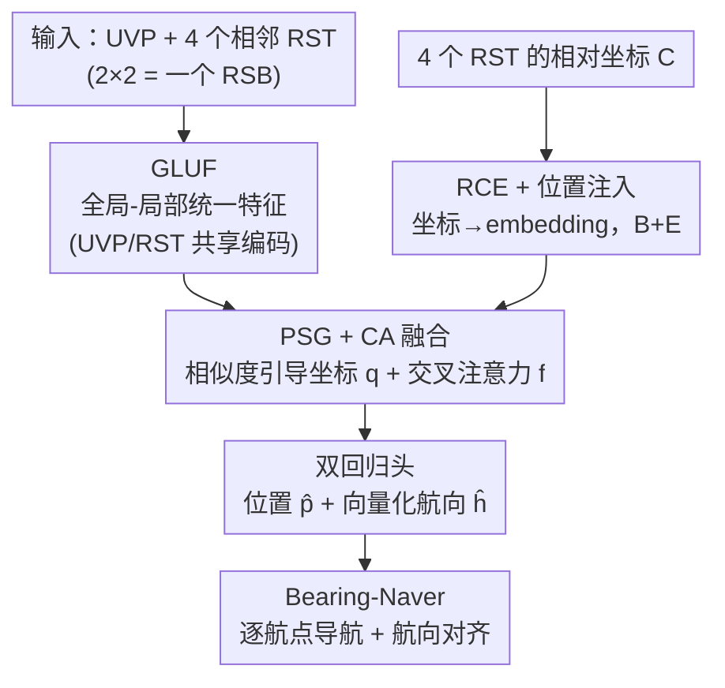

# Beyond Matching to Tiles: Bridging Unaligned Aerial and Satellite Views for Vision-Only UAV Navigation

**会议**: CVPR 2026  
**论文**: [CVF Open Access](https://openaccess.thecvf.com/content/CVPR2026/html/Liu_Beyond_Matching_to_Tiles_Bridging_Unaligned_Aerial_and_Satellite_Views_CVPR_2026_paper.html)  
**代码**: https://github.com/liukejia121/bearinguav  
**领域**: 遥感 / 跨视角地理定位  
**关键词**: 跨视角地理定位, UAV导航, 位置-航向联合回归, 交叉注意力, GNSS失效  

## 一句话总结
Bearing-UAV 抛弃"把无人机视图匹配到某个卫星瓦片"的范式，改用相邻 4 个卫星瓦片 + 1 个无人机视图直接**回归**无人机的绝对坐标与航向角，在 misalignment、特征稀疏、跨视角差异下都比检索/匹配类方法误差小一个量级（UAV 视角 MLE 从 ~30 m 降到 8.6 m），并把航向预测接进端到端导航。

## 研究背景与动机

**领域现状**：在 GNSS 失效环境下，跨视角地理定位（CVGL）是无人机纯视觉导航的主流路线——把机载相机拍到的低空斜视图，与带地理标注的卫星瓦片做匹配。现有方法走的是 matching-to-tile（M2T）范式，分两类：一类反复用深度模型编码机载卫星瓦片再做匹配，计算开销大、且携带完整卫星影像导致存储随面积平方增长；另一类把卫星瓦片预编码成轻量离散特征向量做相似度检索，省存储省算力，但定位精度被瓦片/网格密度死死卡住。

**现有痛点**：M2T 范式存在三个绕不开的问题。其一，**精度与存储/算力之间天然 trade-off**——想准就得密铺瓦片、就费存储；想省就得粗化网格、就不准。其二，导航不仅需要位置，还需要可靠的**航向（heading）**来抑制长航程中的水平旋转漂移，而几乎所有 CVGL 方法只管定位、不估航向；少数估航向的工作（如 AngleRobust）只适用于单条密采样走廊，或采用"先定位再定向"的两阶段做法，把定位误差传播给定向。其三，现有数据集大多忽略无人机视图与卫星瓦片之间**固有的视差、错位与可变重叠（IoU）**，训练出来的模型难以泛化到真实场景。

**核心矛盾**：把定位精度绑死在"匹配到哪个瓦片"上，本质是用离散的瓦片中心去近似连续的真实位置，misalignment 一大、IoU 一变就崩；而航向又被当成定位之后的附属步骤。

**本文目标**：(1) 让定位精度突破瓦片分辨率；(2) 同时、而非串行地给出航向；(3) 在错位、稀疏特征、天气变化、不同瓦片密度下都鲁棒，从而真正驱动端到端导航。

**核心 idea**：不要去匹配某一块瓦片，而是用**周围 4 个相邻瓦片的特征 + 相对坐标**作为参照系，直接回归一个有界、无量纲的相对位置和向量化航向——"超越瓦片，回归位置与航向"。

## 方法详解

### 整体框架

Bearing-UAV 把卫星地图切成 16×16 的遥感瓦片（RST），任意相邻 2×2 的瓦片组成一个遥感块（RSB，含 4 个 RST，相对坐标固定为四角 $\{(-1,1),(-1,-1),(1,1),(1,-1)\}$）。给定落在某个 RSB 内的一张无人机视图块（UVP）和这 4 个 RST，模型直接回归 UVP 在该 RSB 内的相对坐标 $\hat{\bm p}\in\mathbb{R}^2$ 与航向向量 $\hat{\bm h}=(\cos\hat\theta,\sin\hat\theta)$。因为 RSB 的索引已知、四角坐标已知，所以网络只需回归一个有界、无量纲的目标，再用 RSB 索引确定性地还原绝对经纬度——这一步把"直接回归高精度经纬度"的优化难题绕开了。

整条流水线分三段：**特征提取**（两个共享参数的 GLUF 子模块分别编码 UVP 与 4 个 RST，RCE 把每个 RST 的相对坐标编码成 embedding）→ **跨视角融合**（先把坐标 embedding 注入 RST 特征，再用 PSG 算相似度引导坐标、用 CA 做重叠感知交叉注意力）→ **双回归头**（同一融合特征经两个独立 MLP 分别输出位置与航向）。最后把 Bearing-UAV 嵌进 Bearing-Naver 导航方案，逐步沿航点飞行。

### 关键设计

**1. GLUF：全局-局部统一特征，扛住错位与特征稀疏**

痛点直接来自跨视角——无人机斜视图与卫星正射图在同一地点也可能只部分重叠，光靠全局描述子会被错位带偏，光靠局部点又在稀疏纹理区失效。GLUF 把两者拧成一股绳：先用骨干网络（默认 VGG-16）提特征图 $\bm F\in\mathbb{R}^{H\times W\times D}$，经一个 non-local block 得到捕获长程依赖的半全局特征图 $\bm X=\mathrm{NLConv}(\bm F)$；再仿照 SGMNet 的聚类方案，用 $K$ 个可学习聚类中心 $\{\bm a_k\}$ 把每个位置的局部描述子 $\bm x_p$ 软分配——分配权重 $\bm w_p=\mathrm{softmax}([\bm a_k^\top\bm x_p-\|\bm a_k\|_2]_k)$，相似度 $\rho_{k,p}=\mathrm{ReLU}(\bm a_k^\top\bm x_p)$，得到聚类特征 $\bm X^*_{k,p}=w_{k,p}\,\rho_{k,p}\,\bm x_p$。在空间 $\Omega$ 上聚合并归一化得到簇级描述子 $\tilde{\bm d}_k$，再把 $K$ 个簇拼接归一化成最终的 GLUF 向量：

$$\bm u := \mathrm{norm}\big([\tilde{\bm d}_1 : \cdots : \tilde{\bm d}_K]\big)\in\mathbb{R}^{KD}.$$

这样既保留了用于瓦片间匹配的全局相似性线索，又维持了有序、位置感知的局部特征段，供后续交叉注意力使用。作者强调这个聚类模块（SGMNet）可被其他合适的特征提取器替换，只带来轻微性能下降，说明 GLUF 的价值在"全局+局部统一编码"这个结构，而非某个具体实现。

**2. RCE + 位置注入：把"哪块瓦片在哪个方向"显式告诉网络**

回归位置的前提是网络知道 4 个 RST 各自的空间布局，否则它无从判断 UVP 偏向哪一块。RCE 是一个轻量 MLP（输入维度 $d_0=2$、输出 $d_L=KD$），把每个 RST 相对 RSB 中心的二维坐标 $\bm c_j$ 逐层映射 $\bm y_j^{(\ell)}=\sigma(\bm W_\ell^{RCE}\bm y_j^{(\ell-1)}+\bm b_\ell^{RCE})$，末层输出坐标 embedding $\bm e_j$。由于 GLUF 向量已归一化，作者用最简单的加法做位置注入：把 4 个 RST 的 GLUF 张量 $\bm B$ 与坐标 embedding 张量 $\bm E$ 相加，$\tilde{\bm B}:=\bm B+\bm E$，让融合阶段能直接看到相对布局，从而在监督下学到"位置—角度"关系。这种"坐标当作位置编码加进去"的做法，相当于给纯视觉特征补上了几何参照系，是回归范式能 work 的隐性前提。

**3. PSG + CA：相似度引导坐标 + 重叠感知交叉注意力，两条线索给位置兜底**

UVP 通常和 4 个 RST 重叠程度各不相同，单靠注意力容易在稀疏区飘，所以作者用两条互补线索做融合。**PSG（Patch Similarity-Guided）**给出一个强先验：计算 UVP 的 GLUF 向量 $\bm u$ 与各 RST（位置注入后的 $\tilde{\bm b}_j$）的余弦相似度并 softmax 成权重 $\bm\alpha=\mathrm{softmax}([\cos(\bm u,\tilde{\bm b}_j)]_{j=1}^4)$，再对 4 个相对坐标加权求和得到相似度引导坐标 $\bm q:=\sum_j\alpha_j\bm c_j$——直观上就是"UVP 更像哪块瓦片，预测位置就更靠哪块"。**CA（Cross-Attention）**则用轻量交叉注意力捕捉重叠感知的细粒度对应：以 UVP 为 query、4 个 RST 为 key/value，$\bm f:=\mathrm{softmax}(\bm Q\bm K^\top/\sqrt d)\bm V$，让模型在错位与稀疏条件下聚焦真正重叠的区域。最后把三者拼成融合特征 $\bm\phi:=\mathrm{concat}(\bm u,\bm f,\bm q)\in\mathbb{R}^{KD+KD+2}$：UVP 自身描述子 + 跨视角对应 + 相似度引导坐标。PSG 给的是粗粒度位置锚（强先验），CA 给的是细粒度对应（修正），两者一软一硬正好兜住 misalignment。

**4. 双回归头 + 向量化航向 + Bearing-Naver：位置与航向并行，直接驱动导航**

同一融合特征 $\bm\phi$ 喂给两个**独立但并行**的 $M$ 层 MLP 头，分别回归位置 $\hat{\bm p}\in\mathbb{R}^2$ 和航向 $\hat{\bm h}\in\mathbb{R}^2$。关键巧思在于航向**不回归原始角度 $\hat\theta$，而是回归方向向量 $(\cos\hat\theta,\sin\hat\theta)$**——这样回避了角度的周期性歧义（0° 与 360° 不连续），给回归一个连续、良态的目标。并行双头让定位与定向同步产生，避免了两阶段范式把定位误差传播给定向的老问题。Bearing-Naver 在此之上构建逐航点导航：每步用当前真实位置取 UVP、按"名义位置"索引取出 4 个 RST 机载特征（可预先把 RST 编码成紧凑特征表，实现轻量查表式飞行），用 Bearing-UAV 回归位置与航向 $(\hat{\bm p}_i,\hat{\bm h}_i)=\mathcal{F}(\bm I_i^U,\bm B_i,\bm{\mathcal C})$，再算出当前位置到下一航点的方位角并把航向对齐过去，更新状态进入下一步。航向对齐是纯视觉长航程导航的命门——没有它，旋转漂移会让无人机偏离参考方位角。

### 损失函数 / 训练策略
数据集按 7:2:1 划分。用 Adam（lr=5×10⁻⁵、batch size 16）训练 100 epoch，损失为 Smooth L1 的加权和 $L_{sum}=0.8L_p+0.2L_h$（位置权重远大于航向），不加 weight decay；ReduceLROnPlateau 在验证 plateau 时学习率减半，按验证 loss 选最优模型。GLUF 取 $K=4$ 簇、基础维度 $D=256$；RCE 层配置 $[2,64,256,KD]$；双回归头 MLP 维度 $[2050,1024,256,64,2]$。训练在 H100 上，Bearing-Naver 部署在带 RTX 4000 的笔记本上。

## 实验关键数据

数据集 **Bearing-UAV-90K**：从 Google Earth 4 个城市采集，2D 模式下载连续卫星影像（4096×4096、0.25 m/px）切成 16×16 RST，任意 2×2 组成 RSB（共 15×15 个）；3D 模式漫游采样，每个 RSB 采 100 个随机相机位姿+偏航角，得到 90k UVP，并附带细粒度地理标注与**航向标注**（这是它区别于 University-1652 / SUES-200 / DenseUAV / GTA-UAV 的关键：首个同时支持连续瓦片、非对齐、航向的多城市 U-S 数据集）。

### 主实验（U-S 跨视角定位与导航，节选 Tab. 2）

| 方法 | Recall@1↑ (UAV) | LSR@15↑ (UAV) | MLE↓ (UAV) | MHE↓ (UAV) | SR@20↑ (UAV) | NE↓ (UAV) |
|------|------|------|------|------|------|------|
| University-1652 | 60.20 | 15.11 | 33.15 | – | 0.00 | 602.96 |
| SUES-200 | 66.60 | 15.76 | 30.83 | – | 0.00 | 618.85 |
| DenseUAV | 73.43 | 16.54 | 28.79 | – | 0.00 | 651.93 |
| GTA-UAV | 70.71 | 27.96 | 28.43 | – | 0.00 | 661.91 |
| **Ours (VGG-16)** | **83.17** | **89.36** | **8.61** | 12.90 | **50.00** | 275.61 |
| Ours (VGG-16 + 天气增强) | 86.52 | 92.88 | 7.48 | **9.63** | 25.00 | 248.77 |

四个匹配/检索基线的定位误差都在 ~30 m，因为它们把检索/匹配到的瓦片中心当作最终位置，在跨视角错位与可变 IoU 下根本撑不住；而 Bearing-UAV 的回归误差只有 8.6 m（约小一个量级），LSR@15 提升约 60%、Recall@1 提升约 10%。更关键的是，**所有基线都无航向能力、SR@20 全为 0、无法完成端到端导航**，而本文凭航向分支把导航成功率拉到 50%（UAV 视角）。

### 数据规模 / 多城市泛化 / 天气消融

| 实验 | 配置 | 关键发现 |
|------|------|----------|
| 数据规模 (Fig. 5) | 10%→100% | 性能随数据量单调提升，超过 60%（54k）后开始饱和：UAV 视角 MLE<10 m、MHE<17°；卫星视角 MLE<7 m、MHE<7° |
| 多城市 (Tab. 3) | 1/2/3/4 城组合 | 城市数从 1 增到 4，性能不退反略升（ABCD: MLE 8.61, MHE 12.90），说明模型受益于地理多样性；单城里 City C（高楼+河流、纹理少）误差最大，City B（建筑纹理丰富）最好 |
| 天气增强 (Tab. 4) | Rain/Snow/Fog/Bright/Mixed/Normal | 天气增强模型在六种天气下普遍优于无增强基线（UAV MHE 从 12.90° 降到 9.63°）；**光照增强增益最大**，因为它有效缩小了无人机视图与卫星视图之间的亮度差 |

### 关键发现
- **回归范式 vs 匹配范式**：误差从 ~30 m 降到 8.6 m 的核心，不是更强的骨干，而是"用 4 个相邻瓦片做参照系直接回归有界相对坐标"这个范式切换——它把精度从瓦片密度里解放出来。
- **航向是导航的命门**：基线 SR 全为 0、NE 高达 600+ m，本文有了向量化航向后 SR 到 50%、NE 降到 ~250 m。Fig. 6 中 City D 一条 720 m、13 航点的崎岖路线，只有本文能在 45 步内到达终点航点。
- **效率反而最好**（Tab. 5）：模型仅 66 MB、推理 133.5 ms、10.5 GFLOPs，是所有对比方法里最轻量的，配合可预编码的 RST 特征表，适合机载部署。
- **天气增强的副作用**：天气增强虽降低了定位/航向误差，但导航 SR/SPL 反而略降，作者归因于少数高度偏离的轨迹；不过 NE 从 275 m 降到 248 m，说明整体上更接近目标。

## 亮点与洞察
- **范式级创新**：把跨视角定位从"分类/检索哪块瓦片"重构成"在 4 瓦片参照系内回归连续坐标"，一举打破精度-存储 trade-off。这个"用周围而非单点"的思路可迁移到任何受离散网格分辨率限制的定位/配准任务。
- **有界无量纲回归目标**：固定四角相对坐标 + RSB 索引确定性还原绝对经纬度，避开直接回归高精度经纬度的优化困难——这是个朴素但极实用的参数化技巧。
- **航向向量化**：用 $(\cos\theta,\sin\theta)$ 而非角度回归，解决周期性歧义，是角度回归任务可直接复用的 trick。
- **PSG 与 CA 互补**：相似度加权坐标给强位置先验、交叉注意力给细粒度重叠对应，一软一硬兜住 misalignment，这种"先验锚 + 注意力修正"的双线索融合值得借鉴。

## 局限与展望
- 数据全部来自 **Google Earth**（2D 卫星 + 3D 漫游合成无人机视图），与真实无人机相机的成像、运动模糊、时相差异仍有 gap，真机泛化未验证（⚠️ 作者未给真机实验）。
- 依赖**已知起始位置**与机载预存 RST 特征表，初始定位失败或地图缺失时方案不成立；属于"地图已知 + 已初始化"的设定。
- 多城市仅 4 城、天气仅合成增强，对全球尺度地形/季节/传感器差异的鲁棒性是开放问题。
- 天气增强在降低误差的同时导航成功率反降，说明定位指标与导航指标并非完全一致，端到端目标与中间监督之间存在错配，值得进一步对齐。

## 相关工作与启发
- **vs M2T 匹配类（University-1652 / DenseUAV）**：他们把 UVP 匹配/检索到单个卫星瓦片、以瓦片中心为位置，精度被网格密度锁死且无航向；本文用 4 瓦片回归连续坐标 + 并行航向，误差小一个量级、还能导航。
- **vs GTA-UAV**：同样关注非对齐与连续瓦片，但仍是匹配范式且用合成地理标注、无航向；本文是回归范式 + 真实细粒度标注 + 航向。
- **vs AngleRobust（航向估计）**：它从无人机视图序列直接预测方位角，但只适用于单条密采样走廊；本文从相邻 4 瓦片单步联合估位置与航向，适用范围更广。
- **vs 两阶段"先定位再定向"方法**：它们把定位结果当全局位姿锚，会把定位误差传播给定向；本文双头并行从根上避免误差传播。

## 评分
- 新颖性: ⭐⭐⭐⭐⭐ 把跨视角定位从匹配/检索重构为"多瓦片参照系回归"，并首次把航向并入端到端导航，是范式级贡献
- 实验充分度: ⭐⭐⭐⭐ 数据规模/多城市/天气/导航多维消融充分，但缺真机验证、城市数偏少
- 写作质量: ⭐⭐⭐⭐ 模块命名清晰、公式完整，框架图与符号一致；部分细节散落附录
- 价值: ⭐⭐⭐⭐⭐ 轻量高精度 + 可导航，对 GNSS 失效下的无人机自主飞行有直接落地意义

<!-- RELATED:START -->

## 相关论文

- [\[CVPR 2026\] LookasideVLN: Direction-Aware Aerial Vision-and-Language Navigation](lookasidevln_direction-aware_aerial_vision-and-language_navigation.md)
- [\[CVPR 2026\] APEX: A Decoupled Memory-based Explorer for Asynchronous Aerial Object Goal Navigation](apex_a_decoupled_memory-based_explorer_for_asynchronous_aerial_object_goal_navig.md)
- [\[CVPR 2026\] Beyond Tie Points: Satellite Image Block Adjustment based on Dense Feature Consistency](beyond_tie_points_satellite_image_block_adjustment_based_on_dense_feature_consis.md)
- [\[CVPR 2026\] AVION: Aerial Vision-Language Instruction from Offline Teacher to Prompt-Tuned Network](avion_aerial_visionlanguage_instruction_from_offli.md)
- [\[CVPR 2026\] GeoBridge: A Semantic-Anchored Multi-View Foundation Model Bridging Images and Text for Geo-Localization](geobridge_a_semantic-anchored_multi-view_foundation_model_bridging_images_and_te.md)

<!-- RELATED:END -->
