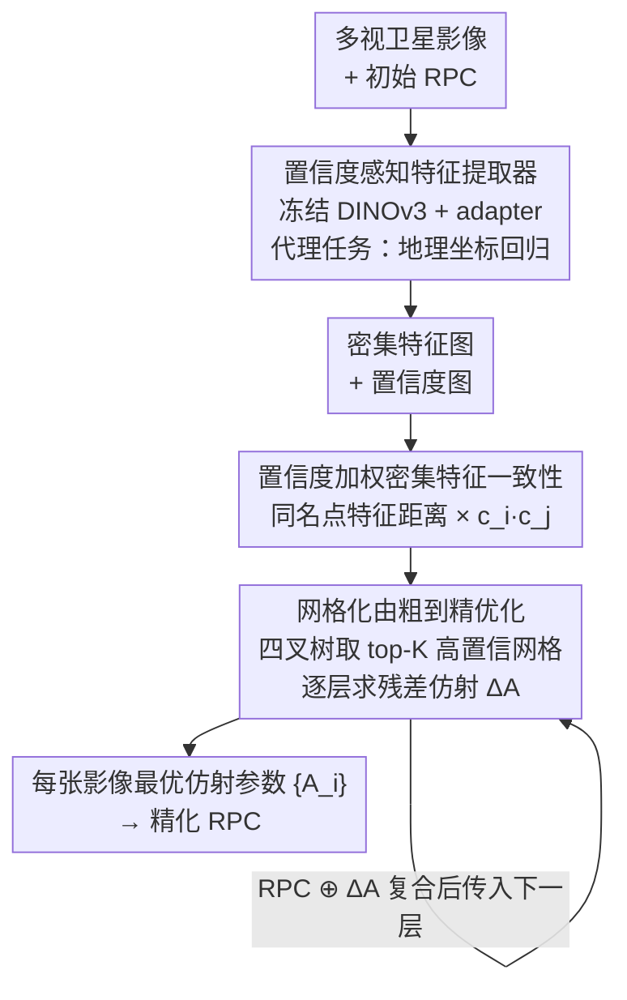

# Beyond Tie Points: Satellite Image Block Adjustment based on Dense Feature Consistency

**会议**: CVPR 2026  
**论文**: [CVF Open Access](https://openaccess.thecvf.com/content/CVPR2026/html/Liu_Beyond_Tie_Points_Satellite_Image_Block_Adjustment_based_on_Dense_CVPR_2026_paper.html)  
**代码**: https://github.com/YiLiu-AndyLau/BeyondTiePoints  
**领域**: 遥感 / 卫星影像区域网平差  
**关键词**: 平面区域网平差, 密集特征一致性, 置信度加权, RPC模型, DINOv3

## 一句话总结
针对卫星影像区域网平差（PBA）长期依赖稀疏连接点、在高楼等高视差区域误差累积的痛点，本文提出"Beyond Tie Points"范式：用预训练特征提取器抽取密集特征与置信度图，把平差直接重构成"最小化同名物方点的密集特征距离"的自监督优化问题，再配合网格化由粗到精求解，在北京/广州/圣何塞三地数据上把平均误差最多降低 75.43%。

## 研究背景与动机
**领域现状**：高分辨率卫星影像因立体几何弱（基高比小），主流不做完整三维平差，而采用平面区域网平差（Planar Block Adjustment, PBA）——把高程当作已知约束，只优化平面方向的几何改正。几十年来 PBA 的实现都被"连接点（tie points）"主导：无论用 SIFT 这种手工特征，还是 SuperGlue / LoFTR 这种深度匹配器，流程都是"先匹配、后平差"（match-then-adjust）的级联范式：先在影像间检测离散同名点对，再把这些点对当几何约束去优化平差参数。

**现有痛点**：作者认为这套连接点范式有三个固有缺陷。其一，高程不准的区域（如高楼附近）匹配到的点对会有很大视差，反投影误差大，严重拉低平差精度。其二，靠 RANSAC + 经验阈值做"硬剔除"外点，既可能误纳外点、也可能误删有效内点。其三，它是单向误差传播链——前端（特征提取、匹配、外点剔除）的误差会不可逆地累积并传到后端，整个系统对初始噪声和误匹配极度敏感。更先进的匹配器只是优化了级联里的某一步，并没有改变这套范式本身的脆弱性。

**核心矛盾**：稀疏连接点既是约束的来源，又是误差的来源——它把平差精度押在了少数离散点的匹配质量上，而这些点恰恰最容易在高视差/弱纹理处失效。

**本文目标**：不再把 PBA 看成依赖稀疏连接点的多阶段流程，而是把它重构成一个一体化、自监督的优化问题，直接估计所有影像的平差参数。

**切入角度**：作者借鉴了 SLAM/SfM 里的"直接法"思路（DTAM、DSO 用稠密/半稠密光度一致性对齐，Lindenberger 等用 featuremetric 目标直接对齐深度特征）。但卫星影像有复杂相机模型、各向异性、极端视差、超大幅面，直接最小化原始光度误差或统计量并不可靠。

**核心 idea**：用"同名物方点在密集深度特征空间里的特征距离"代替"稀疏连接点的反投影误差"作为优化目标，并用一张可学习的置信度图把高楼/云/水体这类几何不稳定区域"软抑制"掉，从而把整个区域网平差变成一个全局特征一致性的优化问题。

## 方法详解

### 整体框架
方法分两个阶段。第一阶段离线训练一个**场景无关**的鲁棒特征提取器：以冻结的 DINOv3 ViT-L 为骨干，接一个轻量 adapter，用"地理坐标回归"代理任务训练，让它对每张影像输出密集特征图 + 像素级置信度图。第二阶段在线求解：把平差写成一个大规模非线性最小二乘——对所有有重叠的影像对，用各自当前的几何模型（原始 RPC ⊕ 当前平差参数）把物方点投到两张图上，取对应位置的特征，最小化它们的置信度加权特征距离；用网格化由粗到精策略迭代更新每张影像的仿射平差参数。

平差的待解量定义得很干净：现代高分卫星影像用 RPC（有理多项式系数）模型描述物方坐标 $(\phi,\lambda,h)$ 到像素 $(l,s)$ 的映射，$l=P_1/P_2,\ s=P_3/P_4$（$P_i$ 是含 20 个系数的三次多项式）。RPC 的主要误差是系统性几何畸变，可在像方用一个仿射变换补偿：

$$\begin{bmatrix} l'_i \\ s'_i \end{bmatrix} = \begin{bmatrix} a_0 & a_1 & a_2 \\ b_0 & b_1 & b_2 \end{bmatrix}\begin{bmatrix} l_i \\ s_i \\ 1 \end{bmatrix}$$

于是整个任务被精确定义为：为区域内每张影像 $I_i$ 求一组最优仿射参数 $A_i=\{a_0,a_1,a_2,b_0,b_1,b_2\}_i$，使全局几何一致。

### 关键设计

**1. "Beyond Tie Points" 范式：把平差从离散点对约束改写成密集特征一致性优化**

这一条直接针对"稀疏连接点既是约束又是误差源、且单向传播不可逆"的根本痛点。作者把优化目标从"最小化稀疏连接点的反投影误差"换成"最小化同一物方点在不同视角下密集特征表示之间的距离"。形式上，整个区域网平差被写成一个非线性最小二乘：

$$A^* = \arg\min_A \sum_{(i,j)\in \text{Pairs}} \sum_{p\in O_{ij}} w(p_i,p_j)\cdot \big\| f_i(\text{proj}(P,A_i)) - f_j(\text{proj}(P,A_j)) \big\|_2^2$$

其中 $O_{ij}$ 是影像对 $(I_i,I_j)$ 重叠区内所有同名像素对，$\text{proj}(P,A_k)$ 是物方点 $P$ 在影像 $k$ 上的投影（用原始 RPC 复合当前仿射参数），$w(p_i,p_j)$ 是置信度加权（见设计 2）。初始时所有仿射参数设为单位变换。和"match-then-adjust"级联范式相比，这里没有显式匹配、没有 RANSAC 硬剔除，所有有重叠的像素都参与一致性约束，误差不再沿"前端→后端"单向累积，而是被放进一个统一的全局优化里同时求解，因此对初始误匹配天然更鲁棒。

**2. 置信度感知特征提取器 + 地理坐标回归代理任务：用软抑制替代硬剔除**

要让"特征距离"能驱动平差，特征必须同时具备三种能力：高地理空间判别性（不同地物可区分）、同名点的高不变性（跨视角/分辨率/色彩仍相似）、以及对地物视差/稳定性的评估能力。作者用冻结的 DINOv3 ViT-L/16（在 SAT-493M 上预训练）当骨干，全程不动其参数，只在后面加一个轻量可训练 adapter：特征融合模块把骨干的浅层与深层特征拼接融合，再分别送进一个 self-attention 层和一个置信度预测头，输出密集特征图和置信度图。

为什么不端到端训练？因为求解阶段是迭代优化器（设计 3），反传穿过成百上千次迭代会产生混乱不稳的梯度；而且全局优化的计算图覆盖所有影像，整图反传在算力和显存上都不可行。于是作者设计代理任务：让 adapter 学到一个与影像位置信息内在对齐的几何一致特征空间——具体就是**回归每个特征对应的地理坐标（如 UTM 坐标）**。训练用了 200 多组多卫星、多地物（城市/森林/水体/农田）的高分多视影像，每组配有真值三维坐标图和置信度图；每次迭代随机抽一组、选两张图，各自随机裁带重叠的窗口（位置/尺寸/角度都随机），过提取器得到特征图和置信度图，再用轻量 decoder 把特征映射回三维地理坐标。总损失是四项加权和 $L=\lambda_{reg}L_{reg}+\lambda_{cons}L_{cons}+\lambda_{feat}L_{feat}+\lambda_{conf}L_{conf}$：

- **坐标回归损失** $L_{reg}=\frac1N\sum_p\|\hat G(f(p))-G(p)\|_2^2$，建立特征空间与地理空间的内在映射；
- **坐标一致损失** $L_{cons}=\frac1M\sum_{(p_i,p_j)}\|\hat G(f_i(p_i))-\hat G(f_j(p_j))\|_2^2$，要求同名像素预测出的地理坐标一致；
- **特征一致损失**用 triplet loss：$L_{feat}=\max(0,\,\text{Sim}(f_a,f_n)-\text{Sim}(f_a,f_p)+\alpha)$，直接拉近同名点特征、推远非同名点（$\text{Sim}$ 为平方余弦相似度，margin $\alpha=0.5$）；
- **置信度损失**用 BCE 监督，真值置信度图 $C_{gt}$ 由预先计算的密集视差图生成。

超参取 $\lambda_{reg}=\lambda_{cons}=1$、$\lambda_{feat}=\lambda_{conf}=1000$。最终置信度图量化了几何不稳定区域（高楼、云、水体）的不可靠程度，在优化时自适应压低它们的权重——这就是从传统 PBA 的"被动硬剔除"转向"主动软抑制"。

**3. 网格化由粗到精优化：让密集全局优化在算力可行且抗大初始误差**

在整幅区域、全分辨率上直接做密集优化既算不动、又因高分辨率特征对大初始误差很难收敛。作者用四叉树做层次化求解：先把重叠区切成初始网格，选平均置信度最高的 top-K 个格子；对每个选中格子，裁出对应影像并重采样到固定 $1024\times1024$，提特征和置信度、算所有重叠影像对的一致性损失，把各格损失汇总后用梯度下降更新每张影像的平差参数。然后用四叉树递归细分网格，从粗到细逐层推进：粗层先校正主要的低频几何误差，细层只需估计幅度更小、频率更高的残差仿射改正 $\Delta A_{i,k}$。每一层求出的参数都与当前 RPC **复合**成精度更高的基准模型再传给下一层，于是后续层只面对更小的残差。这种分层把一个本来难解的全局优化变成了稳健高效的逐级求解：实现上小误差数据用 1 km 初始网格 + 2 层细化，大误差数据用 2 km 初始网格 + 3 层，每层最多 1000 次迭代、100 次不降则早停，仿射参数用 Adam 优化（非平移项学习率乘 $10^{-4}$，每细化一层最大学习率乘 0.1，配 OneCycle 调度）。

## 实验关键数据

### 数据与协议
在北京、广州、圣何塞三地多视卫星影像上评测，覆盖从平原到山地、超高层、密集水网、平坦谷地等不同地貌与城市形态，卫星源含 SuperView-2 与 WorldView-2。每地标注人工检查点（MCP）评精度，指标为同名 MCP 投到物方后的两两距离的均值/中位数（米），以及 @1m/@3m/@5m（距离小于 N 米的点对占比）。为测鲁棒性，对每地模拟两档初始误差：小（≈5 m，后缀 -a）和大（≈10 m，后缀 -b）。

### 主实验
对比对象：基于 SIFT 的 PBA（PBA-SI）、基于 LoFTR 的 PBA（PBA-Lo），以及用本文置信度图过滤连接点（confidence < 0.5 剔除）后的增强版 PBA-Lo†。下表节选均值误差（米，越小越好）：

| 数据集（难度） | 误差档 | PBA-SI | PBA-Lo | PBA-Lo† | 本文 |
|----------------|--------|--------|--------|---------|------|
| San Jose（易） | 小 -a | 1.07 | 0.76 | 0.53 | **0.50** |
| San Jose（易） | 大 -b | 1.18 | 0.87 | **0.56** | 0.75 |
| Guangzhou（难） | 小 -a | 5.78 | 5.06 | 1.97 | **1.42** |
| Guangzhou（难） | 大 -b | 6.41 | 5.19 | 2.42 | **1.84** |
| Beijing（难） | 小 -a | 6.19 | 5.87 | 4.03 | **2.24** |
| Beijing（难） | 大 -b | 6.26 | 6.01 | 4.39 | **2.41** |

广州小误差上本文把均值从 SIFT 的 5.78 m 降到 1.42 m（约 75.4% 降幅，对应摘要里"最多降低 75.43%"）；北京两档把传统 PBA 的 6 m 量级压到 2.2–2.4 m。@3m 命中率上，广州由 PBA-Lo 的 16.67% 提升到 93.33%。唯一略逊于 PBA-Lo† 的是圣何塞大误差（0.75 vs 0.56），作者归因于该区域地物过于平滑，金字塔初始层的低分辨率特征一致性提供的监督信号偏弱。

### 消融实验
在初始误差大、大视差物体多的 Guangzhou-b 上消融（均值越小越好）：

| 配置 | Mean | Median | @1m | @3m | @5m |
|------|------|--------|-----|-----|-----|
| Base（仅冻结 ViT 特征） | 5.57 | 5.74 | 0 | 5.00 | 33.33 |
| w/ Confidence（无 adapter） | 5.55 | 5.98 | 0 | 8.33 | 33.33 |
| w/ Adapter（无置信度加权） | 4.66 | 4.98 | 0 | 18.33 | 50.00 |
| Ours（完整） | **1.84** | **1.77** | **30.00** | **88.33** | **98.33** |

### 关键发现
- **adapter（地理坐标回归代理任务）是命脉**：去掉它，仅用冻结 ViT 原始特征，均值停在 5.57 m；加上 adapter 立刻降到 4.66 m。说明"让特征空间内在对齐地理坐标"才是这套平差能跑通的关键。
- **置信度加权要和 adapter 配合才生效**：没有 adapter 时单加置信度几乎无改善（5.57→5.55）；但 adapter + 置信度（完整模型）从 4.66 直接跳到 1.84，说明在大视差场景下，软抑制是把高楼/水体噪声压下去、释放特征一致性威力的关键一步。
- **越难越值钱**：在高视差的北京/广州，传统 PBA 精度大幅恶化，本文优势最显著；在平坦易区圣何塞优势收窄，甚至大误差档被 PBA-Lo† 反超，提示该范式吃"有判别力的地物纹理"。

## 亮点与洞察
- **把"匹配"溶进"优化"**：传统 PBA 的脆弱性根源是把精度押在离散点匹配上，本文用密集特征一致性 + 软置信度，把匹配、外点处理、平差揉成一个统一的可微优化目标，从范式层面绕开了单向误差传播——这是最"啊哈"的地方。
- **代理任务巧解端到端不可行**：迭代求解器 + 全局计算图让端到端训练不现实，作者用"回归地理坐标"这个代理任务离线把特征空间训出几何一致性，既给了几何监督、又彻底解耦了训练与求解，是很值得迁移的工程取舍。
- **置信度图当软外点机制**：把"几何不稳定 = 低置信度"做成像素级权重 $w=c_i\cdot c_j$，比 RANSAC 阈值优雅，且这张图还能反过来增强老的连接点方法（PBA-Lo†），即插即用。
- **四叉树由粗到精 + RPC 复合**：用层次网格把"大幅面密集优化"拆成低频先校、高频后补的残差求解，是让密集目标真正算得动、且抗大初始误差的实用钥匙。

## 局限与展望
- 作者承认：依赖迭代求解器，无法端到端训练特征提取器；方法局限于平面平差（PBA），做不了完整三维平差。
- ⚠️ 在平滑、弱纹理区域（圣何塞大误差档）会被增强版连接点方法反超，说明该范式对地物判别性有隐性依赖——纹理太均一时特征一致性信号弱，这是适用范围上的真实边界。
- 评测规模偏小（每地仅 3–8 张影像、20–35 组 MCP），且置信度真值图依赖预计算的密集视差图（细节在补充材料），其生成质量对结果的影响未在正文充分讨论。
- 展望：作者计划做直接预测全局平差参数的端到端平差，以及不依赖高程约束的高精度三维平差。

## 相关工作与启发
- **vs 连接点 PBA（SIFT / LoFTR / SuperGlue）**：它们走"先匹配后平差"，靠稀疏点对 + RANSAC 硬剔除，误差单向累积；本文用全图密集特征一致性 + 置信度软抑制，把整条链路合一，难区精度优势明显。本文还证明其置信度图能直接增强 LoFTR-PBA（PBA-Lo†）。
- **vs SLAM/SfM 直接法（DTAM、DSO、Lindenberger 的 featuremetric BA）**：同样"抛弃连接点、直接对齐"，但那些方法多最小化原始光度或在通用视觉场景；本文针对卫星影像的复杂 RPC 相机模型、各向异性与极端视差，改为在专门训练的深度特征空间里最小化特征距离，并引入置信度处理大视差地物。
- **vs 场景坐标回归（SCR）**：借鉴其"特征→坐标"的监督思路，但把它当作离线代理任务来塑造一个几何一致的特征空间，服务于下游的迭代平差求解，而非直接做定位。

## 评分
- 新颖性: ⭐⭐⭐⭐⭐ 把卫星 PBA 从"连接点级联"整体重构为密集特征一致性优化，是范式级创新
- 实验充分度: ⭐⭐⭐⭐ 三地两档误差 + 强基线 + 清晰消融到位，但每地影像/检查点数量偏少
- 写作质量: ⭐⭐⭐⭐⭐ 痛点—范式—两阶段方法—消融逻辑链条清晰，公式与图示对应good
- 价值: ⭐⭐⭐⭐⭐ 难区平均误差最多降 75.43%，且置信度图可即插即用增强现有方法，落地价值高

<!-- RELATED:START -->

## 相关论文

- [\[CVPR 2026\] Beyond Matching to Tiles: Bridging Unaligned Aerial and Satellite Views for Vision-Only UAV Navigation](beyond_matching_to_tiles_bridging_unaligned_aerial_and_satellite_views_for_visio.md)
- [\[CVPR 2026\] HarmoniDiff-RS: Training-Free Diffusion Harmonization for Satellite Image Composition](harmonidiff-rs_training-free_diffusion_harmonization_for_satellite_image_composi.md)
- [\[CVPR 2026\] Exploring Spatiotemporal Feature Propagation for Video-Level Compressive Spectral Reconstruction](exploring_spatiotemporal_feature_propagation_for_video-level_compressive_spectra.md)
- [\[CVPR 2026\] MOGeo: Beyond One-to-One Cross-View Object Geo-localization](mogeo_beyond_one-to-one_cross-view_object_geo-localization.md)
- [\[CVPR 2026\] Beyond Endpoints: Path-Centric Reasoning for Vectorized Off-Road Network Extraction](beyond_endpoints_path-centric_reasoning_for_vectorized_off-road_network_extracti.md)

<!-- RELATED:END -->
