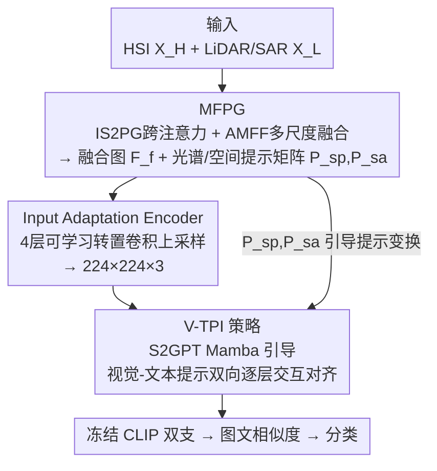

# CF-IPT: Cross-Modal Fusion Interactive Prompt Tuning of Vision-Language Pre-Trained Model for Multisource Remote Sensing Data Classification

**会议**: CVPR 2026  
**论文**: [CVF Open Access](https://openaccess.thecvf.com/content/CVPR2026/html/Ji_CF-IPT_Cross-Modal_Fusion_Interactive_Prompt_Tuning_of_Vision-Language_Pre-Trained_Model_CVPR_2026_paper.html)  
**代码**: https://github.com/Jiahuiqu/CF-IPT  
**领域**: 多模态VLM / 遥感分类 / 提示微调  
**关键词**: 提示微调, CLIP, 多源遥感分类, 跨模态融合, Mamba

## 一句话总结
CF-IPT 用一套"先把高光谱+LiDAR/SAR 融成一张图并生成光谱-空间提示矩阵、再用这些提示矩阵引导 CLIP 视觉/文本两支提示双向交互对齐"的提示微调框架，只动 CLIP 0.76% 的参数就把在自然图上预训练的 CLIP 迁移到多源遥感联合分类，在 Houston/MUUFL/Augsburg 上 OA 分别比 SOTA 高 1.38%/2.27%/1.38%。

## 研究背景与动机
**领域现状**：多源遥感联合分类（如高光谱 HSI 提供丰富光谱、LiDAR/SAR 提供丰富空间结构）此前主流是 CNN/Transformer/Mamba 从零训练的双流融合网络（MFT、MCFT、MSFMamba 等）。近两年也开始有人把 CLIP 这类大规模图文预训练 VLM 用提示微调（prompt tuning）、Adapter、LoRA 等方式搬过来，因为提示微调只调一小撮可学习提示向量、不动主干，参数和算力都省。

**现有痛点**：把 CLIP 直接迁到遥感有两道墙。其一是**数据层面**——HSI/LiDAR/SAR 的成像特性和自然图差异巨大（几百个连续窄波段的光谱、垂直结构与地形），CLIP 在自然图上学到的视觉表征根本抓不住这些光谱-空间特征；而且 CLIP 只吃单张 RGB，多源数据怎么喂进去本身就是问题。其二是**任务层面**——现有提示注入大多是"单边"的（只在视觉支或只在文本支插提示），既没法深入学这种复杂视觉表征，也做不到视觉与文本提示之间的对齐，这恰恰违背了 CLIP 靠图文对齐工作的核心原理。

**核心矛盾**：多源遥感的丰富光谱-空间信息 vs. CLIP 单源、自然图先验之间存在结构性失配；同时单边提示无法激活 CLIP 的跨模态对齐机制。

**本文目标**：在只加极少参数的前提下，让 CLIP 同时跨过这两道墙——既能吃下多源遥感、又能把文本支的对齐目标从"自然图"迁到"多源遥感图"。

**切入角度**：作者的观察是，与其把多源数据硬塞进 CLIP，不如**把多源融合的产物（光谱矩阵、空间矩阵）变成"提示"**，让这些携带遥感原生特征的提示矩阵反过来去引导 CLIP 内部视觉-文本提示的双向交互。

**核心 idea**：用"跨模态融合生成的光谱-空间提示矩阵"作为媒介，引导 CLIP 视觉支与文本支提示双向变换对齐，把数据适配和任务适配统一进一个提示微调框架。

## 方法详解

### 整体框架
给定多源遥感数据 $D_t=\{X_H, X_L, c\}$（$X_H$ 光谱丰富如 HSI，$X_L$ 空间丰富如 LiDAR/SAR，$c$ 类标），冻结的 CLIP 参数为 $\phi$，CF-IPT 只引入一小撮可学习参数 $\theta_f$（约 CLIP 的 0.76%），让 $(\phi,\theta_f)$ 完成下游分类。整个流程分两个阶段：**阶段一·数据预处理**解决"多源→单图"的数据适配，**阶段二·微调**解决"单边提示→跨模态对齐"的任务适配。

阶段一里，MFPG 模块用跨注意力做跨模态交互，输出两样东西：一张融合后的紧凑图 $F_f$，以及保留原生光谱/空间风格的提示矩阵 $P_{sp}, P_{sa}$；融合图再经 Input Adaptation Encoder（IAE）上采样到 CLIP 要求的 $224\times224\times3$。阶段二里，V-TPI 策略把可学习提示注入 CLIP 冻结的视觉支和文本支，并用阶段一生成的 $P_{sp},P_{sa}$ 引导两支提示通过 S2GPT Mamba 模块逐层双向变换、对齐，最终用图文相似度做分类。

### 关键设计

**1. MFPG：把多源融合的产物变成携带原生特征的光谱-空间提示矩阵**

这一步针对"多源数据塞不进单源 CLIP、且融合会丢失原生光谱-空间特征"的数据层痛点。MFPG 由两个子模块串成。前半段 IS2PG 用跨注意力做"互相提特征"：双支图 $X_H\in\mathbb{R}^{H\times W\times C}$、$X_L\in\mathbb{R}^{H\times W\times D}$ 各过线性层得到光谱提示矩阵 $P_{sp}\in\mathbb{R}^{C\times C}$ 和空间提示矩阵 $P_{sa}\in\mathbb{R}^{HW\times HW}$，关键是**两支互为 query/key**——

$$P_{sp}=\sigma(L_q(X_L)\odot L_k(X_H)),\quad P_{sa}=\sigma(L_q(X_H)\odot L_k(X_L))$$

再用它们抽出带残差的光谱/空间特征 $F_H=X_H+L_v([X_H,X_L])\odot P_{sp}$、$F_L=X_L+L_v([X_H,X_L])\odot P_{sa}$，沿通道拼成初步融合特征 $F_m$。这里的妙处在于：$P_{sp},P_{sa}$ 不只是中间变量，它们保留了多源数据的原生光谱/空间"风格"，会被原样送进阶段二当提示引导信号，等于把"融合时被压掉的原生特征"以提示形式补偿回去。

后半段 AMFF 做深度融合：光谱方向用全局平均池化 $P_{avg}$ 和最大池化 $P_{max}$ 各过瓶颈层得到通道注意力 $z_{avg},z_{max}$，相加再 sigmoid 重标定得到 $\tilde F_m=F_m\odot\sigma(z_{avg}+z_{max})$，抑制冗余波段；空间方向把 $\tilde F_m$ 喂进 $1\times1/3\times3/5\times5$ 三路并行卷积，与 $F_m$ 逐元素相加得到多尺度融合图 $F_f=\sum_{i=1}^{3}\text{Conv}_{(2i-1)\times(2i-1)}(\tilde F_m)+F_m$。一边压光谱冗余、一边抓多尺度空间，最终得到既紧凑又信息完整的融合图。

**2. Input Adaptation Encoder：用可学习转置卷积把融合图无损放大到 CLIP 输入尺寸**

融合后的图块很小（patch size 仅 7–11），而 CLIP 视觉支要 $224\times224\times3$，直接双线性/双三次插值放大会丢细节、还没有语义引导。作者改用四层可学习转置卷积（每层 = 转置卷积 + BN + GeLU）把 $F_f$ 逐步上采样到 $F_n\in\mathbb{R}^{224\times224\times3}$。因为权重可学习，它能在放大的同时保留原图信息、按语义补细节。别看这步不起眼，消融里它是**掉点最狠的一环**——换回双线性插值后三个数据集 OA 暴跌 5.04%/8.48%/8.90%，说明"怎么把小遥感块喂进 CLIP"这个看似工程的问题其实是迁移成败的关键。

**3. V-TPI：用光谱-空间提示矩阵引导 CLIP 视觉-文本提示双向逐层交互对齐**

这一步针对任务层痛点——单边提示激活不了 CLIP 的跨模态对齐。V-TPI 在 CLIP 视觉支、文本支各注入可学习提示 $P_V\in\mathbb{R}^{L\times n\times d_V}$、$P_T\in\mathbb{R}^{L\times n\times d_T}$（$L$ 注入层数、$n$ 提示长度），然后在每一层 $i$ 让两支提示**互相变换、再加回对方**：

$$\tilde P_{V_i},\tilde P_{T_i}=\theta_T(P_{V_i},P_{T_i}),\qquad P_{TV_i}=P_{T_i}+\tilde P_{V_i},\quad P_{VT_i}=P_{V_i}+\tilde P_{T_i}$$

变换后的 $P_{TV_i},P_{VT_i}$ 拼进对应 transformer 层的输入，逐层把视觉/文本表征往一起拉（视觉支拼 $P_{VT}$、文本支拼 $P_{TV}$，超出注入深度 $L$ 的层就退回原始 transformer）。

承担"视觉↔文本变换"的核心是 **S2GPT Mamba 模块**。作者选 Mamba 状态空间模型是看中它长序列建模强、比 Transformer/CNN 高效。它把 1D Mamba 扩成能吃光谱-空间先验：

$$P_{S2}=\text{S2PtTrans}(\text{SiLU}(\text{DWConv}(L(P)))),\quad P_{out}=L\big(\text{SiLU}(L(P))\odot \text{LN}(\text{SSM}_{V\text{-}T}(P_{S2}))\big)$$

其中 $P$ 是待变换提示（$P_{V_i}$ 或 $P_{T_i}$），$P_{out}$ 即 $\tilde P_{V_i}/\tilde P_{T_i}$。关键的 S2PtTrans 把阶段一的 $P_{sp},P_{sa}$ 注进来：$P_{S2}=[\delta_{sa}(P_{sa},P_i[0,n/2]),\ \delta_{sp}(P_{sp},P_i[n/2,n])]$，即把提示沿通道劈两半，前半用空间矩阵 $P_{sa}$、后半用光谱矩阵 $P_{sp}$ 各自投影→逐元素相乘→投回原形。沿通道的双向状态扫描让模型学到"光谱-空间变化如何影响文本/视觉提示语义"，且 S2GPT 跨层共享，既学到通用视文转换规律、又适配遥感独有的光谱-空间结构。这是整个框架真正把"数据适配的产物"接回"任务适配"的纽带。

### 损失函数 / 训练策略
**文本提示设计**：用软提示模板 "A multisource fusion patch of [CLASS]"，把编码后的 $P_T$ 当可学习参数，与类名嵌入 $N=\{n_1,...,n_C\}$ 拼成 $[P_T,n_i]$ 再过文本编码器，弥补 CLIP 对遥感专有术语的硬提示理解不足。

训练用两个损失。**跨模态表征一致性损失** $L_{CRC}$ 是常规对比分类项：先算图文相似度 $S_i=\frac{F_I\cdot F_{T_i}}{\|F_I\|\|F_{T_i}\|}\cdot\tau$，再对其做交叉熵。**文本表征多样性损失** $L_{TRD}$ 针对遥感类别文本语义高度相似、易混淆的问题，把类间相似度矩阵 $S_T$ 往单位阵 $I$ 拉，$L_{TRD}=\mathbb{E}\,|S_T-I|$，逼大类间语义距离。总损失 $L_{total}=L_{CRC}+\lambda\cdot L_{TRD}$（$\lambda=0.02$）。优化器 AdamW、lr 5e-4、CLIP backbone 用 ViT-B/16，提示深度 $L$ 取 9–12。

## 实验关键数据

### 主实验
三个多源数据集（Houston HS+LiDAR、MUUFL HS+LiDAR、Augsburg HS+SAR），每类仅 40 个训练样本，指标 OA/AA/κ + 可训练参数量（M）。

| 数据集 | 方法 | OA(%) | AA(%) | κ | Params(M) |
|--------|------|-------|-------|------|-----------|
| Houston | DiffCLIP | 96.15 | 96.59 | 95.83 | 10.58 |
| Houston | SPT | 96.01 | 96.45 | 95.69 | 3.43 |
| Houston | M³amba | 95.93 | 96.35 | 95.60 | 70.81 |
| Houston | **CF-IPT** | **97.89** | **98.23** | **97.72** | **1.14** |
| MUUFL | SPT | 87.69 | 86.09 | 83.88 | 1.53 |
| MUUFL | DiffCLIP | 86.98 | 85.01 | 82.81 | 10.55 |
| MUUFL | **CF-IPT** | **89.25** | **88.42** | **85.89** | **1.03** |
| Augsburg | DiffCLIP | 88.45 | 75.34 | 83.76 | 10.60 |
| Augsburg | **CF-IPT** | **89.83** | **80.05** | **85.64** | **0.90** |

三数据集 OA 分别比当时 SOTA 高 1.38%/2.27%/1.38%，而参数量只有 1M 量级——比 M³amba（70.8M）小约 70 倍、比 DiffCLIP（10.6M）小约 10 倍。作者指出"性能整体与可训练参数正相关，但本文用极小参数就拿到最优"。

场景分类泛化（去掉多源融合、只留微调机制，每类 16 张）：

| 数据集 | CoOp | CoCoOp | MaPLe | APPLeNet | **CF-IPT** |
|--------|------|--------|-------|----------|------------|
| RSICD | 84.63 | 89.20 | 89.87 | 91.00 | **92.80** |
| PatternNet | 86.84 | 92.79 | 90.88 | 94.77 | **96.55** |
| RESISC45 | 81.69 | 81.43 | 80.30 | 83.32 | **86.65** |

### 消融实验
| 配置 | Houston OA | MUUFL OA | Augsburg OA | 说明 |
|------|-----------|----------|-------------|------|
| Full (CF-IPT) | 97.89 | 89.25 | 89.83 | 完整模型 |
| Variant-1 (w/o S²Prompt) | 96.74 | 83.94 | 84.56 | 提示矩阵换成全 1 矩阵 |
| Variant-2 (w/o Image Fusion) | 93.28 | 86.62 | 84.62 | 融合换成直接通道拼接 |
| Variant-3 (IAE replaced) | 92.49 | 80.77 | 80.60 | 转置卷积换双线性插值 |
| Variant-4a (仅视觉提示) | 96.70 | 88.02 | 86.66 | 去掉文本提示 |
| Variant-4b (仅文本提示) | 96.22 | 88.09 | 86.55 | 去掉视觉提示 |
| Variant-4c (w/o 提示交互) | 96.67 | 85.88 | 86.34 | 两支各用独立提示不交互 |
| Variant-4d (S2GPT 换 Transformer) | 96.85 | 86.37 | 86.37 | 变换模块换标准 Transformer |

### 关键发现
- **IAE 是掉点最狠的环节**（Variant-3 在 MUUFL/Augsburg 掉 8.48%/8.90%）：怎么把小遥感融合块"无损放大"喂进 CLIP，比大多数人以为的更关键，可学习上采样远胜插值。
- **图像融合 > 直接拼接**（Variant-2 掉 2.6%–4.9%）：MFPG 的跨模态交互+多尺度融合确实比 naive concat 抓到更有判别力的特征。
- **光谱-空间提示矩阵不可省**（Variant-1 在 MUUFL/Augsburg 掉 5.31%/4.94%）：把提示矩阵换成全 1 后大跌，证明原生光谱/空间风格信息对对齐很重要。
- **双向交互 > 单边提示**：仅视觉/仅文本（4a/4b）、不交互（4c）、用 Transformer 替 S2GPT（4d）都不如完整模型，说明"双向 + Mamba 变换"的组合才是 V-TPI 的精髓；Transformer 在捕捉提示内跨模态语义相关性上弱于 S2GPT Mamba。

## 亮点与洞察
- **"融合产物即提示"的思路很巧**：大多数遥感+CLIP 工作把融合和提示当两件事，本文让 IS2PG 生成的光谱/空间矩阵既是融合中间量、又是阶段二的提示引导信号，等于用提示把"融合时丢的原生特征"补偿回 CLIP，把数据适配和任务适配缝成一条链。
- **双向提示交互真正激活了 CLIP 的对齐本性**：单边注入只是"喂信息"，而让视觉提示和文本提示互相变换再加回对方，才贴合 CLIP 靠图文对齐工作的原理——这个观察可迁移到其它"VLM + 异构模态"场景。
- **极致参数效率**：0.76% 参数、1M 量级可训练量就超 70M 的 Mamba 大模型，对算力受限的遥感落地很有吸引力。
- **可迁移 trick**：用 Mamba 沿通道双向扫描做"提示变换器"、并把领域先验（这里是光谱/空间矩阵）切半分别注入提示两半，是一种轻量注入领域知识的通用做法。

## 局限与展望
- **方法链条偏重、组件多**（MFPG=IS2PG+AMFF、IAE、V-TPI=S2GPT Mamba、两个损失），工程实现和调参成本不低；论文未给训练/推理时延，"高效"主要体现在参数量而非端到端速度。⚠️ 时延对比表缺失，以原文为准。
- **每类训练样本极少（40 / 16 张）**：在小样本设定下提升明显，但未报告大样本或跨地区跨传感器迁移时的表现，泛化边界不清。
- **只验证了 HSI+LiDAR/SAR 两源**：模块设计里"光谱支/空间支"的二分假设较强，三源及以上、或光谱-空间界限不清的模态能否直接套用待验证。
- **S2GPT 内部细节略含糊**：$\delta_{sp}/\delta_{sa}$ 的具体结构、SSM 双向扫描实现等描述较简，复现需参考代码。⚠️ 部分公式符号（如 $P_i$ 切分、$\text{SSM}_{V\text{-}T}$）以原文/官方代码为准。

## 相关工作与启发
- **vs SPT**：SPT 也是把提示微调用到多源遥感、利用光谱特性做提示，但属单边、未做视觉-文本提示的协同变换；CF-IPT 在 Houston 上 OA 97.89% vs SPT 96.01%，关键差距来自双向提示交互。
- **vs DiffCLIP / M³amba**：这些方法靠更大模型/扩散或 Mamba 堆性能（10–70M 参数），CF-IPT 用 ~1M 参数反超，说明"对齐机制设计"比"堆参数"更划算。
- **vs CoOp/CoCoOp/MaPLe/APPLeNet**：这些自然图提示微调方法即便搬到遥感场景分类也只是单边或浅层提示；CF-IPT 即使去掉多源融合、只留微调机制，在 RSICD/PatternNet/RESISC45 仍领先 1.8%–3.3%，证明 V-TPI 的双向对齐本身就有增益。

## 评分
- 新颖性: ⭐⭐⭐⭐ "融合产物当提示引导双向交互"的缝合思路在遥感+VLM 里较新颖，但组件多为已有技术（跨注意力/Mamba/提示微调）的组合。
- 实验充分度: ⭐⭐⭐⭐ 三多源 + 三场景共六数据集、八个 SOTA 对比、七组消融，覆盖到位，缺时延/大样本分析。
- 写作质量: ⭐⭐⭐⭐ 动机清晰、公式完整，但 S2GPT 部分符号略密、个别记号需对照代码。
- 价值: ⭐⭐⭐⭐ 参数效率突出、对遥感落地友好，"双向提示对齐"思路有迁移价值。

<!-- RELATED:START -->

## 相关论文

- [\[CVPR 2026\] VLM4RSDet: Collaborative Optimization with Vision-Language Model for Enhancing Remote Sensing Object Detection](vlm4rsdet_collaborative_optimization_with_vision-language_model_for_enhancing_re.md)
- [\[CVPR 2026\] AVION: Aerial Vision-Language Instruction from Offline Teacher to Prompt-Tuned Network](avion_aerial_visionlanguage_instruction_from_offli.md)
- [\[CVPR 2026\] GeoDiT: A Diffusion-based Vision-Language Model for Geospatial Understanding](geodit_a_diffusion-based_vision-language_model_for_geospatial_understanding.md)
- [\[CVPR 2026\] CrossEarth-Gate: Fisher-Guided Adaptive Tuning Engine for Efficient Adaptation of Cross-Domain Remote Sensing Semantic Segmentation](crossearth-gate_fisher-guided_adaptive_tuning_engine_for_efficient_adaptation_of.md)
- [\[CVPR 2026\] Prompt-Free Unknown Label Generation for Open World Detection in Remote Sensing](prompt-free_unknown_label_generation_for_open_world_detection_in_remote_sensing.md)

<!-- RELATED:END -->
