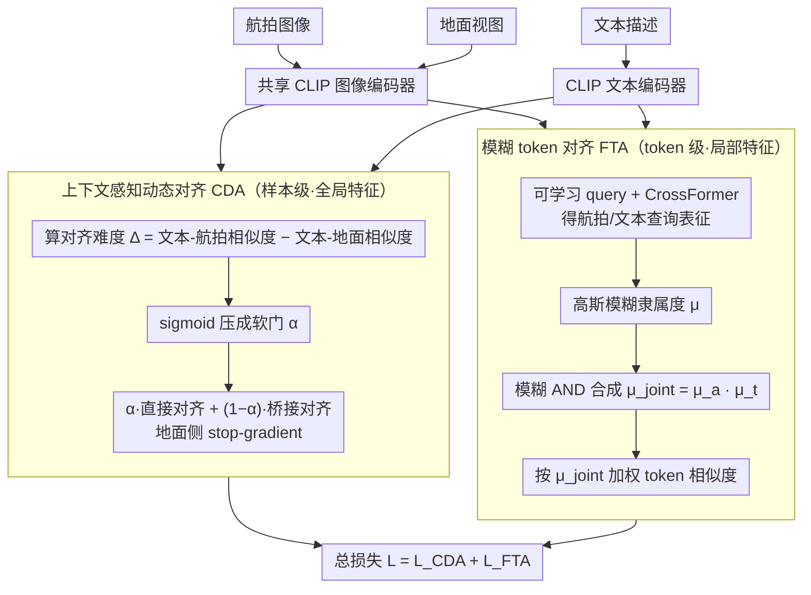

# Cross-modal Fuzzy Alignment Network for Text-Aerial Person Retrieval and A Large-scale Benchmark

**会议**: CVPR 2026  
**arXiv**: [2603.20721](https://arxiv.org/abs/2603.20721)  
**代码**: [https://github.com/Yifei-AHU/AERI-PEDES](https://github.com/Yifei-AHU/AERI-PEDES)  
**领域**: 遥感 / 行人检索  
**关键词**: 文本-航拍行人检索, 模糊逻辑, 跨模态对齐, 无人机, Chain-of-Thought 标注

## 一句话总结
提出跨模态模糊对齐网络 CFAN，利用模糊逻辑量化 token 级可靠性实现精细对齐，并引入地面视图作为桥接代理缓解航拍图像与文本的语义鸿沟，同时构建了大规模文本-航拍行人检索基准 AERI-PEDES。

## 研究背景与动机

**领域现状**：文本-图像行人检索（TIPR）已取得显著进展，但所有现有工作均基于固定地面摄像头数据。无人机（UAV）提供了动态多角度监控的独特优势，将 TIPR 扩展到航拍场景具有重大研究价值。

**现有痛点**：(1) 航拍图像因拍摄角度和高度剧烈变化导致人物外观非线性畸变；(2) 航拍视图中行人视觉线索稀疏或部分缺失（如只能看到头顶），文本描述包含的完整属性无法与航拍图像完全对应；(3) 在做 token 级细粒度对齐时，不可观察的 token 引入错误跨模态对齐。

**核心矛盾**：目击者描述通常详细完整，但航拍图像只能覆盖部分语义区域——这种可见性不一致导致细粒度对齐时产生大量噪声匹配。

**本文要解决**：如何在航拍图像视觉线索不完整的情况下实现鲁棒的文本-航拍行人跨模态检索？

**切入角度**：(1) 用模糊逻辑量化每个 token 的可靠程度，抑制不可观察/噪声 token 的影响；(2) 用地面视图作为中间桥梁，自适应平衡直接对齐和桥接对齐。

**核心 idea**：模糊隶属度建模 token 可靠性 + 上下文感知动态对齐 = 鲁棒的文本-航拍对齐。

## 方法详解

### 整体框架
CFAN 要解决的是文本描述完整、而航拍图像只能看到局部（甚至只有头顶）这种"信息不对等"下的跨模态检索。整体上它走两条对齐路径：一是文本直接对到航拍图像，二是借一张同人的地面视图当中转，文本先对地面、地面再对航拍。一张共享的 CLIP 图像编码器同时吃航拍图和地面图、CLIP 文本编码器吃描述，然后两个模块接力——上下文感知动态对齐（CDA）在样本层面决定这两条路径各占多少权重，模糊 token 对齐（FTA）再在 token 层面把真正可靠的局部细节挑出来精对齐。（下面第 3 个设计的 AERI-PEDES 是离线构建的数据集流水线，不在这张网络框架图里。）

### 关键设计

**1. 上下文感知动态对齐 CDA：让每张图自己决定"要不要走地面桥接"**

直接对齐和桥接对齐谁更靠谱，其实因图而异：低空近拍的航拍图人物清晰，文本直接对它就够了；高空远拍的航拍图细节糊成一团，这时绕道地面视图反而更稳。CDA 不写死这个选择，而是先量一个"难度信号"——文本-航拍的相似度减去文本-地面的相似度 $\Delta_i = \text{sim}(T_i^C, A_i^C) - \text{sim}(T_i^C, G_i^C)$，再用 sigmoid 把它压成一个 0 到 1 的软门 $\alpha_i = \frac{1}{1 + \exp[-k \cdot \Delta_i]}$。$\Delta_i$ 越大说明直接对齐越占优，$\alpha_i$ 就越接近 1，损失里直接对齐的权重就越高：

$$\mathcal{L}_{\text{CDA}} = \frac{1}{B} \sum_{i=1}^B \left[\alpha_i \cdot \mathcal{L}_{\text{direct}} + (1-\alpha_i) \cdot \mathcal{L}_{\text{bridge}}\right]$$

这样每个样本都在按自己的对齐难度动态分配两条路径的比重，而不是全 batch 用同一套权重。一个细节是桥接路径里对地面特征做了 stop-gradient——只让文本去贴地面，不让航拍侧的梯度回流污染地面表征，避免桥接这个"拐杖"反过来把中转站本身带歪。

**2. 模糊 token 对齐 FTA：用模糊隶属度把"看得见且对得上"的 token 挑出来**

航拍图里大量 token 对应的区域根本不可观察（被遮挡、超出视角），如果还硬做 token 级对齐，这些噪声 token 就会制造一堆错误匹配。FTA 的思路是给每个 token 打一个"可靠度"，只让可靠的部分参与对齐。具体做法是先用一组共享的可学习 query $\mathbf{Q} \in \mathbb{R}^{K \times D}$ 分别和航拍、文本两个模态做 cross-attention，得到两套模态感知的查询表征；再用高斯模糊隶属函数衡量每个 query token 的可靠性 $\mu_j^a = \exp\left(-\frac{(1-r_j)^2}{2\sigma^2}\right)$，其中 $r_j$ 是该 query token 与全局 class token 的余弦相似度——越贴近全局语义，隶属度越接近 1。两个模态的隶属度用模糊 AND（相乘）合成 $\mu_j^{\text{joint}} = \mu_j^a \cdot \mu_j^t$，只有在航拍和文本里"都可靠"的 token 才会拿到高权重，最后按这个权重聚合相似度 $\text{sim}(Q_a, Q_t) = \frac{1}{K} \sum_{j=1}^K \mu_j^{\text{joint}} s_j$。

它比普通注意力权重更有针对性的地方在于：注意力只是"哪个 token 更相关"，而模糊隶属度直接对应"这个 token 在两个模态里是不是都看得见、对得上"，不可观察或噪声 token 因为单边隶属度低、相乘后被自然压到接近 0。高斯尺度 $\sigma$ 也不是固定超参，而是从全局 class token 自适应预测，使模型能按图像内容松紧不同地调整可靠性门槛。

**3. AERI-PEDES 基准构建：用思维链分解把"一句话描述"拆成可核验的属性标注**

文本-航拍行人检索此前没有数据，本文顺带建了 AERI-PEDES。标注没有让模型一步生成整段描述，而是走 Chain-of-Thought 三步——先解析属性、再生成初始标注、最后审核精化，把"生成一段话"拆成可逐步核验的子任务，降低 VLM 一次性编造的风险。训练集用 VLM 自动标注以保证规模，测试集则全部人工标注以保证评估可靠，规模与人工质量两头兼顾。

### 损失函数 / 训练策略
- CDA 直接对齐和桥接对齐均用 SDM（Similarity Distribution Matching）损失
- FTA 用 KL 散度实现 similarity distribution matching
- 总损失：$\mathcal{L} = \mathcal{L}_{\text{CDA}} + \mathcal{L}_{\text{FTA}}$
- Adam 优化器，初始学习率 $5 \times 10^{-6}$，cosine decay，60 epochs

## 实验关键数据

### 主实验

| 方法 | AERI-PEDES R1↑ | AERI-PEDES mAP↑ | TBAPR R1↑ | TBAPR mAP↑ |
|------|---------------|-----------------|-----------|------------|
| IRRA (CVPR23) | 35.14 | 33.42 | 39.63 | 35.31 |
| HAM (CVPR25) | 44.58 | 42.45 | 47.81 | 41.86 |
| CFAN (无地面) | 45.06 | 43.27 | 49.15 | 42.89 |
| **CFAN (有地面)** | **47.16** | **44.79** | **49.47** | **43.96** |

### 消融实验

| 配置 | R1 | mAP | RSum | 说明 |
|------|-----|------|------|------|
| Baseline (仅桥接) | 43.88 | 41.58 | 174.84 | 基线 |
| + CDA | 46.18 | 43.98 | 183.04 | RSum +8.2% |
| + FTA | 44.55 | 41.89 | 176.64 | R1 +0.67% |
| + CDA + FTA | **47.16** | **44.79** | **186.65** | 全部合计 |

桥接模态对比：

| 桥接方式 | R1 | mAP | 说明 |
|---------|-----|------|------|
| None（无桥接） | 45.06 | 43.27 | 仅 FTA |
| Aerial（低空航拍桥接） | 46.08 | 44.20 | 有效但有限 |
| Ground（地面视图桥接） | **47.16** | **44.79** | 最优 |

### 关键发现
- CDA 贡献最大（RSum 提升 8.2%），说明自适应平衡直接/桥接对齐是核心
- FTA 提供了补充的细粒度对齐改进
- 即使无地面图像，仅用 FTA 的 CFAN 也已超越所有竞品

## 亮点与洞察
- **模糊逻辑与深度学习的结合**：用模糊隶属函数量化 token 可靠性是一个优雅的设计，比简单的注意力权重更有理论基础
- **大规模数据集贡献**：AERI-PEDES（112K+ 图像）填补了文本-航拍行人检索的数据空白
- **CoT 标注流水线**：结构化推理步骤的标注方法可推广到其他数据集构建

## 局限与展望
- 需要同一行人的航拍和地面配对图像，实际部署中可能难以获取
- 模糊隶属函数为高斯形式，更灵活的参数化可能更好
- 仅使用 CLIP 编码器，更大更强的 VLM 可能带来进一步提升

## 相关工作与启发
- 模糊深度学习在医学图像分析中已有应用，本文将其推广到跨模态检索
- CDA 中的动态对齐难度估计思路可推广到其他不完整视觉信息的检索场景（如雾天、遮挡）

## 评分
- 新颖性: ⭐⭐⭐⭐ 模糊逻辑+动态桥接对齐的组合新颖
- 实验充分度: ⭐⭐⭐⭐⭐ 两个数据集+完整消融+参数敏感性分析
- 写作质量: ⭐⭐⭐⭐ 公式清晰，结构完整
- 价值: ⭐⭐⭐⭐ 数据集和方法对文本-航拍行人检索领域有实际推动作用

<!-- RELATED:START -->

## 相关论文

- [\[CVPR 2026\] Cross-Scale Pansharpening via ScaleFormer and the PanScale Benchmark](cross-scale_pansharpening_via_scaleformer_and_the_panscale_benchmark.md)
- [\[CVPR 2026\] Olbedo: An Albedo and Shading Aerial Dataset for Large-Scale Outdoor Environments](olbedo_an_albedo_and_shading_aerial_dataset_for_large-scale_outdoor_environments.md)
- [\[ICCV 2025\] CityNav: A Large-Scale Dataset for Real-World Aerial Navigation](../../ICCV2025/remote_sensing/citynav_a_large-scale_dataset_for_real-world_aerial_navigation.md)
- [\[ECCV 2024\] Cross-Platform Video Person ReID: A New Benchmark Dataset and Adaptation Approach](../../ECCV2024/remote_sensing/cross-platform_video_person_reid_a_new_benchmark_dataset_and_adaptation_approach.md)
- [\[CVPR 2026\] AVION: Aerial Vision-Language Instruction from Offline Teacher to Prompt-Tuned Network](avion_aerial_visionlanguage_instruction_from_offli.md)

<!-- RELATED:END -->
