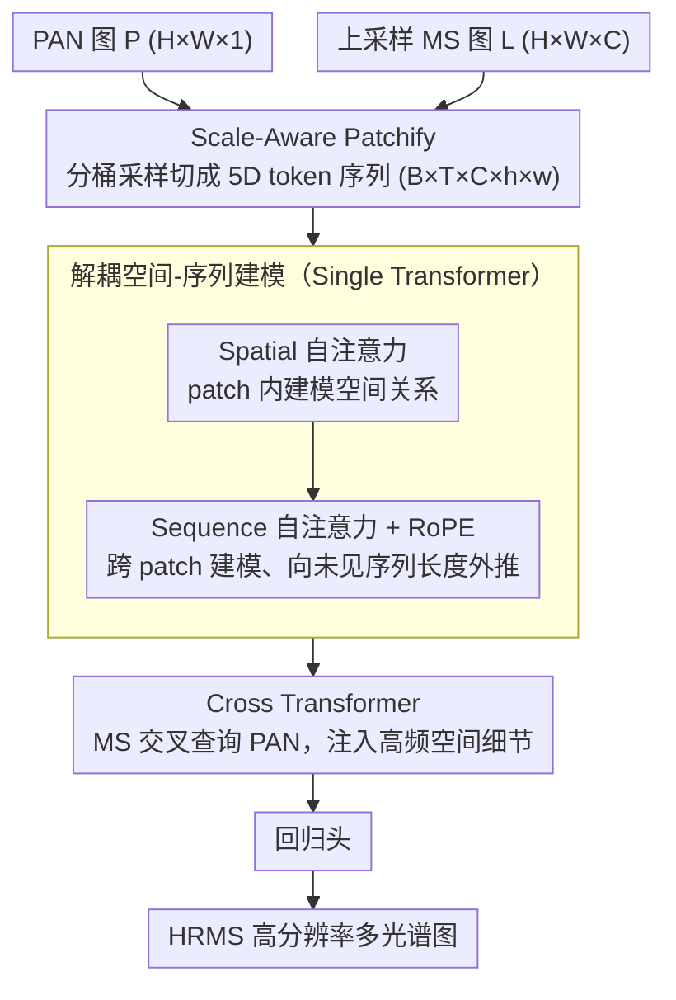

# Cross-Scale Pansharpening via ScaleFormer and the PanScale Benchmark

**会议**: CVPR 2026  
**arXiv**: [2603.00543](https://arxiv.org/abs/2603.00543)  
**代码**: [GitHub](https://github.com/caoke-963/ScaleFormer)  
**领域**: 遥感  
**关键词**: 遥感图像融合, 跨尺度泛化, Transformer, 旋转位置编码, Pansharpening

## 一句话总结
提出首个跨尺度全色锐化数据集PanScale和评测基准PanScale-Bench，以及ScaleFormer框架——将分辨率变化重新解释为序列长度变化，通过Scale-Aware Patchify分桶采样+解耦空间-序列建模+RoPE实现跨尺度泛化。

## 研究背景与动机
**领域现状**：全色锐化（Pansharpening）利用高分辨率全色（PAN）图像和低分辨率多光谱（LRMS）图像融合生成高分辨率多光谱图像（HRMS），是遥感图像处理的核心任务。CNN/Transformer方法（MSDCNN、HFIN、ARConv等）已取得长足进步。

**现有痛点**：(i) **计算与内存瓶颈**——从训练裁剪尺寸（200-256px）推理到800/1600/2000px时，Transformer显存剧增，常规GPU常在800px就OOM；(ii) **分块推理伪影**——被迫分块推理引入边界不连续和明显块状伪影；(iii) **跨尺度泛化弱**——单一低分辨率训练导致尺度诱导的分布偏移，亮度分布随分辨率增大显著偏移。

**核心矛盾**：现有数据集（PanCollection、NBU、PAirMax）仅提供有限尺度多样性和分辨率，缺乏标准化多尺度+高分辨率评估协议。

**本文目标** 在数据、算法、计算三个维度系统解决跨尺度全色锐化的挑战。

**切入角度**：将分辨率变化重新表述为序列长度变化——固定空间大小的patch作为token，仅序列长度随图像尺度线性增长。

**核心 idea**：用Scale-Aware Patchify引入序列轴，将空间建模与尺度建模解耦，配合RoPE实现对未见尺度的外推泛化。

## 方法详解

### 整体框架
ScaleFormer 要解决的是「训练在 200–256px 小图、推理却要在 800–2000px 大图上跑」的跨尺度泛化问题。它的核心思路是把分辨率变化重新理解成序列长度变化：固定每个 patch 的空间大小，图像变大时只是 token 序列变长。输入一张 PAN 图 $\mathbf{P} \in \mathbb{R}^{H \times W \times 1}$ 和上采样后的 MS 图 $\mathbf{L} \in \mathbb{R}^{H \times W \times C}$，先由 Scale-Aware Patchify 切成 5D 张量 $\mathbf{P}_{5d} \in \mathbb{R}^{B \times T \times C \times h \times w}$（$T$ 是序列长度），再依次过 Single Transformer（空间域与序列域分别建模）和 Cross Transformer（PAN-MS 跨模态融合），最后回归出高分辨率多光谱图。

### 关键设计

**1. Scale-Aware Patchify：把分辨率泛化变成序列长度泛化**

直接拿小图训练、大图推理会撞上尺度诱导的分布偏移——亮度统计量随分辨率漂移，模型没见过的尺度就崩。SAP 的做法是训练时随机采样分桶索引 $t$ 来决定窗口大小 $w(t)$，用 Patch-to-Sequence Tokenizer 把输入切成不同长度的 token 序列，让模型在训练阶段就见过多种有效序列长度；推理时固定窗口大小，高分辨率仅靠延长序列来承接。因为每个 token 的空间尺寸始终不变，它的均值和方差就稳定下来，不会随整图变大而漂移，这正是跨尺度外推能站住的前提。

**2. 解耦空间-序列建模：让尺度建模独立于空间建模**

如果空间关系和尺度变化耦在同一套注意力里，序列一长就难以泛化。这里把两者拆开：Spatial Transformer 只在每个 patch 内部建模空间关系，
$$\mathbf{f}_{i,1} = \mathbf{f}_i + SA_{spa}(LN(\mathbf{f}_i))$$
Sequence Transformer 则在序列维度建模跨 patch 的相关性，
$$\mathbf{f}_{i+1,1} = \mathbf{f}_{i+1} + SA_{seq}(LN(\mathbf{f}_{i+1}))$$
$SA_{seq}$ 计算时把 batch 和空间维度合并，并注入 **RoPE** 编码连续的相对位置。RoPE 的好处是相对位置能平滑外推到训练时没出现过的序列长度，于是模型在 1600/2000px 这种长序列上仍能保持位置感知。

**3. Cross Transformer：用交叉注意力做 PAN-MS 融合**

PAN 提供高频空间细节、MS 提供光谱信息，二者要融合而不是简单相加。Cross Transformer 沿用前面解耦的结构，但把自注意力换成交叉注意力，让 MS 特征去查询 PAN 特征：
$$\mathbf{f}_{i,1}^{ms} = \mathbf{f}_i^{ms} + CA_{spa}(LN(\mathbf{f}_i^{ms}), LN(\mathbf{f}^{pan}))$$
这样空间细节从 PAN 注入 MS，同时整套融合仍保持逐 patch、可变序列长度的处理方式，于是也具备跨尺度一致性。

### 损失函数 / 训练策略
使用L1损失 $\mathbf{L} = \|\mathbf{H}_{out} - \mathbf{G}\|_1$。Adam优化器，初始学习率 $5 \times 10^{-4}$，余弦退火衰减到 $5 \times 10^{-8}$，500 epochs，NVIDIA 3090，32通道。

## 实验关键数据

### 主实验：PanScale数据集跨三个子集的平均结果

| 方法 | Jilin PSNR/SSIM | Landsat PSNR/SSIM | Skysat PSNR/SSIM |
|------|-----------------|-------------------|-------------------|
| HFIN | 38.00/0.9698 | 40.21/0.9666 | 43.96/0.9658 |
| ARConv | 38.23/0.9697 | 39.66/0.9638 | 43.40/0.9797 |
| Pan-mamba | 35.55/0.9480 | 36.73/0.9206 | 41.39/0.9493 |
| **ScaleFormer** | **39.29/0.9761** | **41.04/0.9711** | **44.65/0.9827** |

ScaleFormer在所有数据集上全面领先SOTA，且在分辨率增大时性能保持稳定。

### 消融实验：Landsat数据集

| 消融配置 | 200px PSNR | 400px PSNR | 800px PSNR | 1600px PSNR |
|---------|-----------|-----------|-----------|------------|
| w/o RoPE | 40.46 | 40.95 | 40.76 | 40.69 |
| SeqT→SpaT | 40.91 | 41.30 | 40.72 | 40.51 |
| w/o SAP | 40.53 | 40.93 | 40.62 | 40.39 |
| **Full Model** | **40.61** | **41.37** | **41.13** | **41.03** |

各消融变体均在大分辨率上出现明显性能下降，证实每个组件对跨尺度泛化不可或缺。

### 关键发现
- 模型参数量仅0.52M（HFIN的1/4，ARConv的1/9），计算效率显著优势
- 随分辨率增大，ScaleFormer的GFLOPs和显存增长远慢于HFIN/ARConv
- ARConv在分块推理时出现严重块伪影（DDC-IoU显著下降）
- 全分辨实世界场景评估（无GT）中ScaleFormer同样保持竞争力

## 亮点与洞察
- **问题重构巧妙**：将分辨率泛化转化为序列长度泛化，借用NLP/视频模型中序列建模的思想
- **计算效率突出**：在参数量和GFLOPs上大幅领先SOTA，且优势随分辨率增大而扩大
- **数据集贡献**：PanScale是首个覆盖3种卫星平台（0.5~15m分辨率）的跨尺度全色锐化数据集
- **RoPE应用创新**：将文本/视频领域的RoPE引入遥感融合任务实现尺度外推

## 局限与展望
- 仅关注全色锐化任务，对其他遥感融合任务（超光谱融合、SAR-光学融合）的泛化未验证
- SAP的分桶策略是预定义的固定窗口大小集合，自适应策略可能更优
- 仅使用L1损失，感知损失或GAN损失可能进一步提升视觉质量
- Sequence Transformer的自注意力仍为 $O(T^2)$，超大规模输入时仍有瓶颈

## 相关工作与启发
- 传统方法（GS、IHS、GFPCA）在跨尺度场景表现差（PSNR低10+dB）
- CNN方法（MSDCNN、SFINet、MSDDN）跨尺度泛化有限
- HFIN/ARConv是当前SOTA但显存和计算瓶颈严重
- Pan-mamba用Mamba架构但性能不及Transformer方案
- FlexViT的多分辨率训练和视频生成的分桶训练策略是SAP的灵感来源

## PanScale数据集详情
- **三个子数据集**：Jilin（吉林一号，0.5~1m分辨率）、Landsat（Landsat-8，15m分辨率）、Skysat（Planet SkySat，~1m分辨率）
- **测试集设计**：每个子数据集包含reduced-resolution（200×200到2000×2000）和full-resolution多尺度测试集
- **数据来源**：通过Google Earth Engine (GEE)系统获取和预处理
- **评估指标**：PanScale-Bench整合参考指标（PSNR/SSIM/ERGAS/Q）和无参考指标（$D_\lambda$/$D_S$/QNR）

## 效率优势

| 方法 | 参数量(M) | GFLOPs(G) |
|------|-----------|----------|
| ARConv | 4.4147 | 38.32 |
| HFIN | 1.9836 | 46.21 |
| **ScaleFormer** | **0.5151** | **20.57** |

## 评分 ⭐
- 新颖性: ⭐⭐⭐⭐ — 分辨率→序列长度的重构视角新颖，SAP+RoPE组合有效
- 实验充分度: ⭐⭐⭐⭐⭐ — 三数据集+多尺度+全分辨率+消融+效率分析+可视化全覆盖
- 写作质量: ⭐⭐⭐⭐ — 图表设计优秀，Fig 1/2清晰展示问题和方案对比
- 价值: ⭐⭐⭐⭐⭐ — 数据集+基准+方法三位一体贡献，推动遥感融合领域发展

<!-- RELATED:START -->

## 相关论文

- [\[CVPR 2026\] Cross-modal Fuzzy Alignment Network for Text-Aerial Person Retrieval and A Large-scale Benchmark](cross-modal_fuzzy_alignment_network_for_text-aerial_person_retrieval_and_a_large.md)
- [\[CVPR 2026\] RoadGIE: Towards A Global-Scale Aerial Benchmark for Generalizable Interactive Road Extraction](roadgie_towards_a_global-scale_aerial_benchmark_for_generalizable_interactive_ro.md)
- [\[CVPR 2026\] Fast Kernel-Space Diffusion for Remote Sensing Pansharpening](fast_kernel-space_diffusion_for_remote_sensing_pansharpening.md)
- [\[CVPR 2026\] UniGeoRS: A Unified Benchmark for Tri-view Geo-Localization](unigeors_a_unified_benchmark_for_tri-view_geo-localization.md)
- [\[CVPR 2026\] YieldSAT: A Multimodal Benchmark Dataset for High-Resolution Crop Yield Prediction](yieldsat_a_multimodal_benchmark_dataset_for_high-resolution_crop_yield_predictio.md)

<!-- RELATED:END -->
