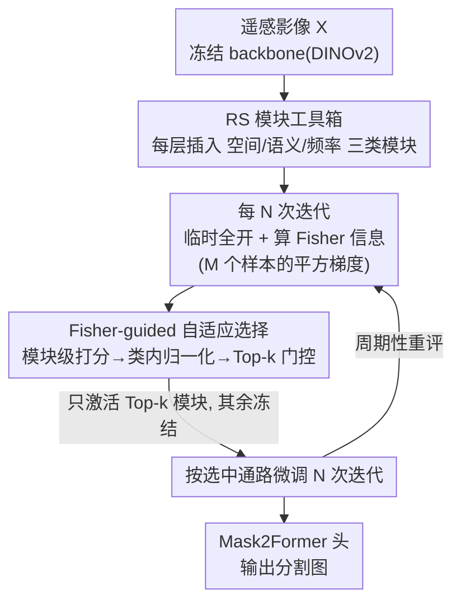

# CrossEarth-Gate: Fisher-Guided Adaptive Tuning Engine for Efficient Adaptation of Cross-Domain Remote Sensing Semantic Segmentation

**会议**: CVPR 2026  
**论文**: [CVF Open Access](https://openaccess.thecvf.com/content/CVPR2026/html/Cao_CrossEarth-Gate_Fisher-Guided_Adaptive_Tuning_Engine_for_Efficient_Adaptation_of_Cross-Domain_CVPR_2026_paper.html)  
**代码**: 无（论文未给出仓库链接）  
**领域**: 遥感 / 跨域语义分割 / 参数高效微调  
**关键词**: 遥感分割, 参数高效微调(PEFT), 域泛化/域适应, Fisher 信息, 动态模块选择

## 一句话总结
针对遥感影像里同时存在的空间、语义、频率三类域差异，CrossEarth-Gate 把对应的三种 PEFT 模块（LoRA / Adapter / Earth-Adapter）做成一个"工具箱"塞进 backbone 的每一层，再用 Fisher 信息周期性地度量每个模块对任务梯度流的贡献、只激活最关键的 Top-k 个，从而在仅 3~4M 可训参数下，在 18 个遥感跨域分割基准上拿下 16 个 SOTA。

## 研究背景与动机
**领域现状**：遥感地理基础模型（GFM）越做越大，主流做法是用参数高效微调（PEFT）只更新一小撮参数去激活它们的下游能力。常见 PEFT 各自盯着 Transformer 的一条"功能通路"：LoRA 改 MSA 增强空间依赖建模，AdaptFormer 改 MLP 精修高层语义，Earth-Adapter 在频域抑制高幅伪影。

**现有痛点**：遥感的域差异是**多面**的——波段范围、地理地貌、气候带的差异会同时引发三类 shift：（1）空间 shift（物体尺度/结构变化，需要几何完整性）；（2）语义 shift（类别外观与概念差异）；（3）频率 shift（不同地物带来的高频谱伪影/纹理噪声）。而每个现有 PEFT 只走一条通路，只能治一面：论文里 LoRA 把带高频波纹的水域误判成森林（治不了频率），AdaptFormer 把道路打碎、丢了空间连续性（治不了空间），Earth-Adapter 把海浪误识成森林（治不了语义）。

**核心矛盾**：单通路、静态的模块放置策略，与遥感域差异"多面交织且不可预测"的本质天然冲突——专精某一面的方法换个域就崩。即便把三种模块全开，又会因可训参数暴涨、梯度更新互相冲突而退化（实验里"全开不选"反而掉点最多）。

**本文目标**：用一个统一框架同时覆盖空间/语义/频率三面，又不能把所有模块都训——既要"全能"又要"高效"。

**切入角度**：把适应过程看成一股**梯度流（gradient flow）**——不同模块为这股流提供不同通路。那么只要能周期性地量出"哪条通路此刻流量最大、对输出影响最大"，就只在那里"下钩子"，把梯度导过去即可。度量这个"流量"的工具就是 Fisher 信息。

**核心 idea**：先建一个含三类模块的 RS 工具箱铺满每一层，再用 Fisher 信息做数据驱动的动态门控，**只激活当前任务最关键的 Top-k 个模块**，让框架按域自适应地"换装"。

## 方法详解

### 整体框架
CrossEarth-Gate 在冻结的 ViT/DINOv2 backbone 上工作，两大件协同：**① RS 模块工具箱**——把空间模块（LoRA，挂在 MSA）、语义模块（Adapter，并联 MLP）、频率模块（Earth-Adapter，作用于块输出）这三类 PEFT 模块**全部初始插入每一层**，给模型配齐应对三面 shift 的"全套工具"；**② Fisher-guided 自适应选择**——每隔 $N$ 次训练迭代，临时把工具箱里所有模块打开，用一小批样本算 Fisher 信息，给每个"模块×层"打一个重要性分，归一化后只保留 Top-k 个模块激活、其余继续冻结，接下来的 $N$ 次迭代梯度只流向这些被选中的通路。如此周期性重评，形成一个多阶段、随任务动态调整的微调过程。

### 关键设计

**1. RS 模块工具箱：用三类 PEFT 模块分别接管空间/语义/频率三条通路**

这针对的是"单通路 PEFT 只能治一面"的痛点：与其静态地为某些层挑一种方法，CrossEarth-Gate 干脆把三类互补模块铺满每一层，让框架有"全套工具"可调。三类模块各自精准地钉在 Transformer 里最相关的算子上——

- **空间模块（LoRA on MSA）**：MSA 负责 token 间关系、捕捉多尺度空间依赖，所以把低秩矩阵注入 MSA 的 query/value 投影。对预训练权重 $W_0\in\mathbb{R}^{d\times d}$，更新量被假设为低"内在秩"，写成两个低秩矩阵之积 $W=W_0+\Delta W=W_0+BA$（$A\in\mathbb{R}^{d\times r}$，$B\in\mathbb{R}^{r\times d}$，$r\ll d$），在不动冻结的 $W_Q,W_V$ 前提下调节模型对空间上下文与物体尺度的理解。
- **语义模块（Adapter on MLP）**：MLP 被认为是模型存放事实/语义知识的所在，跨域泛化概念（如农村与城市里的"建筑"）需要改这部分知识。于是在每个 MLP 旁并联一个 Adapter（降维 $W^{down}_i\in\mathbb{R}^{d\times\hat d}$ + GELU + 升维 $W^{up}_i\in\mathbb{R}^{\hat d\times d}$，$\hat d\ll d$），其输出经残差加回，块输出变为 $\hat T_{i+1}=\mathrm{MLP}(\hat T^{attn}_i)+\mathrm{Adapter}_i(\hat T^{attn}_i)+\hat T^{attn}_i$，在不破坏原知识流的前提下精修语义变换。
- **频率模块（Earth-Adapter on 块输出）**：遥感影像几乎处处是高幅伪影。Earth-Adapter 先用傅里叶变换把特征拆成低频（结构）与高频（细节/纹理）分量，由不同的轻量 adapter 专家分别处理，再用 mixture-of-adapters 路由器选择性重组，从而压制伪影同时保住关键特征；以残差形式加回 $\tilde T_{i+1}=\hat T_{i+1}+\text{Earth-Adapter}_i(\hat T_{i+1})$。

三者覆盖了空间/语义/频率全部三面，构成后续选择机制的候选池——这是"统一、全能"的来源。

**2. Fisher-guided 自适应选择：用 Fisher 信息当"流量计"，周期性只放行 Top-k 模块**

光把工具铺满会带来新问题：同时训所有模块既低效，梯度还会互相冲突（消融里"全开不选"掉点最多）。本设计要解决的就是"该激活哪些模块"。作者用 Fisher 信息矩阵（FIM）量化"扰动某参数对模型输出分布的影响"：对参数 $\theta$ 的小扰动 $\delta$，输出分布的 KL 散度二阶近似为 $\mathbb{E}_X[D_{KL}(P_\theta\|P_{\theta+\delta})]=\delta^\top F_\theta\delta+O(\delta^3)$。由于 $|\theta|\times|\theta|$ 的完整 FIM 不可行，改用经验对角近似——它正好等于参数平方梯度的均值：

$$\hat F_\theta=\frac{1}{N}\sum_{j=1}^{N}\big(\nabla_\theta \log P_\theta(Y_j|X_j)\big)^2$$

其中 $\log P_\theta(Y_j|X_j)$ 取负任务损失。$\hat F_\theta$ 大，意味着这是条"高流量通道"——梯度大、对输出影响大，正是"下钩子"收益最高的地方。

从参数分上升到模块分：对第 $i$ 层第 $z$ 类模块（参数 $\zeta^z_i$），把其所有参数的 Fisher 分加总 $\hat S^z_i=\sum_{\zeta^z_i}\hat F_{\zeta^z_i}$；再做**类内归一化**让不同类型模块可比 $S^z_i=\hat S^z_i/\sum_i^I \hat S^z_i$（$I$ 为层数）——这一步保证选择是均衡的，不会因某类模块天生分高而霸榜，从而促成多样化、任务专属的配置。具体流程：每 $N$ 次迭代临时全开所有模块，用一小批 $M$ 个样本算 Fisher，按 $S^z_i$ 取 Top-k 激活，梯度门控到这些通路训练 $N$ 次，再周期重复。这样框架就能随任务（甚至 DA 里用目标域伪标签算 Fisher）动态"换装"到当下最关键的模块组合。⚠️ 论文未在正文给出 $N$、$M$、$k$ 的具体取值（称在附录），表中可训参数随选择结果在 3.0~4.4M 间浮动即源于此。

### 损失函数 / 训练策略
优化目标为 $\arg\min_{\zeta,\phi}\mathbb{E}_{(X,Y)\in D}\,\mathcal{L}(H_\phi(B_{\alpha,\zeta}(X)),Y)$，只更新 PEFT 模块参数 $\zeta$ 与解码头 $\phi$，backbone 参数 $\alpha$ 冻结（$|\zeta|\ll|\alpha|$）。backbone 主用 DINOv2，分割头用 Mask2Former；DG 用端到端有监督训练，DA 用 DACS 自训练框架（含目标域伪标签）；AdamW，解码器与 PEFT 模块基础学习率 1e-5。

## 实验关键数据

### 主实验
覆盖 18 个遥感跨域分割基准（CASID 12 个气候带 DG + Potsdam→RescueNet 2 个灾害 DG + 4 个 DA），16 个拿下 SOTA，PEFT 基线上最多 +3.2% mIoU。下表摘 CASID 四个源域的 DG 平均 mIoU（DINOv2-L backbone）与 4 个 DA 基准（括号为相对次优的提升）：

| 基准（mIoU%） | Frozen | LoRA | AdaptFormer | Earth-Adapter | CrossEarth-Gate |
|---|---|---|---|---|---|
| CASID Sub→* 平均 | 55.2 | 57.2 | 56.1 | 56.8 | **60.6 (+1.6)** |
| CASID Tem→* 平均 | 63.6 | 64.0 | 64.1 | 64.5 | **65.1 (+0.6)** |
| CASID Tms→* 平均 | 54.4 | 54.5 | 58.0 | 56.2 | **59.3 (+1.3)** |
| CASID Trf→* 平均 | 59.2 | 59.8 | 61.8 | 60.6 | **62.4 (+0.6)** |
| DA 平均（P2V/V2P/R2U/U2R）| 56.4 | 57.6 | 57.7 | 58.1 | **59.1 (+1.0)** |
| 可训参数 (M) | 0 | 6.4 | 3.2 | 9.6 | **3.0~4.4** |

CrossEarth-Gate 在 12 个 CASID 场景中 10 个 SOTA，且参数比 LoRA/Earth-Adapter 更省。仅 Tem2Sub、Trf2Sub 两个孤例被静态方法略胜——作者解释为这些 shift 恰好与某固定模块放置对上，但那些静态方法换域就泛化失败。

### 消融实验
核心组件消融（CASID，Mean 为四源域平均 mIoU%，对应论文 Fig.3）：

| 配置 | Sub | Tem | Tms | Trf | Mean | 说明 |
|---|---|---|---|---|---|---|
| 完整 CrossEarth-Gate | 60.6 | 65.1 | 59.3 | 62.4 | **61.9** | — |
| w/o Spatial（去空间）| 56.7 | 64.8 | 58.6 | 61.9 | 60.5 | Sub 掉最多 |
| w/o Semantic（去语义）| 59.4 | 64.2 | 57.6 | 60.4 | 60.4 | Trf 受影响最大 |
| w/o Frequency（去频率）| 57.5 | 63.8 | 59.3 | 60.9 | 60.4 | Sub 受影响明显 |
| w/o Selection（全开不选）| 57.8 | 63.5 | 57.3 | 61.1 | **59.6** | 掉点最多，参数也最大 |

另有 backbone 泛化性消融（Tab.4）：在 SatMAE / Scale-MAE / SAM-Huge / DINOv2-S/B 五种骨干上，CrossEarth-Gate 全面超过 Frozen 与 Full-Tuning，平均 mIoU 提升 2.1%~7.6%，且参数极省（如 DINOv2-Small 仅 0.7M）。

### 关键发现
- **"全开不选"掉点最多（61.9→59.6）**：盲目增加可训参数有害，会引发梯度冲突；动态门控梯度流才是关键，这从经验上证明了选择机制的必要性。
- **三类模块都不可省、且各有侧重**：去掉任一类都掉点；Sub/Tem 域对去空间、去频率最敏感，Trf 域对去语义最敏感——印证遥感域差异确实多面，需要按域配模块。
- **Full-Tuning 在 DG 上灾难性退化**（DINOv2 上比 Frozen 还差），是典型的源域过拟合，且参数代价巨大；说明跨域遥感更需要"约束式"的高效微调。
- 个别类别（如 P(r)2Res 的 Building）Frozen 反超本方法——作者认为 DINOv2 对高度结构化物体的预训练表示已近最优，任何适应反而轻微扰动它。

## 亮点与洞察
- **把"选哪个 PEFT 模块"形式化成 Fisher 流量门控**：用经验对角 FIM（= 平方梯度均值）当模块重要性度量，再加一步**类内归一化**让异质模块可比，是这套机制能"均衡选择、不被某类霸榜"的关键 trick，值得迁移到任意多类适配器并存的 PEFT 场景。
- **"工具箱 + 动态选择"解耦了能力与效率**：先用全套模块保证能力上限，再用稀疏激活控住参数与梯度冲突——这种"先铺满再门控"的范式，对其他多面域差异任务（多模态、多传感器）有借鉴意义。
- **DA 下用目标域伪标签算 Fisher**：让选择机制能针对具体目标域"对症下药"，把动态适应从 DG 自然延伸到 DA。

## 局限与展望
- **关键超参未在正文交代**：$N$（重评周期）、$M$（算 Fisher 的样本数）、$k$（激活模块数）都甩到附录，正文无法判断方法对它们的敏感性；可训参数 3.0~4.4M 的浮动也由选择动态决定，复现需查附录。⚠️
- **周期性"临时全开算 Fisher"有额外开销**：每 $N$ 次迭代都要把工具箱全开跑一小批前向/反向，论文未量化这部分训练时间/显存成本相对单一 PEFT 的代价。
- **个别 shift 被静态方法略胜**（Tem2Sub/Trf2Sub、DA 的 V2P 与 LoRA 打平）：说明当某域差异确实是"单面"时，动态选择并无额外收益，甚至略逊于恰好对路的静态放置。
- **工具箱模块类型固定为三类**：空间/语义/频率是基于现有 PEFT 归纳的，若出现新的 shift 类型（如时序/多光谱特有差异），需要人工扩充工具箱。

## 相关工作与启发
- **vs LoRA / AdaptFormer / Earth-Adapter**：它们各自只改一条通路（空间/语义/频率），CrossEarth-Gate 把三者纳入同一工具箱并动态选择，区别在于从"单面静态"升级为"多面动态"，因而在 16/18 基准上更稳更省参。
- **vs CrossEarth / 专用 DA 模型（HRDA、DAFormer）**：CrossEarth 用 Earth-style 注入 + 多任务训练做 DG，本文则走 PEFT 路线、可训参数从数十 M 降到 3~4M，且在多数 CASID 场景反超。
- **vs 基于 Fisher 的选择性 PEFT（如按 Fisher 选稀疏参数的方法）**：前者在**参数**粒度选稀疏更新，本文把 Fisher 抬到**模块**粒度并做类内归一化门控，更契合"多类适配器并存、要按域换装"的遥感设定。

## 评分
- 新颖性: ⭐⭐⭐⭐ 把多类 PEFT 模块组成工具箱 + Fisher 流量门控做动态选择，思路清晰且契合遥感多面 shift，但单个组件（LoRA/Adapter/Earth-Adapter/Fisher 选择）均为已有技术的组合。
- 实验充分度: ⭐⭐⭐⭐⭐ 18 个 DG/DA 基准、5 种 backbone、组件与骨干双重消融，覆盖面充分且有定性可视化佐证。
- 写作质量: ⭐⭐⭐⭐ "梯度流/下钩子/换装"的隐喻让机制好懂，公式推导清晰；但关键超参缺在正文略影响自洽。
- 价值: ⭐⭐⭐⭐ 为遥感跨域分割提供了参数省、泛化稳的统一 PEFT 方案，"先铺满再门控"范式可迁移到其他多面域适应任务。

<!-- RELATED:START -->

## 相关论文

- [\[CVPR 2026\] SegEarth-R2: Towards Comprehensive Language-guided Segmentation for Remote Sensing Images](segearth-r2_towards_comprehensive_language-guided_segmentation_for_remote_sensin.md)
- [\[CVPR 2026\] Semantic-Adaptive Diffusion for Dynamic Spatiotemporal Fusion](semantic-adaptive_diffusion_for_dynamic_spatiotemporal_fusion.md)
- [\[CVPR 2026\] HySeg: Learning Generative Priors for Structure-Aware Remote Sensing Segmentation](hyseg_learning_generative_priors_for_structure-aware_remote_sensing_segmentation.md)
- [\[CVPR 2026\] SkySense-VITA: Towards Universal In-context Segmentation of Multi-modal Remote Sensing Imagery](skysense-vita_towards_universal_in-context_segmentation_of_multi-modal_remote_se.md)
- [\[CVPR 2026\] ReAttnCLIP: Training-Free Open-Vocabulary Remote Sensing Image Segmentation via Re-defined Attention in CLIP](reattnclip_training-free_open-vocabulary_remote_sensing_image_segmentation_via_r.md)

<!-- RELATED:END -->
