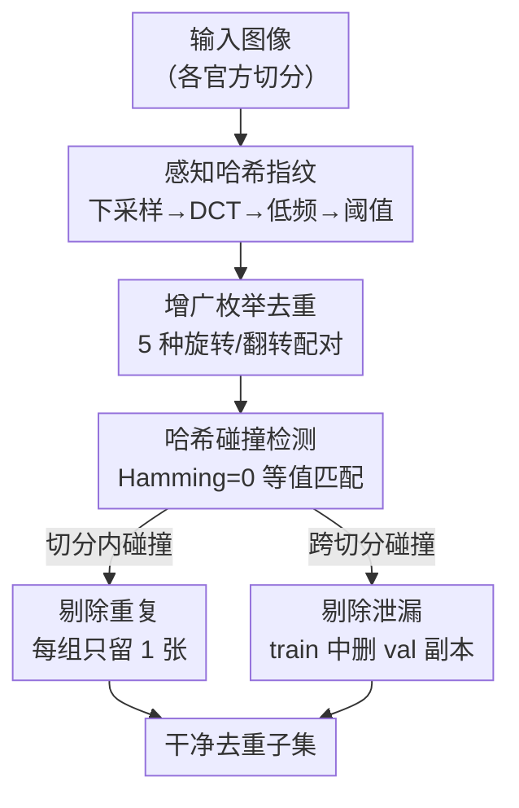

# Data Leakage Detection and De-duplication in Large Scale Geospatial Image Datasets

**会议**: CVPR2026  
**arXiv**: [2304.02296](https://arxiv.org/abs/2304.02296)  
**代码**: https://github.com/yeshwanth95/Hash_and_search  
**领域**: 遥感 / 数据集质量审计  
**关键词**: 感知哈希, 数据泄漏, 去重, 建筑物足迹提取, 数据集审计

## 一句话总结
本文用感知哈希（perceptual hashing）对三个常用建筑物足迹遥感数据集做质量审计，发现 AICrowd Mapping Challenge 数据集存在严重的重复（约 89% 训练图为精确/增广重复）与跨切分泄漏（约 93% 验证图出现在训练集），并给出一条轻量、可复用的去重+泄漏检测流水线，揭示出大量"SOTA"方法实为过拟合到泄漏数据。

## 研究背景与动机
**领域现状**：建筑物足迹提取（building footprint extraction）大量依赖公开 benchmark 训练 CNN/Transformer。其中 AICrowd Mapping Challenge 数据集因为提供了 MS-COCO 格式的多边形标注、规模大（训练 28 万、验证 6 万张 300×300 卫星图块），被近年大量多边形提取方法当作主力训练/评测集，甚至被一些工作独占使用。

**现有痛点**：研究者默认这些公开 benchmark 是"干净"的，直接拿官方 train/val 切分跑实验、刷点、和别人比 SOTA。但没人系统检查过这些大规模数据集内部是否存在重复样本、官方切分之间是否互相泄漏——而这两件事一旦发生，刷出来的高分就是假的。

**核心矛盾**：大规模数据集（动辄几十万到数十亿图）人工逐张核查不现实，而重复与泄漏对结果的污染又是隐性的——模型在"测试集"上的高分可能只是因为它在训练时已经见过这些图（甚至连错误标注都一起背下来），这种过拟合会被误读成强泛化。

**本文目标**：(1) 定量审计 INRIA、SpaceNet 2、AICrowd 三个数据集的重复与泄漏程度；(2) 给社区一条便宜、好用、和具体数据集无关的流水线，让大家用数据集之前能快速体检。

**切入角度**：作者注意到他们只需检测**精确重复**和**增广重复**（90°/180°/270° 旋转 + 水平/垂直翻转），而非语义近邻。这类变换下"同一张图"在像素层面高度相关，正好是感知哈希的强项——比起需要预训练的自监督特征去重，感知哈希无需训练、计算极快、且对颜色和微小结构变化不敏感。

**核心 idea**：用 64-bit 感知哈希给每张图（含其增广版本）算一个指纹，把"找重复/找泄漏"降维成哈希碰撞检测（Hamming 距离为 0 的精确匹配），用一次简单等值比较就能在数十万张图上完成审计。

## 方法详解

### 整体框架
方法本身非常轻量：核心是"给每张图算感知哈希 → 用哈希碰撞找重复和泄漏 → 剔除碰撞样本"。流水线与具体数据集无关，分三步走——先对一张图计算感知哈希，再对官方切分内部及切分之间检测碰撞以量化重复/泄漏，最后通过增广枚举消除增广重复并剔除跨切分泄漏，得到真正去重后的干净子集。

### 关键设计

**1. 感知哈希指纹：用低频 DCT 把一张图压成 64 位、对颜色与微结构不敏感**

要在几十万张图上找重复，逐像素比对不可行，神经特征去重又要预训练且难跨数据集泛化。作者改用感知哈希：输入图先按下采样因子 $d$ 缩小，对缩小图算 $32\times32$ 的离散余弦变换 $t$，只保留左上角 $8\times8$ 的最低频分量 $t_L$，再用 $t_L$ 的均值做阈值二值化并展平，得到 64 位指纹 $H_p$。低频 DCT 抓的是图像的整体结构、丢弃高频细节，因此该指纹对颜色变化和微小结构扰动天然不敏感——这正好契合"找的是同一张图的副本而非语义近邻"的目标，也让不同地理位置但内容雷同（如纯水面/草地的低对比度图块）能被识别为同一类

**2. 哈希碰撞检测：把"找重复/找泄漏"统一成 Hamming 距离为 0 的等值比较**

有了指纹后，重复检测和泄漏检测被统一成同一个操作：哈希碰撞。作者采用 bit depth = 64、Hamming 距离阈值为 0（即只认精确相等的哈希为碰撞），比较退化成最廉价的等值检查。切分**内部**的碰撞 = 重复样本，切分**之间**的碰撞（如 train 与 val）= 数据泄漏。实测每张图哈希计算约 4ms、每次比较约 4ms（AMD EPYC 7313，8 核 32GB），使得整条流水线在大规模数据集上仍然快到可日常使用——这是它"易采纳"的关键

**3. 增广枚举去重：把旋转/翻转副本显式生成后再比哈希，捕获"换个姿势的同一张图"**

精确哈希匹配只能抓到逐像素相同的副本，但数据集里大量重复是被旋转或翻转过的"增广副本"——它们像素排布变了、哈希也变了，单纯比原图哈希会漏掉。作者的做法是对每张图显式生成 5 个增广版本（90°、180°、270° 旋转 + 水平、垂直翻转），把这些增广图也纳入哈希池一起比对：只要某图的任一增广版与另一图碰撞，就判定为增广重复。去重时每组重复任意保留一张；最后再单独检查 train↔val 的跨切分碰撞，把训练集里所有泄漏的验证图删掉。这样既清掉了切分内重复，也清掉了跨切分泄漏，得到真正干净的训练子集

### 损失函数 / 训练策略
本文是数据集审计工作，不涉及模型训练或损失函数。流水线全程无需学习、无需 GPU，仅依赖哈希计算与比较。

## 实验关键数据

### 主实验
三个数据集的重复/泄漏审计结果对比（PHash，Hamming 阈值 0）。INRIA 与 SpaceNet 2 几乎无问题，AICrowd 则极度污染：

| 数据集 | 审计结论 | 代表性重叠率 |
|--------|----------|--------------|
| INRIA Aerial Labelling | 可忽略（检出的"泄漏"多为纯水面/草地低对比度图，属假阳性） | $\sim 10^{-3}\%$ 量级 |
| SpaceNet 2 v2 | 可忽略（检出多为 no-data 栅格伪影，属假阳性） | $\sim 1\%$ 量级 |
| AICrowd（官方 train→val） | 严重泄漏 | 93.45%（56,368/60,317 验证图在训练集里） |
| AICrowd（官方 train→test） | 严重泄漏 | 93.26%（56,608/60,697） |
| AICrowd（增广 train 内部重复） | 严重重复 | 89.55%（251,403/280,741） |

AICrowd 去重前后规模塌缩，直观说明冗余之严重：

| 切分 | 原始规模 | 去重后唯一图 | 进一步剔除泄漏后 |
|------|----------|--------------|------------------|
| 训练集 | 280,741 | 29,338 | 15,392 |
| 验证集 | 60,317 | 14,166 | — |

即原始 28 万张训练图，真正不重复且不泄漏的只剩约 1.5 万张（约 5.5%）。

### 消融实验
作者用平均哈希（AHash）作为交叉验证，确认污染结论不依赖于具体哈希算法（AICrowd 官方切分，括号为占搜索集比例）：

| 比对方向 | PHash 检出 | AHash 检出 |
|----------|------------|------------|
| Train 内部重复 | 166,193 (59.2%) | 167,829 (59.8%) |
| Train→Val 泄漏 | 95,241 (33.9%) | 97,950 (34.9%) |
| Val→Train 泄漏 | 56,368 (93.4%) | 56,431 (93.5%) |
| Test→Train 泄漏 | 56,608 (93.3%) | 56,740 (93.5%) |

两种哈希给出高度一致的污染量级，差异仅几个百分点；AHash 略高是因为它更易把相似但不同的图误判为重复（假阳性更多），因此作者认为 PHash 更适合做大规模审计。

### 关键发现
- AICrowd 的污染是结构性的：约 89% 训练图是（精确或增广）重复，约 93% 验证图泄漏进训练集——这意味着在该数据集上"测试"几乎等于"再测一遍训练集"。
- 泄漏导致的过拟合可被肉眼证实：PolyWorld、HiSup 等方法在验证集上不仅刷高分，还**连训练集里的错误/不完整标注一起复现**，直接坐实了"高分来自背题而非泛化"。
- 流水线开销极低（每图哈希 4ms、每次比较 4ms，纯 CPU），可作为"用数据集前先体检"的常规步骤。
- 对照组 INRIA/SpaceNet 检出的零星"泄漏"经核查均为水面/草地/no-data 等低信息图块，是哈希对颜色/微结构不敏感导致的假阳性，并非真泄漏——说明流水线结论需配合定性核查解读。

## 亮点与洞察
- **把"数据集体检"降维成哈希等值比较**：用 64-bit 感知哈希 + Hamming=0，让几十万张图的重复/泄漏检测退化成最廉价的等值比对，无需训练、纯 CPU 即可跑，工程上极易采纳——这是它真正可能被社区日常使用的原因。
- **显式增广枚举抓"换姿势的重复"**：单比原图哈希会漏掉旋转/翻转副本，作者把 5 种几何增广显式纳入哈希池，把"增广重复"也变成可检测的碰撞，这是揭出 AICrowd 89% 重复的关键一步。
- **用"复现错误标注"作为过拟合铁证**：与其只摆数字，作者展示 SOTA 方法连数据集的错误 GT 都背了下来，把抽象的"泄漏导致虚高"变成无可辩驳的定性证据，说服力极强。
- **可迁移性**：该审计思路适用于任何"重复是几何增广而非语义近邻"的视觉数据集——分类、分割、检测 benchmark 都能套用同一条流水线在发布或使用前自查。

## 局限与展望
- **只检精确/几何增广重复，不检语义近邻**：Hamming 阈值设为 0、只枚举旋转翻转，对裁剪、缩放、轻微视角变化或语义重复无能为力；这类近重复需要更高 bit depth 或自监督特征去重（作者也承认 bit depth 可调高以更敏感，但本研究 64 位已够用）。
- **去重保留策略随意**：每组重复"任意保留一张"，未考虑保留标注质量更高或更具代表性的样本，去重后的子集质量未必最优。
- **审计范围有限**：仅覆盖三个建筑物足迹数据集，结论（尤其 AICrowd 的严重污染）能否推广到 ImageNet/COCO/LAION 等更大数据集，文中仅作展望未实证。
- **假阳性需人工核查**：INRIA/SpaceNet 的检出需靠人眼判断是水面/no-data 才排除，说明流水线输出不能完全自动信任。

## 相关工作与启发
- **vs CE-Dedup / QHash 等去重方法**：它们用哈希去重的目标是"压缩数据集规模同时保持下游精度"，关注的是近重复；本文则聚焦精确与几何增广重复，且目的不是压缩而是**揭露 benchmark 污染**与泄漏，立场从"优化训练"转向"审计可信度"。
- **vs 自监督特征去重 [19,27]**：基于预训练描述子的去重可能对特定数据集达到更高去重率，但预训练在超大数据集上代价高、跨数据集泛化差；本文选择无需训练的感知哈希，换取通用性与速度。
- **vs PolyWorld / HiSup 等 AICrowd 上的 SOTA**：本文不提新模型，而是反过来证明这些方法的高分很大程度来自数据泄漏导致的过拟合，提醒社区重新审视在 AICrowd 上报告的所有结果的可比性。

## 评分
- 新颖性: ⭐⭐⭐ 方法本身（感知哈希）是成熟技术，新意在于把它系统用于揭露主流 benchmark 的严重污染并给出可复用流水线
- 实验充分度: ⭐⭐⭐⭐ 三数据集横向审计 + AHash 交叉验证 + 定性过拟合证据，结论扎实自洽
- 写作质量: ⭐⭐⭐⭐ 问题陈述清晰、数字详实、用"复现错误标注"作证据很有说服力
- 价值: ⭐⭐⭐⭐ 直接动摇了一批 AICrowd 上 SOTA 结果的可信度，并给社区一个低成本的数据集体检工具，实践价值高

<!-- RELATED:START -->

## 相关论文

- [\[CVPR 2026\] GeoSANE: Learning Geospatial Representations from Models, Not Data](geosane_learning_geospatial_representations_from_models_not_data.md)
- [\[CVPR 2026\] UniChange: Unifying Change Detection with Multimodal Large Language Model](unichange_unifying_change_detection_with_multimodal_large_language_model.md)
- [\[CVPR 2026\] Olbedo: An Albedo and Shading Aerial Dataset for Large-Scale Outdoor Environments](olbedo_an_albedo_and_shading_aerial_dataset_for_large-scale_outdoor_environments.md)
- [\[CVPR 2026\] Cross-modal Fuzzy Alignment Network for Text-Aerial Person Retrieval and A Large-scale Benchmark](cross-modal_fuzzy_alignment_network_for_text-aerial_person_retrieval_and_a_large.md)
- [\[ICCV 2025\] CityNav: A Large-Scale Dataset for Real-World Aerial Navigation](../../ICCV2025/remote_sensing/citynav_a_large-scale_dataset_for_real-world_aerial_navigation.md)

<!-- RELATED:END -->
