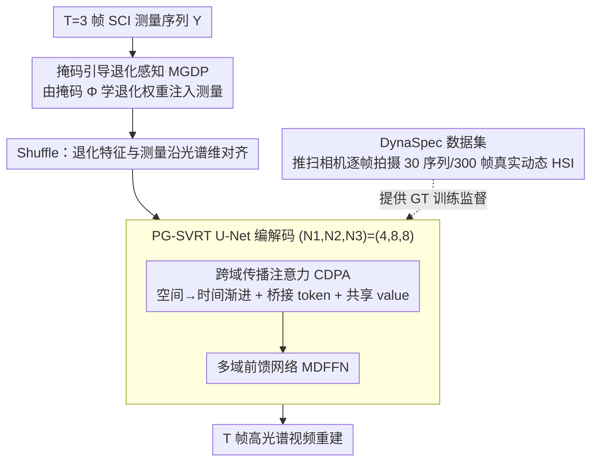

# Exploring Spatiotemporal Feature Propagation for Video-Level Compressive Spectral Reconstruction

**会议**: CVPR 2026  
**arXiv**: [2603.00611](https://arxiv.org/abs/2603.00611)  
**代码**: [DynaSpec](https://github.com/nju-cite/DynaSpec)  
**领域**: 计算光谱成像  
**关键词**: 光谱压缩成像, 高光谱视频重建, 时空特征传播, Transformer, DynaSpec 数据集

## 一句话总结

首次将光谱压缩成像（SCI）从图像级推进到视频级重建，构建首个高质量动态高光谱数据集 DynaSpec（30 序列/300 帧），提出 PG-SVRT 通过空间-然后-时间注意力 + 桥接 token 实现 41.52dB PSNR 和最优时间一致性，且 FLOPs（28.18G）低于多个图像级 SOTA。

## 研究背景与动机

**领域现状**：高光谱图像（HSI）能检测材料光谱属性，广泛应用于分类、检测、跟踪、自动驾驶。光谱压缩成像（SCI）通过空间-光谱编码将 3D 数据 $X \in \mathbb{R}^{H \times W \times C}$ 压缩为 2D 测量 $Y \in \mathbb{R}^{H \times W'}$ 实现快照采集。现有重建方法（MST-L、DPU、RDLUF 等）已在图像级取得优异性能。

**现有痛点**：(1) **重建不确定性**——掩码编码不可避免丢失空间-光谱信息，单帧恢复被遮挡内容存在固有歧义；(2) **时间不一致性**——逐帧独立重建无法保证时间连续性，表现为频闪强度曲线和帧间抖动，不满足视频感知需求。

**核心矛盾**：视频级重建面临双重障碍——**数据匮乏**（现有数据集均为图像级，伪视频裁剪缺乏真实运动自由度）和**算法瓶颈**（现有方法难以高效建模高维时空依赖——联合注意力复杂度爆炸，完全分离处理限制交互）。

**本文目标** 从数据、模型、基准三个维度推动光谱重建从图像级到视频级的跨越。

**切入角度**：固定编码模式在相邻帧间差异化捕获互补特征——被遮挡信息可从邻帧传播恢复，同时天然增强时间一致性。这一物理特性为视频级重建提供了坚实的信号基础。

**核心 idea**：利用时序测量序列中相邻帧的互补特征和时间连续性，通过空间-然后-时间渐进注意力 + 桥接 token，实现高效的视频级高光谱重建。

## 方法详解

### 整体框架

PG-SVRT 要解决的是：给定 $T=3$ 帧 SCI 测量序列，如何在不让时空注意力复杂度爆炸的前提下，把相邻帧的互补信息传播过来、同时保证重建结果的时间一致性。整体是一个 U-Net，测量先经掩码引导退化感知（MGDP）注入退化先验，再经 Shuffle 把退化特征与测量沿光谱维度对齐，然后堆叠跨域传播注意力（CDPA）+ 多域前馈网络（MDFFN）逐级编解码，最后输出 $T$ 帧高光谱重建。三层模块数 $(N_1, N_2, N_3)=(4,8,8)$，基础通道 $C=N_\lambda=30$。整个设计的支点有两个：一是用一套**真实拍摄的动态高光谱数据**让"视频级重建"这个问题第一次有了 ground truth，二是用**空间-然后-时间的渐进注意力**把高维时空依赖拆得既便宜又不丢交互。

### 关键设计

**1. DynaSpec 数据集：给视频级光谱重建造一个真实的 ground truth**

视频级重建一直做不起来的根本卡点不在算法而在数据——现有数据集要么是图像级的 CAVE/KAIST，要么是光谱分辨率低、不可靠的下游任务数据集，过去只能靠裁剪图像伪造"视频"，缺乏真实运动自由度。本文用 GaiaField 推扫式高光谱相机逐帧拍摄可控物体，手动设计平移/旋转/关节运动来模拟真实场景的运动，最终得到 30 场景、300 帧 HSI，空间分辨率 1280×1280，光谱分辨率 2nm，覆盖 400–700nm 共 151 个通道。为了让 ground truth 真正可信，采集遵循五条原则：帧间运动连续且符合物理规律、长曝光降噪、光谱响应校正、排除照明光谱使数据逼近反射率、用不变物体的强度做校准以消除温度漂移。正是这种"可控逐帧扫描"而非合成，保证了重建任务有一个可靠的监督信号。

**2. 掩码引导退化感知（MGDP）：把"哪里被编码损失得多"显式告诉网络**

SCI 的掩码编码本身会不均匀地丢失空间-光谱信息，网络若对各位置一视同仁就难以有针对性地重建。MGDP 位于主架构最前端，先把掩码 $\Phi$ 按 SCI 架构（SD/DD）压缩成 $\Phi_s$、再裁剪复制成 $\Phi_p$，然后用 Conv$_{1\times1}$+sigmoid 学习 $\Phi$ 与 $\Phi_p$ 之间的强度分布差异得到权重 $W_\Phi$，把它逐元素地施加到测量特征上再与原测量拼接：$Y_{in} = \text{Concat}(\text{Conv}(W_m \odot F_m(Y)), Y)$。这样退化先验就被显式编码进输入，网络在进入后续注意力前就"知道"每个空间-光谱位置的编码损失程度，从而把容量分配到更需要补全的地方。

**3. 跨域传播注意力（CDPA）：用空间-然后-时间的渐进注意力，把"既要便宜又要充分交互"两头都吃下**

这是 PG-SVRT 的核心模块，堆叠在 U-Net 各级里负责真正的时空特征传播。直接做联合时空注意力，复杂度随 $THW$ 平方膨胀、贵得用不起；而把空间、时间完全分离独立处理，又会切断两个域之间的特征交互。CDPA 的做法是先空间、后时间，并在两步之间复用同一份特征。空间这一步把特征切成非重叠窗口（$H_{win}=8,W_{win}=32$），并不让窗口内所有 token 两两做全注意力，而是先对 $Q_s$ 池化生成一组数量很小的桥接 token $B_s\in\mathbb{R}^{Thw\times N_B\times C}$（$N_B=64$）当中介，让 Q–K–V 通过它间接交互，从而避免额外投影参数：

$$Y_s^{out} = \text{GConv}\big(A(Q_s, B_s, A(B_s, K_s, V_s, \tau_1), \tau_2)\big) + Y_{N1}$$

时间这一步则在重排维度后，**直接把空间注意力的输出当作 value**复用：$Y_t^{out} = A(Q_t, K_t, Y_t, \tau_3)$，且因为 $T$ 很小、帧间又强相关，干脆不设时间窗口。这两点合起来把总复杂度压到 $O = 4THWC^2 + 4THWN_BC + 2T^2HWC$——只要 $2N_B < H_{win}W_{win}$（这里 $128<256$ 成立），桥接 token 就严格比全窗口注意力更省；而"共享 value"则让空间域学到的特征无成本地流到时间域，实现了跨域传播又不引入新的投影开销，这正是它既快又不丢交互的原因。

### 损失函数 / 训练策略

训练用多阶段 RMSE 损失，Adam 优化器（$\beta_1=0.9, \beta_2=0.999$），学习率 $3\times10^{-4}$ 余弦退火至 $1\times10^{-6}$，跑 80 epochs、batch size 2，单卡 RTX 3090。为公平评估，作者在 SD-CASSI/DD-CASSI/PMVIS/NDSSI 四种 SCI 系统下统一对比。

## 实验关键数据

### 主实验——与 SOTA 方法对比（DD-CASSI 系统）

| 方法 | 会议 | PSNR-K↑ | PSNR-D↑ | SAM-K↓ | ST-RRED-K↓ | GFLOPs |
|------|------|---------|---------|--------|-----------|--------|
| MST-L | CVPR'22 | 39.99 | 39.58 | 3.82 | 30.99 | 28.23 |
| PADUT | ICCV'23 | 38.61 | 40.41 | 4.72 | 47.19 | 32.78 |
| DPU | CVPR'24 | 40.02 | 41.01 | 5.22 | 25.90 | 31.04 |
| DPU* (加时域) | CVPR'24 | 40.50 | 41.36 | 5.17 | 26.71 | 77.36 |
| **PG-SVRT** | **Ours** | **41.23** | **41.82** | **3.81** | **19.35** | **28.18** |

### 消融实验

| 配置 | PSNR | SSIM | SAM↓ | ST-RRED↓ | GFLOPs |
|------|------|------|------|----------|--------|
| Baseline (F-MSA+FFN) | 39.97 | 0.9827 | 5.53 | 43.90 | 30.11 |
| + CDPA | 41.30 (+1.33) | 0.9884 | 4.32 | 25.44 | 21.11 |
| + CDPA + MGDP | 41.41 (+0.11) | 0.9886 | 4.25 | 24.63 | 21.31 |
| + CDPA + MGDP + MDFFN | **41.52** (+0.11) | **0.9893** | **3.91** | **23.25** | 28.18 |

### 关键发现

- DD-CASSI 在四种 SCI 架构中碾压式最优（PSNR 41.52 vs 次优 NDSSI 37.84），因兼具高光谱采样效率和清晰结构表示
- CDPA 贡献最大（+1.33dB PSNR），且 FLOPs 反而下降（30.11→21.11G），因桥接 token 替代了全窗口注意力
- 空间-然后-时间 + 共享 value 策略最优（41.52），优于并行处理（41.35）和时间-然后-空间（41.04）
- PG-SVRT 虽为视频模型，单帧 FLOPs（28.18G）比 DAUHST（35.93G）等图像方法更低

## 亮点与洞察

- **数据+模型+基准三位一体**：DynaSpec 数据集、PG-SVRT 模型、四种 SCI 系统对比基准，对动态计算光谱成像领域推动力大
- **桥接 token 设计巧妙**：池化 Query 生成中介 token 实现间接注意力，零额外参数且降低复杂度。当 $2N_B < H_{win}W_{win}$ 时严格降低计算量
- **共享 value 跨域传播**：空间注意力的输出直接作为时间注意力的 value，优雅解决多域特征交互而不引入额外投影开销
- **DPU* 对比有说服力**：简单拼接时域帧的代价（77.36G）远高于 PG-SVRT（28.18G），效果却不如

## 局限与展望

- DynaSpec 仅 30 场景/300 帧，多样性和规模有限，可能过拟合特定运动模式
- 帧数固定 $T=3$，长序列扩展未验证，实际动态场景可能需要更大时间窗口
- 训练裁剪 256×256，全分辨率（1280×1280）推理效率和效果未讨论
- 未探索光流对齐、变形卷积等显式运动建模方法与 CDPA 的组合

## 相关工作与启发

- **vs DPU（CVPR'24）**：图像级 SOTA，简单拼接时域帧（DPU*）FLOPs 暴涨 2.5× 但效果有限（+0.48dB）。PG-SVRT 优雅地用共享 value 传播实现视频级，FLOPs 反而更低
- **vs MST-L/CST-L**：早期图像级方法在时间一致性上（ST-RRED 30–35）远弱于 PG-SVRT（19.35）
- 桥接 token 的思路可推广到其他需要高效处理高维数据的注意力机制设计
- 跨 SCI 系统的公平对比为光谱成像硬件选型提供了重要参考（DD-CASSI 明显最优）

## 评分

- 新颖性: ⭐⭐⭐⭐ 视频级光谱重建是新问题定义，CDPA 桥接 token 和共享 value 传播有设计创意
- 实验充分度: ⭐⭐⭐⭐⭐ 四种 SCI 系统对比、12 种 SOTA 比较、多维消融、真实原型验证
- 写作质量: ⭐⭐⭐⭐ 问题动机清晰，SCI 统一数学框架推导完整
- 价值: ⭐⭐⭐⭐⭐ 数据集+方法+基准的组合对动态计算光谱成像领域影响深远

<!-- RELATED:START -->

## 相关论文

- [\[AAAI 2026\] M3SR: Multi-Scale Multi-Perceptual Mamba for Efficient Spectral Reconstruction](../../AAAI2026/remote_sensing/m3sr_multi-scale_multi-perceptual_mamba_for_efficient_spectral_reconstruction.md)
- [\[CVPR 2026\] GeoMMBench and GeoMMAgent: Toward Expert-Level Multimodal Intelligence in Geoscience and Remote Sensing](geommbench_and_geommagent_toward_expert_level_multimodal_intelligence_in_geoscience_and_remote_sensing.md)
- [\[CVPR 2026\] Lumosaic: Hyperspectral Video via Active Illumination and Coded-Exposure Pixels](lumosaic_hyperspectral_video_via_active_illumination_and_coded-exposure_pixels.md)
- [\[CVPR 2026\] SDF-Net: Structure-Aware Disentangled Feature Learning for Optical-SAR Ship Re-identification](sdfnet_structureaware_disentangled_feature_learnin.md)
- [\[CVPR 2026\] No Labels, No Look-Ahead: Unsupervised Online Video Stabilization with Classical Priors](no_labels_no_look-ahead_unsupervised_online_video_stabilization_with_classical_p.md)

<!-- RELATED:END -->
