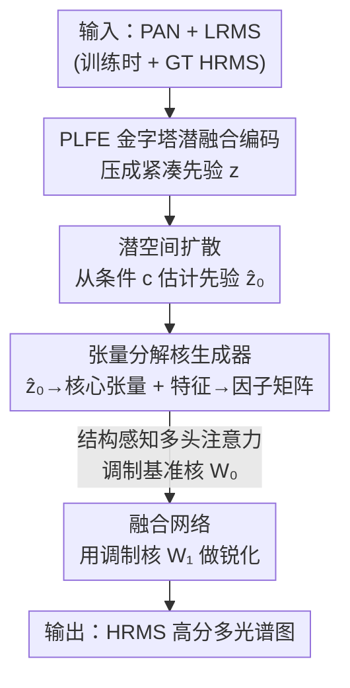

# Fast Kernel-Space Diffusion for Remote Sensing Pansharpening

**会议**: CVPR 2026  
**arXiv**: [2505.18991](https://arxiv.org/abs/2505.18991)  
**代码**: 无（论文未公开）  
**领域**: 遥感图像融合 / 扩散模型 / 全色锐化（Pansharpening）  
**关键词**: 核空间扩散、全色锐化、潜空间扩散、张量分解卷积核、快速推理

## 一句话总结
KSDiff 把扩散过程从「逐像素重建图像」搬到「潜空间生成一个全局先验向量」，再用这个先验去调制回归式全色锐化网络的卷积核，从而既拿到扩散模型的全局分布建模能力，又保住传统 CNN 的推理速度——在 WV3/GF2/QB 三个数据集上指标全面领先，推理只要 0.077 s，比像素空间扩散基线快 500 倍以上。

## 研究背景与动机
**领域现状**：全色锐化（pansharpening）要把高分辨率全色图 PAN 和低分辨率多光谱图 LRMS 融合成既有空间细节又有光谱信息的高分辨率多光谱图 HRMS。主流深度学习方法（PanNet、FusionNet、LAGConv 等）把它当成一个从 PAN+LRMS 到 HRMS 的确定性非线性映射，一步前向出结果，速度快。

**现有痛点**：确定性 CNN 是逐样本回归，难以捕捉遥感数据分布里的「全局先验」（整片海洋/建筑场景的统计规律）。扩散模型擅长建模复杂条件分布、能拿到这种全局上下文，但要在像素空间从纯高斯噪声迭代去噪，遥感图像分辨率高、通道多（远超 RGB 三通道），采样要做几十上百次网络评估（NFE），推理极慢——表 1 里 PanDiff 单图要 261 s、PLRDiff 要 40 s，而 CNN 只要 0.04–0.4 s。

**核心矛盾**：全局分布建模能力（扩散）和推理效率（回归 CNN）之间存在 trade-off。更根本的一点是：全色锐化里大部分空间与光谱信息已经在输入里了，网络的任务是「精修」而非「从零重建」，所以让扩散从纯噪声重建整张高分图本身就既反直觉又浪费。

**本文目标**：要一个既能享受扩散的全局先验、又能保持 CNN 推理速度的全色锐化框架，并且能即插即用地嵌进现有回归网络。

**切入角度**：既然扩散贵在「重建整张大图」，那就别让它生成图像——让它在潜空间只生成一个紧凑的全局先验表示，把这个先验注入到 CNN 的卷积核里，让卷积核「带着全局上下文」去做融合。扩散只跑在低维潜空间，推理负担骤降。

**核心 idea**：用潜空间扩散生成「卷积核」而非「像素」——KSDiff（Kernel-Space Diffusion），把扩散输出的潜表示通过张量分解 + 结构感知多头注意力调制成卷积核，驱动一个普通回归 backbone 完成融合。

## 方法详解

### 整体框架
KSDiff 的核心是一个**核生成器（Kernel Generator）**：它吃两路输入——扩散模型在潜空间产出的全局先验 $\hat{\mathbf{z}}_0$，以及从 PAN/LRMS 特征提取的局部信息——把两者融合成一个调制权重，去乘一个标准基准卷积核 $\mathbf{W}_0$，得到带全局上下文的最终卷积核 $\mathbf{W}_1$，再塞进一个普通 U-Net 式全色锐化网络做融合。先验 $\mathbf{z}$ 由一个**金字塔潜融合编码器 PLFE** 压缩得到；扩散模型负责在推理时仅凭 PAN/LRMS 把这个先验「估计」出来。整套用**两阶段训练**串起来：先预训练编码器+核生成器+融合网络拿到真实先验 $\mathbf{z}_0$，再训练扩散模型学会从条件 $\mathbf{c}$ 生成 $\mathbf{z}_0$。

### 关键设计

**1. 核空间扩散：让扩散生成卷积核而不是像素**

针对「像素空间扩散太慢、又在做无谓的从零重建」这个痛点，KSDiff 把扩散彻底搬离图像空间。它不预测 HRMS，而是预测一个低维潜先验 $\mathbf{z}\in\mathbb{R}^{N\times C_z}$（$N\ll HW$），这个先验再去调制卷积核：最终核为 $\mathbf{W}_1=\mathbf{W}_0\odot\mathbf{W}$，其中 $\mathbf{W}_0$ 是可学习的标准基准核，$\mathbf{W}$ 是由先验导出的调制权重，$\odot$ 是逐元素乘。这样扩散的迭代采样只发生在很小的潜空间，网络主体仍是一次前向的回归 CNN——既拿到了扩散对遥感数据全局分布的建模能力，又把推理压回 CNN 量级。表 1 里它 0.077 s 出图，而像素空间的 PanDiff 要 261 s、PLRDiff 要 40 s，差出三个数量级，指标却反而更好

**2. PLFE 金字塔潜融合编码器：把 PAN/LRMS/HRMS 多模态先验压成紧凑表示而不互相污染**

先验 $\mathbf{z}$ 怎么来很关键——直接把 PAN、LRMS、GT 拼起来送进编码器会造成空间与光谱信息的纠缠。PLFE 用两条原则解决：一是多尺度金字塔结构，PAN/LRMS 分支特征在每一层都被 HRMS 特征「引导精修」，把高分空间线索和光谱语义逐级整合；二是**动态融合门**，自适应权衡「原始分支特征」和「HRMS 引导特征」的比重。引导用的是线性复杂度的交叉注意力（把内存复杂度从 $\mathcal{O}((HW)^2)$ 降到 $\mathcal{O}(d^2)$，$d\ll HW$，应对大图），融合门则按通道算一个 Sigmoid 权重：

$$\mathbf{G}_{\text{gate}}=\sigma(\mathrm{Conv}_g[\mathbf{X},\mathrm{Proj}(\mathbf{Y})]),\quad \mathbf{F}=\mathbf{G}_{\text{gate}}\odot\mathbf{X}+(1-\mathbf{G}_{\text{gate}})\odot\mathrm{Proj}(\mathbf{Y})+\mathbf{O}$$

其中 $\mathbf{X}$ 是分支原始特征、$\mathbf{Y}$ 是 HRMS 引导特征、$\mathbf{O}$ 是交叉注意力输出。门控让网络在 HRMS 先验可靠处多信它、在引导可能错位处保留原始特征，从而保住空间-光谱一致性、减少伪影。经过 $M$ 级金字塔后投影成紧凑先验 $\mathbf{z}$。注意训练/推理用两个 PLFE：$\mathrm{PLFE}_1$ 吃 PAN+LRMS+GT（提供真实先验），$\mathrm{PLFE}_2$ 只吃 PAN+LRMS（推理时作为扩散条件，结构是 $\mathrm{PLFE}_1$ 的减半版）

**3. 张量分解核生成器 + 结构感知多头注意力：高效、可控地把先验注入卷积核**

把潜码直接 flatten 过 MLP 再 reshape 成卷积核，参数量爆炸（$\mathcal{O}(C_{\text{in}}C_{\text{out}}k^2 C_z)$）且无法分层控制先验对不同卷积核的影响。KSDiff 改用 Tucker 张量分解把调制权重 $\mathbf{W}$ 拆开：

$$\mathbf{W}=\mathcal{G}\times_1\mathbf{U}^{(1)}\times_2\mathbf{U}^{(2)}\times_3\mathbf{U}^{(3)}\times_4\mathbf{U}^{(4)}$$

其中 $\mathcal{G}\in\mathbb{R}^{r_1\times r_2\times r_3\times r_4}$ 是紧凑核心张量、$\mathbf{U}^{(n)}$ 是四个因子矩阵、$\times_n$ 是 mode-$n$ 乘积。分工很巧：**核心张量** $\mathcal{G}$ 来自全局先验——对 $\mathbf{z}$ 做均值池化得质心向量再过 MLP；**因子矩阵**来自局部输入特征，经一个轻量共享 backbone 接四个注意力头，作者称之为「结构感知多头注意力」。于是「全局先验决定核的主体结构、局部特征决定四个维度的展开方式」。复杂度从 MLP 的 $\mathcal{O}(C_{\text{in}}C_{\text{out}}k^2 C_z)$ 降到 $\mathcal{O}(C_z r_1 r_2 r_3 r_4+\sum_n r_n d_n)$（$r_n\ll d_n$），消融里把它换成等容量 MLP 会让参数翻十倍且**直接不收敛**，证明张量结构不是可有可无的省参技巧而是收敛的前提

### 损失函数 / 训练策略
**两阶段**串行。**预训练阶段**：联合优化 $\mathrm{PLFE}_1$、核生成器和融合网络，让编码器学会构造有信息量的先验，目标是 $L_1$ 重建损失 $\mathcal{L}_{\text{s1}}=\|\mathbf{G}-\mathbf{H}_1\|_1$（$\mathbf{G}$ 是 GT HRMS，$\mathbf{H}_1$ 是重建输出）。**扩散训练阶段**：用 DDPM 前向加噪、DDIM 加速采样，扩散网络学会从条件 $\mathbf{c}$（$\mathrm{PLFE}_2$ 编码的 PAN+LRMS）估计先验。这里把标准 $\boldsymbol{\epsilon}$-prediction 改成直接预测原始样本 $\mathbf{z}_0$（数学等价但实测在该任务更稳），并且**联合训练**扩散与回归器：

$$\mathcal{L}_{\text{s2}}=\mathbb{E}_{t,\mathbf{z}_0,\mathbf{c}}[\|\mathbf{z}_0-\mathbf{z}_\theta(\mathbf{z}_t,t,\mathbf{c})\|_1]+\lambda\|\mathbf{G}-\mathbf{H}_2\|_1$$

权重 $\lambda$ 经验设为 1。消融显示联合训练显著优于「先单独训扩散再接预训练回归网络」的分离方案。推理时只用 $\mathrm{PLFE}_2$ + 反向扩散 + 核生成器 + 融合网络，GT 完全不参与。

## 实验关键数据

数据集按 Wald 协议构建，取自 WorldView-3 (WV3)、GaoFen-2 (GF2)、QuickBird (QB)。降分辨率用 SAM/ERGAS/Q2n/SCC，全分辨率用 HQNR/$D_\lambda$/$D_s$。单卡 RTX 4090，AdamW。

### 主实验

WV3 降分辨率 + 全分辨率 + 推理耗时（节选代表性方法）：

| 方法 | SAM ↓ | ERGAS ↓ | Q2n ↑ | SCC ↑ | HQNR ↑ | Runtime(s) |
|------|-------|---------|-------|-------|--------|-----------|
| FusionNet（DL） | 3.3252 | 2.4666 | 0.9044 | 0.9807 | 0.9406 | 0.065 |
| PanMamba（DL，次优 SAM） | 2.9132 | 2.1843 | 0.9204 | 0.9855 | 0.9304 | 0.405 |
| PanDiff（像素扩散） | 3.2968 | 2.4647 | 0.8935 | 0.9860 | 0.9203 | 261.410 |
| PLRDiff（像素扩散） | 4.3704 | 3.4408 | 0.8539 | 0.9215 | 0.7361 | 40.142 |
| **KSDiff (ours)** | **2.8102** | **2.0756** | **0.9221** | **0.9870** | **0.9468** | **0.077** |

GF2 / QB 降分辨率上 KSDiff 同样四项指标全部第一（GF2: SAM 0.6675 / ERGAS 0.5973 / Q2n 0.9855 / SCC 0.9900；QB: SAM 4.4747 / ERGAS 3.6289 / Q2n 0.9365 / SCC 0.9839）。耗时 0.077 s 与传统 DL 同级，比 PanDiff（261 s）快约 3400 倍、比 PLRDiff（40 s）快约 520 倍，作者据此声称「比扩散基线快 500× 以上」。

### 消融实验（WV3 降分辨率，表 4）

| 配置 | SAM ↓ | ERGAS ↓ | Q2n ↑ | SCC ↑ | Runtime(s) | 说明 |
|------|-------|---------|-------|-------|-----------|------|
| Baseline Network | 3.1428 | 2.2961 | 0.9070 | 0.9827 | 0.035 | 不用潜扩散先验 |
| w/o PLFE | 3.0071 | 2.2367 | 0.9119 | 0.9838 | 0.079 | PLFE 换成直接拼接编码器 |
| w/o Structure-Aware | — | — | — | — | — | 换等容量 MLP，**无法收敛** |
| Separate-Training | 2.9799 | 2.1775 | 0.9118 | 0.9854 | 0.077 | 扩散与回归分开训 |
| **KSDiff (full)** | **2.8102** | **2.0756** | **0.9221** | **0.9870** | 0.077 | 完整模型 |

### 关键发现
- **潜扩散先验贡献最大**：去掉先验退回 Baseline，SAM 从 2.8102 恶化到 3.1428（虽然耗时降到 0.035 s），说明扩散注入的全局上下文是性能主来源。
- **结构感知张量核生成器是收敛前提**：换成等容量 MLP 参数翻十倍且直接不收敛——张量分解不只是省参，更是让「全局先验调制核」这件事能学起来的关键。
- **联合训练 > 分离训练**：Separate-Training 全面落后 full 模型，验证扩散估计与图像重建端到端一起优化更好。
- **核心张量越小反而越好 + 4D 结构有用**（表 6）：在 FusionNet 上 $(4,4,2,2)$ 优于 $(8,8,\cdot)$、$(16,16,\cdot)$（类似 LoRA 的低秩现象）；但把后两维 kernel-size 从 1 提到 2 有提升，因为 $(r_1,r_2,1,1)$ 会塌缩成矩阵、丢掉 4D 张量结构。
- **即插即用涨点**（表 5）：把 DiCNN/FusionNet/LAGNet 的卷积换成 KSDiff 调制核都稳定提升，如 FusionNet 的 SAM 3.3252→3.0622、LAGNet 2.2999→2.1538（ERGAS）。

## 亮点与洞察
- **「让扩散生成核而非像素」是个可迁移的范式**：把昂贵生成模型放到低维参数/核空间、用它的输出去调制一个轻量主网络——这思路和 Neural Network Diffusion（用扩散生成网络权重）一脉相承，可推广到任何「主体信息已在输入、只需全局先验精修」的低层视觉任务（超分、去噪、去雾）。
- **用张量分解控制「先验影响力」很巧**：核心张量来自全局先验、因子矩阵来自局部特征，天然把「全局/局部」解耦进卷积核的不同自由度，比 MLP 暴力 reshape 既省参又可控，还顺手解决了收敛问题。
- **动态融合门是个稳健的小 trick**：在多模态引导里「按通道学一个门，可靠就信引导、不可靠就保原始」，能直接搬到任何跨模态特征融合场景减伪影。
- **最「啊哈」的点**：扩散模型迭代采样的开销被锁死在 $N\times C_z$ 的潜空间里，与输出图像分辨率脱钩——这是它能同时拿到「扩散质量 + CNN 速度」的根因。

## 局限与展望
- **依赖 GT HRMS 做先验监督**：$\mathrm{PLFE}_1$ 要吃 GT 才能学出目标先验，强依赖 Wald 协议的成对训练数据；真实卫星缺 GT 的全分辨率场景下先验质量能否保持未充分验证。
- **只在一个 U-Net backbone 上做主实验**：虽然表 5 证明能嵌入 DiCNN/FusionNet/LAGNet，但核生成器对哪些卷积层替换、替换多少层敏感性未展开。
- **扩散仍是多步采样**：用了 DDIM 加速，但相比一步回归仍多了采样开销（耗时从 Baseline 0.035 s 升到 0.077 s，约翻倍），核生成器本身也带额外参数与显存。
- **未开源**：方法含 PLFE、张量核生成器、两阶段训练等多个工程细节（网络结构、latent encoder 细节都在补充材料），无代码复现门槛较高。
- 改进方向：探索无 GT 的自监督先验、把更先进的少步采样/一致性模型接进来进一步压采样、以及把核空间扩散推广到其他遥感融合任务（如高光谱锐化）。

## 相关工作与启发
- **vs 像素空间扩散全色锐化（PanDiff / PLRDiff）**：它们在像素空间从纯噪声迭代重建 HRMS，质量好但慢到 40–261 s；KSDiff 把扩散搬到低维潜空间只生成先验、用回归 backbone 出图，速度快 500× 以上且指标更优——本质区别是「扩散重建图像」vs「扩散生成调制先验」。
- **vs 确定性 DL 方法（FusionNet / LAGConv / PanMamba）**：它们一步回归、快但缺全局分布建模；KSDiff 在保持同级速度（0.077 s）的前提下注入扩散先验，把这些 backbone 当插件增强（表 5 普遍涨点）。
- **vs 动态卷积核方法（LAGConv / AKD）**：那些方法的核条件于输入局部特征；KSDiff 的核额外条件于扩散生成的**全局先验**，并用张量分解控制注入方式，是「动态核」思路与「生成式全局先验」的结合。
- **vs 潜空间扩散（LDM / DiffIR）**：同样把扩散放进潜空间省算力，但 KSDiff 的潜表示不是用来解码图像，而是去调制卷积核，属于「扩散先验 → 参数空间」而非「扩散 → 图像空间」的用法。

## 评分
- 新颖性: ⭐⭐⭐⭐⭐ 「核空间扩散」把扩散从像素重建转为生成卷积核调制先验，角度新颖且自洽。
- 实验充分度: ⭐⭐⭐⭐ 三数据集 + 降/全分辨率 + 消融 + 多 backbone + 核张量尺寸分析较完整，但缺真实无 GT 场景与开源验证。
- 写作质量: ⭐⭐⭐⭐ 动机推导清晰、公式规范，部分模块细节下放补充材料。
- 价值: ⭐⭐⭐⭐⭐ 同时解决扩散全色锐化的速度与质量痛点，且可即插即用增强现有网络，实用性强。

<!-- RELATED:START -->

## 相关论文

- [\[CVPR 2026\] Remote Sensing Image Super-Resolution for Imbalanced Textures: A Texture-Aware Diffusion Framework](remote_sensing_image_super-resolution_for_imbalanced_textures_a_texture-aware_di.md)
- [\[CVPR 2026\] Cross-Scale Pansharpening via ScaleFormer and the PanScale Benchmark](cross-scale_pansharpening_via_scaleformer_and_the_panscale_benchmark.md)
- [\[CVPR 2026\] Spatial-Spectral Residuals Informed Diffusion Neural Operator for Pan-sharpening](spatial-spectral_residuals_informed_diffusion_neural_operator_for_pan-sharpening.md)
- [\[CVPR 2026\] Semantic-Adaptive Diffusion for Dynamic Spatiotemporal Fusion](semantic-adaptive_diffusion_for_dynamic_spatiotemporal_fusion.md)
- [\[CVPR 2026\] GeoDiT: A Diffusion-based Vision-Language Model for Geospatial Understanding](geodit_a_diffusion-based_vision-language_model_for_geospatial_understanding.md)

<!-- RELATED:END -->
