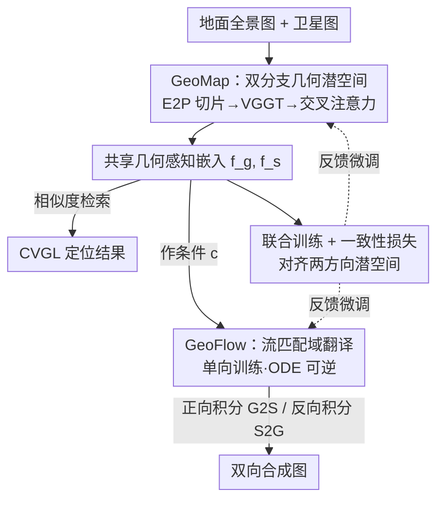

# Geo2: Geometry-Guided Cross-view Geo-Localization and Image Synthesis

**会议**: CVPR 2026  
**论文**: [CVF Open Access](https://openaccess.thecvf.com/content/CVPR2026/html/Zhang_Geo2_Geometry-Guided_Cross-view_Geo-Localization_and_Image_Synthesis_CVPR_2026_paper.html)  
**代码**: https://fobow.github.io/geo2.github.io/  
**领域**: 遥感 / 跨视角地理定位  
**关键词**: 跨视角地理定位, 跨视角图像合成, 几何基础模型, 流匹配, 共享几何潜空间  

## 一句话总结
Geo2 借用几何基础模型（VGGT）的 3D 先验，把地面全景图和卫星图嵌进一个**共享的几何感知潜空间**，让跨视角地理定位（CVGL）与双向跨视角图像合成（CVIS）在同一框架里互相增强，且只训单方向就能做双向生成，在 CVUSA/CVACT/VIGOR 上定位与合成双双刷到 SOTA。

## 研究背景与动机
**领域现状**：跨视角地理空间学习有两个核心任务——CVGL（拿一张地面街景图去卫星图库里检索它的地理位置）和 CVIS（地面↔卫星互相生成对应视角）。两者本质都依赖在地面视角和俯视视角之间建立**几何对应**，所以历史上大量工作都在往模型里塞几何线索：CVGL 这边有 GeoDTR 的几何布局提取器，CVIS 那边有高度估计、几何投影、体密度建模、BEV 估计等。

**现有痛点**：尽管两个任务都靠几何，但绝大多数工作（见原文 Table 1）把它们**当成两个独立问题分开做**，用的几何模块还都是为单一任务定制的（自定义模块或预定义几何变换如极坐标变换），泛化性差。后果是 CVGL 和双向 CVIS 几乎无法在一个框架里互相受益——比如 BEV 估计能帮 ground→satellite 合成，却很难反过来用到 satellite→ground。

**核心矛盾**：缺一个**足够通用、且对两个任务、两个方向都成立**的几何先验。而且 CVIS 主流方法（GAN / 扩散 + 极坐标变换假设）本身**不可逆**，训了一个方向就做不了另一个方向，要双向得分别训两套（如 GCCDiff）。

**切入角度**：近期几何基础模型（GFM，如 DUSt3R / MASt3R / VGGT）能从多视甚至单视图像里预测出可泛化的 3D 几何属性（深度、点图、相机位姿），这正是「通用几何先验」的天然来源。但作者发现（原文 Figure 1）**直接**把地面+卫星图喂进 VGGT 会因视角差太大而重建错乱，地面全景图的球面畸变也会拖垮特征质量——GFM 不能拿来即用。

**核心 idea**：用 VGGT 的几何先验构造一个**地面与卫星共享的几何感知潜空间**：这个空间既缩小了跨视角差异让定位更准，又天然桥接了双向合成；再用一个**可逆的流匹配**模型做生成，单向训练即可双向推理；最后联合训练让定位与合成共享同一潜空间、互相强化。

## 方法详解

### 整体框架
Geo2 是一个统一框架，输入是成对的地面图 $I^g$ 和卫星图 $I^s$，输出既包括 CVGL 的检索结果（地面 query 匹配到的卫星图），也包括双向 CVIS 的合成图（G2S / S2G）。整条流水线分三步：先用 **GeoMap** 把两个视角各自编码进共享几何潜空间得到嵌入 $f^g, f^s$；这对嵌入直接用相似度做 CVGL 检索，同时又作为条件喂给 **GeoFlow**——一个以几何感知潜向量为条件的流匹配模型，借助 ODE 的可逆性，**只训 ground→satellite（G2S）方向就能反向做 satellite→ground（S2G）**；最后用**联合训练**把 GeoMap 和 GeoFlow 放在一起微调，加一致性损失把两个方向的潜空间拉齐，让定位和生成互相受益。

关键的设计哲学是：把 CVIS 从传统的「条件生成」重新表述成「域翻译（domain translation）」问题，从而用流匹配的可逆性一举拿下双向合成。

### 关键设计

**1. GeoMap：双分支把地面/卫星嵌进共享几何感知潜空间**

针对「直接喂 VGGT 会重建错乱、地面全景畸变拖垮特征」这个痛点，GeoMap 用**两个独立分支**分别处理地面和卫星，而不是把它俩塞进同一次多视推理。卫星图本身就是单视角透视图，直接 $t^s = \text{VGGT}(I^s)$ 得到几何特征；地面图是球面等角全景，畸变严重，作者先做**等角转透视（E2P, equiangular-to-perspective）变换**把全景切成 $V$ 个透视裁片 $\{I_{P_i}\}_{i=1}^{V} = \text{E2P}(I^g)$，这些裁片密集覆盖水平视场，再以多视方式送进 VGGT 得到 $t^g \in \mathbb{R}^{V\times C\times H_1\times W_1}$——这一步本质上是把全景「翻译」成 VGGT 训练时熟悉的透视图分布，让几何特征质量恢复（原文 Figure 3 显示这样重建出的地面/卫星几何能对齐到同样的建筑与布局）。

拿到几何特征后还要压成检索用的低维嵌入。作者先用卷积把 VGGT 特征降到目标维度 $D$（$t^{s\prime}=\text{Conv}(t^s)$），同时用一个预训练 CNN 从原图抽语义 token $q^s, q^g$；然后把语义 token 当 query，对几何特征做**交叉注意力**聚合信息，卫星分支为 $\text{out}^s = \text{Attn}(q^s, t^{s\prime}, t^{s\prime})$，再平均池化+归一化得到最终嵌入 $f^s$（$f^g$ 同理）。这样 $f^g, f^s$ 就**同时编码了几何与语义**、并落在同一个几何感知潜空间里，CVGL 直接对它们算相似度检索，用 InfoNCE 损失优化。共享空间正是后面 CVIS 能复用几何一致性的根。

**2. GeoFlow：流匹配把 CVIS 变成可逆域翻译，单向训练→双向合成**

针对「现有 CVIS 基于 GAN/扩散+极坐标假设、本质不可逆、双向要训两套」的痛点，GeoFlow 改用**流匹配（flow matching）**把地面域和卫星域之间的变换显式建模成一条概率路径。它先用预训练 RAE 把图像编码进潜空间 $x^g, x^s$，再用最优传输位移插值定义路径 $x_t = (1-t)\,x^g + t\,x^s,\; t\in[0,1]$，训练网络 $G_\theta$ 去预测向量场 $v = x^s - x^g$，损失为

$$\mathcal{L}_{IG} = \lVert G_\theta(x_t, t, c) - v \rVert^2,$$

其中条件 $c$ 正是 GeoMap 输出的几何感知嵌入。骨干用轻量 DiT + DDT head。

真正巧妙的是双向性：训好的 $G_\theta$ 定义了一个 ODE，G2S 合成是正向积分 $x^s = x^g + \int_0^1 G_\theta(x_t,t,c)\,dt$；只要**把积分方向反过来**就得到 S2G，$x^g = x^s - \int_0^1 G_\theta(x_t,t,c)\,dt$。也就是说模型从没在 satellite→ground 方向训过，却能靠 ODE 可逆性直接做反向生成。相比 GCCDiff 要为两个方向分别训练，Geo2 只需单向训练就拿到双向能力，灵活性和数据效率都更高。

**3. 联合训练 + 一致性损失：让定位与合成共享同一潜空间互相增强**

由于 GeoMap 和 GeoFlow 都吃同一套共享嵌入 $f^g, f^s$，作者用三阶段联合训练把两个任务拧成一股绳（原文 Algorithm 1）：先冻结 CNN 和 VGGT 骨干、用 $\mathcal{L}_{GL}$（InfoNCE）单训 GeoMap $T_1$ 轮把共享潜空间建起来；再训 GeoFlow $T_2$ 轮；最后拿训好的两者**联合微调** $T_3-T_2$ 轮，并加一个一致性损失

$$\mathcal{L}_{KL} = \text{KL}(f^g \,\Vert\, f^s) + \text{KL}(f^s \,\Vert\, f^g),$$

把地面和卫星嵌入的分布更显式地对齐。InfoNCE 损失本身为

$$\mathcal{L}_{GL} = -\log\frac{\exp(f^g\cdot f^s_{+}/\tau)}{\sum_{i=1}^{N}\exp(f^g\cdot f^s_i/\tau)},$$

$\tau$ 控制分布软硬。一致性损失的作用是：合成任务要求两个方向潜表示一致，这个约束反过来也让检索更鲁棒——作者实测 $\mathcal{L}_{KL}$ 同时提升了检索精度和双向生成质量，这正是「定位与合成互相受益」的具体落点。

### 损失函数 / 训练策略
整体目标 = 任务专属损失 + 联合阶段一致性损失：CVGL 用 InfoNCE $\mathcal{L}_{GL}$，CVIS 用 $L_2$ 重建/流匹配损失 $\mathcal{L}_{IG}$，联合阶段额外加 $\mathcal{L}_{KL}$，总更新形如 $\mathcal{L}_{GL} + \beta\mathcal{L}_{KL}$。训练分三段（先 GeoMap、再 GeoFlow、最后联合微调），第一段冻结 CNN+VGGT 骨干只调 GeoMap。

## 实验关键数据

### 主实验：跨视角地理定位（CVGL）
在 CVUSA / CVACT / VIGOR 三个标准基准上对比 SOTA（R@1，%）。CVUSA 已近饱和但仍小幅领先，越难的基准优势越明显：

| 数据集 / 设置 | 指标 | Geo2 | 之前最好 | 提升 |
|--------|------|------|----------|------|
| CVUSA | R@1 | 98.83 | 98.71 (PanoBEV) | +0.12 |
| CVACT Val | R@1 | 94.36 | 91.90 (PanoBEV) | +2.46 |
| CVACT Test | R@1 | 75.08 | 73.68 (PanoBEV) | +1.40 |
| VIGOR Same-Area | R@1 | 81.59 | 82.18 (PanoBEV) | −0.59（次优，但 Hit Rate 90.35 最高）|
| VIGOR Cross-Area | R@1 | 66.71 | 72.19 (PanoBEV) | 较 Sample4Geo 的 61.70 提升 +5.01 |

> ⚠️ VIGOR 上 R@1 略低于 PanoBEV，但作者强调的是相对 well-established 的 Sample4Geo 基线提升显著（Same-Area +3.73、Cross-Area +5.01），Hit Rate 取得最佳。

### 跨数据集泛化 + 双向合成（CVIS）
跨数据集（训一个测另一个）最能体现几何先验带来的泛化；合成同时报 G2S：

| 任务 / 设置 | 指标 | Geo2 | 对比基线 |
|------|---------|------|------|
| CVACT→CVUSA | R@1 | 55.14 | Sample4Geo 44.95（+10.19） |
| CVUSA→CVACT | R@1 | 63.17 | PanoBEV 67.79（次优，仍 comparable） |
| CVACT G2S 合成 | FID↓ | 31.72 | Skydiffusion 36.48 |
| VIGOR G2S 合成 | FID↓ | 30.09 | ControlNet 53.27 |
| CVACT S2G 合成 | FID↓ | 27.77 | CrossViewDiff 41.94 |

### 关键发现
- **几何先验对「难」场景增益最大**：CVUSA 饱和处只 +0.12，但 CVACT Test、VIGOR Cross-Area、跨数据集这些视觉外观剧烈变化的设置上提升达 +1.4~+10.2，印证 3D 几何先验让特征表示在分布漂移下更鲁棒。
- **一致性损失双赢**：作者实测 $\mathcal{L}_{KL}$ 同时改善检索精度与双向生成质量，是「定位↔合成互相受益」的直接证据（消融细节在补充材料）。⚠️ 正文未给独立消融表，定量拆解以补充材料为准。
- **双向不对称**：S2G（卫星→地面）整体不如 G2S，但仍在 CVACT/CVUSA 拿到最佳 FID，其余指标与基线相当——说明可逆 ODE 的反向生成可用但更难（地面细节信息量更大）。

## 亮点与洞察
- **把 GFM 几何先验「翻译」进可用分布**：直接喂 VGGT 会崩，E2P 切片把全景转成 VGGT 熟悉的透视图，这个「先对齐到基础模型的训练分布、再取特征」的思路对任何想白嫖基础模型先验的跨域任务都通用。
- **流匹配的可逆性 = 免费双向**：把 CVIS 重述为域翻译后，单向训练的 ODE 反向积分天然给出反方向合成，省掉了一整套对称训练，这是本文最「啊哈」的点。
- **一个共享潜空间同时服务检索与生成**：定位需要判别性、生成需要可重建性，本文用同一套几何感知嵌入兼顾两者并让它们互相正则，是「统一表示」可迁移到其他「检索+生成」配对任务的范式。

## 局限与展望
- **依赖 VGGT 与 E2P 质量**：几何特征好坏取决于基础模型和等角转透视变换；极端畸变或 VGGT 失效场景下共享空间可能退化（作者用 Figure 1 自证直接用会崩）。
- **S2G 弱于 G2S**：反向合成在 LPIPS/PSNR 等指标上并非全面最优，可逆性带来的便利伴随反向质量折损。
- ⚠️ **正文缺独立消融表**：E2P 裁片数 $V$、各损失项、三阶段训练的贡献拆解都放在补充材料，仅从正文难以判断每个组件的边际收益。
- **改进方向**：可探索更强/更轻的 GFM、为 S2G 单独加生成先验、或把一致性损失换成更显式的几何约束。

## 相关工作与启发
- **vs GeoDTR / GeoDTR+**：它们用自定义几何布局提取器做 CVGL，几何线索任务专属、不可跨任务复用；Geo2 用通用 GFM 先验同时服务定位与双向合成。
- **vs Sample4Geo / PanoBEV**：纯 CVGL 检索方法，在饱和基准上很强但跨域泛化弱；Geo2 在 CVACT→CVUSA 上比 Sample4Geo 高 10.19% R@1，几何先验带来更强分布外鲁棒性。
- **vs GCCDiff**：同样做双向 CVIS，但需为 G2A 和 A2G **分别训练**；Geo2 靠流匹配 ODE 可逆性单向训练即双向，数据/训练效率更高。
- **vs CDE / RGCIS**：也尝试结合 CVGL 与 CVIS，但 CDE 只做单向 A2G、RGCIS 用冻结 CVGL 模型单向指引生成、无互相优化；Geo2 在共享 3D 感知空间里**联合优化**定位与双向合成，形成耦合框架。

## 评分
- 新颖性: ⭐⭐⭐⭐⭐ 首个把 GFM 几何先验用于跨视角地理空间学习、并用流匹配可逆性统一双向合成与定位
- 实验充分度: ⭐⭐⭐⭐ 三基准+跨数据集+双向合成覆盖全面，但正文缺独立消融表，组件拆解依赖补充材料
- 写作质量: ⭐⭐⭐⭐ 框架与动机清晰、图示到位，公式推导（ODE 可逆）讲得明白
- 价值: ⭐⭐⭐⭐⭐ 统一定位+双向生成、单向训练双向用，为跨视角遥感任务提供可复用的范式

<!-- RELATED:START -->

## 相关论文

- [\[CVPR 2026\] PAUL: Uncertainty-Guided Partition and Augmentation for Robust Cross-View Geo-Localization under Noisy Correspondence](paul_uncertainty-guided_partition_and_augmentation_for_robust_cross-view_geo-loc.md)
- [\[CVPR 2026\] SinGeo: Unlock Single Model's Potential for Robust Cross-View Geo-Localization](singeo_unlock_single_models_potential_for_robust_cross-view_geo-localization.md)
- [\[CVPR 2026\] UniGeoRS: A Unified Benchmark for Tri-view Geo-Localization](unigeors_a_unified_benchmark_for_tri-view_geo-localization.md)
- [\[CVPR 2026\] MOGeo: Beyond One-to-One Cross-View Object Geo-localization](mogeo_beyond_one-to-one_cross-view_object_geo-localization.md)
- [\[CVPR 2026\] RHO: Robust Holistic OSM-Based Metric Cross-View Geo-Localization](rho_robust_holistic_osm-based_metric_cross-view_geo-localization.md)

<!-- RELATED:END -->
