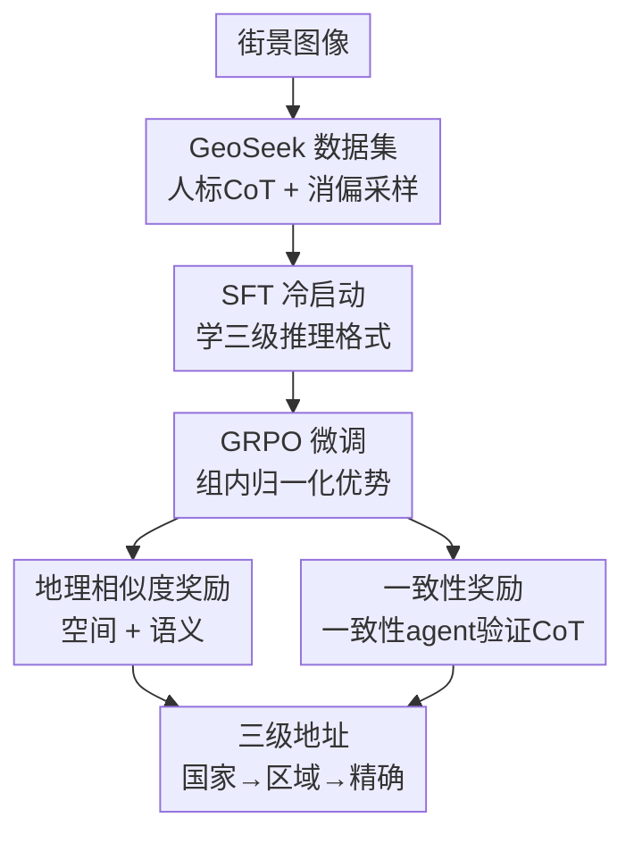

# GeoAgent: Learning to Geolocate Everywhere with Reinforced Geographic Characteristics

**会议**: CVPR 2026  
**论文**: [CVF Open Access](https://openaccess.thecvf.com/content/CVPR2026/html/Jin_GeoAgent_Learning_to_Geolocate_Everywhere_with_Reinforced_Geographic_Characteristics_CVPR_2026_paper.html)  
**代码**: 有（论文称 Code and data are available，未给出具体 URL ⚠️ 以原文为准）  
**领域**: 多模态VLM / 图像地理定位 / 强化学习  
**关键词**: 图像地理定位, 视觉大模型, GRPO, 地理相似度奖励, 思维链一致性

## 一句话总结
GeoAgent 把图像地理定位做成"像人一样逐级推理到精确地址"的任务：先用地理专家和职业玩家标注的 CoT 数据集 GeoSeek 冷启动一个 VLLM，再用两个为地理任务量身定制的 RL 奖励（衡量"答对没"的地理相似度奖励 + 衡量"推理过程站不站得住"的一致性奖励）做 GRPO 微调，在多个粒度上超过现有方法和一众通用 VLLM。

## 研究背景与动机
**领域现状**：图像地理定位（仅凭画面内容推断拍摄地）早期被当成分类（把地球切成网格分类）或检索（拿图去数据库里匹配）问题。近年随着 VLLM 兴起，主流转向让 VLLM 输出地点 + 推理过程，再用基于 GRPO 的强化学习提升性能和可解释性。

**现有痛点**：这条 RL 路线有两个和"地理任务本性"冲突的硬伤。其一，训练 CoT 几乎都是 **AI 自动生成**的——这些链条未必符合人类真实推理，反而会放大基模型本身的偏见，已有研究指出 RL VLLM 经常学到的是"表面格式"而非真推理。其二，传统数据集只给 GPS 坐标或粗到城市级的标注，且用均匀/按面积采样，忽略了街景图像分布其实和人口、路网里程强相关，导致区域偏差严重。

**核心矛盾**：奖励设计与地理任务不匹配。现有方法的奖励大多是**直接判等**（预测文本和 GT 文本完全相等才给分），但自然语言到地理位置是**非唯一映射**——"Notre-Dame de Paris""Parvis Notre-Dame""4 Place Jean-Paul-II"指向同一个地方却字面不同。直接判等会把模型"努力逼近正确答案"的过程一笔抹掉，给出与真实定位能力严重不一致的奖励信号。

**本文目标**：(1) 造一个有人类标注 CoT、细粒度地址、消偏采样的数据集；(2) 设计契合地理特性的奖励，让模型在空间和语义上都向正确答案收敛，同时保证 CoT 的完整性和一致性。

**切入角度**：从"地理特性"反推训练信号——位置之间有连续的空间距离、地名之间有语义相似度、人类推理是从国家→区域→精确地点逐级收窄的。把这三点分别编码成奖励。

**核心 idea**：用**地理相似度奖励**（空间 + 语义）替代直接判等来评判答案对错，再加一个由独立 **一致性 agent** 评估的**一致性奖励**来约束推理过程，在人工标注的 GeoSeek 上做 SFT + GRPO 两阶段训练。

## 方法详解

### 整体框架
GeoAgent 的输入是一张街景/场景图，输出是带逐级推理过程的三级地址（国家 → 区域 → 精确地点）。整条管线分三步：**Step I 构建 GeoSeek 数据集**（人标 CoT 子集 GeoSeek-CoT + RL 用的 GeoSeek-Loc + 评测基准 GeoSeek-Val）；**Step II SFT 冷启动**，用 GeoSeek-CoT 在 Qwen2.5-VL-7B 上 LoRA 微调 2 个 epoch，得到 GeoAgent-SFT，先让模型学会"按国家/区域/精确三级、给线索+推理+结论"的格式；**Step III GRPO 微调**，在 GeoSeek-Loc 上跑 1 个 epoch 的强化学习，奖励由三部分组成——空间相似度、语义相似度（合称地理相似度奖励）和由一致性 agent 算出的一致性奖励。

整个推理被组织成人类玩家式的三段："Country Identification → Regional Guess → Precise Localization"，每段都输出 `Clues / Reasoning / Conclusion`，最后汇总成 Final Answer。

### 关键设计

**1. GeoSeek 数据集：用人类标注的 CoT 和消偏采样替掉 AI 生成数据**

针对"AI 生成 CoT 放大偏见 + 标注粗 + 采样偏"的痛点，作者联合大量地理专家和职业 GeoGuessr/TuXun 玩家，按国家、城市、精确地点三级粒度标注推理过程，再用 GPT-4o 做语言规范化和结构化，得到 10k 条人标 CoT（GeoSeek-CoT），用于 SFT 冷启动。RL 微调用的 GeoSeek-Loc 则用**多级分层采样**消除地理偏差：先按人口、土地面积、公路里程给每个国家算采样权重，再把每个国家切成等大网格、给每个网格分配一个**与其人口对数成比例**的采样权重以抑制过度集中，最终得到 2 万张全球分布的高分辨率街景。评测基准 GeoSeek-Val 从 OSV5M 抽 3k 样本，每个样本用 GPT-4o 自动打一个 0–10 的 **locatability（可定位难度）分**，并按人造物/自然景观等地理要素分类，便于按难度和场景分桶评测。

**2. 地理相似度奖励：把"答对没"从字面判等换成空间+语义双重度量**

这是全文核心，直接解决"自然语言↔地理位置非唯一映射"的痛点。空间相似度先用 OpenCage 逆地理编码把模型预测的地址转成经纬度 $(\hat\lambda,\hat\phi)$，再用 Haversine 公式算它与 GT $(\lambda,\phi)$ 的球面距离：

$$D = 2r\arcsin\sqrt{\sin^2\tfrac{\Delta\phi}{2} + \cos\hat\phi\cos\phi\sin^2\tfrac{\Delta\lambda}{2}}$$

其中 $r=6371\text{km}$。空间奖励对距离取指数衰减 $R_{spa}=\exp(-D/\tau)$，$\tau$ 控制锐度。注意它在距离变小时增长**变慢**，相当于鼓励模型先框定一个大范围再逐步收窄——这恰好对应人类"先国家后街区"的思路。语义相似度则用多语言语义编码器把地址的每一级 $i$ 编码成 $h^{pred}_i,h^{gt}_i$，算余弦相似度 $s_i$，先用阈值 $\delta$ 过滤低质量结果得到 $\hat s_i$，再按层级加权求和：

$$R_{sem}=\sum_{i=1}^{3}\alpha_i\hat s_i,\quad \sum_i\alpha_i=1$$

并施加**层级约束**：只有当高层级（国家/区域）预测不是完全错的时候，低层级地址才给奖励。语义奖励专治别名、缩写、翻译变体——比如"Hefei"和"Hefei City"字面不同但语义几乎一致仍能拿分。作者还用散点图论证：直接判等奖励与空间相似度严重不一致（说明它不可靠），而语义相似度与空间相似度高度一致（说明它有效）。

**3. 一致性奖励：用一个"不知道答案的" agent 反推 CoT，逼模型把推理写扎实**

地理相似度只刻画"图像→位置"的关系，但没约束"图像→线索→逐级分析→位置"这条链是否自洽。作者引入一个**一致性 agent**（用 GPTQ-INT4 量化的 Qwen3-32B），它**只拿到 GeoAgent 输出的推理过程、拿不到结论**，尝试仅凭推理反推出每一级结论，反推对了才给分：

$$R_{con}=\sum_i \mathbf{1}[\hat y_i = y_i]\cdot w_i\cdot p_i,\quad \sum_i w_i = 1$$

$w_i$ 是国家/区域/精确三级粒度的重要性权重。关键是惩罚项 $p_i$——它防止模型走捷径只输出结论、不写推理来骗过一致性 agent。$p_i$ 与该级推理文本长度 $\ell_i$ 正相关，做了归一化 $\hat\ell$ 后过 sigmoid：

$$p_i=\frac{1}{1+\exp(-\lambda(\hat\ell-\mu))},\quad \hat\ell=\frac{\ell_i-\min(\ell)}{\max(\ell)-\min(\ell)}$$

训练曲线显示一致性奖励**最先收敛**，先帮模型搭起完整一致的推理框架；在它收敛前空间/语义奖励都偏低，收敛后两者反超不加一致性奖励的版本——说明把推理写自洽反过来提升了定位能力。

最终总奖励对三者加权（GRPO 用组内归一化优势 $A_i=(R_i-\text{mean})/\text{std}$ 配 PPO 式裁剪目标更新策略）：

$$R = a_1 R_{spa} + a_2 R_{sem} + a_3 R_{con}$$

权重分别取 $a_1=1.5,\ a_2=1.0,\ a_3=0.5$。

### 损失函数 / 训练策略
基模型 Qwen2.5-VL-7B，LoRA（rank=64, alpha=128，仅 1.91% 参数）。Step II 用 GeoSeek-CoT 做 2 epoch 的 SFT 冷启动；Step III 用 GeoSeek-Loc 做 1 epoch 的 GRPO。语义相似度阈值 $\delta$、空间温度 $\tau$、惩罚曲线参数 $\lambda,\mu$ 等见原文（部分超参在正文未完整给出 ⚠️ 以原文为准）。一致性 agent 为 GPTQ-INT4 量化的 Qwen3-32B。

## 实验关键数据

### 主实验
零样本评测，IM2GPS3K 报 City(25km)/Region(200km)/Country(750km)/Continent(2500km) 命中率，GeoSeek-Val 额外报 GeoScore（$0\text{–}5000$，越高越易定位）。

| 数据集 / 指标 | 本文 GeoAgent | 此前最好 | 说明 |
|--------------|--------------|----------|------|
| IM2GPS3K Country (750km) | **76.21** | 72.40 (G3) | 仅 LoRA 反超一众全量微调 |
| IM2GPS3K Continent (2500km) | **89.90** | 85.67 (GRE-Suite) | 宏观尺度提升最明显 |
| IM2GPS3K Region (200km) | **58.57** | 56.19 (GLOBE) | — |
| GeoSeek-Val Country | **60.37** | 56.13 (GeoCLIP) | 街景定位基准 |
| GeoSeek-Val GeoScore | **3314.1** | 3172.3 (GeoCLIP) | 0–5000 量纲 |

宏观（国家/洲）提升比微观（城市）更大，作者解释：空间奖励随距离减小而增长放缓，促使模型先定粗粒度——而在 GeoGuessr 类竞赛里国家级精度已足以击败顶尖玩家。

### 消融实验
GeoSeek-Val 上逐组件消融（指标为 City/Region/Country 命中率）：

| 配置 | City | Region | Country | 说明 |
|------|------|--------|---------|------|
| Qwen2.5-VL-7B（基模型） | 1.39 | 3.36 | 11.13 | 零基础 |
| GeoAgent-SFT（只冷启动） | 10.36 | 23.84 | 47.12 | SFT 即大幅提升 |
| w/o Spa & Sem（只留一致性） | 9.08 | 20.03 | 40.43 | 去掉地理相似度反而掉到 SFT 以下 |
| w/o Con（无一致性奖励） | 14.69 | 31.39 | 60.20 | 已很强但推理欠自洽 |
| w/o SFT（无冷启动直接 RL） | 13.39 | 23.94 | 58.23 | 缺冷启动 Region 明显偏弱 |
| **GeoAgent（完整）** | **15.69** | **33.39** | **60.37** | 全开最好 |

另有一组对照证明地理相似度 > 直接判等：把奖励换成 directly-judge 后（GeoAgent-SFT+Judge），Country 只到 50.81，远低于完整模型的 60.37。

### 关键发现
- **地理相似度（空间+语义）是性能主力**：去掉 Spa & Sem 后掉到 40.43，比纯 SFT（47.12）还低，说明缺了它一致性奖励单独撑不起定位。
- **一致性奖励贡献"先打底后增益"**：w/o Con 是 60.20，完整 60.37——绝对涨幅看着不大，但训练曲线显示它最先收敛、为后续空间/语义奖励反超奠定基础，且显著改善 CoT 自洽性（见 Fig. 3 的前后对比）。
- **数据质量被验证**：GeoAgent 仅用 10K 人标 SFT 数据就超过用 20K/133K/5M 数据 SFT 的 GeoReasoner、GaGA、GRE-Suite-SFT，凸显专家+玩家标注的高质量。
- **越易定位优势越大**：在 locatability 高的分桶上 GeoAgent 领先更多，作者认为这说明其推理模式更接近人类。

## 亮点与洞察
- **把"地理特性"翻译成奖励**是最漂亮的一招：位置→连续距离（空间奖励指数衰减还模拟了人类先粗后细），地名→语义相似度（解决别名/缩写/翻译），推理→可被独立 agent 反推（一致性奖励）。三个奖励各打一个痛点，互不重叠。
- **一致性 agent 只看推理不看结论 + 长度惩罚**这个设计很巧：它把"CoT 是否真支撑结论"变成可验证奖励，又用 $p_i$ 堵死"只写结论骗过 agent"的捷径，避免 RL VLLM 学表面格式的通病。这套"用第二个模型反推一致性"的思路可迁移到任何需要保证推理链可信的 RL 任务（数学、医疗诊断等）。
- **空间奖励的非线性形状**自带课程学习味道——远处梯度大、近处梯度小，天然鼓励先框大范围，和人类玩家"先认国家"的策略对齐。

## 局限与展望
- 一致性 agent 依赖一个 32B 量化模型在线评判，训练成本和奖励噪声都不小；其判断本身的可靠性未做充分量化（⚠️ 推测，原文未详述）。
- 语义相似度依赖多语言编码器和阈值 $\delta$、空间奖励依赖 OpenCage 逆地理编码，三者都是外部组件，编码器盲区或地理编码错误会直接污染奖励信号。
- 评测基准 GeoSeek-Val 由 GPT-4o 自动打 locatability 分，难度标注本身带模型偏见；街景为主，对非街景（室内、航拍、遥感正射影像）的泛化未验证。
- 三个奖励权重 $1.5/1.0/0.5$ 似为经验设定，对其敏感性缺少系统分析。

## 相关工作与启发
- **vs 直接判等奖励的 RL 方法（GLOBE / GRE-Suite [54,89]）**：它们用文本判等做奖励，忽略自然语言到地理位置的非唯一映射，把模型逼近答案的努力当成全错；本文用空间+语义相似度替代，奖励信号与真实定位能力一致，且能容忍别名/缩写。
- **vs 用 AI 生成 CoT 的数据集（MG-GEO / MP16-Reason / GRE30k [23,54,89]）**：它们的核心推理是 AI 生成（会继承基模型偏见、缺细粒度地址）；GeoSeek 用地理专家+职业玩家人标三级 CoT + 消偏采样，数据更可信，10K 即超过别人百万级。
- **vs 传统分类/检索定位（GeoCLIP / PIGEOTTO 等）**：传统方法不产生人类式推理、可解释性差；GeoAgent 既给出逐级可读推理又在 Country/Continent 等多粒度反超它们。

## 评分
- 新颖性: ⭐⭐⭐⭐⭐ 把地理任务三大特性（空间距离/语义别名/逐级推理）分别编码成 RL 奖励，一致性 agent 反推 CoT 的设计尤其新颖
- 实验充分度: ⭐⭐⭐⭐ 双基准 + 多模型对比 + 逐组件消融 + 奖励相关性分析齐全，但奖励权重敏感性、非街景泛化未覆盖
- 写作质量: ⭐⭐⭐⭐ 动机推导清晰、图示直观，部分超参与一致性 agent 细节散落在补充材料
- 价值: ⭐⭐⭐⭐⭐ 数据集 + 奖励范式都可复用，"用第二个 agent 验证推理一致性"对可信推理 RL 有普适借鉴意义

<!-- RELATED:START -->

## 相关论文

- [\[ICML 2026\] Localized, High-resolution Geographic Representations with Slepian Functions](../../ICML2026/remote_sensing/localized_high-resolution_geographic_representations_with_slepian_functions.md)
- [\[CVPR 2026\] GeoSANE: Learning Geospatial Representations from Models, Not Data](geosane_learning_geospatial_representations_from_models_not_data.md)
- [\[CVPR 2026\] HySeg: Learning Generative Priors for Structure-Aware Remote Sensing Segmentation](hyseg_learning_generative_priors_for_structure-aware_remote_sensing_segmentation.md)
- [\[CVPR 2026\] PhenoYieldNet: Learning Crop-Aware Phenological Responses for Multi-Crop Yield Prediction](phenoyieldnet_learning_crop-aware_phenological_responses_for_multi-crop_yield_pr.md)
- [\[CVPR 2026\] QuCNet: Quantum Deep Learning Driven Multi-Circuit Network for Remote Sensing Image Classification](qucnet_quantum_deep_learning_driven_multi-circuit_network_for_remote_sensing_ima.md)

<!-- RELATED:END -->
