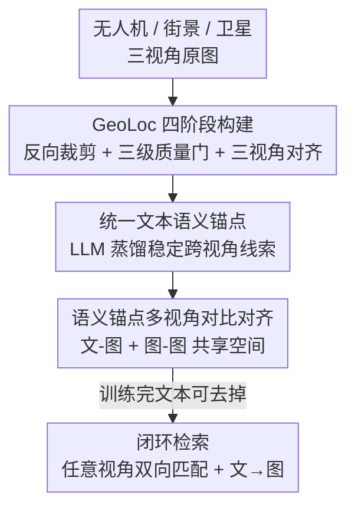

# GeoBridge: A Semantic-Anchored Multi-View Foundation Model Bridging Images and Text for Geo-Localization

**会议**: CVPR 2026  
**论文**: [CVF Open Access](https://openaccess.thecvf.com/content/CVPR2026/papers/Song_GeoBridge_A_Semantic-Anchored_Multi-View_Foundation_Model_Bridging_Images_and_Text_CVPR_2026_paper.pdf)  
**代码**: https://github.com/MiliLab/GeoBridge (有)  
**领域**: 遥感 / 跨视角地理定位 / 多模态对齐  
**关键词**: 跨视角地理定位, 语义锚点, 多视角对齐, 跨模态检索, 对比学习

## 一句话总结
GeoBridge 用一段「位置感知的统一文本描述」当语义锚点，把无人机、街景全景、卫星三种视角的图像绑到同一个语义空间里，从而摆脱传统「以卫星为中心」的定位范式，既能做任意视角两两双向匹配，又能用文字检索图像；配套的 GeoLoc 数据集（36 国 5 万+ 三视角对齐三元组）让它在跨视角、跨模态检索上都刷到 SOTA。

## 研究背景与动机
**领域现状**：跨视角地理定位（cross-view geo-localization）的主流做法是「检索匹配」——给一张查询图，从带 GPS 标签的参考图库里找视觉上对应的图，用它的坐标当定位结果。为应对无人机、街景、卫星之间巨大的视角差异，绝大多数方法采用「以卫星为中心」（satellite-centric）的锚定策略：所有视角都往卫星图上对齐去检索。

**现有痛点**：这种卫星中心范式有两个硬伤。一是脆弱——当高分辨率或最新卫星影像不可得时（灾区、偏远地区、时效敏感场景），整条检索链就断了，没有备选路径。二是浪费互补信息——它只用「某视角 ↔ 卫星」这一条边，没有充分利用无人机、街景、卫星三视角之间以及图像与语言之间的互补线索。更现实的「无人机 ↔ 街景」匹配（对无人机导航、应急救援、低空物流很有价值）长期是空白。

**核心矛盾**：视角间的强异质性（heterogeneity）逼着大家选一个「中心视角」做枢纽，但任何单一视角做枢纽都会引入它自己的归纳偏置（inductive bias），换到没见过的视角配对就掉点。同时，语言天然编码了丰富的方位、地标、拓扑语义，但已有的视觉-语言定位多依赖单视角场景描述，容易产生语义幻觉和空间不一致。

**本文目标**：(1) 做一个支持任意视角两两双向匹配的统一框架，不再依赖卫星；(2) 把语言信号和多视角视觉紧耦合，让文字也能定位；(3) 提供一个真正三视角对齐、地理覆盖广的数据集来支撑训练与评测。

**切入角度**：作者观察到，与其选某个视角当枢纽，不如造一个「视角无关」的中介——文本。人描述一个地方时说的是路口、桥、建筑、河流这类稳定的、跨视角都成立的线索。把每个地点蒸馏成一段统一文字描述，就能用它当所有视角共享的对齐目标。

**核心 idea**：用一段位置感知的统一文本描述当「语义锚点」，同时把文本对齐到每个视角、并把视角之间互相对齐，从而在共享语义空间里桥接多视角图像与语言，推理时文本分支可选。

## 方法详解

### 整体框架
GeoBridge 是一个对比学习框架。每个地理实例由四元组 $(x^{(d)}, x^{(p)}, x^{(s)}, t)$ 组成：无人机图 $d$、街景全景 $p$、卫星图 $s$，以及一段为该地点定制的统一文本描述 $t$。四者分别经过三个视角专属图像编码器 $E_d, E_p, E_s$ 和一个共享文本编码器 $E_t$（全部用 CLIP-L/14 初始化），映射成 L2 归一化的全局嵌入 $z_d, z_p, z_s, z_t \in \mathbb{R}^D$。

训练时，文本既作为「跨模态桥」把每个视角对齐到统一语义，又通过图-图对齐强化跨视角一致性；推理时文本分支可去掉，模型直接在共享空间里做任意「图 ↔ 图」最近邻检索，有文字时再额外支持「文 → 图」检索。整条管线分两条线：左边是 GeoLoc 数据集的四阶段构建（采集→反向裁剪对齐→去重清洗→三视角对齐），右边是 GeoBridge 的语义锚点对比训练。

### 关键设计

**1. 统一文本语义锚点：用一段视角无关的描述当跨模态桥**

针对「任选哪个视角当枢纽都带偏置、跨视角强异质难直接对齐」这个核心矛盾，GeoBridge 不再让卫星图当中心，而是为每个地点造一段简洁段落作为语义锚点。这段描述由 ChatGPT-4o 综合三个视角生成，指令明确要求「合并所有视角、简洁概括、忽略瞬时元素」——即强调道路、路口、桥梁、建筑、公园、河流、地标这类稳定且与视角无关的线索及其相互关系，剔除只在某个视角才出现的瞬时内容和视角特有措辞。这样得到的文本天然是「视角无关」的：无论从天上还是地面看，一个十字路口旁的带尖顶的对称建筑都是同一个事实。把它当共享对齐目标，就把原本需要在异质图像间直接架的桥，改成了「各视角各自往同一段文字靠」，绕开了视角间直接对齐的困难。文本编码前用动态 padding 和长度控制：超过 token 预算 $T_{max}$ 的右截断，过短的 padding。

**2. 双重对比对齐：文-图桥接 + 图-图一致，融在一个目标里**

光有锚点不够，还要让锚点真正把语义空间「拉拢」。GeoBridge 对每个视角对 $(u,v)\in\{(d,p),(p,s),(s,d)\}$ 和每个文-视角对 $(t,v)$ 计算余弦相似度，用可学习温度 $\tau$ 缩放锐度。对一个大小为 $B$ 的候选批，得到打分矩阵：

$$S_{u,v} = z_u (z_v)^\top / \tau \in \mathbb{R}^{B\times B}, \qquad S_{t,v} = z_t (z_v)^\top / \tau \in \mathbb{R}^{B\times B}.$$

每个矩阵用 InfoNCE 优化，$y_i$ 是查询 $i$ 在候选集中的正确匹配列号：

$$L(S) = -\frac{1}{B}\sum_{i=1}^{B}\log\frac{\exp(S(i,y_i))}{\sum_{j=1}^{B}\exp(S(i,j))}.$$

跨视角一致由三条图-图边的损失平均强制：$L_{img}=\frac{1}{3}[L(S_{d,s})+L(S_{s,p})+L(S_{p,d})]$；跨模态桥接由三条文-图边提供：$L_{text}=\frac{1}{3}\sum_{v\in\{d,p,s\}}L(S_{t,v})$；总目标等权相加 $L_{total}=L_{img}+L_{text}$。两项缺一不可——消融里只用图-图对齐时，卫星和无人机这种视角差极大的配对几乎建不起对应（P2D 的 R@1 仅 4.90）；只用文-图对齐能借文字捕捉跨视角语义、表现次优；两者融合（即用多视角表示当语义锚点）才在所有方向都最高。关键巧妙之处在于，锚点主要在训练时起作用，推理无额外在线开销，文本分支可选。

**3. GeoLoc 四阶段构建：造出第一个三视角严格对齐的全球数据集**

方法能成立的前提是有真正三视角共址（co-located）的训练数据，已有数据集都是两视角、卫星中心，缺这条路。作者构建 GeoLoc，四阶段流水线：(a) **采集与种子生成**——从 OpenAerialMap 取带地理参考的无人机大图，用固定 80×80 像素窗口滑动估计地面足迹，记录像素中心 $(x,y)$ 与经纬度 $(\varphi,\lambda)$ 当种子；(b) **跨源采集 + 反向裁剪**——每个种子去 Google Street View 查候选全景坐标，只保留落在无人机图覆盖内的，再以街景位置为锚把原无人机大图按地面足迹反向裁剪出共址子图，并生成 80×80、100×100、120×120、150×150、180×180（m²）五种地面足迹的多尺度裁剪增强尺度/视角鲁棒性；(c) **去重清洗**——地面覆盖重叠 >50% 或经纬度相同视为重复只留其一，>1% 面积全黑/全白的（传感器条带边缘）丢弃，再过三级轻量质量门（BH-Gate 用拉普拉斯方差和像素方差去模糊/雾化，C-Gate 用全局对比度去弱边缘/曝光异常，UN-Gate 用熵+方差+饱和像素比去蓝天/水面/沙漠这类无信息伪纹理）；(d) **三视角对齐**——用种子坐标取 GSV 全景、裁剪 Google Satellite 瓦片对齐共址区域。最终得到 52,679 个跨 36 国的无人机-街景-卫星共址三元组，其中 5,351 个来自非重叠城市当留出评测集。这套数据让「无人机 ↔ 街景」这一新任务第一次有了基准。

### 损失函数 / 训练策略
backbone 用公开 CLIP-L/14，文本描述由 ChatGPT-4o 生成。Adam 优化（基础学习率 $1\times10^{-5}$）+ cosine 衰减，batch size 32，200 epoch，8 卡 A800，输入图缩放到 224×224。预训练阶段所有参数端到端训练；在公开 benchmark 上评测时只微调最后三层。

## 实验关键数据

### 主实验
无人机-卫星方向（University-1652）与街景-卫星方向（CVUSA/VIGOR）均刷到 SOTA：

| 数据集 / 方向 | 指标 | 本文 | 之前最好 | 说明 |
|--------|------|------|----------|------|
| University-1652 / Drone→Sat | R@1 | 95.82 | 94.67 (DAC) | AP 也从 95.50→97.77 |
| University-1652 / Sat→Drone | R@1 | 97.14 | 96.43 (DAC) | 双向都领先 |
| CVUSA / Street→Sat | R@1 | 99.14 | 98.80 (AuxGeo) | R@1% 达 99.98 |
| VIGOR-Cross / Street→Sat | R@1 | 73.87 | 72.19 (Panorama-BEV) | 跨域设定提升最明显 |

在自建 GeoLoc 上，已有方法换到新视角配对就崩，GeoBridge 在六个方向全面且均衡领先：

| GeoLoc 方向 | 指标 | 本文 | 次优 | 说明 |
|--------|------|------|------|------|
| D2S | R@1 | 45.05 | 28.70 (Sample4Geo S2D) | 跨视角检索大幅领先 |
| P2D（新任务） | R@1 | 41.15 | 19.34 (DAC) | 无人机↔街景这条新路全面碾压 |
| 跨模态 RSIEval / 文→图 | R@5 | 71.00 | 60.00 (CLIP-L/14) | 文本检索也 SOTA |

### 消融实验
对齐策略消融（GeoLoc，R@1）直接验证语义锚点的必要性：

| 配置 | D2S | S2D | P2S | S2P | D2P | P2D |
|------|-----|-----|-----|-----|-----|-----|
| Image-only（仅图-图） | 38.20 | 34.63 | 6.43 | 6.95 | 7.16 | 4.90 |
| Text-only（仅文-图） | 42.83 | 42.83 | 35.40 | 36.40 | 39.00 | 38.63 |
| GeoBridge（融合，语义锚点） | **45.06** | **44.81** | **38.87** | **39.21** | **41.23** | **41.15** |

### 关键发现
- **图-图对齐单独几乎无法处理大视角差配对**：街景 ↔ 卫星/无人机这种异质配对在 Image-only 下 R@1 普遍跌到个位数（P2D 仅 4.90），说明直接在异质图像间架桥确实很难——这正是语义锚点要解决的痛点。
- **文本锚点是主要功臣**：Text-only 已经把所有方向拉到 35+，远超 Image-only，证明「用文字当跨视角中介」这条路本身就成立；融合后再涨 2-3 个点，说明图-图边补的是文本描述漏掉的细粒度视觉一致性。
- **跨域迁移强**：在完全没参与训练的 University-1652、CVUSA、VIGOR 上（只微调最后三层）也 SOTA，说明 GeoLoc 预训练学到的是可迁移的跨视角语义，而非数据集特异性。
- **锚点零在线开销**：语义锚点只在训练时起作用，推理时文本分支可去掉，部署友好。

## 亮点与洞察
- **「造一个视角无关的中介」这个思路很漂亮**：与其在 N 个异质视角间两两架桥（组合爆炸且每条都难），不如把它们都对齐到一段文字——文字天然抹平了视角差异，把多视角对齐问题降维成「各视角各自对文本」。这个「用语言当 anchor 抹平模态/视角异质」的范式可迁移到任意多视角/多传感器融合任务。
- **推理时锚点可丢，是工程上的关键巧思**：训练靠文本桥学好共享空间，推理直接图-图最近邻，既享受了语义对齐的好处又没有推理开销，也避免了部署时还要跑 LLM 生成描述。
- **数据集的三级质量门 cascade 可复用**：BH/C/UN 三门分别用拉普拉斯方差、全局对比度、熵来过模糊、弱边缘、无信息伪纹理，是构建大规模航拍/遥感数据集时现成的清洗 trick。

## 局限与展望
- **语义锚点质量被 LLM 绑死**：文本由 ChatGPT-4o 生成，描述若漏掉关键地标或产生幻觉，整个对齐目标就被污染；论文未充分讨论描述错误对下游的传播影响。⚠️ 描述生成的鲁棒性细节在正文外（supplementary）。
- **跨模态绝对精度仍低**：GeoLoc 上文→图检索的 R@1 多在个位数到 20 出头（如卫星描述→街景 R@1 仅 2.99），说明纯文字定位在多尺度复杂地形下依然很难，离实用尚远。
- **依赖三视角严格共址**：训练需要无人机-街景-卫星三者都齐且地理对齐，采集成本高；现实中常只有部分视角可得，缺视角时的退化表现未系统评测。
- **改进思路**：可探索用更可控的结构化描述（地标+方位关系模板）替代自由文本，减少幻觉；或引入坐标回归头让文→图也能输出连续坐标而非只做检索。

## 相关工作与启发
- **vs 卫星中心方法（DAC / Sample4Geo / MEAN 等）**：它们靠直接图-图对齐、以卫星为枢纽，卫星缺失即失效且换视角配对就掉点；GeoBridge 用语义锚点在共享空间统一三视角，做闭环双向检索，卫星只是三视角之一。
- **vs 视觉-语言定位（CrossText2Loc 等）**：它们多用单视角场景描述、易语义幻觉，长文本检索尚可但在多尺度复杂地形的 GeoLoc 上掉得厉害；GeoBridge 用综合多视角的统一锚点，把地标与空间关系跨尺度跨视角对齐，更稳。
- **vs 已有数据集（University-1652 / SUES-200 / DenseUAV）**：它们是两视角、卫星中心、地理覆盖窄；GeoLoc 是首个三视角严格共址、36 国、带 GPS 与多高度的数据集，并定义了无人机↔街景新任务。

## 评分
- 新颖性: ⭐⭐⭐⭐⭐ 「文本当视角无关锚点替代卫星中心」范式清晰且首次定义无人机↔街景任务
- 实验充分度: ⭐⭐⭐⭐⭐ 覆盖 6 个数据集、跨视角+跨模态多任务、消融直击锚点必要性
- 写作质量: ⭐⭐⭐⭐ 方法与动机讲得清楚，部分实现细节推到补充材料
- 价值: ⭐⭐⭐⭐⭐ 数据集+模型双贡献，对 UAV 导航/应急定位有直接落地价值

<!-- RELATED:START -->

## 相关论文

- [\[CVPR 2026\] SinGeo: Unlock Single Model's Potential for Robust Cross-View Geo-Localization](singeo_unlock_single_models_potential_for_robust_cross-view_geo-localization.md)
- [\[CVPR 2026\] UniGeoRS: A Unified Benchmark for Tri-view Geo-Localization](unigeors_a_unified_benchmark_for_tri-view_geo-localization.md)
- [\[CVPR 2026\] Geo2: Geometry-Guided Cross-view Geo-Localization and Image Synthesis](geo2_geometry-guided_cross-view_geo-localization_and_image_synthesis.md)
- [\[CVPR 2026\] PAUL: Uncertainty-Guided Partition and Augmentation for Robust Cross-View Geo-Localization under Noisy Correspondence](paul_uncertainty-guided_partition_and_augmentation_for_robust_cross-view_geo-loc.md)
- [\[AAAI 2026\] UniABG: Unified Adversarial View Bridging and Graph Correspondence for Unsupervised Cross-View Geo-Localization](../../AAAI2026/remote_sensing/uniabg_unified_adversarial_view_bridging_and_graph_correspondence_for_unsupervis.md)

<!-- RELATED:END -->
