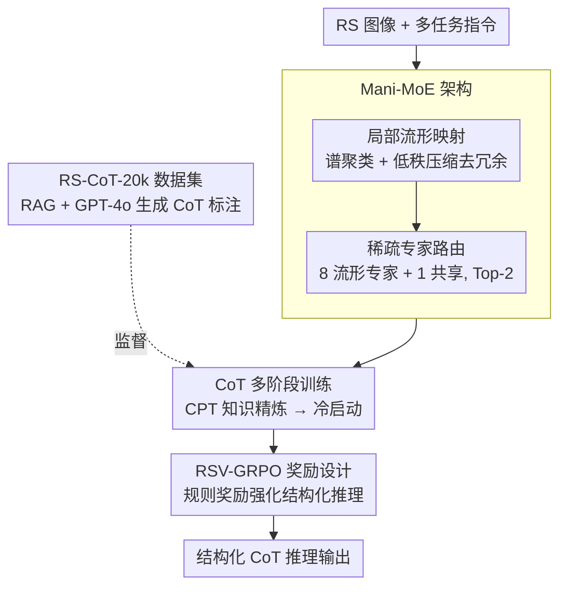

# GeoCoT: Towards Reliable Remote Sensing Reasoning with Manifold Perspective

**会议**: CVPR 2026  
**论文**: [CVF Open Access](https://openaccess.thecvf.com/content/CVPR2026/html/Li_GeoCoT_Towards_Reliable_Remote_Sensing_Reasoning_with_Manifold_Perspective_CVPR_2026_paper.html)  
**代码**: 无（论文未公开）  
**领域**: 遥感多模态 / MoE / 思维链推理  
**关键词**: 遥感MLLM, 流形MoE, 思维链, 强化学习, 低秩子空间

## 一句话总结
GeoCoT 把遥感图像的"低维流形"先验显式建进 MoE：先用谱聚类+低秩压缩把冗余的视觉 token 投到低秩子空间，再用流形结构引导稀疏专家分工，配上"CPT→冷启动→RSV-GRPO 强化"的多阶段训练和自建的 RS-CoT-20k 数据集，让一个 12B 的遥感大模型在 5 类遥感任务上平均比 SOTA 高 5.27%。

## 研究背景与动机
**领域现状**：遥感图像理解（地物分类、目标检测、计数、关系检测、图像描述）正从单任务专用模型转向遥感多模态大模型（RS-MLLM），用一套视觉-语言模型统一应对多任务。代表工作有 SkyEyeGPT、EarthGPT、GeoChat、SkySenseGPT 等。

**现有痛点**：现有 RS-MLLM 几乎都用**一套共享参数**（dense Transformer）扛所有任务和模态，导致知识纠缠、专精能力弱，对复杂遥感场景给不出细粒度、可靠的结果。有人想用 MoE 拆解任务，但直接把 MoE 套到遥感上又有新问题——遥感图像里**大量同质区域、重复纹理、稀疏小目标**带来严重冗余和噪声，直接按数据路由会引入大量冗余计算还掉点；而且专家选择纯数据驱动、缺结构约束，容易专家坍塌。

**核心矛盾**：遥感图像的统计结构和自然图像根本不同——它**高度结构化、本质上是嵌在高维空间里的低维流形**（大片均匀地表 + 稀疏目标）。而通用 MoE 和 dense 架构都假设 token 分布在无结构的高维空间里，于是把算力浪费在冗余背景上，反而淹没了真正重要的目标信息；同时它们缺乏从"全局场景理解→局部目标定位"的结构化推理链，推理结果不可追溯、在灾害响应等高风险场景里不可靠。

**本文目标**：让遥感大模型既能(a)按任务做细粒度专精、又能(b)抑制冗余/噪声、还能(c)给出从全局到目标的结构化可追溯推理。

**切入角度**：既然遥感信息主要"住在低维流形上"，那就把**流形先验显式注入专家架构**——先把高维 token 投到低秩流形子空间去掉冗余，再让路由按流形结构（而非裸数据）来分专家。

**核心 idea**：用"流形驱动的稀疏 MoE（Mani-MoE）+ 思维链强化训练（RSV-GRPO）"替代"共享参数 dense 模型/纯数据路由 MoE"，去同时解决遥感的冗余、专精与可靠推理三个问题。

## 方法详解

### 整体框架
GeoCoT 以 Qwen2.5-VL-7B 为底座，干两件事：**改架构**和**改训练**。架构上把每隔 3 层的原始 MLP 换成 Mani-MoE 层（先做局部流形映射，再走稀疏专家路由），模型从 7B 涨到 12B；训练上走一条三阶段流水线——先用自建语料做知识精炼 CPT 把底座搬到遥感域，再在 RS-CoT-20k 上做带思维链监督的冷启动顺便把 Mani-MoE 接进来，最后用为遥感定制的 RSV-GRPO 强化学习把"全局→目标"的结构化推理拉起来。输入是遥感图像 + 多任务指令，输出是 `<think>...</think><answer>...</answer>` 这种带推理链的结构化回答。

### 关键设计

**1. 局部流形映射：把冗余的遥感 token 投到低秩子空间，只留本质结构**

针对"遥感图像大片同质 + 稀疏小目标导致 token 严重冗余"这个痛点，作者不做全图统一降维（那样会把稀疏小目标的信息一起压没），而是**分区域自适应降维**。给定 token 特征矩阵 $X=[h_1,\dots,h_{L_v}]^\top\in\mathbb{R}^{L_v\times d}$，先按图正则范式建相似图：$W_{ij}=\exp(-\|h_i-h_j\|_2^2/\varepsilon^2)$ 当 $\|h_i-h_j\|_2\le m$，否则为 0，阈值 $m$ 取所有 token 两两距离的均值。然后构造归一化拉普拉斯 $L_{sym}=I-D^{-1/2}WD^{-1/2}$，用**特征间隙启发式**自动定簇数 $K=\arg\max_k(\lambda_{k+1}-\lambda_k)$，把最小的 $K$ 个特征向量堆叠并行归一化得到谱嵌入 $Z\in\mathbb{R}^{L_v\times K}$，再 kmeans 把 token 分成 $K$ 个语义/几何一致的簇。

关键在于**每个簇单独做谱分解再按能量截断**：对簇 $C_c$ 的特征 $X_c$ 做 $X_c=P_c\Lambda_c Q_c^\top$，只保留累计能量比超过阈值 $\xi=0.85$ 的前 $r$ 个分量，

$$\frac{\sum_{t=1}^{r}s_{c,t}^2}{\sum_{t=1}^{v}s_{c,t}^2}\ge\xi.$$

这样同质背景簇会被压到很低的秩、稀疏目标簇则保留更多分量，既消冗余又不伤目标。作者用 SSIM-保留奇异值比的曲线（图 3）证明：他们的局部映射只用约 4% 的保留奇异值就比全局降维（GDR）多出 15%+ 的 SSIM，说明遥感图像确实低维可压。

**2. Mani-MoE 稀疏专家路由：用流形结构而不是裸数据来分专家**

针对"纯数据驱动路由会专家坍塌、且对噪声敏感"，作者把流形映射后的低秩 token 喂给一组专家。具体是每隔 3 个 Transformer 层把原 MLP 换成 **8 个流形专家 + 1 个共享专家**的 MoE 层。共享专家用原始 Qwen2.5-VL-7B 权重初始化、负责保住复杂背景下的全局场景理解；8 个流形专家在低维子空间里跑、专攻密集遥感场景下的目标级推理。路由用 Switch Transformer 的 Top-2 策略，对每个 token 用带噪门控打分 $g=\text{softmax}(xW_g+\mathcal{N}(0,\sigma^2))$，高斯噪声鼓励路由多样性、选 top-2 专家加权聚合，并加一个辅助负载均衡损失防止专家过度集中。因为送进路由的已经是去过冗余的流形表示，门控决策是被输入的流形结构引导的，从而避免了"把算力路由到冗余背景"的浪费。消融（表 4）显示 8 专家最优、16 专家反而因路由不确定和专家欠利用收益递减。

**3. CoT 多阶段训练：从域适配到结构化推理逐级拉起**

针对"通用底座既不懂遥感、又不会结构化推理"，作者设计了三阶段递进训练（前两阶段是这个设计，第三阶段强化见设计 4）。**知识精炼 CPT**：在自建 CPT 语料（8 个开源数据集经 Data Distillation Regularization 过滤——滤掉 <50 词的弱描述、MinHash+LSH 去重、T5 扩写、去极端长宽比图、RemoteCLIP 图文相似度 <0.3 的剔除，最终平均文本长达 667 字）上微调 3 个 epoch，把底座的视觉/文本表示搬到遥感域。**多任务 CoT 冷启动**：把 Mani-MoE 接进底座，在 RS-CoT-20k 的图-指令-答案三元组上做指令微调，用 CoT 监督引导中间推理步骤；为稳训练，流形专家门控权重用 cosine ramp-up 缓慢放大、专家权重从共享专家参数统计估计的高斯 $\mathcal{N}_s(\mu,\sigma^2)$ 采样初始化，且只对注意力模块加 LoRA（rank 32）不做全参更新。这一步让模型"先学会按遥感任务分工、再准备强化"。

**4. RSV-GRPO 奖励设计：用规则化奖励把"全局→目标"的推理逼出来**

针对"监督微调难以保证推理可靠、易幻觉"，作者把 GRPO 搬到遥感视觉任务上。GRPO 对一个 query 采样 $M$ 个回答、用组内相对优势 $A_i=(g_i-\text{mean}(\{g\}))/\text{std}(\{g\})$ 直接估计优势，再带 clip 和 KL 正则更新策略。核心是**为多种遥感任务定制的奖励聚合**：

$$R_{total}=\omega\cdot\underbrace{(R_{format}+R_{cos})}_{\text{表达式奖励}}+\eta\cdot\underbrace{R_{task}}_{R_{task}\in\{R_{count},R_{sim},R_{scene},R_{det}\}}.$$

表达式奖励里 $R_{format}$ 强制输出 `<think>...</think><answer>...</answer>` 格式（合规给 1.0）；$R_{cos}$ 是一个 cosine 长度调度 $R_{cos}(t)=\delta-(\delta-\gamma)\cdot\frac{1-\cos(t\pi/T)}{2}$，答对时取 $(\gamma_c,\delta_c)=(1.0,0.5)$ 鼓励简洁、答错时取 $(\gamma_w,\delta_w)=(-0.5,0.0)$ 鼓励多推理（$T=1024$）。任务奖励按任务定义：计数严格相等才给 1.0；图像描述/关系检测用句向量余弦相似度 $R_{sim}=\cos(f(\hat a_i),f(a_i))$（编码器用 MEXMA、过阈值 $\tau$）；场景分类用 $F_1(\hat Y_i,Y_i)=2|\hat Y_i\cap Y_i|/(|\hat Y_i|+|Y_i|)$ 容忍部分正确；检测用 $R_{det}=\alpha(R_{iou}+R_{conf})$ 兼顾 IoU 和置信度。这套按任务量身的规则奖励，把"先全局观察、再区域聚焦、再目标确认、再坐标计算"的结构化推理链直接奖励出来（图 4 的定性例子里 GeoCoT 会分阶段逐步精修边界框坐标）。

### 一个例子：定位棒球场
拿"图里棒球场在哪、给绝对坐标"这个检测问题走一遍：GeoCoT 不像 GPT-4o 只给"图像上中部"这种相对位置、也不像 Qwen2.5-VL 一步出框，而是被 RSV-GRPO 训出的 CoT 分四阶段——**全局观察**（识别这是郊区航拍、有房屋道路绿地）→**区域聚焦**（上中部一块绿地里有个浅棕几何形状最可疑）→**目标确认**（轮廓对称、长宽比符合标准棒球场、且挨着网球场等运动设施佐证）→**坐标计算**（先粗框 `<458><138><582><262>`，再逐轮精修到 `<469><139><587><263>`→`<474><141><581><247>`→最终 `<483><140><584><244>`）。整个过程可追溯、每步有理由，这正是"可靠推理"想要的画面。

### 损失函数 / 训练策略
三阶段：①CPT 3 epoch、batch 2；②冷启动用 LoRA(rank 32) 3 epoch、batch 4，含 MoE 负载均衡辅助损失 + 门控 cosine ramp-up；③RSV-GRPO 用式 (10) 的 clip+KL 目标 + 式 (11) 的聚合奖励。全程 8×A100(80GB)。

## 实验关键数据

### 主实验
4 类遥感任务对比（表 2，部分为零样本）：

| 任务/数据集 | 指标 | GeoCoT | SkySenseGPT | GPT-4o | Faster R-CNN |
|--------|------|------|----------|------|------|
| 关系检测 DOTA-v2.0 | F1 | **81.21** | 74.34 | 41.83 | N/A |
| 场景分类 AID | Acc. | 91.73 | **92.25** | 58.81 | N/A |
| 目标计数 RSVQA_LR | Acc. | **17.15** | 9.20 | 7.34 | N/A |
| 目标检测 DIOR | mAP@0.5 | **78.29** | 69.94 | 54.56 | 76.50 |
| 目标检测 DIOR | mAP@[.5:.95] | **54.95** | 48.17 | 30.57 | 41.43 |

GeoCoT 在 4 个任务中 3 个第一、场景分类几乎追平专精模型 SkySenseGPT，平均比 SOTA 高 5.27%。图像描述（表 1，UCM-Captions）上 BLEU-1/4 达 86.31/67.14、ROUGE_L 80.18 均为最佳（仅 CIDEr 202.38 略低于 RSGPT 的 333.23，作者强调更看重可靠忠实而非过拟合特定任务）。

### 消融实验
训练流水线逐级消融（表 3，每任务取最相关指标）：

| 配置 | 场景AID | 计数 | 检测mAP@[.5:.95] | 关系F1 | 描述ROUGE_L |
|------|------|------|------|------|------|
| Baseline | 69.42 | 5.21 | 41.22 | 65.34 | 65.26 |
| +CPT | 75.81 | 8.56 | 45.61 | 72.76 | 71.41 |
| x+冷启动(Classic-MoE) | 82.28 | 13.25 | 49.36 | 74.90 | 72.24 |
| y+冷启动(Mani-MoE) | 87.06 | 15.07 | 51.71 | 77.82 | 75.49 |
| GeoCoT(全) | 91.73 | 17.15 | 54.95 | 81.21 | 80.18 |

专家数量消融（表 4，冷启动后）：

| 专家数(参数量) | 场景AID | 计数 | 检测mAP@[.5:.95] | 关系F1 | 描述ROUGE_L |
|------|------|------|------|------|------|
| 2 (8.3B) | 77.04 | 7.11 | 47.61 | 72.31 | 70.44 |
| 4 (9.5B) | 80.82 | 11.81 | 49.24 | 74.79 | 73.21 |
| 8 (12.0B) | **87.06** | **15.07** | **51.71** | 77.82 | 75.49 |
| 16 (17.1B) | 84.91 | 13.01 | 51.59 | 76.84 | **77.13** |

### 关键发现
- **局部流形映射本身就是大头**：表 3 第 3→4 行（Classic-MoE→Mani-MoE）每个任务都涨 2~5 个点（如计数 13.25→15.07、场景 82.28→87.06），证明"把流形先验加进专家"比普通 MoE 实打实有用。
- **专家不是越多越好**：8 专家全面最优，加到 16 专家反而多数任务掉点（场景 87.06→84.91、计数 15.07→13.01），作者归因于路由不确定和专家欠利用；且额外做了实验说明增益来自专家专精而非单纯堆参数。
- **三阶段每步都在涨**：CPT 做域适配、冷启动接 Mani-MoE、RSV-GRPO 强化，逐级单调提升，验证了渐进式优化。
- **部署友好**：12B 模型在单张 RTX 4090(24GB) 上仅占 21.99GB 显存、约 22.56 tokens/s，A100 上 23.53 tokens/s，可实际部署。

## 亮点与洞察
- **把"遥感图像是低维流形"这个统计先验显式做进 MoE**：不是泛泛说"加约束"，而是真用谱聚类+逐簇能量截断把背景压低秩、把稀疏目标留高秩，图 3 用 4% 奇异值换 15%+ SSIM 把这个先验量化坐实——这是最让人"啊哈"的地方。
- **路由对象从裸 token 变成流形表示**：先去冗余再路由，自然缓解了"算力被冗余背景吃掉"和专家坍塌，思路可迁移到任何"输入高度冗余/结构化"的领域（医学影像、文档图像）。
- **cosine 长度奖励 + 答案正确性耦合**：答对鼓励简洁、答错鼓励多推理，是个很可复用的 RL 奖励 trick，能压住"为凑长度乱推理"。
- **结构化 CoT 的画面感**：把检测做成"全局→区域→确认→逐轮精修坐标"的可追溯链，对高风险遥感应用的可靠性是实打实的卖点。

## 局限与展望
- 论文**未公开代码**，且部分公式（如 $R_{det}=\alpha(R_{iou}+R_{conf})$ 里 $\alpha$、各 reward 权重 $\omega,\eta$）只给了形式没给取值，复现细节存疑 ⚠️ 以原文为准。
- **流形映射的开销没量化**：谱聚类 + 逐簇 SVD 每层都做、且 $K$ 自适应，训练/推理里这部分的额外计算成本论文没单独报，只给了整体吞吐。
- **场景分类没拿第一**（91.73 vs SkySenseGPT 92.25），说明在某些靠强判别的任务上专精模型仍有优势；GeoCoT 的卖点更在"多任务均衡 + 可靠推理"而非单任务刷榜。
- RS-CoT-20k 的 CoT 标注由 GPT-4o + RAG 生成、再人工校验，CoT 质量上限受 GPT-4o 制约，且只覆盖 5 类任务 24 个场景类别，泛化到更长尾遥感任务待验证。

## 相关工作与启发
- **vs 普通 MoE（RingMoE 等）**：它们专家选择纯数据驱动、无结构约束，容易专家坍塌；GeoCoT 用流形结构约束路由 + 低秩专家输出，强制专精又抗噪。
- **vs dense RS-MLLM（GeoChat / SkySenseGPT / EarthGPT）**：它们一套共享参数扛所有任务、知识纠缠；GeoCoT 用稀疏专家解耦任务，且补上了它们普遍缺的 CoT 结构化推理。
- **vs 通用大模型零样本（GPT-4o / Gemini 2.5 / Llama 4）**：通用模型零样本迁移到遥感全面落后（如关系检测 41.83 vs 81.21），印证遥感域适配 + 任务专精的必要性。

## 评分
- 新颖性: ⭐⭐⭐⭐⭐ 把"遥感低维流形"先验显式建进 MoE 路由 + 逐簇能量截断降维，角度新且自洽
- 实验充分度: ⭐⭐⭐⭐ 5 任务全覆盖 + 训练流水线/专家数双消融 + 部署效率，扎实；但部分奖励超参未给、流形开销未单独量化
- 写作质量: ⭐⭐⭐⭐ 公式与流程清楚、图 3/图 4 有说服力；少量符号与权重交代不全
- 价值: ⭐⭐⭐⭐⭐ 12B 单卡可部署 + 平均超 SOTA 5.27% + 自建 RS-CoT-20k，对遥感大模型落地有实际推动

<!-- RELATED:START -->

## 相关论文

- [\[CVPR 2025\] Think and Answer ME: Benchmarking and Exploring Multi-Entity Reasoning Grounding in Remote Sensing](../../CVPR2025/remote_sensing/think_and_answer_me_benchmarking_and_exploring_multi-entity_reasoning_grounding_.md)
- [\[CVPR 2026\] Fast Kernel-Space Diffusion for Remote Sensing Pansharpening](fast_kernel-space_diffusion_for_remote_sensing_pansharpening.md)
- [\[CVPR 2026\] RECS4R: Bridging Semantics and Geometry for Referring Remote Sensing Interpretation](recs4r_bridging_semantics_and_geometry_for_referring_remote_sensing_interpretati.md)
- [\[CVPR 2026\] Beyond Endpoints: Path-Centric Reasoning for Vectorized Off-Road Network Extraction](beyond_endpoints_path-centric_reasoning_for_vectorized_off-road_network_extracti.md)
- [\[CVPR 2026\] Robust Remote Sensing Image–Text Retrieval with Noisy Correspondence](robust_remote_sensing_image-text_retrieval_with_noisy_correspondence.md)

<!-- RELATED:END -->
