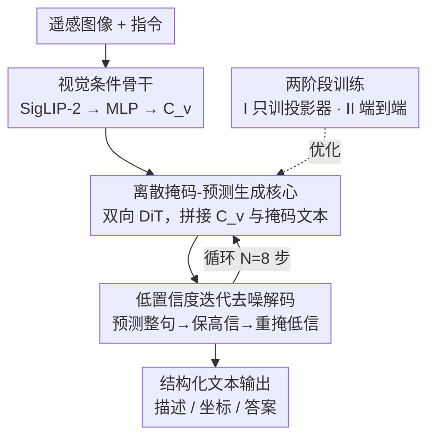

# GeoDiT: A Diffusion-based Vision-Language Model for Geospatial Understanding

**会议**: CVPR 2026  
**论文**: [CVF Open Access](https://openaccess.thecvf.com/content/CVPR2026/html/Liu_GeoDiT_A_Diffusion-based_Vision-Language_Model_for_Geospatial_Understanding_CVPR_2026_paper.html)  
**代码**: 论文称资源可在项目页获取，未给出明确仓库链接（⚠️ 以原文为准）  
**领域**: 遥感 / 多模态VLM / 扩散模型  
**关键词**: 遥感VLM, 离散扩散, 并行解码, 掩码-预测, 视觉定位

## 一句话总结
GeoDiT 把遥感图像的文本生成从「自回归逐 token」改成「离散扩散并行迭代去噪」，用 SigLIP-2 视觉条件 + LLaDA-8B 双向 Transformer 一次性预测整句再低置信度重掩码精修，在多目标检测、视觉定位、图像描述等需要结构化输出的任务上刷出新 SOTA。

## 研究背景与动机
**领域现状**：把大规模视觉-语言模型（VLM）迁到 Earth Observation 数据上，已经是遥感智能的主流范式。早期是双塔对比学习（CLIP 式）做检索，近年转向自回归 VLM——把视觉特征直接喂进一个 LLM backbone，代表作有 GeoChat、VHM、EarthDial，在场景分类、VQA、视觉定位上很能打。

**现有痛点**：作者指出自回归范式有一个被「单输出任务好成绩」掩盖的结构性缺陷。遥感场景本质是**并行、空间无序**的——一张图里有几艘船、几辆车、各自在哪，彼此之间没有天然的先后顺序。但自回归是严格逐 token、单向承诺的：它必须先吐第一个词/第一个框，后面全部条件在前面之上。

**核心矛盾**：这种「线性承诺」和遥感需要的「coarse-to-fine（先定全局构图、再补细节）」根本不兼容。具体表现成两类系统性失败：① 综合场景描述时，生成焦点会过早锚定到第一个显著物体，把描述预算耗在开头，难以把空间上分散的其它概念均衡地织进叙述；② 多目标检测时形成「路径依赖反馈环」——前一个框的生成会病态地影响下一个框，导致对同一个物体反复输出近乎重复的坐标，而不是系统性地扫描其它不同实体。两类失败共同的根因：**顺序过程无法在落子之前先形成全局一致的理解**。

**核心 idea**：换一个天生「全局 + 并行」的生成范式。去噪扩散模型恰好是从一张充满噪声的整体画布出发、逐步去噪、让所有语义单元（词或坐标）同时且相互依赖地被确定下来。作者把「复杂遥感描述」重新表述成「多模态条件下的文本去噪」，提出**第一个面向遥感的扩散式 VLM** GeoDiT，把生成过程和数据的内在结构对齐。

## 方法详解

### 整体框架
GeoDiT 由两个模块组成：一个提供地理空间上下文的**视觉骨干**，和一个合成文本的**生成核心（Modality-Adapted DiT）**。输入一张遥感图像 + 一条指令，输出一段结构化文本（描述 / 坐标 / 答案）。整体转法是：视觉骨干先把图像编码成一组条件向量 $C_v$，生成核心把 $C_v$ 和「被掩码的文本序列」拼在一起，做**非自回归的迭代去噪解码**——从一条全 `[M]` 的模板出发，每步预测整句、再按置信度把不确定的位置重新掩回去，循环 $N$ 步得到最终输出。

训练用「掩码-预测」目标，分两阶段：Stage I 冻结视觉编码器和生成核心、只训 MLP projector 做视觉-语言对齐；Stage II 解冻全部组件，在遥感指令数据上端到端微调。推理则是训练去噪过程的逆向回放。

### 关键设计

**1. 把遥感文本生成重写成「离散掩码-预测扩散」：用并行去噪替代自回归**

这是全文立论的根基，直接针对自回归的路径依赖。原始 DiT 在连续隐变量上做高斯扩散，而这里目标是离散文本 token，所以作者把生成核心重铸成离散的 mask-and-predict 扩散：前向过程 $q$ 以概率 $t$（$t\sim U[0,1]$）独立地把每个 token $T_0^i$ 替换成特殊 `[M]`，得到污染序列 $T_t$；反向用一个双向 Transformer $p_\theta$ 在「未掩码文本上下文 + 视觉条件 $C_v$」的条件下，预测被掩位置的原始 token。每个反向步的输入是把视觉向量和掩码文本 embedding 拼接：$X_t=\mathrm{concat}(C_v, E(T_t))$，过 $L$ 层 Transformer 得 $H_t$，再取文本位置的隐状态投影成词表分布 $p_\theta(T_0\mid T_t,C_v)=\mathrm{softmax}(W_p H_t^{\text{text}}+b_p)$。因为是双向、可一次看到整句，所有词/坐标能同时且相互依赖地被解出来，从一开始就在全局层面建立一致性——这正是自回归做不到的。

**2. SigLIP-2 视觉条件 + 直接复用 LLaDA-8B 作生成核心：把现成离散扩散底座接到遥感语义**

视觉骨干用预训练的 SigLIP-2（ViT-SO400M）把图像 $I\in\mathbb{R}^{H\times W\times3}$ 编成 $N$ 个 patch embedding $Z_v=\mathrm{Encoder_{ViT}}(I)$，再用一个轻量 MLP 投到生成核心的隐维度 $C_v=\mathrm{MLP}(Z_v)\in\mathbb{R}^{N\times d}$，作为整个生成过程的地理空间上下文。生成核心作者没有从零设计，而是认定 LLaDA-8B（32 层双向 Transformer，$d=4096$，32 头）本质就是一个为迭代掩码-预测优化的离散扩散实现，于是直接用它的公开权重初始化。作者坦言本文新意不在重造底座，而在「把这套生成能力系统性地接地到遥感这种非叙事语义」的方法论——这一点对读者很关键：GeoDiT 的贡献是范式迁移 + 适配，而非新架构。

**3. 低置信度重掩码迭代精修：让模型先定高把握内容，反复打磨不确定的高风险细节**

推理是关键设计 1 的逆过程，决定了「coarse-to-fine」怎么真正发生。从长度 $L$ 的全掩码模板 $T_{t_N}$ 出发（$t_N=1$），在 $N$ 个离散时间步上迭代精修。每步先取最可能 token 产出一个完整预测 $\hat T_0=\arg\max_{T_0'} p_\theta(T_0'\mid T_{t_k},C_v)$ 作为中间估计；然后按输出概率的置信度做**调度重掩码**——保留模型最有把握的 token，把不确定的位置重新打回 `[M]` 形成下一步输入 $T_{t_{k-1}}$，直到 $t_1\approx0$。它针对的是「哪些位置该先定、哪些该再磨」：把算力集中在精坐标、关键物体名词这类高风险细节上。消融显示它对 mAP（+34.2%）、CIDEr（+11.3%）这类结构化/物体中心指标增益最大，对 BLEU-4、简单 VQA 增益温和——正好印证它的价值在「精修结构化输出」。生成长度按任务设：描述 16 token、检测 32、其它 8；默认 $N=8$、贪心解码、不用 classifier-free guidance。

### 损失函数 / 训练策略
训练目标是去噪扩散的负对数似然上界，只在被掩位置算 loss：

$$\mathcal{L}(\theta)=\mathbb{E}_{(I,T_0)\sim D}\left[-\sum_{i=1}^{L}\mathbb{1}[T_t^i=\texttt{[M]}]\,\log p_\theta(T_0^i\mid T_t,I)\right]$$

其中 $\mathbb{1}[\cdot]$ 只对掩码位置激活。两阶段都用 AdamW（$\beta_1=0.9,\beta_2=0.95$）、cosine 调度 + 前 3% warmup、无 weight decay：Stage I 在 SkyScript 上只训 MLP 投影器 1 epoch（batch 96，峰值 lr $1\times10^{-3}$）；Stage II 在 MMRS-1M 光学子集（34 个遥感数据集汇成统一指令格式）上全模型端到端微调 1 epoch（batch 24，峰值 lr $1\times10^{-5}$）。在 H200 上训练。

## 实验关键数据

### 主实验
覆盖图像描述、视觉定位/检测、VQA/分类三大类。baseline 分三组：商用自回归（GPT-4V、Claude-4）、开源扩散式（LLaDA-V、LaVida、MMaDA）、开源自回归遥感 VLM（LLaVA-1.5、Qwen2.5-VL、GeoChat、VHM、EarthDial）。

图像描述（CIDEr，物体中心指标，GeoDiT 优势最突出）：

| 数据集 | 指标 | GeoDiT | 最强对手(EarthDial) | 相对提升 |
|--------|------|--------|------|------|
| RSICD | CIDEr | 135.6 | 115.3 | +17.6% |
| Sydney-Captions | CIDEr | 128.3 | 113.0 | +13.5% |
| UCM-Captions | CIDEr | 73.8 | 64.2(VHM) | — |
| NWPU-Captions | CIDEr | 77.4 | 69.3 | — |

视觉定位(VG, Acc@0.5)与检测(DET, mAP@0.5)，全面领先；注意通用扩散式模型（LLaDA-V/LaVida/MMaDA）在定位/检测上几乎全 0，说明「会并行解码」不等于「会接地遥感空间语义」：

| 任务/数据集 | 指标 | GeoDiT | 次优 |
|--------|------|------|------|
| DIOR-RSVG | VG | 60.4 | 55.9(VHM) |
| DIOR-RSVG | DET | 20.8 | 17.9(Qwen2.5-VL) |
| VRSBench | VG | 63.7 | 56.3(GeoChat) |
| VRSBench | DET | 24.9 | 19.6(Qwen2.5-VL) |
| RSVG | VG | 43.2 | 42.0(EarthDial) |

VQA 与分类同样刷新 SOTA：RSVQA-LR-R 98.1、RSVQA-HR-C(Comparison) 80.6、WHU-RS19 分类 95.0、AID 81.2，说明并行精修不只对结构化输出有用，对需要全局场景理解的单标签分类也有更根本的优势。

### 消融实验
重掩码策略（RSICD/DIOR-RSVG/AID）：

| 配置 | BLEU-4 | CIDEr | mAP@0.5 | Acc. |
|------|--------|-------|---------|------|
| Random Remasking | 27.3 | 121.8 | 15.5 | 63.4 |
| Low-Confidence (Ours) | 28.6 | 135.6 | 20.8 | 67.6 |
| 相对提升 | +4.76% | +11.3% | +34.2% | +6.21% |

推理步数 $N$（性能在 $N=8$ 基本饱和）：

| N | BLEU-4 | CIDEr | mAP@0.5 | Acc. |
|---|--------|-------|---------|------|
| 1 | 21.0 | 65.8 | 7.5 | 76.5 |
| 2 | 25.3 | 105.1 | 14.2 | 79.8 |
| 4 | 27.8 | 127.3 | 18.9 | 70.7 |
| 8 | 28.6 | 135.6 | 20.8 | 81.2 |
| 16 | 28.7 | 136.2 | 21.1 | 81.3 |

> ⚠️ 表 6 标题正文写「performance saturates at N=128」，但表内 N 只到 16、且正文又说 N=8 后翻倍只换边际收益、采用 N=8，"128"疑为笔误，应以 N=8 为准。

### 关键发现
- **CIDEr/mAP 这类「物体中心、结构化」指标是 GeoDiT 优势的集中体现**：低置信度重掩码对 mAP 增益 +34.2%、CIDEr +11.3%，远高于 BLEU-4 的 +4.76%——把算力花在精修高风险细节（精坐标、关键名词）上确实最划算。
- **步数与任务敏感度耦合**：CIDEr、mAP 随步数陡升，需要多步迭代才能解开并行语义；而场景分类很早就饱和，说明分类只要一次全局判断、不需反复精修——这反向印证方法的核心价值在「精雕结构化输出」。
- **定性可视化**揭示层级生成模式：早期（黄）先定全局场景与主要物体及其数量（"seven buses""three trucks"），中期（粉）补属性（"yellow""school"），晚期（蓝）才填语法虚词（"containing""and""."），即「context-first → entity-second → syntax-last」，只有并行整体理解才可能。

## 亮点与洞察
- **「数据是并行无序的，生成范式就该并行」**这个 framing 很有说服力：把自回归在多目标检测里「反复输出同一坐标的退化环」归因到结构性路径依赖，再用扩散的并行去噪天然规避，论证闭环。
- **CIDEr 被特意选为核心指标**：因为它衡量的是对「所含物体集合」的一致性，正好对应非叙事、无序的遥感描述本质——指标选择本身就在为论点服务，是值得借鉴的实验设计思路。
- **直接复用 LLaDA-8B 当离散扩散底座**而不重造轮子，把工作重心放在「视觉条件 + 两阶段对齐 + 低置信度精修」的适配上，是把通用 NAR 能力迁到垂直域的高性价比范式，可迁移到医学、文档等其它结构化输出领域。

## 局限与展望
- 生成长度是**预设固定**的（描述 16、检测 32、其它 8 token），对超长描述或物体数量极多的密集场景可能受限，论文未讨论变长生成。
- 检测被当作「文本里吐坐标」来做，DET 的 mAP 绝对值（20–25）仍远低于专用检测器，说明「VLM 生成式检测」目前更多是验证范式优越性，离实用精度尚有差距（自己观察）。
- 论文未给出与自回归 baseline 的**推理延迟/吞吐对比**：$N=8$ 步迭代 vs 自回归逐 token，谁更快需要数据支撑；表 6 标题的「N=128」笔误也让步数设定的论证略显粗糙。
- 评测全是光学影像（MMRS-1M optical 子集），SAR、多光谱、高光谱等遥感模态未覆盖，泛化性待验证。

## 相关工作与启发
- **vs 自回归遥感 VLM（GeoChat / VHM / EarthDial）**：它们共享自回归底座，逐 token 单向承诺；GeoDiT 换成并行迭代去噪，在物体中心/结构化任务上系统性更优，根本差异在生成范式而非数据或 backbone。
- **vs 通用扩散式 VLM（LLaDA-V / LaVida / MMaDA）**：同为非自回归并行解码，但它们为通用叙事文本设计，在遥感定位/检测上几乎全 0；GeoDiT 通过 SigLIP-2 视觉条件 + 遥感指令两阶段微调把这套能力接地到地理空间语义，证明「会并行」与「会遥感」是两件事。

## 评分
- 新颖性: ⭐⭐⭐⭐ 首个面向遥感的扩散式 VLM，范式迁移立论清晰，但底座直接复用 LLaDA-8B、创新偏适配层。
- 实验充分度: ⭐⭐⭐⭐ 覆盖描述/定位/检测/VQA/分类五类任务 + 两组消融，但缺推理效率对比、仅光学模态。
- 写作质量: ⭐⭐⭐⭐ 论证闭环、图示直观；个别笔误（N=128）和资源链接不明扣分。
- 价值: ⭐⭐⭐⭐ 为遥感结构化输出指出「生成范式与数据结构对齐」的新方向，可迁移性强。

<!-- RELATED:START -->

## 相关论文

- [\[CVPR 2026\] ZoomEarth: Active Perception for Ultra-High-Resolution Geospatial Vision-Language Tasks](zoomearth_active_perception_for_ultra-high-resolution_geospatial_vision-language.md)
- [\[CVPR 2026\] VLM4RSDet: Collaborative Optimization with Vision-Language Model for Enhancing Remote Sensing Object Detection](vlm4rsdet_collaborative_optimization_with_vision-language_model_for_enhancing_re.md)
- [\[CVPR 2026\] UniChange: Unifying Change Detection with Multimodal Large Language Model](unichange_unifying_change_detection_with_multimodal_large_language_model.md)
- [\[CVPR 2026\] CF-IPT: Cross-Modal Fusion Interactive Prompt Tuning of Vision-Language Pre-Trained Model for Multisource Remote Sensing Data Classification](cf-ipt_cross-modal_fusion_interactive_prompt_tuning_of_vision-language_pre-train.md)
- [\[CVPR 2026\] AVION: Aerial Vision-Language Instruction from Offline Teacher to Prompt-Tuned Network](avion_aerial_visionlanguage_instruction_from_offli.md)

<!-- RELATED:END -->
