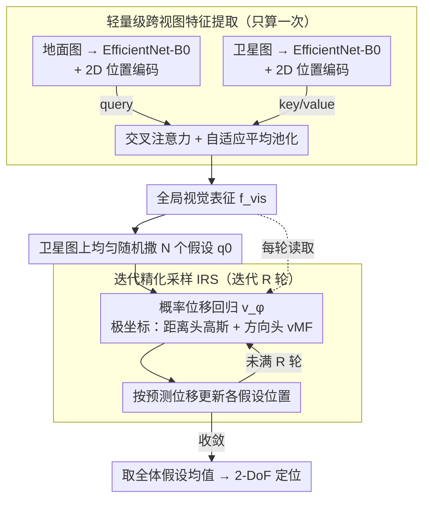

# GeoFlow: Real-Time Fine-Grained Cross-View Geolocalization via Iterative Flow Prediction

**会议**: CVPR 2026  
**arXiv**: [2603.21943](https://arxiv.org/abs/2603.21943)  
**代码**: [GitHub](https://github.com/)  
**领域**: 遥感 / 跨视图地理定位  
**关键词**: 跨视图地理定位, 流场回归, 迭代精化采样, 实时推理, 概率位移预测

## 一句话总结

提出 GeoFlow，一种受流匹配启发的轻量级跨视图精细地理定位框架，通过学习概率位移场结合迭代精化采样（IRS）算法，在连续空间内实现从地面图像到卫星图像的精确 2-DoF 定位，以 29 FPS 的实时速度达到了与 SOTA 可比的精度。

## 研究背景与动机

精细跨视图地理定位（FG-CVG）旨在估计地面图像相对于卫星图像的精确 2-DoF 位置，在 GPS 拒止区域的自主导航中具有重要意义。现有方法面临以下困境：

1. **匹配式方法**（如 CCVPE）：将搜索空间离散化为有限 patch 网格，本质上是分类问题。受限于 patch 大小导致的量化误差，难以扩展到大搜索区域。
2. **回归式方法**（如 HC-Net、FG2）：虽然在连续空间操作，但往往需要相机内参、BEV 投影或中间几何估计等先验知识，计算开销大，难以实时部署。
3. **精度与速度的矛盾**：高精度模型（如 FG2, 4.20 FPS）速度过慢，快速模型精度不足。

GeoFlow 的核心动机是：**能否在连续空间中实现精准定位，同时保持实时推理速度？** 作者从流匹配（Flow Matching）模型中汲取灵感——流匹配通过学习向量场将先验分布样本迭代传输到目标分布，这一过程恰好模拟了人类定位时"先粗后精"的推理方式。

## 方法详解

### 整体框架

GeoFlow 要解决的是：地面拍一张街景，在一张卫星图里把相机的精确落点（2-DoF 坐标）找出来，而且要做到实时。它的整条链路其实只有"看一眼、反复猜"两步——先把地面图和卫星图各自编码、用交叉注意力融成一个全局视觉表征 $\mathbf{f}_{vis}$；然后在卫星图上随手撒下若干个假设位置，每个假设都问同一个回归网络"从这里到真实位置该往哪挪、挪多远"，挪几轮之后这些假设会聚到一起，取平均就是最终答案。

关键在于把重活和轻活拆开：编码 $\mathbf{f}_{vis}$ 是重活但只做一次，反复迭代的只是一个吃 $\mathbf{f}_{vis}$ 加坐标、吐位移的轻量回归头。这样"迭代精化"这种通常很慢的范式也能跑到 29 FPS。

### 关键设计

**1. 轻量级跨视图特征提取：把两张视角差 90° 的图对齐进同一空间**

地面图是平视、卫星图是俯视，两者几何关系极不直观，是定位的第一道坎。GeoFlow 不做 BEV 投影、也不依赖相机内参，而是用两个独立的 **EfficientNet-B0** 分别编码地面图与卫星图（刻意选轻量骨干，是为了证明涨点来自方法本身而非堆容量），各经 1×1 卷积投到公共维度 $d$，再叠上固定的 2D 正弦位置编码补回空间感。对齐靠一层**交叉注意力**完成：地面 token 当 query、卫星 token 当 key/value，让地面表征主动去卫星图里"找对应区域"，最后自适应平均池化成全局向量 $\mathbf{f}_{vis} \in \mathbb{R}^d$。整个跨视图歧义被压进这一个向量里，后续迭代只需读它，不必再碰原图。

**2. 概率位移回归：不直接报坐标，而是学一个"该往哪挪"的向量场**

确定性回归一次只能吐一个点，错了无从补救，也说不清自己有多确信。GeoFlow 把定位重构成学习一个回归场 $\mathbf{v}^\phi(\mathbf{q}_0, \mathbf{f}_{vis})$：输入是视觉表征与当前假设位置 $\mathbf{q}_0$ 的拼接，输出是从 $\mathbf{q}_0$ 指向真值的位移，并用极坐标 $(r,\theta)$ 拆成两个概率头来建模——距离头预测高斯参数 $(\mu_r,\sigma_r^2)$，即 $r \sim \mathcal{N}(\mu_r,\sigma_r^2)$；方向头预测 von Mises-Fisher 参数 $(\mu_\theta,\kappa)$，因为方向住在单位圆 $S^1$ 上，vMF 比高斯更适合刻画"角度不确定性"。一步精化就是

$$\hat{\mathbf{q}}_1 = \mathbf{q}_0 + \mu_r \cdot \frac{\mu_\theta}{\|\mu_\theta\|_2}$$

概率化的好处不只是给点估计：$\sigma_r$ 和 $\kappa$ 天然量化了这一步该信几分，这正是后面靠多假设取共识、靠迭代逐步收敛的前提。

**3. 迭代精化采样（IRS）：把"先粗后精"做成一个免训练、可调档的推理算法**

单次预测必然受视觉歧义干扰（卫星图里长得像的路口不止一个），一步到位不可靠。IRS 借了流匹配"从随机先验迭代搬运到目标"的思路：先在卫星图上均匀随机撒 $N$ 个假设 $\mathcal{Q}_0 = \{\mathbf{q}_0^{(i)}\}_{i=1}^N$，再迭代 $R$ 轮，每轮把所有假设并行喂给同一个回归网络、各自按预测位移更新位置，最后取收敛后全体假设的均值 $\hat{\mathbf{q}}_{final} = \text{mean}(\mathcal{Q}_R)$。这套机制有两点好处：多假设并行收敛像粒子滤波那样靠共识压住单点歧义；而且因为重活（EfficientNet + 交叉注意力）只算一次、迭代里只重跑坐标投影和 MLP 回归头，$N$ 和 $R$ 都能在推理时随意调大调小，不重训就能在精度和速度间换档——这也是 FG-CVG 里首次出现的"推理时缩放"。

### 一个完整示例

以 KITTI Cross-Area 的一次定位为例（取 $N=10,\,R=5$）：先对一张街景和对应卫星图做一次跨视图编码得到 $\mathbf{f}_{vis}$，然后在卫星图上随机撒 10 个假设点，此时若只用其中一个、只挪一步（$N{=}1,R{=}1$），平均误差约 12.47 m，基本等于瞎猜。开始迭代：第 1 轮 10 个假设各自朝预测方向挪一截，彼此还很分散；到第 3 轮误差已降到约 8.47 m、中位数从 11.79 m 砍到 5.88 m，假设点明显往真值附近聚拢；第 5 轮收敛、误差稳定在约 8.42 m。取这 10 个假设的均值作为输出，相比单次推理整体误差降了约 32.5%，而 FPS 仅从 32.55 掉到 29.49——画面上就是"一把散点逐轮收口、几乎不额外花时间"。

### 损失函数 / 训练策略

训练时同样从卫星图上均匀随机采样假设位置 $\mathbf{q}_0$，算出它到真值的位移 $\mathbf{u}_{gt}$ 作监督。距离和方向各用一个概率 NLL 损失：

$$\mathcal{L}_r = \frac{1}{2}\left(\frac{(r_{gt} - \mu_r)^2}{\sigma_r^2} + \log \sigma_r^2\right)$$

距离项用反方差加权，使模型在高置信度（$\sigma_r$ 小）时对误差更敏感，而 $\log\sigma_r^2$ 充当正则、防止方差坍缩到零。方向项用 AngMF 损失直接惩罚角度偏差：

$$\mathcal{L}_\theta = -\log(\kappa^2+1) + \kappa \cdot \cos^{-1}(\mu_\theta^T \cdot \theta_{gt}) + \log(1+\exp(-\kappa\pi))$$

它比简单的 L2 角度回归更鲁棒。总损失为两者之和 $\mathcal{L} = \mathcal{L}_r + \mathcal{L}_\theta$。

## 实验关键数据

### 主实验

**KITTI 数据集（Same-Area）**

| 方法 | Mean (m) ↓ | Median (m) ↓ | FPS ↑ | 参数量 (M) |
|------|-----------|-------------|-------|-----------|
| FG2 | **0.75** | 0.52 | 4.20 | - |
| HC-Net | 0.80 | 0.50 | 25.00 | 11.21 |
| CCVPE | 1.22 | 0.62 | 24.00 | 57.40 |
| **GeoFlow** | 0.98 | 0.68 | **29.49** | **7.38** |

**VIGOR 数据集**

| 方法 | Same Mean (m) ↓ | Cross Mean (m) ↓ | FPS ↑ |
|------|----------------|-----------------|-------|
| FG2 | **2.18** | **2.74** | 3.60 |
| HC-Net | 2.65 | 3.35 | 20.00 |
| CCVPE | 3.60 | 4.97 | 18.00 |
| **GeoFlow** | 3.51 | 4.62 | **29.49** |

### 消融实验

**IRS 迭代轮数影响（KITTI Cross-Area, N=10）**

| 轮数 R | Mean (m) | Median (m) | FPS |
|--------|----------|-----------|-----|
| 1 | 10.69 | 9.95 | 32.55 |
| 3 | 8.47 | 5.88 | 31.23 |
| 5 | 8.42 | 5.60 | 29.49 |
| 10 | 8.41 | 5.59 | 26.23 |

**IRS 假设数量影响（KITTI Cross-Area, R=5）**

| 种子数 N | Mean (m) | FPS |
|---------|----------|-----|
| 1 | 8.58 | 30.70 |
| 10 | 8.42 | 29.49 |
| 20 | 8.41 | 28.08 |

**单次推理 vs 完整 IRS**

| 配置 | Mean (m) | Median (m) | 说明 |
|------|----------|-----------|------|
| N=1, R=1 | 12.47 | 11.79 | 单次推理基线 |
| N=10, R=5 | 8.42 | 5.60 | 完整 IRS，误差降 32.5% |

### 关键发现

1. **推理时缩放是真实有效的**：从 R=1 到 R=3，mean error 下降 20.8%，且 FPS 几乎不受影响（32.55→31.23）
2. **极致效率**：GeoFlow 参数量仅 7.38M（CCVPE 的 1/7.8），显存仅 686 MiB（CCVPE 的 1/6.9），速度是 FG2 的 7 倍
3. **IRS 是关键组件**：单次推理 vs IRS 的对比表明 IRS 不是微小改进，而是将 median error 减半

## 亮点与洞察

1. **范式创新**：将 FG-CVG 重构为学习概率位移场+迭代假设精化，与传统匹配/回归范式完全不同
2. **极致效率设计**：视觉特征只计算一次，IRS 迭代只跑极轻量的 MLP，实现了"迭代方法也能实时"的突破
3. **推理时缩放**首次在 FG-CVG 领域被观察到——类似于 LLM 中的 test-time compute scaling
4. **概率建模的优雅**：用高斯建模距离、vMF 建模方向，比确定性回归更合理，且通过 NLL 损失自然学到不确定性
5. **多假设共识机制**：类似于粒子滤波，通过多假设收敛自然抑制了视觉歧义

## 局限性 / 可改进方向

1. **绝对精度仍有差距**：在 VIGOR Cross-Area 上 Mean 4.62m vs FG2 的 2.74m，轻量设计带来精度损失
2. **仅处理 2-DoF**：未涉及朝向（θ）估计，假设方向已知（来自 IMU/指南针）
3. **骨干网络较弱**：EfficientNet-B0 的表示能力有限，换用更强骨干可能进一步提升精度
4. **IRS 收敛性**：缺少理论分析保证 IRS 一定收敛到全局最优
5. **未探索城市外场景**：仅在城市道路数据集上实验，其他地形场景的泛化性待验证

## 相关工作与启发

- **与流匹配的关系**：GeoFlow 借鉴了流匹配的"从噪声到目标的迭代传输"思想，但并非学习连续流场，而是直接预测位移向量
- **粒子滤波的回响**：IRS 的多假设精化本质上类似于粒子滤波，但用学习的位移场代替了传统的重采样和传播
- **推理时缩放趋势**：这一思路在 LLM（如 o1 的 chain-of-thought scaling）中已被验证，GeoFlow 将其引入视觉定位是有前瞻性的

## 评分

- **新颖性**: ⭐⭐⭐⭐ — 概率位移场+IRS 的组合范式新颖
- **实验充分度**: ⭐⭐⭐⭐ — 两个数据集、多维消融、效率对比完整
- **写作质量**: ⭐⭐⭐⭐ — 逻辑清晰，图示优秀
- **实用价值**: ⭐⭐⭐⭐⭐ — 实时速度+轻量设计，部署友好

<!-- RELATED:START -->

## 相关论文

- [\[ECCV 2024\] Adapting Fine-Grained Cross-View Localization to Areas without Fine Ground Truth](../../ECCV2024/remote_sensing/adapting_fine-grained_cross-view_localization_to_areas_without_fine_ground_truth.md)
- [\[CVPR 2026\] RHO: Robust Holistic OSM-Based Metric Cross-View Geo-Localization](rho_robust_holistic_osm-based_metric_cross-view_geo-localization.md)
- [\[NeurIPS 2025\] C3PO: Cross-View Cross-Modality Correspondence by Pointmap Prediction](../../NeurIPS2025/remote_sensing/c3po_cross-view_cross-modality_correspondence_by_pointmap_prediction.md)
- [\[CVPR 2026\] Cross-Scale Pansharpening via ScaleFormer and the PanScale Benchmark](cross-scale_pansharpening_via_scaleformer_and_the_panscale_benchmark.md)
- [\[CVPR 2026\] Cross-modal Fuzzy Alignment Network for Text-Aerial Person Retrieval and A Large-scale Benchmark](cross-modal_fuzzy_alignment_network_for_text-aerial_person_retrieval_and_a_large.md)

<!-- RELATED:END -->
