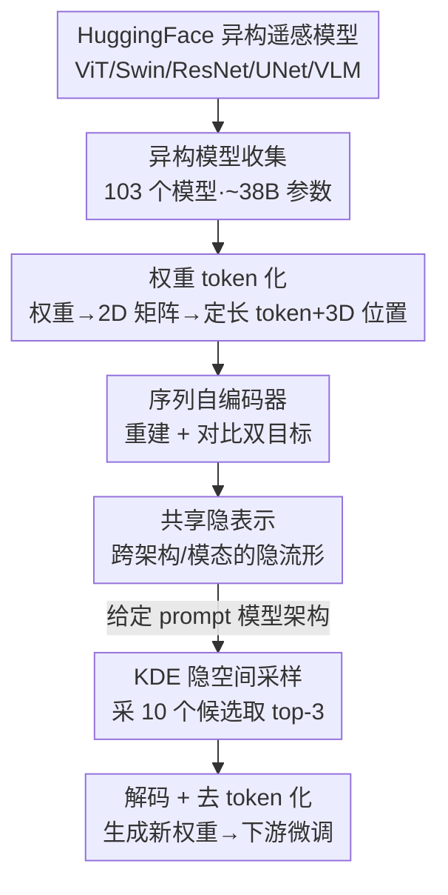

# GeoSANE: Learning Geospatial Representations from Models, Not Data

**会议**: CVPR 2026  
**论文**: [CVF Open Access](https://openaccess.thecvf.com/content/CVPR2026/html/Hanna_GeoSANE_Learning_Geospatial_Representations_from_Models_Not_Data_CVPR_2026_paper.html)  
**代码**: https://hsg-aiml.github.io/GeoSANE/  
**领域**: 遥感 / 权重空间学习  
**关键词**: 遥感基础模型, 权重空间学习, 模型铸造, 权重生成, 隐空间采样

## 一句话总结
GeoSANE 把 103 个现成遥感模型的**权重本身**当成训练数据，用一个权重空间自编码器学到所有模型共享的隐表示，然后按目标架构从隐空间采样、解码出"开箱即可微调"的新模型权重——把遥感预训练从"从卫星数据学"转成了"从模型学"，生成的模型在分类/分割/检测十个数据集上稳超从头训练、匹敌甚至超过 SOTA 遥感基础模型。

## 研究背景与动机
**领域现状**：遥感基础模型（RSFM）这几年井喷，最新综述统计已超过 70 个，每个都在大规模卫星影像上预训练，给分类、分割、检测提供可迁移表示。

**现有痛点**：这些模型是**碎片化、互补**的——每个只专精某些传感器（光学 / 多光谱 / SAR）、某种分辨率、某类任务。用户面对新任务时只能反复纠结"选哪个 RSFM、要不要重新训"，而所有模型的并集其实编码了比任何单一模型都更广的地理空间知识，却没人把它们统一起来。

**核心矛盾**：知识被锁在一个个独立模型的权重里，传统做法（再训一个更大的基础模型）需要海量数据和算力；而模型合并（model merging，如 Model Soups / TIES / DARE）又要求所有模型**同架构、同初始化**，遇到架构各异的遥感模型群直接失效。

**本文目标**：在不依赖原始数据、不要求模型同构的前提下，把一大堆异构遥感模型的知识聚合进一个可复用的表示，并据此按需生成新模型。

**切入角度**：作者借鉴权重空间学习（weight space learning）的新进展——把训练好的神经网络**权重当作一种输入模态**，去学一个模型群体的共享隐流形。HuggingFace 上现成的开源遥感模型就是天然的"权重数据集"。

**核心 idea**：用一个权重空间自编码器学到跨架构、跨模态遥感模型的共享隐表示，再从该隐空间采样生成目标架构的新权重——即"从模型学，而非从数据学"，把数据中心的预训练换成权重中心的生成（weight-centric generation）。

## 方法详解

### 整体框架
GeoSANE 是一个"地理空间模型铸造厂"（model foundry），整条流水线分三个阶段：**①收集**一大批异构遥感模型 → **②训练**一个权重空间自编码器，把这些模型嵌入共享隐表示 → **③生成**：给定一个 prompt 模型（指定目标架构），在隐空间它附近采样并解码出新权重，产出一个与 prompt 同架构、但参数值是新的、可直接下游微调的模型。

输入是一堆训练好的模型权重，输出是按需生成的新模型权重；中间的桥梁是一个把权重序列化成 token、再用 Transformer 编解码的自编码器，其瓶颈层就是"所有模型共享的隐表示"。

### 关键设计

**1. 异构遥感模型收集：把"模型群"当训练集**

针对"知识散落在 70+ 个互补 RSFM 里"这个痛点，GeoSANE 不再去爬卫星数据，而是直接从 HuggingFace Hub 用一组传感器关键词（Sentinel-1/2、SAR、多光谱）和任务标签（土地覆盖、洪水检测、灾害响应）批量检索现成开源模型。它能自动加载并处理各式架构：Transformer 骨干（ViT、Swin）、CNN（ResNet、UNet、MobileNet）、多模态雷达-光学模型、YOLO 检测器、洪水/野火专用模型乃至视觉-语言模型；对 TorchGeo、FLAIR 这类非标准实现还专门写了自定义加载器，并剔除损坏 checkpoint、文档极差或需要不安全远程代码执行的仓库。最终收集到 **103 个遥感模型、约 380 亿参数**——模型个数不多，但单模型参数量从几亿到几十亿，token 总量足够学出强表示。这一步把"选哪个模型"的难题转化为"把所有模型一起喂进来学"。

**2. 权重 token 化：让任意架构变成统一的 token 序列**

要让一个网络同时吃 ViT 和 ResNet 的权重，必须有统一的输入格式。GeoSANE 沿用 [44] 的做法，把每个模型的权重 $w$ 按层 reshape 成 2D 矩阵，再切成固定大小 $d_t$ 的 token $T_n$；维度对不齐时用零填充或拆分，并配一个二值掩码 $M$ 区分真实参数与 padding。每个 token 再加一个 3D 位置编码 $P=[n,l,k]$，分别表示绝对序列位置 $n$、层索引 $l$、层内位置 $k$。训练时把 token 序列切成定长 window 以保证 batch 尺寸统一、并高效处理参数量差异巨大的架构。这套表示是整个方法能"跨架构、跨尺寸"的根基——无论原模型多大、什么结构，最后都变成一串带位置信息的 token，可被同一个序列模型处理，也支持解码出不同长度的序列。

**3. 重建 + 对比双目标的序列自编码器：学出共享隐流形**

骨干是一个 seq-to-seq 自编码器（编解码器都是约 900M 参数的 GPT-2 风格 Transformer），瓶颈即共享隐表示。编码器 $g_\theta$ 把 token 序列映射成隐嵌入 $Z=g_\theta(T,P)$，解码器 $h_\psi$ 重建原 token $\widehat{T}=h_\psi(Z,P)$；另有投影头 $p_\phi$ 把隐嵌入压到低维 $z_p=p_\phi(Z)$ 做对比学习。训练目标把重建项和对比项加权组合：

$$\mathcal{L}_{rec}=\|M\odot(T-\widehat{T})\|_2^2,\quad \mathcal{L}_{c}=\mathrm{NTXent}(z_{p,i},z_{p,j}),\quad \mathcal{L}=(1-\gamma)\mathcal{L}_{rec}+\gamma\mathcal{L}_{c}$$

掩码 $M$ 保证 loss 只在真实参数上算、不被 padding 污染。对比项取同一模型的两个增强视图：一个是原 token 序列，另一个是加噪版本，NT-Xent 让同模型的两个投影嵌入靠近、同时与其他模型的嵌入拉开。一个关键工程点：[44] 原本需要对训练模型逐层归一化权重，这把表示学习限制在同架构模型上；GeoSANE 采用 [12] 的**运行时归一化 loss**（而非预处理归一化权重），从而能学任意架构模型的权重空间表示——这正是它能吃下架构、模态、任务都各异的遥感模型群的前提。

**4. KDE 隐空间采样：按 prompt 架构按需生成新权重**

训练好骨干后，生成阶段不再训练。给定一个 prompt 模型 $a$（如 timm 里 ImageNet 预训练的 ViT-L 或 Swin-B），先 token 化并编码得到其隐表示 $Z_a=g_\theta(T_a)$；然后在 $Z_a$ 周围拟合一个核密度估计器（KDE）并采样 $\tilde z$。这种局部采样既探索了结构上与 prompt 相似的隐空间邻域，又被训练时吸收的地理空间知识塑形。每个采样 $\tilde z$ 经解码器得到合成权重 token $\tilde T=h_\psi(\tilde z)$，再去 token 化还原成网络权重 $\tilde w$——产物与 prompt 同架构、但参数全新，且已"开箱可微调"。采样和解码都只需前向传播，成本极低，所以可以**每个 prompt 生成 10 个候选、按简单性能准则保留 top-$m$=3** 再微调。实际中分类用 ViT-L prompt、分割与检测用 Swin-B prompt。正是这一步让 GeoSANE 既能生成大模型，也能直接生成 ResNet-18 / MobileNetV2 这类轻量网络，绕开了剪枝/蒸馏流水线。

### 损失函数 / 训练策略
GeoSANE 自编码器约 900M 参数。为得到更强的隐表示，先在一个更大的通用 CV 模型语料（HuggingFace，约 7 亿 token）上预训练，再在遥感 token（约 1.65 亿 token）上微调。训练 150 epoch、单张 H100；优化器 AdamW，学习率 $2\times10^{-5}$、权重衰减 $3\times10^{-9}$、OneCycleLR 调度；保留验证 loss 最低的 checkpoint 用于生成。下游微调统一 50 epoch，按最低验证 loss 选最终 checkpoint。

## 实验关键数据

### 主实验

横跨光学、多光谱、SAR 三类模态，覆盖分类、分割、检测，共 10 个数据集。

**vs 从头训练**（同架构、同微调预算）：

| 数据集 | 任务/指标 | 从头训练 | GeoSANE | Δ |
|--------|-----------|----------|---------|-----|
| EuroSAT | 分类 Acc | 95.0 | 99.1 | +4.1 |
| RESISC-45 | 分类 Acc | 78.0 | 96.5 | +18.5 |
| fMoW | 分类 Acc | 35.7 | 58.9 | +23.2 |
| BigEarthNet | 多标签 mAP | 69.8 | 88.7 | +18.9 |
| DFC2020 | 分割 mIoU | 46.8 | 54.3 | +7.5 |
| Sen1Floods11 | 分割 mIoU | 81.0 | 89.6 | +8.6 |
| DIOR | 检测 mAP@0.5 | 67.5 | 79.0 | +11.5 |

在类别多、细粒度标签的难数据集（fMoW、BigEarthNet）上提升最猛（+23.2 / +18.9）。

**vs 现有 RSFM**（Table 2，Δ 相对最强 baseline）：GeoSANE 在 10 个 benchmark 上取得最优或次优，难任务上反超明显——Sen12Flood +1.8、Wildfires +1.6、DFC2020 +4.5、DIOR +0.3；在已被刷得很高的 EuroSAT（-0.3）、RESISC45（-0.8）等上略低于个别专用 SOTA，但都在误差范围内贴平。GEO-Bench 四个分类任务同样取得最优/次优（m-bigearthnet 74.2 +1.1、m-so2sat 65.7 +0.8）。

### 消融与对比分析

| 对比设置 | 关键指标 | 结论 |
|----------|----------|------|
| vs 模型合并 DARE | EuroSAT 99.1 vs 96.4 / RESISC45 96.5 vs 86.1 / BigEarthNet 88.7 vs 69.0 | 合并直接在参数空间平均会因冲突大幅掉点；GeoSANE 在隐空间学关系，远超合并 |
| vs prompt 模型本身 | RESISC45 +4.2 / fMoW +6.5 / BigEarthNet +6.1 / DIOR +5.4 | 生成的权重比直接微调 ImageNet prompt 更强，证明生成过程真的注入了地理空间知识 |
| vs 剪枝/蒸馏（轻量 11M / 3.5M） | BigEarthNet 11M：83.7 vs KD 最佳 67.3（+16.4）；fMoW 11M +10.4 | 直接生成轻量模型几乎全面胜过剪枝/变分 dropout/蒸馏，无需大教师或迭代压缩 |
| 跨架构生成（Table 7） | 同一隐表示生成 MobileNet/ResNet/ViT-B/ViT-L、UNet/Swin、ResNet-50 等 | 一个共享隐空间即可生成多种架构与尺寸，泛化到分类/分割/检测全任务 |

### 关键发现
- **难数据集收益最大**：fMoW、BigEarthNet 这类多类别、细粒度任务上从头训练几乎学不动，GeoSANE 注入的先验把它们拉高 18~23 个点，说明共享隐表示真正聚合了跨模型的地理空间知识。
- **生成 ≠ 合并**：DARE 合并在 BigEarthNet 上只有 69.0、远低于单个 RSFM；GeoSANE 88.7，证明价值来自在隐空间"学权重之间的关系"，而非简单参数插值。
- **轻量化是免费午餐**：传统压缩需要先有大模型再剪/蒸，GeoSANE 直接从隐空间解码出目标尺寸权重，3.5M 的 MobileNetV2 在多数任务也胜过同尺寸蒸馏学生（个别如 fMoW 3.5M -7.8 例外，极小模型容量受限）。
- ⚠️ 论文正文有几处图/节引用残缺（如 "Fig ??"、"Sec ??"），UMAP 可视化细节在补充材料；以原文为准。

## 亮点与洞察
- **把"模型"当数据**：最"啊哈"的点是彻底换了训练原料——不再消化 PB 级卫星影像，而是消化 103 个现成模型的权重，等于把社区已花掉的预训练算力"回收"进一个共享表示。随着开源遥感模型越来越多，这条路天然越走越宽。
- **token 化 + 运行时 loss 归一化 = 吃下异构性**：把权重序列化成带 3D 位置的 token、再用运行时归一化的对比 loss，是它能同时容纳 ViT/Swin/ResNet/UNet/SAR 模型的两根支柱；这思路可迁移到任何"想从异构模型群学共享表示"的场景（不限遥感）。
- **生成与压缩解耦**：按需采样不同架构/尺寸的权重，把"轻量化"从一道独立的剪枝/蒸馏工序变成"换个 prompt 架构"的采样选择，对需要机载部署的遥感尤其实用。

## 局限与展望
- 模型集合仅 103 个、约 380 亿参数，相比常规 ML 数据集"样本数"偏少；虽然单模型参数大补足了 token 量，但模型**多样性**是否够覆盖所有遥感子领域仍待验证。
- 生成的模型与 prompt **同架构**——本质是"给定架构生成好权重"，不能凭空生成全新结构；目标架构得先有个 prompt 模型可编码。
- 极小模型（3.5M）上偶有掉点（fMoW -7.8），说明隐空间解码在容量极受限时也会受架构瓶颈制约。
- ⚠️ 自监督收集 HuggingFace 模型可能带来质量/许可参差，论文靠关键词+过滤把关，但"103 个模型是否真代表整个遥感模型版图"缺少更系统的覆盖度分析。
- 可改进：把 KDE 局部采样换成更可控的条件生成（按下游任务/模态显式 condition）、或引入架构生成能力，进一步松绑"同架构"约束。

## 相关工作与启发
- **vs 遥感基础模型（SatMAE / Scale-MAE / CROMA / DOFA / TerraFM 等）**：它们从卫星数据预训练单个模型；GeoSANE 从这些模型的权重学共享表示并生成新模型，是"元一层"——把它们当原料而非竞品，性能上匹敌甚至在难任务超过它们。
- **vs 模型合并（Model Soups / TIES / DARE）**：合并要求同架构同初始化、靠参数平均/插值，冲突时掉点严重；GeoSANE 在隐空间学权重间关系、不限架构，BigEarthNet 上 88.7 vs 合并 69.0。
- **vs 权重生成（Hypernetworks / Hyper-Representations / G.pt / D2NWG）**：前作多局限于同构模型群或纯 RGB 分类视觉模型；GeoSANE 首次从**根本异构架构 + 非 RGB 模态**学习，并把任务从分类扩到逐像素分割与目标检测。
- **vs 剪枝/蒸馏压缩**：传统压缩需先有大模型再迭代剪/蒸；GeoSANE 直接生成目标尺寸权重，省掉教师与压缩流水线，且效果更好。

## 评分
- 新颖性: ⭐⭐⭐⭐⭐ "从模型学而非从数据学"在遥感语境首次落地，把权重空间学习推到异构架构+多任务，范式很新
- 实验充分度: ⭐⭐⭐⭐⭐ 10 数据集 + GEO-Bench，覆盖分类/分割/检测三任务、光学/多光谱/SAR 三模态，并系统对比从头训练/RSFM/合并/剪枝蒸馏/prompt
- 写作质量: ⭐⭐⭐⭐ 动机清晰、Q1-Q5 组织得当，但正文多处图/节引用残缺（Fig ??/Sec ??），部分细节甩到补充材料
- 价值: ⭐⭐⭐⭐⭐ 给"如何复用社区已有遥感模型"提供了可扩展的新路径，且能按需出轻量模型，实用性强

<!-- RELATED:START -->

## 相关论文

- [\[CVPR 2026\] Data Leakage Detection and De-duplication in Large Scale Geospatial Image Datasets](data_leakage_detection_and_de-duplication_in_large_scale_geospatial_image_datase.md)
- [\[CVPR 2026\] UniGeoSeg: Towards Unified Open-World Segmentation for Geospatial Scenes](unigeoseg_towards_unified_open-world_segmentation_for_geospatial_scenes.md)
- [\[CVPR 2026\] GeoDiT: A Diffusion-based Vision-Language Model for Geospatial Understanding](geodit_a_diffusion-based_vision-language_model_for_geospatial_understanding.md)
- [\[ECCV 2024\] Learning Representations of Satellite Images From Metadata Supervision](../../ECCV2024/remote_sensing/learning_representations_of_satellite_images_from_metadata_supervision.md)
- [\[CVPR 2026\] ZoomEarth: Active Perception for Ultra-High-Resolution Geospatial Vision-Language Tasks](zoomearth_active_perception_for_ultra-high-resolution_geospatial_vision-language.md)

<!-- RELATED:END -->
