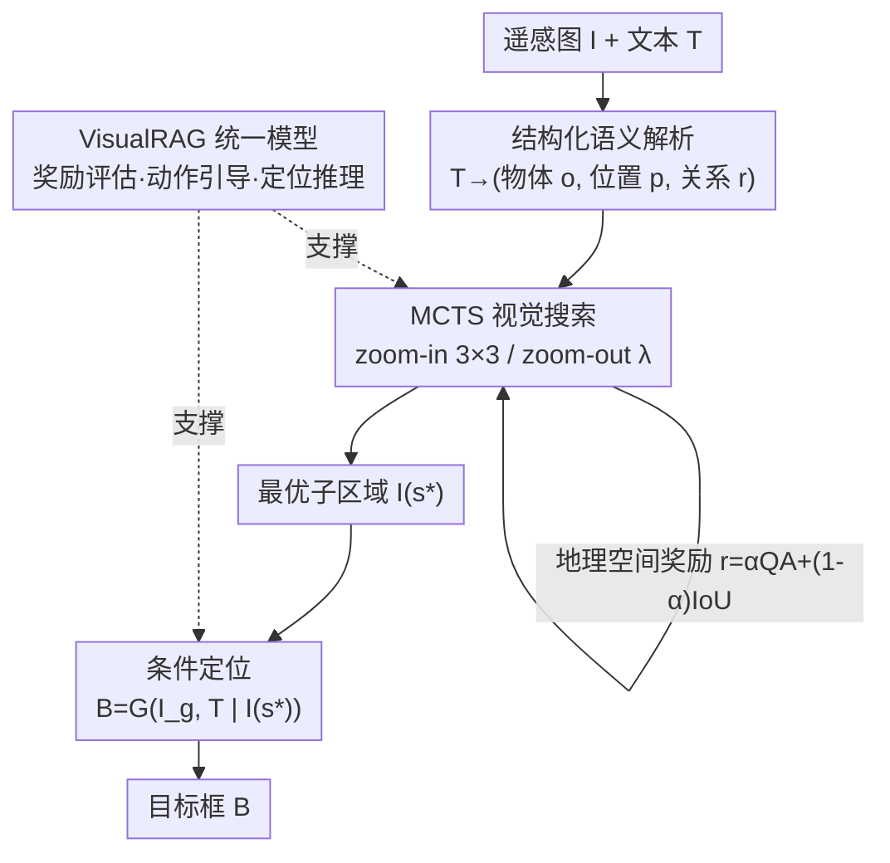

# GeoViS: Geospatially Rewarded Visual Search for Remote Sensing Visual Grounding

**会议**: CVPR 2026  
**论文**: [CVF Open Access](https://openaccess.thecvf.com/content/CVPR2026/html/Zhang_GeoViS_Geospatially_Rewarded_Visual_Search_for_Remote_Sensing_Visual_Grounding_CVPR_2026_paper.html)  
**代码**: https://github.com/Zhang-Peirong/GeoVis  
**领域**: 遥感视觉定位 / 多模态VLM  
**关键词**: 遥感视觉定位, 视觉搜索, MCTS, 地理空间奖励, MLLM  

## 一句话总结
GeoViS 把遥感视觉定位从"一步回归出框"改写成"先用奖励引导的树状视觉搜索找到最可能含目标的子区域、再以该子区域为视觉线索做条件定位"的两阶段过程，靠一个统一的 VisualRAG 模型同时提供奖励评估、动作引导和定位推理，在五个遥感 grounding 基准上把 Pr@0.5 等指标做到 SOTA。

## 研究背景与动机
**领域现状**：视觉定位（visual grounding）要把一句文本描述对应到图像里的具体区域。随着多模态大模型（MLLM）的发展，自然图像上的细粒度跨模态对齐已经做得很好，主流遥感方法也大多沿用"把整图喂进模型、一步预测目标框"的范式。

**现有痛点**：遥感场景搬过来后这条范式直接崩。一是**目标极小**——一张图覆盖公里级范围，飞机、船、储油罐这类目标只占全图极少像素，作者称之为"有效分辨率（effective resolution）"极低：目标像素占全图比例太小，经过全局编码后细节被抹平，一步预测根本看不清。简单放大输入或切 patch 并不改变有效分辨率。二是**查询里全是复杂地理空间关系**——遥感描述常常不是"某个物体"，而是"中间那片网球场里、右下角第一个、且在停车场右边的那个网球场"，需要模型先识别一类物体、再比较相对大小/位置、再结合周边参照物推理，单步预测缺乏层级化的空间建模能力。

**核心矛盾**：要看清小目标就得聚焦局部、提升有效分辨率，但聚焦局部又会丢掉理解空间关系所需的全局上下文——"看得清细节"和"保得住全局关系"在一步预测里无法兼得。已有的多步推理（CoT / 强化学习）虽然能缓解，却普遍依赖外部检测器或需要构造大规模奖励数据集，成本高、在遥感上难以泛化。

**本文目标**：让模型在大尺度遥感图里既能定位到细小目标，又能保持对整体场景的关系感知，且不依赖外部检测器、不依赖昂贵的 RL 数据。

**切入角度**：作者的前期实验（Sec 4.6）发现，只要模型能（i）正确解析文本里的地理空间语境，并（ii）把一个"可能含目标的候选区域"作为额外视觉输入来提高有效分辨率，定位精度就会大幅提升。这两样东西被合称为**视觉线索（visual cues）**。于是问题转化为：如何在又大又杂的遥感图里自动发现可靠的视觉线索。

**核心 idea**：把 grounding 重构成"地理空间奖励引导的视觉搜索"——像人一样在全图上逐步、由粗到细地探索，用一个量化"某区域有多符合视觉线索"的地理空间奖励来引导搜索逼近目标，找到子区域后再做条件定位。

## 方法详解

### 整体框架
给定遥感图 $I$ 和文本描述 $T$，GeoViS 把"预测目标框 $B$"拆成两个顺序阶段：**视觉搜索**和**视觉定位**。第一阶段先把文本解析成结构化的地理空间语境，然后在全局图上做一次奖励引导的层级化树搜索（MCTS），让候选区域从全局逐步收缩到最可能含目标的子区域 $I(s^\star)$；第二阶段以这个子区域作为先验视觉线索，在全局图上做**条件定位**，输出最终框。整条流水线由统一的 **VisualRAG 模型**支撑——它在搜索阶段提供奖励评估和动作引导，在定位阶段提供 grounding 推理，三种能力共享同一个多模态骨干，从而把"探索—验证—定位"串成连贯的逐步推理。

### 关键设计

**1. 两阶段重构：把"一步出框"改成"搜索 → 条件定位"的 MDP**

直接学映射 $B=f(I,T)$ 忽略了人在大图里找小目标时"逐步逼近"的过程，在极端尺度和复杂上下文下表现很差。GeoViS 把搜索建模成马尔可夫决策过程 $M=(S,A,T,R)$：状态 $s_t$ 表示全局图里的一个候选区域（含空间坐标和多模态特征），动作把区域变换到新状态 $s_{t+1}=\mathcal{T}(s_t,a_t)$，定位模型对每个区域打一个标量奖励 $r_t=\mathcal{R}(s_t,a_t)$ 来衡量它和文本的语义相关性。这样就能用蒙特卡洛树搜索（MCTS）做基于推理的探索：选择阶段按 UCT 规则挑子节点
$$a^*=\arg\max_{a\in\mathcal{A}(s)}\Big[Q(s,a)+c\sqrt{\tfrac{\ln N(s)}{N(s,a)+\varepsilon}}\Big],$$
其中 $Q(s,a)$ 是动作平均回报、$N$ 是访问计数、$c$ 平衡探索与利用；随后扩展—模拟（用定位模型对新区域打奖励 $r_t$）—回传，反复 rollout 让搜索树逐渐收敛到高期望奖励的区域，从全局到局部自我引导地收缩搜索空间。搜索返回累计奖励最高的节点 $s^\star$ 后，第二阶段做**条件定位** $B=\mathcal{G}(I_g,T\mid I(s^\star))$：把搜到的子区域当作区域级先验视觉线索，约束搜索空间、提升目标区域的有效分辨率，让模型聚焦到语义和视觉都相关的细节上再投影回全局图。相比直接从 $(I_g,T)$ 预测，这一步把"看不清小目标"的问题用一个高分辨率候选区域补上了。

**2. 结构化地理语义解析驱动的粗到细动作空间**

遥感查询常常用属性和空间关系来描述物体而非直接给名字，所以 GeoViS 先把查询 $T$ 转成结构化表示 $\hat{T}=\Phi(T)=\{o,p,r\}$，其中 $o$ 是目标物体、$p$ 是空间属性、$r$ 是与其它实体的关系参照。这个三元组为后续区域级动作提供可解释的语义指引，让模型把地理语境的每个成分对应到搜索时的视觉转移上。动作空间模仿人"由粗到细"的搜索行为，只有两个互补操作 $A=\{\mathcal{T}_{\text{in}},\mathcal{T}_{\text{out}}\}$：**zoom-in** 把当前区域划成 $3\times3$ 网格，在 $\hat{T}$ 指引下选中其中一个子格 $s_{t+1}=\mathcal{T}_{\text{in}}(s_t,a_t)=R_{i,j}(s_t)$，聚焦到可能含目标的更细子区域；**zoom-out** 把当前区域按固定系数 $\lambda>1$ 放大 $s_{t+1}=\mathcal{T}_{\text{out}}(s_t,a_t)=\lambda\cdot s_t$，在之前探索过度局部化时找回上下文、维持对全局场景结构的感知。每个节点同时评估两种动作生成新候选状态，让搜索树在局部探索和全局上下文推理之间层级化平衡——这正是"既看清小目标又保住全局关系"那对矛盾的解法。

**3. 地理空间奖励：QA 奖励 + IoU 奖励的加权组合**

搜索能不能逼近目标，全靠奖励函数 $\mathcal{R}(s_t,a_t)$ 给每个模拟节点打分。GeoViS 把奖励拆成两项互补信号。第一项是**问答奖励（QA reward）**，从概念层面评估候选区域和语言描述的语义一致性：给定全局图 $I_g$、候选区域 $I(s_t)$ 和地理语境 $\hat{T}$，VisualRAG 对目标物体 $o$、空间属性 $p$、关系参照 $r$ 逐个做二值判断，奖励 $r_{\text{QA}}\in[0,1]$ 定义为正向回答的归一化比例。第二项是**IoU 奖励**，提供几何监督：VisualRAG 预测当前区域内主物体 $o$ 的框 $B_t$，与一个虚拟中心区域 $B_c$（以 $I(s_t)$ 为中心、宽高各取一半）算交并比 $r_{\text{IoU}}$，鼓励搜索把目标摆到区域里一个合理且紧凑的位置。最终奖励按加权归一化合并：
$$r_t=\alpha\,r_{\text{QA}}+(1-\alpha)\,r_{\text{IoU}},\quad r_t\in[0,1],$$
$\alpha$ 控制语义验证和几何一致性的相对贡献。语义对（QA）保证找对了"是什么/在哪种关系下"，几何紧凑（IoU）保证框得准，两者一起构成一个平衡的地理空间奖励来驱动有效探索。⚠️ 论文正文写最优 $\alpha=0.1$（即几何项占主导），与"两项都重要"的表述需结合 Fig.4 看，以原文为准。

**4. VisualRAG 统一模型：奖励/动作/定位三合一**

为了让搜索和定位用同一套感知推理能力，作者设计了 **Visual Reward–Action–Grounding（VisualRAG）模型**，就是一个标准 MLLM 架构（图像编码器 + 投影层 + 大语言模型骨干），输入全局图 $I_g$、候选区域 $I(s_t)$ 和结构化描述 $\hat{T}$，统一提供三种能力：**奖励评估**同时判断三元组 $(o,p,r)$ 的语义正确性和检测区域的空间一致性，产出上面那个统一奖励；**动作引导**评估 $3\times3$ 子格、选出一个来实例化 zoom-in 动作；**定位推理**基于当前区域和描述预测目标在全局图里的位置。训练时用四种原子操作监督：QA 奖励（问答语义验证）、IoU 奖励（物体级定位的空间监督）、zoom-in 动作（$3\times3$ 网格的层级区域选择）、条件定位（用全局图+所选区域联合输入预测目标框）。把搜索拆成这些可训练的原子步骤、并据此构造任务专属数据，正是 GeoViS 绕开"外部检测器"和"昂贵 RL rollout"的关键——它用一个共享模型把探索、验证、最终定位连成可解释的逐步流程。

### 损失函数 / 训练策略
VisualRAG 从 Qwen2.5-VL-3B-Instruct 初始化，全参数微调（vision tower、多模态投影、语言骨干全部解冻），在 8×A800 上用 LLaMA-Factory 训练 1 个 epoch、batch size 8；AdamW，初始学习率 $1\times10^{-5}$，weight decay 0.01，cosine 退火 + 10% warm-up，梯度裁剪 norm 1.0，最大输入 8192 token。推理时 MCTS 每个查询做 10 次模拟、最大搜索深度 5，奖励权重系数取 0.1。

## 实验关键数据

### 主实验
五个遥感 grounding 基准（DIOR-RSVG、VRSBench、GeoChat、RSVG-HR、OPT-RSVG），评估 Pr@0.5 / Pr@0.7 / meanIoU。GeoViS 基于 Qwen2.5-VL-3B 训练，在所有数据集上超过通用 MLLM 与遥感专用 MLLM，并逼近专用 specialist 定位模型。

| 数据集 | 指标 | GeoViS | 之前最强对比 | 说明 |
|--------|------|--------|--------------|------|
| DIOR-RSVG | Pr@0.5 | 79.8 | GeoGround 77.7 | 比强通用 MLLM 高近 +30% |
| VRSBench | Pr@0.5 | 68.5 | SkySenseGPT 63.5 | 超最强 RS MLLM +5% |
| VRSBench | Pr@0.7 | 45.7 | GLM-4.1V 35.7 | — |
| GeoChat | Pr@0.5 | 23.7 | Geochat 22.7 | 对话式查询下稳定 |
| RSVG-HR | Pr@0.5 | 51.5 | Qwen3-VL-4B 47.7 | 高分辨率小目标 |
| OPT-RSVG | Pr@0.5 | 70.3 | Qwen3-VL-4B 43.9 | 多尺度多源 |

整体相比关键定位指标提升约 5–15%，跨数据集、跨分辨率均稳定，验证了地理空间奖励引导的视觉搜索机制可迁移。

### 消融实验

| 配置 | Pr@0.5 (DIOR) | 说明 |
|------|---------------|------|
| Global only | 71.2 | 只用全场景图训练 |
| Global + Local | 82.9 | 额外给目标附近裁剪区域 → +11.7，证明局部视觉线索提有效分辨率 |

原子操作逐步加回（ViT 冻结快速验证）：

| 配置 | zoom-in | $r_{\text{QA}}$ | $r_{\text{IoU}}$ | Pr@0.5 |
|------|---------|-----|------|--------|
| Baseline（zero-shot Qwen2.5-VL-3B） | × | × | × | 69.5 |
| +zoom-in | ✓ | × | × | 70.2 |
| +zoom-in +rQA | ✓ | ✓ | × | 71.2 |
| +zoom-in +rIoU | ✓ | × | ✓ | 73.2 |
| Full model | ✓ | ✓ | ✓ | 74.5 |

跨数据集泛化（DIOR-RSVG 训练 → 迁移）：

| 设置 | VRSBench Pr@0.5 | OPT-RSVG Pr@0.5 |
|------|-----------------|------------------|
| Zero-shot | 37.3 | 29.4 |
| Fine-tuned | 39.3 | 33.6 |
| GeoViS | 49.0 | 41.0 |

### 关键发现
- **有效分辨率是命门**：仅"全局 vs 全局+局部"一项对比就在 DIOR 上带来 +11.7 Pr@0.5，直接论证了"给一个含目标的局部区域当视觉线索"的价值，这也是整套 GeoViS 的动机来源。
- **几何奖励比语义奖励更解题**：单加 $r_{\text{IoU}}$（73.2）比单加 $r_{\text{QA}}$（71.2）涨得多；奖励平衡 $\alpha$ 在 0.1 处最优，偏向任一端都会掉点，说明 QA 管"找对类别/关系"、IoU 管"框得准"，两者缺一不可。
- **原子操作可加性强且可迁移**：每加一个原子步骤都稳定涨点，且学到的原子操作在跨数据集迁移时明显超过 zero-shot 与 fine-tuned 基线（VRSBench 49.0 vs 39.3），说明搜索推理模式本身具有可迁移性。

## 亮点与洞察
- **"提升有效分辨率"这个问题定义很准**：作者没有泛泛说"小目标难"，而是把它量化成"目标像素占比"，并指出放大输入/切 patch 改不了它——只有"找到含目标的局部区域当额外输入"才真正提升，这把动机和方法精准接上了。
- **不依赖外部检测器、不靠 RL rollout**：把视觉搜索拆成 zoom-in/zoom-out + QA/IoU 四个可训练原子操作，既能自动造训练数据，又避开了 V*/DyFo 那类对强检测器的依赖和 RL 方法的高昂数据成本，这在遥感这种高质量数据稀缺的场景里是关键工程取舍。
- **一个模型担三职**：VisualRAG 用同一骨干兼任奖励评估、动作引导、条件定位，搜索和定位共享表示，省掉了多模型拼接的工程复杂度，也让逐步推理过程天然可解释（搜索路径可视化）。

## 局限与展望
- 推理引入 MCTS（10 模拟 × 深度 5），相比一步预测会显著增加推理开销，论文未给延迟/吞吐分析，实时遥感应用需评估。
- 在 GeoChat 上 Pr@0.5 仅 23.7，绝对值偏低，且这是过滤后的单目标子集；对话式/噪声指令下方法优势没有其它数据集明显。
- ⚠️ zoom-out 系数 $\lambda$、$3\times3$ 网格粒度、奖励 $\alpha$ 等结构超参对结果敏感（$\alpha$ 已显示敏感），但网格粒度、搜索深度的系统性消融较少；动作空间只有 in/out 两种、固定 $3\times3$，对超大场景或目标贴边的情形可能不够灵活。
- 仍依赖前置的结构化语义解析 $\Phi(T)$ 把查询拆成 $(o,p,r)$，解析质量会直接影响动作引导，论文对解析本身的鲁棒性着墨不多。

## 相关工作与启发
- **vs V\* / DyFo（自然图视觉搜索）**：它们也把搜索建模成 crop/zoom/shift 序列或 MCTS 聚焦，但都依赖强外部检测器，在遥感上难部署、目标小或歧义时误差累积；GeoViS 不用检测器、不用 RL，靠 reward 驱动的原子操作完成搜索。
- **vs DeepEye / Mini-o3（RL 视觉搜索）**：它们用强化学习策略序列化选 glimpse 或蒸馏 o3 缩放行为，但需要大规模 curated 数据和昂贵 rollout，难扩展到数据有限的遥感；GeoViS 用 QA+IoU 奖励 + 原子操作高效造数据。
- **vs GeoGround / SkySenseGPT / EarthGPT 等遥感 MLLM**：它们多沿用一步预测或增强架构/交互，仍受困于极低有效分辨率；GeoViS 用"搜索 → 条件定位"显式提升有效分辨率，在多数基准上反超。

## 评分
- 新颖性: ⭐⭐⭐⭐ 把遥感 grounding 重构成奖励引导的视觉搜索、且不依赖检测器/RL，问题定义（有效分辨率）和解法都比较新。
- 实验充分度: ⭐⭐⭐⭐ 五个基准 + 有效分辨率/原子操作/α/跨数据集多组消融较完整，但缺推理成本分析。
- 写作质量: ⭐⭐⭐⭐ 动机—方法—实验衔接清楚，公式 OCR 略有噪声、α 表述需对照图。
- 价值: ⭐⭐⭐⭐ 为遥感小目标定位给出可迁移、可解释且工程可行的范式。

<!-- RELATED:START -->

## 相关论文

- [\[CVPR 2026\] Improving Visual Grounding in Remote Sensing via Cluster-Guided Refinement and Model Ensemble Voting](improving_visual_grounding_in_remote_sensing_via_cluster-guided_refinement_and_m.md)
- [\[CVPR 2026\] RECS4R: Bridging Semantics and Geometry for Referring Remote Sensing Interpretation](recs4r_bridging_semantics_and_geometry_for_referring_remote_sensing_interpretati.md)
- [\[CVPR 2026\] Fast Kernel-Space Diffusion for Remote Sensing Pansharpening](fast_kernel-space_diffusion_for_remote_sensing_pansharpening.md)
- [\[CVPR 2026\] GeoCoT: Towards Reliable Remote Sensing Reasoning with Manifold Perspective](geocot_towards_reliable_remote_sensing_reasoning_with_manifold_perspective.md)
- [\[CVPR 2026\] Prompt-Free Unknown Label Generation for Open World Detection in Remote Sensing](prompt-free_unknown_label_generation_for_open_world_detection_in_remote_sensing.md)

<!-- RELATED:END -->
