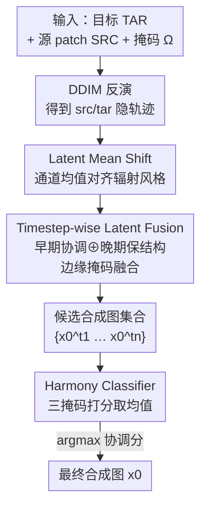

# HarmoniDiff-RS: Training-Free Diffusion Harmonization for Satellite Image Composition

**会议**: CVPR 2026  
**arXiv**: [2604.19392](https://arxiv.org/abs/2604.19392)  
**代码**: https://github.com/XiaoqiZhuang/HarmoniDiff-RS (有)  
**领域**: 遥感 / 扩散模型 / 图像合成  
**关键词**: 卫星图像合成、图像协调(harmonization)、扩散隐空间、DDIM 反演、免训练

## 一句话总结
把一块卫星图源 patch 贴到另一张目标卫星场景里时，HarmoniDiff-RS 不做任何训练或微调，仅在扩散隐空间里先做通道均值对齐统一辐射风格，再用「早期反演隐变量负责协调、晚期隐变量负责保结构」的逐时间步融合消除硬边界，最后用一个轻量协调分类器自动挑出最和谐的候选，在自建的 RSIC-H 基准上取得最高 Harmony Score(0.225) 与最低边界梯度差(BGD 4.88)。

## 研究背景与动机
**领域现状**：卫星图像合成（把建筑、道路、港口等源区域拼进目标场景）对数据增广、灾害模拟、城市规划很有价值，但一直是遥感里被忽视的问题。自然图像合成（FreeCompose、Tale、TF-ICON 等）已经很成熟，主流靠扩散生成先验做前景—背景的语义对齐与无缝融合。

**现有痛点**：自然图像那套方法搬不到卫星图上。其一，它们普遍允许**形变源前景**（让羊从站姿变坐姿去贴合背景），但卫星场景里的源是建筑、道路、港口这类**刚性结构**，几何一旦被扭曲就不真实了。其二，它们依赖**实例级分割掩码**来界定前景边界，而卫星影像几乎拿不到精确的源轮廓。

**核心矛盾**：卫星合成的真正难点从「语义对齐」转移到了「边界协调 + 辐射一致性」——要在**保持源几何刚性**的前提下，让贴上去的 patch 在光照、色调、季节、传感器等跨域差异下和目标场景看起来像同一次成像，同时消掉拼贴硬边。形变和分割掩码这两个自然图像的常用工具在这里都不能用。

**本文目标**：定义并解决「真实卫星图像合成」这个新任务——把刚性源区域协调进目标场景，保证边界平滑、外观一致，且不改动原始几何；并且要做到无需任何训练 / 在线优化 / 微调。

**切入角度**：作者发现 DDIM 反演轨迹上不同时间步的隐变量有**互补特性**——靠近噪声的早期反演隐变量更"协调"但不保身份，靠后的晚期隐变量保结构却留硬边。既然两端各有所长，那就分工融合，而不是只取其一。

**核心 idea**：完全在扩散隐空间里操作——用通道均值平移统一辐射统计，用边缘掩码把"早期协调隐变量"和"晚期保结构隐变量"逐步融合，再让一个分类器自动选最优候选，从而免训练地拿到既保几何又无缝的合成结果。

## 方法详解

### 整体框架
输入是一张目标场景图 TAR、一块源 patch SRC 和粘贴区域掩码 $\Omega$；输出是一张协调后的无缝合成卫星图。整条管线在隐空间里走三步：先把源 patch 的隐变量做 **Latent Mean Shift** 把辐射/风格统计对齐到目标；再在一组"协调时间步"上做 **Timestep-wise Latent Fusion**，用边缘掩码把早期协调隐变量和晚期保结构隐变量融合，得到一批候选合成图；最后由 **Harmony Classifier** 给每个候选打协调分，选分数最高的作为最终输出。整套流程不训练扩散模型、不在线优化，只复用 DiffusionSat 的生成先验。

### 关键设计

**1. Latent Mean Shift：用通道均值平移免训练地统一辐射风格**

跨域贴图最先暴露的问题是源 patch 和目标场景在光照、色调、季节、传感器上的辐射差异——直接贴上去颜色明显不搭。作者借鉴"扩散隐空间的通道统计编码了全局外观和风格"这一发现，假设**逐通道均值就是一个轻量的风格控制器**。给定源反演隐变量 $\text{src}_t$、目标反演隐变量 $\text{tar}_t$ 和粘贴区域 $\Omega$，对每个通道 $c$ 计算均值差 $\Delta^c = \mu_{\text{tar}_t^c} - \mu_{\text{src}_t^c}$，把源隐变量整体平移 $\tilde{\text{src}}_t^c = \text{src}_t^c + \Delta^c$，再只在 $\Omega$ 区域内用平移后的源隐变量替换目标隐变量。这样无需任何训练就把目标场景的辐射特征"过户"给了源 patch，统一了光照和色谱平衡。但它只解决颜色风格，消不掉拼贴硬边，所以需要下一步

**2. Timestep-wise Latent Fusion：让早期隐变量补边界、晚期隐变量守几何**

Mean Shift 之后硬边界依然在。作者观察到 DDIM 反演轨迹的关键互补性：**早期（靠近噪声）反演隐变量做出来的图更协调但不保身份，晚期隐变量保住结构语义却留下明显硬边**。设计就建立在这个观察上。对一组协调时间步 $\text{ht}\in\{t_1,\dots,t_n\}$，先用 Mean Shift 得到组合隐变量并 DDIM 采样到一个预设的"保结构时间步" $t_p$。由于不一致主要集中在源边界，作者沿边界构造边缘掩码 $M_{edge}=\text{dilate}(\Omega,w)-\text{erode}(\Omega,w)$，即把掩码膨胀和腐蚀的差作为一圈窄边带。在 $t_p$ 到 $t_0$ 的去噪过程中，每一步都把两路隐变量按边缘掩码融合：

$$z_{t-1} = M_{edge}\cdot z_{t-1}^{edge} + (1-M_{edge})\cdot z_{t-1}^{p}$$

其中 $z_{t-1}^{edge}=\text{DDIM}(z_t)$ 是负责协调的那路（只作用在边界带），$z_{t-1}^{p}$ 是 Mean Shift 出来的保结构那路（作用在边界带外）。这样边界区域交给协调能力强的隐变量去"填缝"，内部区域交给保身份的隐变量守住几何，同时拿到边界平滑和结构保真——这正是单取早期或晚期都做不到的

**3. Harmony Classifier：免人工地从一组候选里自动挑最和谐的那张**

不同时间步在"全局协调 vs 身份保持"之间的权衡不同，得到的是一批候选图 $\{x_0^{t_1},\dots,x_0^{t_n}\}$，哪张最好难以解析地判断。作者训练一个轻量的遥感协调分类器 $C_\psi$（ResNet-18），输入是 RGB 图与粘贴区域二值掩码的拼接，输出该区域是否视觉协调的概率。正样本是 RSIC-H 的真实背景图，负样本由随机 copy-paste 和泊松融合合成，共 2 万样本 1:1，训练 5 个 epoch。为提升空间鲁棒性，对原始掩码、膨胀掩码、腐蚀掩码三种配置各打一次分取均值，最后选协调分 $s$ 最高的 $x_0^{t^*}$ 作为输出。这个分类器主要用于**自动化选择和定量评估**；实际使用时也可人工从候选里挑

### 损失函数 / 训练策略
扩散主干完全免训练——直接用 DiffusionSat（在 SD 2.1 上用遥感数据微调的版本）做基模型，采样步数压到 20，引导尺度 3.5，协调时间步集设为 6–14、保结构步集设为 15–20。唯一需要训练的是轻量 Harmony Classifier（ResNet-18，2 万样本 / 5 epoch / 单张 A100）。提示词模板为 "A satellite image of a [源标签] in [目标国家]"，并喂入目标场景元数据帮助保持全局辐射特征。

## 实验关键数据

### 主实验
RSIC-H 基准从 fMoW 构建，采样 413 张目标场景 + 381 张源图，用 GSD 元数据做尺度对齐避免源—目标比例失配。评测三指标：FID(↓ 真实度)、Harmony Score HS(↑ 协调度)、Boundary Gradient Difference BGD(↓ 边界平滑度，$\text{BGD}_{abs}=|\mu_{\Gamma_{in}}(G)-\mu_{\Gamma_{out}}(G)|$，即内外边界环梯度均值差，$w=3$ 像素)。

| 方法 | FID ↓ | HS ↑ | BGD ↓ |
|------|-------|------|-------|
| Copy-Paste | 94.44 | 0.058 | 33.93 |
| Poisson Blending | **90.66** | 0.173 | 8.70 |
| Poisson Blending + VAE | 96.07 | 0.184 | 7.04 |
| SD2 Inpainting | 97.92 | 0.084 | 9.18 |
| SD2 + FreeCompose | 97.25 | 0.076 | 30.28 |
| SD2 + HarmoniDiff-RS | 95.32 | 0.217 | 6.48 |
| **Sat + HarmoniDiff-RS (本文)** | 92.38 | **0.225** | **4.88** |

本文取得最高 HS(0.225) 和最低 BGD(4.88)，说明插入区域和周边最协调、边界最平滑。FID 排第二，略逊于泊松融合(90.66)——因为泊松融合不改输入像素、保留了原始高频细节，而 FID 强烈偏好这点。为澄清这一效应，作者额外测了 PB+VAE 变体（先过同一 VAE 编解码再泊松融合），其 FID 也退化到与本文相当(96.07)，证明 FID 差距主要来自**当前扩散主干 VAE 压缩**而非协调质量。

### 消融实验
| 配置 | FID ↓ | HS ↑ | CLIP ↑ | 说明 |
|------|-------|------|--------|------|
| INIT (copy-paste) | 94.44 | 0.06 | 1.00 | 直接贴 |
| + LMS | 91.95 | 0.15 | 0.95 | 加通道均值对齐 |
| + TWR | 117.81 | **0.74** | 0.85 | 逐步重建选最协调，保真崩了 |
| + LTF (本文) | 92.38 | 0.22 | 0.95 | 早晚隐变量边缘融合 |

LMS 把源 patch 隐统计对齐目标，明显降 FID(94.44→91.95)。TWR(Timestep-wise Reconstruction，独立从每个反演时间步重建并选最高协调分)把 HS 拉到 0.74 但 FID 暴涨到 117.81、CLIP 掉到 0.85，说明丢了大量身份信息——纯追协调会牺牲保真。最终的 LTF(Late Timestep Fusion)用边缘掩码融合早晚隐变量，把 FID 拉回 92.38、CLIP 回到 0.95，同时 HS 保持 0.22，取得保真与协调的平衡。

### 关键发现
- **早晚隐变量融合是核心**：单纯追协调的 TWR 会让 FID 从 ~92 飙到 117.81、CLIP 从 0.95 掉到 0.85，正是 LTF 的边缘掩码融合把保真度救了回来，体现"分工融合"而非"二选一"的价值。
- **FID 的劣势是 VAE 而非方法**：PB+VAE 对照实验把泊松融合的 FID 从 90.66 拖到 96.07，证明本文 FID 差距来自隐空间 VAE 压缩对高频纹理（屋顶、道路、停车网格）的平滑，换一个重建更好的隐模型即可即插即用地提升。
- **专用主干更优**：同一套 HarmoniDiff-RS，SD2 版 HS 0.217 已超其它 SD2 基线，换成遥感专用的 DiffusionSat 主干后 HS 进一步升到 0.225、BGD 降到 4.88。

## 亮点与洞察
- **把"扩散反演时间步"当成可调的协调—保真旋钮**：早期隐变量协调强、晚期隐变量保结构，本文不是选一个折中点而是用边缘掩码让两者在空间上分工（边界用早期、内部用晚期），这个"时间步互补性 + 空间掩码融合"的组合很巧妙，可迁移到任何需要"局部大改、整体保真"的扩散编辑任务。
- **通道均值平移当风格控制器**：用一行 $\Delta^c=\mu_{tar}-\mu_{src}$ 就完成跨域辐射对齐，免训练、几乎零成本，对遥感这种缺标注的领域特别实用。
- **诚实区分了指标与质量**：作者主动做 PB+VAE 对照，把自己 FID 落后的原因归到 VAE 压缩而非方法本身，避免读者误读 FID 排名——这种自我归因的实验设计值得学习。
- **训练—免训练的清晰边界**：扩散主干全程免训练，只训一个 ResNet-18 分类器，且明确说明分类器主要为自动化评测、实际可人工选，把"免训练"这个卖点落到了实处。

## 局限与展望
- **继承 VAE 重建瓶颈**：方法在隐空间操作，屋顶纹理、路线、停车网格等高频结构经 VAE 编解码后被平滑，导致 FID 比像素域的泊松融合差一截。作者寄望未来重建更好的隐模型即插即用解决。
- **作者承认的失败案例**：① 源 patch 与目标场景语义严重不匹配时协调困难、可能产生不自然结构；② 边缘融合没有显式像素级语义引导，偶尔出现模糊过渡纹理；③ 对投射阴影控制有限，可能产生物理不一致的阴影。
- **自己发现的局限**：HS 这一核心指标由作者自训的分类器给出（既当方法组件又当评测指标），存在一定自证风险；BGD 只衡量边界梯度差，无法反映语义层面的合理性；RSIC-H 仅 ~400 量级样本、全部来自 fMoW，跨数据集泛化未验证。
- **改进思路**：在边缘融合里引入显式语义/阴影引导（如 ControlNet 类条件）可缓解失败案例 ②③；用更强重建的隐模型或像素域 refine 后处理可补 FID。

## 相关工作与启发
- **vs 泊松融合 (Poisson Editing)**: 它在像素域平滑边界梯度、不改输入像素故 FID 最低(90.66)，但只用低层线索、无法消除真正的边界缝合与语义不一致(BGD 8.70)；本文在隐空间做语义+辐射双重协调，BGD 降到 4.88 但因 VAE 压缩 FID 略逊。
- **vs FreeCompose**: 自然图像协调方法，靠条件/无条件扩散引导差异定位不协调区域，但依赖实例分割掩码且假设可形变前景；用在遥感上（只能给矩形掩码）几乎不改动粘贴内容，HS 仅 0.076，说明它处理不了遥感域偏移。
- **vs SD2 Inpainting**: 把粘贴内容当硬先验只改掩码内像素，难以调整源图的语义和辐射属性，HS 仅 0.084；本文不把源当硬先验，而是在隐空间整体协调。
- **vs CC-Diff++**: 同为遥感扩散、关注区域一致性，但它是从噪声生成新图，而本文是**协调已有真实卫星影像**的拼接，任务定位不同。

## 评分
- 新颖性: ⭐⭐⭐⭐ 首次定义"刚性保几何"的卫星图像合成任务，并用"反演时间步互补性 + 边缘掩码融合"免训练解决，角度新颖。
- 实验充分度: ⭐⭐⭐⭐ 三指标 + 多基线 + 消融 + PB+VAE 对照较扎实，但 RSIC-H 规模偏小、HS 自训分类器既做组件又做指标略有自证。
- 写作质量: ⭐⭐⭐⭐ 动机推导清晰、对 FID 劣势主动归因，pipeline 和算法描述完整。
- 价值: ⭐⭐⭐⭐ 免训练、即插即用、能换更强隐模型，对遥感数据增广/灾害模拟有实际落地潜力。

<!-- RELATED:START -->

## 相关论文

- [\[CVPR 2026\] ReAttnCLIP: Training-Free Open-Vocabulary Remote Sensing Image Segmentation via Re-defined Attention in CLIP](reattnclip_training-free_open-vocabulary_remote_sensing_image_segmentation_via_r.md)
- [\[CVPR 2026\] Remote Sensing Image Super-Resolution for Imbalanced Textures: A Texture-Aware Diffusion Framework](remote_sensing_image_super-resolution_for_imbalanced_textures_a_texture-aware_di.md)
- [\[CVPR 2026\] Beyond Tie Points: Satellite Image Block Adjustment based on Dense Feature Consistency](beyond_tie_points_satellite_image_block_adjustment_based_on_dense_feature_consis.md)
- [\[CVPR 2026\] Semantic-Adaptive Diffusion for Dynamic Spatiotemporal Fusion](semantic-adaptive_diffusion_for_dynamic_spatiotemporal_fusion.md)
- [\[CVPR 2026\] Prompt-Free Unknown Label Generation for Open World Detection in Remote Sensing](prompt-free_unknown_label_generation_for_open_world_detection_in_remote_sensing.md)

<!-- RELATED:END -->
