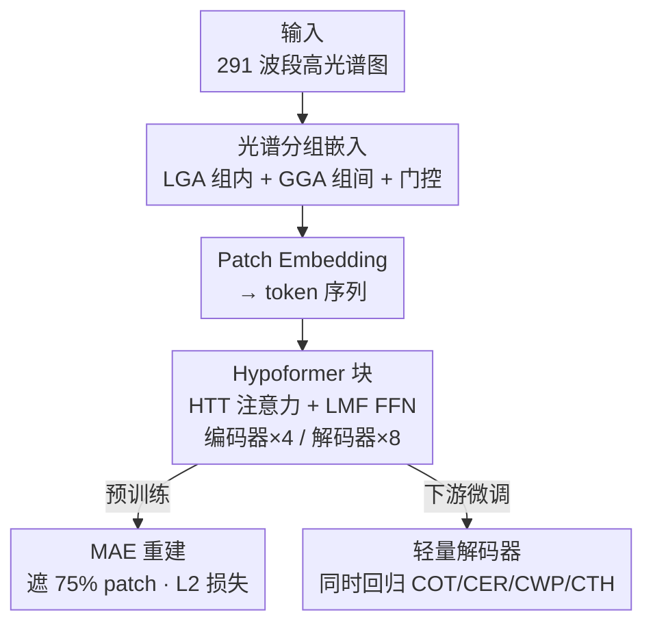

# HyperFM: An Efficient Hyperspectral Foundation Model with Spectral Grouping

**会议**: CVPR 2026  
**arXiv**: [2604.21127](https://arxiv.org/abs/2604.21127)  
**代码**: https://github.com/umbc-sanjaylab/HyperFM (有)  
**领域**: 遥感 / 高光谱基础模型  
**关键词**: 高光谱、基础模型、光谱分组、参数高效、云属性反演

## 一句话总结
针对 NASA PACE 卫星 291 波段高光谱数据，提出参数高效的基础模型 HyperFM——用「光谱分组注意力（组内 LGA + 组间 GGA + MoE 门控）」缓解高维波段压进 token 的信息瓶颈，用「Hypoformer 块（张量列车注意力 + 低秩 FFN）」把参数砍到一半，配合首个含 60%+ 云覆盖的 HyperFM250K 数据集做 MAE 预训练，在四项云属性反演任务上比现有高光谱基础模型平均降低 32.36% 的 MSE，参数量却减半。

## 研究背景与动机
**领域现状**：CLIP、DALL-E 这类基础模型在 RGB 视觉和 NLP 上大获成功后，遥感界也开始造各模态的基础模型（RGB、SAR、多光谱、高光谱）。高光谱方向已有 HyperSigma、SpectralEarth 等先驱，它们各自构建大规模语料并在小型 HSI benchmark 上拿到不错成绩。

**现有痛点**：这些高光谱基础模型有三个硬伤。其一，它们刻意只用**无云场景**（云覆盖 <10%）预训练，导致根本没见过云像素的光谱特征，无法服务于云、气溶胶、大气微物理反演这类真正需要云数据的任务。其二，受限于不同传感器之间的光谱不一致，多数模型被锁死在单一传感器数据上。其三，它们普遍**参数臃肿、算力昂贵**（动辄 88M~102M 参数），难以在业务化场景中规模部署。

**核心矛盾**：高光谱有数百个连续波段（PACE-OCI 是 291 个），标准 ViT 把一个 $291\times8\times8$ 的 patch 直接投影到 768 维 token，会造成严重的**压缩损失**——高维输入被硬塞进固定 token 尺寸，光谱细节大量丢失；若想缩小 patch 来匹配 token 维度，又会丢掉空间信息。表达力与算力效率之间存在直接 trade-off。

**本文目标**：拆成两个子问题——（1）造一个含大量云像素、跨陆/海/极地的高光谱数据集，填补预训练语料空白；（2）设计一个既能保住光谱-空间细节、又参数高效的基础模型架构。

**切入角度**：作者观察到 OCI 的 291 个波段天然分布在蓝（119）、红（163）、短波红外（9）三个光谱仪上且各有结构，于是按光谱相邻性**分组处理**，而不是一股脑塞进单个 patch embedding；同时借鉴语言模型里的 Hypoformer 张量列车分解，把它首次搬到视觉任务上压参数。

**核心 idea**：用「光谱分组的局部+全局注意力」替代会丢信息的单层 patch embedding，用「混合张量列车分解」替代代价高昂的标准注意力投影，从而在保留全秩表达力的同时大幅降本。

## 方法详解
### 整体框架
HyperFM 是一个为「大规模含云高光谱数据」量身设计的 MAE 基础模型。输入是一张 $C\times H\times W$（$C=291$）的高光谱图像，输出是预训练阶段重建的被遮挡区域、以及下游微调阶段四项云属性的逐像素回归图。整条管线是：原始高光谱图先过 **Group Embed 模块**做光谱分组特征提取与 patchify，再进 patch embedding 变成 token，随后被一串 **Hypoformer 块**（编码器 $N_e=4$、解码器 $N_d=8$）编码；预训练时用 **MAE 框架** 遮 75% 的空间 patch、只让可见 token 过编码器再重建；下游时冻结编码器、接一个轻量卷积解码器同时回归四种云属性。

### 关键设计
**1. Group Embed 模块：用光谱分组注意力替代会丢信息的单层 patch embedding**

直接把 291 波段塞进一个 patch embedding 会造成严重压缩损失，这是高光谱建模的核心瓶颈。Group Embed 的做法是把光谱维切成 $k$ 组，得到 $X_1,\dots,X_k\in\mathbb{R}^{\frac{C}{k}\times H\times W}$，每组先单独过一个 **Local Group Attention (LGA)** 块提取组内特征 $G_1,\dots,G_k$，再把这些特征拼接后送入 **Global Group Attention (GGA)** 块建模跨组关系，输出 $Z\in\mathbb{R}^{C\times H\times W}$。LGA 和 GGA 都用 MaxViT 块实现——它同时跑 block attention（局部）和 grid attention（全局），从而捕捉局部与全局的光谱-空间交互。更巧的是，作者借鉴 MoE 思想在 LGA 输出后加了一个**可训练门控函数**，只挑选信息量最大的若干组特征再喂给 GGA，让模型把算力聚焦在最有用的光谱组上。这样在 tokenize 之前就做了组内特征提取和组内 patchify，保留的光谱细节远多于传统 patch embedding。

具体分组是经验设定的：OCI 的 119 蓝 / 163 红 / 9 SWIR 波段（有部分重叠）被切成 9 组，每组至少含 13 个蓝、18 个红、1 个 SWIR 波段，确保每组都横跨光谱的不同区域，有利于学跨光谱关系

**2. Hypoformer 块：用混合张量列车分解把注意力的参数压下来又不丢秩**

标准 ViT 的 QKV 投影是 $\mathcal{O}(N^2)$ 复杂度，面对高光谱的高维度扩展性很差，是参数臃肿的根源。Hypoformer（原本只在语言模型里验证过，本文首次用于视觉）把每个 block 的注意力和 FFN 都换成两个紧凑模块。其一是 **HTT（Hybrid Tensor Train）Attention**：不再用一个大稠密矩阵生成 Q/K/V，而是把一个稠密层 $W_{dense}\in\mathbb{R}^{d\times 3\alpha d}$ 和一个张量列车线性层 $W_{tt}\in\mathbb{R}^{d\times 3(1-\alpha)d}$ 的输出拼起来——$q=\text{concat}(q_1,q_2)$、$k=\text{concat}(k_1,k_2)$、$v=\text{concat}(v_1,v_2)$，其中 $q_1,k_1,v_1=\text{Split}(XW_{dense},3)$、$q_2,k_2,v_2=\text{Split}(XW_{tt},3)$，再做常规 $\text{softmax}(qk^\top/\sqrt{d})v$。这里 $\alpha\in[0,1]$ 是压缩比，控制稠密与张量列车两部分的占比。其二是 **LMF（Low Matrix Factorization）FFN**：用四个低秩分解的稠密层替代标准 FFN，$\text{LMF-FFN}(X)=\text{ReLU}(XU_1V_1+b_1)U_2V_2+b_2$，秩 $R$ 控制压缩程度。

之所以有效，是因为张量列车分解用一组小核（$D$ 个核、TT 秩 $R$）逼近大投影矩阵，把时间复杂度里的二次项部分替换成 $N^{1+\frac{1}{D}}R^2$ 这样的亚二次增长，同时混合结构保留了**全秩表达力**——这是它区别于普通低秩分解（会限制表达力）的关键。实现里设 $\alpha=0.5$、$D=3$ 个 TT 核、$R=3$，最终模型只有 32.06M 参数，约为 HyperSigma（100.16M）的三分之一

**3. HyperFM250K 数据集 + MAE 预训练：让模型真正见过云**

现有基础模型表现差的根因是预训练语料里没有云。作者从 NASA PACE-OCI 拉了 2262 个 Level-1B granule（2024.05–2025.04 全球），经四步预处理（无效像素置 NaN → 按 ≤10s 时间差配对 Level-2 云产品 → $96\times96$ 滑窗切 patch → 丢弃 NaN 占比 >1% 的 patch），得到约 25 万个干净 patch，构成首个**云覆盖 >60%**、横跨陆/海/极地的高光谱数据集 HyperFM250K（291 波段，对照已有数据集要么无云、要么单一传感器）。预训练用 MAE：遮 75% 的空间 patch，只让可见 token 过编码器，再由解码器重建被遮区域，用 L2 重建损失。选 MAE 而非对比/聚类目标，是因为后者往往需要大 batch、重增强、敏感调参；而 MAE 只让未遮 token 过编码器，算力效率更高，可以在不成比例增加训练成本的前提下加大编码器容量

### 损失函数 / 训练策略
预训练用 MAE 的 L2 重建损失，遮蔽比例 75%，训 250 epoch（验证 MSE early stopping，patience 50），batch size 4，AdamW。下游四项云属性（COT/CER/CWP/CTH）用**多任务学习**联合回归（联合优于各练各的），微调时冻结预训练编码器、只更新一个由卷积层+上采样块+LayerNorm 组成的轻量解码器；COT 和 CWP 在训练前做 log 变换。评测指标统一用 MSE。⚠️ 作者坦言由于算力限制，下游微调只用了 2000 张训练图。

## 实验关键数据

### 主实验
四项逐像素云属性反演任务，指标为 MSE（越低越好）。下表为 **full fine-tuning**（编码器也更新）设定，HyperFM 全面领先且参数量最小：

| 模型 | COT ↓ | CER ↓ | CWP ↓ | CTH ↓ | 参数量 |
|------|-------|-------|-------|-------|--------|
| **HyperFM (本文)** | **0.2615** | **62.40** | **1.01** | **4.05** | 32.06M |
| SpectralEarth | 0.3404 | 84.29 | 1.25 | 5.17 | 88.78M |
| CAM（任务专用） | 0.3367 | 74.45 | 1.51 | 6.63 | 0.47M |
| UNet（任务专用） | 0.3928 | 84.73 | 1.57 | 7.68 | 31.04M |
| HyperSigma | 0.4649 | 117.51 | 1.75 | 10.33 | 100.16M |

相对最强基础模型基线 HyperSigma（其 decoder-only 微调结果），HyperFM 在 COT/CER/CWP/CTH 上分别降低 18.59% / 34.66% / 23.88% / 52.31% 的 MSE，四项平均降低 **32.36%**。

### 冻结编码器对比（decoder-only 微调）
为公平对比基础模型的表征质量，所有 FM 都冻结编码器、只训轻量解码器。即便如此，HyperFM 的 decoder-only 版本也已超过所有竞品基础模型乃至任务专用 SOTA：

| 模型 | COT ↓ | CER ↓ | CWP ↓ | CTH ↓ | 可训练参数 |
|------|-------|-------|-------|-------|-----------|
| **HyperFM (本文)** | **0.3124** | **73.70** | **1.22** | **5.10** | 1.48M |
| HyperSigma | 0.3212 | 95.49 | 1.33 | 8.49 | 0.69M |
| SpectralEarth | 0.4699 | 97.92 | 1.71 | 7.67 | 0.54M |
| HyperFree | 0.5570 | 117.90 | 2.06 | 10.07 | 0.69M |

此外，三个现有基础模型在 **zero-shot**（不微调）下表现都很差（如 SpectralEarth COT MSE 高达 61.03、CER 14384），印证了它们在无云数据上预训练、无法直接迁移到含云场景的判断。

### 关键发现
- **数据决定上限**：现有 FM 在 zero-shot 下惨败、在云任务上长期落后，根因是预训练只见过无云像素；HyperFM 仅凭见过云就大幅领先——说明含云数据集 HyperFM250K 本身是核心贡献。
- **表征质量过硬**：HyperFM 哪怕冻结编码器（decoder-only）也能压过别人 full fine-tune 的结果，说明 Group Embed + Hypoformer 学到的光谱-空间表征确实更好。
- **效率优势明显**：32.06M 参数约为 HyperSigma/SpectralEarth/HyperFree（88–102M）的 1/3，HTT 的亚二次复杂度 $\mathcal{O}(\alpha N^2 + D(\max[\alpha N,(1-\alpha)N])^{1+\frac{1}{D}}R^2)$ 让它在高光谱维度下扩展性远好于标准 ViT。
- **CTH 提升最大（52.31%）**：云顶高度这种强依赖全谱信息的任务上，全光谱建模 + 含云预训练的收益最突出。

## 亮点与洞察
- **光谱分组 + MoE 门控**：把数百波段按光谱相邻性分组、组内 LGA 组间 GGA 分层建模，再用可训练门控只留信息量大的组——这是缓解「高维波段塞进固定 token」压缩损失的轻巧解法，可迁移到任何超多通道输入（如多传感器融合、医学多模态体数据）。
- **Hypoformer 跨域搬运**：把语言模型里验证过的混合张量列车注意力首次搬到视觉高光谱，既压参数又保全秩表达力，给「参数高效视觉 backbone」提供了一条不同于剪枝/LoRA 的预训练期路线。
- **数据集即贡献**：最让人「啊哈」的是——架构再巧也比不过让模型「见过云」。HyperFM250K（首个 >60% 云覆盖、跨陆海极地的高光谱集）才是性能跃升的根本来源，提醒大家基础模型的瓶颈常在数据分布而非模型尺寸。
- **MAE 在高光谱的效率红利**：只让未遮 token 过编码器，使得加大编码器容量不会等比增加成本，对动辄数百波段的高光谱尤其划算。

## 局限与展望
- 作者承认当前用的是**固定超参**（压缩比 0.5、3 个 TT 核、TT 秩 3），尚未做系统消融，最优配置未知。
- 下游微调只用了 2000 张图、预训练也只跑了数据子集（受算力限制），完整规模实验还没做——目前的领先是在「数据/算力受限」前提下取得的，放大后是否保持优势仍待验证。
- 真值来自 PACE-OCI Level-2 产品（由最优反演算法生成），本身可能带系统偏差；作者计划等主动传感器数据可用后做协同定位以获得更准的监督。
- 重建质量在 **patch 边界** 有不连续伪影，需用重叠采样平滑（代价是额外算力）。
- 个人看法：论文缺少对 Group Embed 各组件（LGA/GGA/门控/分组数）和 Hypoformer 超参的消融，难以判断各设计的独立贡献；「>32% 提升」是拿 HyperFM full fine-tune 对比 HyperSigma decoder-only，两种设定不完全对等，横向比较需保留 caveat。

## 相关工作与启发
- **vs HyperSigma**：两者都是高光谱基础模型，HyperSigma 用分离的空间/光谱模块、在无云的 Gaofen/EO-1 数据上预训练；HyperFM 用光谱分组注意力 + 含云数据，区别在于「见没见过云」和「参数效率」——HyperFM 用 1/3 参数把云任务 MSE 平均压低 32%，但在某些非云相关基准上的泛化仍未充分验证。
- **vs SpectralEarth / HyperFree**：它们用投影网络先把光谱降维再做表征学习，HyperFM 反其道用分组注意力**保留**光谱细节而非压缩；且二者同样只在无云数据上预训练，导致在云任务上 zero-shot 失效、full fine-tune 也落后。
- **vs UNet / CloudUNet / CAM（任务专用）**：这些 U-Net 系方法只用 2–8 个波段、依赖辅助变量、且各任务单独训练；HyperFM 用全 291 波段 + 多任务联合反演，一个预训练编码器迁移到四项任务，体现基础模型范式相对任务专用模型的优势。
- **启发**：当输入通道数远超 token 容量时，「先分组保细节、再门控选信息」比「单层硬压」更稳；参数高效不一定靠微调期的 LoRA，预训练期就用张量列车分解换骨架也是一条路。

## 评分
- 新颖性: ⭐⭐⭐⭐ 光谱分组注意力 + Hypoformer 首次用于高光谱视觉 + 首个含云大规模数据集，组合扎实但单点创新多为已有技术迁移
- 实验充分度: ⭐⭐⭐ 四任务对比 + 多基线齐全，但缺架构消融、且受算力限制只用数据子集，提升对比口径不完全对等
- 写作质量: ⭐⭐⭐⭐ 动机清晰、公式与复杂度分析完整，数据集构建流程交代细致
- 价值: ⭐⭐⭐⭐ HyperFM250K 数据集与代码开源，填补大气云高光谱基础模型空白，对遥感气候应用有直接价值

<!-- RELATED:START -->

## 相关论文

- [\[CVPR 2026\] Local Precise Refinement: A Dual-Gated Mixture-of-Experts for Enhancing Foundation Model Generalization against Spectral Shifts](local_precise_refinement_a_dual-gated_mixture-of-experts_for_enhancing_foundatio.md)
- [\[CVPR 2026\] ORSATR-X: A Foundation Model based on Differential-and-Excitation Networks for Optical Remote Sensing Object Recognition](orsatr-x_a_foundation_model_based_on_differential-and-excitation_networks_for_op.md)
- [\[ICCV 2025\] RS-vHeat: Heat Conduction Guided Efficient Remote Sensing Foundation Model](../../ICCV2025/remote_sensing/rs-vheat_heat_conduction_guided_efficient_remote_sensing_foundation_model.md)
- [\[CVPR 2026\] GeoBridge: A Semantic-Anchored Multi-View Foundation Model Bridging Images and Text for Geo-Localization](geobridge_a_semantic-anchored_multi-view_foundation_model_bridging_images_and_te.md)
- [\[AAAI 2026\] M3SR: Multi-Scale Multi-Perceptual Mamba for Efficient Spectral Reconstruction](../../AAAI2026/remote_sensing/m3sr_multi-scale_multi-perceptual_mamba_for_efficient_spectral_reconstruction.md)

<!-- RELATED:END -->
