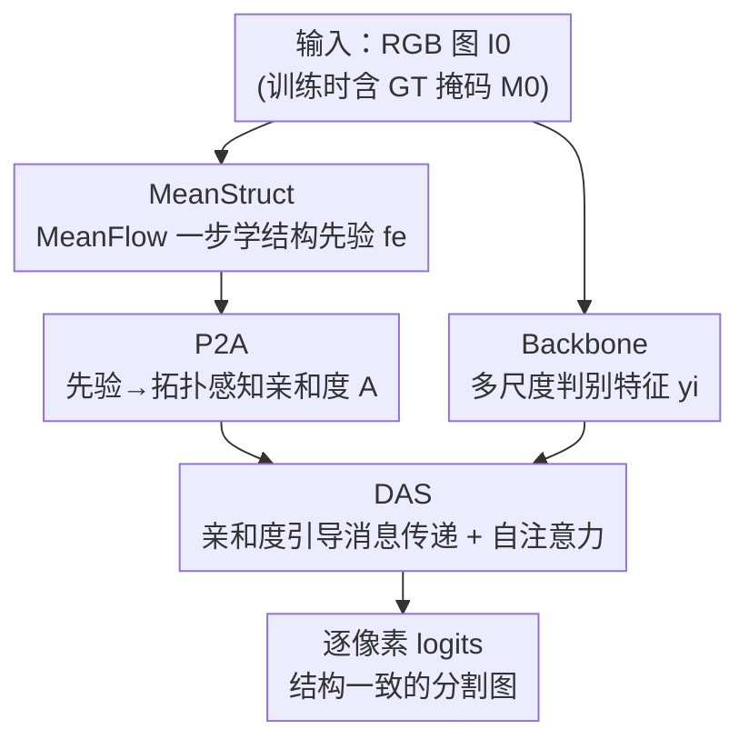

# HySeg: Learning Generative Priors for Structure-Aware Remote Sensing Segmentation

**会议**: CVPR 2026  
**论文**: [CVF Open Access](https://openaccess.thecvf.com/content/CVPR2026/html/Qiu_HySeg_Learning_Generative_Priors_for_Structure-Aware_Remote_Sensing_Segmentation_CVPR_2026_paper.html)  
**代码**: https://github.com/HeryJie/HySeg  
**领域**: 遥感语义分割 / 生成式先验  
**关键词**: 遥感分割、生成式先验、MeanFlow、亲和度传播、拓扑一致性

## 一句话总结
HySeg 把遥感语义分割重新表述为"受生成式结构先验约束的后验推断"：先用基于 MeanFlow 的 MeanStruct 模块在标签空间学一个编码拓扑连续性与区域邻接的结构先验，再用 P2A 把这个抽象先验投影成拓扑感知的逐像素亲和度，最后由 DAS 头按这些亲和度做受约束的消息传递，在四个遥感分割基准上即插即用地提升结构一致性与跨数据集泛化。

## 研究背景与动机

**领域现状**：遥感图像语义分割（RSISS）是大规模对地观测的核心任务，把卫星/航拍影像变成逐像素的地物图。主流做法越来越"判别式"——CNN 系（DeepLab、HRNet、PSPNet）靠空洞卷积和金字塔池化抓多尺度上下文，Transformer 系（SegFormer、Swin-Unet）靠全局注意力建模长程依赖，都在各类基准上刷出了很高的精度。

**现有痛点**：但这些方法本质上都是"看外观"（appearance-driven），从数据里估一个很强的后验 $p(\text{label}\mid\text{image})$，却缺一个能编码结构依赖的生成式先验。结果就是：边界破碎、对纹理过拟合、跨数据集泛化差。遥感场景尤其吃这个亏——它有强烈的空间异质性、复杂的拓扑互连、由地理连续性和区域邻接决定的上下文语义，而纯判别模型只会"识别"不会"理解"这些关系结构。

**核心矛盾**：感知（perception）与推理（reasoning）之间存在结构性失衡。模型擅长勾勒纹理和边界，却抓不住支配空间组织的关系结构（哪块地紧挨哪块、连通性如何）。判别式架构再精巧，也只是把"看得更清"做到极致，"看懂结构"这一步一直没补上。

**本文目标**：让分割从"基于外观的感知"升级到"结构推理"——具体拆成三个子问题：(1) 怎么把结构性的拓扑/邻接知识学成一个可用的先验；(2) 这个先验是抽象的概率描述，怎么翻译成能指导像素级推断的显式机制；(3) 怎么把这种结构约束注入到判别式解码里而不破坏原有 backbone。

**切入角度**：作者从生成式视角观察——与其直接判别"每个像素是什么类别"，不如先学"语义拓扑是怎么演化的"。他们借用 MeanFlow（流匹配的均场扩展）把结构建模成标签空间里的一个连续传输过程：一个均速度场把简单的结构原型搬运到真实分割图的分布上。建模"拓扑如何演化"而非"哪些标签出现"，能更可靠地捕捉真实布局的内在几何。

**核心 idea**：用"生成式结构先验约束的后验推断"代替"纯判别后验"——MeanStruct 学先验、P2A 把先验翻译成亲和度、DAS 用亲和度引导消息传递，三者拼成一个生成-判别混合范式，且对 backbone 无关、即插即用。

## 方法详解

### 整体框架

HySeg 把 RSISS 写成 $\text{posterior inference constrained by generative structural priors}$，整条流水线分两个阶段。**阶段 I（MeanStruct）**：给一张 RGB 图 $I_0$（训练时还有 GT 掩码 $M_0$），用一个基于 MeanFlow 的单步（1-NFE）学习器，把一个被高斯噪声扰动的嵌入一步传输成"结构一致的稠密先验" $f_e\in\mathbb{R}^{h\times w\times d}$，这个先验显式编码拓扑连续性和区域邻接。**阶段 II（P2A + DAS）**：P2A 把抽象的先验特征投影成逐像素的拓扑感知亲和度 $A$；DAS 头则把这些亲和度当作结构约束，去调制 backbone 特征之间的消息传递，最后解码成逐像素 logits。整个设计 backbone 无关，能套在 CNN 和 Transformer 各种 backbone 上。

### 关键设计

**1. MeanStruct：用 MeanFlow 把结构先验学成"标签空间里的一次传输"**

痛点是判别特征只记"哪里是什么类别"，记不住"拓扑怎么连"。MeanStruct 换个角度：把结构先验当成一个生成任务，让网络学"语义拓扑如何演化"。具体地，先用编码器抽两个嵌入——图像条件上下文 $c_e=E(I_0)$ 当引导信号，目标先验嵌入 $m_{e0}=E(M_0)$（只在训练时有），然后在先验空间定义一条线性路径 $x_t=(1-t)\,m_{e0}+t\,e$，其中 $e\sim\mathcal N(0,I)$。沿这条路径瞬时速度恒为常数 $v(x_t,t)=e-m_{e0}$。

它学的不是瞬时速度而是 MeanFlow 的**区间平均速度** $u_\theta(x_t,\tau,t)$：

$$u(x_t,\tau,t)=\frac{1}{t-\tau}\int_\tau^t v(x_\eta,\eta)\,d\eta.$$

训练靠 MeanFlow 恒等式把平均速度和瞬时速度关联起来：$u=v-(t-\tau)\frac{d}{dt}u$，其中 $\frac{d}{dt}u=\partial_x u\cdot v+\partial_t u$ 由自动微分（JVP）算出。于是目标速度 $u_{\text{tgt}}=v-(t-\tau)(\partial_x u_\theta\cdot v+\partial_t u_\theta)$，损失为 $L_{\text{MeanStruct}}=\mathbb E_{t,\tau}\big[\lVert u_\theta-\mathrm{sg}(u_{\text{tgt}})\rVert_2^2\big]$（$\mathrm{sg}$ 是停梯度）。为什么有效：MeanFlow 场在语义流形上诱导出一个平滑、低散度的传输，在温和的光滑性/Lipschitz 假设下倾向于保持邻接关系和局部连通性，比纯判别特征更可靠地编码空间连续性与区域邻接——注意作者强调这是"生成式结构偏置"而非严格的拓扑保证。

**2. 1-NFE 推断 + 多尺度对齐：让生成先验落地到判别 backbone 上而几乎不加开销**

阶段 I 若按常规生成模型多步采样会很慢。MeanStruct 利用平均速度的定义做一次确定性"回滚"：由 $x_\tau=x_t-(t-\tau)u(x_t,\tau,t)$，取 $(\tau,t)=(0,1)$、$e\sim\mathcal N(0,I)$，先验一步算出 $f_e=e-u_\theta(e,0,1)$，即单次函数评估（1-NFE），既结构连贯又几乎零额外计算。拿到全局先验 $f_e$ 后，一个轻量空间解码器 $D_s$ 把它分层投影成多尺度结构金字塔 $s_i=D_s^{(i)}(f_e)$，逐尺度与 backbone 特征 $y_i$ 在分辨率上对齐（必要时用 $1\times1$ 投影对齐通道）。这样学到的拓扑就被嵌进特征层级，作为条件结构场喂给后续推断——这是它能"backbone 无关、即插即用"的关键。

**3. P2A：把抽象先验翻译成拓扑感知的逐像素亲和度**

MeanStruct 给的先验是隐式的，没法直接指导像素级推理。P2A 当"结构翻译器"，把先验特征图 $s_i\in\mathbb R^{C\times h\times w}$ 展开成局部 $K\times K$ 邻域张量 $P\in\mathbb R^{C\times L\times K^2}$（$L=h\times w$）。对每个位置 $j$，记中心特征 $p_j^{(c)}$、第 $k$ 个邻居 $x_j^{(c,k)}$，逐通道差异为 $D_j^{(c,k)}=(p_j^{(c)}-x_j^{(c,k)})^2$，再聚合通道差异、经一个**可学习带宽的高斯核**转成归一化亲和度：

$$A_j^{(k)}=\mathrm{Softmax}_k\!\left(-\frac{\sum_{c=1}^{C}D_j^{(c,k)}}{2\sigma^2+\xi}\right),\quad \sum_{k=1}^{K^2}A_j^{(k)}=1,$$

其中 $\sigma$ 可学习、$\xi$ 是稳定常数。关键区别在于：和自注意力不同，P2A 的亲和度来自**学到的结构先验**（中心-邻居在先验空间的差异），而不是分割特征之间的成对相似度——所以它注入的是拓扑/邻接约束，而非外观相似度，从而提升边界精度和区域内一致性，且本身轻量、backbone 无关。

**4. DAS：亲和度引导的双残差消息传递，做受先验约束的后验推断**

DAS 是后验推断阶段的判别头，但它的消息传递被 P2A 的亲和度约束着。给与先验尺度对齐的 backbone 特征 $y_i$，先用 $1\times1$ 投影 $\phi_{\text{feat}}$ 得到隐表示 $M=\phi_{\text{feat}}(y_i)$，展开成 $K\times K$ 邻域局部证据 $M_v$，按亲和度加权聚合：$M'(d',j)=\sum_{k=1}^{K^2}A_j^{(k)}M_v(d',j,k)$——这一步近似后验场的一次更新，每个像素通过对"结构相关的邻居"做边缘化来精炼自己的表示，再经轻量 MLP $\phi_{\text{fuse}}$ 融合得 $M_f$。为了把推理扩到局部邻域之外，DAS 用双残差设计把先验引导聚合与自注意力精炼叠起来：$y_i'=y_i+D_p(M_f)$，$y_{\text{out}}=y_i'+D_p(\mathrm{SA}(y_i'))$，其中 $\mathrm{SA}$ 是空间 token 上的多头自注意力、$D_p$（DropPath）正则化残差。最终 $y_{\text{out}}$ 解码成逐像素 logits，分割分支用标准 RSISS 损失 $L_s$ 优化，闭合整个生成-判别推断回路。

### 损失函数 / 训练策略
两个目标：阶段 I 的 MeanFlow 回归损失 $L_{\text{MeanStruct}}$（式 5，带停梯度）负责学结构先验；阶段 II 用各 backbone 原有的标准 RSISS 分割损失 $L_s=L_{\text{RSISS}}$ 监督最终分割。训练沿用各 backbone 的原始设置（UNetFormer、LSKNet、DCSwin、D2LS）做公平对比，单卡 NVIDIA A800、AdamW；推断时用多尺度测试 + 水平翻转增强鲁棒性。GT 掩码 $M_0$ 只在训练时用来构造目标先验嵌入，推断时不需要。

## 实验关键数据

### 主实验

在 LoveDA、UAVid、ISPRS Potsdam、ISPRS Vaihingen 四个遥感基准上，把 HySeg 插到 UNetFormer(ResNet18/34/50)、DCSwin(Swin T/S/B)、LSKNet(T/S)、D2LS(ConvNeXt B) 等多种 backbone 上，几乎一致地提升 mIoU。

| Backbone | 数据集 | 基线 mIoU | +HySeg mIoU | 提升 |
|----------|--------|-----------|-------------|------|
| UNetFormer R18 | LoveDA | 52.4 | 54.5 | +2.1 |
| UNetFormer R50 | LoveDA | 52.5 | 54.7 | +2.2 |
| DCSwin Swin B | LoveDA | 52.9 | 54.5 | +1.6（Barren 类 +5.0） |
| LSKNet S | LoveDA | 54.0 | 55.4 | +1.4（Agriculture +3.2） |
| 各 backbone 平均 | Vaihingen / Potsdam / UAVid | — | — | +2.2 / +1.7 / +1.6 |

最大增益集中在"结构主导"的类别（Building、Barren、Forest），说明提升确实来自边界精度和区域内一致性的改善。

此外作者用拓扑相关指标（clDice、Betti 误差 $\beta_0/\beta_1$）评估结构保真度（Tab. 2，Potsdam）：

| 方法 | Backbone | clDice↑ | β0-Error↓ | β1-Error↓ |
|------|----------|---------|-----------|-----------|
| UNetFormer | ResNet18 | 0.917 | 1.645 | 4.681 |
| HySeg | ResNet18 | **0.924** | **1.237** | **3.841** |
| D2LS | ConvNeXt B | 0.911 | 2.522 | 4.512 |
| HySeg | ConvNeXt B | **0.935** | **1.003** | **2.464** |

clDice 全面提升、Betti 误差全面下降，说明连通性和区域级拓扑保持得更好。

### 消融实验

组件逐项消融（Tab. 3，LoveDA mIoU，部分 backbone）：

| 配置 | ResNet18 | Swin B | LSKNet S | ConvNeXt B |
|------|----------|--------|----------|------------|
| Baseline（Backbone+标准头） | 52.42 | 52.03 | 54.01 | 52.77 |
| + DAS（无先验） | 52.76 | 52.87 | 54.12 | 53.26 |
| + 简单先验融合 | 53.42 | 53.41 | 54.17 | 54.04 |
| + MeanStruct+DAS（无 P2A） | 52.01 | 52.20 | 52.00 | 52.41 |
| + MeanStruct+P2A+DAS（无亲和度&消息） | 53.53 | 53.67 | 54.71 | 54.57 |
| + MeanStruct+P2A+DAS（无自注意力） | 54.02 | 54.28 | 55.13 | 55.20 |
| HySeg（完整） | **54.48** | **54.46** | **55.37** | **55.63** |

超参分析（Tab. 5，LoveDA）：高斯带宽 $\sigma$ 用可学习最优；邻域 $K=7$ 最佳（$K=3$ 明显偏低）；注意力头数 8 最佳。

### 关键发现
- **P2A 是先验能否落地的关键门槛**：MeanStruct+DAS 但**不加 P2A** 时反而比 baseline 还低（ResNet18 从 52.42 掉到 52.01，LSKNet S 从 54.01 掉到 52.00）——抽象先验若不翻译成亲和度，直接塞进 DAS 会起反作用；一旦 P2A 把先验转成类别/拓扑感知亲和度，立刻跃升。这正是论文最核心的论证。
- **消息传递比自注意力更重要**：去掉"亲和度&消息传递"掉点明显，而去掉自注意力只是轻微下降——说明由先验引导的局部传播才是结构推理的主力，全局自注意力只是锦上添花。
- **MeanStruct 先验优于判别式先验**：Tab. 4 显示用各种判别 backbone 当先验只能小幅提升（甚至 ConvNeXt B 上 ResNet18 先验掉到 50.20），唯独 MeanStruct 这种生成式先验在所有 backbone 上给出最大增益（ConvNeXt B 达 55.63），印证了"生成式结构先验"这一立论。
- **更强 backbone 收益递减**：在已经很强的 D2LS ConvNeXt B 上，HySeg 增益缩到约 +0.3~0.5 mIoU，说明结构先验对弱 backbone 的补偿作用更大。

## 亮点与洞察
- **把"结构先验"做成一个生成任务，而不是加正则项**：传统拿 CRF / 拓扑损失硬约束边界，HySeg 改成"学一个均速度场把结构原型搬到真实分割分布"，用 MeanFlow 的几何保持性自然得到连续、低散度的结构先验——视角很新。
- **1-NFE 让生成先验几乎零成本**：生成式方法最大顾虑是慢，作者用平均速度的回滚一步出先验（$f_e=e-u_\theta(e,0,1)$），把"生成"压成单次前向，使其能即插即用进任意判别 backbone，工程上很关键。
- **P2A 把"先验差异"而非"特征相似度"变成亲和度**：这是与自注意力的本质分界——注意力学外观相似，P2A 学结构邻接，两条信息互补，所以双残差里两者叠加才有效。这个"用先验空间的中心-邻居差异定义传播权重"的 trick 可迁移到其他需要结构约束的稠密预测任务（如医学血管/道路这类强拓扑分割）。
- **拓扑指标做了诚实验证**：除了 mIoU 还报 clDice 和 Betti 误差，直接量化连通性，而不是只靠 mIoU 含糊地说"边界更好"。

## 局限与展望
- **依赖训练时的 GT 掩码构造目标先验**：$m_{e0}=E(M_0)$ 需要 GT，半监督/弱监督场景下先验学习如何退化没有充分讨论。
- **"结构偏置而非保证"**：作者自己反复强调 MeanFlow 只在温和光滑性假设下"倾向于"保邻接，并非严格拓扑保证；在拓扑极端复杂或长程依赖强的场景，这种软偏置是否够用存疑。
- **强 backbone 上增益很小**：ConvNeXt B 上只剩约 +0.3 mIoU，说明方法主要补弱 backbone 的结构短板，对已逼近上限的强模型边际收益有限。
- **关键细节藏在补充材料**：邻域展开、空间索引映射、边界处理、masked 归一化等都放进了 Supplementary，正文复现信息不完整。
- 改进方向：把 P2A 的亲和度扩到多尺度/长程（当前是局部 $K\times K$），或把 MeanStruct 先验用于无 GT 的开放词表 RSISS。

## 相关工作与启发
- **vs 纯判别式 RSISS（DeepLab / SegFormer / Swin-Unet）**：他们只估强后验、靠多尺度/全局注意力提精度，本文额外学一个生成式结构先验并注入后验推断，区别在于显式建模拓扑连续性与区域邻接；优势是结构一致性和跨数据集泛化更好，劣势是多了先验学习分支且强 backbone 上收益有限。
- **vs 扩散式生成分割（diffusion-based RSISS）**：扩散方法也学数据分布，但通常多步随机采样、慢；本文用 MeanFlow 的均场动力学做确定性 1-NFE，把生成先验压成单步并与判别推断融合，效率与可控性更好。
- **vs 自注意力 / Transformer 消息传递**：自注意力从分割特征的成对相似度算权重（外观相似度），P2A 从学到的结构先验算亲和度（拓扑邻接），二者在 DAS 的双残差里互补叠加——本文的消融正说明只有把"先验引导的局部传播"放在主力位置才最有效。

## 评分
- 新颖性: ⭐⭐⭐⭐⭐ 把 RSISS 重构为"生成式结构先验约束的后验推断"，用 MeanFlow 学结构先验、P2A 翻译成亲和度，视角和落地路径都很新。
- 实验充分度: ⭐⭐⭐⭐ 四基准 × 多 backbone（CNN/Transformer）+ 拓扑指标 + 完整组件/超参消融，覆盖很全；扣分在不少关键细节进了补充材料、且强 backbone 增益偏小。
- 写作质量: ⭐⭐⭐⭐ 立论清晰、公式完整、消融能精确支撑核心主张（尤其"无 P2A 反而掉点"）；术语略密、部分实现细节缺失。
- 价值: ⭐⭐⭐⭐ backbone 无关、即插即用、对弱 backbone 提升明显，对遥感及其他强拓扑稠密预测任务有迁移价值。

<!-- RELATED:START -->

## 相关论文

- [\[CVPR 2026\] SegEarth-R2: Towards Comprehensive Language-guided Segmentation for Remote Sensing Images](segearth-r2_towards_comprehensive_language-guided_segmentation_for_remote_sensin.md)
- [\[CVPR 2026\] SkySense-VITA: Towards Universal In-context Segmentation of Multi-modal Remote Sensing Imagery](skysense-vita_towards_universal_in-context_segmentation_of_multi-modal_remote_se.md)
- [\[CVPR 2026\] ReAttnCLIP: Training-Free Open-Vocabulary Remote Sensing Image Segmentation via Re-defined Attention in CLIP](reattnclip_training-free_open-vocabulary_remote_sensing_image_segmentation_via_r.md)
- [\[CVPR 2026\] CrossEarth-Gate: Fisher-Guided Adaptive Tuning Engine for Efficient Adaptation of Cross-Domain Remote Sensing Semantic Segmentation](crossearth-gate_fisher-guided_adaptive_tuning_engine_for_efficient_adaptation_of.md)
- [\[CVPR 2026\] MM-OVSeg: Multimodal Optical-SAR Fusion for Open-Vocabulary Segmentation in Remote Sensing](mm-ovseg_multimodal_optical-sar_fusion_for_open-vocabulary_segmentation_in_remot.md)

<!-- RELATED:END -->
