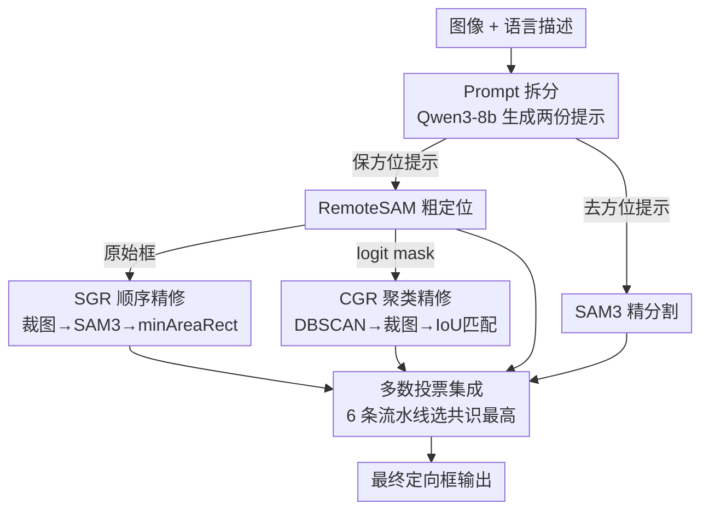

# Improving Visual Grounding in Remote Sensing via Cluster-Guided Refinement and Model Ensemble Voting

**会议**: CVPR 2026  
**arXiv**: [2606.00556](https://arxiv.org/abs/2606.00556)  
**代码**: https://github.com/PanavShah1/LG-SAM (有)  
**领域**: 遥感视觉定位 / 分割 / 模型集成  
**关键词**: 视觉定位(Visual Grounding)、遥感影像、RemoteSAM、SAM3、DBSCAN 聚类、多数投票集成

## 一句话总结
针对遥感影像视觉定位单模型各有短板的问题，本文把专用定位模型 RemoteSAM 和通用分割模型 SAM3 串成两条 refine 流水线（SGR/CGR），并用一个考虑空间一致性和检测框数量差异的多数投票公式把六条流水线集成起来，在 VRS Bench 和 NWPU-VHR-10 上的 mIoU 都超过任何单一模型。

## 研究背景与动机

**领域现状**：视觉定位（Visual Grounding）要根据自然语言描述在图像里圈出对应区域，是可解释视觉系统的关键一环。在遥感影像上，近年出现了 RemoteSAM（遥感专用、语言条件分割）、SAM3（通用强分割基座）、EarthMind、Falcon 等多个强模型。

**现有痛点**：遥感场景的难点很具体——背景杂乱、目标尺度跨度极大、同一幅图里常有多个外观相似的目标。每个现成模型都有结构性短板：RemoteSAM 擅长"找到大概在哪"，但输出的框粗糙、碎片化、同一目标会冒出多个重叠框；SAM3 能切出高质量 mask，但在大而复杂的图里"定不准位"——表格里 SAM3 在 VRS Bench 上 mIoU 只有 0.1635，几乎不可用。EarthMind、Falcon 也各有取舍。

**核心矛盾**：定位能力（哪里）和分割质量（边界）分散在不同模型里，没有任何单模型能同时把这两件事做好；而遥感场景的多样性又决定了"靠一个模型扛全部"是行不通的。

**本文目标**：(1) 把"定位强"和"分割准"的模型互补地拼起来；(2) 抑制 RemoteSAM 碎片化框带来的冗余分割；(3) 用集成进一步抗单模型失效、提升鲁棒性。

**切入角度**：作者不去训练新模型，而是把这些模型当作可组合的"能力积木"，在推理阶段用流水线和投票把它们的长处缝起来——这条路成本低、可即插即用，且能直接吃到各基座未来的升级。

**核心 idea**：用 RemoteSAM 做粗定位、SAM3 做精修，再用一个"看共识"的多数投票把多条互补流水线集成成最终输出。

## 方法详解

### 整体框架
本文给出两条单独的 refine 流水线和一层集成。两条流水线共享同一个"prompt 拆分"前端：先用 Qwen3-8b 把用户原始描述改写成两份提示——保留方位信息的版本喂给 RemoteSAM 做粗定位，剥掉方位、只留目标类别的版本喂给 SAM3 做精分割。区别在于 RemoteSAM 输出怎么用：**SGR** 直接拿 RemoteSAM 的每个候选框去裁图、逐个交给 SAM3 精修；**CGR** 则不信任原始框，转而用 RemoteSAM 的 logit mask 做 DBSCAN 聚类得到更干净的候选区域，再裁图、SAM3 分割、用 IoU 把分割结果和聚类点匹配回去。最后 **多数投票** 把 RemoteSAM、SAM3、EarthMind、Falcon、SGR、CGR 六条流水线的预测放一起，按"和其他模型有多一致"打分，选分最高的那条作为最终输出。

### 关键设计

**1. Prompt 拆分：让两个模型各吃各擅长的提示**

直接把原始描述同时丢给两个模型并不最优——RemoteSAM 需要"路左边那辆黄车"这类方位线索来定位，而 SAM3 一旦读到方位/方向性的高层语言，分割质量反而会下降。作者用 Qwen3-8b 把原始 query 改写成两份：第一份保留空间与方向信息（如 "the yellow car on the left side of the road"）给 RemoteSAM 当上下文做粗定位；第二份剥掉所有方位词、只保留目标类别（如 "yellow car"）给 SAM3，配合裁出的局部图块输入。这样 RemoteSAM 用方位上下文负责"在哪"，SAM3 在干净提示下专注"切准边界"，避免高层方位语言污染分割输出

**2. SGR 顺序精修：用 RemoteSAM 的框给 SAM3 缩小搜索范围**

SAM3 在整幅大图上定不准位，本质是搜索空间太大、背景太杂。SGR 让 RemoteSAM 先对一条 query 产出若干定向候选框，把每个框从原图裁出来、单独喂给 SAM3。局部裁图既减少背景干扰又限制搜索范围，使 SAM3 能在聚焦输入上切出精确边界。SAM3 的 mask 再通过对置信图阈值化、提取连通域、用 OpenCV 的 `minAreaRect` 拟合最小面积矩形，转回定向框作为最终输出。本质是"粗定位裁图 → 精分割 → 转框"的简单串联

**3. CGR 聚类精修：用 logit mask + DBSCAN 取代碎片化原始框**

SGR 的软肋是它照单全收 RemoteSAM 的原始框——这些框常常碎片化、对同一目标冒出多个重叠框，逼着 SAM3 对每个框各算一遍，产出冗余甚至错误分割。CGR 不再相信框，而是改用 RemoteSAM 的分割 logit mask：它提供稠密的像素级信息，更能刻画候选区域的空间结构。对该 mask 跑 DBSCAN 聚类，把空间上邻近、密集的像素归并成连贯的目标段，同时自动丢弃孤立噪声点，从而过滤掉碎片化预测、只留下空间一致的区域。每个聚类裁图（额外加 padding，因为高概率点未必覆盖整个实例）后交 SAM3 分割；由于一个裁块里可能混入别的聚类目标，再对每个 SAM3 mask 和原聚类点算 IoU，取 IoU 最高的那个 mask 作为该聚类的最终输出，保证留下的是空间最匹配的那一个

**4. 多数投票集成：按"与他人共识 + 框数一致性"选最可靠的一条流水线**

单条流水线都会偶发失效，作者用集成抗失效。但他不直接把六条流水线的框暴力合并（异质预测合并很难），而是**选**出最可靠的一条：对每条流水线 $i$，统计它和其他所有流水线 $j$ 的一致程度。空间一致性用两组框之间最佳匹配对的平均 IoU 衡量；同时考虑检测框数量差异——某些模型框数明显偏多或偏少往往意味着噪声或漏检，于是对框数差加一个指数惩罚下压。综合得分为

$$\text{score}[i] = \sum_{j\neq i}\exp\!\big(-\lambda\,|\text{boxes}(i)-\text{boxes}(j)|\big)\cdot \text{IoU}(i,j),\qquad i^{*}=\arg\max_i\ \text{score}[i]$$

最后选 $\text{score}$ 最高的那条流水线的框作为最终结果。直觉是：和多个独立模型都对得上、且框数不离谱的预测，更可能是正确定位。这样既吃到共识收益，又避开合并异质框的复杂度

### 一个例子：CGR 跑一条 query

输入"路左边那辆黄车"。Qwen3-8b 拆成 "the yellow car on the left side of the road"（给 RemoteSAM）和 "yellow car"（给 SAM3）。RemoteSAM 在原图上产生一张 logit mask，里面黄车区域是一簇高响应像素、周边还散着噪点。DBSCAN 把这簇高响应点聚成一个 cluster、把孤立噪点丢掉。该 cluster 加 padding 裁出局部图块送 SAM3，SAM3 在图块里切出几个候选实例 mask；分别与该 cluster 的聚类点算 IoU，黄车那个 mask IoU 最高被选中，拟合成定向框输出。相比 SGR 直接拿 RemoteSAM 可能给出的 2-3 个重叠碎框逐个精修，CGR 这里只精修一个干净候选，避免了冗余。

## 实验关键数据

数据集：**VRS Bench**（遥感多任务视觉-语言基准，29614 图、52472 个 referring 标注、512×512 分辨率）与 **NWPU-VHR-10**（超高分辨率检测数据集，800 图、10 类，0.2–1.0 m 分辨率，含大量小目标）。指标：mIoU、Acc@0.5、Acc@0.7，以及 Avg Cnt Diff（预测框数与真值的平均差，越接近 0 越好）。

### 主实验（VRS Bench）

| 模型 / 组合 | mIoU | Acc@0.5 | Acc@0.7 |
|------|------|---------|---------|
| RemoteSAM（单模型最强基线） | 0.6283 | 0.7812 | 0.3931 |
| SAM3（单独几乎失效） | 0.1635 | 0.2051 | 0.0887 |
| EarthMind | 0.5961 | 0.7414 | 0.3732 |
| Falcon | 0.5802 | 0.7221 | 0.4709 |
| **CGR（本文单流水线）** | 0.6315 | 0.7807 | 0.3909 |
| SGR（本文单流水线） | 0.5671 | 0.6827 | 0.3303 |
| RemoteSAM + SGR + Falcon（投票） | **0.6430** | **0.7978** | 0.4217 |
| 全部六条流水线多数投票 | **0.6494** | 0.7928 | 0.4121 |

要点：CGR 单流水线 mIoU(0.6315) 已小幅超过最强单模型 RemoteSAM(0.6283)；六条流水线全投票把 mIoU 推到 0.6494，是全表最高；Acc@0.5 上 RemoteSAM+SGR+Falcon 的三模型投票(0.7978) 最佳。SAM3 单独 mIoU 仅 0.1635，印证它"定位差"，但被串进流水线后整体并不拖累。

### 主实验（NWPU-VHR-10）

| 模型 / 组合 | mIoU | Acc@0.5 | Acc@0.7 |
|------|------|---------|---------|
| RemoteSAM | 0.5662 | 0.6624 | 0.2484 |
| SAM3 | 0.5009 | 0.6352 | 0.1683 |
| CGR（本文） | 0.5719 | 0.6953 | 0.2686 |
| **RemoteSAM + SAM3 + CGR（投票）** | **0.6321** | 0.7219 | **0.4051** |
| 全部六条流水线多数投票 | 0.6031 | 0.7293 | 0.3329 |

要点：在小目标更密的 NWPU 上，RemoteSAM+SAM3+CGR 的三模型投票 mIoU(0.6321) 明显高于任何单模型（最强单模型 CGR 0.5719），Acc@0.7 从 0.27 拉到 0.41，说明 CGR 的聚类精修在高精度阈值下收益最大。

### 关键发现
- **互补拼装确实有效**：定位差到几乎不可用的 SAM3（VRS mIoU 0.1635）被 RemoteSAM 缩小搜索范围后，串进流水线/投票反而成为提精度的有用部件。
- **CGR > SGR**：用 logit mask + DBSCAN 聚类取代原始碎框，两个数据集上 CGR 都稳超 SGR（VRS 0.6315 vs 0.5671；NWPU 0.5719 vs 0.5098），验证"碎片化框"是 SGR 的主要瓶颈。
- **没有万能组合**：VRS 上全投票最好，NWPU 上却是 RemoteSAM+SAM3+CGR 三模型投票最好、全投票反而退到 0.6031——投票池里掺入弱模型在某些数据集上会稀释共识，最优集成需按场景挑流水线。

## 亮点与洞察
- **训练-free 的能力缝合**：全部收益来自推理阶段的流水线与投票，不训练任何新模型，能即插即用地吃到 RemoteSAM/SAM3 等基座的后续升级——这是很实用的工程化思路。
- **"用 logit mask 而非框做聚类候选"很巧**：框是离散且碎片化的，logit mask 是稠密空间信号，DBSCAN 在 mask 上聚类天然能合并同目标、丢噪点，比在框层面做 NMS 更贴合目标的真实空间结构。
- **投票公式同时管"空间一致性"和"框数一致性"**：指数惩罚 $\exp(-\lambda|\text{boxes}(i)-\text{boxes}(j)|)$ 把"框数离谱=可能噪声"显式编码进打分，可迁移到任何需要在多个检测器输出间选共识的场景。

## 局限与展望
- **多数投票是"选一条"而非"融合"**：最终框完全来自得分最高的单条流水线，没真正融合各模型互补的局部优势；若没有任何一条流水线在某 query 上是对的，投票也救不回来。
- **依赖外部 LLM 做 prompt 拆分**：Qwen3-8b 改写质量直接影响两路输入，作者未消融"拆分提示 vs 原始提示"的增益，也未报告 LLM 改写的失败率。
- **超参数敏感且未充分分析**：DBSCAN 的聚类参数、投票里的 $\lambda$、CGR 裁图 padding 都靠手调，论文坦言聚类参数需在"分开邻近目标"和"去碎片"之间权衡，但缺系统的敏感性实验。
- **最优集成不固定**：VRS 与 NWPU 的最佳组合不一致，说明集成池需按数据集挑选，缺乏自适应选池机制。
- **推理成本高**：一条 query 要跑多个大模型再投票，论文未报告延迟/吞吐，实际部署到大规模地理影像的成本存疑。

## 相关工作与启发
- **vs RemoteSAM（单模型）**：RemoteSAM 定位强但框碎、边界糙；本文不改它，而是拿它的 logit mask 做聚类候选、再交 SAM3 精修，把它的弱点（碎框/粗边界）交给互补模型补。
- **vs SAM3（单模型）**：SAM3 分割准但在大图上定不准（VRS mIoU 仅 0.1635）；本文用 RemoteSAM 先裁出局部图块缩小搜索空间，让 SAM3 只在小图块里做它擅长的精分割。
- **vs EarthMind / Falcon**：这些遥感视觉-语言模型各能独立做 grounding，本文不与它们竞争而是把它们纳入投票池，靠共识抗各自的失效模式。
- **vs 直接合并多模型预测**：相比把异质框暴力 merge/NMS，本文用"按共识选一条流水线"绕开了异质输出对齐的复杂度，是更轻量的集成范式。

## 评分
- 新颖性: ⭐⭐⭐ 无新模型/新训练，但"logit mask + DBSCAN 候选"和"带框数惩罚的共识投票"两个组合点子有巧思
- 实验充分度: ⭐⭐⭐ 两个数据集、十余种组合对比扎实，但缺 prompt 拆分/超参/延迟的消融
- 写作质量: ⭐⭐⭐⭐ 流水线动机清晰、表格完整，公式与符号交代到位
- 价值: ⭐⭐⭐⭐ 训练-free、即插即用地融合现成遥感 grounding 模型，工程落地性强

<!-- RELATED:START -->

## 相关论文

- [\[CVPR 2026\] GeoViS: Geospatially Rewarded Visual Search for Remote Sensing Visual Grounding](geovis_geospatially_rewarded_visual_search_for_remote_sensing_visual_grounding.md)
- [\[CVPR 2026\] SegEarth-R2: Towards Comprehensive Language-guided Segmentation for Remote Sensing Images](segearth-r2_towards_comprehensive_language-guided_segmentation_for_remote_sensin.md)
- [\[CVPR 2026\] Local Precise Refinement: A Dual-Gated Mixture-of-Experts for Enhancing Foundation Model Generalization against Spectral Shifts](local_precise_refinement_a_dual-gated_mixture-of-experts_for_enhancing_foundatio.md)
- [\[CVPR 2026\] ORSATR-X: A Foundation Model based on Differential-and-Excitation Networks for Optical Remote Sensing Object Recognition](orsatr-x_a_foundation_model_based_on_differential-and-excitation_networks_for_op.md)
- [\[CVPR 2026\] VLM4RSDet: Collaborative Optimization with Vision-Language Model for Enhancing Remote Sensing Object Detection](vlm4rsdet_collaborative_optimization_with_vision-language_model_for_enhancing_re.md)

<!-- RELATED:END -->
