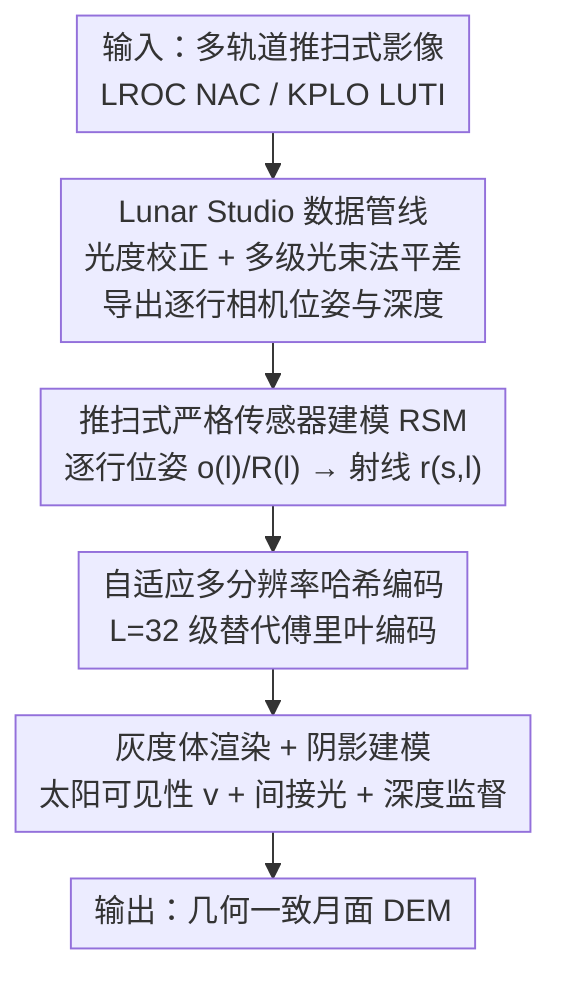

# LNEM: Lunar Neural Elevation Model

**会议**: CVPR 2026  
**论文**: [CVF Open Access](https://openaccess.thecvf.com/content/CVPR2026/html/Lee_LNEM_Lunar_Neural_Elevation_Model_CVPR_2026_paper.html)  
**代码**: https://viewlab-group.github.io/LNEM/ (项目页)  
**领域**: 遥感 / 行星测绘 / 神经体渲染  
**关键词**: 月面DEM, 推扫式相机, 严格传感器模型, 神经体渲染, 阴影建模

## 一句话总结
首个把推扫式相机的严格传感器模型（RSM）显式嵌进神经体渲染的月面 DEM 重建框架，配套一套从原始轨道影像生成几何一致输入的 Lunar Studio 数据管线，在多传感器、多光照条件下重建出几何一致的高保真月面高程模型。

## 研究背景与动机
**领域现状**：行星探测里最关键的任务之一是从卫星影像生成数字高程模型（DEM），月球 DEM 直接关系到着陆点选择、月球车导航和地质制图。传统做法是对重叠影像做立体匹配（stereo matching）的摄影测量管线。

**现有痛点**：（1）传统立体匹配在**无纹理区域**和**推扫式（pushbroom）几何**下很吃力——推扫相机逐行扫描、每行的相机位姿都在变，破坏了对极几何约束，难以做对应搜索；（2）跨轨道光照变化违反了立体匹配的亮度一致假设，地形配准还常需要 LOLA 激光高度计校正；（3）近期把 NeRF 类神经渲染搬到月面的方法，几乎都用简单的**针孔相机**或有理多项式系数（RPC）去近似推扫相机，无法忠实刻画真实月面 3D 几何；（4）整条卫星影像管线还存在几何错配、分布偏置和繁重的手工预处理。

**核心矛盾**：神经体渲染能重建高保真几何，但它的标准假设是"静态针孔相机"；而月球轨道影像本质是"逐行变位姿的推扫式 + 稀疏视角 + 极端光照"，两者的成像模型根本对不上。同时缺一套几何一致、适合神经渲染的标准化月面数据集。

**本文目标**：把神经体渲染真正适配到月面推扫成像——既要正确的逐行传感器几何，又要能处理灰度、低反照率对比、稀疏视角和强光照变化。

**切入角度**：与其用针孔/RPC 近似，不如把**严格传感器模型（RSM）**整条嵌进体渲染——逐行建模相机位置、朝向和光照，让每条相机射线在可学习 3D 体里行进。

**核心 idea**：LNEM = 推扫式 RSM 体渲染 + 月面阴影建模 + 自适应哈希编码 + 深度监督；并配套 Lunar Studio 把碎片化的 ISIS3/ASP 工具链整合成能导出逐行相机旋转和深度的标准化管线。

## 方法详解

### 整体框架
LNEM 要把"逐行变位姿的推扫月面影像"喂进体渲染并重建出几何一致的 DEM。整条链路是：原始多轨道影像先进 Lunar Studio 做光度校正 + 多级光束法平差，导出逐行相机位姿和真值深度；再用推扫式 RSM 把每个像素 $(s,l)$ 换算成带逐行原点和方向的射线；射线采样点经自适应多分辨率哈希编码进网络；最后用灰度体渲染 + 阴影建模 + 深度监督优化出连续的高程场。输入是多轨道 NAC/LUTI 推扫影像，输出是几何一致的月面 DEM。

与"训练单网络泛化大批影像"的 image-to-depth 范式不同，LNEM 优化的是一个**体素隐式表示**：把 DEM 编码成一个连续"坐标→密度"函数的网络权重，能在统一坐标系里非线性融合异构轨道观测、对光照和反照率变化鲁棒，且比显式高程网格更省内存。

### 关键设计

**1. Lunar Studio：把碎片化 ISIS3/ASP 工具链整合成可导出逐行位姿的标准化数据管线**

这针对的是"几何错配 + 分布偏置 + 手工预处理"痛点。现有 ISIS3/ASP 工具虽强但命令碎片化，且不显式输出相机旋转矩阵这类关键中间产物，难以大规模一致处理。Lunar Studio 把所需操作整合成端到端流水线：先做辐射校正（去探测器偏置/暗电流、平场归一化），再用一个从 76 万+ 张 NAC tile 拟合的经验反射模型做光度校正；几何一致性靠**多级光束法平差**——用 SLDEM2015 作形状模型初始化 SPICE 几何、精化多影像控制网、再跑 jigsaw，大幅改善跨轨道配准。最终导出逐行相机旋转和真值相机深度，直接供下游神经渲染使用。它还附带一套 region → site → image 三级数据集层级，全部 co-register 到统一大地坐标系。

**2. 推扫式严格传感器建模：逐行算相机位姿和射线，而不是用针孔/RPC 近似**

这是全文核心，针对"NeRF 默认针孔、对不上推扫几何"。针孔相机所有像素共享一个投影中心，推扫相机却是每条扫描行在不同时刻、用各自的相机位置和朝向采集。对每条推扫行 $l\in\{0,\dots,n\}$，星历时间 $t_l = t_0 + l\,\Delta t$（$\Delta t$ 为行曝光时长）；相机中心 $\mathbf{o}(l)$ 取自 SPK kernel 在 $t_l$ 时的航天器位置（月固坐标系 MOON\_ME），相机到月球的旋转 $\mathbf{R}_{\mathrm{C2M}}(l)$ 由 CK/FK kernel 按 SPICE 约定导出，得到逐行位姿。给定像素 $(s,l)$，相机系视线方向先把样本坐标转焦平面坐标、施加畸变校正得 $(x_u,y_u)$ 再归一化：$\mathbf{d}(s)=\frac{(x_u,y_u,-f)}{\sqrt{x_u^2+y_u^2+f^2}}$。完整射线为 $\mathbf{r}(s,l)=\mathbf{o}(l)+\lambda\,\mathbf{R}_{\mathrm{C2M}}(l)\,\mathbf{d}(s)$，$\lambda\ge0$ 为深度。正是这套逐行 RSM 让体渲染绕开了立体匹配的对极约束失效问题。

**3. 自适应多分辨率哈希编码：替掉对月面"水土不服"的傅里叶位置编码**

标准固定傅里叶特征编码在月面推扫影像上要按 site 单独调高频，导致收敛慢、几何不准。LNEM 改用多分辨率哈希编码：把网格角点映射到 $L$ 个层级共享的可训练表项，拼接各层插值特征 $\mathbf{y}(\mathbf{x})=(\mathbf{y}_1(\mathbf{x}),\dots,\mathbf{y}_L(\mathbf{x}))$ 后送入 MLP。作者用了 $L=32$ 级（是默认配置的两倍）以捕捉细尺度几何变化，换来更稳的收敛和更锐的重建——且一套固定参数就能跨所有 site，不用逐 site 调参。

**4. 灰度体渲染 + 阴影建模 + 深度监督：在单波段、强光照、稀疏视角下稳住几何**

针对"NAC 只给灰度、月面低反照率对比、视角稀疏"。体渲染把沿射线的辐射按密度加权积分：$\hat C(\mathbf{r})=\sum_i T_i(1-\exp(-\sigma_i\delta_i))\,c_i$，把颜色 $c_i$ 换成单波段标量即可从灰度像素学辐射场。阴影建模借鉴地球卫星的辐照建模：用 Lunar Studio 给的太阳方位/入射角推出太阳方向 $\boldsymbol\omega$，为每个采样点预测太阳可见性 $v$ 和间接光 $I_{\mathrm{ind}}$，调制基础灰度：$c_i=c_{g,i}\big(v(\mathbf{x}_i,\boldsymbol\omega)+(1-v(\mathbf{x}_i,\boldsymbol\omega))\,I_{\mathrm{ind}}(\boldsymbol\omega)\big)$，并用阴影校正损失把太阳射线透射率 $T_{\mathrm{SR},i}$ 对齐到可见性：$\mathcal{L}_{\mathrm{SC}}=\sum_{\mathbf{r}}\sum_i (T_{\mathrm{SR},i}-v_i)^2$。深度监督用最高分辨率的 NAC DTM（缺失时退回 SLDEM）提供真值深度，既补稀疏视角的几何约束，又给出度量尺度锚定、消除纯光度训练的尺度歧义。

### 损失函数 / 训练策略
总目标 $\mathcal{L}=\sum_{\mathbf{r}}\big\|\hat C(\mathbf{r})-C(\mathbf{r})\big\|_2^2 + w_{\mathrm{D}}\big\|\hat D(\mathbf{r})-D(\mathbf{r})\big\|_2^2 + w_{\mathrm{SC}}\,\mathcal{L}_{\mathrm{SC}}(\mathcal{R}_{\mathrm{SR}})$，分别为灰度光度损失、深度监督损失、阴影校正损失，权重 $w_{\mathrm{D}}=300$、$w_{\mathrm{SC}}=0.02$；每条相机射线采 $N=512$ 点，太阳射线 $N_{\mathrm{SR}}=512$ 点。Adam（lr $5\times10^{-4}$，CosineAnnealing 到 $5\times10^{-6}$），batch 1024 射线，每 site 训练 5 万–10 万步、单张 RTX 4090 约 4–8 小时。

## 实验关键数据

### 主实验
在 Lunar Studio 8 个 NAC 区域上，以 LOLA 激光高度计为真值评估高程误差（米，越低越好）。$\mathrm{RMSE}_{\mathrm{LOLA}}$ 为原始误差，$\mathrm{RMSE}_{\mathrm{corr}}$ 为去除全局垂直偏置后的误差（更能反映局部地形形状保真度）。下表对比去偏 $\mathrm{RMSE}_{\mathrm{corr}}$：

| 区域 | LNEM(本文) | Sat-NeRF | EO-NeRF | ASP 立体 |
|--------|------|------|----------|------|
| Apollo 15 | **1.565** | 39.196 | 58.386 | 3.103 |
| Apollo 17 | **1.228** | 24.169 | 29.824 | 1.986 |
| Tycho | **0.979** | 11.207 | 46.951 | 0.672 |
| Lacus Mortis Pit | **2.025** | 8.734 | 62.296 | 109.961 |
| Marius Hills Pit | 0.673 | 6.209 | 38.243 | 1.891 |

LNEM 全 8 区域 $\mathrm{RMSE}_{\mathrm{corr}}$ 落在 0.67–5.67 m；EO-NeRF 因无深度监督存在尺度歧义、甚至把坑重建成凸面；Sat-NeRF 加了深度监督但多数区域仍显著高于 LNEM；ASP 在几何条件好的区域（Apollo 16/Tycho）有竞争力，但在窄基线的 Lacus Mortis Pit 因三角化不稳而严重崩坏（$\mathrm{RMSE}_{\mathrm{corr}}$ 达 109.96 m）。

### 消融实验

| 配置 | 关键指标 | 说明 |
|------|---------|------|
| LNEM (with SM) | $\mathrm{RMSE}_{\mathrm{LOLA}}$ Tycho 2.117 / V.Schröteri 4.248 | 完整模型（含阴影建模） |
| LNEM (without SM) | Tycho 3.886 / V.Schröteri 10.904 | 去掉阴影建模，多数区域误差上升 |
| 哈希编码 (LNEM) | PSNR Apollo15 48.41 / Apollo17 48.39 | 自适应多分辨率哈希编码 |
| 傅里叶编码 (最优 $M$) | PSNR Apollo15 29.01 / Apollo17 33.38 | 需逐 site 调 $M$，且跨 site 不一致 |

### 关键发现
- **阴影建模（SM）整体降误差**：Apollo 15（10.6→8.6）、Tycho（3.89→2.12）、V. Schröteri（10.90→4.25）、Marius Hills（1.53→0.68）都明显改善（少数如 Apollo 16 略升，⚠️ 个别区域 SM 收益不稳）。
- **哈希编码远胜傅里叶编码**：PSNR 从 ~29–33 提到 ~48，且一套固定参数跨所有 site 一致，省掉逐 site 高频调参。
- **误差主因常是全局垂直偏置**：$\mathrm{RMSE}_{\mathrm{LOLA}}$ 与 $\mathrm{RMSE}_{\mathrm{corr}}$ 的巨大差距说明很多原始误差来自整体偏移；KPLO LUTI 上即使去偏 Apollo 15 仍有 $\mathrm{RMSE}_{\mathrm{corr}}=29.07$ m，作者归因于重建 SPICE kernel 的指向不确定性大（核质量问题），而非方法本身。
- **视角数决定精度**：三视图 site 达 0.67–3.69 m，双视图 site（Apollo 16/Eimmart A）升到 4.10–5.67 m；Eimmart A 因轨道高度差大、跨轨重叠低，几何约束更弱。

## 亮点与洞察
- **把"严格传感器模型"整条嵌进体渲染，而非近似**：这是首个为月面推扫成像做逐行 RSM 体渲染的工作，直接解决了 NeRF 针孔假设与推扫几何的根本错配，思路可推广到任何线扫/推扫式遥感传感器。
- **数据管线即贡献**：Lunar Studio 把碎片化 ISIS3/ASP 流程整合并显式导出逐行相机旋转 + 深度，等于给"行星遥感 → 学习式重建"之间架了桥，复用价值很高。
- **去偏 RMSE 的评测设计很诚实**：把全局垂直偏置和局部形状误差分开报（bias / $\mathrm{RMSE}_{\mathrm{corr}}$ / std），并指出 LUTI 大误差源于 kernel 质量而非方法，这种归因方式值得遥感重建类工作借鉴。

## 局限与展望
- 重建是 per-site 优化（每个 site 训一个隐式场，4–8 小时），不是可泛化的前馈模型，规模化覆盖全月成本高。
- 精度受输入视角数和 SPICE kernel 质量强约束：双视图、窄基线、kernel 指向不确定时误差明显放大；LUTI 上即便去偏仍有几十米误差。
- 阴影建模在个别区域（如 Apollo 16）未必降误差，⚠️ 收益与地形/光照条件相关，未给出何时失效的判据。
- 仍依赖现有 DEM（NAC DTM/SLDEM）做深度监督和尺度锚定，在完全无先验 DEM 的新区域适用性待验证；作者定位 LNEM 为传统 DEM 管线的"可扩展补充"而非替代。

## 相关工作与启发
- **vs LunarNRM**: LunarNRM 把 NeRF 搬上月球但用 RPC 相机、且缺经过严格验证的多轨道推扫基准；LNEM 用逐行 RSM 直接进体渲染，并配套 Lunar Studio 多轨道基准，几何忠实度本质不同。
- **vs EO-NeRF / Sat-NeRF（地球卫星 NeRF）**: 它们用 RPC 相机模型 + 光照建模处理地球观测，但 RPC 近似在稀疏视角下几何误差累积；本文证明严格推扫建模 + 深度监督在月面上大幅优于 RPC 近似，EO-NeRF 甚至把坑重建成凸面。
- **vs ASP 立体管线**: ASP 在好的立体几何下有竞争力，但窄基线月面场景三角化不稳会严重崩坏；LNEM 的体渲染对窄基线更鲁棒。
- **vs 学习式 DEM 精化（image-to-depth）**: 那类方法训单网络泛化、测试时几何约束弱；LNEM 优化连续隐式高程场，能非线性融合异构轨道观测且与影像外观解耦。

## 评分
- 新颖性: ⭐⭐⭐⭐⭐ 首个逐行 RSM 嵌入体渲染的月面 DEM 框架，配套多轨道基准与管线
- 实验充分度: ⭐⭐⭐⭐⭐ 双传感器(NAC/LUTI)、8 区域、对 LOLA 真值评测、与 NeRF/立体多基线对比 + 消融
- 写作质量: ⭐⭐⭐⭐ 物理建模与评测严谨，公式因 OCR 略难读，部分细节需对照原文
- 价值: ⭐⭐⭐⭐⭐ 着陆点选择/地质制图刚需，且开源数据集+管线推动行星遥感重建社区

<!-- RELATED:START -->

## 相关论文

- [\[CVPR 2026\] Spatial-Spectral Residuals Informed Diffusion Neural Operator for Pan-sharpening](spatial-spectral_residuals_informed_diffusion_neural_operator_for_pan-sharpening.md)
- [\[CVPR 2026\] PiLoT: Neural Pixel-to-3D Registration for UAV-based Ego and Target Geo-localization](pilot_neural_pixel-to-3d_registration_for_uav-based_ego_and_target_geo-localizat.md)
- [\[CVPR 2026\] HyperFM: An Efficient Hyperspectral Foundation Model with Spectral Grouping](hyperfm_an_efficient_hyperspectral_foundation_model_with_spectral_grouping.md)
- [\[CVPR 2026\] GeoDiT: A Diffusion-based Vision-Language Model for Geospatial Understanding](geodit_a_diffusion-based_vision-language_model_for_geospatial_understanding.md)
- [\[CVPR 2026\] UniChange: Unifying Change Detection with Multimodal Large Language Model](unichange_unifying_change_detection_with_multimodal_large_language_model.md)

<!-- RELATED:END -->
