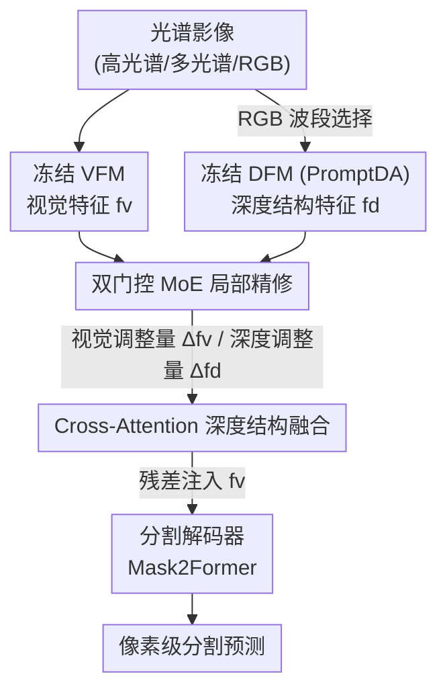

# Local Precise Refinement: A Dual-Gated Mixture-of-Experts for Enhancing Foundation Model Generalization against Spectral Shifts

**会议**: CVPR 2026  
**论文**: [CVF Open Access](https://openaccess.thecvf.com/content/CVPR2026/html/Chen_Local_Precise_Refinement_A_Dual-Gated_Mixture-of-Experts_for_Enhancing_Foundation_Model_CVPR_2026_paper.html)  
**代码**: 项目页 https://nudt-sawlab.github.io/SpectralMoE/ （代码待开源）  
**领域**: 遥感 / 域泛化语义分割 / 基础模型微调  
**关键词**: 光谱遥感, 域泛化分割, 混合专家, 深度先验, 基础模型微调

## 一句话总结
SpectralMoE 把冻结基础模型（DINOv3/DOFA）的每层特征送进一个**双门控 MoE**做逐空间位置的精细调制，并用从 RGB 波段估计出的深度结构先验通过 cross-attention 注入视觉特征，从而在七个跨传感器/跨区域/跨风格的光谱遥感域泛化分割基准上全部刷到 SOTA。

## 研究背景与动机
**领域现状**：光谱遥感（高光谱/多光谱/RGB）的语义分割要给每个像素判地物类别。把它部署到没见过的区域、季节、传感器时，会遇到严重的「光谱漂移」（spectral shift）——同一类地物在不同采集条件下光谱特征差异巨大。域泛化语义分割（DGSS）就是要在只用源域训练、拿不到目标域数据的前提下，训出能跨场景泛化的模型。近来主流范式是把强大的基础模型（VFM 如 DINOv3、RSFM 如 DOFA）冻结，再用轻量微调适配下游分割。

**现有痛点**：以 REIN、DepthForge 为代表的微调方法对整张特征图做**全局、同质**的调整——所有空间位置共享同一组可学习的 adapter token。但遥感影像的地物在空间上是高度异质的：比如「水田」和「池塘」既光谱相似、又空间相邻，一套为某类设计的全局增强很容易误伤旁边那个光谱像、语义却不同的类，导致类间混淆。这种「一刀切」的调整无法对局部特征做差异化处理，成了复杂光谱遥感场景的瓶颈。

**核心矛盾**：光谱信号本身在跨域时不稳定（受传感器/光照/季节影响），而现有微调又只会做空间均匀的调整，等于用一个不稳定的信号去做无差别的全局适配——既没解决「特征该按位置区别对待」，也没引入比光谱更稳的线索。

**本文目标**：(1) 把全局同质微调换成**逐空间位置的条件计算**，让每个位置的特征被分派到最合适的「专家」做定制调整；(2) 引入一种跨域更鲁棒的结构先验来压住光谱歧义。

**切入角度**：作者观察到，地物的高度、轮廓、空间关系这类**结构信息**比光谱特征对场景/光照/季节的变化鲁棒得多。于是用深度基础模型（DFM，如 PromptDA）从光谱影像的 RGB 波段反推「隐式深度特征」当结构先验。

**核心 idea**：用「双门控 MoE 做局部精修 + cross-attention 注入深度结构先验」替代「全局同质微调」，把跨域不稳的光谱适配，变成空间自适应的、有结构锚点的精细调制。

## 方法详解

### 整体框架
SpectralMoE 是一个**即插即用的微调框架**：把一个轻量的 SpectralMoE 模块插进冻结 VFM 和冻结 DFM 的每一层，训练时只更新 SpectralMoE 模块和分割头（Mask2Former decoder），两个 backbone 全程冻结。整条管线是：源域多光谱影像走两路——一路进 VFM 抽视觉特征 $f^v$，另一路先做 RGB 波段选择、送进 DFM 抽深度特征 $f^d$；两路特征在每层各自进入**双门控 MoE**，按 token（即每个空间位置）独立路由到 top-k 专家做精修，得到调整量 $\Delta\hat f^v$ 和 $\Delta\hat f^d$；随后 **cross-attention 融合模块**把深度结构调整量注入视觉调整量，融合结果残差加回原视觉特征；逐层精修后的视觉特征送入分割解码器出预测。

### 关键设计

**1. 双门控 MoE：让每个空间位置被分派给最合适的专家，而不是全局一刀切**

针对「全局同质微调误伤相邻相似类」的痛点，SpectralMoE 在每层实例化 $N_e$ 个并行专家网络，对视觉和深度特征**逐 token（逐空间位置）**路由，而不是学一组共享 adapter。关键在于「双门控」：视觉模态和深度模态各有一套独立的门控矩阵 $W^j_{gate}$ 和噪声矩阵 $W^j_{noise}$（$j\in\{v,d\}$），路由完全模态独立，避免两种分布差异很大的模态共享门控时互相干扰。对第 $i$ 个位置、模态 $j$ 的特征 $f^j_i$，用一个基于距离的带噪门控算路由 logit：

$$(h^j_i)_e = -\lVert f^j_i - w^j_{gate,e}\rVert_p + \epsilon_e \cdot \mathrm{Softplus}\big((f^j_i)^\top w^j_{noise,e}\big)$$

其中 $w^j_{gate,e}$ 是第 $e$ 个专家的「原型」，$\lVert\cdot\rVert_p$ 是 $L_p$ 距离（$p=1$ 即 Laplacian Gating），$\epsilon_e\sim\mathcal N(0,1)$ 是探索噪声。注意这里用的是「特征到专家原型的距离」而非常规的点积打分——越靠近原型分越高，更像把空间位置按特征做软聚类再分派。取 top-k 专家后对其 logit 做 softmax 得门控权重 $g^j_{i,e}$，未入选的专家权重置 0、不参与计算。这样每个位置都能拿到「为它定制」的专家组合，从根上解决了「一类的增强误伤邻接相似类」。

**2. 低秩专家 + 感知图调制：让专家既轻量又能做精细的 token 级调整**

每个专家 $E_e$ 的核心参数是一组自适应 token $T_e\in\mathbb R^{m\times d}$，为省参用低秩分解 $T_e = A_e\cdot B_e$（$A_e\in\mathbb R^{m\times r}$，$B_e\in\mathbb R^{r\times d}$，秩 $r\ll d$），在不丢表达力的前提下大幅压参。专家对输入 token 的调整不是简单加一个偏置，而是先算 token 和专家自适应 token 之间的「感知图」（perceptual map）$A^j_{i,e}=\mathrm{Softmax}(f^j_i\cdot T_e^\top/\sqrt d)$，再用它去加权经 MLP 投影后的 $T_e$ 得到该专家的调整量 $\Delta z^j_{i,e}=A^j_{i,e}\cdot(T_e W^\top + b_T)$，最后按门控权重把 top-k 专家的调整量聚合成该位置的最终调整 $\Delta\hat f^j_i=\sum_{e\in I^j_i} g^j_{i,e}\,\Delta z^j_{i,e}$。「感知图」本质是让每个位置先看自己和专家原型有多匹配，再据此决定吸收专家知识的程度，使调整是内容自适应的而非固定模板。

**3. Cross-attention 注入深度结构先验：用比光谱更稳的结构信息压住歧义**

光谱在跨域时不可靠，作者用 DFM 从 RGB 波段反推的深度特征当鲁棒结构锚点。但深度和视觉不能简单相加——简单加法不会区分「哪段结构信息对哪个视觉位置有用」。于是把视觉调整图 $\Delta\hat f^v$ 当 query、把整张深度调整图 $\Delta\hat f^d$ 当 key/value 做 cross-attention：

$$\Delta f = \mathrm{softmax}\Big(\frac{\Delta\hat f^v\cdot(\Delta\hat f^d)^\top}{\sqrt d}\Big)\cdot\Delta\hat f^d$$

让每个视觉位置主动「查询」整张深度图、聚合最相关的结构线索。融合结果再以残差+可学习标量 $\alpha$ 调制注入原视觉特征：$f^v_{out}=f^v+\alpha\cdot\mathrm{MLP}(\Delta f + f^v)$。这样在光谱相似（如水田/池塘）的区域，结构先验能帮模型把语义不同但光谱接近的类区分开。

### 损失函数 / 训练策略
总损失为 Mask2Former 解码损失加 MoE 负载均衡损失：$\mathcal L = \mathcal L_{mask} + \lambda\cdot\mathcal L_{load}$。负载均衡损失对视觉、深度两个模态分别算再取平均，用专家重要性的「变异系数平方」作目标：$\mathcal L_{load}(f^j)=\big(\mathrm{Std}(\mathrm{Imp}(f^j))/\mathrm{Mean}(\mathrm{Imp}(f^j))\big)^2$，其中专家 $m$ 的重要性 $\mathrm{Imp}^j_m=\sum_i g^j_{i,m}$ 是它在所有 token 上门控值之和。这一项逼门控把负载均匀分给所有专家，防止「专家坍缩」（少数专家被反复选、其余闲置）。训练 20 epoch，AdamW，学习率 $1\times10^{-4}$，batch 8，输入 resize 到 $512\times512$。

## 实验关键数据

### 主实验
七个 DGSS 基准，跨高光谱/多光谱/RGB，覆盖跨区域、跨传感器、跨风格、跨光谱波段、跨大洲等域偏移。高光谱用 DOFA（RSFM）backbone，多光谱与 RGB 用 DINOv3（VFM）。下表摘取代表性任务的 mIoU（%）对比强基线：

| 任务（域偏移） | DINOv3/DOFA 冻结 | REIN | DepthForge | SpectralMoE | 较最强对手 |
|----------------|------------------|------|-----------|-------------|-----------|
| WHU-OHS 高光谱（跨区域） | 46.03(DOFA) | 48.71 | 56.61 | **59.83** | +3.22 |
| Five-Billion-Pixels（跨传感器） | 55.54 | 59.06 | 58.79 | **66.19** | +7.13 |
| Five-Billion-Pixels（跨区域） | 54.44 | 55.27 | 54.92 | **60.32** | +4.71 vs SET |
| FLAIR（跨区域） | 59.60 | 60.46 | 61.56 | **63.18** | +1.62 |
| LoveDA（跨风格） | 55.75 | 56.96 | 57.50 | **59.11** | +1.61 |
| Potsdam→Vaihingen（跨光谱波段） | 58.79 | 60.54 | 59.57 | **64.99** | +4.45 |
| OpenEarthMap（跨大洲） | 65.48 | 66.76 | 66.85 | **68.57** | +1.72 |

七个任务全部 SOTA。一个有趣现象：把 DINOv3 通过插值输入 embedding 适配到多光谱后，它作为冻结基线竟显著超过专为遥感预训练的 DOFA（跨传感器上领先 10.94 mIoU），作者归因于 VFM 的预训练数据量（数十亿图像）远大于 RSFM（数百万）。

### 消融实验
DINOv3 backbone 上各组件消融（mIoU %，三个多光谱任务：跨传感器 CS / 跨区域 CR / FLAIR）：

| 配置 | FBP(CS) | FBP(CR) | FLAIR(CR) | 说明 |
|------|---------|---------|-----------|------|
| 完整 SpectralMoE | 66.19 | 60.32 | 63.18 | — |
| w/o MoE（退化成单专家=全局同质） | 63.41 | 59.37 | 60.82 | 掉 2.78 / 0.95 / 2.36 |
| w/o Dual Gating（视觉深度共享门控） | 63.44 | 58.97 | 61.95 | 掉 2.75 / 1.35 / 1.23 |
| w/o Depth Feature（去掉深度输入） | 63.52 | 59.01 | 63.07 | 掉 2.67 / 1.31 / 0.11 |
| w/o Cross-Attention（融合改成相加） | 63.48 | 58.35 | 61.30 | 掉 2.71 / 1.97 / 1.88 |

### 关键发现
- **MoE 局部精修是最大功臣**：退化成单专家（全局同质）在跨传感器掉 2.78 mIoU，印证「局部精修缓解空间异质带来的类间混淆」是核心。
- **双门控的价值在于防模态干扰**：视觉和深度共享门控时三任务均下滑（最多 2.75），说明两种分布差异大的模态确实需要各自独立的路由通道。
- **深度先验 + cross-attention 缺一不可**：深度输入在跨传感器/跨区域贡献明显（2.67/1.31），但在 FLAIR 几乎无增益（0.11）；而把 cross-attention 换成简单相加在三任务均显著掉点（最多 1.97），说明「查询式聚合」比「直接相加」更会用结构信息。
- **专家数非单调，$N_e=6$ 最优**：超过 6 个后因功能冗余、每个专家训练数据被摊薄而退化，作者在性能与参数线性增长间权衡选了 6。
- **跨 backbone 鲁棒**：在 CLIP / SAM / EVA02 / DINOv2 四种 VFM 上 SpectralMoE 均超所有对手，且各方法都在 DINOv2 上表现最好；adapter 参数仅 5.74M（DINOv3），比 FADA 的 11.65M 更省。

## 亮点与洞察
- **把 MoE 当「空间自适应微调器」用**：常规 MoE 是为容量扩展/稀疏激活，这里巧在用它做「逐空间位置的条件特征调整」，正好对上遥感地物空间异质这个痛点——MoE 的路由天然就是「按位置区别对待」。
- **基于距离的门控 + 低秩专家**：路由用「特征到专家原型的距离」而非点积，更像在线软聚类；专家用低秩分解 token，使整套 MoE 仍然轻量（个位数 M 参数），这个组合可迁移到其他 PEFT 场景。
- **「光谱不稳就借结构」的换锚点思路**：用 DFM 从 RGB 反推深度当跨域鲁棒先验，是个很通用的 trick——任何「主信号跨域漂移」的任务都可以想想有没有更稳的旁路信号当锚点（深度/边缘/几何）。
- **VFM 插值适配多光谱反超 RSFM**：提示遥感社区，与其专门预训练 RSFM，不如把超大规模自然图像 VFM 迁过来，预训练数据规模带来的泛化可能更重要。

## 局限与展望
- **深度先验依赖 RGB 波段**：深度由 PromptDA 从 RGB 波段估计，对只有非可见光波段、或 RGB 质量差的高光谱数据，结构先验的可靠性存疑；消融里深度在 FLAIR 几乎无增益（0.11）也暗示并非所有场景都吃这套。
- **逐层逐 token 的双路 MoE 带来推理开销**：虽然可训练参数少，但每层都跑两套 MoE + cross-attention，且要额外跑一个 DFM 前向，实际推理成本和显存未充分讨论。
- **代码尚未开源**：仅有项目页，复现门槛较高；负载均衡权重 $\lambda$、$\alpha$ 等超参敏感性未给。
- **专家数固定为 6**：是全局最优还是各任务/各 backbone 都该单独调，论文没展开；不同域偏移程度可能需要不同专家容量。

## 相关工作与启发
- **vs REIN / DepthForge（FM-based DGSS adapter）**：它们做全局同质微调（REIN 学共享 adapter token，DepthForge 引深度但融合较简单），本文做逐位置的 MoE 局部精修 + 双门控 + 查询式深度融合，区别在「空间自适应 + 模态独立路由」，七基准全面领先。
- **vs 通用 PEFT（LoRA / AdaptFormer / VPT）**：通用 PEFT 不针对域泛化和空间异质，本文在 DINOv3/DOFA 上均显著超过它们，说明遥感 DGSS 需要专门的空间自适应机制而非通用 adapter。
- **vs 传统 DGSS（数据增强 / 域不变特征 / 元学习）**：传统方法受限于中小 backbone 表达力，难抗剧烈光谱漂移；本文把战场搬到冻结大基础模型 + 轻量微调，借基础模型的泛化底子再做精修。

## 评分
- 新颖性: ⭐⭐⭐⭐ 把 MoE 重新诠释为「空间自适应微调器」并配双门控 + 深度结构先验，组合新颖、动机扣得紧，但各部件（MoE/低秩/cross-attention/深度先验）单看都是已有积木。
- 实验充分度: ⭐⭐⭐⭐⭐ 七个跨多种域偏移的基准 + 四种 VFM backbone + 通用 PEFT 对比 + 完整组件/专家数消融，证据扎实。
- 写作质量: ⭐⭐⭐⭐ 逻辑清晰、公式完整、图示到位；个别核心概念（感知图、距离门控）可再多给直觉。
- 价值: ⭐⭐⭐⭐ 即插即用、参数省、跨 backbone 稳，对光谱遥感跨域分割的工程落地有实用价值。

<!-- RELATED:START -->

## 相关论文

- [\[CVPR 2026\] HyperFM: An Efficient Hyperspectral Foundation Model with Spectral Grouping](hyperfm_an_efficient_hyperspectral_foundation_model_with_spectral_grouping.md)
- [\[CVPR 2026\] VLM4RSDet: Collaborative Optimization with Vision-Language Model for Enhancing Remote Sensing Object Detection](vlm4rsdet_collaborative_optimization_with_vision-language_model_for_enhancing_re.md)
- [\[CVPR 2026\] Improving Visual Grounding in Remote Sensing via Cluster-Guided Refinement and Model Ensemble Voting](improving_visual_grounding_in_remote_sensing_via_cluster-guided_refinement_and_m.md)
- [\[CVPR 2026\] ORSATR-X: A Foundation Model based on Differential-and-Excitation Networks for Optical Remote Sensing Object Recognition](orsatr-x_a_foundation_model_based_on_differential-and-excitation_networks_for_op.md)
- [\[CVPR 2026\] GeoBridge: A Semantic-Anchored Multi-View Foundation Model Bridging Images and Text for Geo-Localization](geobridge_a_semantic-anchored_multi-view_foundation_model_bridging_images_and_te.md)

<!-- RELATED:END -->
