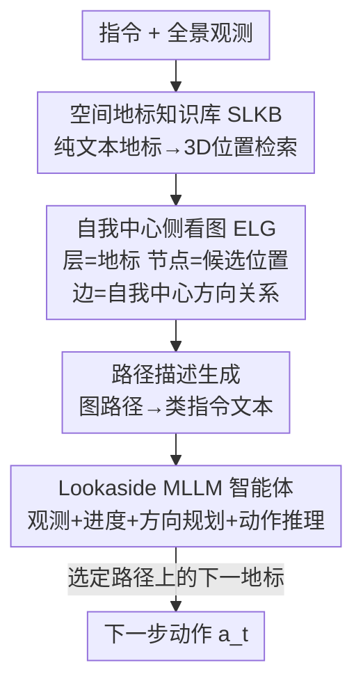

# LookasideVLN: Direction-Aware Aerial Vision-and-Language Navigation

**会议**: CVPR2026  
**arXiv**: [2604.17190](https://arxiv.org/abs/2604.17190)  
**代码**: 待确认  
**领域**: 遥感 / 空中视觉语言导航（Aerial VLN）  
**关键词**: Aerial VLN、方向线索、自我中心图、MLLM 导航、零样本

## 一句话总结
针对无人机空中视觉语言导航中"地标描述歧义大、全局场景图维护昂贵"的问题，LookasideVLN 提出"侧看（lookaside）"范式：用指令里天然带的方向线索（左转/右转/上升）构建一张轻量的自我中心地标图，把候选路径翻译成"类指令"文本交给 MLLM 做语义对齐，从而在零样本、单层前瞻下就超过需要全局序列前瞻的 SOTA（CityNavAgent）。

## 研究背景与动机

**领域现状**：空中视觉语言导航（Aerial VLN）让无人机按自然语言指令在城市级环境中飞行。近期主流做法沿用地面 VLN 的"前瞻（lookahead）"思路——维护一张大规模记忆图 / 场景图，把指令里的**地标描述序列**和无人机沿途观测做序列级对齐，再用图搜索做路径规划（如 CityNavAgent、LM-Nav）。

**现有痛点**：① 城市场景里地标描述高度歧义——"tree""wall""traffic light"对应大量实例，单个地标描述根本无法定位到唯一位置，逐地标对齐很容易选错路；② 为了缓解歧义，现有方法转而假设"地标**序列**唯一"并维护城市级全局场景图，但全局图的构建与维护在大规模环境里计算和内存代价极高，效率低下；③ 这些方法只盯着地标的语义相似度，**完全忽略了指令里的方向线索**，对指令理解很浅。

**核心矛盾**：地标语义本身在城市里区分度不足（一对多），而要靠纯地标序列消歧又必须背上全局图的沉重代价——歧义消解和计算效率之间存在 trade-off。

**本文目标**：在不维护全局场景图的前提下消除地标歧义、做出准确路径规划，同时大幅降低计算开销。

**切入角度**：作者注意到人类导航指令本身就密集携带方向线索——"turn left""go past the building on your right""fly straight ahead"。这些方向线索是**自我中心**的（相对导航者自身朝向，而非全局地图坐标），编码了丰富的空间上下文，恰好能在不引入全局图的情况下区分同类地标里"哪一个才是对的"。

**核心 idea**：用指令中的方向线索代替"全局地标序列对齐"来消歧——只为当前指令动态搭一张小的自我中心图，把图上路径翻译成"类指令"语言文本，让 MLLM 做语义级方向感知的路径选择。

## 方法详解

### 整体框架

LookasideVLN 是一个零样本（训练-free）的无人机导航系统，输入是自然语言指令 $\mathcal{I}$ 和当前全景观测，输出是下一步离散动作。整条流水线是：先从一个轻量的**空间地标知识库（SLKB）**里，按指令抽取的地标描述检索出各候选地标的 3D 位置；再用这些候选位置动态搭建**自我中心侧看图（ELG）**，图的每一层对应指令里的一个未访问地标、层内节点是该地标的若干候选位置，层间边记录"自我中心方向关系"（转多少度、升降多少米、前进多少米）；接着把图上每条可能路径**翻译成"类指令"的方向感知路径描述**；最后**Lookaside MLLM 导航智能体**联合指令、这些路径描述和当前全景观测，做链式推理选出最匹配的路径并决定下一步动作。

### 关键设计

**1. 空间地标知识库 SLKB：用纯文本地标-位置对替代昂贵的全局场景图**

痛点是全局场景图既重又慢——它要显式建模地标之间的关系，在城市级环境里维护成本爆炸。SLKB 反其道而行，设计成一个分层、轻量、可扩展的记忆模块：$\mathcal{K}=\{l^{kb}_i:\{p^{kb}_{i,0},p^{kb}_{i,1},\dots\}\}$，即每个地标描述 $l^{kb}_i$ 下挂着它在场景里的若干 3D 候选位置 $p^{kb}_{i,j}$，**只存（描述，位置），不存地标间关系**。新条目从 RGB 观测构建：MLLM 地标识别器 $\mathrm{LR}(\cdot)$ 生成地标文本描述，GroundingDINO 地标检测器 $\mathrm{LD}(\cdot)$ 出框，NMS 去重后结合深度图把像素坐标反投影成世界坐标 $p^{kb}_i=\frac{\bar d_i}{\|K^{-1}p^{pixel}_i\|_2}\cdot RK^{-1}p^{pixel}_i+T$（$\bar d_i$ 是去掉 $2\sigma$ 外离群后框内平均深度，$K,R,T$ 为相机内参/旋转/平移）。新（描述，位置）对插入时按相似度判断是否已有同类地标，有则合并位置、无则新建，保持库紧凑且空间一致。

为什么"只用文本描述、丢掉细粒度视觉特征"是合理的？作者借**李比希最小因子定律（木桶理论）**论证：语言-视觉对齐能利用的信息上限，被**指令这一语言模态本身的信息量**卡住了——既然指令只给得出"桥""路口"这种文本级线索，那么前作里那些细粒度视觉特征对对齐其实是冗余的，去掉它们能直接砍掉记忆和计算开销。检索时对指令抽取的每个地标描述 $l^{instr}_i$ 取词嵌入，与库中所有 $l^{kb}_j$ 算余弦相似度取最大：$l^{ret}_i=\arg\max_{l^{kb}_j\in\mathcal{K}}\mathrm{sim}(\mathrm{emb}(l^{instr}_i),\mathrm{emb}(l^{kb}_j))$，再把该描述下所有候选位置一并取出，检索极快

**2. 自我中心侧看图 ELG：把指令里的方向线索显式编码成层间边**

这是消歧的核心。痛点是同类地标在城市里有多个实例（多座桥、多个路口），纯靠地标本身分不清走哪条。ELG 从无人机当前位置出发，只挑接下来 $N_{ahead}$ 个未访问地标 $\mathcal{L}^{unvis}$ 来建图（而非整城建图），因此天然比全局场景图小得多、只含"和当前指令相关"的地标。图是分层的：第 $i$ 层对应指令里第 $i$ 个未访问地标描述，层内每个节点是该地标的一个候选位置 $p^{unvis}_{i,j}$；相邻两层之间，前一地标的每个候选位置都与后一地标的每个候选位置连边，边上挂"自我中心侧看方向关系"。

"自我中心"和"侧看"的精髓在于方向是相对**未来朝向**算的：考虑连续三个地标候选 $(p^{unvis}_{i-1,j},p^{unvis}_{i,k},p^{unvis}_{i+1,m})$，先用前两点估计智能体到达 $p_{i,k}$ 时的朝向单位向量 $\mathbf{p}^{i,k}_{i-1,j}=\frac{p^{unvis}_{i,k}-p^{unvis}_{i-1,j}}{\|\cdot\|_2}$，再以这个朝向为参考，算出去往 $p_{i+1,m}$ 的水平偏转角 $\theta$、垂直升降 $e$、水平距离 $d$（其中 $\theta=\mathrm{hangle}(\cdot)$ 用 $\mathrm{atan2}$ 在 $xy$ 平面求偏角）。这样"右转"就被严格定义成"到达上一个关键地标后、相对自身朝向的偏转"，和人类指令里"到路口后右转"的语义完全一致——这正是它能精准消歧而又不需要全局图的原因

**3. 路径描述生成 + Lookaside MLLM 智能体：把图路径翻译成"类指令"文本，让 MLLM 做方向感知规划**

光有几何方向关系，MLLM 不一定吃得透。本设计把 ELG 上每条可能路径**翻译回自然语言**，使其和用户指令同构、便于语义对齐。对第一个未访问地标用细粒度描述："Turn left/right $|\theta|$ degrees, move forward $d$ meters and ascend/descend $e$ meters to reach $l^{unvis}_{i+1}$"；后续步骤用更粗的描述："Turn left/right $|\theta|$ degrees and move toward $l^{unvis}_{i+1}$"。遍历 ELG 所有可能路径得到候选路径集合 $\mathcal{P}$（并辅以基于距离的剪枝提效），例："Turn left 30 degrees, move forward 10 meters and descend 4 meters to reach the intersection, then turn right 45 degrees and proceed toward the bridge…"。

Lookaside MLLM 导航智能体（基于 Qwen2.5-VL-72B）以 $\mathcal{I}$、路径描述集 $\mathcal{P}$、当前六视角全景观测 $O_t=\{o_{t,i}\}_{i=1}^6$（前/左/右/后/上/下）为输入，按链式思维依次：① 生成**观测描述**理解周围环境；② 总结**导航进度**判断当前处于任务哪一步；③ 做**方向感知路径规划**——识别候选路径里的未访问地标、从指令里抽出对应片段、据此选最匹配的路径；④ 做**动作推理**，结合选中路径上的下一地标、指令和观测决定下一步动作 $a_t$。这种"把方向线索语言化再交给 MLLM"的设计，让规划既鲁棒又可解释，是单层前瞻就能打过全序列前瞻 SOTA 的关键

### 一个完整示例

设指令为"飞到路口后右转，向桥前进"。① SLKB 检索："intersection"匹配到库里 2 个候选位置、"bridge"匹配到 3 个候选位置。② 建 ELG（$N_{ahead}=2$）：第 1 层 2 个路口节点、第 2 层 3 个桥节点，全连接共 6 条层间边；对每条边以"到达该路口时的朝向"为参考算出偏转角、升降、距离。③ 路径描述生成：6 条路径各翻译成一句"类指令"，如"Turn left 30 degrees, move forward 10 meters and descend 4 meters to reach the intersection, then turn right 45 degrees and proceed toward the bridge"。④ MLLM 智能体把这 6 句与原指令"右转"对齐，挑出转向角与"右转"语义最吻合的那条路径，再据其下一地标输出动作（如多次 Move Forward + Turn Right）。论文定性图还显示：当 $\mathcal{P}$ 里没有任何候选与指令匹配时，智能体能转而直接读懂指令线索（如识别"elevate"且发现自己在地面）改选 Ascend 动作。

### 损失函数 / 训练策略
本方法是**零样本 / 训练-free** 的，不训练任何参数，全部依赖现成 MLLM（Qwen2.5-VL-72B 规划、Qwen-VL-Max 做地标识别、GroundingDINO 检测）的零样本能力。关键超参：前瞻步数 $N_{ahead}=2$；每步从 6 个离散动作里选（Turn Left/Right 各 15°、Ascend/Descend 各 2m、Move Forward 5m、Stop）并指定执行次数；SLKB 对每个 seen 场景随机采样 50 条训练轨迹构建，unseen 场景则预渲染图像作为观测。

## 实验关键数据

### 主实验

AerialVLN benchmark（8446 条专业飞手轨迹、25 个城市级 UE4 场景、平均路径长 661.8m），与学习型方法比（零样本，无训练）：

| 数据集 | 指标 | LookasideVLN | Zhao'25 | Seq2Seq |
|--------|------|------|----------|------|
| Val Seen | SR↑ | 5.7 | **7.5** | 2.9 |
| Val Seen | OSR↑ | **26.1** | 12.6 | 10.2 |
| Val Unseen | SR↑ | **6.4** | 3.2 | 1.1 |
| Val Unseen | OSR↑ | **21.3** | 8.1 | 5.6 |

关键看点：本文 OSR 大幅领先，且在 Unseen 上 SR（6.4）反超 Seen（5.7），而学习型方法 Unseen 全面崩盘（Zhao'25 从 7.5 掉到 3.2），体现零样本范式的泛化优势。

AerialVLN-S（17 个紧凑场景），与零样本 Aerial VLN SOTA 比：

| 数据集 | 指标 | LookasideVLN (Qwen2.5-VL-72B) | CityNavAgent (GPT-4V) | STMR (GPT-4o) |
|--------|------|------|----------|------|
| Val Seen | SR↑ | **14.7** | 13.9 | 12.6 |
| Val Seen | SDTW↑ | **5.4** | 5.1 | - |
| Val Seen | NE↓ | **77.1** | 80.8 | 96.3 |
| Val Unseen | SR↑ | **12.6** | 11.7 | 10.8 |
| Val Unseen | OSR↑ | **36.0** | 35.2 | 23.0 |

用相对更小的 Qwen2.5-VL-72B、且仅单层级前瞻，就在多数关键指标上超过全序列前瞻的 CityNavAgent。

### 消融实验

模块消融（AerialVLN-S Val Seen）：

| 配置 | SR↑ | SDTW↑ | NE↓ | 说明 |
|------|---------|------|------|------|
| w/o ELG & Agent | 2.4 | 1.0 | 405.5 | 去掉图、直接动作预测，最差 |
| + ELG（无 Agent 推理） | 13.8 | 4.6 | 81.6 | 只加侧看图就暴涨 |
| Full（ELG + Agent） | 14.7 | 5.4 | 77.1 | 完整模型最佳 |

前瞻步数 $N_{ahead}$ 消融：

| $N_{ahead}$ | SR↑ | SDTW↑ | NE↓ |
|------|------|------|------|
| 1 | 9.9 | 3.4 | 84.9 |
| 2 | **14.7** | **5.4** | **77.1** |
| 3 | 11.7 | 3.9 | 83.9 |

MLLM 选型消融：LLaVA-7B 完全失效（只会输出观测描述，N/A）；Qwen2.5-VL-7B 仅 SR 9.0；32B 达 14.1；72B 最佳 14.7。

### 关键发现
- **ELG 是贡献最大的模块**：仅加 ELG，SR 就从 2.4 飙到 13.8（NE 从 405.5 降到 81.6），证明"方向线索消歧"本身价值极大；再加 MLLM 智能体推理把 SR 推到 14.7。
- **前瞻不是越多越好**：$N_{ahead}=2$ 是甜点。1 太短（退化成逐步规划、无前瞻信息），3 太长（路径描述变冗长复杂、加重 MLLM 推理负担），印证"适中前瞻在空间建模和推理复杂度间取平衡"。
- **强 MLLM 才撑得起长程推理**：7B 级模型在长程导航上推理能力不足，32B/72B 才显著变强，说明方法对底座 MLLM 的指令跟随与推理能力有要求。
- **泛化是亮点**：在大 benchmark 的 Unseen 上 SR 反超 Seen，与学习型方法的"Unseen 崩盘"形成鲜明对比。

## 亮点与洞察
- **方向线索 = 免费的消歧信号**：最大"啊哈"点是把指令里被前作忽视的"左转/右转/上升"方向线索，转成显式的自我中心几何关系并语言化喂给 MLLM，单层前瞻就打过全序列前瞻的 SOTA——说明 Aerial VLN 里方向是被严重低估的空间上下文。
- **木桶理论指导"减法"**：用李比希最小因子定律论证"既然指令只给文本级信息，细粒度视觉特征对对齐就是冗余"，从而大胆丢掉视觉特征只存文本地标，是个很有说服力的"该减就减"的工程取舍。
- **"图路径翻译成类指令"是可迁移的桥接技巧**：把几何结构（偏角/升降/距离）翻译回与用户指令同构的自然语言，让通用 MLLM 不必懂图、只做语言对齐就能规划——这种"把非语言结构语言化再交给 LLM"的范式可迁移到其他需要 LLM 推理结构化空间信息的任务（如室内 VLN、机器人操作的路径选择）。
- **自我中心 vs 全局坐标**：坚持用"到达上一关键地标后的朝向"为参考系算方向，而非全局地图坐标，与人类指令语义天然对齐，是消歧准确的根因。

## 局限与展望
- **绝对成功率仍低**：即便 SOTA，AerialVLN 上 SR 也只有个位数（Seen 5.7 / Unseen 6.4），AerialVLN-S 上也仅 ~14.7，说明城市级长程空中导航离实用还有很大距离，benchmark 本身极难。
- **强依赖大 MLLM 与多个现成模型**：需要 Qwen2.5-VL-72B 级别底座 + Qwen-VL-Max + GroundingDINO，7B 直接失效；通过在线 API 访问，实时性、成本和可部署性存疑（论文未给延迟/调用次数数据）。
- **Unseen 上 NE 偏高的隐忧**：AerialVLN-S Unseen 的 NE 达 100.9，明显高于 CityNavAgent 的 60.2，虽然 SR/OSR 更高，但说明失败案例里停得离目标更远，⚠️ 横向比较时不同指标取向需谨慎。
- **方向线索质量依赖指令**：当指令本身方向线索稀疏或地标全是同类时，ELG 的消歧能力会受限（定性图里已出现"无候选匹配"需 fallback 到直接读指令的情况）。
- **改进思路**：把剪枝/距离策略做成可学习、引入对延迟与 API 成本的显式建模、或在 SLKB 里补充少量轻量视觉线索以兜底"纯文本分不清"的极端歧义场景。

## 相关工作与启发
- **vs CityNavAgent**：CityNavAgent 走 lookahead 范式，在城市级全局场景图上做图搜索、全序列地标对齐，holistic 但昂贵且忽略方向；本文走 lookaside 范式，只建小的自我中心图、靠方向线索消歧，单层前瞻、计算更省，且 SR/OSR/NE 多数指标反超——核心区别是"用方向线索代替全局序列对齐"。
- **vs STMR**：STMR 把语义分割点云投影成可读的 top-down 文本矩阵作为场景感知，但 top-down 压缩了垂直（高度）信息，而高度对空中导航至关重要；本文的 ELG 显式保留升降量 $e$，对 3D 空中场景更合适。
- **vs 早期 Aerial VLN（Seq2Seq/CMA/LAG/Zhao'25）**：这些端到端学习型方法继承地面 VLN 的误差累积问题、在 Unseen 上严重退化；本文零样本范式无需训练、泛化更好。
- **vs 室内 RAG-VLN（KERM、Bao et al.）**：它们从外部图像 caption 数据集检索描述做 RAG，引入域差；本文的 SLKB 从自身导航经验里积累（描述，位置），无外部域差且自带空间定位。

## 评分
- 新颖性: ⭐⭐⭐⭐⭐ "lookaside 方向线索范式 + 自我中心侧看图 + 图路径语言化"组合新颖，切中 Aerial VLN 被忽视的方向维度
- 实验充分度: ⭐⭐⭐⭐ 双 benchmark + 模块/前瞻/MLLM 三类消融较完整，但绝对 SR 偏低、缺延迟与计算成本量化
- 写作质量: ⭐⭐⭐⭐ 动机清晰、木桶理论论证巧妙，公式与流程交代到位；部分指标横比（如 Unseen NE 偏高）讨论可更坦诚
- 价值: ⭐⭐⭐⭐ 为空中 VLN 提供了"轻量 + 方向感知"的可迁移范式，零样本泛化优势有实际意义

<!-- RELATED:START -->

## 相关论文

- [\[CVPR 2026\] AVION: Aerial Vision-Language Instruction from Offline Teacher to Prompt-Tuned Network](avion_aerial_visionlanguage_instruction_from_offli.md)
- [\[CVPR 2026\] Beyond Matching to Tiles: Bridging Unaligned Aerial and Satellite Views for Vision-Only UAV Navigation](beyond_matching_to_tiles_bridging_unaligned_aerial_and_satellite_views_for_visio.md)
- [\[CVPR 2026\] APEX: A Decoupled Memory-based Explorer for Asynchronous Aerial Object Goal Navigation](apex_a_decoupled_memory-based_explorer_for_asynchronous_aerial_object_goal_navig.md)
- [\[CVPR 2026\] GeoDiT: A Diffusion-based Vision-Language Model for Geospatial Understanding](geodit_a_diffusion-based_vision-language_model_for_geospatial_understanding.md)
- [\[CVPR 2026\] ZoomEarth: Active Perception for Ultra-High-Resolution Geospatial Vision-Language Tasks](zoomearth_active_perception_for_ultra-high-resolution_geospatial_vision-language.md)

<!-- RELATED:END -->
