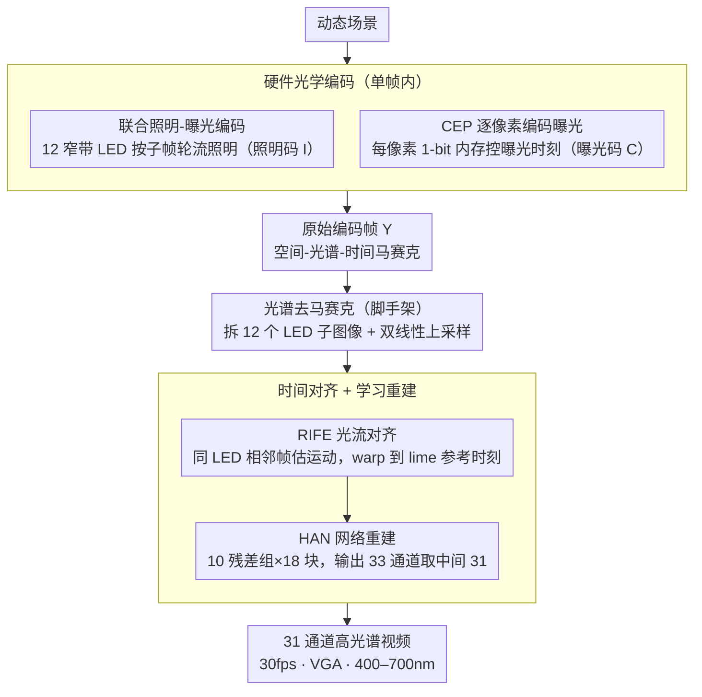

# Lumosaic: Hyperspectral Video via Active Illumination and Coded-Exposure Pixels

**会议**: CVPR 2026  
**arXiv**: [2602.22140](https://arxiv.org/abs/2602.22140)  
**代码**: 无  
**领域**: 计算成像 / 高光谱视频  
**关键词**: hyperspectral video, coded-exposure pixel, active illumination, motion-robust, spectral reconstruction

## 一句话总结

提出Lumosaic主动高光谱视频系统，将12个窄带LED阵列与编码曝光像素（CEP）相机在微秒级同步，在每帧158个子帧内联合编码空间-时间-光谱信息，实现30fps VGA分辨率31通道（400–700nm）运动鲁棒高光谱视频重建，PSNR比被动快照系统高10+dB。

## 研究背景与动机

**领域现状**：高光谱成像（HSI）捕获多波段反射率，在材料分类、生理监测和光谱重照明等领域广泛应用。传统扫描式HSI光谱保真但慢，快照HSI（CASSI、DOE、MSFA）可单帧采集但光效率低、运动伪影严重。主动HSI利用可编程光源在时间/空间域编码光谱，提升光子利用率。

**现有痛点**：

1. 被动快照系统将光分散到多个光谱通道，严重光损 + 病态反演放大噪声
2. 现有主动系统（如LED时分复用、结构光投影）仅沿单一维度精细控制，动态场景下帧间光谱错位
3. 即便滚动快门可在单帧内复用光谱，快速运动仍产生滚动快门畸变

**核心矛盾**：高光谱视频需要同时满足光谱分辨率、光效率和时间采样，现有被动和主动系统均无法同时兼顾三者。

**本文目标** 实现紧凑、运动鲁棒的实时高光谱视频采集。

**切入角度**：将编码曝光像素（CEP）传感器的逐像素高速调制能力与时变窄带LED照明耦合，在单帧内联合编码空间-时间-光谱三维信息。

**核心 idea**：用CEP相机的逐像素曝光控制 + 时变LED照明，在每帧内构建密集的空间-光谱-时间马赛克编码，信号采集完全在硅片上完成。

## 方法详解

### 整体框架

Lumosaic 想在一帧普通的彩色曝光时间里，同时把空间、光谱、时间三个维度都采下来，从而得到运动鲁棒的实时高光谱视频。整体是一条"硬件光学编码 → 软件解码重建"的流水线：硬件端用 12 个窄带 LED（20–30nm FWHM，Lumileds Luxeon C）做可编程主动光源，配一台 VGA 的编码曝光像素（CEP）相机（640×480，12500 子帧/秒），由 ESP32 微控制器在微秒级把"哪一刻点哪个 LED"（照明码）和"哪些像素此刻在曝光"（曝光码）对齐起来，于是单帧内就织出一张空间-光谱-时间马赛克。每帧切成 $S=158$ 个子帧（每子帧 170µs），约 27ms 积分加约 6ms 读出/同步，正好凑成 30fps。软件端先做光谱去马赛克、把原始编码帧拆出 12 个 LED 子图像并双线性上采样，再用 RIFE 光流把各子图像对齐到同一时刻，最后送进 HAN 网络重建出 31 通道（400–700nm）的高光谱视频。下图把这条流水线的硬件编码、去马赛克脚手架与时间对齐+重建三段画出来：

### 关键设计

**1. 联合照明-曝光编码：把空间-光谱-时间塞进一帧**

被动快照系统的根本毛病是把入射光分散到多个通道、再靠滤波取窄带，光子损失大、反演病态。Lumosaic 反过来用"谁来照"和"谁在看"两套码在同一帧内织出密集马赛克：像素按 $4\times4$ 分成 $T=16$ 个 tile，每个 tile 配一套独特的曝光码 $\mathbf{C}_{\text{tile}} \in \{0,1\}^{T \times S}$ 和照明码 $\mathbf{I}_{\text{tile}} \in \{0,1\}^{T \times S \times L}$；每个子帧只点亮一个 LED，于是相邻像素在不同时刻看到不同波段，空间上就铺成了光谱-时间马赛克。整帧的前向成像模型写成

$$Y_p = \sum_{s=1}^{S} C_{p,s} \cdot \mathbf{a}_{p,s}^\top \mathbf{r}_p + \eta_p,\qquad \mathbf{a}_{p,s} = \mathcal{S} \odot \boldsymbol{\mathcal{I}}_{p,s}$$

其中 $\mathbf{r}_p$ 是该像素的反射率谱，有效光谱感知向量 $\mathbf{a}_{p,s}$ 是相机光谱响应 $\mathcal{S}$ 和该子帧 LED 谱 $\boldsymbol{\mathcal{I}}_{p,s}$ 的逐元素积。关键在于：主动照明下每个 LED 的窄带输出整份都进了有效信号，不像滤波那样先衰减一大半，因此同样的光子预算能换来高得多的信噪比。

**2. CEP 相机逐像素编码曝光：让每个像素都成为独立采样点**

上一条码方案要落地，靠的是 CEP 相机能逐像素控制曝光这一硬件能力。传统相机所有像素共享同一段曝光，无法在一帧内为不同像素安排不同的"看光时间表"。CEP 给每个像素内嵌一块 1-bit 可写内存，逐子帧决定光电荷流向两个电荷桶中的哪一个；帧末两桶分别读出，得到一对互补的积分信号。调制率超过 39kHz、维持 VGA 分辨率，意味着 $\mathbf{C}_{\text{tile}}$ 里那张 $16\times158$ 的曝光时刻表能真实写进硅片，每个像素由此变成一个可独立编程的空间-光谱-时间采样点——这是它比滚动快门复用更灵活、不受行级时序束缚的根源。

**3. 时间对齐 + 学习重建：把"快照"接成"视频"**

因为 12 个 LED 子图像分别对应一帧内不同的时间段，场景一动，直接融合就会引入光谱-空间混叠（同一物体在不同子图像里错位）。Lumosaic 选 lime-LED 子图像作时间参考（它中心波长居中、曝光时刻也居中），用 RIFE 光流网络在同一 LED 的相邻帧间估计运动，再把各子图像 warp 到参考时刻——之所以拿"同 LED"的帧来估光流，是因为同 LED 子图像光度一致、外观稳定，光流才估得准。对齐后的 12 通道 LED 子图像送进 HAN 网络（10 个残差组、18 残差块、128 通道）重建，输出 33 通道并取中间 31 通道（400–700nm）作为最终高光谱视频。这一步补偿亚毫秒级的子帧运动差，是把单帧编码采集真正变成连贯视频的关键。

### 损失函数 / 训练策略

$\mathcal{L}_1$ 损失，Adam优化器（lr=1e-4），batch 14 + 2步梯度累积，50000 iter，RTX A6000约24h。0–15%高斯噪声数据增广。训练集：CAVE（32场景）+ KAUST（409场景）+ ARAD（949场景），重采样到31通道（400–700nm，10nm间隔），80/10/10划分。

## 实验关键数据

### 主实验

**仿真重建质量（无噪声条件）**

| 方法 | 类型 | PSNR (dB)↑ | SSIM↑ | SAM↓ |
|------|------|-----------|-------|------|
| MST++ | 被动RGB→HSI | ~30 | ~0.92 | ~0.25 |
| QDO | 被动DOE快照 | ~32 | ~0.93 | ~0.22 |
| Lumosaic + SRNet | 主动CEP | ~42 | ~0.98 | ~0.06 |
| Lumosaic + MCAN | 主动CEP | ~43 | ~0.98 | ~0.05 |
| **Lumosaic + HAN** | **主动CEP** | **~44.0** | **~0.99** | **~0.04** |

### 消融实验

**噪声鲁棒性（Lumosaic+HAN）**

| 噪声水平σ | PSNR (dB) | 说明 |
|-----------|-----------|------|
| 0% | 44.0 | 无噪声最佳 |
| 5% | ~38 | 轻度噪声仍远超被动系统 |
| 10% | ~35 | 保持高保真 |
| 20% | 32.0 | 高噪声下仍优于被动0%噪声 |

**重建backbone对比**

| Backbone | PSNR↑ | 推理速度 | 说明 |
|----------|-------|---------|------|
| HAN | 44.0 dB | 4.7s/帧 | 最高精度 |
| MCAN | 略低 | 52ms/帧 | 精度-速度折中 |
| SRNet | 最低 | 27ms/帧 | 接近实时 |

### 关键发现

- Lumosaic全面碾压被动快照系统（高10+dB PSNR），验证主动照明+编码曝光的根本性优势
- 三种backbone均优于被动基线，性能提升主要来自硬件编码方案而非网络复杂度
- ColorChecker实验中重建光谱与Konica Minolta CS-2000分光辐射计真值高度吻合
- 同源异构消歧实验证明可区分视觉相似但光谱不同的材料（真品vs打印复制品）
- 30fps动态场景（旋转地球仪、手势、液体扩散、气泡）重建时间连贯且光谱准确

## 亮点与洞察

- 开创性将CEP传感器用于高光谱视频，信号编码完全在硅片上完成，紧凑无需复杂光学校准
- 系统协同设计精妙：照明码-曝光码-重建网络三者紧密耦合
- 158子帧 × 12 LED × 16 tile的编码密度在单帧内实现极高信息容量
- RIFE光流对齐解决了主动照明系统固有的子帧间运动问题，是使高光谱"视频化"的关键步骤

## 局限与展望

- 重建推理慢（HAN 4.7s/帧 vs 30fps采集），实时部署需要轻量backbone（SRNet 27ms可行但精度降低）
- 仅用CEP单桶（Bucket 1），双桶联合建模可进一步提升动态范围和光效率
- 主动照明限制应用场景（需可控光源），户外/远距离场景不适用
- 逐帧独立处理，未利用帧间时序冗余（受限于高光谱视频训练数据匮乏）
- 编码方案固定，自适应/随机马赛克可能进一步优化

## 相关工作与启发

- **vs CASSI等被动系统**：主动照明根本性改变光子利用效率——LED输出全部贡献有效信号，而被动滤波衰减大部分光子
- **vs Verma et al.**：同样利用LED时变照明，但依赖滚动快门行级复用，快速运动仍有畸变；Lumosaic的逐像素编码更灵活
- **vs Yu et al. (event camera)**：事件相机+扫彩虹照明，但依赖机械旋转光学，紧凑性和鲁棒性不足
- **启发**：CEP+时变照明的范式可推广到荧光成像、拉曼光谱等需要主动激发+光谱分辨的领域

## 评分

- 新颖性: ⭐⭐⭐⭐⭐ CEP+主动照明的高光谱视频系统前所未有，系统级创新
- 实验充分度: ⭐⭐⭐⭐ 仿真+真实原型+静态/动态场景+同源异构消歧，缺少与更多最新系统的定量真实场景对比
- 写作质量: ⭐⭐⭐⭐⭐ 前向模型从像素到系统层层递进，硬件-软件协同设计逻辑清晰
- 价值: ⭐⭐⭐⭐ 系统创新极高，但主动照明限制了应用范围

<!-- RELATED:START -->

## 相关论文

- [\[CVPR 2026\] ZoomEarth: Active Perception for Ultra-High-Resolution Geospatial Vision-Language Tasks](zoomearth_active_perception_for_ultra-high-resolution_geospatial_vision-language.md)
- [\[CVPR 2026\] Exploring Spatiotemporal Feature Propagation for Video-Level Compressive Spectral Reconstruction](exploring_spatiotemporal_feature_propagation_for_video-level_compressive_spectra.md)
- [\[CVPR 2026\] No Labels, No Look-Ahead: Unsupervised Online Video Stabilization with Classical Priors](no_labels_no_look-ahead_unsupervised_online_video_stabilization_with_classical_p.md)
- [\[CVPR 2026\] HyperFM: An Efficient Hyperspectral Foundation Model with Spectral Grouping](hyperfm_an_efficient_hyperspectral_foundation_model_with_spectral_grouping.md)
- [\[CVPR 2026\] MetaSpectra+: A Compact Broadband Metasurface Camera for Snapshot Hyperspectral+ Imaging](metaspectra_a_compact_broadband_metasurface_camera_for_snapshot_hyperspectral_im.md)

<!-- RELATED:END -->
