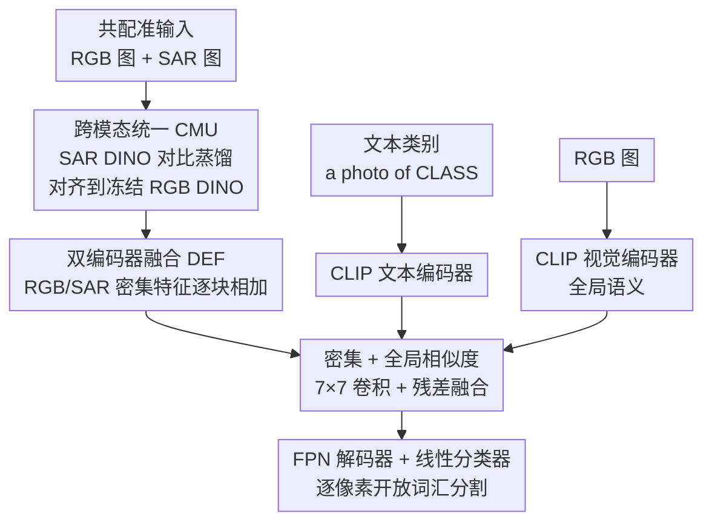

# MM-OVSeg: Multimodal Optical-SAR Fusion for Open-Vocabulary Segmentation in Remote Sensing

**会议**: CVPR 2026  
**论文**: [CVF Open Access](https://openaccess.thecvf.com/content/CVPR2026/html/Wei_MM-OVSeg_Multimodal_Optical-SAR_Fusion_for_Open-Vocabulary_Segmentation_in_Remote_Sensing_CVPR_2026_paper.html)  
**代码**: https://github.com/Jimmyxichen/MM-OVSeg  
**领域**: 遥感 / 开放词汇分割 / 多模态融合  
**关键词**: 开放词汇分割, 光学-SAR 融合, 遥感, 跨模态对齐, 云遮挡鲁棒性

## 一句话总结
MM-OVSeg 把 SAR 引入遥感开放词汇分割，用对比蒸馏让 SAR 特征对齐到 RGB 视觉基础模型的表示空间（CMU），再用双编码器融合把 CLIP 全局语义和 DINO 密集结构特征与文本对齐（DEF），从而在多云/雾霾天气下依旧能按任意文本类别做像素级分割，六个基准平均 mIoU 51.7%，比此前最好的单模态方法高 6.1 个点。

## 研究背景与动机
**领域现状**：开放词汇分割（OVS）让模型能识别训练时没见过的任意文本类别，对遥感（RS）尤其有价值——可以跨地理区域灵活做土地覆盖理解，省掉密集像素标注和固定类表。近期遥感 OVS 工作（CAT-Seg、EBSeg、SegEarth-OV、GSNet 等）多基于 CLIP，把任意文本概念关联到视觉区域。

**现有痛点**：这些方法几乎全部局限在晴空光学 RGB 影像上，默认输入是干净、无云的图像。但真实遥感观测频繁被云、雾霾污染。一旦光学输入退化，现有 OVS 方法在低能见度条件下几乎失效（论文 Figure 1 里 CAT-Seg / EBSeg / SegEarth-OV 在多云图上分割崩坏），这直接限制了它们在灾害响应这类时间敏感任务和长期连续监测中的可用性。

**核心矛盾**：光学影像有丰富的光谱语义、但穿不透云；SAR（合成孔径雷达）能穿云穿雾、捕捉结构后向散射、但缺语义纹理。两种模态天然互补，可现有的 SAR-光学分割方法基本都是闭集（固定标注类别），缺乏开放词汇泛化能力；而把 SAR 塞进开放词汇框架又有两个硬障碍：① 视觉基础模型（VFM，如 DINO）几乎只在 RGB 上训练，SAR 的微波后向散射统计与光学纹理差异巨大，存在巨大的 RGB↔SAR 域差；② 视觉-语言模型（CLIP/ALIGN）是图像级监督训练的，本身密集预测能力弱，SAR 的域差进一步削弱了视觉-文本的空间对应。

**本文目标**：在多云/恶劣天气下做鲁棒的开放词汇分割，需要解决两个子问题——怎么把 SAR 编码成与文本对齐的 RGB 表示兼容的形式，以及怎么把两种模态稳健融合进 OVS。

**切入角度**：作者观察到 SAR 与 RGB 虽然底层统计差异大，但可以借不带标注的、共配准的 RGB-SAR 配对，把 SAR 特征"拉"进已经训练好的 RGB 基础模型的特征空间里（类似 ImageBind 用配对数据统一多模态嵌入），从而不需要从头收集 DINO 量级的 SAR 语料。

**核心 idea**：用跨模态对比蒸馏把 SAR 特征对齐到冻结的 RGB DINO 表示（CMU），再用一个双编码器融合模块把 CLIP 全局语义 + DINO（RGB/SAR）密集特征与 CLIP 文本嵌入对齐（DEF），得到既穿云又能开放词汇的遥感分割框架。

## 方法详解

### 整体框架
MM-OVSeg 接收一对共配准的影像——光学 RGB 图 $I \in \mathbb{R}^{H\times W\times 3}$ 和 SAR 图 $S \in \mathbb{R}^{H\times W\times 1}$，外加一组文本类别（训练时 $C_{train}$，推理时扩展为 $C_{test}=C_{train}\cup C_{novel}$），输出逐像素语义图。整套模型由四个编码器拼成：CLIP 的视觉编码器 $\Phi_V$ 和文本编码器 $\Phi_T$ 负责全局语义-文本对齐；一个冻结的 RGB DINO 编码器 $F_{rgb}$ 抽 RGB 密集局部特征；一个专门为 SAR 调过的 DINO 编码器 $F_{sar}$ 抽 SAR 密集特征。

训练分两阶段串行：**第一阶段（CMU）**只训 SAR DINO 编码器，用对比蒸馏把它对齐到冻结的 RGB DINO 特征；**第二阶段（DEF）**冻结两个 DINO 编码器，训练 CLIP 编码器和融合模块，把 RGB/SAR 密集特征与 CLIP 文本嵌入对齐后接 FPN 解码器和线性分类器出分割图。

### 关键设计

**1. 跨模态统一 CMU：用对比蒸馏把 SAR "搬进" RGB 基础模型的特征空间**

痛点直白说就是：DINO 抽密集特征很强，但只懂 RGB；SAR 的后向散射纹理跟光学完全两套统计，DINO 直接拿来抽 SAR 特征废掉，而又不可能收集 DINO 原始训练集那个量级的 SAR 语料从头训。CMU 的解法是借不带标注的共配准 RGB-SAR 配对做对比蒸馏：每张 RGB 图过冻结的 RGB DINO $F_{rgb}$ 得到 $f_{rgb}$ 当作"老师"，对应的 SAR 图过可学习的 $F_{sar}$ 得到 $f_{sar}$，用 InfoNCE 对比损失把配对的 SAR/RGB 嵌入拉近、把跨样本的负样本推远：

$$L_{CMU} = -\log \frac{\exp(f_{sar} f^{+}_{rgb}/\tau)}{\exp(f_{sar} f^{+}_{rgb}/\tau) + \sum_{j=1}^{N}\exp(f_{sar} f^{-j}_{rgb}/\tau)}$$

其中 $f^{+}_{rgb}$ 是配对的 RGB 嵌入、$f^{-j}_{rgb}$ 是其它样本的负嵌入、$\tau$ 是温度。两个编码器都用 ViT-B/16，从第 4/8/12 个 transformer block 抽多尺度特征并对各层对比损失求平均。作者专门构建了 CMU-Data：从 SpaceNet6 和 DFC2023 收集 25,087 对共配准 RGB-SAR（分辨率 0.5–3m）。这样做有效的关键在于：它把"SAR 怎么编码"这个新问题转化成"对齐到一个已经很好的 RGB 表示空间"，让冻结的 RGB 基础模型能直接复用 SAR 线索，而无需海量 SAR 标注。消融里 InfoNCE 比 MSE/L1 都明显更好，说明对比式的相对结构对齐比逐点回归更适合跨模态。值得一提：作者发现没必要再为 SAR 单独训一个 CLIP 视觉编码器——CLIP 抓的是场景布局、物体共现这类全局语义，本身在光学和 SAR 之间基本不变，再训一个只增开销不增收益。

**2. 双编码器融合 DEF：把 CLIP 全局语义和 DINO 密集结构在文本空间里拼起来**

第二阶段要解决的痛点是：CLIP 全局语义强但密集预测粗（注意力图模糊），DINO 密集局部强但缺语义-文本对齐，单靠任一个都做不好开放词汇的逐像素分割。DEF 把它们的互补性显式融起来。先做**多模态密集特征聚合**：从 ViT-B/16 的第 4/8/12 块抽 RGB 和 SAR 密集特征 $f^i_{rgb}, f^i_{sar}$，各经一个 block 专属卷积 $\sigma_i(\cdot)$ 投到统一维度后逐元素相加 $f^i_d = \sigma_i(f^i_{rgb}) + \sigma_i(f^i_{sar})$，这样融合后的特征同时带 RGB 的光谱-纹理和 SAR 的结构后向散射。再做**视觉-文本对齐**：同一张 RGB 经 CLIP 得全局视觉嵌入 $z_{rgb}=\Phi_V(I_{rgb})$、文本经 $z_T=\Phi_T(T)$（提示词模板 "a photo of {CLASS}"），用余弦相似度算密集相似图 $h^i_{dt}=f^i_d\cdot z_T$ 和全局相似图 $h_{gt}=z_{rgb}\cdot z_T$，各过 7×7 卷积 $\sigma_7$ 和 sigmoid $\varphi$。最后**带残差的融合**：

$$h^i_{fuse} = \varphi(\sigma_7([h^i_{dt}; h_{gt}])) + h_{gt}$$

把密集相似图和全局相似图拼接后卷积，再加上全局相似图作残差。这条残差是关键——它保留 CLIP 编码的通用语义结构、缓解多模态训练时的特征漂移，避免融合把 CLIP 原本的开放词汇泛化能力冲掉。融合后的 $h^i_{fuse}$ 按 FPN 风格双线性上采样、与对应的 DINO/CLIP 特征拼接，最后线性分类器出逐像素预测，训练只用标准交叉熵 $L_{ce}$。这套设计有效的本质：它没有去改 CLIP 的全局对齐（训练时 CLIP 用极小学习率 $2\times10^{-6}$ 保护预训练对齐），而是把 SAR 带来的密集结构信息"嫁接"进 CLIP 的文本对齐空间，既补上密集预测、又不丢开放词汇能力。

### 损失函数 / 训练策略
两阶段分开训。CMU 阶段：只训 SAR DINO，batch size 8，AdamW，学习率 $3\times10^{-4}$、权重衰减 $1\times10^{-4}$，RGB DINO 冻结，损失为多尺度平均的 InfoNCE。全量 MM-OVSeg 阶段：DINO 编码器冻结，新引入参数随机初始化，AdamW 训 120k 次迭代、batch size 8、初始学习率 $2.5\times10^{-4}$，CLIP 编码器用更小学习率 $2\times10^{-6}$ 保护预训练对齐，监督用交叉熵。全部在单张 NVIDIA A100（80GB）上完成。CLIP/DINO 主干均为 ViT-B/16，权重取自 CLIP 和 DINO v1。

## 实验关键数据

### 主实验
在六种评测设置上比较（涵盖晴空 vs 多云、薄云/厚云/混合云、域内 vs 跨域）。设置编号：①PIE-cloud→PIE-cloud；②DDHR-SK→DDHR-SK；③OEM-thick→OEM-thick；④OEM-thin→OEM-thin；⑤PIE-clean→PIE-clean；⑥DDHR-SK→DDHR-CH（跨域）。指标为 mIoU。

| 方法 | 出处 | ① | ② | ③ | ④ | ⑤ | ⑥ | 平均 |
|------|------|----|----|----|----|----|----|------|
| CAT-Seg | CVPR'24 | 54.5 | 54.2 | 33.8 | 29.5 | 55.8 | 27.8 | 42.6 |
| EBSeg | CVPR'24 | 50.8 | 51.1 | 27.2 | 25.6 | 51.0 | 26.7 | 38.7 |
| GSNet | AAAI'25 | 57.0 | 55.0 | 35.2 | 37.0 | 57.2 | 32.4 | 45.6 |
| SegEarth-OV | CVPR'25 | 45.1 | 17.6 | 28.9 | 18.5 | 51.8 | 24.2 | 31.0 |
| FGAseg | arXiv'25 | 51.6 | 51.6 | 26.0 | 32.8 | 52.1 | 40.6 | 42.5 |
| **MM-OVSeg (ours)** | – | **57.7** | **73.1** | **36.6** | **40.2** | **59.7** | **42.6** | **51.7** |

MM-OVSeg 在全部六个设置上都拿第一，平均 51.7% 比次优 GSNet 的 45.6% 高 6.1 个点。在 ② DDHR-SK 上提升尤其夸张（73.1 vs 55.0，+18.1）。即使在晴空、SAR 贡献不大的 ⑤ 上仍比 GSNet 高 2.5%；跨域 ⑥ 上保持明显领先，说明多模态融合带来的鲁棒性不是靠拟合特定云型。

### 消融实验
在 DDHR-SK→DDHR-SK 上逐模块拆解（Table 3）：

| 配置 | Forest | City | Farmland | Road | Water | mIoU | 说明 |
|------|--------|------|----------|------|-------|------|------|
| 完整 MM-OVSeg | 87.3 | 86.8 | 85.6 | 21.2 | 84.8 | **73.1** | CMU + DEF 全开 |
| w/o CMU | 57.2 | 83.7 | 81.2 | 16.8 | 81.4 | 64.1 | 去掉跨模态对齐，掉 9.0 |
| w/o CMU & DEF | 80.0 | 90.3 | 79.0 | 6.8 | 19.1 | 55.0 | 纯单模态光学基线 |

CMU 阶段损失函数对比（Table 4）：

| CMU 损失类型 | mIoU |
|--------------|------|
| baseline (w/o CMU) | 64.1 |
| MSE | 67.7 |
| L1 | 69.0 |
| InfoNCE | **73.1** |

### 关键发现
- **DEF 和 CMU 互补、缺一不可**：纯光学基线 55.0%，加 DEF 直接 +9.1% 到 64.1%（多模态融合本身就很值钱），再加 CMU 到 73.1%（SAR 对齐让融合的 SAR 特征真正可用）。两者顺序上必须先 CMU 对齐、再 DEF 融合。
- **InfoNCE 是 CMU 的最优选择**：MSE 67.7、L1 69.0、InfoNCE 73.1，对比式相对结构对齐比逐点回归更适合跨 SAR-RGB 模态——逐点回归想强行让 SAR 嵌入数值等于 RGB，而对比损失只要求相对结构一致，更尊重模态差异。
- **SAR 对 water 类增益巨大**：在 ② 上去掉 SAR（w/o CMU&DEF）后 water 从 84.8 暴跌到 19.1，因为水面在 SAR 里有特征性的低且均匀后向散射，是极可靠的判别线索；这也是 MM-OVSeg 在未见类 water 上表现特别强的原因。
- **seen 仍明显高于 unseen**：即便大幅领先，模型在已见类上的精度仍显著高于新类（如 ② 的 Road 只有 21.2），说明遥感 OVS 维持视觉-文本对齐本身仍是难点。

## 亮点与洞察
- **把"训练 SAR 基础模型"偷换成"对齐到现成 RGB 基础模型"**：CMU 用 ImageBind 式的配对蒸馏绕开了"没有 DINO 量级 SAR 语料"的死结——这个思路可迁移到任何缺大规模预训练数据的新模态（高光谱、LiDAR、热红外），只要能拿到与 RGB 共配准的配对数据。
- **残差保护 CLIP 对齐是开放词汇能稳的关键**：DEF 里 $h_{fuse}=\dots+h_{gt}$ 的残差 + CLIP 极小学习率，本质是在"加入新模态密集信息"和"不破坏 CLIP 已有开放词汇泛化"之间做手术刀式注入，而不是粗暴端到端微调。这是把多模态信息接进基础模型而不灾难性遗忘的可复用范式。
- **第一个把开放词汇分割推到多云遥感场景的工作**：把问题本身（云遮挡下的 OVS）和 Optical-SAR 融合配方一起立起来，并附带 CMU-Data（25,087 对）和代码，对遥感社区是实打实的基础设施贡献。
- **物理先验解释性能**：water 在 SAR 里低均匀后向散射 → SAR 给的判别信号最强 → 模型在 unseen water 上反而最好，这种"用传感器物理解释 mIoU"的分析很有说服力。

## 局限与展望
- **新类（unseen）精度仍偏低**：多个设置里 Road 这类未见类 IoU 只有 10–32（如 ⑤ Road 11.9、② Road 21.2），开放词汇泛化离实用仍有距离，瓶颈在视觉-文本对齐而非融合。
- **依赖共配准的 RGB-SAR 配对**：CMU 和推理都假设光学与 SAR 严格共配准，真实卫星数据的时相差、几何配准误差会怎样影响对齐，论文没有压力测试。
- **云大多是合成的**：OEM/DDHR 的云是用 SatelliteCloudGenerator/GIMP 合成的，只有 PIE 部分是真实多云；合成云与真实厚云/雨云的统计差异下的泛化是开放问题。
- **类别数偏少**：各数据集只 4–8 类，远没到"开放词汇"该有的长尾规模，难以充分检验对任意细粒度文本类别的泛化。
- **改进方向**：引入对未配准/弱配准鲁棒的跨模态对齐、把 CLIP 换成更强的密集 VLM、或在 CMU 里加更多模态（多光谱）扩展成统一遥感基础表示。

## 相关工作与启发
- **vs CAT-Seg / EBSeg（自然图像 OVS）**：它们用相似度矩阵当伪掩码（CAT-Seg）或借冻结 SAM 编码器补空间信息（EBSeg），但都只吃单模态 RGB，云遮挡下直接崩；MM-OVSeg 把 SAR 作为穿云的第二模态接进来，在多云设置上大幅领先（③④ 上 +6~10 点）。
- **vs SegEarth-OV / GSNet（遥感 OVS）**：SegEarth-OV 是 training-free、靠特征上采样增强 CLIP，鲁棒性差（② 只有 17.6）；GSNet 把 CLIP 和 DINO 结合抽遥感局部线索是次优方法（平均 45.6），但仍是单模态；MM-OVSeg 的核心区别是首次做多模态 Optical-SAR 融合，且用 CMU 解决 SAR 进基础模型的域差。
- **vs 传统 SAR-光学融合**：以往像素级/特征级/决策级融合多是闭集、固定标注类，缺开放词汇能力；MM-OVSeg 把融合直接做在与文本对齐的空间里，让融合产物天然支持开放词汇推理。
- **vs ImageBind**：借鉴其用配对数据统一多模态嵌入的思想，但 MM-OVSeg 聚焦 SAR↔RGB 的密集分割对齐（蒸馏到 DINO 密集特征 + InfoNCE 多尺度），而非全局多模态检索。

## 评分
- 新颖性: ⭐⭐⭐⭐⭐ 首次把开放词汇分割推到多云遥感并给出 Optical-SAR 融合配方，问题与方法都新。
- 实验充分度: ⭐⭐⭐⭐ 六设置覆盖晴/云/跨域、消融拆到 CMU/DEF/损失类型，但类别数偏少、真实云有限。
- 写作质量: ⭐⭐⭐⭐ 动机清晰、图表完整、用传感器物理解释结果；公式记号略密。
- 价值: ⭐⭐⭐⭐⭐ 附 25k 对 CMU-Data + 代码，对遥感 OVS 是可复用的基础设施和强基线。

<!-- RELATED:START -->

## 相关论文

- [\[CVPR 2026\] ReAttnCLIP: Training-Free Open-Vocabulary Remote Sensing Image Segmentation via Re-defined Attention in CLIP](reattnclip_training-free_open-vocabulary_remote_sensing_image_segmentation_via_r.md)
- [\[CVPR 2026\] UniGeoSeg: Towards Unified Open-World Segmentation for Geospatial Scenes](unigeoseg_towards_unified_open-world_segmentation_for_geospatial_scenes.md)
- [\[CVPR 2026\] Prompt-Free Unknown Label Generation for Open World Detection in Remote Sensing](prompt-free_unknown_label_generation_for_open_world_detection_in_remote_sensing.md)
- [\[CVPR 2026\] ORSATR-X: A Foundation Model based on Differential-and-Excitation Networks for Optical Remote Sensing Object Recognition](orsatr-x_a_foundation_model_based_on_differential-and-excitation_networks_for_op.md)
- [\[CVPR 2026\] SegEarth-R2: Towards Comprehensive Language-guided Segmentation for Remote Sensing Images](segearth-r2_towards_comprehensive_language-guided_segmentation_for_remote_sensin.md)

<!-- RELATED:END -->
