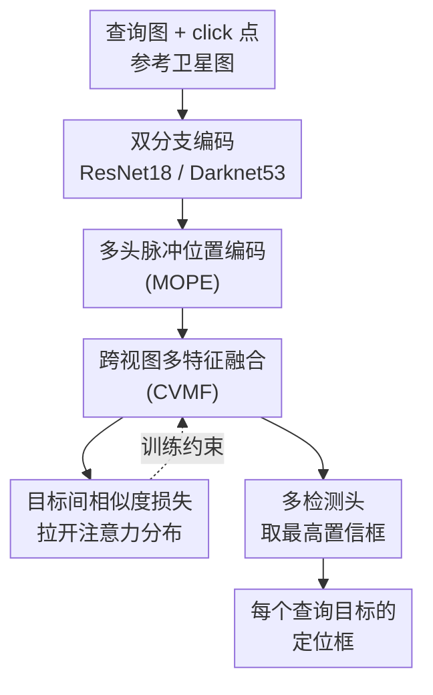

# MOGeo: Beyond One-to-One Cross-View Object Geo-localization

**会议**: CVPR 2026  
**论文**: [CVF Open Access](https://openaccess.thecvf.com/content/CVPR2026/html/Lv_MOGeo_Beyond_One-to-One_Cross-View_Object_Geo-localization_CVPR_2026_paper.html)  
**代码**: https://github.com/LV-BO001/MOGeo （承诺开源）  
**领域**: 遥感 / 跨视图地理定位  
**关键词**: 跨视图定位、多目标、脉冲位置编码、卫星-地面匹配、注意力

## 一句话总结
针对现有「跨视图目标地理定位（CVOGL）只能一张图定位单个目标」的不切实际假设，本文提出多目标版新任务 CVMOGL、配套 CMLocation 基准（25,520 对图像、63,888 个实例），并设计端到端方法 MOGeo——核心是用类 Dirac 脉冲的 one-hot 位置编码把每个查询目标钉成锐利的注意力峰，配合跨视图多特征融合与目标间相似度损失，在多目标场景下显著超过 DetGeo/VAGeo。

## 研究背景与动机
**领域现状**：跨视图地理定位（CVGL）的目标是仅凭一张地面/无人机查询图，在带地理标签的卫星参考图里确定其地理位置，应用于自动驾驶、城市导航、灾害监测等。这条线近年从中心对齐走向非中心对齐、从粗粒度走向细粒度、从有监督走向无监督，整体趋势是越来越细、越来越贴近真实场景。为把定位从「整图」推进到「图中具体物体（楼、桥、路）」，社区进一步提出了**跨视图目标地理定位（CVOGL）**，代表工作有 DetGeo、VAGeo、TROGeo、GeoFormer。

**现有痛点**：所有 CVOGL 方法都把场景理想化为「一张查询图里只有一个目标」。但真实查询图里往往同时有多栋建筑、多条道路、多座桥——单目标假设直接让这些方法无法落地。更糟的是，整图级 CVGL 方法（FRGeo、Sample4Geo、GeoDTR+）连「物体级」都给不了，把它们硬套到多目标上 acc 掉到个位数。

**核心矛盾**：多目标不是「单目标跑 N 遍」那么简单。它带来两个新难点：（1）一张图里要同时定位多个目标；（2）还必须建立「查询点 ↔ 参考框」的一一对应关系——否则就算每个框都检对了，对错了人也是错的。而多目标共存时，传统的平滑位置编码（高斯/欧氏距离衰减）会让每个目标的注意力图弥散开、互相串扰，模型分不清自己该聚焦哪一个。

**本文目标**：把 CVOGL 从单目标推广到多目标（CVMOGL），并解决「多目标共存下注意力弥散、目标间难以区分」这一根因。

**切入角度**：作者观察到平滑位置编码产生的是**扩散型注意力**（图 2），峰不够尖、旁瓣大，多个目标的注意力会糊在一起。如果把位置先验做成**极锐的脉冲**，就能为每个查询目标提供高判别力的空间锚点。

**核心 idea**：受 Dirac delta 函数启发，用 one-hot 二值掩码代替平滑编码给每个目标打一个「脉冲」位置先验，再靠跨视图特征融合和目标间相似度损失把不同目标的注意力分布显式拉开。

## 方法详解

### 整体框架
MOGeo 是一个 detection-based 的端到端方法。输入是一张含任意数量目标的查询图 $I_q$（地面或无人机视角，每个目标用一个 click 点 $p_j$ 标注）和一张卫星参考图 $I_r$；输出是每个查询点在参考图中对应的边界框 $b_j$。整条流水线分四块：双分支特征提取 → 多头查询目标位置编码（MOPE）→ 跨视图多特征融合（CVMF）→ 检测头出框，训练时再加一个目标间相似度损失约束注意力分布。

双分支编码器分别独立抽特征：查询图用 ResNet18 取 16× 下采样得到 $F_q$；参考图用 Darknet53 取 16× 下采样、过一个全连接后 reshape 成 $V_r \in \mathbb{R}^{4096\times 512}$。每个查询点经 MOPE 编码出一个判别力很强的特征向量，再在 CVMF 里与参考图特征做跨视图匹配生成注意力图、加权融合，最后送多检测头预测、取置信度最高的框。

### 关键设计

**1. 多头脉冲位置编码 MOPE：用 Dirac 脉冲钉死每个查询目标的位置**

这是全文最核心也是消融里掉点最狠的模块，直接针对「平滑编码导致注意力弥散、多目标互相串扰」这个痛点。作者不再用高斯或欧氏距离衰减那种「软」先验，而是把每个查询点编码成一个 one-hot 二值掩码 $E_j \in \{0,1\}^{H'_q\times W'_q}$：只有目标落到特征图上的那个格子取 1、其余全 0（$E_j(h,w)=1$ 当且仅当 $(h,w)=\lfloor\phi(p_j)\rfloor$，$\phi$ 把原图坐标映射到特征图坐标）。这等价于一个离散版 Dirac 脉冲，先验极尖锐，注意力没有旁瓣可以扩散，因而判别力极高。

得到掩码后先与视觉特征做通道拼接再 $1\times1$ 卷积融合：$F'_{qj}=\mathrm{Conv}_{1\times1}([F_q\Vert E_j])$。但作者注意到一个隐患——$F_q$ 通道很多、$E_j$ 只有一层，位置信息很容易被海量语义通道「淹没」。为此他们再补一个**位置驱动的特征增强**：把掩码沿通道维展开后与融合特征做逐元素相乘 $F''_{qj}=F'_{qj}\odot E_j$，相当于用脉冲再「门控」一次，强行把响应压回到目标格点，避免位置先验被稀释。最后池化成 $m$ 个 512 维查询向量 $V_q\in\mathbb{R}^{m\times d}$。消融显示去掉 MOPE 后 CVOGL-Drone 的 acc@0.25 暴跌 11.51%，远超其他模块，印证了「锐利脉冲先验」是多目标定位的命门。

**2. 跨视图多特征融合 CVMF：把每个查询目标匹配到卫星图上的对应区域**

CVMF 解决「查询点 ↔ 参考框」的跨视图对应问题。$V_q$ 和 $V_r$ 先各自做 L2 归一化以保证匹配稳健，再做矩阵相乘得到跨视图相似度 $\{V_p\}=\{V_q\}\times\{V_r\}$，把每个 $V_{pj}$ reshape 成 $H_r\times W_r$ 就得到第 $j$ 个目标在卫星图上的注意力图 $F_{aj}$——它刻画了该查询目标在参考图里的潜在对应区域。随后用注意力图加权参考特征 $\{F'_r\}=\{F_a\}\odot\{F_r\}$，再把各目标的注意力特征 $F_{ai}$ 与对应融合特征 $F'_r$ 拼接成 $F''_r$ 喂给检测头。这种「先算每个目标的注意力图、再用它显式调制参考特征」的串行融合，让每个目标都有自己专属的一张响应图，从机制上把多目标解耦开，而不是共享一张糊在一起的图。

**3. 目标间相似度损失 $L_s$：显式把不同目标的注意力分布推开**

即便有了锐利脉冲，不同目标的注意力分布仍可能彼此相似而混淆。作者基于「不同图、或同图不同目标的注意力分布天然有别」这一先验，加了一个对比式的相似度损失显式拉开它们：

$$L_s=\sum_{i=1}^{n}\sum_{k=1}^{m_i}\log\!\Big(1+e^{(d_{pos}-d_{neg})}\Big)$$

其中 $d_{pos}$ 是当前目标注意力图与自身的欧氏距离，$d_{neg}$ 是它与其他查询目标注意力图的欧氏距离。由于同目标的正距离 $d_{pos}$ 在设计上已被最小化，这个损失实际只负责**最大化不同目标之间的注意力距离**（同图内 + 跨图都管），把扩散注意力进一步收紧。它和总损失 $L=L_{cn}+L_{reg}+L_s$ 一起优化（$L_{cn}$ 置信度损失、$L_{reg}$ 回归损失沿用 DetGeo）。

### 损失函数 / 训练策略
总损失 $L=L_{cn}+L_{reg}+L_s$：回归损失拉近预测框与 GT、置信度损失估计格点有无目标、$L_s$ 如上拉开目标间注意力。PyTorch 实现，单卡 V100，Adam，初始学习率 $1\times10^{-4}$，batch size 8，训练 24 个 epoch。评测同时覆盖 Ground→Satellite（CMLocation、CVOGL-SVI）和 Drone→Satellite（CVOGL-Drone）两种场景。

## 实验关键数据

### 评测指标
单目标的 acc@t（IoU>t 即算对）无法刻画整图多目标是否全对，作者新增**图像级定位精度** $accI@t$：一张图当且仅当**所有**目标的预测框与 GT 的 IoU 都超过 $t$ 才算定位成功（公式 1-2）。阈值取 $t=0.25$ 和 $0.5$。这把任务从「逐目标统计」升级到「整图全对率」，对多目标场景更严格也更有意义。

### 主实验
CMLocation（V1 严格中心+正北对齐，V2 随机裁剪/翻转/缩放更接近真实、更难）测试集主结果：

| 数据集 | 指标 | MOGeo | 次优 VAGeo | DetGeo | 整图级提升 |
|--------|------|-------|-----------|--------|-----------|
| CMLocation-V1 | acc@0.25 | **63.85** | 57.79 | 56.03 | +6.06 vs VAGeo |
| CMLocation-V1 | accI@0.25 | **46.66** | 43.03 | 39.68 | +3.63 vs VAGeo |
| CMLocation-V2 | acc@0.25 | **37.87** | 33.51 | 32.39 | +4.36 vs VAGeo |
| CMLocation-V2 | accI@0.25 | **30.23** | 29.18 | 28.05 | +1.05 vs VAGeo |

整图级 CVGL 方法（FRGeo 8.06 / GeoDTR+ 7.44 / Sample4Geo 29.19 的 acc@0.25）在多目标设定下几乎崩盘，印证它们不适配 CVMOGL。在退化成单目标的 CVOGL 基准上 MOGeo 也保持竞争力：CVOGL-SVI 测试 acc@0.25 达 50.98（VAGeo 48.21、DetGeo 45.43），CVOGL-Drone 上 acc@0.25 与 SOTA 持平、acc@0.5 略低于 VAGeo。

### 消融实验
在两个最难的数据集 CVOGL-Drone 与 CMLocation-V2 上逐个移除组件（测试集 acc@0.25）：

| 配置 | CVOGL-Drone | CMLocation-V2 | 说明 |
|------|-------------|---------------|------|
| Full（Ours） | **66.39** | **37.87** | 完整模型 |
| w/o $L_s$ | 65.98 | 37.56 | 去相似度损失，小幅下降 |
| w/o CVMF | 65.78 | 37.19 | 去融合模块，略降 |
| w/o MOPE | 54.88 | 32.74 | 去脉冲编码，暴跌 11.51 / 5.13 |

### 关键发现
- **MOPE 是命门**：去掉它在 CVOGL-Drone 上掉 11.51%、CMLocation-V2 上掉 5.13%，远超去 CVMF/$L_s$ 的影响，直接验证「锐利脉冲位置编码」是多目标精定位的核心。
- **越难越拉得开**：按查询目标数分桶（N≤3 / 3<N≤6 / N>6），所有方法都随目标增多而退化，但 MOGeo 退化最轻。CMLocation-V2 上对次优方法的领先从最简单桶的 +4.28% 扩大到最复杂桶的 +7.25%，说明它更扛得住稠密多目标。
- **效率不亏**：MOGeo 参数量与最轻的 GeoDTR+ 相当却推理更快；VAGeo 虽参数少但「一次只能定位一个目标」，多目标时耗时反而上升——MOGeo 一次前向出多目标的设计在速度上也占优。
- **可视化**：同一张图 MOGeo 定位全部目标、VAGeo 只对 2 个；热力图上 MOGeo 精准贴合目标并压住背景噪声，VAGeo 注意力发生空间错位、部分跑到非目标区。

## 亮点与洞察
- **把「软先验」换成「硬脉冲」**：多数位置编码默认越平滑越好，本文反其道用 Dirac one-hot 把先验做到极尖，从根上消除多目标注意力串扰——这个「少即是锐」的反直觉设计很值得借鉴到其它需要多实例解耦的检测/匹配任务。
- **位置增强防淹没的小技巧**：拼接后再用掩码逐元素相乘做二次门控，专门对治「位置通道被海量语义通道稀释」，是个可复用的工程 trick。
- **指标设计补位**：$accI@t$ 用「整图全对才算对」把多目标的评价拉到一个更严苛也更贴合落地需求的层面，比逐目标平均更能暴露方法短板。
- **任务先于方法**：论文真正的贡献其实是「指出单目标假设不现实 + 造了 CMLocation 基准」，方法是顺势而为；这种「先定义对的问题」的思路本身就有价值。

## 局限与展望
- 作者承认在复杂场景下「查询目标 ↔ 参考目标」的对齐与精定位仍不够准，是主要遗留问题。
- CMLocation 仅由 CVUSA 人工标注扩建而来，城市/地物类型与地域多样性有限；V2 的「真实性」也是靠对 V1 做随机裁剪/翻转/缩放合成的，与真正的自然采集分布仍有差距。
- 脉冲编码依赖 click 点的准确性：若查询点本身有标注噪声或落在目标边缘，one-hot 把响应钉死在单格的「硬」特性反而可能放大误差，论文未讨论对点噪声的鲁棒性。
- 改进方向：把当前「逐目标独立匹配」升级为带目标间关系建模的联合匹配（如图结构约束 click-box 的全局一致性），或引入软-硬混合的位置先验在判别力与鲁棒性间折中。

## 相关工作与启发
- **vs DetGeo / VAGeo（单目标 CVOGL）**：它们开创并推进了物体级跨视图定位，但都假设一图一目标；MOGeo 把任务推广到多目标，并用脉冲编码 + CVMF + $L_s$ 解决多目标共存下的注意力弥散与对应问题，在它们的单目标基准上也不落下风。
- **vs 整图级 CVGL（FRGeo / Sample4Geo / GeoDTR+）**：这些方法只给整图级定位、给不了物体级，硬套多目标时 acc 掉到个位数，凸显 image-level 与 object-level 之间的鸿沟。
- **vs 平滑位置编码（高斯/欧氏）**：传统软先验产生扩散注意力、多目标互相串扰；本文用 Dirac one-hot 脉冲提供锐利判别力，是位置先验设计上的关键转向。

## 评分
- 新颖性: ⭐⭐⭐⭐ 提出多目标新任务 + 反直觉的脉冲位置编码，问题定义和方法都有新意，但单模块均为已有思想的巧妙组合。
- 实验充分度: ⭐⭐⭐⭐ 覆盖两套自建 + 两套公开基准、按目标数分桶、效率对比、消融与可视化齐全；不足是数据源较单一、未测点噪声鲁棒性。
- 写作质量: ⭐⭐⭐⭐ 动机层层递进、图 2/图 5 把核心直觉讲得清楚，公式完整。
- 价值: ⭐⭐⭐⭐ 把 CVOGL 推向更现实的多目标设定并开源基准与代码，对遥感/跨视图定位社区有明确推动作用。

<!-- RELATED:START -->

## 相关论文

- [\[CVPR 2026\] RHO: Robust Holistic OSM-Based Metric Cross-View Geo-Localization](rho_robust_holistic_osm-based_metric_cross-view_geo-localization.md)
- [\[CVPR 2026\] Geo2: Geometry-Guided Cross-view Geo-Localization and Image Synthesis](geo2_geometry-guided_cross-view_geo-localization_and_image_synthesis.md)
- [\[CVPR 2026\] SinGeo: Unlock Single Model's Potential for Robust Cross-View Geo-Localization](singeo_unlock_single_models_potential_for_robust_cross-view_geo-localization.md)
- [\[CVPR 2026\] UniGeoRS: A Unified Benchmark for Tri-view Geo-Localization](unigeors_a_unified_benchmark_for_tri-view_geo-localization.md)
- [\[CVPR 2026\] PAUL: Uncertainty-Guided Partition and Augmentation for Robust Cross-View Geo-Localization under Noisy Correspondence](paul_uncertainty-guided_partition_and_augmentation_for_robust_cross-view_geo-loc.md)

<!-- RELATED:END -->
