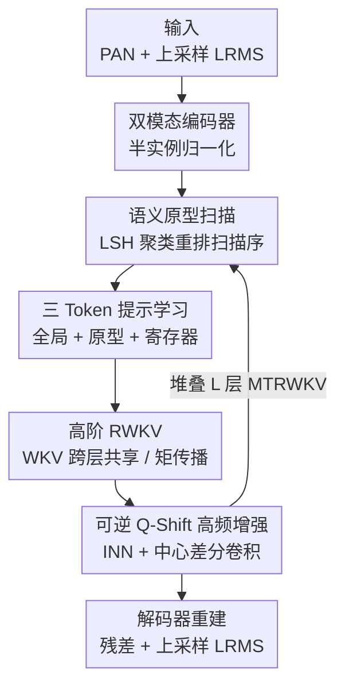

# Multigrain-aware Semantic Prototype Scanning and Tri-Token Prompt Learning Embraced High-Order RWKV for Pan-Sharpening

**会议**: CVPR 2026  
**论文**: [CVF Open Access](https://openaccess.thecvf.com/content/CVPR2026/html/Li_Multigrain-aware_Semantic_Prototype_Scanning_and_Tri-Token_Prompt_Learning_Embraced_High-Order_CVPR_2026_paper.html)  
**代码**: 未提及  
**领域**: 遥感 / 全色锐化  
**关键词**: 全色锐化、Vision RWKV、语义原型扫描、提示学习、可逆神经网络

## 一句话总结
针对全色锐化任务，本文把 Vision RWKV 的"语义无关的固定栅格扫描"换成由局部敏感哈希聚类驱动的语义原型扫描，再配上"全局 + 原型 + 寄存器"三类 token 的提示机制和一套可逆 Q-shift 高频增强，在 WorldView/GaoFen2 三个数据集上把 PSNR、SSIM、SAM、ERGAS 全面刷到新 SOTA。

## 研究背景与动机
**领域现状**：全色锐化（pan-sharpening）要把纹理丰富但只有单波段的全色图（PAN）和光谱丰富但分辨率低的多光谱图（LRMS）融合成高分辨率多光谱图。近年 Transformer 凭长程依赖建模成为主流骨干，把融合质量推得很高。

**现有痛点**：Transformer 的自注意力是 $O(N^2)$ 复杂度，对高分辨率遥感图来说是硬瓶颈。新兴的 Vision RWKV 用线性复杂度的递归结构（空间混合 + 通道混合）给出了一个有吸引力的替代，但它的双向 WKV 扫描（Bi-WKV）走的是**僵硬的栅格顺序**——按行按列扫，既带位置偏置，又对图像内容的语义结构完全无感。

**核心矛盾**：RWKV 的线性效率很诱人，但它的"扫描顺序"是写死的几何顺序，语义相关的区域可能被扫得很远，导致全局交互不连贯；同时纯靠堆叠 block 才能获得高阶交互，每层都要重算 WKV，开销又上来了；再加上线性注意力本质是低通滤波，高频细节天然丢失。三件事叠在一起，限制了 RWKV 在全色锐化上的潜力。

**本文目标**：让 RWKV 的扫描"懂语义"、让高阶交互"不靠堆叠"、让高频细节"无损保留"。

**切入角度**：作者的关键观察是——既然扫描顺序可以重排，那就让语义相近的 token 在序列里挨在一起再喂给 Bi-WKV；同时 WKV 在数学上等价于一阶期望，可以跨层共享/做矩相加来省算力。

**核心 idea**：用"语义原型扫描 + 三 token 提示 + 可逆 Q-shift"三件套改造 RWKV，使其在保持线性复杂度的前提下做到语义感知的全局建模与高频保真。

## 方法详解

### 整体框架
输入是一张全色图 $I_P \in \mathbb{R}^{H\times W\times 1}$ 和一张低分辨率多光谱图 $I_M \in \mathbb{R}^{h\times w\times C}$，先各自过一个带半实例归一化的模态编码器得到 $F_P, F_M$，然后串联 $L$ 层 MTRWKV（Multigrain-aware 扫描 + Tri-token 提示的高阶 RWKV）模块逐层精炼，最后解码器重建出残差并叠加上采样后的 $I_M$ 得到融合结果 $I_F$。整条管线的核心改造都集中在 MTRWKV 模块内部：它先用语义扫描重排 token，再用三类提示 token 引导 Bi-WKV 融合，最后用跨层 WKV 共享和可逆 Q-shift 兼顾效率与高频。

### 关键设计

**1. 多粒度语义原型扫描：让扫描顺序"懂语义"而不是按行按列**

传统 RWKV 的 Bi-WKV 按固定栅格扫描，语义相关的区域可能被切断在序列两端，全局交互因此不连贯。本文改用**局部敏感哈希（LSH）**对 value 矩阵 $V_s$ 做聚类：LSH 保证欧氏距离近的向量大概率落进同一哈希桶，用 $h(\vec v) = \lfloor \frac{\vec a\cdot \vec v + b}{r}\rfloor$ 这类哈希函数、跑 $L$ 轮独立哈希再组合，把空间切成若干语义 cell。得到聚类索引后用 $\text{Reorder}(V_s, I)$ 把序列重排，使语义相关的 token 连续相邻地进入 Bi-WKV，扫完再用逆重排还原回原始空间布局。每个聚类还按 query 密度加权 $w_j = \frac{\log(1+\sum_{i:G_i=j}1)}{\sum_k \log(1+\sum_{i:G_i=k}1)}$ 来强调样本多的语义簇。这样一来扫描路径由内容驱动，消除了固定栅格带来的位置偏置。

**2. 三 Token 提示学习：用全局/原型/寄存器三类先验引导融合并抑制伪影**

光重排还不够，作者再往序列里追加三类提示 token 来给 RWKV 注入语义先验。**原型 token** $P_c = \frac{1}{|G_c|}\sum_{i\in G_c} V_s^{(i)}$ 是每个语义簇的均值，代表一类区域的语义；**全局 token** $g = \frac{1}{T}\sum_i V_s^{(i)}$ 是整图的全局上下文；**寄存器 token** $r = W_r V_s^I + b_r$ 是可学习的，专门用来吸附并丢弃噪声/伪影。增强后的序列 $V_s^{enh} = [V_s^I; P_1,\dots,P_C; g; r]$ 一起喂给 Bi-WKV。输出再按层级拆开：全局特征 $O^{global}$ 广播到所有 token、各原型特征 $O^{proto}_c$ 广播回对应簇的 token，而寄存器输出 $O^{reg}$ 被直接丢弃以净化表示。全局 + 原型提供互补的语义条件，寄存器负责清场，三者分工明确。

**3. 高阶 WKV 共享与矩传播：不靠堆叠 block 就拿到高阶交互**

作者把 WKV 的计算结构重新审视为一个一阶加权函数：$O_s = \sigma(R_s)\odot \text{WKV}(K_s, V_s)$，其中 $0<\sigma(R_s(i))<1$ 且 $\sum_i\sigma(R_s(i))=1$。由于 $\sigma(R_s)$ 满足概率质量函数的两个约束，WKV 在数学上等价于一阶期望 $O_s = \mathbb{E}_{v\sim p(R_s)}[v]\approx \mathbb{E}[V_s]$。基于这个洞察，作者不再靠堆 block 来升阶，而是设计两条互补策略：**WKV 跨层共享**——同一组内相邻层直接复用上一层算好的 $\text{wkv}^{(i-1)}_{(j)}$，省掉重复计算；**矩传播**——跨组时用可学习动量 $\alpha$ 把上一组的 WKV 和当前组半步结果加权融合 $\text{wkv}^{(1)}_{(j+1)} \leftarrow \alpha\cdot \text{wkv}^1_{(j)} + (1-\alpha)\cdot \text{wkv}^{\frac12}_{(j+1)}$，以轻量方式获得更高阶的统计交互。

**4. 可逆 Q-shift 高频增强：用无损变换补回线性注意力丢掉的细节**

线性注意力本质上是低通滤波，会抹掉高频细节；而现有方法多靠参数密集的算子去增强空间细节，效率低。本文注意到 Q-shift 在功能上等价于一个深度可分离 $3\times 3$ 卷积，于是把**多尺度 Q-shift 包进可逆神经网络（INN）**，让特征变换无损且高效，不必靠堆参数去扩大感受野。同时为了主动补回高频，在 value 通路上引入**中心差分卷积（CDC）**注入高频信息 $O_h = O_s + \text{CDC}(K_s)$。这条双路设计（INN 可逆 Q-shift + CDC）既保住了空间细节，又避免了参数膨胀。

## 实验关键数据

### 主实验
在 WorldView-II、WorldView-III、GaoFen2 三个数据集上与传统方法（SFIM/GS/Brovey/IHS/GFPCA）和深度方法（PNN/PANNet/MSDCNN/SRPPNN/GPPNN/MutNet/SFINet/PanFlowNet）对比。评价指标含 PSNR↑、SSIM↑、SAM↓（光谱角，越小光谱保真越好）、ERGAS↓（全局相对误差，越小越好）。

| 数据集 | 指标 | 本文 | 之前最好 | 说明 |
|--------|------|------|----------|------|
| WorldView-II | PSNR↑ | **42.3751** | 41.8548 (PanFlowNet) | +0.52 dB |
| WorldView-II | SSIM↑ | **0.9737** | 0.9725 (SFINet) | 结构相似度更高 |
| WorldView-III | PSNR↑ | **31.3113** | 30.5971 (SFINet) | +0.71 dB，提升最明显 |
| WorldView-III | SAM↓ | **0.0685** | 0.0741 (SFINet) | 光谱保真更好 |
| GaoFen2 | PSNR↑ | **47.8941** | 47.4712 (SFINet) | +0.42 dB |
| GaoFen2 | ERGAS↓ | **0.5115** | 0.5462 (SFINet) | 全局误差更小 |

四项指标在三个数据集上几乎全部取得最优，且在最难的 WorldView-III 上 PSNR 提升幅度最大（约 0.71 dB），说明语义驱动的扫描在复杂场景下收益更显著。

### 消融实验
论文以三大组件（语义原型扫描 / 三 token 提示 / 可逆 Q-shift + 高阶共享）作为核心贡献，逐一验证其有效性。⚠️ 缓存正文未给出完整逐项消融数值表，以下为依据方法叙述整理的定性贡献，具体数字以原文表格为准。

| 配置 | 作用 | 去掉后的影响（定性） |
|------|------|---------------------|
| Full model | 完整模型 | 三数据集全面最优 |
| w/o 语义原型扫描 | 退回固定栅格扫描 | 重新引入位置偏置、全局交互不连贯 |
| w/o 三 token 提示 | 失去语义先验与伪影抑制 | 融合缺乏语义条件、易出伪影 |
| w/o 可逆 Q-shift / CDC | 失去高频补偿 | 空间细节模糊、高频丢失 |
| w/o WKV 共享/矩传播 | 退回纯堆叠升阶 | 计算开销上升 |

### 关键发现
- **语义扫描是主引擎**：把固定栅格换成 LSH 语义聚类驱动的扫描，是位置偏置消除和全局连贯性的来源，也是最直接的精度提升点。
- **寄存器 token 负责"清场"**：三 token 里寄存器输出被显式丢弃，专门吸收噪声/伪影模态信息，体现了"先吸附再丢弃"的去噪思路。
- **效率来自数学等价**：把 WKV 看成一阶期望后，跨层共享和矩传播让模型不靠堆 block 就升阶，在保持线性复杂度的同时压低了重复计算。

## 亮点与洞察
- **把"扫描顺序"当成可学习的语义问题**：序列建模里顺序通常是固定的几何先验，本文用 LSH 聚类把它变成内容驱动的语义重排，再用逆重排还原——这套"重排→建模→还原"的范式可迁移到任何用 RWKV/线性注意力做视觉任务的场景。
- **三 token 提示的分工很干净**：全局 token 给整体上下文、原型 token 给区域语义、寄存器 token 专做去噪，三者职责互不重叠，且寄存器"用完即弃"是个巧妙的伪影抑制 trick。
- **WKV = 一阶期望的视角**：从概率质量函数约束推出 WKV 等价于一阶期望，从而合理化"跨层共享 + 动量矩传播"来低成本升阶，这个分析角度对理解线性注意力家族也有启发。
- **可逆 Q-shift 的无损性**：利用 Q-shift ≈ 深度可分离卷积、再套进 INN 实现无损特征变换，是"既要高频又不想堆参数"的优雅折中。

## 局限与展望
- **依赖 LSH 聚类质量**：扫描路径完全由哈希聚类决定，哈希参数（桶宽 $r$、轮数 $L$）若设置不当，聚类不稳定会直接影响扫描顺序与最终融合质量。⚠️ 论文未充分讨论对这些超参的敏感性。
- **仅在全色锐化上验证**：方法虽通用，但实验只覆盖三个遥感全色锐化数据集，是否能迁移到其他融合/恢复任务（如高光谱超分、去模糊）尚待验证。
- **缺少完整的逐项消融数值与复杂度对比**：缓存正文未提供各组件的量化掉点和实际推理速度/显存对比，"线性复杂度优势"更多停留在理论叙述层面。
- **改进思路**：可把语义聚类换成更稳定的可学习聚类、或为不同模态设计差异化的扫描策略；也可把三 token 提示扩展为更细粒度的层级 token。

## 相关工作与启发
- **vs 传统 CS/MRA/VO 方法**：成分替换、多分辨率分析、变分优化计算高效或理论扎实，但要么引入光谱失真、要么需要精细调参且难扩展；本文是数据驱动的深度方法，端到端学习融合映射。
- **vs Transformer 全色锐化**：Transformer 靠 $O(N^2)$ 自注意力捕获长程依赖、质量高但对高分辨率遥感图算不动；本文用线性复杂度的 RWKV 替代，并补上语义感知能力。
- **vs 标准 Vision RWKV**：原版 RWKV 用固定栅格 Bi-WKV 扫描，带位置偏置且语义无感；本文用语义原型扫描 + 三 token 提示 + 高阶共享把它针对融合任务做了系统化改造。
- **vs 其他 RWKV 视觉工作（如 URWKV 低光恢复）**：同样在改造 RWKV 用于底层视觉，但本文聚焦"扫描顺序的语义化"和"高阶交互的低成本化"，切入点不同。

## 评分
- 新颖性: ⭐⭐⭐⭐⭐ 把语义聚类、提示学习、可逆变换三条线索系统地嫁接到 RWKV 上，思路新颖且自洽。
- 实验充分度: ⭐⭐⭐⭐ 三数据集四指标全面 SOTA，但缓存正文缺完整逐项消融数值与复杂度实测。
- 写作质量: ⭐⭐⭐⭐ 方法推导（WKV=一阶期望）清晰，但符号密集、公式略多。
- 价值: ⭐⭐⭐⭐ 为线性注意力骨干在遥感融合上的落地提供了可复用的语义化范式。

<!-- RELATED:START -->

## 相关论文

- [\[CVPR 2026\] Spatial-Spectral Residuals Informed Diffusion Neural Operator for Pan-sharpening](spatial-spectral_residuals_informed_diffusion_neural_operator_for_pan-sharpening.md)
- [\[ICCV 2025\] Pan-Crafter: Learning Modality-Consistent Alignment for Pan-Sharpening](../../ICCV2025/remote_sensing/pan-crafter_learning_modality-consistent_alignment_for_pan-sharpening.md)
- [\[CVPR 2026\] AVION: Aerial Vision-Language Instruction from Offline Teacher to Prompt-Tuned Network](avion_aerial_visionlanguage_instruction_from_offli.md)
- [\[CVPR 2026\] UniGeoRS: A Unified Benchmark for Tri-view Geo-Localization](unigeors_a_unified_benchmark_for_tri-view_geo-localization.md)
- [\[CVPR 2026\] HySeg: Learning Generative Priors for Structure-Aware Remote Sensing Segmentation](hyseg_learning_generative_priors_for_structure-aware_remote_sensing_segmentation.md)

<!-- RELATED:END -->
