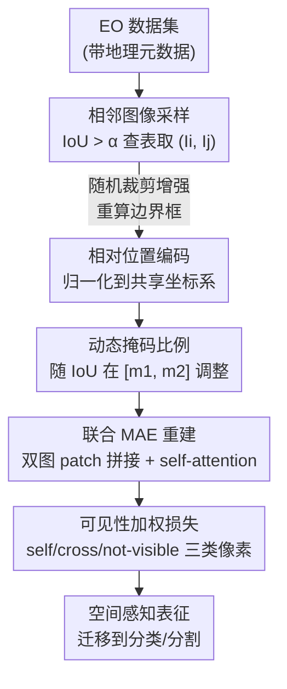

# NeighborMAE: Exploiting Spatial Dependencies between Neighboring Earth Observation Images in Masked Autoencoders Pretraining

**会议**: CVPR 2026  
**论文**: [CVF Open Access](https://openaccess.thecvf.com/content/CVPR2026/html/Zeng_NeighborMAE_Exploiting_Spatial_Dependencies_between_Neighboring_Earth_Observation_Images_in_CVPR_2026_paper.html)  
**代码**: https://github.com/LeungTsang/NeighborMAE  
**领域**: 遥感 / 自监督  
**关键词**: 掩码图像建模, 地球观测, 自监督预训练, 空间依赖, MAE

## 一句话总结
NeighborMAE 把 MAE 从"重建单张遥感图"改成"联合重建一对地理上相邻的图像"，靠相对位置编码、随 IoU 自适应的掩码比例和按可见性加权的重建损失，让模型显式学到相邻地物之间的空间依赖，在多个遥感分类/分割下游任务上稳定超过 SatMAE、ScaleMAE 等同类基线。

## 研究背景与动机

**领域现状**：在地球观测（Earth Observation, EO）领域，掩码图像建模（Masked Image Modeling, MIM）已经是主流自监督范式。MAE 系列（SatMAE、ScaleMAE、SatMAE++、CROMA、DOFA 等）通过遮住一张卫星图的大部分 patch、再让模型重建，从海量无标注卫星影像里学到可迁移表征，已经被广泛扩展到多光谱、多时相、多模态数据上。

**现有痛点**：几乎所有 MIM 框架都把每张影像 tile **当成孤立样本**来处理——遮一张、重建这一张。但地球表面是连续的，一张卫星图只是一张巨大、空间连贯的"马赛克拼图"里的一小块。相邻区域的影像（来自卫星重访、不同任务的重叠拍摄、或空间裁剪）共享地形结构、土地利用连续性、人造设施延伸等大量上下文信息，却被现有 MIM 完全忽略。对比学习里这些相邻 tile 常被当成正样本用，但在 MIM 重建里几乎没人碰。

**核心矛盾**：学相邻图像的空间依赖，**不等于**简单把输入图放大成一张更大的静态图。相邻视角往往采集时间不同、视角几何不同、传感器不同，带来的是真实的"变化中的空间关系"，而不是同一张图的不同区域。直接把两张相邻图拼起来联合重建，又会引入**捷径学习**：如果一个被遮的像素在邻图对应位置恰好可见且没怎么变化，模型只要"复制粘贴"邻图就能蒙混过关，学不到东西。

**本文目标**：(1) 在 MIM 框架里显式建模相邻 EO 图像之间的空间（及顺带的时间）依赖；(2) 同时保证预训练任务依然足够难，不被相邻图带来的额外信息"喂软"。

**核心 idea**：把 MAE 的重建对象从"一张图"换成"一对相邻图"——所有可见 patch 拼在一起进 encoder，让 self-attention 跨图建立联系，再联合重建两张图；并用 IoU 驱动的动态掩码和可见性加权损失堵住捷径。

## 方法详解

### 整体框架
NeighborMAE 建立在原版 MAE 之上：encoder 只吃可见 patch、decoder 用 mask token 补全被遮区域、在像素空间做重建。它的关键改动是**把一对相邻图像作为一个训练样本联合处理**。整条流程是：先从数据集里按地理坐标的交并比（IoU）采样出一对相邻图 $(I_i, I_j)$；经过随机裁剪等增强、并据此重新计算各自的地理边界框；把两张图的相对位置统一编码进一个共享坐标系；根据这对图的重叠程度决定掩码比例；然后两张图的可见 patch 拼接进 MAE，通过 self-attention 联合重建；最后用按"输入可见性"设计的权重去缩放跨图可见像素的重建损失，避免模型走复制捷径。预训练完成后，encoder 作为骨干迁移到下游分类/分割。

### 关键设计

**1. 相邻图像采样：用地理 IoU 把"相邻"定义清楚并预先查表**

要联合重建一对相邻图，第一步是定义什么叫"相邻"。本文用最直接的标准：两张图在地表的覆盖范围有重叠就算潜在邻居。给定带元数据的数据集 $D$，用每张图的地理参考边界框 $(\phi_{min}, \phi_{max}, \lambda_{min}, \lambda_{max})$（经纬度范围）计算两两 IoU，超过阈值 $\alpha$ 就算邻居：

$$\mathcal{N}(I_i) = \{I_j \mid I_j \in D,\ IoU(I_i, I_j) > \alpha\},\ I_i \in D$$

这个邻居集合**离线预计算并存成查找表**，训练时对每个采样到的 $I_i$ 直接从 $\mathcal{N}(I_i)$ 里随机抽一张 $I_j$，避免在线搜索拖慢训练。阈值 $\alpha$ 按数据集调：object-centric 的 fMoW 设 0.1（排除"一张图只是另一张的极小裁剪"这种弱依赖），而滑窗密集裁出的 Satellogic 设 0.0（让紧邻 patch 也算邻居）。值得注意的是，采样**只看空间覆盖**，不对时间、任务、云量做任何约束——这些差异是数据集自带的，反而提供了有用的多样性。

**2. 相对位置编码：把两张图的相对位置塞进一个共享坐标系**

模型要学空间依赖，就必须知道两张图"谁在谁的左上/右下、重叠多少"。但下游应用未必有地理元数据，所以不能直接喂绝对经纬度。本文把这对图的边界框**用它们自身经纬度的最小/最大值归一化到 $[0,1]$**，得到每张图在共享坐标系里的 $top_i, bottom_i, left_i, right_i$（例如单图输入时归一化框退化成常数 $(0,1,0,1)$）。这样的相对位置完全在图像坐标系里计算，不依赖地表绝对距离，迁移时也保持一致。归一化后把 patch 级别的边界框用标准正弦位置编码映射到 ViT 维度，再加上一个**可学习的 image-level embedding** 来区分"这个 token 属于哪张图"。随机裁剪增强会改变覆盖范围，所以裁剪后要按裁剪参数（左上角 + 裁剪尺寸）重新推算边界框，这一步保证即使两张图原本同覆盖（时间重访），裁剪后仍有真实的空间偏移可学。

**3. 动态掩码比例：重叠越多遮得越狠，维持重建难度**

引入邻图等于给模型多喂了信息，重建任务会变简单——尤其当两张图高度重叠、近似"序列"时，类似把 MAE 用到视频上时往往需要更高掩码率。固定掩码率会让高重叠样本太容易、低重叠样本又可能太难。本文让掩码比例**随这对增强后图像的 IoU 线性插值**：

$$mask\_ratio = m_1 + IoU(A(I_i), A(I_j)) \cdot (m_2 - m_1)$$

重叠越大（信息越冗余），掩码率越往上界 $m_2$ 推，把任务重新拉难；几乎不重叠时退回下界 $m_1$（与原版 MAE 一致）。实验里 $m_1=0.75$、$m_2=0.85$ 最优，正好说明"无重叠时保持 MAE 的 0.75，全重叠时升到 0.85"这个直觉是对的。

**4. 可见性加权损失：按"邻图能不能抄到"给跨图可见像素打折，堵死复制捷径**

这是防捷径的核心。联合重建时，把 $I_i$ 里要重建的像素分成三类：**self-visible**（在本图就没被遮）、**cross-visible**（本图被遮、但在邻图对应位置可见）、**not-visible**（两张图都看不到）。危险在 cross-visible：如果该像素跨图可见且变化不大，模型只要从邻图"复制粘贴"就能预测，等于没学到任何空间推理。

本文先用坐标变换建立两张图的像素对应：用变换矩阵 $T_i$ 把 $I_i'$ 的像素从图像坐标变到共享坐标系，再用 $T_j^{-1}$ 变到 $I_j'$ 的图像坐标，于是 $I_i'$ 里像素 $p_i$ 在邻图的对应像素为 $p_i^j = T_j^{-1} T_i\, p_i$。然后给每个像素的 MSE 重建损失乘权重：

$$weight = \begin{cases} 0 & p_i \in P_{self} \\ \min\!\left(\dfrac{MSE(I_j'(p_i^j),\, I_i'(p_i))}{MSE(R_i(p_i),\, I_i'(p_i))},\ 1\right) & p_i \in P_{cross} \\ 1 & p_i \in P_{not} \end{cases}$$

self-visible 像素权重为 0（和 MAE 一样不重建已见区域）；not-visible 像素权重为 1（正常重建）；关键是 cross-visible 像素：分子是"直接拿邻图对应像素当预测"的误差，分母是"模型实际预测"的误差。如果邻图和本图该像素几乎一样（分子很小），说明这就是个能被复制的捷径，权重被压低、几乎不计损失；如果邻图对应位置变化很大（分子大），权重封顶为 1，正常重建。这个权重**从梯度图里 detach**，只当缩放系数用。直觉就是：能抄的不奖励、变化大的照常学。

### 损失函数 / 训练策略
重建用 MSE，按上述可见性权重缩放后求和。骨干为 ViT-Large-16，fMoW 上训 800 epoch、Satellogic 上训 50 epoch，batch size 2048，学习率 $1.5\text{e-}4 \times bs/256$。为了和普通 MAE 在"计算量/epoch"上公平对齐，NeighborMAE 的 epoch 数按"训练过的图像总数等于数据集大小"来定义，batch size 也按实际图像数（而非图像对数）算。

## 实验关键数据

### 主实验
ViT-Large-16，在 fMoW-RGB 或 Satellogic-RGB 上预训练，迁移到 7 个 RGB 遥感下游任务（5 分类 + 2 分割），每格为 "冻结骨干 / 全量微调"，报 3 次独立运行均值。

| 任务（指标） | MAE (fMoW) | NeighborMAE (fMoW) | NeighborMAE (Satl.) | DOFA |
|---|---|---|---|---|
| fMoW 分类 (Acc) | 66.8 / 78.2 | **68.8 / 79.3** | 58.8 / 77.9 | 62.6 / 78.0 |
| UC Merced (Acc) | 87.8 / 94.5 | 91.4 / 97.6 | 88.8 / 96.2 | **96.4 / 98.3** |
| RESISC45 (Acc) | 89.8 / 96.0 | 91.0 / 96.6 | 88.5 / 95.6 | **94.5 / 97.4** |
| FireRisk (Acc) | 60.7 / 63.5 | 61.4 / 64.2 | 60.4 / 64.0 | 60.3 / 64.0 |
| ForestNet (Acc) | 50.1 / 55.5 | **52.4 / 57.0** | 51.5 / 56.8 | 43.8 / 54.0 |
| FBP 分割 (mIoU) | 58.8 / 63.9 | **60.3 / 66.6** | 58.4 / 63.7 | 59.7 / 66.2 |
| PASTIS-HD 分割 (mIoU) | 31.1 / 33.9 | 31.8 / **36.1** | 32.5 / 35.4 | 32.2 / 35.6 |

相对直接基线 MAE：fMoW 分类线性探测 +2.0%、微调 +1.1%；分割上 FBP 微调 +2.7% mIoU、PASTIS-HD +2.2% mIoU。同 research line 里（SatMAE/ScaleMAE/SatMAE++/CrossScale），NeighborMAE 在 in-domain fMoW 分类、火灾风险、森林砍伐等任务上明显领先；对比用大规模多模态多光谱数据训的 SOTA 模型 DOFA，在 RGB 任务上整体打平、fMoW 上甚至略超（DOFA 在 UC Merced/RESISC45 等场景分类上更强）。

### 消融实验

**增益来源（同 token 预算下对比不同"扩展输入"方式，ViT-Base）**：

| 输入方式 | fMoW Acc | FBP mIoU |
|---|---|---|
| (a) base 单图 | 58.0 / 76.5 | 53.5 / 58.2 |
| (b) 单纯放大图幅 | 58.2 / 76.7 | 53.8 / 58.6 |
| (c) 空间相邻图 | 58.7 / 76.8 | 54.1 / 58.9 |
| (d) 同地多时相图 | 58.2 / 77.0 | 54.5 / 58.7 |
| (e) 多时相相邻图 | **61.7 / 77.7** | **56.0 / 60.4** |

| 组件消融 | 配置 | fMoW Acc | 说明 |
|---|---|---|---|
| 动态掩码 | 固定 0.75 | 61.0 / 77.4 | 不随 IoU 调，掉点 |
| 动态掩码 | 固定 0.80 | 60.8 / 77.3 | 比动态差 |
| 动态掩码 | **m1=0.75, m2=0.85** | **61.7 / 77.7** | 最优 |
| 加权损失 (Satl.) | full 全重建 | 50.2 / 74.1 | 含所有未遮像素，严重退化 |
| 加权损失 (Satl.) | cross 权重=1 | 51.8 / 75.1 | 不打折，掉点 |
| 加权损失 (Satl.) | **ours** | **52.4 / 75.8** | 按可见性压低 cross 权重 |

### 关键发现
- **真正的增益来自"相邻"而非"更多 token"**：单纯放大图幅 (b) 几乎不涨，换成相邻图 (c) 才开始涨，而空间+时间一起的 (e) 增益最大（fMoW Acc 58.0→61.7）——说明相邻图带来的"变化中的空间多样性"才是关键，且空间与时间依赖存在协同。
- **加权损失在低时间变化数据上才显威力**：fMoW 本身多为长期多时相、变化大，cross-visible 像素本来就难抄，加权效果接近 full weighting；但 Satellogic 重访少、邻图常来自同一张图的裁剪，"复制捷径"风险高，此时压低 cross-visible 权重明显涨点（去掉它从 52.4 掉到 51.8）。
- **代价很小**：相比 MAE，联合编解码两张图因 self-attention 的 $O(n^2)$ 略增开销（batch time 0.122s→0.134s，显存 15.5→19.6 GB/GPU），但远比多尺度重建的 SatMAE++（0.381s，58.7 GB）便宜——后者的上采样极其费算力。

## 亮点与洞察
- **重新定义了 MIM 的"样本单位"**：把训练样本从"一张孤立 tile"升级成"一对地理相邻图"，挖的是 EO 数据里早就存在、却被对比学习独占的空间连续性信号，思路简单但切中要害。
- **可见性加权损失是很可复用的防捷径 trick**：用"邻图直接当预测的误差"作分子去自适应判断"这个像素能不能被抄"，能抄的自动降权、变化大的照常学，比一刀切排除 cross-visible 像素更细腻。这套"用 baseline 预测难度反向加权损失"的思路可迁移到任何带冗余对应关系的重建任务。
- **动态掩码把"信息越多任务越易"这件事量化进了 IoU**：用一个标量 IoU 线性控制难度，省事且解释性强，最优区间 [0.75, 0.85] 也正好对上"无重叠=MAE 原值、全重叠=更狠"的直觉。
- **相对位置编码绕开了对绝对地理元数据的依赖**：归一化到共享坐标系，下游没有经纬度也能用，单图退化成常数框，工程上很干净。

## 局限与展望
- **只做了 RGB**：作者明确把多光谱、多模态扩展留作 future work（为隔离空间依赖、与前作公平对比才限定 RGB）；而 EO 的真正价值很大一部分在多光谱，当前结果还不能代表完整能力。
- **只支持两张相邻图**：self-attention 的 $O(n^2)$ 复杂度让扩展到更多邻居代价陡增，作者承认要靠 token 缩减或新架构才能 scale。
- **依赖地理元数据采样邻居**：预训练阶段需要地理参考边界框来建查找表，对没有元数据的数据集不适用（虽然下游不需要）。
- **对 DOFA 等大规模模型只是"打平"**：在场景分类类任务（UC Merced/RESISC45）仍落后 DOFA 较多，说明 RGB-only + 中等数据规模的上限有限，增益主要体现在火灾/森林等专门任务上。

## 相关工作与启发
- **vs MAE / SatMAE**：它们重建单张图，NeighborMAE 联合重建一对相邻图，多出跨图 self-attention 学空间依赖；在同设置下稳定超过两者。
- **vs ScaleMAE / SatMAE++**：后者通过多尺度重建"部分"捕捉空间信息，但靠合成的多尺度线索且上采样极贵；NeighborMAE 用真实相邻图的自然空间连续性，更便宜、增益更直接。
- **vs Cross-Scale MAE**：它也用数据增强造的相邻图，但只把它们分开处理、喂给辅助的对比目标，没在重建里联合建模；NeighborMAE 是直接在重建目标里联合两张真实相邻图。
- **vs 对比学习（SeCo / Tile2Vec / GASSL）**：这些把地理/时间相近的 tile 当正样本，依赖预设相似度假设和手工增强，遇到地物边界等"空间近但语义不同"会失灵；NeighborMAE 用重建目标天然规避了相似度假设，更鲁棒。

## 评分
- 新颖性: ⭐⭐⭐⭐ 第一个在 MIM 重建目标里联合建模真实相邻 EO 图、并配套防捷径机制，角度被忽略但很扎实。
- 实验充分度: ⭐⭐⭐⭐ 两个预训练集 × 7 个下游任务 × 冻结/微调，消融把"增益来源/掩码/损失"逐项拆清；缺多光谱与三邻图以上的验证。
- 写作质量: ⭐⭐⭐⭐ 动机清晰、公式完整、消融设计（尤其"增益来源"对照）很有说服力。
- 价值: ⭐⭐⭐⭐ 给 EO 自监督指出一条便宜可落地的方向，防捷径加权损失有跨任务复用价值。

<!-- RELATED:START -->

## 相关论文

- [\[CVPR 2026\] RAMEN: Resolution-Adjustable Multimodal Encoder for Earth Observation](ramen_resolution-adjustable_multimodal_encoder_for_earth_observation.md)
- [\[CVPR 2026\] OlmoEarth: Stable Latent Image Modeling for Multimodal Earth Observation](olmoearth_stable_latent_image_modeling_for_multimodal_earth_observation.md)
- [\[ICLR 2026\] Earth-Agent: Unlocking the Full Landscape of Earth Observation with Agents](../../ICLR2026/remote_sensing/earth-agent_unlocking_the_full_landscape_of_earth_observation_with_agents.md)
- [\[ECCV 2024\] Masked Angle-Aware Autoencoder for Remote Sensing Images](../../ECCV2024/remote_sensing/masked_angle-aware_autoencoder_for_remote_sensing_images.md)
- [\[CVPR 2026\] Spatial-Spectral Residuals Informed Diffusion Neural Operator for Pan-sharpening](spatial-spectral_residuals_informed_diffusion_neural_operator_for_pan-sharpening.md)

<!-- RELATED:END -->
