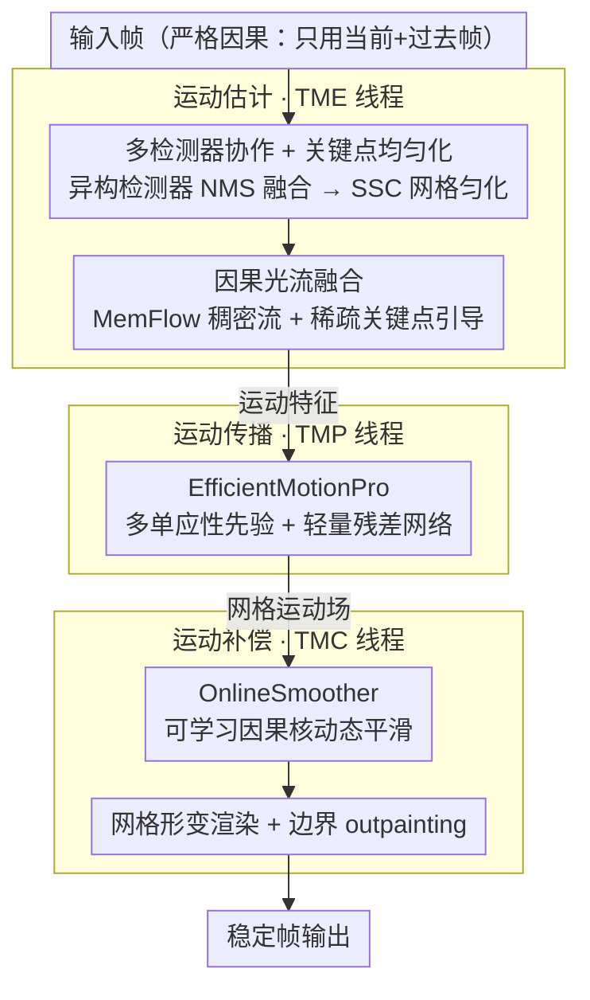

# No Labels, No Look-Ahead: Unsupervised Online Video Stabilization with Classical Priors

**会议**: CVPR 2026  
**arXiv**: [2602.23141](https://arxiv.org/abs/2602.23141)  
**代码**: [GitHub](https://github.com/liutao23/LightStab.git)  
**领域**: 遥感  
**关键词**: 视频稳定, 无监督, 在线处理, 光流估计, 无人机

## 一句话总结

提出无监督在线视频稳定框架 LightStab，通过经典三阶段管线（运动估计→运动传播→运动补偿）搭配多线程异步缓冲，在 5 个基准数据集上首次让在线方法全面媲美离线 SOTA，并发布首个包含可见光和红外的多模态无人机航拍稳定测试集 UAV-Test。

## 研究背景与动机

**领域现状**：视频稳定旨在抑制相机抖动、提升视觉质量。经典方法按三阶段运动估计→运动平滑→帧补偿执行，按运动模型维度分为 2D（仿射/单应性/光流）、2.5D（有限3D线索）和 3D（深度+点云）方法。深度学习方法（DUT、NNDVS、RStab 等）通过端到端学习直接生成稳定帧。

**现有痛点**：
   - **感知局限**：经典方法依赖手工特征检测器（SIFT、ORB 等），在弱纹理、遮挡和大运动场景下不鲁棒，关键点分布不均匀导致运动估计有偏
   - **平滑局限**：固定平滑策略无法泛化，导致残余抖动；学习型平滑缺少几何可解释性，可能过度平滑或产生畸变
   - **在线处理局限**：大多数高质量稳定器（包括经典和学习型）依赖离线批处理或未来帧，引入延迟。学习型方法还需要大量配对标注数据和计算资源

**核心矛盾**：无监督 + 在线 + 高质量三者难以兼得。现有最好的在线方法（NNDVS）在部分场景仍有明显差距，且现有基准测试集主要是手持可见光视频，不覆盖无人机夜间遥感等实际需求场景。

**本文目标** 设计一个完全无监督、严格因果（不使用未来帧）的在线视频稳定框架，同时在质量上接近或超越离线 SOTA，并扩展到无人机多模态场景。

**切入角度**：作者不走端到端路线，而是回归经典三阶段管线但用现代组件武装每个阶段——用多检测器协作+光流替代单一手工特征，用轻量自监督网络替代固定滤波，用多线程并行消除串行延迟瓶颈。

**核心 idea**：经典三阶段管线 + 现代组件（多检测器协作、因果光流融合、自监督运动传播网络、动态核在线平滑）+ 系统级多线程优化 = 无监督在线高质量稳定。

## 方法详解

### 整体框架

LightStab 没有走端到端黑盒，而是回到经典的"运动估计→运动平滑→帧补偿"三阶段框架，但要求每一步都严格因果——只看当前帧和过去帧，绝不偷看未来帧。一帧进来后，先在**运动估计**阶段被多个检测器协作打上均匀分布的关键点，再用 MemFlow 估计的因果光流把稀疏关键点补成稠密线索，输出运动特征向量 $\mathbf{m}_t = [x_{kp}; y_{kp}; u; v]$；接着在**运动传播**阶段，EfficientMotionPro 把这些稀疏运动扩散成覆盖全帧的网格运动场 $\Delta g_t$；最后在**运动补偿**阶段，OnlineSmoother 用一组可学习的因果核把网格轨迹抹平，算出补偿位移并渲染出稳定帧。

要在保证因果的前提下不被串行延迟拖垮，三个阶段还被拆进三条独立线程（TME/TMP/TMC）异步流水、靠 FIFO 共享队列传递中间结果，把整条管线的延迟从「三阶段串行累加」压到「由最慢一级决定」——这套系统级设计是它能在边缘设备上实时跑的关键。

### 关键设计

**1. 多检测器协作 + 关键点均匀化：让运动估计不再被纹理密集区带偏**

经典方法用单一手工检测器（SIFT、ORB）找关键点，问题是这些点会扎堆在纹理丰富的局部区域，弱纹理和遮挡处几乎没点，运动估计于是偏向局部、对全局抖动不敏感。这里改成一个异构检测器集合 $\mathcal{D} = \{D_m^{trad}\} \cup \{D_n^{deep}\}$ 同时上阵，传统与深度检测器各自提取关键点，归一化置信度后用 NMS 融合成统一集合 $\tilde{K}_t = \text{NMS}(\bigcup_j w_j \cdot \tilde{K}_t^{(j)})$。

光融合还不够——融合后的点仍可能聚集，所以再用 SSC（空间选择性聚类）把图像切成 $G_x \times G_y$ 网格，每格只保留置信度最高的 top-$k$ 点，并强制任意两点间距不小于 $\tau$。这样无论原始检测器偏好哪片区域，最终送进运动估计的关键点都在空间上摊得很匀，可视化也证实了协作检测比单检测器覆盖更均匀，从源头上修正了运动估计的偏置。

得到均匀关键点后，运动估计还要把它们补成稠密运动观测：用 MemFlow 估计当前帧到上一帧的因果稠密光流（只依赖 $\{I_{t-1}, I_t\}$），再以关键点邻域为掩码 $M_t$ 做融合——邻域内信任稠密光流、邻域外用关键点插值，得到重加权流场 $\hat{\mathbf{f}}_{t\leftarrow t-1}$；最后在关键点位置采样位移、与坐标拼成运动特征 $\mathbf{m}_t = [x_{kp}; y_{kp}; u; v]$ 送入下一阶段。这一步让稀疏检测的鲁棒性和光流的稠密非刚性建模结合起来，既省去全图稠密光流的开销，又避免纯关键点匹配在弱纹理处失效。

**2. EfficientMotionPro：用"刚性先验 + 非刚性残差"把稀疏运动扩散到全帧**

有了稀疏关键点运动，还得补成稠密的网格运动场，难点在于既要拟合复杂场景（含动态物体），又不能让轻量网络从零硬学。它的做法是分两步：先靠**多单应性先验**给出基础位移——用 K-means 把关键点聚成几簇、各簇 RANSAC 估一个单应性，得到 $K_{homo}$ 个单应性后按软融合权重混合成 $\Delta g_{base,t}$；再用一个 Ghost+ECA 的轻量骨干预测它与真实运动的偏差 $\Delta g_{res,t}$。

这样网络只需学习"相对刚性模型的非刚性残差"，学习难度大幅下降，整个模块仅约 22.9K 参数、计算量随关键点数线性增长。多个单应性的好处是能同时容纳画面里运动模式不一致的区域（前景动态物体 vs 背景），单单应性在这种场景会失效。训练靠三项自监督损失约束：关键点一致性损失 $\mathcal{L}_{kp}$（Charbonnier penalty 配自适应置信度权重）保证传播后的运动对得上观测、单应性投影一致性损失 $\mathcal{L}_{proj}$ 约束几何合理、网格结构保持损失 $\mathcal{L}_{struct}$ 用正交性约束防止网格被剪切扭曲。

**3. OnlineSmoother：可学习的因果核按运动强弱动态调平滑力度**

最后一步要抹掉网格轨迹里的高频抖动，又不能把摄影师有意的平移/旋转一起抹平。固定滤波器（高斯、均值）做不到这点——它对所有运动一视同仁，遇到大运动会过度平滑、遇到小抖动又抑制不足。这里改用 Lite LS-3D 编码器提时空特征、Star-gated 解码器现场预测一组 3-tap 因果核（$x$、$y$ 方向各 3 个系数），平滑按下式递推：

$$S_t^x = \frac{\lambda \sum_r k_{t,r}^x S_{t-r}^x + O_t^x}{1 + \lambda \sum_r |k_{t,r}^x|}$$

其中 $\lambda=100$ 控制平滑强度、有效时间窗口 $L=7$ 帧（只回看过去 7 帧，保持因果）。因为核系数是按当前运动实时算出来的，平滑力度能随运动幅度自适应；再叠一个频域损失 $\mathcal{L}_{freq}$（DFT 频率加权）显式压住高频振荡，就既稳又不糊。训练损失还包括时间自适应二阶惩罚 $\mathcal{L}_{time}$（带运动幅度自适应衰减 $\beta$）、空间畸变约束 $\mathcal{L}_{spatial}$（三角网格边长比 + 角度保持）和关键点投影一致性 $\mathcal{L}_{proj}$。

**4. 多线程异步管线：把串行延迟压成并行延迟，换来边缘端实时**

因果约束带来一个副作用：运动估计→运动传播→运动补偿三步有严格的前后依赖，朴素实现只能串行执行，单帧延迟是三段耗时之和 $t_{est} + t_{prop} + t_{smooth}$，在 Jetson 这类算力受限的边缘设备上根本跑不到实时。LightStab 把三个阶段分别绑到三条线程（TME/TMP/TMC），相邻阶段之间用 FIFO 共享队列传递中间结果，于是不同帧的不同阶段可以同时在跑——稳态吞吐不再是三段之和、而是由最慢一级决定：

$$S = \frac{t_{est} + t_{prop} + t_{smooth}}{\max\{t_{est}, t_{prop}, t_{smooth}\}}$$

队列的 back-pressure（背压）机制还能在某一级变慢时自动让上游阻塞，避免帧无限堆积把内存撑爆。正是这套系统级设计让它在 Jetson AGX Orin 上达到 ~13 FPS（约 78.94ms/帧），比同为在线方法的 NNDVS（2.94 FPS）快 4 倍多，把「无监督 + 在线 + 高质量」里最难落地的实时性补齐。

### 损失函数 / 训练策略

**EfficientMotionPro**: $\mathcal{L} = 10\mathcal{L}_{kp} + 40\mathcal{L}_{proj} + 40\mathcal{L}_{struct}$，Adam 优化，OneCycleLR（峰值lr $2\times10^{-4}$），100 epochs，batch=64，单卡 RTX 4090 约 12h。

**OnlineSmoother**: $\mathcal{L}_{total} = \mathcal{L}_{temp} + 10\mathcal{L}_{spatial} + 5\mathcal{L}_{proj}$，其中 $\mathcal{L}_{temp} = 20\mathcal{L}_{time} + \mathcal{L}_{freq}$。batch=1 保持因果性，梯度裁剪阈值 5.0，约 2.5h。

帧边界黑边使用 ProPainter 进行 outpainting 后处理填充。

## 实验关键数据

### 主实验

在 5 个数据集上比较 Cropping Ratio (C)、Distortion Value (D)、Stability Score (S)，均为越高越好：

| 方法 | 类型 | NUS (C/D/S) | DeepStab (C/D/S) | Selfie (C/D/S) | GyRo (C/D/S) | UAV-Test (C/D/S) |
|------|------|------------|-----------------|---------------|-------------|-----------------|
| DUT | 离线 | 0.98/0.88/0.85 | 0.99/0.95/0.95 | 0.99/0.98/0.93 | 0.99/0.98/0.89 | 0.95/0.89/0.94 |
| RStab | 离线 | 1.00/0.99/0.94 | 1.00/0.98/0.96 | 1.00/0.92/0.95 | 1.00/0.95/0.92 | 1.00/0.96/0.94 |
| NNDVS | 在线 | 0.92/0.98/0.87 | 0.93/0.91/0.84 | 0.97/0.92/0.91 | 0.99/0.93/0.88 | 0.89/0.87/0.84 |
| Liu et al. | 在线 | 0.72/0.89/0.89 | 0.89/0.88/0.85 | 0.79/0.89/0.85 | 0.99/0.94/0.89 | 0.82/0.89/0.85 |
| **Ours** | **在线** | **0.95/0.98/0.90** | **0.94/0.91/0.85** | **0.98/0.93/0.91** | **0.99/0.96/0.93** | **0.94/0.90/0.89** |

### 消融实验

| 配置 | 说明 |
|------|------|
| w/o MP (A1) | 去掉运动传播，D 和 PSNR 下降，全局运动建模能力退化 |
| w/o TS (A2) | 去掉轨迹平滑，结构稳定性下降，D 指标变差 |
| w/o MP&TS (A3) | 同时去掉两者，性能下降最严重，证明互补性 |
| w/o Loss_kp (A4) | 去掉关键点一致性损失，运动监督减弱 |
| w/o Homo (A6) | 单一单应性替代多单应性，出现抖动和局部畸变 |
| w/o KPC (A7) | 不用协作检测，关键点不均匀，D 下降 |
| Window L=5/7/9 | L=5 提升稳定性但降低保真度；L=9 增加计算但无一致收益；L=7 最优 |
| Full model (A10) | 所有模块+L=7，达到最高综合分数 |

### 关键发现

- **在线首次媲美离线**：在 GyRo 数据集上（C=0.99, D=0.96, S=0.93），本方法的在线性能可与最强离线方法 Gavs（C=1.00, D=0.99, S=0.93）竞争
- **UAV-Test 优势显著**：在新的无人机数据集上全面超越现有在线方法（vs NNDVS: +0.05 C, +0.03 D, +0.05 S）
- **嵌入式平台可用**：在 Jetson AGX Orin 上达 ~13 FPS（78.94ms/帧），比 NNDVS（2.94 FPS）快 4 倍多
- **运动传播和轨迹平滑高度互补**：单独去掉任一个性能下降有限，但同时去掉(A3)导致最大幅度退化

## 亮点与洞察

- **经典管线+现代组件的混合策略**：不走端到端黑盒路线，保留三阶段管线的可解释性和可控性，同时用学习型组件替换各阶段的薄弱环节。这种"有原则的工程混合"比纯端到端更适合实际部署
- **自监督训练消除数据依赖**：两个核心网络（EfficientMotionPro 和 OnlineSmoother）都用自监督目标训练，完全避免了配对稳定/不稳定视频数据的需求，这是实用化的关键
- **多线程异步管线的工程设计**精巧：将串行延迟 $t_1+t_2+t_3$ 降低到 $\max(t_1,t_2,t_3)$，通过 FIFO 队列的 back-pressure 机制保证资源安全

## 局限与展望

- **依赖外部光流估计器**：使用 MemFlow 做因果光流，其精度在复杂场景中可能不足，探索更准确高效的光流模型是一个方向
- **帧 outpainting 非在线**：黑边填充使用 ProPainter 后处理，计算量大，未集成到在线管线中。需要开发更轻量的在线友好型 outpainting 技术
- **Lambertian 相机模型限制**：采用简单的 2D 运动模型，在极大视差和 3D 结构变化场景中可能失效
- **UAV-Test 仅 92 个序列**：规模较小，场景多样性有限，可作为更大规模无人机稳定基准的起点

## 相关工作与启发

- **vs DUT**: DUT 也是经典管线+神经网络的混合，但它是离线方法，依赖全局平滑策略。本文的在线因果设计（不访问未来帧）是核心区别，且运动传播和平滑均独立训练
- **vs NNDVS**: NNDVS 利用现有运动估计框架实现在线稳定，但缺乏开源运动估计器且复杂场景鲁棒性不足。本文通过多检测器协作+关键点均匀化显著提升运动感知鲁棒性
- **vs RStab**: RStab 是最强离线方法，使用神经渲染+自适应模块，质量极高但需要未来帧。本文在在线约束下性能可比，且推理速度快很多

## 评分

- 新颖性: ⭐⭐⭐⭐ 各组件的设计（多检测器协作、多单应性先验、因果动态核）有系统性创新，但核心思路仍是经典管线的现代化改造
- 实验充分度: ⭐⭐⭐⭐⭐ 5个数据集+完整消融+用户研究+嵌入式平台测试+丰富可视化，非常全面
- 写作质量: ⭐⭐⭐⭐ 论文结构清晰，公式推导完整，补充材料极为详尽
- 价值: ⭐⭐⭐⭐ 在线稳定首次媲美离线、无监督训练、新数据集，实用性强

<!-- RELATED:START -->

## 相关论文

- [\[CVPR 2026\] HySeg: Learning Generative Priors for Structure-Aware Remote Sensing Segmentation](hyseg_learning_generative_priors_for_structure-aware_remote_sensing_segmentation.md)
- [\[CVPR 2026\] Lumosaic: Hyperspectral Video via Active Illumination and Coded-Exposure Pixels](lumosaic_hyperspectral_video_via_active_illumination_and_coded-exposure_pixels.md)
- [\[CVPR 2026\] Exploring Spatiotemporal Feature Propagation for Video-Level Compressive Spectral Reconstruction](exploring_spatiotemporal_feature_propagation_for_video-level_compressive_spectra.md)
- [\[ICLR 2026\] Spectral Gaps and Spatial Priors: Studying Hyperspectral Downstream Adaptation Using TerraMind](../../ICLR2026/remote_sensing/spectral_gaps_and_spatial_priors_studying_hyperspectral_downstream_adaptation_us.md)
- [\[AAAI 2026\] UniABG: Unified Adversarial View Bridging and Graph Correspondence for Unsupervised Cross-View Geo-Localization](../../AAAI2026/remote_sensing/uniabg_unified_adversarial_view_bridging_and_graph_correspondence_for_unsupervis.md)

<!-- RELATED:END -->
