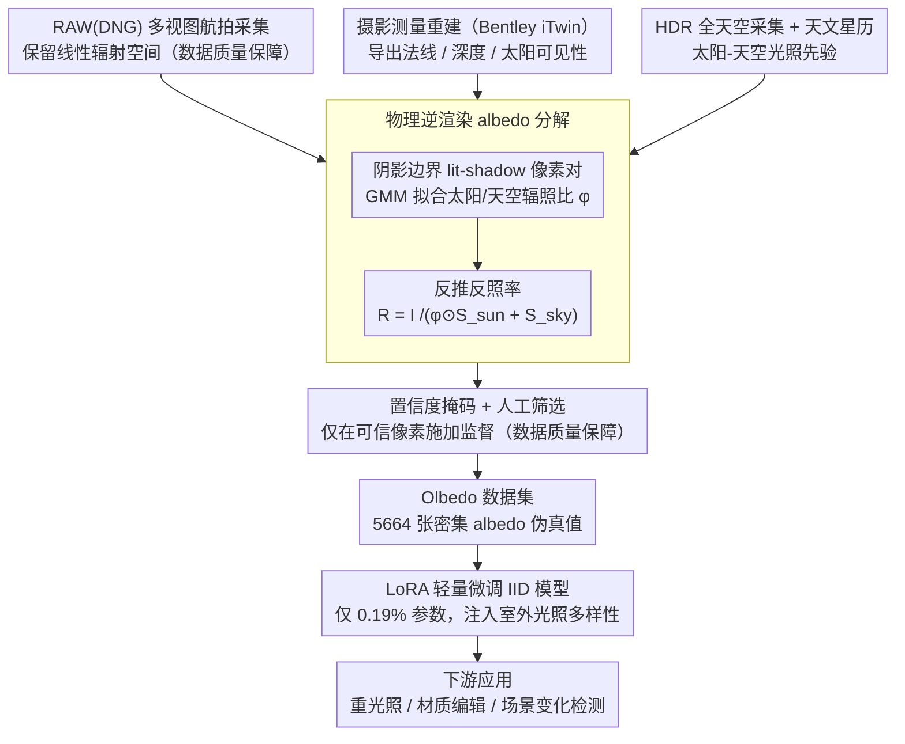

# Olbedo: An Albedo and Shading Aerial Dataset for Large-Scale Outdoor Environments

**会议**: CVPR 2026  
**arXiv**: [2602.22025](https://arxiv.org/abs/2602.22025)  
**代码**: [Project](https://gdaosu.github.io/olbedo/)  
**领域**: 遥感  
**关键词**: 内在图像分解, 反照率, 航拍数据集, 逆渲染, 城市数字孪生

## 一句话总结

Olbedo 提出首个大规模真实航拍反照率-着色分解数据集（5664 张 UAV 图像、4 种地貌、跨年多光照），通过物理逆渲染管线生成多视图一致的伪真值标注，证明合成预训练+Olbedo LoRA 微调可以显著提升室外反照率预测并支持重光照/材质编辑/场景变化分析等下游应用。

## 研究背景与动机

**领域现状**：内在图像分解（IID）旨在将图像分离为反照率（albedo）$R$ 和着色（shading）$S$，满足 $I = R \cdot S$。这是重光照、材质编辑和 3D 内容创建的基础。深度学习近年大幅推进了 IID，从 CNN（NIID-Net）到扩散模型（Intrinsic Image Diffusion、RGB↔X、Marigold-IID），但这些进展几乎局限于**室内或合成环境**。

**现有痛点**：推进真实世界室外 IID 的核心障碍是**缺乏大规模密集真值数据集**。现有数据集分三类：
   - **合成数据集**（MPI Sintel、CGIntrinsics、InteriorVerse、Hypersim）：有完美真值但有 sim-to-real gap，且多为室内/物体级
   - **真实受控数据集**（MIT Intrinsics、MID、DIR）：用多光照条件计算伪真值，但受限于室内小规模场景
   - **真实野外数据集**（IIW）：有真实图像但只有稀疏相对判断，没有密集 albedo 图
   
   **关键空白**：不存在大规模、真实世界、密集标注的室外航拍 IID 数据集。

**核心矛盾**：室外场景受动态复杂光照（太阳+天空）影响，无法像室内一样控制光照来获取真值。需要一种替代方法来生成可靠的户外 albedo 监督信号。

**本文目标** 构建首个大规模真实航拍 albedo-shading 数据集，提供密集伪真值监督，使现有 IID 模型能适应室外航拍场景。

**切入角度**：利用摄影测量重建提供精确 3D 几何（法线、深度、阴影图），结合天文星历确定太阳位置，基于物理太阳-天空光照模型从阴影边界处的 lit-shadow 像素对估算 albedo——无需控制光照也能获得物理一致的反照率标注。

**核心 idea**：用物理逆渲染管线从多视图航拍 RAW 图像中生成密集 albedo 伪真值，构建首个室外航拍 IID 数据集，让合成数据预训练的模型通过轻量微调就能适应真实户外场景。

## 方法详解

### 整体框架

室外 IID 没有真值的根子在于：你没法像室内那样关灯开灯来分离反照率和光照。Olbedo 的破局思路是把"控制光照"换成"利用几何 + 物理光照模型反推"。整条数据生产线是这样转的：先用 DJI Phantom 4 Pro 以 RAW(DNG) 格式做多视图航拍采集，把图像保留在线性辐射空间；再用 Bentley iTwin Capture 做摄影测量重建（~3cm 精度），从重建网格里导出每张图的法线、深度和阴影图；同时在 2025 年的飞行中用鱼眼相机做 11 挡包围曝光，采集 HDR 全天空辐射作为光照先验。有了几何和光照后，对每张图跑一遍基于太阳-天空光照模型的逆渲染优化，输出 albedo/shading 图，再配一张置信度掩码标记哪些像素可信。最终得到 5664 张带密集 albedo 伪真值的航拍图，覆盖 4 种地貌、跨年多光照，再供下游 IID 模型 LoRA 微调和重光照等应用。

### 关键设计

**1. 物理逆渲染 albedo 分解：用阴影边界代替多光照条件**

室外光照由太阳和天空两部分组成且随时刻剧烈变化，没法靠多次曝光凑出真值，这是室外 IID 一直缺数据的硬骨头。Olbedo 把图像形成写成 $I = R \odot (\phi \odot S_{sun} + S_{sky})$：其中 $S_{sun} = V_{sun} \cdot \langle \mathbf{n}, \theta_{sun} \rangle^+$ 是太阳着色，由法线 $\mathbf{n}$、太阳方向 $\theta_{sun}$ 和太阳可见性 $V_{sun}$ 决定（法线、可见性都来自摄影测量几何，太阳方向由天文星历算出）；$S_{sky}$ 是天空着色（半球积分）；$\phi = \psi_{sun}/\psi_{sky}$ 是待估的太阳/天空辐照比。

求解的关键是一个物理观察：阴影边界两侧紧挨着的 lit-shadow 像素对，材质相同因而 albedo 相同——被太阳照到和被遮住的差别只在着色项。两式相除把 $R$ 消掉，就得到只含 $\phi$ 的约束 $\frac{I_{lit} - I_{shadow}}{I_{shadow}} = \frac{\phi \odot S_{sun}}{S_{sky}}$。Olbedo 收集全图所有 lit-shadow 对，用一个两成分（信号 + 噪声）的 GMM 拟合出最优 $\phi$，再代回 $R = I / (\phi \odot S_{sun} + S_{sky})$ 反推每个像素的反照率。整套流程只需一次飞行、一个时刻的多视图图像，靠阴影边界的物理约束就替代了对受控多光照的依赖。表面统一按 Lambertian 漫反射处理虽是简化，但航拍场景主体是路面、屋顶、植被，这一假设足够用。

**2. 数据质量保障：RAW 采集 + 置信度掩码护住训练信号**

逆渲染标注并非处处可靠——几何孔洞、阴影边缘、镜面反射、玻璃透射这些区域算出来的 albedo 会失真，若直接拿去监督会把预训练先验带偏。Olbedo 从三个层面把脏信号挡在外面。首先是 RAW 格式采集：DNG 保持线性辐射空间，避免 JPEG 的色调曲线和 gamma 破坏 $I = R \cdot S$ 这个乘性线性关系，从源头保证物理模型成立。其次是置信度掩码：自动从几何边界（重建孔洞、深度不连续）和阴影投影边界生成二值掩码，训练时只在高置信区域施加监督，让不可靠的伪真值不去覆盖模型已学到的先验。最后再做一轮人工筛选，保留 2.49K 张较干净的子集。三道关卡叠加，使得规模虽大但参与监督的都是物理上站得住的像素。

**3. LoRA 轻量微调：把 Olbedo 定位成合成数据的补充而非替代**

Olbedo 只有 5664 张，相对合成数据集偏小，如果全参数微调很容易过拟合到伪真值的瑕疵上、把预训练的泛化能力洗掉。所以对扩散类模型（Intrinsic Image Diffusion、Marigold-IID、RGB↔X）只在 U-Net 注意力模块的 Q/K/V/O 投影上挂 LoRA，可训练参数仅 ~1.66M，占 U-Net 的 0.19%；CNN 模型（NIID-Net）则直接微调。对只输出 albedo 的需求还做了针对性裁剪——扩展模型仅微调 albedo 通道，RGB↔X 把 text prompt 固定为 "albedo"。这样 Olbedo 注入的是室外光照多样性这一新信息，而非重训一个模型，与合成数据预训练形成互补：合成给室内先验，Olbedo 补室外。

### 损失函数 / 训练策略

各模型沿用原始训练 pipeline，只调超参数。扩散模型的 LoRA 训练 3 epochs，学习率 5e-6（IID、Marigold）或 5e-7（RGB↔X），训练全程用置信度掩码限制监督区域。所有图像下采样 8× 至 683×455 处理，albedo 经 98% 百分位强度归一化以保持色度一致。

## 实验关键数据

### 主实验

在 MatrixCity 合成室外基准（520 张 1920×1080 图像）上评估微调前后 albedo 预测精度：

| 模型 | PSNR↑ | SSIM↑ | LPIPS↓ |
|------|-------|-------|--------|
| Pretrained IntrinsicAnything | 12.155 | 0.436 | 0.564 |
| Pretrained Colorful Diffuse | 10.437 | 0.449 | 0.590 |
| Pretrained NIID-Net | 12.782 | 0.549 | 0.793 |
| **Fine-tuned NIID-Net** | **16.152** | **0.594** | **0.769** |
| Pretrained Intrinsic Image Diffusion | 15.598 | 0.493 | 0.554 |
| **Fine-tuned IID** | **17.249** | **0.531** | **0.485** |
| Pretrained Marigold-IID | 10.152 | 0.508 | 0.591 |
| **Fine-tuned Marigold** | **17.118** | **0.570** | **0.461** |
| Pretrained RGB↔X | 15.054 | 0.559 | 0.472 |
| **Fine-tuned RGB↔X** | **17.735** | **0.611** | **0.413** |

### 消融实验

| 模型 | PSNR 提升 | SSIM 提升 | LPIPS 提升 | 说明 |
|------|----------|----------|-----------|------|
| NIID-Net | +3.37 (26.4%) | +0.045 (8.2%) | -0.024 (3.0%) | CNN 直接微调 |
| Intrinsic Image Diffusion | +1.65 (10.6%) | +0.038 (7.7%) | -0.069 (12.5%) | LoRA + latent encoder |
| Marigold-IID | **+6.97 (68.6%)** | +0.062 (12.2%) | -0.130 (22.0%) | 涨幅最大（预训练偏室内） |
| RGB↔X | +2.68 (17.8%) | +0.052 (9.3%) | -0.059 (12.5%) | 综合最优 |

### 关键发现

- **所有可微调模型一致提升**：无论架构（CNN vs 扩散）、预训练数据（InteriorVerse vs Hypersim），Olbedo 微调都带来显著提升，说明数据集有效弥补了室内→室外的域差距
- **Marigold-IID 提升最大**（PSNR +68.6%）：原始预训练严重偏向室内，基线很低，但微调后接近最优。说明 Olbedo 的室外 albedo 监督价值极高
- **RGB↔X 综合最优**（PSNR=17.735, SSIM=0.611, LPIPS=0.413）：得益于更丰富的合成预训练数据+文本条件化的模态选择
- **仅 0.19% 参数微调即有效**：LoRA 的参数效率证明 Olbedo 的作用是注入室外光照多样性，而非替换预训练先验

## 亮点与洞察

- **填补重要数据空白**：首个真实世界航拍 IID 数据集，直接解决了"没有室外密集 albedo 真值"的根本瓶颈。Olbedo 的定位是训练资源而非评估基准（用 MatrixCity 做外部评估避免过度拟合伪真值精度）
- **物理逆渲染管线的实用性**：利用 lit-shadow 像素对+太阳/天空分解的物理方法，无需多光照条件就能从单次飞行中提取 albedo。这条技术路线可推广到其他户外遥感场景
- **下游应用价值丰富**：
    - **重光照**：albedo 纹理替换 RGB 纹理后渲染，阴影和着色更一致
    - **分割辅助**：SAM 在 albedo 图上的分割比 RGB 更稳定，因为消除了阴影导致的假边缘
    - **材质编辑**：修改 albedo + 用 inverse Retinex ($S = I/R$) 保留原始光照 → 比 alpha blending 和 AI 编辑（FlowEdit、Nano Banana、Qwen Image Edit）更保留光照和纹理细节
    - **场景变化检测**：albedo 差分比 RGB 差分更抗光照变化，减少阴影导致的假阳性

## 局限与展望

- **Lambertian 假设**：所有表面假设为漫反射，镜面反射屋顶和玻璃等场景会产生伪影。引入 BRDF 模型（如 Cook-Torrance）可进一步提升，但需要更多光照观测
- **仅 4 个场景**：Office、Arena、Residential、Park 四个地点，场景多样性有限。扩展到更多城市/农村/工业场景会增强泛化
- **伪真值不如合成精确**：在几何孔洞、阴影边界、植被等区域标注质量有限，虽然用置信度掩码部分缓解，但仍不如合成数据的真值精度
- **阴天退化**：强阴天时有效 lit-shadow 对不足，$\phi$ 趋近 0 需回退到 sky-only 模型，albedo 估计精度下降
- **分辨率受限**：图像下采样 8× 至 683×455 处理，细节可能损失

## 相关工作与启发

- **vs InteriorVerse / Hypersim**: 这些合成室内数据集有完美真值但存在 sim-to-real gap 且限于室内。Olbedo 提供真实室外监督，与合成预训练互补——合成提供室内先验，Olbedo 注入室外光照多样性
- **vs IIW**: IIW 是首个大规模真实世界 IID 数据集，但只有稀疏相对判断（A 比 B 亮），没有密集 albedo 图。Olbedo 提供密集逐像素 albedo/shading，适合训练而非仅评估
- **vs RGB↔X**: RGB↔X 是当前最强 IID 方法，使用文本条件选择目标模态。微调后在 Olbedo 上达到最佳综合性能，说明该方法架构适合跨域适应

## 评分

- 新颖性: ⭐⭐⭐⭐ 首个室外航拍 IID 数据集本身具有重要贡献，逆渲染管线虽基于已有方法但系统化集成和数据集构建有实质创新
- 实验充分度: ⭐⭐⭐⭐ 6 个基线模型+4 个微调对比+外部评估+4 个下游应用，覆盖全面；但仅 4 个场景限制了多样性分析
- 写作质量: ⭐⭐⭐⭐ 结构清晰，数据集构建过程和局限性都坦诚说明，补充材料详尽
- 价值: ⭐⭐⭐⭐⭐ 填补了室外 IID 数据集的重大空白，开源数据集+基线+评估协议具有很高的社区价值

<!-- RELATED:START -->

## 相关论文

- [\[CVPR 2026\] Cross-modal Fuzzy Alignment Network for Text-Aerial Person Retrieval and A Large-scale Benchmark](cross-modal_fuzzy_alignment_network_for_text-aerial_person_retrieval_and_a_large.md)
- [\[ICCV 2025\] CityNav: A Large-Scale Dataset for Real-World Aerial Navigation](../../ICCV2025/remote_sensing/citynav_a_large-scale_dataset_for_real-world_aerial_navigation.md)
- [\[CVPR 2026\] RoadGIE: Towards A Global-Scale Aerial Benchmark for Generalizable Interactive Road Extraction](roadgie_towards_a_global-scale_aerial_benchmark_for_generalizable_interactive_ro.md)
- [\[CVPR 2026\] Data Leakage Detection and De-duplication in Large Scale Geospatial Image Datasets](data_leakage_detection_and_de-duplication_in_large_scale_geospatial_image_datase.md)
- [\[CVPR 2026\] UniChange: Unifying Change Detection with Multimodal Large Language Model](unichange_unifying_change_detection_with_multimodal_large_language_model.md)

<!-- RELATED:END -->
