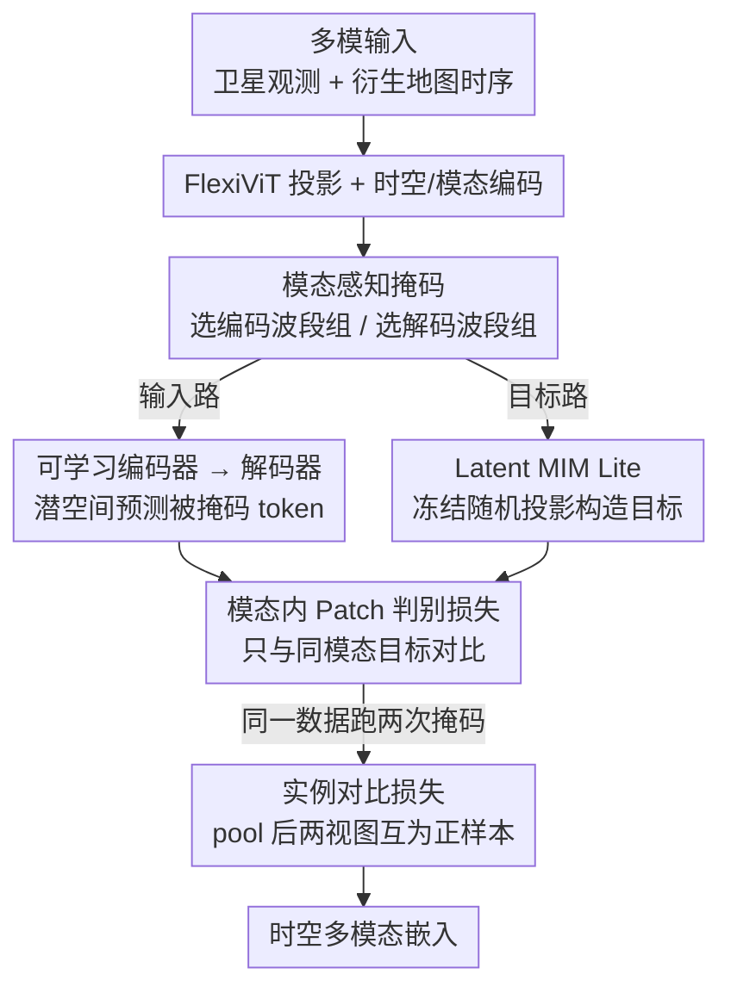

# OlmoEarth: Stable Latent Image Modeling for Multimodal Earth Observation

**会议**: CVPR 2026  
**论文**: [CVF Open Access](https://openaccess.thecvf.com/content/CVPR2026/html/Herzog_OlmoEarth_Stable_Latent_Image_Modeling_for_Multimodal_Earth_Observation_CVPR_2026_paper.html)  
**代码**: https://github.com/allenai/olmoearth_pretrain  
**领域**: 遥感 / 地球观测基础模型 / 自监督表示学习  
**关键词**: 地球观测、基础模型、潜空间掩码建模、多模态、稳定训练

## 一句话总结
OlmoEarth 用一套专为地球观测设计的自监督配方（冻结随机投影做目标编码器的 Latent MIM Lite + 模态感知掩码 + 模态内对比损失），在潜空间里稳定地训练时空多模态基础模型，在 24 个嵌入任务里 15 个、29 个微调任务里 19 个超过其他 12 个基础模型，并落地成服务公益组织的端到端平台。

## 研究背景与动机

**领域现状**：地球观测（Earth Observation, EO）数据很特殊——它像图像一样有空间结构、像视频/文本一样有时序、又天然多模态（多颗卫星 + 多种衍生图层）。近两年 EO 基础模型（Galileo、TerraMind、CROMA、Prithvi 等）在研究 benchmark 上表现亮眼，主流做法已从「像素空间重建」转向「潜空间掩码建模」。

**现有痛点**：作者在复现已有工作时反复遇到三件事——训练不稳定、表示坍缩（representation collapse）、模型实际表现远低于其宣称潜力。潜空间方法（I-JEPA、Latent MIM）特征质量好但容易崩；像素空间 MAE 稳定但特征质量受限。两头都不理想。同时这些大模型「又大又难训又贵」，公益/非营利组织根本用不起。

**核心矛盾**：稳定性与特征质量之间存在 trade-off。Latent MIM 这类方法靠一个在线更新的目标编码器（target encoder）产生预测目标，但这个动态目标正是坍缩与不稳定的根源；换成像素重建虽稳，却丢掉了潜空间建模的表达力。

**本文目标**：① 找到一个既稳定又保留潜空间表达力的训练配方；② 把 EO 的多模态特性（多卫星、多波段组、观测 vs 地图）显式编进自监督目标；③ 把模型做成开放、端到端、能让 NGO 真正用起来的平台。

**切入角度**：作者发现「随机投影」本身就能从原始输入里抽出非平凡且对预测有用的特征——既然如此，目标编码器根本不必是一个会变化、会坍缩的可学习网络，用一个冻结的随机线性投影当目标就够了。

**核心 idea**：用「冻结的随机初始化线性投影」代替「在线/动量更新的目标编码器」，在潜空间做掩码建模（Latent MIM Lite），从根上消除坍缩，再叠加针对 EO 的模态感知掩码与模态内对比损失。

## 方法详解

### 整体框架
OlmoEarth 是一个基于 ViT 的编码器-解码器架构，输入是一段「对齐好的多模态卫星图像时序 + 衍生地图」。整体一句话：把多源数据切成 token，用模态感知的方式决定谁当输入、谁当重建目标，编码器在潜空间预测被掩码的目标 token，并辅以一个实例级对比损失把全局表示拉到同一空间。

具体流程：FlexiViT 风格的投影层把像素转成 token（patch 大小可变，每个 patch×timestep×波段组产一个 token），加上 2D sincos 空间编码、正弦时间编码、可学习的模态编码。然后按模态感知掩码把 token 分成输入/目标两路：输入路过可学习编码器→解码器预测；目标路过冻结随机投影得到目标 token；两者算模态内 patch 判别损失。整个掩码+编解码跑两遍（两次不同随机掩码），把两遍 pooling 后的全局表示拿来做实例对比损失。推理时只用观测数据（不用地图）。

### 关键设计

**1. Latent MIM Lite：用冻结随机投影当目标编码器，从根上消除坍缩**

潜空间掩码建模（Latent MIM、I-JEPA）效果好但训练易崩，根因是目标编码器在线/动量更新——预测目标本身在动，模型可以靠把所有表示压成常数来「作弊」，导致坍缩。OlmoEarth 的做法是：目标编码器就是在线编码器嵌入层的一个**随机初始化并冻结**的副本，用它把被掩码的原始 patch 投到 token 空间当目标。随机投影在理论与实践上都能从原始输入抽出非平凡、对预测有意义的特征；而因为目标固定不动，自然规避了坍缩。这个设计还有个额外红利：监督数据（地图）与自监督数据（观测）能统一在同一架构下——每种模态都过同一个冻结随机投影得到目标，损失算法完全一致，不需要给监督数据单独加预测头或改训练策略。消融里这是从坍缩（PASTIS mIoU 7.9）跳到可用（35.2）的关键一步。

**2. 模态感知掩码：把任务从「补全被遮像素」改写成「从部分波段组重建缺失波段组」**

EO 数据按波段原始分辨率分成「波段组」（bandset，Landsat 2 组、Sentinel-2 3 组）。掩码策略对每个样本给每个波段组打四种标签之一：不选用 / 只编码 / 只解码 / 既编码又解码。这等于把问题从「重建同一波段组里被遮的 token」改写成「从其他波段组的部分视图重建缺失波段组」。为什么要这样改：如果所有波段组都既编码又解码，同一波段组里相邻时空的 token 高度相关、任务太简单，必须用 90% 这种极高掩码率才学得到东西；整组掩掉则把任务难度提上来，掩码率可以更均衡。另一个关键约定是**地图只能「只解码」或「不选用」、永不进编码器**——因为推理时只有观测数据可用，地图会随时间变化（下游任务往往就是在检测这种变化），所以地图只当训练目标。消融显示让地图进编码器（Encode Maps）反而掉点（m-eurosat 92.9→91.8、PASTIS 50.7→45.9），印证 decode-only 设计。

**3. 模态内 Patch 判别损失：剔除跨模态「易负样本」**

潜空间预测用的是对比式的 Patch Discrimination（而非 Smooth L1 重建），把 token 重建框成分类：让某 patch 的预测 token 与其目标 token 余弦相似、与其他 patch 的目标 token 不相似，用交叉熵对比正负匹配。问题在于 OlmoEarth 的目标 token 可能来自不同模态/不同时间步，而不同模态的 token 分布差异巨大、极易区分——这些「易负样本」数量又多，会让大量损失白白花在没难度的对比上。作者的修正很简单也很有效：**只与同一模态的目标 token 对比**，剔除跨模态易负样本，显著提升性能（消融里 m-so2sat 53.6→55.3）。

**4. 实例对比损失：让多模态 token 平均池化后仍是个合理的全局表示**

Patch 判别只作用在局部 token，但分类等任务需要全局理解。OlmoEarth 不用单个 `<CLASS>` token，而是对所有模态/时间/位置的输出 token 做平均池化得到全局表示。但不同模态 token 长得很不一样，直接平均未必合理，于是用一个 SimCLR 式的对比损失把它们拉进共同空间——不同的是，生成两个视图不靠数据增强，而靠**两次不同的随机掩码**：同一输入跑两遍掩码、各自编码池化，两个池化表示互为正样本、batch 内其余为负样本（受 micro-batch=32 限制，对比只在这 32 个样本内做）。最终该损失以 0.1 的标量权重叠加到 patch 判别损失上。消融里它带来 m-so2sat 55.3→56.8 的稳定提升。

### 损失函数 / 训练策略
总损失 = 模态内 Patch 判别损失 + 0.1 × 实例对比损失。训练用 AdamW，base lr $1\times10^{-4}$、weight decay 0.02、batch size 512（micro-batch 32）、8000 步线性 warm-up、cosine 退火到 0.1、共 667,200 步；训练中随机有效 patch 取 $\{1\dots8\}$、随机方形 crop 边长 $\{1\dots12\}$ token、时间步 3–12，单次训练约处理 1000 亿 token。四个尺寸 Nano/Tiny/Base/Large（1.4M–300M 参数，解码器深度固定 4，让编码器承担主要建模）。

## 实验关键数据

预训练数据 285,288 个样本，每个覆盖 2.56km×2.56km、跨一年（最多 12 个月度时间步），3 种卫星观测（Sentinel-1/2、Landsat-8）+ 6 种衍生地图，统一重采样到 10m/像素；采样点按 OpenStreetMap 的 120 类地物枚举、每类至多 1 万 tile。评估对比 12 个基础模型、18 个研究 benchmark + 7 家合作组织的 19 个数据集，统一用 kNN/线性探针（冻结编码器）和全量微调两种协议。

### 主实验（嵌入任务平均分，OlmoEarth Base 最高）

| 模型 | 架构 | 嵌入任务平均分 ⚠️ |
|------|------|------|
| Anysat | ViT-Base | 55.8 |
| CROMA | ViT-Base | 68.2 |
| Galileo | ViT-Base | 67.3 |
| Panopticon | ViT-Base | 65.2 |
| **OlmoEarth** | ViT-Base | **74.7** |
| OlmoEarth | ViT-Large | 73.6 |

> ⚠️ 上表「平均分」取自 Table 2 最右列，缓存为 OCR 文本、跨任务列对齐不可靠，数值以原文为准；但「OlmoEarth Base 平均最高」的结论与正文一致。总体战绩：kNN/LP 嵌入任务 15/24 最佳，全量微调 29 个任务里 19 个最佳。

### 消融实验（Table 4，Base 模型，验证集 kNN/LP，140k 步）

| 配置 | m-so2sat | m-eurosat | PASTIS | 说明 |
|------|----------|-----------|--------|------|
| Full Latent MIM* | 32.2 | 68.4 | 7.9 | 训练中坍缩 |
| Latent MIM Lite | 42.2 | 87.2 | 35.2 | 换冻结随机投影，立刻可用 |
| + 模态掩码 | 53.6 | 90.2 | 46.6 | 加模态感知掩码 |
| + 模态 Patch 判别 | 55.3 | 91.5 | 48.1 | 只对比同模态 |
| + 对比损失 | 56.8 | 92.3 | 49.0 | 加实例对比 |
| + 地图 | 62.4 | 92.9 | 50.7 | 引入监督地图（完整模型） |
| Encode Maps | 54.7 | 91.8 | 45.9 | 地图进编码器→掉点 |

### 关键发现
- **Latent MIM Lite 是命门**：标准 Latent MIM 直接坍缩（PASTIS 7.9），换成冻结随机投影后三个任务全面跃升，是整条改进链里最大的一跳。
- **地图只能当目标、不能当输入**：Encode Maps 在三个任务上一致掉点，验证 decode-only 设计。
- **Base→Large 反常缩放**：OlmoEarth Large 总体是文献里最强的大模型，但在部分逐像素时序嵌入任务上不如 Base；作者指出这不是个例（CROMA、TerraMind、DINOv3 都有 Base>Large 的现象），暗示 EO 模型扩展到 Large 存在根本性挑战。
- **落地战绩**：与 Global Mangrove Watch 合作，把红树林制图从随机森林的 95.3% F1 微调到 98.1% F1，且能按月度而非年度出图。

## 亮点与洞察
- **「随机投影即目标」是个四两拨千斤的稳定性技巧**：不引入动量编码器、不加 stop-grad 之外的复杂机制，仅靠冻结随机线性层就同时拿到稳定性与潜空间表达力，这个思路可迁移到任何受坍缩困扰的潜空间自监督场景。
- **把领域结构编进掩码而非堆数据**：波段组级的四态掩码 + 地图 decode-only，把 EO 的多传感器/观测-地图非对称性显式建模，比单纯加掩码率更优雅。
- **「易负样本」视角值得复用**：在多模态对比里，跨模态负样本太好分会稀释梯度，只对比同模态这一改动几乎零成本却稳定涨点。
- **统一监督与自监督**：所有模态走同一冻结投影、同一损失，无需为监督数据加预测头，工程上极简。

## 局限与展望
- **大模型缩放难**：Large 不稳定地优于 Base，逐像素时序任务上甚至更差，作者承认 EO 模型的尺度扩展尚未解决。
- **随机投影目标可能太简单**：作者自己指出在自然图像等更多样的域里，冻结随机投影可能过于简化；其优势目前只在 EO 数据上有实证。
- **传感器覆盖有限**：聚焦 Sentinel-1/2、Landsat 这几种高频传感器，未追求 DOFA/Panopticon 那种任意光学传感器兼容性。
- **展望**：作者计划加入气候/天气与预报数据（需处理米级到千米级、天到年的更宽分辨率范围），以及地面自然图像以支持作物类型等细粒度识别。

## 相关工作与启发
- **vs Latent MIM / I-JEPA**：同样在潜空间预测，但它们用在线/动量目标编码器、易坍缩；OlmoEarth 用冻结随机投影换稳定，是「Lite」版。
- **vs Galileo / TerraMind**：它们也用监督+自监督数据，但把监督地图当**输入**喂编码器；OlmoEarth 把地图限制为**只解码目标**，理论上简化了编码器的学习负担，多数任务上更优。
- **vs TerraMind（避坍缩方案）**：TerraMind 靠预训练好的量化自编码器当冻结 tokenizer 避免不稳定；OlmoEarth 更轻——直接用随机投影，不需要先训一个 tokenizer。
- **vs AEF / TESSERA（预算嵌入）**：预算化嵌入只能做年度预测、灵活性差；OlmoEarth 嵌入匹配或超过 AEF，且全量微调还能更好。

## 评分
- 新颖性: ⭐⭐⭐⭐ 冻结随机投影当目标的「Latent MIM Lite」简洁有力，但单个组件多是已有思路的巧妙组合与领域适配。
- 实验充分度: ⭐⭐⭐⭐⭐ 对比 12 个模型、37+ 个任务、双协议评估，外加真实合作组织数据与环境影响核算，非常扎实。
- 写作质量: ⭐⭐⭐⭐ 动机与消融讲得清楚，但大量结果表在 PDF 里密度极高、可读性一般。
- 价值: ⭐⭐⭐⭐⭐ 开源代码/权重/数据 + 端到端平台，已被多家公益组织用于红树林/生态/粮食安全，实际影响大。

<!-- RELATED:START -->

## 相关论文

- [\[CVPR 2026\] RAMEN: Resolution-Adjustable Multimodal Encoder for Earth Observation](ramen_resolution-adjustable_multimodal_encoder_for_earth_observation.md)
- [\[CVPR 2026\] NeighborMAE: Exploiting Spatial Dependencies between Neighboring Earth Observation Images in Masked Autoencoders Pretraining](neighbormae_exploiting_spatial_dependencies_between_neighboring_earth_observatio.md)
- [\[ICLR 2026\] Earth-Agent: Unlocking the Full Landscape of Earth Observation with Agents](../../ICLR2026/remote_sensing/earth-agent_unlocking_the_full_landscape_of_earth_observation_with_agents.md)
- [\[CVPR 2026\] UniChange: Unifying Change Detection with Multimodal Large Language Model](unichange_unifying_change_detection_with_multimodal_large_language_model.md)
- [\[ICML 2025\] High-Resolution Live Fuel Moisture Content (LFMC) Maps for Wildfire Risk from Multimodal Earth Observation Data](../../ICML2025/remote_sensing/high-resolution_live_fuel_moisture_content_lfmc_maps_for_wildfire_risk_from_mult.md)

<!-- RELATED:END -->
