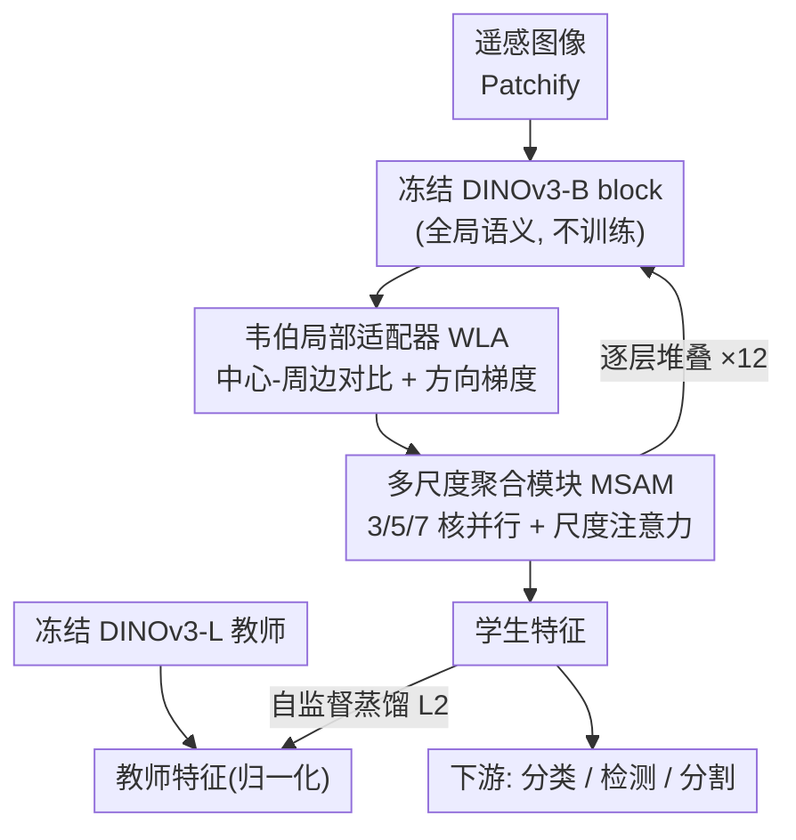

# ORSATR-X: A Foundation Model based on Differential-and-Excitation Networks for Optical Remote Sensing Object Recognition

**会议**: CVPR 2026  
**论文**: [CVF Open Access](https://openaccess.thecvf.com/content/CVPR2026/html/Mo_ORSATR-X_A_Foundation_Model_based_on_Differential-and-Excitation_Networks_for_Optical_CVPR_2026_paper.html)  
**代码**: https://github.com/Ayniiii/ORSATR-X  
**领域**: 遥感基础模型 / 目标识别  
**关键词**: 遥感基础模型, DINOv3, 韦伯局部对比, 多尺度聚合, 自监督蒸馏

## 一句话总结
ORSATR-X 把冻结的 DINOv3 当骨干，在每个 Transformer block 旁挂一条侧适配器——用受韦伯定律启发的局部对比模块（WLA）放大低对比目标的边界、用多尺度聚合模块（MSAM）应对遥感物体的极端尺度差异，并用 DINOv3-L 蒸馏只训练这些适配器，在场景分类/检测/分割三类任务上达到单模态遥感基础模型 SOTA（DIOR-R 上 75.30% mAP50，超过用 21M 数据预训练的 SkySense V2）。

## 研究背景与动机
**领域现状**：遥感基础模型（RSFM）的主流路线是在多源遥感数据上做大规模自监督预训练（如 SkySense 用 21M 图像、RingMoE 用 0.4B）。但遥感影像采集成本极高，凑不到自然图像那种十亿级规模，于是一条更省的路是直接拿自然图像上预训练好的基础模型（SAM、DINO）来微调适配遥感任务。DINOv3 在自然图像和遥感任务上都展示了很强的迁移性，自然成了候选骨干。

**现有痛点**：作者先做了一组诚实的基准实验——直接微调 DINOv3 确实能打平近期 SOTA，但这种"直接微调"忽略了遥感数据的根本域偏移。遥感影像里目标的边缘和纹理常被复杂背景（阴影、植被）压制：在高对比场景里 DINOv3 检车很准，可一旦车辆和阴影/植被在视觉上"糊"成一片（低对比场景），它就会大量漏检、误检（论文 Fig.1）。

**核心矛盾**：DINOv3 的强项是**全局自注意力**带来的语义表征，但全局注意力对**局部边界对比**不敏感——它会把低对比目标的细微边界响应淹没掉。而遥感恰恰最缺的就是这种对局部对比、方向性边缘、跨尺度的感知能力。

**本文目标**：在不丢掉 DINOv3 通用表征、又不需要大规模遥感预训练的前提下，把"对低对比边界 + 极端尺度变化的感知"显式补回来。

**切入角度**：既然全局注意力天生不擅长局部对比，那就不去动骨干，而是**并联一条专门做局部对比的侧通路**。低对比的本质是"目标相对背景的相对亮度差很小"，这正好对应视觉系统的中心-周边拮抗机制和韦伯定律（感知取决于相对差异而非绝对强度）。

**核心 idea**：冻结 DINOv3 骨干，在每个 block 旁插入"韦伯局部适配器 + 多尺度聚合"侧网络，用可学习的差分卷积核显式编码中心-周边对比与方向梯度，再用 DINOv3-L 蒸馏只训练这些轻量适配器——用最小的训练代价把遥感专属归纳偏置注入一个通用大模型。

## 方法详解

### 整体框架
ORSATR-X 的骨架是一个**冻结的 DINOv3-B**（12 层 ViT），输入遥感图像 patchify 后逐层前向。关键改造是：每一个 DINOv3 block 后面串接两个可训练子模块——先过 **WLA**（韦伯局部适配器）增强局部对比/方向边界，再过 **MSAM**（多尺度聚合模块）整合不同尺度上下文。也就是说，每个"适配块"是 `冻结 DINOv3 block → WLA → MSAM` 的顺序结构，骨干参数全程冻结，只有 WLA/MSAM 被优化。

训练阶段不依赖大规模遥感预训练，而是用**自监督蒸馏**：以 DINOv3-L 为教师、适配器增强的 DINOv3-B 为学生，让学生的逐 token 特征去对齐（L2）教师归一化后的特征，从而把适配器"训"出遥感专属归纳偏置。预训练完成后，再在各下游任务（分类/检测/分割）上微调评测。

### 关键设计

**1. 韦伯局部适配器 WLA：用差分卷积核显式放大低对比目标的边界**

这一模块直接针对"DINOv3 全局注意力丢掉低对比边界"的痛点。它和自注意力**并联**运行，专门做局部结构增强而不破坏骨干的全局表征，内部由两条互补分支 + 自适应融合组成。

*中心-周边对比分支*：受视网膜中心-周边感受野启发，设计一个可学习的深度卷积核 $\mathbf{K}_{cs}^i \in \mathbb{R}^{C \times 1 \times 3 \times 3}$，**固定中心权重为 −1、周边权重可学**，从而强制形成拮抗结构，输出 $\mathbf{F}_{cs}^i = \alpha^i \cdot \text{DWConv}(\mathbf{F}_i; \mathbf{K}_{cs}^i)$（$\alpha^i$ 可学缩放）。这样编码的是**相对对比**而非绝对强度，正是韦伯定律的核心——所以对背景明暗不敏感、对边界敏感。更巧的是，受早期视觉系统"亮度增/减由不同神经通路处理"启发，作者把对比响应拆成正负两支 $\mathbf{F}_{cs}^{i,+}=\text{ReLU}(\mathbf{F}_{cs}^i)$、$\mathbf{F}_{cs}^{i,-}=\text{ReLU}(-\mathbf{F}_{cs}^i)$，各自经 $1\times1$ 卷积投影到 $C/2$ 通道再拼接。这显式建模了"目标可能比背景亮、也可能比背景暗"两种极性——遥感里这两种情况都常见。

*方向梯度分支*：用反对称核 $\mathbf{K}_h$、$\mathbf{K}_v$（水平/垂直梯度，权重 $[w_1,w_2,w_3]$ 可学）捕捉道路、建筑这类线状/矩形结构，梯度特征拼接后经 $1\times1$ 卷积融合为 $\mathbf{F}_{\text{grad}}^i$。

*自适应分支融合*：城市结构化场景里方向梯度更重要、自然均质区域里各向同性对比更重要，所以用一个通道-空间注意力动态加权两支：对拼接特征做均值/最大池化得到 $\mathbf{S}^i$，经 $7\times7$ 卷积 + sigmoid 生成两组空间掩码 $\mathbf{A}_1^i, \mathbf{A}_2^i$，融合为 $\mathbf{F}_{\text{fused}}^i = \mathbf{A}_1^i \odot \mathbf{F}_{\text{polar}}^{i,r} + \mathbf{A}_2^i \odot \mathbf{F}_{\text{grad}}^{i,r}$。最后以**乘性调制**回注骨干：$\mathbf{F}_{\text{WLA}}^i = \mathbf{F}_i \odot \mathcal{W}_{\text{out}}^i(\mathbf{F}_{\text{fused}}^i)$，既凸显局部结构又保住原特征完整性、稳定梯度流。

**2. 多尺度聚合模块 MSAM：补上 WLA 留下的"局部到全局"尺度缺口**

WLA 抓的是细粒度局部模式，但遥感物体尺度差异极大（小车 vs 大型设施），单一分辨率不够，这正是 MSAM 要填的空。它对 WLA 输出 $\mathbf{F}_{\text{WLA}}^i$ 用 $k \in \{3,5,7\}$ 的并行深度卷积分别抓细粒度、中尺度、大尺度上下文。由于不同场景需要的尺度重点不同，作者引入**尺度注意力**自适应加权：$\mathbf{w}_s^i = \text{Softmax}(\mathcal{G}^i(\text{GAP}(\mathbf{F}_{\text{WLA}}^i)))$（$\mathcal{G}$ 是带通道压缩比 4 的轻量 MLP），加权求和得 $\mathbf{F}_{\text{scale}}^i = \sum_{k} \mathbf{w}_s^{i,(k)} \odot \mathbf{F}_k^i$。再叠一层像素级空间注意力 $\mathbf{A}_{\text{spatial}}^i = \sigma(\mathcal{H}^i(\mathbf{F}_{\text{scale}}^i))$ 精修，并用**双残差**保证稳定训练：第一条残差稳住多尺度聚合，第二条把结果稳定注入冻结骨干，即 $\mathbf{F}_{\text{att}}^i = \mathbf{A}_{\text{spatial}}^i \odot \mathbf{F}_{\text{scale}}^i + \mathbf{F}_{\text{WLA}}^i$，$\mathbf{F}_{\text{MSAM}}^i = \text{GELU}(\text{LN}(\mathcal{P}^i(\mathbf{F}_{\text{att}}^i))) + \mathbf{F}_{\text{WLA}}^i$。

**3. 自监督蒸馏：用适配器当"选择性特征滤波器"，只训练侧网络而不动骨干**

为了不依赖大规模遥感预训练就把适配器学好，作者用 DINOv3-L 当教师、适配器增强的 DINOv3-B 当学生做蒸馏。和"无差别照搬教师所有表征"的传统蒸馏不同，这里的关键观点是：**WLA/MSAM 充当可学习的特征滤波器，在知识迁移过程中选择性放大与遥感相关的模式**——教师提供通用视觉语义，适配器负责精炼遥感专属归纳偏置，二者协同。目标函数是逐 token 特征的归一化 L2：$\mathcal{L}_{\text{distill}} = \frac{1}{N}\sum_{i=1}^{N} \left\| \mathbf{f}_i^{s} - \frac{\mathbf{f}_i^{t}}{\|\mathbf{f}_i^{t}\|_2} \right\|_2^2$，其中 $\mathbf{f}_i^s$、$\mathbf{f}_i^t$ 是学生/教师的第 $i$ 个 token 特征。这样既保住了 DINOv3 的表征能力，又以极小训练代价注入了域感知增强。

### 损失函数 / 训练策略
- 预训练数据集：Million-AID（约 1M 样本），仅单模态光学影像。
- 硬件：8×A100，预训练与微调同一套配置。
- 训练目标：上式逐 token 归一化 L2 蒸馏损失，骨干（DINOv3-B）全程冻结，只优化 WLA/MSAM 参数。
- 一个细节：作者发现**逐层（layer-wise）**插适配器比**逐块（block-wise）**更好（消融 Tab.4c：74.64 vs 74.42），因为更细粒度的特征提取对任意朝向、复杂背景的遥感目标更有利。

## 实验关键数据

### 主实验
三类下游任务统一设置评测，骨干均为 ViT-B（单模态、仅 1M 预训练数据），括号内为相对各自 baseline（直接微调 DINOv3-B）的增益。

| 任务 / 数据集 | 指标 | Baseline (DINOv3-B) | ORSATR-X | 对照 SOTA |
|---|---|---|---|---|
| 场景分类 RESISC-45 (TR=20%) | Acc | 96.03 | **96.33** (+0.30) | SkySense V2 97.24 (21M 多模态) |
| 场景分类 AID (TR=20%) | Acc | 96.53 | **97.07** (+0.54) | RVSA 97.03 |
| 水平检测 DIOR | mAP50 | 79.70 | **80.20** (+0.50) | MTP(ViT-L+RVSA) 81.10 |
| 旋转检测 DIOR-R | mAP50 | 74.64 | **75.30** (+0.66) | SkySense V2 75.29 (21M) / MTP 74.54 |
| 语义分割 Potsdam | mF1 | 91.13 | **91.36** (+0.23) | SkySense V2 95.86 (21M) |

亮点是 DIOR-R 旋转检测：ORSATR-X 在**单模态**下达到 75.30%，超过 MTP +0.76%、BFM +1.68%，甚至略超用 21× 数据的多模态 SkySense V2（75.29%）。作者把这归功于 WLA 保住了对角度估计至关重要的方向性边缘线索（频谱分析显示明显的十字形正交分量）。

### 消融实验
所有消融在 DIOR-R 上、同一设置。

| 配置 | DIOR-R mAP50 | 凸包面积 | 类内距 | 有效维度 | 说明 |
|---|---|---|---|---|---|
| Baseline | 74.64 | 8,214 | 29.73 | 14.23 | 直接微调 DINOv3-B |
| + WLA | 74.97 | 41,387 | 56.18 | 14.41 | 仅加韦伯局部适配器 |
| + MSAM | 74.81 | 138,752 | 175.64 | 13.78 | 仅加多尺度聚合 |
| + WLA + MSAM | 75.05 | – | – | – | 两者互补 |
| Full（+ 蒸馏预训练） | **75.30** | 147,293 | 215.42 | 12.35 | 完整模型 |

按尺度拆分（Tab.4b）：WLA+MSAM 相对 baseline 在小目标 +2.47%（21.24→23.71）、中目标 +0.96%、大目标 +2.27%，对极端尺度变化的鲁棒性得到验证。适配方式对比（Tab.4d）：WLA 全面优于标准卷积，且在小目标上增益最明显（23.31 vs 21.83）。

### 关键发现
- **WLA 与 MSAM 互补**：WLA 增强局部判别模式、MSAM 跨尺度整合，单独加各涨一点，合起来 75.05，再叠遥感专属蒸馏到 75.30——三者层层叠加都有正贡献。
- **特征空间"扩张但更聚焦"**：从 baseline 到完整模型，PCA 凸包面积涨 17.9×（特征更多样），但有效维度从 14.2 降到 12.4（沿更少主方向聚集）。作者解读为：架构改进让特征沿**任务相关子空间**展开、同时压制无关变化，而非无差别膨胀。⚠️ 这是作者基于 PCA 可视化指标的解释，具体计算公式在附录，以原文为准。
- **小目标受益最大**：WLA 对小目标增益最显著，印证韦伯定律启发的对比编码比常规卷积更贴合遥感感知特性。
- **分割增益最小**（仅 +0.23）：作者承认当前预训练偏 patch 级语义，天然更契合图像级/物体级任务，密集预测还有提升空间。

## 亮点与洞察
- **把神经科学先验"工程化"成可学习卷积核**：中心权重固定 −1 模拟中心-周边拮抗、正负极性拆分对应亮度增减双通路、反对称核做方向梯度——这些都是把生物视觉机制落成了具体、可训练的算子，而不是空喊"受启发"，很有借鉴价值。
- **"骨干冻结 + 侧适配器 + 蒸馏"是低成本注入域偏置的范式**：不重训大模型、只训轻量适配器，就把通用基础模型改造成遥感专家，对任何"想用大模型但缺领域数据"的场景都可迁移。
- **互补性设计讲得清楚**：WLA 管"局部对比/边界"、MSAM 管"跨尺度"，两者职责不重叠且消融可见互补，这种"先想清楚每个模块补哪块短板再设计"的思路值得学。
- **诚实的负面信号也保留**：分割只涨 0.23 没有藏，反而用来指出未来方向，写作上比较可信。

## 局限与展望
- 作者承认的局限：分割任务增益明显偏小，当前预训练策略偏 patch 级语义，对密集像素级预测帮助有限；建议未来引入多尺度特征学习或像素级目标。
- 自己发现的局限：① 在场景分类/分割上离 SkySense V2 这类 21M 多模态模型仍有差距（RESISC-45 差 0.91%、Potsdam 差约 4.5 个点），单模态 + 1M 数据的天花板还是存在；② 相对各自 baseline 的绝对增益普遍较小（+0.2~0.66），核心卖点更多是"在 DIOR-R 旋转检测上以小博大超过大数据模型"，是否能泛化到更多任务存疑；③ WLA/MSAM 的设计针对光学影像的对比/边缘特性，对 SAR 等其他模态是否同样有效未验证。
- 改进思路：把侧适配器思路扩到多模态预训练；为分割补像素级蒸馏目标；验证差分卷积核在 SAR/红外上的迁移性。

## 相关工作与启发
- **vs 大规模预训练 RSFM（SkySense / SkySense V2 / RingMoE）**：它们靠 21M~0.4B 多模态数据堆出强表征，本文反其道——冻结通用骨干 + 轻量适配器 + 1M 单模态数据，核心优势是**数据/算力高效**，且在 DIOR-R 旋转检测上反超 SkySense V2，劣势是分类/分割整体仍落后。
- **vs 自然图像基础模型微调遥感（SAM/DINO 系微调、MTP）**：它们多是"直接微调"或加通用适配器，本文指出直接微调忽略了遥感低对比/尺度域偏移，用 WLA/MSAM 显式针对这两点设计；相比 MTP（ViT-L+RVSA）用更重骨干，本文用 ViT-B 在 DIOR-R 上还更高，体现适配优于单纯堆架构。
- **vs MIM 类遥感自监督（Scale-MAE / SatMAE++ / MA3E）**：它们靠掩码重建 + 多尺度策略从头学，本文不重训而走蒸馏路线，把适配器当"选择性特征滤波器"迁移教师语义，训练代价更低。

## 评分
- 新颖性: ⭐⭐⭐⭐ 把韦伯定律/中心-周边拮抗工程化成可学习差分卷积核、并联进冻结 DINOv3，角度新颖且落地具体。
- 实验充分度: ⭐⭐⭐⭐ 三任务 + 多组消融 + 特征空间分析较完整，但部分增益偏小、未覆盖多模态泛化。
- 写作质量: ⭐⭐⭐⭐ 动机—机制对应清楚，公式与频谱/PCA 分析支撑到位，负面结果也诚实保留。
- 价值: ⭐⭐⭐⭐ "冻结大模型 + 轻量域适配器 + 蒸馏"是低成本注入领域先验的可复用范式，对遥感及其他数据稀缺领域有参考意义。

<!-- RELATED:START -->

## 相关论文

- [\[CVPR 2026\] VLM4RSDet: Collaborative Optimization with Vision-Language Model for Enhancing Remote Sensing Object Detection](vlm4rsdet_collaborative_optimization_with_vision-language_model_for_enhancing_re.md)
- [\[CVPR 2026\] MM-OVSeg: Multimodal Optical-SAR Fusion for Open-Vocabulary Segmentation in Remote Sensing](mm-ovseg_multimodal_optical-sar_fusion_for_open-vocabulary_segmentation_in_remot.md)
- [\[NeurIPS 2025\] GeoLink: Empowering Remote Sensing Foundation Model with OpenStreetMap Data](../../NeurIPS2025/remote_sensing/geolink_empowering_remote_sensing_foundation_model_with_openstreetmap_data.md)
- [\[CVPR 2026\] Rotation Invariant and Symmetry Aware Pixel Difference Network for Remote Sensing Object Detection](rotation_invariant_and_symmetry_aware_pixel_difference_network_for_remote_sensin.md)
- [\[ICCV 2025\] SkySense V2: A Unified Foundation Model for Multi-Modal Remote Sensing](../../ICCV2025/remote_sensing/skysense_v2_a_unified_foundation_model_for_multi-modal_remote_sensing.md)

<!-- RELATED:END -->
