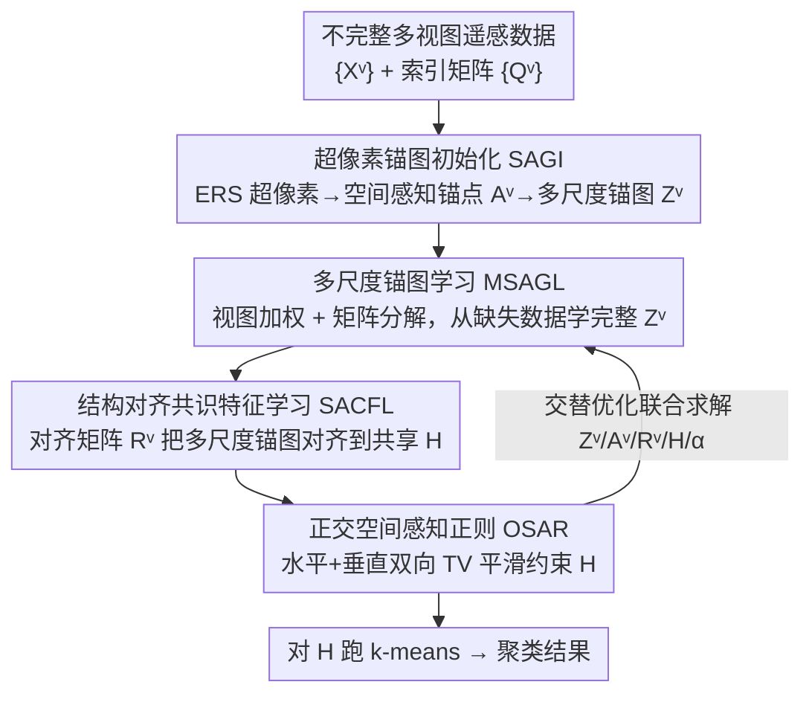

# Orthogonal Spatial-Aware Multi-View Anchor Graph Clustering for Incomplete Remote Sensing Data

**会议**: CVPR 2026  
**论文**: [CVF Open Access](https://openaccess.thecvf.com/content/CVPR2026/html/Zhang_Orthogonal_Spatial-Aware_Multi-View_Anchor_Graph_Clustering_for_Incomplete_Remote_Sensing_CVPR_2026_paper.html)  
**代码**: https://github.com/ZhangYongshan/OSMAGC  
**领域**: 遥感 / 多视图聚类  
**关键词**: 多视图聚类, 不完整数据, 锚图学习, 遥感, 谱-空结构

## 一句话总结
针对"某些视图存在缺失像素"的不完整遥感多视图聚类这一全新场景，OSMAGC 用超像素初始化多尺度空间感知锚图，再把多尺度锚图学习、结构对齐共识特征学习、正交空间感知正则三者统一进一个目标函数交替优化，在四个遥感数据集、各缺失比例下全面超越 SOTA 且速度最快。

## 研究背景与动机

**领域现状**：遥感数据天然有多种表征——同一区域可同时被高光谱（HS）、多光谱（MS）、合成孔径雷达（SAR）、数字表面模型（DSM）等多种传感器观测，或从单传感器抽取纹理/轮廓等多种描述子。多视图聚类利用这些跨视图的一致性与互补性，在无标注的情况下把像素划分成地物类别，已成为遥感场景理解的主流无监督手段。

**现有痛点**：几乎所有现有遥感多视图聚类方法（FPFC、SAMVGC 等）都默认**每个像素在所有视图里都被完整观测到**。但现实中传感器故障、云层遮挡会让某些视图缺失一部分像素（论文 Figure 1），一旦遇到这种不完整数据，这些方法性能急剧下滑。另一方面，通用领域的不完整多视图聚类方法（靠插补 / 图重建 / 矩阵分解补全）虽能处理缺失，却**不针对遥感数据的谱-空结构**，效果同样很差。

**核心矛盾**：不完整遥感聚类要同时解决三件互相牵扯的事——(1) 各视图谱信息异构，怎么跨缺失视图利用互补信息；(2) 地物表征跨视图存在本质一致性，缺失时怎么抓住这种共识；(3) 单视图内的缺失会破坏空间连续性、引入跨视图不一致，怎么保证空间-光谱的连续平滑。现有工作要么只顾缺失补全、要么只顾遥感结构，没有把两者揉在一起。

**本文目标**：提出第一个**专为遥感数据设计的不完整多视图聚类**框架，把"缺失补全"和"谱-空结构利用"统一起来。

**切入角度**：作者注意到遥感数据的空间纹理是锚图初始化的关键，而锚图（只建模"样本-锚点"关系而非全像素相似度矩阵）天生适合不完整、大规模场景——既高效又可扩展。于是用超像素纹理为每个视图量身定制不同尺度的锚图，在锚图层面做补全与对齐。

**核心 idea**：用**视图加权矩阵分解**从不完整数据里学出完整的多尺度锚图，再把这些锚图**结构对齐**到共享隐空间得到共识特征，最后施加**水平+垂直双向的正交空间感知正则**保证空间平滑——三个模块联合交替优化、互相增强。

## 方法详解

### 整体框架

OSMAGC 输入是 $V$ 个视图的不完整遥感数据 $\{X^v\}_{v=1}^V$（第 $v$ 视图 $X^v \in \mathbb{R}^{B_v \times N}$，$N=H\times W$ 个像素、$B_v$ 个光谱通道），缺失模式跨视图各不相同，用索引矩阵 $Q^v$ 标记每个视图里可用的像素；输出是把 $N$ 个像素划分到 $C$ 个地物类别。整条流水线分四个模块：先用超像素为每个视图初始化空间感知锚点和多尺度锚图（SAGI，预处理），然后三个核心模块——多尺度锚图学习（MSAGL）从缺失数据里学完整锚图、结构对齐共识特征学习（SACFL）把多尺度锚图对齐进共享隐空间 $H$、正交空间感知正则（OSAR）约束 $H$ 的空间平滑——被合进一个统一目标函数，用交替优化算法**相互增强地**联合求解，最后对共识特征 $H$ 跑 k-means 出聚类结果。

### 关键设计

**1. SAGI 超像素锚图初始化：用各视图纹理量身定制多尺度锚图**

痛点是各视图谱信息异构、空间纹理各不相同，若给所有视图都用同样大小、同样拓扑的锚图，就抹掉了视图特性。SAGI 对每个视图图像的第一主成分单独跑 ERS（熵率超像素）分割，按空间纹理切出 $M_v$ 个超像素——这个数量逐视图自适应，所以是"多尺度"。每个超像素内所有像素求平均得到一个空间感知锚点，组成 $A^v=\{a_1^v,\dots,a_{M_v}^v\}\in\mathbb{R}^{B_v\times M_v}$。锚图 $Z^v\in\mathbb{R}^{M_v\times N}$ 逐列构造，每列描述一个像素与其近邻锚点的关系：

$$z_{ij}^v=\begin{cases}\dfrac{d_{k+1,j}^v-d_{ij}}{k\,d_{k+1,j}^v-\sum_{i=1}^{k}d_{ij}^v},&\forall i\in\Phi_j\\[2mm]0,&\text{otherwise}\end{cases}$$

其中 $\Phi_j$ 是像素 $x_j^v$ 的 $k$ 个最近锚点集合，$d_{ij}=\|x_j^v-a_i^v\|_2$ 是像素到锚点的欧氏距离。这样初始化出来的锚图同时带了空间和光谱信息、能捕获视图间异构性，给后续学习一个高质量起点。消融里去掉 SAGI（改用 k-means 生成锚点）在 MDAS 上掉点最多，说明这个纹理驱动的初始化很关键。

**2. MSAGL 多尺度锚图学习：视图加权矩阵分解，从缺失里补出完整锚图**

痛点是初始化的锚图基于不完整数据、且各视图信息量不等。MSAGL 在初始化的多尺度锚点/锚图基础上做矩阵分解式学习，并引入自适应视图权重突出信息量大的视图、压制信息量小的视图：

$$\min_{A^v,Z^v,\alpha}\sum_{v=1}^{V}\frac{1}{\alpha^v}\|X^vQ^v-A^vZ^vQ^v\|_F^2,\quad \text{s.t. } Z^v\ge 0,\ Z^{v\top}\mathbf{1}=\mathbf{1},\ A^{v\top}A^v=I,\ \alpha^{\top}\mathbf{1}=1,\ \alpha^v>0$$

这里 $Z^vQ^v$ 只在**可用像素** $X^vQ^v$ 上计算重构误差，从而绕过缺失项；$\frac{1}{\alpha^v}$ 衡量第 $v$ 视图的贡献，重构误差大（信息脏）的视图自动获得小权重。锚点矩阵 $A^v$ 上的正交约束 $A^{v\top}A^v=I$ 保证锚点基不退化。这一步把"补全"做在了低维锚图层面而非原始高维像素上，既高效又可扩展。

**3. SACFL 结构对齐共识特征学习：对齐矩阵把多尺度锚图拉进同一隐空间**

痛点是各视图锚图尺度不同（$M_v$ 各异），没法直接拼成统一图表示，而显著的结构不一致又让共识特征难以在共享隐空间里抽取。SACFL 为每个视图引入一个对齐矩阵 $R^v\in\mathbb{R}^{D\times M_v}$（带正交约束 $R^{v\top}R^v=I$），把不同尺度的锚图 $Z^v$ 投到统一的 $D$ 维，再逼近一个所有视图共享的共识表示 $H\in\mathbb{R}^{D\times N}$：

$$\min_{R^v,H}\sum_{v=1}^{V}\|R^vZ^v-H\|_F^2,\quad \text{s.t. } R^{v\top}R^v=I$$

$H$ 聚合了所有视图多尺度锚图里的判别信息。关键在于它用"结构对齐 + 共识特征"两条腿同时走，既保留了视图特异的多尺度结构，又能融出统一表征。消融里 MUUFL 对去掉 SACFL 最敏感。

**4. OSAR 正交空间感知正则：水平+垂直双向 TV 约束保空间连续**

痛点是缺失会破坏空间连续性，让相邻像素本应相似的语义被打乱。遥感图里相邻像素往往属于同一地物，这个先验该体现在共识特征 $H$ 上。OSAR 用 total variation（TV）正则，在水平、垂直两个方向对相邻像素求有限差分、压制突变但保留纹理边界：

$$R(H)=\sum_{d=1}^{D}\sum_{\{i,j\}\in\mathcal{N}}\|h_d^i-h_d^j\|_2^2=\|D_xH^{\top}\|_F^2+\|D_yH^{\top}\|_F^2$$

其中 $\mathcal{N}=\mathcal{N}_x\cup\mathcal{N}_y$ 分别是水平、垂直近邻集，$D_x,D_y$ 是两方向的前向有限差分算子。这一项让 $H$ 在空间上平滑连续，从而修复缺失造成的破碎。它是"正交空间感知"里"空间感知"的来源，而"正交"来自前面 $A^v$、$R^v$ 的正交约束。

把上面三式（MSAGL 的式(2) + SACFL 的式(3) + OSAR 的式(5)）合在一起就是整体目标：

$$\min_{Z^v,A^v,R^v,H,\alpha}\sum_{v=1}^{V}\frac{1}{\alpha^v}\|X^vQ^v-A^vZ^vQ^v\|_F^2+\lambda\sum_{v=1}^{V}\|R^vZ^v-H\|_F^2+\gamma\big(\|D_xH^{\top}\|_F^2+\|D_yH^{\top}\|_F^2\big)$$

$\lambda,\gamma$ 是平衡三个模块的折中系数。三模块写进一个目标函数而非分开做，是为了避免割裂导致的次优。

### 损失函数 / 训练策略

由于变量带正交、单纯形等约束，作者设计了**交替优化**算法逐个更新、其余固定（Algorithm 1）：
- **更新 $Z^v$**：逐列退化成带 $z_j^v\ge 0,\ z_j^{v\top}\mathbf{1}=1$ 约束的 capped-simplex 投影问题，闭式高效求解，其中 $S^v=Q^vQ^{v\top}$。
- **更新 $A^v$**：变成 $\max_{A^v}\mathrm{Tr}(A^{v\top}M^v)$（$M^v=X^vS^vZ^{v\top}$），最优解 $A^v=U^vV^{v\top}$ 由 $M^v$ 的 SVD 给出。
- **更新 $R^v$**：同形式 $\max_{R^v}\mathrm{Tr}(R^{v\top}B^v)$（$B^v=HZ^{v\top}$），用 rank-$D$ 截断 SVD 求。
- **更新 $H$**：闭式解 $H=\dfrac{\lambda\sum_{v=1}^{V}R^vZ^v}{\lambda V I+\gamma D}$，其中 $D=D_x^{\top}D_x+D_y^{\top}D_y$。
- **更新视图权重 $\alpha$**：由 Cauchy-Schwarz 不等式得 $\alpha^v=\dfrac{e^v}{\sum_{v=1}^{V}e^v}$，$e^v=\|X^vQ^v-A^vZ^vQ^v\|_F^2$，即重构误差越大权重越小。

复杂度分析显示空间和每轮时间复杂度对样本数 $N$ 都近似线性（因 $M_v,B_v,D\ll N$），这也解释了它为何最快。

## 实验关键数据

四个遥感数据集 MUUFL（2 视图）、Berlin（2 视图）、Augsburg（3 视图）、MDAS（4 视图），缺失比例 0.1~0.9。对比 8 个 SOTA：前四个是遥感专用多视图聚类（FPFC/AMKSC/MSSAGF/SAMVGC），后四个是通用不完整多视图聚类（SIMVC-SA/DIVIDE/ASCR/PMIMC）。指标 ACC/NMI/Purity/ARI，各跑 10 次取均值。

### 主实验（0.5 缺失比例下的 ACC，节选）

| 数据集 | FPFC | SAMVGC | SIMVC-SA | ASCR | 本文 OSMAGC | ACC 提升 |
|--------|------|--------|----------|------|------|------|
| MUUFL | 0.3410 | 0.3279 | 0.3999 | 0.4036 | **0.5002** | +9.66% |
| Berlin | 0.4010 | 0.3928 | 0.3649 | 0.4015 | **0.4410** | +3.95% |
| Augsburg | 0.6009 | 0.4550 | 0.4923 | 0.4962 | **0.6120** | +1.11% |
| MDAS | 0.4171 | 0.3804 | 0.3480 | 0.3823 | **0.4345** | +1.74% |

OSMAGC 在四个数据集、ACC/NMI/Purity/ARI 全部指标上一致最优。在 0.3 缺失比例下，MUUFL 上四个指标比次优分别高 5.00%/3.61%/4.63%/11.64%；缺失升到 0.7 时仍保持 6.78%/2.82%/3.28%/2.86% 的 ACC 领先，鲁棒性强。

### 运行时间（0.5 缺失，秒）

| 方法 | MUUFL | Berlin | Augsburg | MDAS |
|------|-------|--------|----------|------|
| SAMVGC | 145.07 | 145.92 | 52.56 | 169.79 |
| DIVIDE | 1735.34 | 1809.31 | 2548.46 | 1277.68 |
| PMIMC | 1890.5 | OOM | 19744.62 | 20084.99 |
| **本文** | **14.01** | **68.38** | **31.6** | **14.78** |

OSMAGC 是全场最快，比第二快还分别省 2.18/3.08/5.66/5.9 秒——又准又快，印证了近线性复杂度的分析。

### 消融实验（0.5 缺失下的 ACC）

| 配置 | MUUFL | Berlin | Augsburg | MDAS | 说明 |
|------|-------|--------|----------|------|------|
| V1 (w/o SAGI) | 0.4591 | 0.4129 | 0.5325 | 0.3220 | 改 k-means 生成锚点 |
| V2 (w/o MSAGL) | 0.4713 | 0.4281 | 0.5530 | 0.4240 | 各视图同一超像素尺度 |
| V3 (w/o SACFL) | 0.4463 | 0.4355 | 0.5249 | 0.3360 | 对齐矩阵固定 |
| V4 (w/o OSAR) | 0.4661 | 0.4375 | 0.5689 | 0.4211 | 去掉空间正则 |
| **完整模型** | **0.5002** | **0.4410** | **0.6120** | **0.4345** | — |

### 关键发现
- 四个模块各有所长、贡献依数据集而异：MDAS 对去掉 SAGI（V1）最敏感、Augsburg 对去掉 MSAGL（V2）掉得最多、MUUFL 对去掉 SACFL（V3）最敏感、Berlin 去掉 OSAR（V4）只小幅下滑。说明这套"自适应重要性"恰好能覆盖不同复杂度的数据。
- 视图加权 $\alpha$ 让脏视图自动降权，是处理跨视图异构缺失的核心机制之一。
- 超像素数量、$\lambda$、$\gamma$ 均存在数据相关的甜区：MUUFL 超像素越多越稳、Berlin 反而偏好少超像素；$\gamma$ 适中时两数据集都最优，过大会破坏判别性。

## 亮点与洞察
- **第一个针对遥感的不完整多视图聚类**：把"缺失补全"和"谱-空结构利用"这两条此前各管各的线第一次拧成一股，填了真实场景（传感器故障/云遮挡）的空白。
- **把补全做在锚图层面而非像素层面**：$Z^vQ^v$ 只对可用像素算重构，既绕开缺失又把计算量压到近线性——这是"又准又快"的根因，思路可迁移到任何大规模不完整图聚类。
- **多尺度 + 对齐矩阵的组合很巧**：允许各视图保留自己的锚图尺度（尊重异构性），再用正交对齐矩阵 $R^v$ 投到共享空间——既不强行统一尺度、又能融出共识，比"硬拼统一图"更优雅。
- **TV 正则当"空间修复器"**：用经典图像去噪里的全变分把缺失打乱的空间连续性补回来，是个把低层视觉先验嫁接到聚类目标的好例子。

## 局限与展望
- 方法是浅层优化框架（矩阵分解 + 交替优化），未引入深度表征；面对极端缺失（>0.9）或视图数更多时能否保持优势，文中只测到 0.9。
- 超像素数、$\lambda$、$\gamma$ 都需逐数据集调参（Berlin 对 $\lambda$ 敏感），缺乏自适应选参机制，部署到新传感器组合时调参成本不低。⚠️ 论文未给出跨数据集统一超参的结果。
- 缺失模式用"序列分配、跨视图互斥"模拟，是否覆盖真实云遮挡那种空间块状、跨视图相关的缺失，值得进一步验证。
- 可改进方向：把视图加权 $\alpha$ 和缺失比例显式耦合、或用可学习的超像素尺度替代手调，进一步减少调参。

## 相关工作与启发
- **vs 遥感专用多视图聚类（FPFC / SAMVGC 等）**：它们假设视图完整、利用谱-空结构，但遇缺失就崩；本文继承了谱-空结构利用（超像素锚图 + TV 正则），又补上了缺失处理，是它们在不完整场景的直接升级。
- **vs 通用不完整多视图聚类（SIMVC-SA / ASCR / PMIMC 等）**：它们靠插补/图重建/矩阵分解补全，但不顾遥感的空间连续性，效果差且部分（PMIMC）在大数据集上 OOM；本文用锚图把效率拉到近线性、用 TV 正则把空间结构补回来，在准确率和速度上双杀。
- **vs 固定尺度锚图方法**：多数锚图方法给所有视图同一锚点数；本文的多尺度自适应锚图尊重了视图异构性，消融（V2）证明这一改动确有增益。

## 评分
- 新颖性: ⭐⭐⭐⭐⭐ 第一个针对遥感的不完整多视图聚类，问题设定 + 多尺度锚图 + 双向 TV 正则组合都新。
- 实验充分度: ⭐⭐⭐⭐ 四数据集、9 档缺失比例、8 个 SOTA、时间/消融/参数全覆盖，但只用四个数据集且无更深模型对比。
- 写作质量: ⭐⭐⭐⭐ 四模块逻辑清晰、公式完整、优化推导齐全，符号偏密集。
- 价值: ⭐⭐⭐⭐ 直击传感器故障/云遮挡的真实痛点，又准又快，工程落地潜力强。

<!-- RELATED:START -->

## 相关论文

- [\[CVPR 2026\] HySeg: Learning Generative Priors for Structure-Aware Remote Sensing Segmentation](hyseg_learning_generative_priors_for_structure-aware_remote_sensing_segmentation.md)
- [\[CVPR 2026\] SkySense-VITA: Towards Universal In-context Segmentation of Multi-modal Remote Sensing Imagery](skysense-vita_towards_universal_in-context_segmentation_of_multi-modal_remote_se.md)
- [\[CVPR 2026\] Remote Sensing Image Super-Resolution for Imbalanced Textures: A Texture-Aware Diffusion Framework](remote_sensing_image_super-resolution_for_imbalanced_textures_a_texture-aware_di.md)
- [\[CVPR 2026\] Rotation Invariant and Symmetry Aware Pixel Difference Network for Remote Sensing Object Detection](rotation_invariant_and_symmetry_aware_pixel_difference_network_for_remote_sensin.md)
- [\[CVPR 2026\] PhenoYieldNet: Learning Crop-Aware Phenological Responses for Multi-Crop Yield Prediction](phenoyieldnet_learning_crop-aware_phenological_responses_for_multi-crop_yield_pr.md)

<!-- RELATED:END -->
