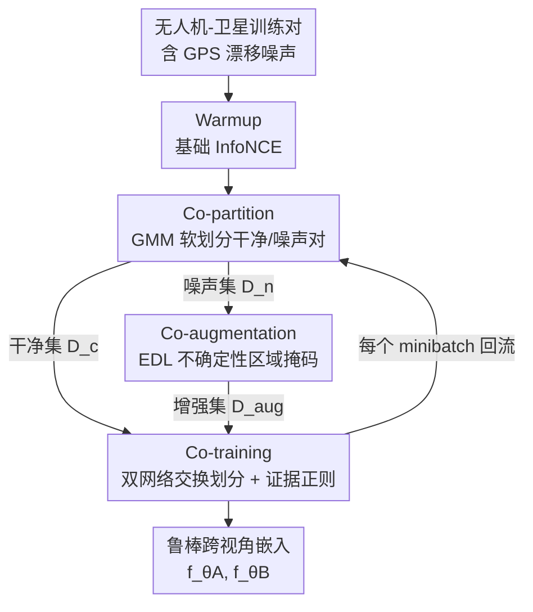

# PAUL: Uncertainty-Guided Partition and Augmentation for Robust Cross-View Geo-Localization under Noisy Correspondence

**会议**: CVPR 2026  
**论文**: [CVF Open Access](https://openaccess.thecvf.com/content/CVPR2026/html/Li_PAUL_Uncertainty-Guided_Partition_and_Augmentation_for_Robust_Cross-View_Geo-Localization_under_CVPR_2026_paper.html)  
**代码**: 无  
**领域**: 跨视角地理定位 / 遥感  
**关键词**: 噪声对应、跨视角地理定位、证据深度学习、不确定性、协同训练

## 一句话总结
针对无人机-卫星跨视角定位中 GPS 漂移导致的"半正样本"对齐噪声，PAUL 用 GMM 软划分干净/噪声对、证据深度学习做不确定性引导的区域掩码增强、再用双网络协同训练吸收噪声样本的有效信号，在不同噪声比下稳定超过现有噪声对应方法。

## 研究背景与动机
**领域现状**：跨视角地理定位（CVGL）把无人机航拍图和卫星瓦片嵌入到共享特征空间，用度量学习（典型如 InfoNCE / Sample4Geo）让匹配对在特征空间靠近，从而用卫星底图反查无人机的地理位置，支撑导航、事件检测、航测等任务。

**现有痛点**：这些方法几乎都默认训练对是"完美对齐"的——卫星瓦片正好框住无人机拍摄的那块地。但真实数据采集里，城市峡谷、电磁干扰、恶劣天气都会引起 GPS 漂移，使得按记录坐标裁出来的卫星瓦片相对真实位置发生**系统性偏移**，配对图只有**部分空间重叠**。论文实测：把 SOTA 模型 Sample4Geo 放到噪声比 0→0.9 的数据上，cross-area 的 R@1 从 55.21% 一路掉到 41.92%。

**核心矛盾**：这种噪声和经典"噪声对应"（cross-modal retrieval 里语义完全不匹配的错配对）本质不同——它不是"配错了"，而是"配偏了"。偏移对仍然保留了大量有效信息（重叠区域是真匹配），可现有噪声对应方法要么直接丢掉噪声样本（small-loss 筛选），要么把它们当负样本/锚点用，对这种半正样本都是浪费。

**本文目标**：(1) 首次形式化定义跨视角定位中的噪声对应问题 NC-CVGL；(2) 设计一个既能识别、又能**利用**半正噪声样本的鲁棒训练框架。

**切入角度**：用 IoU 量化配对的空间重叠质量，把训练对划成"良好对齐的正样本"和"部分重叠的半正噪声样本"；既然噪声对里仍有可信的局部对齐区域，那就用不确定性把这些可信区域挖出来，而不是整对扔掉。

**核心 idea**：从"激进过滤噪声"转向"挖掘噪声中的潜在信号"——用证据不确定性定位每个噪声对里值得信任的局部区域，合成伪干净监督，再让双网络互相交换划分结果协同吸收。

## 方法详解

### 整体框架
PAUL（Partition and Augmentation by Uncertainty Learning）维护**两个独立随机初始化、结构相同**的网络 A、B（均以 ViT-Base 为编码器，基于 Sample4Geo 框架），按三个协同阶段循环：先用 InfoNCE 损失分布做 **Co-partition** 把每个 batch 的对软划分成干净集和噪声集；对噪声集用 **Co-augmentation** 做证据不确定性引导的区域掩码，把高置信局部区域留下来合成增强样本；最后 **Co-training** 让两个网络**交换各自的划分结果**互相监督，干净/增强样本走标准匹配损失、残余噪声样本走证据正则。整个流程先有 1 个 warmup epoch（只跑基础 InfoNCE），之后每个 minibatch 重新拟合 GMM、重新分区、重新增强、再交换更新。

问题设定上，对每个无人机查询 $q_i$ 和卫星图 $r_j$，用 $\mathrm{IoU}(q_i,r_j)$ 衡量空间重叠，用阈值 $\tau_m=0.39$、$\tau_s=0.14$ 把训练对分成良好对齐正样本集 $\mathcal{P}$（$\mathrm{IoU}>\tau_m$）和半正噪声集 $\mathcal{N}$（$\tau_s<\mathrm{IoU}\le\tau_m$）；每对有观测标注 $y_{ij}\in\{0,1\}$ 和**隐变量** $z_{ij}$（是否为偏移但重叠的噪声对，训练时不可见）。目标是学一个嵌入 $f_\theta$ 让匹配对靠近，同时对 $z_{ij}$ 带来的对齐噪声鲁棒。

### 关键设计

**1. Co-partition：用 InfoNCE 损失分布的 GMM 软划分干净对与噪声对**

直接拿 IoU 当监督是不行的——训练时模型并不知道哪对是噪声（$z_{ij}$ 不可见）。作者的观察是：在 Sample4Geo 框架下对每个对算 InfoNCE 损失 $\ell_{\mathrm{InfoNCE}}=-\log\frac{\exp(S(q_i,r_j)/\tau)}{\sum_k\exp(S(q_i,r_k)/\tau)}$（$S$ 是特征相似度，$\tau$ 是温度），干净对（高 IoU）的损失天然聚在低值、噪声对聚在高值，整体损失分布形成一个双峰混合。于是用两分量高斯混合模型拟合损失值：

$$p(\ell\mid\theta)=\beta\cdot\mathcal{N}(\ell;\mu_c,\sigma_c^2)+(1-\beta)\cdot\mathcal{N}(\ell;\mu_n,\sigma_n^2)$$

第一分量建模干净样本、第二分量建模噪声样本，$\beta$ 是混合权重，用 EM 估参。每个样本拿到属于干净的后验概率 $w_i=\frac{\beta\,\mathcal{N}(\ell_i;\mu_c,\sigma_c^2)}{\beta\,\mathcal{N}(\ell_i;\mu_c,\sigma_c^2)+(1-\beta)\,\mathcal{N}(\ell_i;\mu_n,\sigma_n^2)}$。这是一种**软、概率化**的划分：不设硬阈值，每对同时拥有"干净"和"噪声"的隶属度，从而把半正噪声样本自然地挑出来留待后续利用，而不是一刀切丢弃。

**2. Co-augmentation：证据深度学习驱动的不确定性区域掩码，从噪声对里蒸馏可信局部**

噪声对虽偏移，但重叠区域是真信号。问题是没有 ground-truth 标注怎么知道哪块可信。作者把一个 batch（$K$ 个样本）内的匹配当作 $K$ 路分类，对样本 $i$ 取相似度 logits $s_i\in\mathbb{R}^K$（相似度矩阵第 $i$ 行），转成证据向量 $\mathbf{e}_i=\exp(\tanh(s_i/\tau))$。证据参数化一个 Dirichlet 分布，$\alpha_i=\mathbf{e}_i+1$、浓度 $A_i=\sum_k\alpha_{ik}$，于是伪类别概率的均值与方差为 $\mathbb{E}[p_{ik}]=\frac{\alpha_{ik}}{A_i}$、$\mathrm{Var}(p_{ik})=\frac{\alpha_{ik}(A_i-\alpha_{ik})}{A_i^2(A_i+1)}$，样本整体不确定性 $u_i=K/\sum_k\alpha_{ik}$。证据损失为 MSE 项加一个把 Dirichlet 拉向均匀先验的 KL 正则：

$$\ell_{\mathrm{EDL}}=\sum_{i=1}^{K}\sum_{k=1}^{K}\Big[(y_{ik}-\tfrac{\alpha_{ik}}{A_i})^2+\tfrac{\alpha_{ik}(A_i-\alpha_{ik})}{A_i^2(A_i+1)}\Big]+\lambda\,\mathrm{KL}\big(\mathrm{Dir}(\alpha_i)\,\|\,\mathrm{Dir}(\mathbf{1})\big)$$

拿到证据损失后，对输入做**梯度显著图**定位关键区域：$G_x=\big|\frac{\partial\mathcal{L}_{\mathrm{EDL}}}{\partial x}\big|$ 经通道均值池化、归一化得 $H_x$，再 $\tilde M_x=\mathbb{I}[H_x>\eta]$ 二值化滤掉低响应背景，最后 $M_x=\mathcal{C}_{\max}(\tilde M_x)$ 取最大连通分量，剔除零碎片段、只保留主要兴趣区域。被掩码后的"伪干净"样本进入增强集 $\mathcal{D}_{aug}$。这一步的巧妙之处在于：用 EDL 的不确定性当"哪里可信"的指南针，把噪声对里真正重叠的那块地抠出来当监督，而不是把整对当干净或当垃圾。

**3. Co-training：双网络交换划分结果 + 证据正则，抗确认偏差地吸收残余噪声**

即便前两步净化过，标准对比学习仍会被残余噪声带偏（确认偏差，自己信自己的错误划分）。PAUL 沿用噪声对应里的协同范式，让两个独立网络 A、B 在每次迭代**交换各自的样本划分**（干净/增强/噪声）来互相监督——A 用 B 的划分构造训练集 $\mathcal{D}^A=\mathcal{D}_c^B\cup\mathcal{D}_{aug}^B\cup\mathcal{D}_n^B$。A 的优化目标拆成两块：可靠数据（干净+增强）走标准匹配损失，残余噪声走证据项：

$$\mathcal{L}_{\mathrm{total}}^A=\underbrace{\sum_{(q_i,r_j)\in\mathcal{D}_c^B\cup\mathcal{D}_{aug}^B}\ell_{\mathrm{InfoNCE}}}_{\mathcal{L}_{match}}+\lambda_{\mathrm{EDL}}\underbrace{\sum_{(q_i,r_j)\in\mathcal{D}_n^B}\ell_{\mathrm{EDL}}}_{\mathcal{L}_{\mathrm{EDL}}}$$

证据项在这里充当**可靠性感知正则器**：通过惩罚高不确定性预测来压低不可靠样本的影响，同时让模型继续从增强后的有效信息里学判别特征。两网络互喂划分，避免单网络自我强化错误，是整套方案在高噪声下仍稳健的关键。

### 损失函数 / 训练策略
warmup 阶段只用 InfoNCE（式 4）训 1 个 epoch；之后每个 minibatch：算 InfoNCE 损失→拟合 GMM 分区→对噪声集算证据损失、生成显著图掩码增强→A、B 交换划分→按 $\mathcal{L}_{\mathrm{total}}$（式 13）联合更新。超参 $\lambda$ 平衡 EDL 内部的 KL 正则、$\lambda_{\mathrm{EDL}}$ 平衡总损失里匹配项与证据项。ViT-Base 编码器，输入 $384\times384$，Adam（初始 LR 1e−4，cosine 调度），5 epoch、batch 64，单卡 RTX 3090。

## 实验关键数据

### 主实验
两个数据集：合成大规模数据集 GTA-UAV（33,763 张无人机图，含正/半正样本，是目前唯一公开同时含正与半正样本、适配 NC-CVGL 的数据集）和作者基于 UAV-VisLoc 构建的真实数据集（6,742 对，中国 11 个区域）。指标含 Recall@K、AP、SDM@K、top-1 定位误差 Dis@1（越低越好）。

GTA-UAV cross-area，不同噪声比下 R@1（%）对比（部分代表性基线）：

| 噪声比 | InfoNCE | CREAM | GSC | RCL | PAUL |
|--------|---------|-------|-----|-----|------|
| 0% | 55.21 | 59.72 | 59.36 | 60.16 | **61.21** |
| 30% | 46.27 | 54.02 | 54.41 | 53.37 | **58.70** |
| 60% | 42.15 | 52.38 | 51.20 | 46.43 | **52.61** |

UAV-VisLoc（真实数据）R@1（%）：

| 噪声比 | InfoNCE | CRCL | GSC | PAUL |
|--------|---------|------|-----|------|
| 0% | 33.24 | 33.18 | 33.72 | **36.12** |
| 30% | 24.57 | 23.77 | 21.09 | **26.64** |

PAUL 在所有配置都拿到最高 R@1；噪声越大相对优势越明显（30% 噪声下 cross-area R@1 比次优高约 4.3 个点），印证"利用噪声"比"过滤噪声"在高噪声场景更划算。

### 消融实验
GTA-UAV cross-area、30% 噪声下逐项消融（R@1 / AP，%）：

| 配置 | R@1 ↑ | AP ↑ | 说明 |
|------|-------|------|------|
| 都不要（纯 InfoNCE） | 46.27 | 57.14 | baseline |
| 仅 $\mathcal{L}_{match}$ | 55.72 | 66.04 | 只有匹配项 |
| 仅 $\mathcal{L}_{\mathrm{EDL}}$ | 54.36 | 64.96 | 只有证据项 |
| 完整 PAUL | **58.70** | **68.74** | 两项协同 |

### 关键发现
- $\mathcal{L}_{match}$ 和 $\mathcal{L}_{\mathrm{EDL}}$ 各自单开都能从 46.27% 提到 54–56%，但二者协同才到 58.70%——干净监督稳住特征空间，不确定性驱动的学习进一步榨取难样本，互补而非冗余。
- 超参 $\lambda$（EDL 内 KL 正则系数）从 0.001 增到 0.005 全面涨点，再增则饱和或略降，说明这个平衡系数需要细调。
- 噪声比越高，PAUL 相对基线的领先幅度越大，证明其优势来自对半正噪声样本的有效利用，而非单纯的强 backbone。

## 亮点与洞察
- **把"噪声对应"重新定义成"对齐偏移"而非"语义错配"**：这是问题层面的贡献——指出 GPS 漂移产生的半正样本仍含真信号，整对丢弃是浪费，扭转了该领域"激进过滤"的默认做法。
- **证据深度学习 + 梯度显著图做区域级掩码**：用 EDL 不确定性当"哪块可信"的探针，再用证据损失对输入的梯度连通分量抠出主区域，把"哪里值得学"从对级别细化到像素/区域级别，思路可迁移到任何配对带局部噪声的检索/匹配任务。
- **双网络交换划分对抗确认偏差**：两个网络互喂各自的干净/噪声划分，避免单网络自我强化错误划分，是协同训练在带噪场景的经典但有效的用法。

## 局限与展望
- 噪声划分依赖 InfoNCE 损失分布呈现清晰双峰，若噪声分布更复杂或与干净分布重叠严重，GMM 软划分的可靠性会下降（作者未深入讨论这种退化情形）。
- IoU 阈值 $\tau_m=0.39$、$\tau_s=0.14$ 是固定值，跨数据集/平台是否需要重调、对结果多敏感未充分分析。⚠️ 这两个阈值的设定依据以原文为准。
- 评测仍以 GTA-UAV 合成数据为主，真实 UAV-VisLoc 的绝对 R@1 偏低（30% 噪声下仅 26.64%），真实场景的鲁棒性还有较大提升空间。
- 训练需双网络 + 每 minibatch 拟合 GMM + 证据梯度显著图，开销高于单网络基线，论文未给训练耗时对比。

## 相关工作与启发
- **vs 传统 small-loss 噪声对应方法（NCR / BiCro）**：它们靠 small-loss 直接筛掉或弱化噪声对，对"完全错配"有效；但 NC-CVGL 的噪声是偏移不是错配，整对丢弃浪费了重叠区的真信号，因此这些方法在表里普遍弱于 PAUL。
- **vs 把噪声当负样本/锚点的软对应方法（ESC / GSC）**：它们重新利用噪声但用法是当负样本或特征锚点；PAUL 则用 EDL 把噪声对内部的可信局部抠出来当正向监督，利用方式更精细，30% 噪声下 R@1 领先 GSC 约 4 个点。
- **vs 仅在推理期提升鲁棒的 CVGL 方法**：以往工作多在 test-time 处理视角/结构问题、仍依赖干净训练对；PAUL 直接面向**训练期**的系统性对齐噪声，补上了这一未被探索的环节。
- **vs 标准证据深度学习（EDL）用法**：EDL 通常用于分类的不确定性量化；本文把它接到跨视角匹配的相似度 logits 上、并进一步用其梯度生成空间掩码，是 EDL 在检索/定位任务里的一个新落地点。

## 评分
- 新颖性: ⭐⭐⭐⭐⭐ 首次形式化 NC-CVGL 并把噪声从"过滤对象"转为"可利用信号"，EDL 区域掩码用法新颖。
- 实验充分度: ⭐⭐⭐⭐ 两数据集多噪声比 + 8 个基线对比 + 组件/超参消融，但缺训练开销与阈值敏感性分析。
- 写作质量: ⭐⭐⭐⭐ 问题定义清晰、三阶段叙述完整，公式排版在缓存中略乱但逻辑可还原。
- 价值: ⭐⭐⭐⭐ 真实无人机定位中 GPS 漂移普遍存在，方法对带噪训练数据的实用价值明确。

<!-- RELATED:START -->

## 相关论文

- [\[CVPR 2026\] Geo2: Geometry-Guided Cross-view Geo-Localization and Image Synthesis](geo2_geometry-guided_cross-view_geo-localization_and_image_synthesis.md)
- [\[CVPR 2026\] SinGeo: Unlock Single Model's Potential for Robust Cross-View Geo-Localization](singeo_unlock_single_models_potential_for_robust_cross-view_geo-localization.md)
- [\[CVPR 2026\] Robust Remote Sensing Image–Text Retrieval with Noisy Correspondence](robust_remote_sensing_image-text_retrieval_with_noisy_correspondence.md)
- [\[CVPR 2026\] RHO: Robust Holistic OSM-Based Metric Cross-View Geo-Localization](rho_robust_holistic_osm-based_metric_cross-view_geo-localization.md)
- [\[CVPR 2026\] UniGeoRS: A Unified Benchmark for Tri-view Geo-Localization](unigeors_a_unified_benchmark_for_tri-view_geo-localization.md)

<!-- RELATED:END -->
