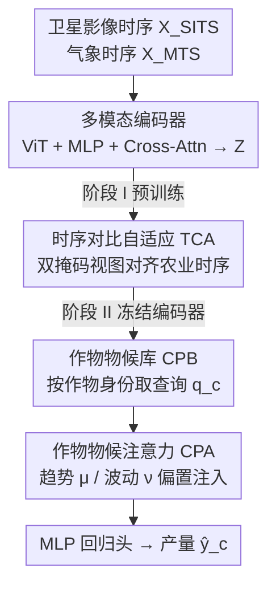

# PhenoYieldNet: Learning Crop-Aware Phenological Responses for Multi-Crop Yield Prediction

**会议**: CVPR 2026  
**论文**: [CVF Open Access](https://openaccess.thecvf.com/content/CVPR2026/html/Luo_PhenoYieldNet_Learning_Crop-Aware_Phenological_Responses_for_Multi-Crop_Yield_Prediction_CVPR_2026_paper.html)  
**代码**: https://github.com/roroyo/PhenoYieldNet  
**领域**: 遥感 / 农业作物估产  
**关键词**: 多作物估产, 作物物候, 时序注意力, 遥感基础模型, 对比自适应

## 一句话总结
PhenoYieldNet 用一套统一模型做多作物县级产量预测：靠一个「作物物候库」给每种作物分配可学习的查询向量，再用「作物物候注意力」把时序特征分解成长期趋势与短期波动并注入到注意力偏置里，配合两阶段的时序对比自适应把遥感基础模型迁移到农业时序，在 CropNet / MODIS 上全面超过单作物与多作物 SOTA。

## 研究背景与动机
**领域现状**：作物估产主流靠遥感卫星影像时序（捕捉植被发育）+ 气象时序（温度、降水等驱动因子）做时空特征提取，架构从 CNN-RNN、3D CNN、TCN 一路演化到 Transformer，近来还兴起用遥感基础模型（RSFM，如 SpectralGPT）做大规模预训练再迁移。

**现有痛点**：几乎所有方法都是**单作物**的——给玉米、棉花、大豆各训一个模型，区域也分别训练。这类模型在孤立场景有效，但无法跨作物泛化、也难适配没见过的区域；而世界各地的作物常面临相似的环境因子、养分胁迫和气候趋势，单作物孤岛式建模浪费了这些可迁移的共性知识，对数据稀缺的作物尤其不利。

**核心矛盾**：估产的本质是「气象变化 → 物候响应 → 产量」这条链，但不同作物对同一气象变量的响应方向相反。论文给出实证：小麦和棉花对平均温度（趋势）的产量响应正好相反，对温度标准差（波动）的敏感度也不同。现有方法往往把卫星和气象模态简单拼接融合，**没有显式建模气象在不同生长阶段如何调制物候**，自然也吃不下跨作物的差异。

**本文目标**：用单一模型同时捕捉作物间的**共性模式**和各自的**物候特异性**，回答「能否构建一个跨多作物泛化、又能保留作物个性的统一估产模型」。

**切入角度**：把「作物特异的物候签名」显式参数化成一组可学习向量，再让模型显式分解时序里的**长期趋势**和**短期波动**两类驱动，按作物动态调整对各生长阶段的关注。

**核心 idea**：用「作物物候库 + 物候注意力」替代简单的模态拼接，让一个共享编码器学到的潜空间被每种作物的查询向量「拉」向自己最相关的物候阶段，并用趋势/波动偏置纠正注意力焦点。

## 方法详解

### 整体框架
PhenoYieldNet 是一个 encoder-decoder。输入两路：卫星影像时序 $X_{\text{SITS}} \in \mathbb{R}^{T\times H\times W\times B}$（$T$ 个时间步、空间 $H\times W$、$B$ 个光谱波段）和气象时序 $X_{\text{MTS}} \in \mathbb{R}^{T\times N_d\times M}$（每个卫星观测周期内有 $N_d$ 个更高频记录、$M$ 个气象变量）；输出是给定作物类型 $c$ 的县级产量估计 $\hat{y}_c$。

**多模态编码器**先用 ViT 编码卫星影像、用 MLP 把气象数据投影成 embedding，再用 cross-attention 融成统一时序特征 $Z\in\mathbb{R}^{T\times d}$，即 $Z=E(X_{\text{SITS}}, X_{\text{MTS}})$。**作物感知时序解码器**再吃下 $Z$，建模作物特异的物候动态输出 $\hat{y}_c=D(Z)$。

整个框架分两阶段训练：**阶段 I** 用时序对比自适应（TCA）继续预训练编码器、让它对农业时序敏感；**阶段 II** 冻结编码器，只用 MSE 损失监督微调解码器与回归头。MSE 在对数空间计算再指回原尺度，缓解不同作物产量量级差异：

$$\mathcal{L}_{\text{MSE}} = \frac{1}{N}\sum_{i=1}^{N}\|\log\hat{y}_c^{(i)} - \log y_c^{(i)}\|_2^2$$

### 关键设计

**1. 作物物候库 CPB：给每种作物一把「物候钥匙」去检索共享潜空间**

痛点是单一共享编码器学出的潜空间是「作物无关」的，但不同作物的物候响应差异巨大，直接共享会把个性磨平。CPB 把每种作物的典型物候特征编码成一组可学习向量 $Q=\{q_c\in\mathbb{R}^d \mid c\in C\}$，每个 $q_c$ 从 $\mathcal{N}(0,1)$ 独立随机初始化。解码时按作物身份 $c$ 取出对应的 $q_c$ 当 query，它充当该作物物候签名的代理，在后续物候注意力里引导模型与共享多模态特征 $Z$ 交互，从而**只关注与该作物物候发育最相关的时序特征**。这一步是「多作物统一」能成立的关键——一个模型、一份编码器，靠查询向量切换出 $C$ 种作物的关注焦点。单作物数据集（MODIS，只有玉米）上不启用 CPB。

**2. 作物物候注意力 CPA：把时序拆成趋势 + 波动，再注入注意力偏置**

光有作物 query 还不够——它能告诉模型「这种作物哪些生长阶段大体重要」，但说不清「今年这片地因为某段异常气象，哪几个阶段格外关键」。CPA 先用一个**时序分解**把特征拆成多尺度趋势与波动。对覆盖整年周期的 $Z$，用窗口 $k\in\{3,6,12\}$ 的多尺度滑动平均池化捕捉不同时间尺度的趋势，再用可学习权重 $w_k$ 自适应聚合得到趋势分量 $\mu$，残差即波动分量 $\nu$：

$$\mu = \sum_{k\in\{3,6,12\}} w_k(Z)\cdot \text{Pool}_k(Z), \qquad \nu = Z - \mu$$

接着把趋势/波动各自投影、做自注意力并取 [CLS] 全局表示，合成一个偏置向量 $b_{ph} = \frac{1}{\sqrt{d}}\big(\lambda_\mu (W^Q_\mu\mu)(W^K_\mu\mu)^T + \lambda_\nu (W^Q_\nu\nu)(W^K_\nu\nu)^T\big)$，其中 $\lambda_\mu,\lambda_\nu$ 是趋势/波动的权重。最后把 $b_{ph}$ 注入物候引导注意力：以作物 query 为 $Q_c=W^Q q_c$、$Z$ 为 K/V，输出 $h^{pa}_c = \sigma\big(\frac{Q_c K^T}{\sqrt{d}} + b_{ph}\big)V$。直觉上，$q_c$ 负责「这类作物通常关注哪里」，$b_{ph}$ 负责「被本年特定趋势/波动影响的关键阶段再校正一下」——这正对应论文一开始的实证：小麦对平均温度（趋势）和棉花响应相反、对温度标准差（波动）敏感度不同，CPA 把这两类驱动显式拆开建模。

**3. 时序对比自适应 TCA：把通用遥感基础模型「掰」向农业时序**

编码器从在通用遥感数据上预训练的 RSFM（SpectralGPT）初始化，能迁移大规模表示，但它对作物物候模式和时序依赖不敏感，存在领域 gap。消融也证实：直接拿 RSFM 微调（不加 TCA）在棉花、大豆上反而掉点。TCA 作为阶段 I，用自监督对比学习对齐表示与作物生长的时序动态。具体地，对一个 batch 内每个样本生成两个不同掩码视图——随机独立采样掩码 $m\in\{0,1\}^T$、跨模态共享同一掩码；同一样本（同地点同年份）的两视图为正对，batch 内其他样本（不同地点）为负对，用温度 $\tau$ 的对比损失对齐：

$$\mathcal{L}_{\text{TCA}} = -\log\frac{\exp(\text{sim}(Z, Z^+)/\tau)}{\sum_{Z'\in Z^+\cup\{Z^-\}}\exp(\text{sim}(Z, Z')/\tau)}$$

掩码作用在时间维而非空间维，正是为了逼模型从可见的部分时间步推断被遮的物候阶段、从而学到时序连续性。完成后冻结编码器进入阶段 II 监督微调。

### 损失函数 / 训练策略
两阶段：阶段 I 用 $\mathcal{L}_{\text{TCA}}$ 预训练编码器 200 epoch（AdamW，$\beta=(0.9,0.95)$，weight decay 0.05，初始 lr 1e-4，20 epoch warm-up + cosine 衰减）；阶段 II 冻结编码器、用对数空间 MSE 微调解码器与回归头 100 epoch（带 early stopping，初始 lr 3e-4，5 epoch warm-up）。CropNet 上作物数 $C=4$，单作物 MODIS 上不用 CPB。阶段 II 在 $Z$ 喂入解码器前对生长阶段做时序掩码。单卡 NVIDIA A6000、PyTorch。

## 实验关键数据

数据集：CropNet（Sentinel-2 影像 + HRRR 气象，2017–2022，玉米/大豆/棉花/冬小麦四种作物）与 MODIS（MODIS 影像+气象，2003–2015，仅玉米）；均覆盖美国 11 州、县级 USDA 真值。指标：RMSE↓、$R^2$↑、Pearson 相关 Corr↑。

### 主实验（MODIS 单作物）

| 数据集 | 方法 | RMSE↓ | $R^2$↑ | Corr↑ |
|--------|------|-------|--------|-------|
| MODIS | MMST-ViT (2023) | 8.12 | 0.400 | 0.632 |
| MODIS | UNet-ConvLSTM (2024) | 6.33 | 0.586 | 0.766 |
| MODIS | MMVF (2025) | 10.13 | 0.260 | 0.510 |
| MODIS | **PhenoYieldNet** | **5.95** | **0.663** | **0.814** |

相比次优的 UNet-ConvLSTM，RMSE 降 0.38、$R^2$ 提 0.077。

### CropNet 多作物对比（节选 RMSE / $R^2$）

| 方法 | 玉米 RMSE↓ | 棉花 RMSE↓ | 大豆 RMSE↓ | 冬小麦 RMSE↓ |
|------|-----------|-----------|-----------|-------------|
| RF (2001) | 21.96 | 85.32 | 6.76 | 10.98 |
| MMST-ViT (2023) | 25.98 | 88.25 | 6.58 | 10.16 |
| PhenoYieldNet-SC（单作物各训） | 17.27 | 71.22 | 6.22 | 8.20 |
| YieldNet (2021, 多作物) | 30.96 | 87.41 | 9.23 | 9.46 |
| **PhenoYieldNet-MC（统一 $C=4$）** | **16.52** | **54.88** | 5.91 | 8.32 |

多作物统一模型 PhenoYieldNet-MC 在玉米/棉花上甚至胜过自家单作物版，棉花 RMSE 从 71.22 一路压到 54.88；唯一被多作物 baseline YieldNet 比较的场景下全面领先（YieldNet 的 CNN 架构在 $R^2$/Corr 上近乎崩溃，玉米 $R^2$ 仅 0.015）。⚠️ 棉花单位是 lb/ac、其余作物是 bu/ac，跨作物的 RMSE 绝对值不可直接横比。

### 消融实验（CropNet，玉米列示例）

| 配置 | 玉米 RMSE↓ | 玉米 $R^2$↑ | 说明 |
|------|-----------|------------|------|
| (1) 从零训练 | 21.28 | 0.363 | 无 RSFM 知识 |
| (2) 仅 RSFM 预训练（无 TCA） | 18.23 | 0.331 | 直接微调，棉花/大豆反而掉点 |
| (3) w/o CPB & CPA | 17.93 | 0.365 | 去掉作物感知解码器 |
| (4) w/o CPA（仅标准时序注意力） | 17.83 | 0.482 | 保留 CPB |
| (\*) **完整 PhenoYieldNet** | **16.52** | **0.516** | 全部组件 |

### 关键发现
- **RSFM 不能直接用**：配置 (2) 直接微调 RSFM 在棉花（RMSE 86.22）、大豆上明显恶化，印证通用遥感表示与农业时序存在领域 gap，TCA 是必要的桥。
- **CPA 贡献显著**：从 (4) 到完整模型，棉花 RMSE 由 61.60 降到 54.88、$R^2$ 升到 0.638，说明显式分解趋势/波动确实抓住了气象对物候的调制。
- **少数类作物受限**：冬小麦样本少且物候反常（全年生长周期，其余作物多为夏播），多作物训练对它略有妥协——这也是其他方法的共同短板。
- **波动区更稳**：把测试集按气象变异系数分稳定区（底 70%）/ 剧烈区（top 30%），PhenoYieldNet 在剧烈区的改进幅度远大于稳定区，显示对气象波动的鲁棒性。
- **实时估产**：随生长季观测累积，RMSE 总体下降；冬小麦在 4 月附近有暂时回升，作者归因于模型开始整合晚播作物的新信号、共享表示空间发生变化。

## 亮点与洞察
- **把「作物个性」做成可学习查询向量**：CPB 用一组 query 向量当作物物候签名，让单一共享编码器靠「换钥匙」服务多作物——这套「共享主干 + 类别 query」的思路可迁移到任何「多子类共性+个性」的回归/预测任务。
- **趋势/波动显式分解再注入注意力偏置**：不是把气象简单拼进特征，而是用多尺度池化拆出趋势 $\mu$、残差当波动 $\nu$，分别算注意力偏置 $b_{ph}$ 注入。这种「分解-偏置」比直接拼接更可解释，也直接对应了论文观察到的「不同作物对趋势/波动响应相反」的实证。
- **时间维掩码的对比预训练**：TCA 把掩码打在时间步而非空间 patch、跨模态共享掩码，专门逼模型学时序连续性，是把通用遥感基础模型适配到「时序敏感」下游任务的一个轻量做法。

## 局限与展望
- 作者承认：CPB 按**作物物种**粒度构建，难泛化到训练域外的未见作物；未来可用向量量化在「单元/元素」级别自适应选码，跨作物共享更细的物候基元。
- 多作物训练范式对分布漂移和类不平衡敏感，少数类作物（冬小麦）存在性能差距。
- 自己的观察：实验只在美国 11 州、四种主粮作物上验证，气候带和作物种类都较单一，跨大洲/热带作物的泛化未知；$\lambda_\mu,\lambda_\nu$、池化窗口 $\{3,6,12\}$ 等超参对应的物候尺度假设是否对所有作物成立，缺乏敏感性分析。

## 相关工作与启发
- **vs YieldNet（唯一已有多作物方法）**：YieldNet 用共享 CNN 主干 + 玉米/大豆两个独立预测头，本文用 Transformer + 作物物候库/注意力。区别在于 YieldNet 没显式建模气象驱动与作物物候的动态交互，CNN 架构难捕捉时序变化、易产生低方差预测（$R^2$/Corr 崩坏）；PhenoYieldNet 在四作物上全面更稳。
- **vs MMST-ViT / MMVF（多模态单作物）**：它们也融卫星+气象（MMST-ViT 用 Transformer+MLP+跨模态 Transformer，MMVF 用门控自适应融合），但都是单作物、且把气象当作普通待融合模态；本文把气象拆成趋势/波动并以注意力偏置注入，且做到一个模型覆盖多作物。
- **vs 直接用遥感基础模型（RSFM）**：RSFM 学的是通用视觉表示，不含作物物候与气象动态知识；本文用 TCA 自监督对齐缩小领域 gap，比直接微调（消融配置 2）更稳。

## 评分
- 新颖性: ⭐⭐⭐⭐ 把作物物候显式参数化为查询库 + 趋势/波动分解注入注意力，且首次系统做统一多作物估产，角度扎实。
- 实验充分度: ⭐⭐⭐⭐ 两数据集、单/多作物双设置、组件消融 + 实时/鲁棒性分析齐全；但作物与地域较单一。
- 写作质量: ⭐⭐⭐⭐ 动机由实证（趋势/波动相反响应）驱动，方法叙述清晰，图表对应明确。
- 价值: ⭐⭐⭐⭐ 多作物统一估产对数据稀缺作物和农业决策有实用价值，代码开源。

<!-- RELATED:START -->

## 相关论文

- [\[CVPR 2026\] YieldSAT: A Multimodal Benchmark Dataset for High-Resolution Crop Yield Prediction](yieldsat_a_multimodal_benchmark_dataset_for_high-resolution_crop_yield_predictio.md)
- [\[CVPR 2026\] GeoSANE: Learning Geospatial Representations from Models, Not Data](geosane_learning_geospatial_representations_from_models_not_data.md)
- [\[CVPR 2026\] Orthogonal Spatial-Aware Multi-View Anchor Graph Clustering for Incomplete Remote Sensing Data](orthogonal_spatial-aware_multi-view_anchor_graph_clustering_for_incomplete_remot.md)
- [\[CVPR 2026\] HySeg: Learning Generative Priors for Structure-Aware Remote Sensing Segmentation](hyseg_learning_generative_priors_for_structure-aware_remote_sensing_segmentation.md)
- [\[CVPR 2026\] QuCNet: Quantum Deep Learning Driven Multi-Circuit Network for Remote Sensing Image Classification](qucnet_quantum_deep_learning_driven_multi-circuit_network_for_remote_sensing_ima.md)

<!-- RELATED:END -->
